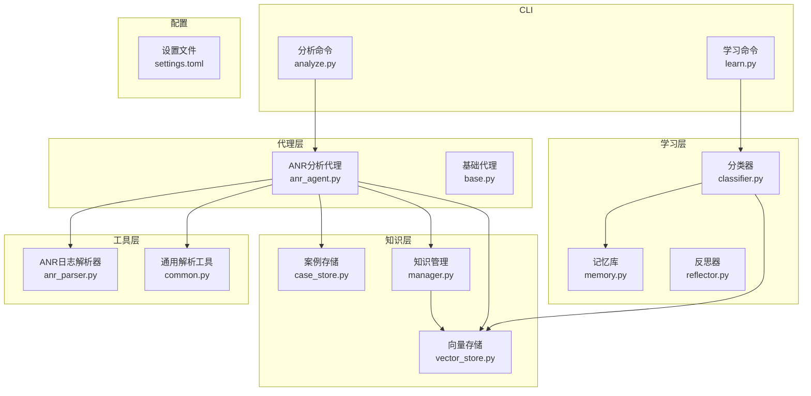
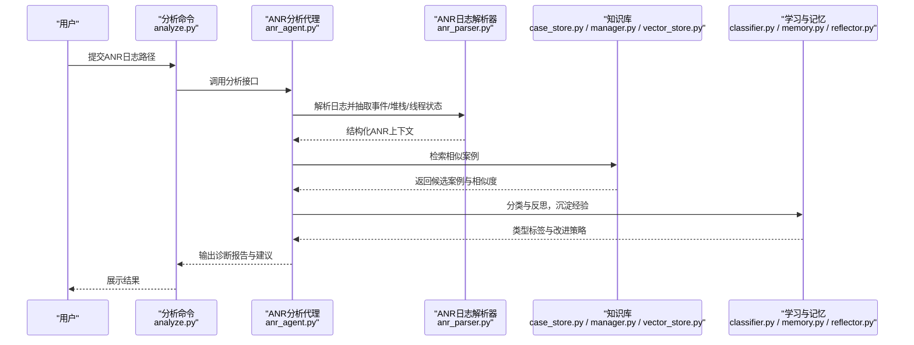
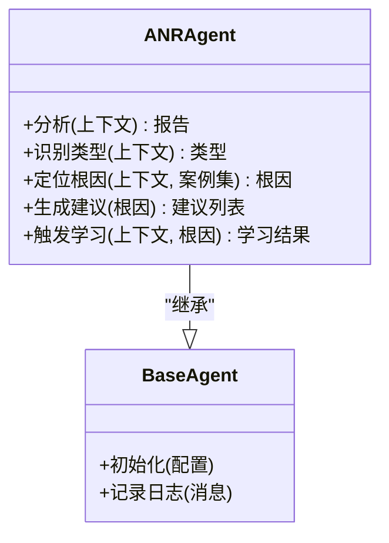
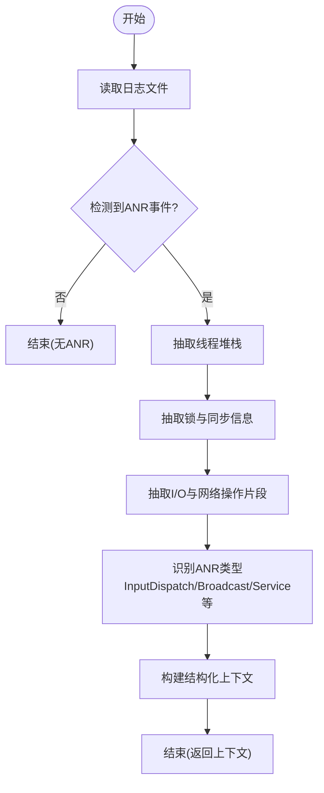
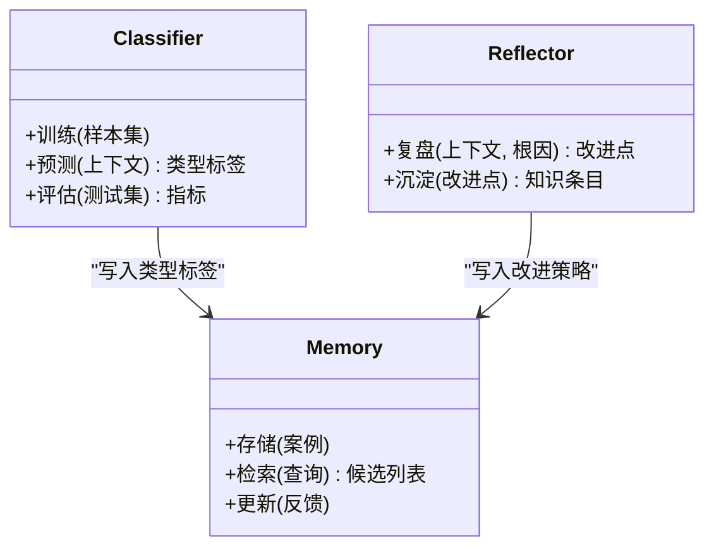
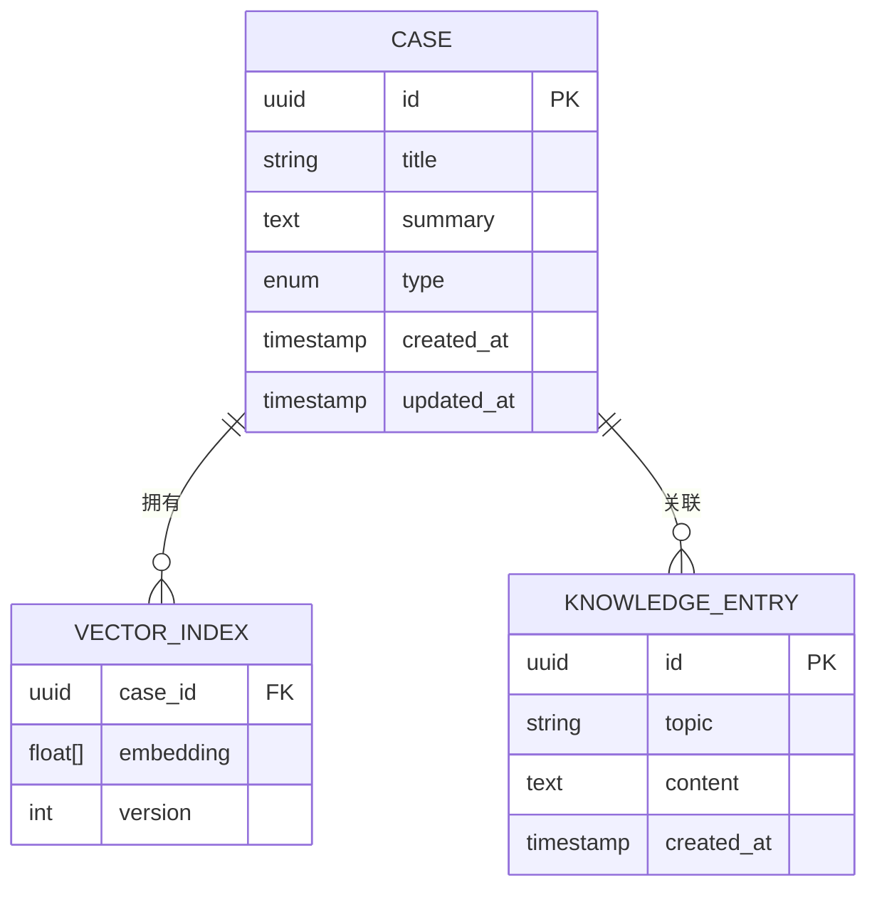
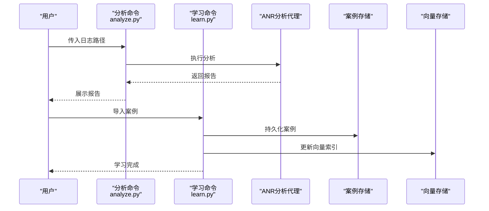
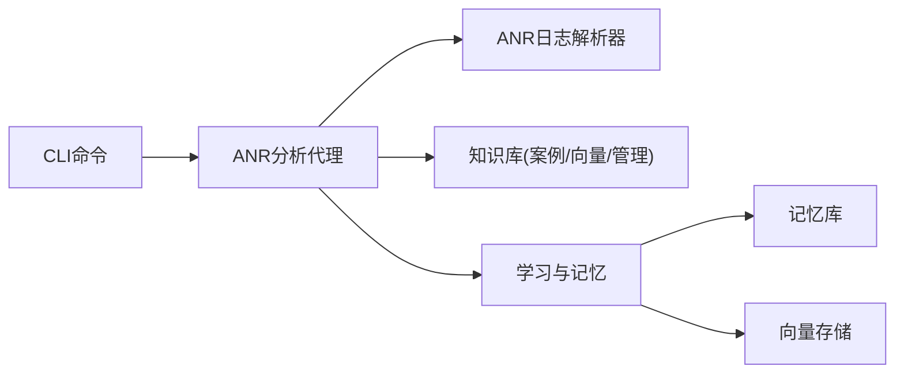

# ANR分析代理

<cite>
**本文引用的文件**   
- [anr_agent.py](file://src/jirin/agents/anr_agent.py)
- [base.py](file://src/jirin/agents/base.py)
- [anr_parser.py](file://src/jirin/tools/log_parser/anr_parser.py)
- [common.py](file://src/jirin/tools/log_parser/common.py)
- [classifier.py](file://src/jirin/learning/classifier.py)
- [memory.py](file://src/jirin/learning/memory.py)
- [reflector.py](file://src/jirin/learning/reflector.py)
- [case_store.py](file://src/jirin/knowledge/case_store.py)
- [manager.py](file://src/jirin/knowledge/manager.py)
- [vector_store.py](file://src/jirin/knowledge/vector_store.py)
- [analyze.py](file://src/jirin/cli/commands/analyze.py)
- [learn.py](file://src/jirin/cli/commands/learn.py)
- [settings.toml](file://config/settings.toml)
- [analysis_flow.md](file://src/jirin/knowledge/static/analysis_flow.md)
- [anr_principles.md](file://src/jirin/knowledge/static/anr_principles.md)
</cite>

## 目录
1. [简介](#简介)
2. [项目结构](#项目结构)
3. [核心组件](#核心组件)
4. [架构总览](#架构总览)
5. [详细组件分析](#详细组件分析)
6. [依赖关系分析](#依赖关系分析)
7. [性能考虑](#性能考虑)
8. [故障排查指南](#故障排查指南)
9. [结论](#结论)
10. [附录](#附录)

## 简介
本技术文档面向ANR（Application Not Responding）分析代理，系统性阐述其检测原理、分析逻辑与诊断方法。内容覆盖：
- ANR日志解析流程与线程状态分析
- 主线程阻塞检测与根因定位算法
- ANR类型分类（如InputDispatchTimeout、BroadcastTimeout等）
- 案例学习机制：相似案例匹配与知识沉淀
- 配置参数、性能优化与调试技巧

## 项目结构
本项目采用“代理+工具+知识+学习”的分层组织方式：
- agents：各类分析代理，包含ANR分析代理
- tools/log_parser：日志解析器，包含ANR日志解析器
- learning：学习与记忆模块，提供分类、检索与反思
- knowledge：知识库与向量存储，用于案例管理与相似度检索
- cli：命令行入口与命令实现，包括分析与学习命令
- config：配置文件

图表来源
- [anr_agent.py:1-200](file://src/jirin/agents/anr_agent.py#L1-L200)
- [anr_parser.py:1-200](file://src/jirin/tools/log_parser/anr_parser.py#L1-L200)
- [classifier.py:1-200](file://src/jirin/learning/classifier.py#L1-L200)
- [case_store.py:1-200](file://src/jirin/knowledge/case_store.py#L1-L200)
- [manager.py:1-200](file://src/jirin/knowledge/manager.py#L1-L200)
- [vector_store.py:1-200](file://src/jirin/knowledge/vector_store.py#L1-L200)
- [analyze.py:1-200](file://src/jirin/cli/commands/analyze.py#L1-L200)
- [learn.py:1-200](file://src/jirin/cli/commands/learn.py#L1-L200)
- [settings.toml:1-200](file://config/settings.toml#L1-L200)

章节来源
- [anr_agent.py:1-200](file://src/jirin/agents/anr_agent.py#L1-L200)
- [anr_parser.py:1-200](file://src/jirin/tools/log_parser/anr_parser.py#L1-L200)
- [classifier.py:1-200](file://src/jirin/learning/classifier.py#L1-L200)
- [case_store.py:1-200](file://src/jirin/knowledge/case_store.py#L1-L200)
- [manager.py:1-200](file://src/jirin/knowledge/manager.py#L1-L200)
- [vector_store.py:1-200](file://src/jirin/knowledge/vector_store.py#L1-L200)
- [analyze.py:1-200](file://src/jirin/cli/commands/analyze.py#L1-L200)
- [learn.py:1-200](file://src/jirin/cli/commands/learn.py#L1-L200)
- [settings.toml:1-200](file://config/settings.toml#L1-L200)

## 核心组件
- ANR分析代理：负责协调日志解析、线程状态分析、主线程阻塞检测、根因定位与方案推荐，并驱动案例学习与知识沉淀。
- ANR日志解析器：从系统日志中抽取ANR事件、堆栈信息、线程状态、输入分发超时与广播超时等关键片段。
- 学习与记忆：基于分类器对ANR进行类型识别，结合向量存储进行相似案例检索，并通过反思器沉淀经验。
- 知识库：维护案例元数据、向量索引与知识条目，支持查询与更新。
- CLI命令：提供分析入口与学习入口，串联上述组件完成端到端流程。

章节来源
- [anr_agent.py:1-200](file://src/jirin/agents/anr_agent.py#L1-L200)
- [anr_parser.py:1-200](file://src/jirin/tools/log_parser/anr_parser.py#L1-L200)
- [classifier.py:1-200](file://src/jirin/learning/classifier.py#L1-L200)
- [case_store.py:1-200](file://src/jirin/knowledge/case_store.py#L1-L200)
- [manager.py:1-200](file://src/jirin/knowledge/manager.py#L1-L200)
- [vector_store.py:1-200](file://src/jirin/knowledge/vector_store.py#L1-L200)
- [analyze.py:1-200](file://src/jirin/cli/commands/analyze.py#L1-L200)
- [learn.py:1-200](file://src/jirin/cli/commands/learn.py#L1-L200)

## 架构总览
ANR分析代理的整体工作流如下：
- 输入：ANR相关日志或导出文件
- 解析：通过ANR日志解析器提取结构化信息
- 分析：识别ANR类型、分析线程状态、检测主线程阻塞、定位根因
- 决策：生成诊断报告与修复建议
- 学习：将新案例入库，更新向量索引，提升后续匹配精度
- 输出：分析报告、可执行建议、知识条目

图表来源
- [analyze.py:1-200](file://src/jirin/cli/commands/analyze.py#L1-L200)
- [anr_agent.py:1-200](file://src/jirin/agents/anr_agent.py#L1-L200)
- [anr_parser.py:1-200](file://src/jirin/tools/log_parser/anr_parser.py#L1-L200)
- [case_store.py:1-200](file://src/jirin/knowledge/case_store.py#L1-L200)
- [manager.py:1-200](file://src/jirin/knowledge/manager.py#L1-L200)
- [vector_store.py:1-200](file://src/jirin/knowledge/vector_store.py#L1-L200)
- [classifier.py:1-200](file://src/jirin/learning/classifier.py#L1-L200)
- [memory.py:1-200](file://src/jirin/learning/memory.py#L1-L200)
- [reflector.py:1-200](file://src/jirin/learning/reflector.py#L1-L200)

## 详细组件分析

### ANR分析代理
职责与流程：
- 接收解析后的ANR上下文，进行类型识别与根因推断
- 结合知识库的相似案例，辅助定位问题范围与影响面
- 生成诊断结论与修复建议，并触发学习流程以沉淀知识

图表来源
- [anr_agent.py:1-200](file://src/jirin/agents/anr_agent.py#L1-L200)
- [base.py:1-200](file://src/jirin/agents/base.py#L1-L200)

章节来源
- [anr_agent.py:1-200](file://src/jirin/agents/anr_agent.py#L1-L200)
- [base.py:1-200](file://src/jirin/agents/base.py#L1-L200)

### ANR日志解析器
功能要点：
- 从系统日志中识别ANR事件头与时间戳
- 抽取线程堆栈、锁持有信息、输入分发与广播处理片段
- 构建结构化上下文供代理使用

图表来源
- [anr_parser.py:1-200](file://src/jirin/tools/log_parser/anr_parser.py#L1-L200)
- [common.py:1-200](file://src/jirin/tools/log_parser/common.py#L1-L200)

章节来源
- [anr_parser.py:1-200](file://src/jirin/tools/log_parser/anr_parser.py#L1-L200)
- [common.py:1-200](file://src/jirin/tools/log_parser/common.py#L1-L200)

### 学习与记忆
能力说明：
- 分类器：基于特征与规则对ANR进行分类，提高类型识别准确率
- 记忆库：维护历史案例与经验，支持快速检索与复用
- 反思器：对分析结果进行复盘，提炼改进策略并更新知识库

图表来源
- [classifier.py:1-200](file://src/jirin/learning/classifier.py#L1-L200)
- [memory.py:1-200](file://src/jirin/learning/memory.py#L1-L200)
- [reflector.py:1-200](file://src/jirin/learning/reflector.py#L1-L200)

章节来源
- [classifier.py:1-200](file://src/jirin/learning/classifier.py#L1-L200)
- [memory.py:1-200](file://src/jirin/learning/memory.py#L1-L200)
- [reflector.py:1-200](file://src/jirin/learning/reflector.py#L1-L200)

### 知识库与向量存储
职责：
- 案例存储：保存ANR案例的元数据、上下文摘要与诊断结果
- 向量存储：为案例建立向量索引，支持语义相似度检索
- 知识管理：统一增删改查，维护版本与一致性

图表来源
- [case_store.py:1-200](file://src/jirin/knowledge/case_store.py#L1-L200)
- [vector_store.py:1-200](file://src/jirin/knowledge/vector_store.py#L1-L200)
- [manager.py:1-200](file://src/jirin/knowledge/manager.py#L1-L200)

章节来源
- [case_store.py:1-200](file://src/jirin/knowledge/case_store.py#L1-L200)
- [vector_store.py:1-200](file://src/jirin/knowledge/vector_store.py#L1-L200)
- [manager.py:1-200](file://src/jirin/knowledge/manager.py#L1-L200)

### CLI命令
- 分析命令：接收日志路径，调用ANR分析代理，输出诊断报告
- 学习命令：接收案例数据，驱动分类、记忆与反思，更新知识库

图表来源
- [analyze.py:1-200](file://src/jirin/cli/commands/analyze.py#L1-L200)
- [learn.py:1-200](file://src/jirin/cli/commands/learn.py#L1-L200)
- [case_store.py:1-200](file://src/jirin/knowledge/case_store.py#L1-L200)
- [vector_store.py:1-200](file://src/jirin/knowledge/vector_store.py#L1-L200)

章节来源
- [analyze.py:1-200](file://src/jirin/cli/commands/analyze.py#L1-L200)
- [learn.py:1-200](file://src/jirin/cli/commands/learn.py#L1-L200)

## 依赖关系分析
- 代理层依赖工具层的日志解析器，获取结构化上下文
- 代理层依赖知识库进行相似案例检索与知识增强
- 学习层依赖记忆与向量存储，形成闭环的知识沉淀
- CLI作为入口，编排各层协作

图表来源
- [analyze.py:1-200](file://src/jirin/cli/commands/analyze.py#L1-L200)
- [anr_agent.py:1-200](file://src/jirin/agents/anr_agent.py#L1-L200)
- [anr_parser.py:1-200](file://src/jirin/tools/log_parser/anr_parser.py#L1-L200)
- [case_store.py:1-200](file://src/jirin/knowledge/case_store.py#L1-L200)
- [vector_store.py:1-200](file://src/jirin/knowledge/vector_store.py#L1-L200)
- [manager.py:1-200](file://src/jirin/knowledge/manager.py#L1-L200)
- [classifier.py:1-200](file://src/jirin/learning/classifier.py#L1-L200)
- [memory.py:1-200](file://src/jirin/learning/memory.py#L1-L200)

章节来源
- [analyze.py:1-200](file://src/jirin/cli/commands/analyze.py#L1-L200)
- [anr_agent.py:1-200](file://src/jirin/agents/anr_agent.py#L1-L200)
- [anr_parser.py:1-200](file://src/jirin/tools/log_parser/anr_parser.py#L1-L200)
- [case_store.py:1-200](file://src/jirin/knowledge/case_store.py#L1-L200)
- [vector_store.py:1-200](file://src/jirin/knowledge/vector_store.py#L1-L200)
- [manager.py:1-200](file://src/jirin/knowledge/manager.py#L1-L200)
- [classifier.py:1-200](file://src/jirin/learning/classifier.py#L1-L200)
- [memory.py:1-200](file://src/jirin/learning/memory.py#L1-L200)

## 性能考虑
- 日志解析阶段：
  - 优先增量解析与分块读取，避免大文件一次性加载导致内存峰值
  - 正则与模式匹配尽量复用编译对象，减少重复开销
- 相似案例检索：
  - 向量索引按批次更新，降低频繁写入带来的抖动
  - 检索时限制Top-K数量，平衡召回率与响应时间
- 分析与推理：
  - 根因定位采用启发式规则与轻量模型结合，避免重型计算
  - 缓存中间结果，避免重复计算
- 输出与持久化：
  - 报告生成采用流式写入，减少内存占用
  - 知识库更新采用事务性操作，保证一致性与回滚能力

[本节为通用性能指导，不直接分析具体文件]

## 故障排查指南
常见问题与定位步骤：
- 日志缺失或不完整：
  - 确认日志采集范围是否覆盖ANR前后时间段
  - 检查日志级别与过滤条件，确保关键线程与系统服务日志开启
- 解析失败：
  - 核对日志格式与编码，必要时进行预处理与清洗
  - 查看解析器的错误日志，定位无法识别的模式
- 根因误判：
  - 增加相似案例对比，验证类型识别准确性
  - 调整分类器阈值与规则权重，提升泛化能力
- 知识库不一致：
  - 校验向量索引版本与案例元数据的一致性
  - 执行索引重建与去重清理

章节来源
- [anr_parser.py:1-200](file://src/jirin/tools/log_parser/anr_parser.py#L1-L200)
- [classifier.py:1-200](file://src/jirin/learning/classifier.py#L1-L200)
- [vector_store.py:1-200](file://src/jirin/knowledge/vector_store.py#L1-L200)
- [manager.py:1-200](file://src/jirin/knowledge/manager.py#L1-L200)

## 结论
ANR分析代理通过“解析—分析—检索—学习”的闭环，实现对ANR事件的自动化诊断与持续进化。借助知识库与向量检索，系统能够在复杂场景下快速定位根因并提供可执行的修复建议；同时，学习与反思机制使系统在运行中不断积累知识与经验，提升长期稳定性与准确性。

[本节为总结性内容，不直接分析具体文件]

## 附录

### 配置参数参考
- 分析相关：
  - 日志路径与轮转策略
  - 解析窗口大小与超时阈值
  - 相似案例检索Top-K与相似度阈值
- 学习与记忆：
  - 分类器训练样本来源与更新频率
  - 向量索引维度与刷新周期
  - 反思策略与知识沉淀规则
- 性能与资源：
  - 并发解析线程数
  - 内存上限与GC策略
  - 磁盘空间与备份策略

章节来源
- [settings.toml:1-200](file://config/settings.toml#L1-L200)

### 分析方法与原则
- 分析方法：
  - 先识别ANR类型，再聚焦主线程与关键子系统
  - 结合锁竞争、I/O阻塞与长任务执行进行综合判断
- 原则：
  - 最小改动原则：优先定位最可能的根因，避免过度发散
  - 证据链原则：堆栈、锁、时间线三者相互印证
  - 可复现原则：在隔离环境中验证修复效果

章节来源
- [analysis_flow.md:1-200](file://src/jirin/knowledge/static/analysis_flow.md#L1-L200)
- [anr_principles.md:1-200](file://src/jirin/knowledge/static/anr_principles.md#L1-L200)