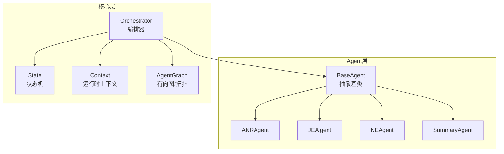
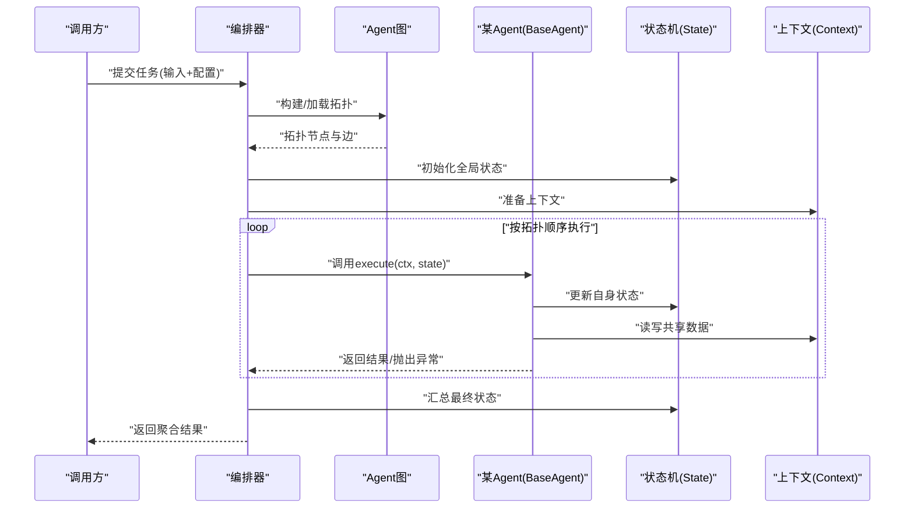
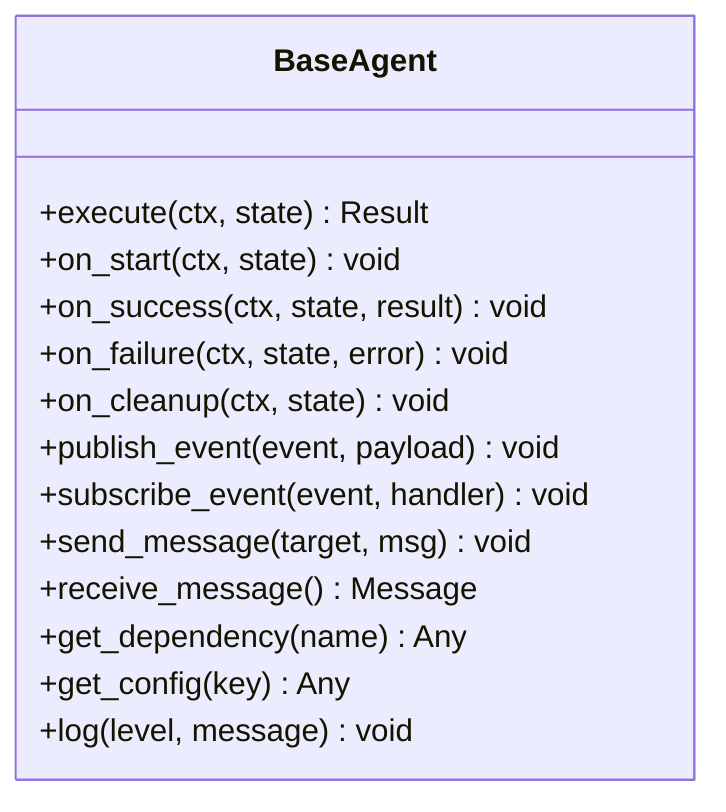
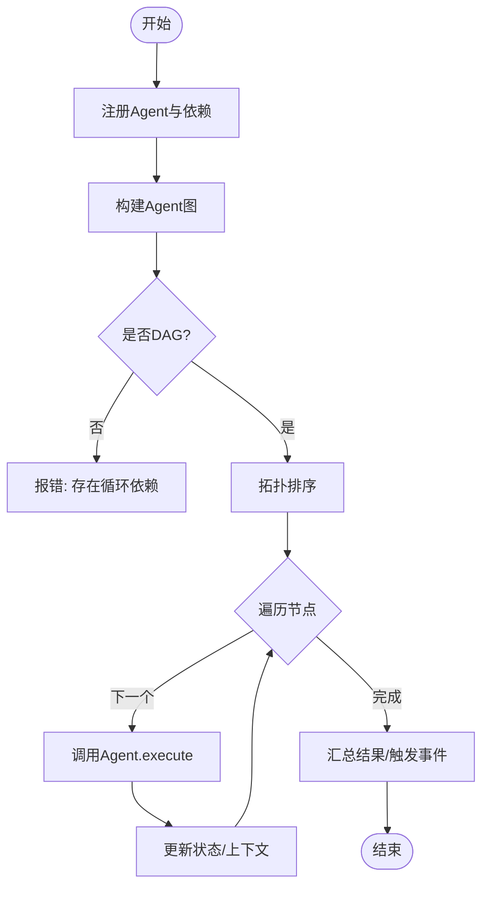
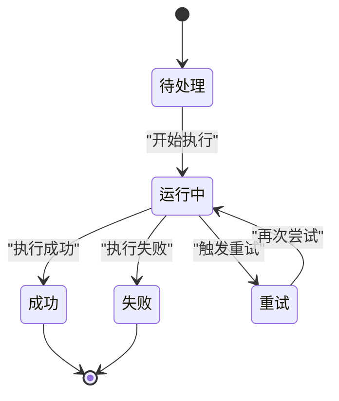
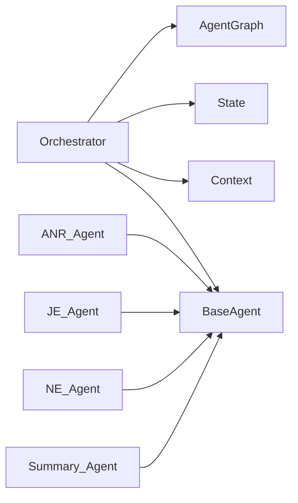

# Agent基础框架

<cite>
**本文引用的文件**   
- [src/jirin/agents/base.py](file://src/jirin/agents/base.py)
- [src/jirin/core/orchestrator.py](file://src/jirin/core/orchestrator.py)
- [src/jirin/core/state.py](file://src/jirin/core/state.py)
- [src/jirin/core/context.py](file://src/jirin/core/context.py)
- [src/jirin/core/agent_graph.py](file://src/jirin/core/agent_graph.py)
- [src/jirin/agents/anr_agent.py](file://src/jirin/agents/anr_agent.py)
- [src/jirin/agents/je_agent.py](file://src/jirin/agents/je_agent.py)
- [src/jirin/agents/ne_agent.py](file://src/jirin/agents/ne_agent.py)
- [src/jirin/agents/summary_agent.py](file://src/jirin/agents/summary_agent.py)
</cite>

## 目录
1. [简介](#简介)
2. [项目结构](#项目结构)
3. [核心组件](#核心组件)
4. [架构总览](#架构总览)
5. [详细组件分析](#详细组件分析)
6. [依赖关系分析](#依赖关系分析)
7. [性能考虑](#性能考虑)
8. [故障排查指南](#故障排查指南)
9. [结论](#结论)
10. [附录：自定义Agent开发指南](#附录自定义agent开发指南)

## 简介
本文件面向Jirin的Agent基础框架，聚焦BaseAgent类的架构设计、核心接口与生命周期管理；阐述Agent状态管理、消息传递协议与执行策略；说明Agent注册机制、依赖注入模式与错误处理框架；并提供完整的自定义Agent开发指南，包括继承BaseAgent的最佳实践、必需实现的方法与可选扩展点。同时记录Agent间通信模式、事件系统与回调机制，帮助读者快速构建可组合、可扩展的分析型Agent。

## 项目结构
围绕Agent基础框架的关键代码主要分布在以下模块：
- agents：定义BaseAgent抽象基类与各具体Agent实现（ANR、JE、NE、Summary）
- core：编排器Orchestrator、状态机State、上下文Context、Agent图AgentGraph等基础设施
- tools/knowledge/export/learning：工具与知识、导出、学习等横向能力（本文不展开）

图表来源
- [src/jirin/agents/base.py](file://src/jirin/agents/base.py)
- [src/jirin/core/orchestrator.py](file://src/jirin/core/orchestrator.py)
- [src/jirin/core/state.py](file://src/jirin/core/state.py)
- [src/jirin/core/context.py](file://src/jirin/core/context.py)
- [src/jirin/core/agent_graph.py](file://src/jirin/core/agent_graph.py)
- [src/jirin/agents/anr_agent.py](file://src/jirin/agents/anr_agent.py)
- [src/jirin/agents/je_agent.py](file://src/jirin/agents/je_agent.py)
- [src/jirin/agents/ne_agent.py](file://src/jirin/agents/ne_agent.py)
- [src/jirin/agents/summary_agent.py](file://src/jirin/agents/summary_agent.py)

章节来源
- [src/jirin/agents/base.py](file://src/jirin/agents/base.py)
- [src/jirin/core/orchestrator.py](file://src/jirin/core/orchestrator.py)
- [src/jirin/core/state.py](file://src/jirin/core/state.py)
- [src/jirin/core/context.py](file://src/jirin/core/context.py)
- [src/jirin/core/agent_graph.py](file://src/jirin/core/agent_graph.py)
- [src/jirin/agents/anr_agent.py](file://src/jirin/agents/anr_agent.py)
- [src/jirin/agents/je_agent.py](file://src/jirin/agents/je_agent.py)
- [src/jirin/agents/ne_agent.py](file://src/jirin/agents/ne_agent.py)
- [src/jirin/agents/summary_agent.py](file://src/jirin/agents/summary_agent.py)

## 核心组件
- BaseAgent：所有Agent的抽象基类，定义统一的生命周期钩子、消息收发、事件订阅/发布、依赖访问、配置读取、日志与异常封装等通用能力。
- Orchestrator：负责Agent实例的创建、注册、依赖解析、拓扑排序与调度执行，协调多Agent协作流程。
- State：集中维护Agent运行期状态（如待处理、运行中、成功、失败、重试等），提供状态转换与校验。
- Context：贯穿一次任务执行的共享上下文，包含输入参数、中间结果、临时存储、外部服务句柄等。
- AgentGraph：以有向图形式描述Agent间的依赖与调用顺序，支持拓扑排序与循环检测。

章节来源
- [src/jirin/agents/base.py](file://src/jirin/agents/base.py)
- [src/jirin/core/orchestrator.py](file://src/jirin/core/orchestrator.py)
- [src/jirin/core/state.py](file://src/jirin/core/state.py)
- [src/jirin/core/context.py](file://src/jirin/core/context.py)
- [src/jirin/core/agent_graph.py](file://src/jirin/core/agent_graph.py)

## 架构总览
下图展示了从请求进入、编排到各Agent执行、状态流转与结果汇总的整体流程。

图表来源
- [src/jirin/core/orchestrator.py](file://src/jirin/core/orchestrator.py)
- [src/jirin/core/agent_graph.py](file://src/jirin/core/agent_graph.py)
- [src/jirin/core/state.py](file://src/jirin/core/state.py)
- [src/jirin/core/context.py](file://src/jirin/core/context.py)
- [src/jirin/agents/base.py](file://src/jirin/agents/base.py)

## 详细组件分析

### BaseAgent：抽象基类与生命周期
- 职责边界
  - 定义统一的Agent入口方法（例如execute），供编排器调用。
  - 提供生命周期钩子（如on_start、on_success、on_failure、on_cleanup），便于扩展横切逻辑。
  - 封装消息发送/接收、事件订阅/发布、依赖获取、配置读取、日志与异常包装。
- 关键接口约定
  - execute：核心业务入口，接收上下文与状态，返回执行结果或抛出受控异常。
  - on_start/on_success/on_failure/on_cleanup：可选覆盖，用于资源准备、清理与副作用记录。
  - publish_event/subscribe_event：基于事件总线进行解耦通信。
  - send_message/receive_message：点对点或广播式消息通道。
  - get_dependency/get_config：通过依赖注入与配置中心获取外部能力与参数。
- 典型使用方式
  - 子类仅关注业务逻辑，其余由BaseAgent提供默认实现与保障。

图表来源
- [src/jirin/agents/base.py](file://src/jirin/agents/base.py)

章节来源
- [src/jirin/agents/base.py](file://src/jirin/agents/base.py)

### Orchestrator：编排与调度
- 职责边界
  - 注册Agent实例并建立依赖关系。
  - 基于AgentGraph进行拓扑排序与执行调度。
  - 管理全局状态机与上下文，保证幂等与可恢复性。
  - 统一错误处理与重试策略。
- 关键流程
  - 注册阶段：收集Agent元信息（名称、依赖、优先级）。
  - 构建阶段：生成有向无环图，校验循环依赖。
  - 执行阶段：按拓扑顺序依次调用各Agent.execute。
  - 收尾阶段：汇总状态、触发事件、释放资源。

图表来源
- [src/jirin/core/orchestrator.py](file://src/jirin/core/orchestrator.py)
- [src/jirin/core/agent_graph.py](file://src/jirin/core/agent_graph.py)
- [src/jirin/core/state.py](file://src/jirin/core/state.py)
- [src/jirin/core/context.py](file://src/jirin/core/context.py)

章节来源
- [src/jirin/core/orchestrator.py](file://src/jirin/core/orchestrator.py)
- [src/jirin/core/agent_graph.py](file://src/jirin/core/agent_graph.py)
- [src/jirin/core/state.py](file://src/jirin/core/state.py)
- [src/jirin/core/context.py](file://src/jirin/core/context.py)

### State：状态机
- 状态集合
  - 常见状态包括：待处理、运行中、成功、失败、重试、取消等。
- 状态转换规则
  - 由Orchestrator在Agent执行前后驱动转换，确保一致性。
  - 提供合法性校验，防止非法跳转。
- 与Agent交互
  - Agent可通过上下文访问当前状态，但建议由编排器统一推进。

图表来源
- [src/jirin/core/state.py](file://src/jirin/core/state.py)

章节来源
- [src/jirin/core/state.py](file://src/jirin/core/state.py)

### Context：运行时上下文
- 作用
  - 在一次任务执行期间，为所有Agent提供共享的数据空间与外部服务句柄。
- 内容
  - 输入参数、中间产物、临时缓存、外部依赖引用（设备、网络、存储等）。
- 安全与可见性
  - 提供命名空间隔离与访问控制，避免跨Agent污染。

章节来源
- [src/jirin/core/context.py](file://src/jirin/core/context.py)

### AgentGraph：有向图与拓扑
- 功能
  - 表示Agent之间的依赖与调用顺序。
  - 提供拓扑排序、环路检测、入度/出度查询等。
- 约束
  - 必须为有向无环图（DAG），否则编排无法进行。

章节来源
- [src/jirin/core/agent_graph.py](file://src/jirin/core/agent_graph.py)

### 具体Agent示例
- ANRAgent/JEA gent/NEAgent/SummaryAgent
  - 均继承自BaseAgent，实现各自的execute逻辑。
  - 通过Context读写共享数据，通过事件系统与其他Agent解耦协作。
  - 借助依赖注入获取工具链（如日志解析、设备操作、搜索等）。

章节来源
- [src/jirin/agents/anr_agent.py](file://src/jirin/agents/anr_agent.py)
- [src/jirin/agents/je_agent.py](file://src/jirin/agents/je_agent.py)
- [src/jirin/agents/ne_agent.py](file://src/jirin/agents/ne_agent.py)
- [src/jirin/agents/summary_agent.py](file://src/jirin/agents/summary_agent.py)

## 依赖关系分析
- 耦合与内聚
  - BaseAgent高内聚地封装了通用能力，降低具体Agent复杂度。
  - Orchestrator作为唯一编排者，集中管理依赖与流程，提升整体内聚。
- 直接/间接依赖
  - 具体Agent依赖BaseAgent提供的通用接口。
  - Orchestrator依赖AgentGraph、State、Context进行流程编排。
- 外部集成点
  - 通过依赖注入接入工具库（设备、日志解析、搜索等），保持松耦合。

图表来源
- [src/jirin/core/orchestrator.py](file://src/jirin/core/orchestrator.py)
- [src/jirin/core/agent_graph.py](file://src/jirin/core/agent_graph.py)
- [src/jirin/core/state.py](file://src/jirin/core/state.py)
- [src/jirin/core/context.py](file://src/jirin/core/context.py)
- [src/jirin/agents/base.py](file://src/jirin/agents/base.py)
- [src/jirin/agents/anr_agent.py](file://src/jirin/agents/anr_agent.py)
- [src/jirin/agents/je_agent.py](file://src/jirin/agents/je_agent.py)
- [src/jirin/agents/ne_agent.py](file://src/jirin/agents/ne_agent.py)
- [src/jirin/agents/summary_agent.py](file://src/jirin/agents/summary_agent.py)

章节来源
- [src/jirin/core/orchestrator.py](file://src/jirin/core/orchestrator.py)
- [src/jirin/core/agent_graph.py](file://src/jirin/core/agent_graph.py)
- [src/jirin/core/state.py](file://src/jirin/core/state.py)
- [src/jirin/core/context.py](file://src/jirin/core/context.py)
- [src/jirin/agents/base.py](file://src/jirin/agents/base.py)
- [src/jirin/agents/anr_agent.py](file://src/jirin/agents/anr_agent.py)
- [src/jirin/agents/je_agent.py](file://src/jirin/agents/je_agent.py)
- [src/jirin/agents/ne_agent.py](file://src/jirin/agents/ne_agent.py)
- [src/jirin/agents/summary_agent.py](file://src/jirin/agents/summary_agent.py)

## 性能考虑
- 拓扑执行顺序优化：尽量将耗时短、无阻塞的Agent前置，减少后续等待。
- 并行与批处理：对无依赖的Agent可考虑并发执行（需结合Orchestrator扩展）。
- 上下文大小控制：避免在Context中存放过大对象，必要时使用持久化存储。
- 事件与消息去重：在高吞吐场景下注意事件风暴与重复消费问题。
- 重试退避：对不稳定依赖采用指数退避与熔断策略。

[本节为通用指导，无需源码引用]

## 故障排查指南
- 常见问题定位
  - 循环依赖：检查AgentGraph构建阶段是否检测到环。
  - 状态不一致：核对Orchestrator的状态推进路径与Agent内部状态变更是否一致。
  - 上下文污染：确认不同Agent写入的键名是否存在冲突。
  - 事件未触发：验证事件名与订阅者是否正确匹配。
- 诊断手段
  - 启用详细日志，记录每个阶段的输入输出与异常堆栈。
  - 在on_failure/on_cleanup钩子中打印关键上下文快照。
  - 使用最小复现用例逐步缩小范围。

章节来源
- [src/jirin/core/orchestrator.py](file://src/jirin/core/orchestrator.py)
- [src/jirin/core/state.py](file://src/jirin/core/state.py)
- [src/jirin/core/context.py](file://src/jirin/core/context.py)
- [src/jirin/agents/base.py](file://src/jirin/agents/base.py)

## 结论
BaseAgent为Agent提供了统一的能力底座，配合Orchestrator、State、Context与AgentGraph，形成高内聚、低耦合的可编排执行框架。通过事件与消息机制，Agent之间可实现灵活协作；通过依赖注入与配置中心，外部能力得以平滑接入。遵循本文的开发指南，可以快速构建稳定、可观测、可演进的Agent体系。

[本节为总结，无需源码引用]

## 附录：自定义Agent开发指南

### 最佳实践清单
- 继承BaseAgent并实现execute方法，专注业务逻辑。
- 使用on_start/on_success/on_failure/on_cleanup进行资源准备与清理。
- 通过Context读写共享数据，避免直接持有长生命周期对象。
- 使用事件系统进行解耦通信，谨慎使用点对点消息。
- 通过依赖注入获取外部能力，避免硬编码。
- 对异常进行分类处理，并在on_failure中记录必要上下文。

### 必需实现的方法
- execute：核心执行入口，接收上下文与状态，返回结果或抛出受控异常。

### 可选扩展点
- 生命周期钩子：on_start、on_success、on_failure、on_cleanup。
- 事件订阅：subscribe_event，监听其他Agent发出的事件。
- 消息通道：send_message/receive_message，实现更细粒度的通信。
- 配置读取：get_config，按需读取配置项。
- 依赖获取：get_dependency，按需获取外部服务或工具。

### Agent注册与依赖注入
- 注册：在Orchestrator中注册Agent实例及其依赖声明。
- 依赖注入：通过名称解析依赖对象，避免紧耦合。
- 拓扑构建：根据依赖关系自动生成执行顺序。

### 消息传递协议
- 事件模型：基于事件名的发布/订阅，适合一对多通知。
- 消息模型：点对点或广播的消息通道，适合需要应答的场景。
- 幂等与去重：建议在消费者侧实现幂等处理与去重逻辑。

### 错误处理框架
- 异常分类：区分可重试与不可重试错误。
- 重试策略：结合状态机与退避算法。
- 兜底与降级：在on_failure中提供降级路径与告警。

### 示例参考
- 参考现有具体Agent的实现风格与组织方式，如ANRAgent、JEA gent、NEAgent、SummaryAgent。

章节来源
- [src/jirin/agents/base.py](file://src/jirin/agents/base.py)
- [src/jirin/core/orchestrator.py](file://src/jirin/core/orchestrator.py)
- [src/jirin/core/state.py](file://src/jirin/core/state.py)
- [src/jirin/core/context.py](file://src/jirin/core/context.py)
- [src/jirin/agents/anr_agent.py](file://src/jirin/agents/anr_agent.py)
- [src/jirin/agents/je_agent.py](file://src/jirin/agents/je_agent.py)
- [src/jirin/agents/ne_agent.py](file://src/jirin/agents/ne_agent.py)
- [src/jirin/agents/summary_agent.py](file://src/jirin/agents/summary_agent.py)