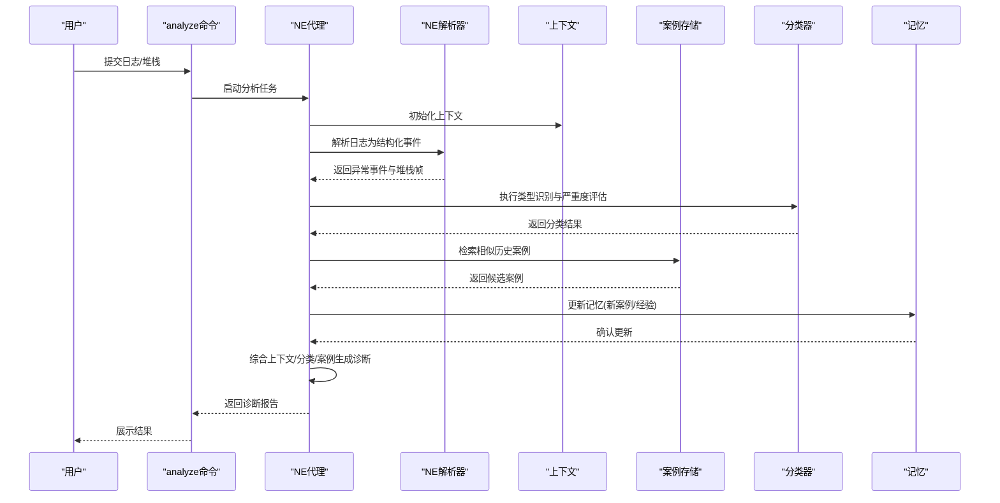
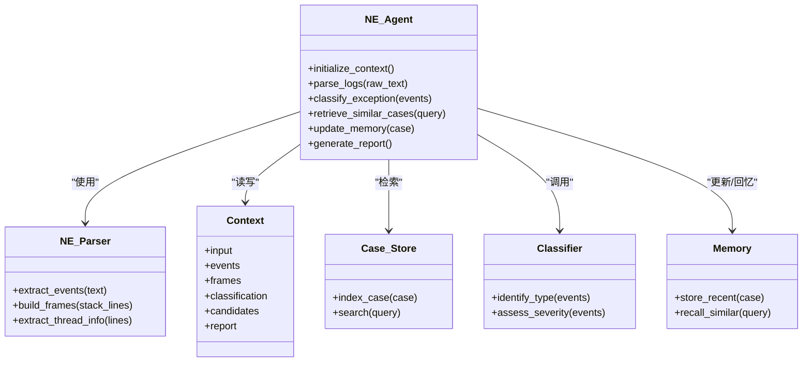
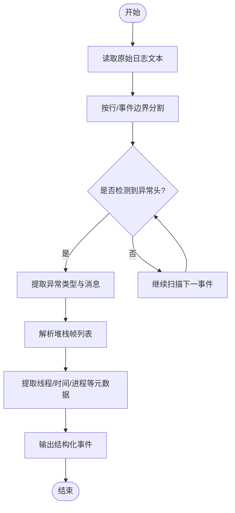
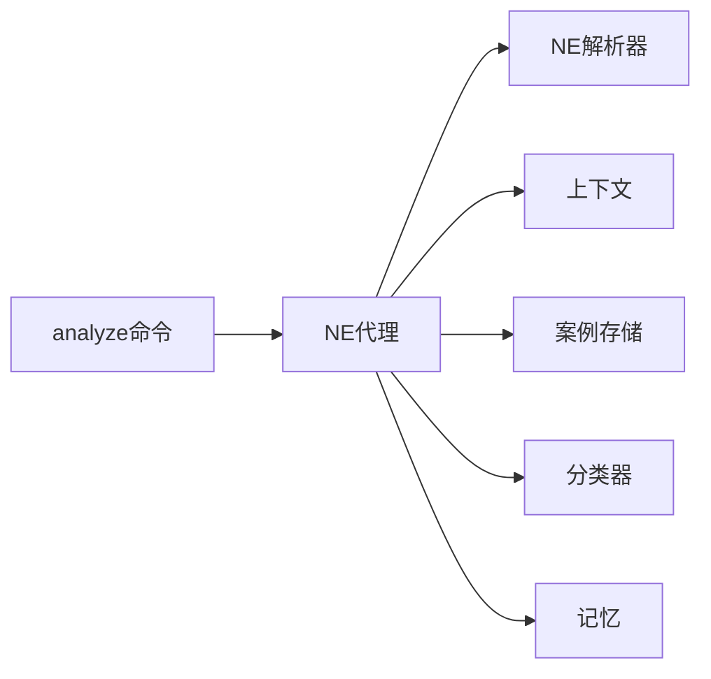

# Java异常分析代理

<cite>
**本文引用的文件**   
- [src/jirin/agents/ne_agent.py](file://src/jirin/agents/ne_agent.py)
- [src/jirin/tools/log_parser/ne_parser.py](file://src/jirin/tools/log_parser/ne_parser.py)
- [src/jirin/core/context.py](file://src/jirin/core/context.py)
- [src/jirin/knowledge/case_store.py](file://src/jirin/knowledge/case_store.py)
- [src/jirin/learning/classifier.py](file://src/jirin/learning/classifier.py)
- [src/jirin/learning/memory.py](file://src/jirin/learning/memory.py)
- [src/jirin/cli/commands/analyze.py](file://src/jirin/cli/commands/analyze.py)
- [config/settings.toml](file://config/settings.toml)
</cite>

## 目录
1. [简介](#简介)
2. [项目结构](#项目结构)
3. [核心组件](#核心组件)
4. [架构总览](#架构总览)
5. [详细组件分析](#详细组件分析)
6. [依赖关系分析](#依赖关系分析)
7. [性能考虑](#性能考虑)
8. [故障排除指南](#故障排除指南)
9. [结论](#结论)
10. [附录](#附录)

## 简介
本技术文档面向Java异常分析代理，聚焦于以下目标：
- 深入解析Java异常堆栈跟踪的算法与流程
- 实现异常类型识别与错误分类机制
- 覆盖常见Java异常模式（如空指针、类转换、内存溢出等）的检测规则与修复建议生成
- 提供异常上下文分析、调用链追踪与根本原因定位方法
- 记录异常学习机制、历史案例匹配与智能诊断能力
- 给出配置选项、性能调优与故障排除指南

该代理以Python实现，通过日志解析器抽取异常信息，结合知识管理与学习模块进行归类、检索与推理，最终输出可操作的诊断报告与修复建议。

## 项目结构
本项目采用分层与按功能域组织相结合的结构：
- agents：各领域分析代理（包含NE代理用于Native Error分析）
- tools/log_parser：日志解析器（包含NE解析器）
- core：运行时上下文与编排
- knowledge：案例存储与向量检索
- learning：分类器与记忆模块
- cli：命令行入口与分析命令
- config：配置文件

```mermaid
graph TB
subgraph "CLI"
CLI["analyze命令"]
end
subgraph "Agents"
NEA["NE代理"]
end
subgraph "Tools"
NEP["NE解析器"]
end
subgraph "Core"
Ctx["上下文"]
end
subgraph "Knowledge"
CS["案例存储"]
end
subgraph "Learning"
CLS["分类器"]
MEM["记忆"]
end
CLI --> NEA
NEA --> NEP
NEA --> Ctx
NEA --> CS
NEA --> CLS
NEA --> MEM
```

图表来源
- [src/jirin/cli/commands/analyze.py](file://src/jirin/cli/commands/analyze.py)
- [src/jirin/agents/ne_agent.py](file://src/jirin/agents/ne_agent.py)
- [src/jirin/tools/log_parser/ne_parser.py](file://src/jirin/tools/log_parser/ne_parser.py)
- [src/jirin/core/context.py](file://src/jirin/core/context.py)
- [src/jirin/knowledge/case_store.py](file://src/jirin/knowledge/case_store.py)
- [src/jirin/learning/classifier.py](file://src/jirin/learning/classifier.py)
- [src/jirin/learning/memory.py](file://src/jirin/learning/memory.py)

章节来源
- [src/jirin/cli/commands/analyze.py](file://src/jirin/cli/commands/analyze.py)
- [src/jirin/agents/ne_agent.py](file://src/jirin/agents/ne_agent.py)
- [src/jirin/tools/log_parser/ne_parser.py](file://src/jirin/tools/log_parser/ne_parser.py)
- [src/jirin/core/context.py](file://src/jirin/core/context.py)
- [src/jirin/knowledge/case_store.py](file://src/jirin/knowledge/case_store.py)
- [src/jirin/learning/classifier.py](file://src/jirin/learning/classifier.py)
- [src/jirin/learning/memory.py](file://src/jirin/learning/memory.py)

## 核心组件
- NE代理：负责协调NE日志解析、上下文构建、案例检索、分类与记忆更新，并生成诊断结果。
- NE解析器：从原始日志中抽取异常事件、堆栈帧、线程信息与时间戳等结构化数据。
- 上下文：维护一次分析会话的状态、输入输出、中间产物与元数据。
- 案例存储：持久化历史案例，支持按标签、关键字或语义相似度检索。
- 分类器：基于规则与特征对异常进行类型识别与严重度评估。
- 记忆：缓存近期相似案例与诊断经验，提升后续分析的命中率与效率。

章节来源
- [src/jirin/agents/ne_agent.py](file://src/jirin/agents/ne_agent.py)
- [src/jirin/tools/log_parser/ne_parser.py](file://src/jirin/tools/log_parser/ne_parser.py)
- [src/jirin/core/context.py](file://src/jirin/core/context.py)
- [src/jirin/knowledge/case_store.py](file://src/jirin/knowledge/case_store.py)
- [src/jirin/learning/classifier.py](file://src/jirin/learning/classifier.py)
- [src/jirin/learning/memory.py](file://src/jirin/learning/memory.py)

## 架构总览
整体流程由CLI触发，NE代理驱动解析、分析与学习闭环，最终输出诊断报告。



图表来源
- [src/jirin/cli/commands/analyze.py](file://src/jirin/cli/commands/analyze.py)
- [src/jirin/agents/ne_agent.py](file://src/jirin/agents/ne_agent.py)
- [src/jirin/tools/log_parser/ne_parser.py](file://src/jirin/tools/log_parser/ne_parser.py)
- [src/jirin/core/context.py](file://src/jirin/core/context.py)
- [src/jirin/knowledge/case_store.py](file://src/jirin/knowledge/case_store.py)
- [src/jirin/learning/classifier.py](file://src/jirin/learning/classifier.py)
- [src/jirin/learning/memory.py](file://src/jirin/learning/memory.py)

## 详细组件分析

### NE代理（Native Error Agent）
职责与行为
- 接收原始日志或堆栈文本，委托解析器提取结构化异常事件。
- 在上下文中累积分析阶段产物（事件、帧、分类、候选案例）。
- 调用分类器进行异常类型识别与严重度评估。
- 检索历史案例，结合当前上下文进行对比与修正。
- 更新记忆，沉淀诊断经验，提高后续命中率。
- 汇总生成诊断报告，包括根因假设、影响范围、修复建议与验证步骤。

关键交互
- 与解析器：获取异常事件、线程、堆栈帧、时间线。
- 与分类器：应用规则与特征进行类型识别。
- 与案例存储：按标签/关键字/相似度检索。
- 与记忆：写入新案例、读取近期相似经验。



图表来源
- [src/jirin/agents/ne_agent.py](file://src/jirin/agents/ne_agent.py)
- [src/jirin/tools/log_parser/ne_parser.py](file://src/jirin/tools/log_parser/ne_parser.py)
- [src/jirin/core/context.py](file://src/jirin/core/context.py)
- [src/jirin/knowledge/case_store.py](file://src/jirin/knowledge/case_store.py)
- [src/jirin/learning/classifier.py](file://src/jirin/learning/classifier.py)
- [src/jirin/learning/memory.py](file://src/jirin/learning/memory.py)

章节来源
- [src/jirin/agents/ne_agent.py](file://src/jirin/agents/ne_agent.py)

### NE解析器（Native Error Parser）
职责与行为
- 将原始日志文本切分为事件序列，识别异常头、异常消息、堆栈帧、线程信息等。
- 构建堆栈帧列表，保留类名、方法名、文件名与行号等元数据。
- 提取时间戳、进程/线程标识、设备信息（若存在），便于关联分析。

处理流程


图表来源
- [src/jirin/tools/log_parser/ne_parser.py](file://src/jirin/tools/log_parser/ne_parser.py)

章节来源
- [src/jirin/tools/log_parser/ne_parser.py](file://src/jirin/tools/log_parser/ne_parser.py)

### 上下文（Context）
职责与行为
- 作为一次分析会话的数据载体，贯穿解析、分类、检索、学习与报告生成阶段。
- 保存输入源、中间产物（事件、帧）、分类结果、候选案例与最终报告。
- 提供统一的访问接口，确保各组件间状态一致。

章节来源
- [src/jirin/core/context.py](file://src/jirin/core/context.py)

### 案例存储（Case Store）
职责与行为
- 索引历史案例，支持按标签、关键字与语义相似度检索。
- 为NE代理提供候选案例集合，辅助根因定位与修复建议生成。

章节来源
- [src/jirin/knowledge/case_store.py](file://src/jirin/knowledge/case_store.py)

### 分类器（Classifier）
职责与行为
- 基于规则与特征对异常进行类型识别与严重度评估。
- 支持扩展新的异常模式与规则集，持续完善识别能力。

章节来源
- [src/jirin/learning/classifier.py](file://src/jirin/learning/classifier.py)

### 记忆（Memory）
职责与行为
- 缓存近期相似案例与诊断经验，提升后续分析的命中率与效率。
- 支持召回最近N条相关经验，辅助快速决策。

章节来源
- [src/jirin/learning/memory.py](file://src/jirin/learning/memory.py)

### CLI分析命令（analyze）
职责与行为
- 提供命令行入口，接收日志路径或标准输入。
- 初始化上下文并调度NE代理完成分析。
- 输出结构化诊断报告至控制台或文件。

章节来源
- [src/jirin/cli/commands/analyze.py](file://src/jirin/cli/commands/analyze.py)

## 依赖关系分析
组件间的直接依赖如下：
- analyze命令依赖NE代理
- NE代理依赖解析器、上下文、案例存储、分类器、记忆
- 解析器仅依赖基础文本处理能力
- 分类器与记忆可独立扩展



图表来源
- [src/jirin/cli/commands/analyze.py](file://src/jirin/cli/commands/analyze.py)
- [src/jirin/agents/ne_agent.py](file://src/jirin/agents/ne_agent.py)
- [src/jirin/tools/log_parser/ne_parser.py](file://src/jirin/tools/log_parser/ne_parser.py)
- [src/jirin/core/context.py](file://src/jirin/core/context.py)
- [src/jirin/knowledge/case_store.py](file://src/jirin/knowledge/case_store.py)
- [src/jirin/learning/classifier.py](file://src/jirin/learning/classifier.py)
- [src/jirin/learning/memory.py](file://src/jirin/learning/memory.py)

章节来源
- [src/jirin/cli/commands/analyze.py](file://src/jirin/cli/commands/analyze.py)
- [src/jirin/agents/ne_agent.py](file://src/jirin/agents/ne_agent.py)
- [src/jirin/tools/log_parser/ne_parser.py](file://src/jirin/tools/log_parser/ne_parser.py)
- [src/jirin/core/context.py](file://src/jirin/core/context.py)
- [src/jirin/knowledge/case_store.py](file://src/jirin/knowledge/case_store.py)
- [src/jirin/learning/classifier.py](file://src/jirin/learning/classifier.py)
- [src/jirin/learning/memory.py](file://src/jirin/learning/memory.py)

## 性能考虑
- 解析阶段
  - 流式读取大日志文件，避免一次性加载到内存。
  - 预编译正则表达式，减少重复开销。
  - 对堆栈帧解析进行批处理，降低对象创建频率。
- 检索与学习
  - 案例存储建立倒排索引与向量索引，平衡精确与模糊匹配。
  - 记忆模块设置容量上限与淘汰策略，防止无限增长。
- 分类与推理
  - 规则引擎短路评估，优先命中高概率分支。
  - 并行检索候选案例，合并去重后排序。
- 资源控制
  - 限制单次分析的最大事件数与帧深度。
  - 超时保护与中断信号处理，避免长时间阻塞。

[本节为通用指导，不直接分析具体文件]

## 故障排除指南
常见问题与排查要点
- 日志格式不兼容
  - 检查解析器的事件边界划分是否正确。
  - 确认异常头与堆栈帧的匹配规则是否覆盖目标平台版本差异。
- 误分类或漏分类
  - 审查分类器规则集，补充缺失模式。
  - 增加训练样本与案例标注，提升相似度检索质量。
- 性能瓶颈
  - 监控解析与检索阶段的耗时，定位热点函数。
  - 调整批次大小、索引刷新频率与记忆容量。
- 上下文状态不一致
  - 校验上下文在各阶段的读写一致性。
  - 增加断言与日志埋点，快速定位异常传播路径。

章节来源
- [src/jirin/tools/log_parser/ne_parser.py](file://src/jirin/tools/log_parser/ne_parser.py)
- [src/jirin/learning/classifier.py](file://src/jirin/learning/classifier.py)
- [src/jirin/knowledge/case_store.py](file://src/jirin/knowledge/case_store.py)
- [src/jirin/learning/memory.py](file://src/jirin/learning/memory.py)
- [src/jirin/core/context.py](file://src/jirin/core/context.py)

## 结论
本代理通过“解析—分类—检索—学习—报告”的闭环流程，实现对Java异常的高效分析与智能诊断。借助规则与案例协同，系统能够在复杂调用链中快速定位根因并提供可操作的修复建议。随着案例库与规则的持续扩充，诊断准确率与响应速度将稳步提升。

[本节为总结性内容，不直接分析具体文件]

## 附录

### 配置选项（settings.toml）
以下为常用配置项说明（示例字段，实际以配置文件为准）：
- 解析器
  - max_stack_depth：最大堆栈深度限制
  - event_batch_size：事件批处理大小
- 分类器
  - rule_timeout_ms：规则评估超时
  - severity_thresholds：严重度阈值映射
- 案例存储
  - index_path：索引存储路径
  - similarity_top_k：相似度检索Top-K
- 记忆
  - memory_capacity：记忆容量上限
  - recall_window_minutes：召回时间窗口
- 输出
  - report_format：报告格式（文本/JSON）
  - output_dir：输出目录

章节来源
- [config/settings.toml](file://config/settings.toml)