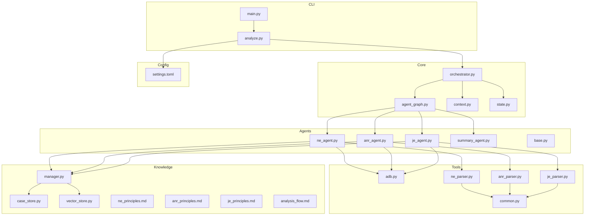
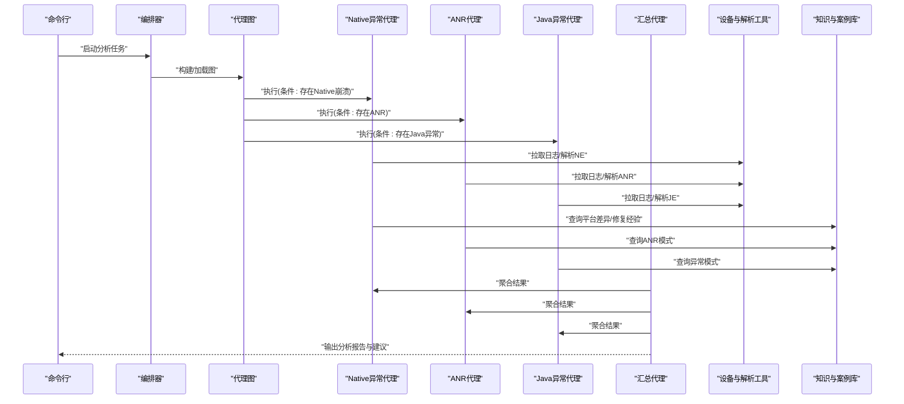
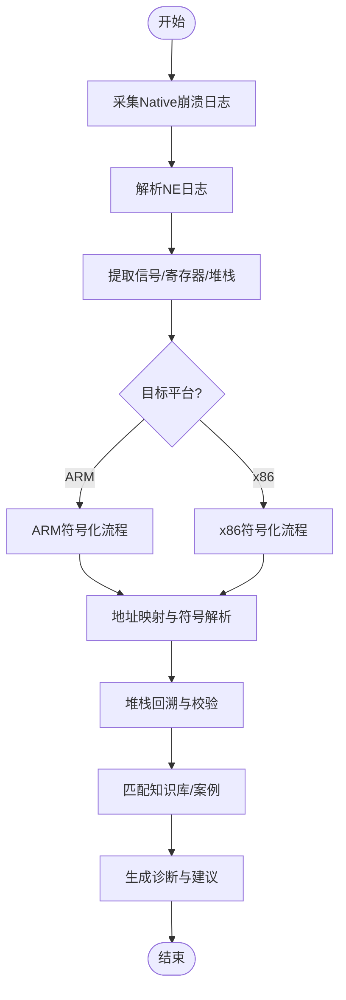
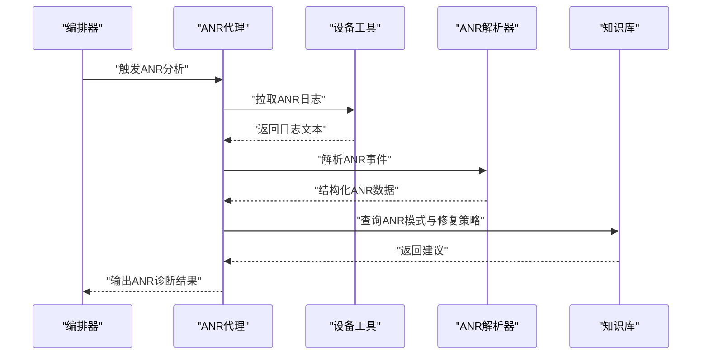
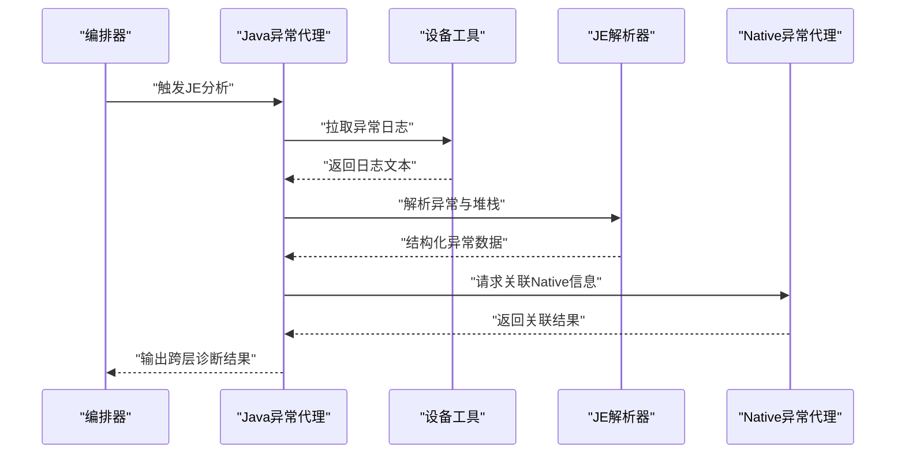
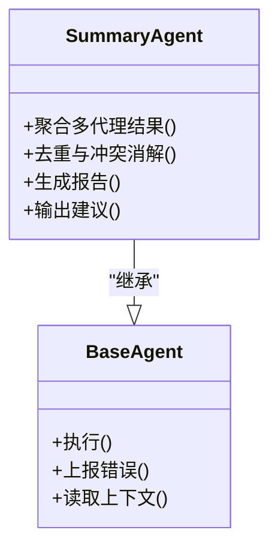
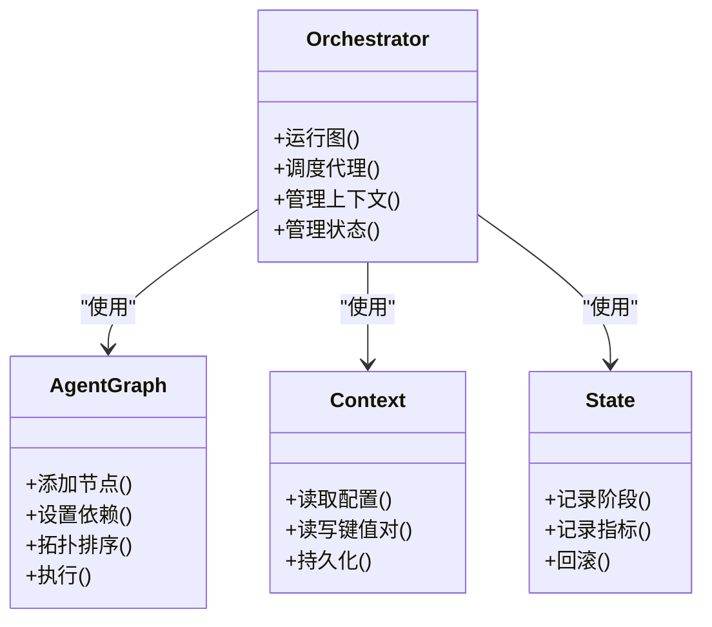
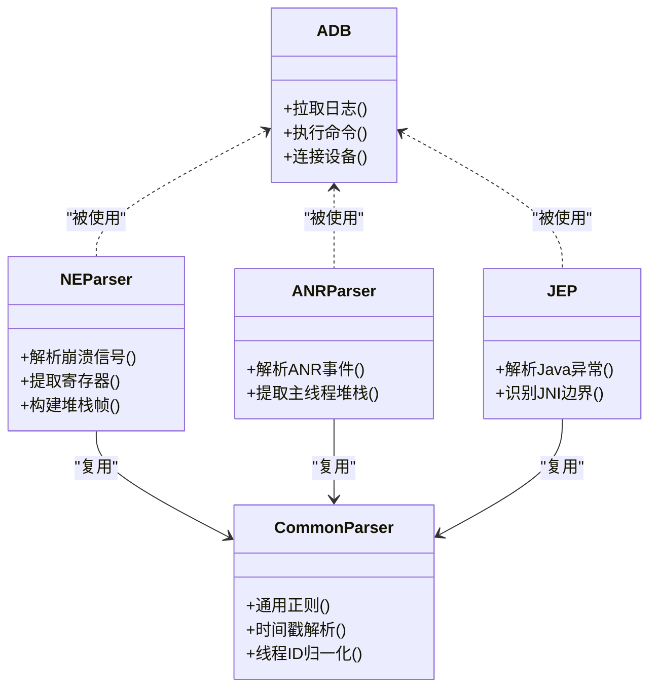
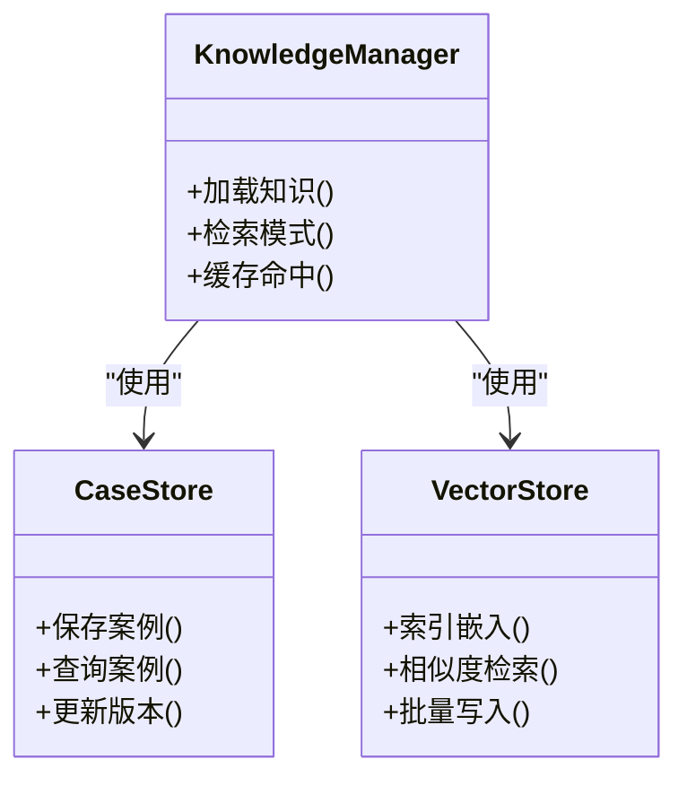
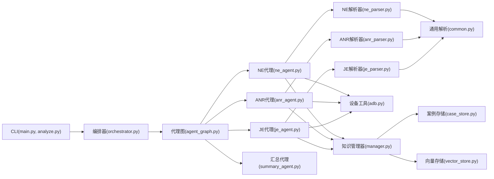

# Native崩溃分析代理

<cite>
**本文引用的文件**   
- [ne_agent.py](file://src/jirin/agents/ne_agent.py)
- [anr_agent.py](file://src/jirin/agents/anr_agent.py)
- [je_agent.py](file://src/jirin/agents/je_agent.py)
- [base.py](file://src/jirin/agents/base.py)
- [summary_agent.py](file://src/jirin/agents/summary_agent.py)
- [agent_graph.py](file://src/jirin/core/agent_graph.py)
- [orchestrator.py](file://src/jirin/core/orchestrator.py)
- [context.py](file://src/jirin/core/context.py)
- [state.py](file://src/jirin/core/state.py)
- [ne_parser.py](file://src/jirin/tools/log_parser/ne_parser.py)
- [anr_parser.py](file://src/jirin/tools/log_parser/anr_parser.py)
- [je_parser.py](file://src/jirin/tools/log_parser/je_parser.py)
- [common.py](file://src/jirin/tools/log_parser/common.py)
- [adb.py](file://src/jirin/tools/device/adb.py)
- [manager.py](file://src/jirin/knowledge/manager.py)
- [case_store.py](file://src/jirin/knowledge/case_store.py)
- [vector_store.py](file://src/jirin/knowledge/vector_store.py)
- [analysis_flow.md](file://src/jirin/knowledge/static/analysis_flow.md)
- [ne_principles.md](file://src/jirin/knowledge/static/ne_principles.md)
- [anr_principles.md](file://src/jirin/knowledge/static/anr_principles.md)
- [je_principles.md](file://src/jirin/knowledge/static/je_principles.md)
- [settings.toml](file://config/settings.toml)
- [main.py](file://src/jirin/cli/main.py)
- [analyze.py](file://src/jirin/cli/commands/analyze.py)
</cite>

## 目录
1. [简介](#简介)
2. [项目结构](#项目结构)
3. [核心组件](#核心组件)
4. [架构总览](#架构总览)
5. [详细组件分析](#详细组件分析)
6. [依赖关系分析](#依赖关系分析)
7. [性能考虑](#性能考虑)
8. [故障排查指南](#故障排查指南)
9. [结论](#结论)
10. [附录](#附录)

## 简介
本技术文档围绕Native崩溃分析代理，系统阐述Native层崩溃的检测原理、信号处理与堆栈回溯机制，覆盖ARM/x86等平台的分析方法、符号解析与地址映射技术。同时给出常见Native崩溃类型（如Segmentation Fault、Illegal Instruction等）的诊断流程与修复策略，并记录NDK调试集成、符号文件管理与性能分析工具的使用建议，以及Native代码优化与最佳实践。

## 项目结构
仓库采用“代理+工具+知识”的分层组织：
- agents：各领域分析代理（ANR、Java异常、Native异常等）
- core：编排器、图执行、上下文与状态管理
- tools：设备交互（ADB）、日志解析（ANR/JE/NE）、搜索
- knowledge：案例存储、向量检索、静态知识
- cli：命令行入口与命令实现
- config：配置项

图表来源
- [main.py:1-200](file://src/jirin/cli/main.py#L1-L200)
- [analyze.py:1-200](file://src/jirin/cli/commands/analyze.py#L1-L200)
- [orchestrator.py:1-200](file://src/jirin/core/orchestrator.py#L1-L200)
- [agent_graph.py:1-200](file://src/jirin/core/agent_graph.py#L1-L200)
- [context.py:1-200](file://src/jirin/core/context.py#L1-L200)
- [state.py:1-200](file://src/jirin/core/state.py#L1-L200)
- [ne_agent.py:1-200](file://src/jirin/agents/ne_agent.py#L1-L200)
- [anr_agent.py:1-200](file://src/jirin/agents/anr_agent.py#L1-L200)
- [je_agent.py:1-200](file://src/jirin/agents/je_agent.py#L1-L200)
- [summary_agent.py:1-200](file://src/jirin/agents/summary_agent.py#L1-L200)
- [base.py:1-200](file://src/jirin/agents/base.py#L1-L200)
- [adb.py:1-200](file://src/jirin/tools/device/adb.py#L1-L200)
- [ne_parser.py:1-200](file://src/jirin/tools/log_parser/ne_parser.py#L1-L200)
- [anr_parser.py:1-200](file://src/jirin/tools/log_parser/anr_parser.py#L1-L200)
- [je_parser.py:1-200](file://src/jirin/tools/log_parser/je_parser.py#L1-L200)
- [common.py:1-200](file://src/jirin/tools/log_parser/common.py#L1-L200)
- [manager.py:1-200](file://src/jirin/knowledge/manager.py#L1-L200)
- [case_store.py:1-200](file://src/jirin/knowledge/case_store.py#L1-L200)
- [vector_store.py:1-200](file://src/jirin/knowledge/vector_store.py#L1-L200)
- [ne_principles.md:1-200](file://src/jirin/knowledge/static/ne_principles.md#L1-L200)
- [anr_principles.md:1-200](file://src/jirin/knowledge/static/anr_principles.md#L1-L200)
- [je_principles.md:1-200](file://src/jirin/knowledge/static/je_principles.md#L1-L200)
- [analysis_flow.md:1-200](file://src/jirin/knowledge/static/analysis_flow.md#L1-L200)
- [settings.toml:1-200](file://config/settings.toml#L1-L200)

章节来源
- [main.py:1-200](file://src/jirin/cli/main.py#L1-L200)
- [analyze.py:1-200](file://src/jirin/cli/commands/analyze.py#L1-L200)
- [orchestrator.py:1-200](file://src/jirin/core/orchestrator.py#L1-L200)
- [agent_graph.py:1-200](file://src/jirin/core/agent_graph.py#L1-L200)
- [context.py:1-200](file://src/jirin/core/context.py#L1-L200)
- [state.py:1-200](file://src/jirin/core/state.py#L1-L200)
- [ne_agent.py:1-200](file://src/jirin/agents/ne_agent.py#L1-L200)
- [anr_agent.py:1-200](file://src/jirin/agents/anr_agent.py#L1-L200)
- [je_agent.py:1-200](file://src/jirin/agents/je_agent.py#LL1-L200)
- [summary_agent.py:1-200](file://src/jirin/agents/summary_agent.py#L1-L200)
- [base.py:1-200](file://src/jirin/agents/base.py#L1-L200)
- [adb.py:1-200](file://src/jirin/tools/device/adb.py#L1-L200)
- [ne_parser.py:1-200](file://src/jirin/tools/log_parser/ne_parser.py#L1-L200)
- [anr_parser.py:1-200](file://src/jirin/tools/log_parser/anr_parser.py#L1-L200)
- [je_parser.py:1-200](file://src/jirin/tools/log_parser/je_parser.py#L1-L200)
- [common.py:1-200](file://src/jirin/tools/log_parser/common.py#L1-L200)
- [manager.py:1-200](file://src/jirin/knowledge/manager.py#L1-L200)
- [case_store.py:1-200](file://src/jirin/knowledge/case_store.py#L1-L200)
- [vector_store.py:1-200](file://src/jirin/knowledge/vector_store.py#L1-L200)
- [ne_principles.md:1-200](file://src/jirin/knowledge/static/ne_principles.md#L1-L200)
- [anr_principles.md:1-200](file://src/jirin/knowledge/static/anr_principles.md#L1-L200)
- [je_principles.md:1-200](file://src/jirin/knowledge/static/je_principles.md#L1-L200)
- [analysis_flow.md:1-200](file://src/jirin/knowledge/static/analysis_flow.md#L1-L200)
- [settings.toml:1-200](file://config/settings.toml#L1-L200)

## 核心组件
- 代理基类与统一接口：定义统一的输入输出契约、生命周期钩子与错误上报路径，便于扩展新的分析代理。
- Native异常代理（NE）：负责收集与分析Native崩溃日志，结合平台特性进行堆栈解析与根因定位。
- ANR代理：聚焦应用无响应场景，关联主线程阻塞与Native侧表现。
- Java异常代理（JE）：捕获上层异常，辅助判断是否由Native调用引发。
- 汇总代理：聚合多代理结果，生成可操作的分析报告与修复建议。
- 编排器与图执行：将多个代理按依赖关系组织为有向图，支持并行与条件分支。
- 设备与日志工具：通过ADB拉取logcat、crash信息；提供ANR/NE/JE的专用解析器。
- 知识与案例库：沉淀平台差异、崩溃模式与修复经验，支持向量检索与案例匹配。

章节来源
- [base.py:1-200](file://src/jirin/agents/base.py#L1-L200)
- [ne_agent.py:1-200](file://src/jirin/agents/ne_agent.py#L1-L200)
- [anr_agent.py:1-200](file://src/jirin/agents/anr_agent.py#L1-L200)
- [je_agent.py:1-200](file://src/jirin/agents/je_agent.py#L1-L200)
- [summary_agent.py:1-200](file://src/jirin/agents/summary_agent.py#L1-L200)
- [orchestrator.py:1-200](file://src/jirin/core/orchestrator.py#L1-L200)
- [agent_graph.py:1-200](file://src/jirin/core/agent_graph.py#L1-L200)
- [adb.py:1-200](file://src/jirin/tools/device/adb.py#L1-L200)
- [ne_parser.py:1-200](file://src/jirin/tools/log_parser/ne_parser.py#L1-L200)
- [anr_parser.py:1-200](file://src/jirin/tools/log_parser/anr_parser.py#L1-L200)
- [je_parser.py:1-200](file://src/jirin/tools/log_parser/je_parser.py#L1-L200)
- [manager.py:1-200](file://src/jirin/knowledge/manager.py#L1-L200)
- [case_store.py:1-200](file://src/jirin/knowledge/case_store.py#L1-L200)
- [vector_store.py:1-200](file://src/jirin/knowledge/vector_store.py#L1-L200)

## 架构总览
整体采用“命令驱动 + 图编排 + 多代理协作”的架构。CLI触发分析任务，编排器根据图结构调度各代理，代理间共享上下文与状态，最终由汇总代理产出报告。

图表来源
- [main.py:1-200](file://src/jirin/cli/main.py#L1-L200)
- [analyze.py:1-200](file://src/jirin/cli/commands/analyze.py#L1-L200)
- [orchestrator.py:1-200](file://src/jirin/core/orchestrator.py#L1-L200)
- [agent_graph.py:1-200](file://src/jirin/core/agent_graph.py#L1-L200)
- [ne_agent.py:1-200](file://src/jirin/agents/ne_agent.py#L1-L200)
- [anr_agent.py:1-200](file://src/jirin/agents/anr_agent.py#L1-L200)
- [je_agent.py:1-200](file://src/jirin/agents/je_agent.py#L1-L200)
- [summary_agent.py:1-200](file://src/jirin/agents/summary_agent.py#L1-L200)
- [adb.py:1-200](file://src/jirin/tools/device/adb.py#L1-L200)
- [ne_parser.py:1-200](file://src/jirin/tools/log_parser/ne_parser.py#L1-L200)
- [anr_parser.py:1-200](file://src/jirin/tools/log_parser/anr_parser.py#L1-L200)
- [je_parser.py:1-200](file://src/jirin/tools/log_parser/je_parser.py#L1-L200)
- [manager.py:1-200](file://src/jirin/knowledge/manager.py#L1-L200)
- [case_store.py:1-200](file://src/jirin/knowledge/case_store.py#L1-L200)
- [vector_store.py:1-200](file://src/jirin/knowledge/vector_store.py#L1-L200)

## 详细组件分析

### Native异常代理（NE）
职责
- 采集Native崩溃相关日志与堆栈信息
- 识别崩溃信号类型（如SIGSEGV、SIGILL等）
- 结合平台特性进行地址到符号的映射与堆栈还原
- 基于知识库匹配已知问题模式，输出修复建议

关键流程
- 日志采集：通过设备工具获取logcat、tombstone、debuggerd输出
- 解析：使用NE解析器提取崩溃时间、进程/线程、信号、寄存器、堆栈帧
- 符号化：依据ABI与二进制布局，将PC值映射至函数名与源码位置
- 诊断：结合平台差异与历史案例，定位根因类别与修复方向

图表来源
- [ne_agent.py:1-200](file://src/jirin/agents/ne_agent.py#L1-L200)
- [ne_parser.py:1-200](file://src/jirin/tools/log_parser/ne_parser.py#L1-L200)
- [common.py:1-200](file://src/jirin/tools/log_parser/common.py#L1-L200)
- [ne_principles.md:1-200](file://src/jirin/knowledge/static/ne_principles.md#L1-L200)

章节来源
- [ne_agent.py:1-200](file://src/jirin/agents/ne_agent.py#L1-L200)
- [ne_parser.py:1-200](file://src/jirin/tools/log_parser/ne_parser.py#L1-L200)
- [common.py:1-200](file://src/jirin/tools/log_parser/common.py#L1-L200)
- [ne_principles.md:1-200](file://src/jirin/knowledge/static/ne_principles.md#L1-L200)

### ANR代理
职责
- 检测与应用无响应相关的日志特征
- 关联主线程阻塞、I/O等待、锁竞争等根因
- 与NE代理协同，判断是否存在Native侧导致的ANR

关键流程
- 拉取ANR日志与主线程堆栈
- 解析阻塞点与热点方法
- 结合知识库输出缓解与修复建议

图表来源
- [anr_agent.py:1-200](file://src/jirin/agents/anr_agent.py#L1-L200)
- [anr_parser.py:1-200](file://src/jirin/tools/log_parser/anr_parser.py#L1-L200)
- [adb.py:1-200](file://src/jirin/tools/device/adb.py#L1-L200)
- [anr_principles.md:1-200](file://src/jirin/knowledge/static/anr_principles.md#L1-L200)

章节来源
- [anr_agent.py:1-200](file://src/jirin/agents/anr_agent.py#L1-L200)
- [anr_parser.py:1-200](file://src/jirin/tools/log_parser/anr_parser.py#L1-L200)
- [adb.py:1-200](file://src/jirin/tools/device/adb.py#L1-L200)
- [anr_principles.md:1-200](file://src/jirin/knowledge/static/anr_principles.md#L1-L200)

### Java异常代理（JE）
职责
- 捕获上层Java异常，判断是否由JNI/Native调用引发
- 与NE/ANR代理联动，形成跨层诊断闭环

关键流程
- 拉取Java异常堆栈
- 识别JNI边界与Native调用链
- 关联NE日志进行交叉验证

图表来源
- [je_agent.py:1-200](file://src/jirin/agents/je_agent.py#L1-L200)
- [je_parser.py:1-200](file://src/jirin/tools/log_parser/je_parser.py#L1-L200)
- [adb.py:1-200](file://src/jirin/tools/device/adb.py#L1-L200)
- [ne_agent.py:1-200](file://src/jirin/agents/ne_agent.py#L1-L200)

章节来源
- [je_agent.py:1-200](file://src/jirin/agents/je_agent.py#L1-L200)
- [je_parser.py:1-200](file://src/jirin/tools/log_parser/je_parser.py#L1-L200)
- [adb.py:1-200](file://src/jirin/tools/device/adb.py#L1-L200)
- [ne_agent.py:1-200](file://src/jirin/agents/ne_agent.py#L1-L200)

### 汇总代理
职责
- 聚合NE/ANR/JE等多代理结果
- 去重与冲突消解
- 生成面向开发者的可操作报告与修复建议

图表来源
- [summary_agent.py:1-200](file://src/jirin/agents/summary_agent.py#L1-L200)
- [base.py:1-200](file://src/jirin/agents/base.py#L1-L200)

章节来源
- [summary_agent.py:1-200](file://src/jirin/agents/summary_agent.py#L1-L200)
- [base.py:1-200](file://src/jirin/agents/base.py#L1-L200)

### 编排器与代理图
职责
- 将代理组织为有向图，支持条件执行与并行
- 维护全局上下文与状态，确保数据一致性

图表来源
- [orchestrator.py:1-200](file://src/jirin/core/orchestrator.py#L1-L200)
- [agent_graph.py:1-200](file://src/jirin/core/agent_graph.py#L1-L200)
- [context.py:1-200](file://src/jirin/core/context.py#L1-L200)
- [state.py:1-200](file://src/jirin/core/state.py#L1-L200)

章节来源
- [orchestrator.py:1-200](file://src/jirin/core/orchestrator.py#L1-L200)
- [agent_graph.py:1-200](file://src/jirin/core/agent_graph.py#L1-L200)
- [context.py:1-200](file://src/jirin/core/context.py#L1-L200)
- [state.py:1-200](file://src/jirin/core/state.py#L1-L200)

### 设备与日志解析工具
- 设备工具：封装ADB命令，用于拉取logcat、tombstone、debuggerd输出等
- 通用解析器：提供公共正则与数据结构，提升解析稳定性
- 专用解析器：针对ANR/NE/JE的结构化抽取

图表来源
- [adb.py:1-200](file://src/jirin/tools/device/adb.py#L1-L200)
- [common.py:1-200](file://src/jirin/tools/log_parser/common.py#L1-L200)
- [ne_parser.py:1-200](file://src/jirin/tools/log_parser/ne_parser.py#L1-L200)
- [anr_parser.py:1-200](file://src/jirin/tools/log_parser/anr_parser.py#L1-L200)
- [je_parser.py:1-200](file://src/jirin/tools/log_parser/je_parser.py#L1-L200)

章节来源
- [adb.py:1-200](file://src/jirin/tools/device/adb.py#L1-L200)
- [common.py:1-200](file://src/jirin/tools/log_parser/common.py#L1-L200)
- [ne_parser.py:1-200](file://src/jirin/tools/log_parser/ne_parser.py#L1-L200)
- [anr_parser.py:1-200](file://src/jirin/tools/log_parser/anr_parser.py#L1-L200)
- [je_parser.py:1-200](file://src/jirin/tools/log_parser/je_parser.py#L1-L200)

### 知识与案例库
- 管理器：统一访问知识源，提供检索与缓存
- 案例存储：持久化历史案例与修复方案
- 向量存储：支持语义检索，快速匹配相似问题

图表来源
- [manager.py:1-200](file://src/jirin/knowledge/manager.py#L1-L200)
- [case_store.py:1-200](file://src/jirin/knowledge/case_store.py#L1-L200)
- [vector_store.py:1-200](file://src/jirin/knowledge/vector_store.py#L1-L200)

章节来源
- [manager.py:1-200](file://src/jirin/knowledge/manager.py#L1-L200)
- [case_store.py:1-200](file://src/jirin/knowledge/case_store.py#L1-L200)
- [vector_store.py:1-200](file://src/jirin/knowledge/vector_store.py#L1-L200)

## 依赖关系分析
- 低耦合高内聚：代理之间通过编排器与图结构解耦，避免直接相互引用
- 工具复用：解析器共用通用逻辑，降低重复实现
- 外部依赖：ADB作为唯一设备交互入口，集中管理命令与重试策略

图表来源
- [main.py:1-200](file://src/jirin/cli/main.py#L1-L200)
- [analyze.py:1-200](file://src/jirin/cli/commands/analyze.py#L1-L200)
- [orchestrator.py:1-200](file://src/jirin/core/orchestrator.py#L1-L200)
- [agent_graph.py:1-200](file://src/jirin/core/agent_graph.py#L1-L200)
- [ne_agent.py:1-200](file://src/jirin/agents/ne_agent.py#L1-L200)
- [anr_agent.py:1-200](file://src/jirin/agents/anr_agent.py#L1-L200)
- [je_agent.py:1-200](file://src/jirin/agents/je_agent.py#L1-L200)
- [summary_agent.py:1-200](file://src/jirin/agents/summary_agent.py#L1-L200)
- [ne_parser.py:1-200](file://src/jirin/tools/log_parser/ne_parser.py#L1-L200)
- [anr_parser.py:1-200](file://src/jirin/tools/log_parser/anr_parser.py#L1-L200)
- [je_parser.py:1-200](file://src/jirin/tools/log_parser/je_parser.py#L1-L200)
- [common.py:1-200](file://src/jirin/tools/log_parser/common.py#L1-L200)
- [adb.py:1-200](file://src/jirin/tools/device/adb.py#L1-L200)
- [manager.py:1-200](file://src/jirin/knowledge/manager.py#L1-L200)
- [case_store.py:1-200](file://src/jirin/knowledge/case_store.py#L1-L200)
- [vector_store.py:1-200](file://src/jirin/knowledge/vector_store.py#L1-L200)

章节来源
- [main.py:1-200](file://src/jirin/cli/main.py#L1-L200)
- [analyze.py:1-200](file://src/jirin/cli/commands/analyze.py#L1-L200)
- [orchestrator.py:1-200](file://src/jirin/core/orchestrator.py#L1-L200)
- [agent_graph.py:1-200](file://src/jirin/core/agent_graph.py#L1-L200)
- [ne_agent.py:1-200](file://src/jirin/agents/ne_agent.py#L1-L200)
- [anr_agent.py:1-200](file://src/jirin/agents/anr_agent.py#L1-L200)
- [je_agent.py:1-200](file://src/jirin/agents/je_agent.py#L1-L200)
- [summary_agent.py:1-200](file://src/jirin/agents/summary_agent.py#L1-L200)
- [ne_parser.py:1-200](file://src/jirin/tools/log_parser/ne_parser.py#L1-L200)
- [anr_parser.py:1-200](file://src/jirin/tools/log_parser/anr_parser.py#L1-L200)
- [je_parser.py:1-200](file://src/jirin/tools/log_parser/je_parser.py#L1-L200)
- [common.py:1-200](file://src/jirin/tools/log_parser/common.py#L1-L200)
- [adb.py:1-200](file://src/jirin/tools/device/adb.py#L1-L200)
- [manager.py:1-200](file://src/jirin/knowledge/manager.py#L1-L200)
- [case_store.py:1-200](file://src/jirin/knowledge/case_store.py#L1-L200)
- [vector_store.py:1-200](file://src/jirin/knowledge/vector_store.py#L1-L200)

## 性能考虑
- 并行执行：在代理图中对无依赖的代理进行并发执行，缩短端到端耗时
- 增量解析：仅拉取最近时间窗口的日志，减少IO与解析开销
- 缓存命中：对知识库与向量检索结果进行短期缓存，避免重复计算
- 流式处理：对大日志采用分块解析，降低内存峰值
- 资源限制：对ADB命令设置超时与重试上限，防止阻塞

[本节为通用指导，不直接分析具体文件]

## 故障排查指南
- 日志缺失或截断：检查ADB权限与设备连接，确认logcat与tombstone开关
- 符号缺失：确认NDK符号文件与二进制版本一致，必要时重新导出符号
- 解析失败：核对平台ABI与日志格式，更新通用解析器的正则表达式
- 知识未命中：扩充知识库条目，完善向量索引，提高检索召回率
- 代理卡死：检查编排器超时与重试策略，增加健康检查与熔断

章节来源
- [adb.py:1-200](file://src/jirin/tools/device/adb.py#L1-L200)
- [ne_parser.py:1-200](file://src/jirin/tools/log_parser/ne_parser.py#L1-L200)
- [anr_parser.py:1-200](file://src/jirin/tools/log_parser/anr_parser.py#L1-L200)
- [je_parser.py:1-200](file://src/jirin/tools/log_parser/je_parser.py#L1-L200)
- [manager.py:1-200](file://src/jirin/knowledge/manager.py#L1-L200)
- [vector_store.py:1-200](file://src/jirin/knowledge/vector_store.py#L1-L200)
- [orchestrator.py:1-200](file://src/jirin/core/orchestrator.py#L1-L200)

## 结论
本代理体系以模块化与可扩展为核心，通过图编排与多代理协作，实现对Native崩溃的高效检测与诊断。借助平台差异化的符号解析与知识库匹配，能够快速定位根因并提供修复建议。配合NDK调试与性能分析工具，可进一步提升问题定位效率与修复质量。

[本节为总结性内容，不直接分析具体文件]

## 附录

### 常见Native崩溃类型与诊断流程
- Segmentation Fault（非法内存访问）
  - 现象：SIGSEGV，堆栈中出现空指针或越界访问
  - 诊断：核对寄存器与堆栈帧，定位越界写/读与悬垂指针
  - 修复：加强边界检查，使用安全API，启用ASan进行回归验证
- Illegal Instruction（非法指令）
  - 现象：SIGILL，CPU执行了不支持的指令
  - 诊断：检查ABI与编译选项，确认指令集兼容性
  - 修复：调整编译目标架构，避免内联汇编误用
- Bus Error（总线错误）
  - 现象：SIGBUS，对齐或硬件访问错误
  - 诊断：关注内存对齐与DMA访问路径
  - 修复：修正对齐要求，避免非对齐访问
- Floating Point Exception（浮点异常）
  - 现象：SIGFPE，除零或溢出
  - 诊断：检查浮点运算路径与NaN/Inf传播
  - 修复：增加前置校验与异常处理

章节来源
- [ne_principles.md:1-200](file://src/jirin/knowledge/static/ne_principles.md#L1-L200)
- [analysis_flow.md:1-200](file://src/jirin/knowledge/static/analysis_flow.md#L1-L200)

### 平台差异与符号解析
- ARM平台
  - ABI：AArch32/AArch64，注意ELF头与段表差异
  - 符号化：结合.so与符号表，将PC映射到函数名与行号
- x86平台
  - ABI：i386/x86_64，注意寄存器命名与栈帧布局
  - 符号化：使用对应工具的符号解析能力，确保版本一致

章节来源
- [ne_principles.md:1-200](file://src/jirin/knowledge/static/ne_principles.md#L1-L200)

### NDK调试集成与符号文件管理
- 集成要点
  - 保持二进制与符号文件版本一致
  - 导出完整符号（含调试信息），便于回溯
  - 建立符号仓库，按模块与版本归档
- 工具链
  - 使用NDK提供的符号化工具链进行地址到源码映射
  - 结合gdb/lldb进行在线调试与断点复现

章节来源
- [ne_principles.md:1-200](file://src/jirin/knowledge/static/ne_principles.md#L1-L200)

### 性能分析工具使用建议
- 采样型分析：定位热点函数与调用路径
- 火焰图：可视化CPU占用分布
- I/O与内存分析：识别瓶颈与泄漏风险
- 回归对比：修复前后性能对比，确保收益

[本节为通用指导，不直接分析具体文件]

### Native代码优化与最佳实践
- 避免频繁分配与释放，使用对象池与内存池
- 减少锁粒度与持有时间，避免长事务与阻塞
- 使用异步与批处理，降低同步开销
- 强化错误处理与边界检查，提前失败
- 开启编译器优化与安全选项，启用静态分析与动态检测

[本节为通用指导，不直接分析具体文件]

### 配置与环境
- settings.toml：包含设备连接、日志窗口、解析参数、知识库路径等
- 环境变量：控制调试级别、超时与重试策略
- 工作区：data/exports用于导出报告与中间产物

章节来源
- [settings.toml:1-200](file://config/settings.toml#L1-L200)