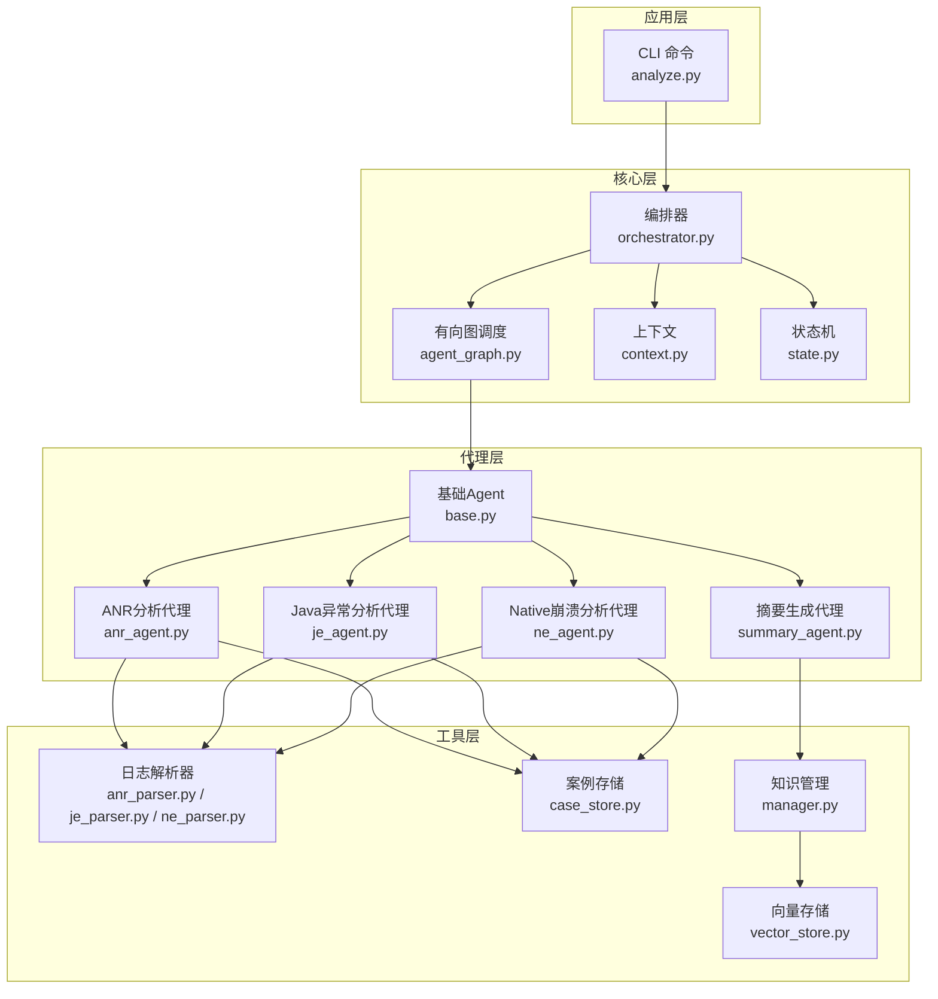
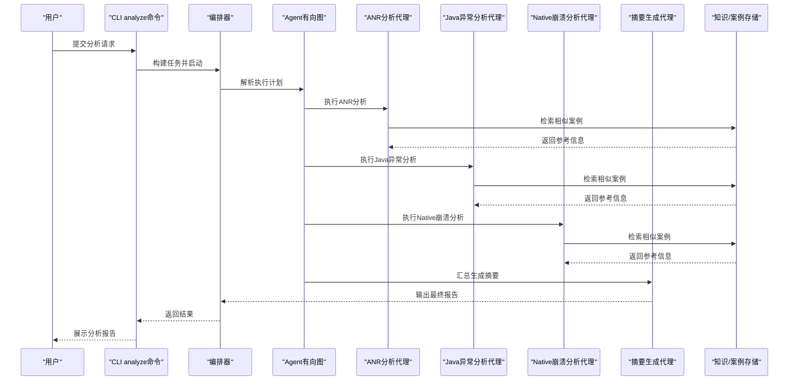
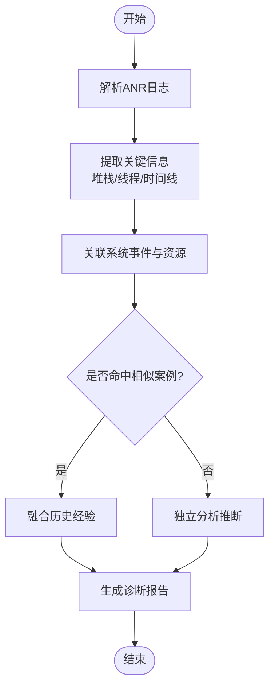
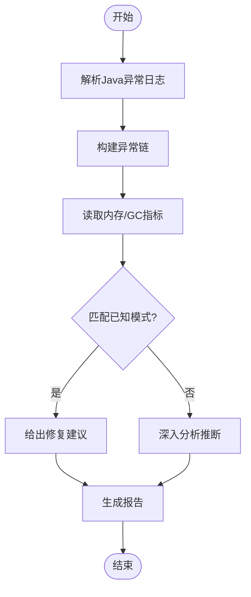
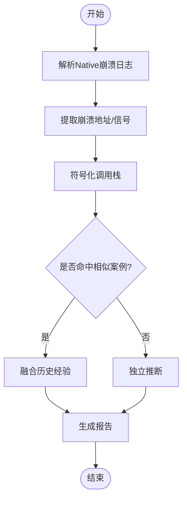
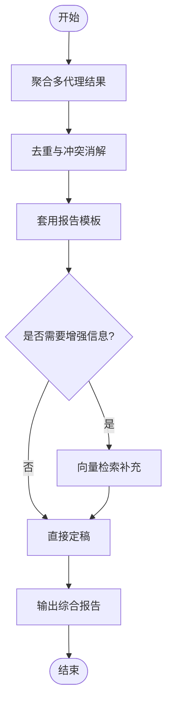
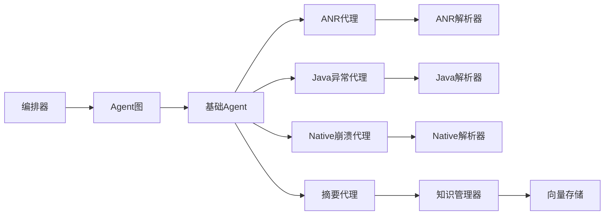

# 分析代理系统

<cite>
**本文引用的文件**   
- [src/jirin/agents/base.py](file://src/jirin/agents/base.py)
- [src/jirin/agents/anr_agent.py](file://src/jirin/agents/anr_agent.py)
- [src/jirin/agents/je_agent.py](file://src/jirin/agents/je_agent.py)
- [src/jirin/agents/ne_agent.py](file://src/jirin/agents/ne_agent.py)
- [src/jirin/agents/summary_agent.py](file://src/jirin/agents/summary_agent.py)
- [src/jirin/core/orchestrator.py](file://src/jirin/core/orchestrator.py)
- [src/jirin/core/agent_graph.py](file://src/jirin/core/agent_graph.py)
- [src/jirin/core/context.py](file://src/jirin/core/context.py)
- [src/jirin/core/state.py](file://src/jirin/core/state.py)
- [src/jirin/tools/log_parser/anr_parser.py](file://src/jirin/tools/log_parser/anr_parser.py)
- [src/jirin/tools/log_parser/je_parser.py](file://src/jirin/tools/log_parser/je_parser.py)
- [src/jirin/tools/log_parser/ne_parser.py](file://src/jirin/tools/log_parser/ne_parser.py)
- [src/jirin/knowledge/case_store.py](file://src/jirin/knowledge/case_store.py)
- [src/jirin/knowledge/vector_store.py](file://src/jirin/knowledge/vector_store.py)
- [src/jirin/knowledge/manager.py](file://src/jirin/knowledge/manager.py)
- [src/jirin/cli/commands/analyze.py](file://src/jirin/cli/commands/analyze.py)
</cite>

## 目录
1. [简介](#简介)
2. [项目结构](#项目结构)
3. [核心组件](#核心组件)
4. [架构总览](#架构总览)
5. [详细组件分析](#详细组件分析)
6. [依赖关系分析](#依赖关系分析)
7. [性能考虑](#性能考虑)
8. [故障排查指南](#故障排查指南)
9. [结论](#结论)
10. [附录](#附录)

## 简介
本文件面向Jirin的分析代理系统，系统性阐述Agent架构设计模式、基础Agent类实现、专业分析代理（ANR分析代理、Java异常分析代理、Native崩溃分析代理、摘要生成代理）的功能与协作机制。文档同时覆盖消息传递协议、执行策略、生命周期管理、错误处理与性能优化技巧，并提供自定义Agent开发指南与集成方法，帮助读者快速扩展与分析流程。

## 项目结构
Jirin采用分层与特性结合的目录组织方式：
- agents：定义基础Agent抽象与各领域分析代理
- core：编排器、有向图调度、上下文与状态管理
- tools：日志解析、设备交互、代码检索等工具
- knowledge：案例库、向量存储与知识管理
- cli：命令行入口与命令实现
- export：导出能力（规则、技能等）

图表来源
- [src/jirin/cli/commands/analyze.py](file://src/jirin/cli/commands/analyze.py)
- [src/jirin/core/orchestrator.py](file://src/jirin/core/orchestrator.py)
- [src/jirin/core/agent_graph.py](file://src/jirin/core/agent_graph.py)
- [src/jirin/core/context.py](file://src/jirin/core/context.py)
- [src/jirin/core/state.py](file://src/jirin/core/state.py)
- [src/jirin/agents/base.py](file://src/jirin/agents/base.py)
- [src/jirin/agents/anr_agent.py](file://src/jirin/agents/anr_agent.py)
- [src/jirin/agents/je_agent.py](file://src/jirin/agents/je_agent.py)
- [src/jirin/agents/ne_agent.py](file://src/jirin/agents/ne_agent.py)
- [src/jirin/agents/summary_agent.py](file://src/jirin/agents/summary_agent.py)
- [src/jirin/tools/log_parser/anr_parser.py](file://src/jirin/tools/log_parser/anr_parser.py)
- [src/jirin/tools/log_parser/je_parser.py](file://src/jirin/tools/log_parser/je_parser.py)
- [src/jirin/tools/log_parser/ne_parser.py](file://src/jirin/tools/log_parser/ne_parser.py)
- [src/jirin/knowledge/case_store.py](file://src/jirin/knowledge/case_store.py)
- [src/jirin/knowledge/vector_store.py](file://src/jirin/knowledge/vector_store.py)
- [src/jirin/knowledge/manager.py](file://src/jirin/knowledge/manager.py)

章节来源
- [src/jirin/cli/commands/analyze.py](file://src/jirin/cli/commands/analyze.py)
- [src/jirin/core/orchestrator.py](file://src/jirin/core/orchestrator.py)
- [src/jirin/core/agent_graph.py](file://src/jirin/core/agent_graph.py)
- [src/jirin/core/context.py](file://src/jirin/core/context.py)
- [src/jirin/core/state.py](file://src/jirin/core/state.py)
- [src/jirin/agents/base.py](file://src/jirin/agents/base.py)
- [src/jirin/agents/anr_agent.py](file://src/jirin/agents/anr_agent.py)
- [src/jirin/agents/je_agent.py](file://src/jirin/agents/je_agent.py)
- [src/jirin/agents/ne_agent.py](file://src/jirin/agents/ne_agent.py)
- [src/jirin/agents/summary_agent.py](file://src/jirin/agents/summary_agent.py)
- [src/jirin/tools/log_parser/anr_parser.py](file://src/jirin/tools/log_parser/anr_parser.py)
- [src/jirin/tools/log_parser/je_parser.py](file://src/jirin/tools/log_parser/je_parser.py)
- [src/jirin/tools/log_parser/ne_parser.py](file://src/jirin/tools/log_parser/ne_parser.py)
- [src/jirin/knowledge/case_store.py](file://src/jirin/knowledge/case_store.py)
- [src/jirin/knowledge/vector_store.py](file://src/jirin/knowledge/vector_store.py)
- [src/jirin/knowledge/manager.py](file://src/jirin/knowledge/manager.py)

## 核心组件
- 基础Agent类：提供统一的初始化、配置注入、日志记录、输入校验、输出规范化、错误包装与重试策略等通用能力；定义标准接口供具体代理实现。
- 编排器：负责加载Agent图、解析任务、调度执行、收集结果、聚合输出；支持顺序、分支与并行策略。
- Agent有向图：以节点表示Agent、边表示数据依赖或调用关系；支持条件跳转与动态扩展。
- 上下文与状态：上下文承载跨Agent共享的数据（如原始日志、解析中间态、元数据）；状态机驱动任务生命周期（新建、运行中、完成、失败、回滚）。
- 知识管理与存储：案例库用于相似问题匹配与经验复用；向量存储用于语义检索；管理器统一访问与缓存策略。

章节来源
- [src/jirin/agents/base.py](file://src/jirin/agents/base.py)
- [src/jirin/core/orchestrator.py](file://src/jirin/core/orchestrator.py)
- [src/jirin/core/agent_graph.py](file://src/jirin/core/agent_graph.py)
- [src/jirin/core/context.py](file://src/jirin/core/context.py)
- [src/jirin/core/state.py](file://src/jirin/core/state.py)
- [src/jirin/knowledge/case_store.py](file://src/jirin/knowledge/case_store.py)
- [src/jirin/knowledge/vector_store.py](file://src/jirin/knowledge/vector_store.py)
- [src/jirin/knowledge/manager.py](file://src/jirin/knowledge/manager.py)

## 架构总览
整体采用“编排器+有向图”的解耦架构：CLI触发分析任务，编排器根据图拓扑依次或并行执行各Agent；每个Agent专注单一职责，通过上下文交换结构化数据；必要时借助知识系统进行相似案例检索与增强推理。

图表来源
- [src/jirin/cli/commands/analyze.py](file://src/jirin/cli/commands/analyze.py)
- [src/jirin/core/orchestrator.py](file://src/jirin/core/orchestrator.py)
- [src/jirin/core/agent_graph.py](file://src/jirin/core/agent_graph.py)
- [src/jirin/agents/anr_agent.py](file://src/jirin/agents/anr_agent.py)
- [src/jirin/agents/je_agent.py](file://src/jirin/agents/je_agent.py)
- [src/jirin/agents/ne_agent.py](file://src/jirin/agents/ne_agent.py)
- [src/jirin/agents/summary_agent.py](file://src/jirin/agents/summary_agent.py)
- [src/jirin/knowledge/case_store.py](file://src/jirin/knowledge/case_store.py)
- [src/jirin/knowledge/vector_store.py](file://src/jirin/knowledge/vector_store.py)

## 详细组件分析

### 基础Agent类
- 职责边界：封装通用能力（配置、日志、输入校验、输出规范、错误包装、重试），为具体代理提供稳定基座。
- 关键能力：
  - 初始化与配置注入：从全局配置加载参数，校验必填项。
  - 输入预处理：标准化输入格式，清理无关噪声。
  - 执行钩子：before/after回调，便于监控与埋点。
  - 错误处理：统一异常捕获与降级策略。
  - 输出规范化：将内部结果转换为标准数据结构，便于下游消费。
- 扩展点：子类仅需实现核心分析逻辑与必要的资源访问。

章节来源
- [src/jirin/agents/base.py](file://src/jirin/agents/base.py)

### ANR分析代理
- 功能目标：定位Android应用无响应（ANR）根因，包括主线程阻塞、I/O超时、锁竞争等。
- 输入：ANR日志、进程快照、系统事件。
- 处理流程：
  - 解析ANR日志，提取堆栈、线程状态、时间线。
  - 结合系统事件与资源占用，识别阻塞点。
  - 检索相似案例，辅助判断常见模式。
  - 输出结构化诊断报告与建议。
- 依赖：ANR日志解析器、案例库。

图表来源
- [src/jirin/agents/anr_agent.py](file://src/jirin/agents/anr_agent.py)
- [src/jirin/tools/log_parser/anr_parser.py](file://src/jirin/tools/log_parser/anr_parser.py)
- [src/jirin/knowledge/case_store.py](file://src/jirin/knowledge/case_store.py)

章节来源
- [src/jirin/agents/anr_agent.py](file://src/jirin/agents/anr_agent.py)
- [src/jirin/tools/log_parser/anr_parser.py](file://src/jirin/tools/log_parser/anr_parser.py)
- [src/jirin/knowledge/case_store.py](file://src/jirin/knowledge/case_store.py)

### Java异常分析代理（JE）
- 功能目标：分析Java层异常与崩溃，定位异常链、关键帧与潜在缺陷。
- 输入：Java异常日志、堆栈、GC与内存信息。
- 处理流程：
  - 解析异常堆栈，识别异常类型与传播路径。
  - 结合内存/GC指标，评估OOM风险。
  - 检索相似案例，提升定位准确率。
  - 输出异常根因分析与修复建议。
- 依赖：Java异常日志解析器、案例库。

图表来源
- [src/jirin/agents/je_agent.py](file://src/jirin/agents/je_agent.py)
- [src/jirin/tools/log_parser/je_parser.py](file://src/jirin/tools/log_parser/je_parser.py)
- [src/jirin/knowledge/case_store.py](file://src/jirin/knowledge/case_store.py)

章节来源
- [src/jirin/agents/je_agent.py](file://src/jirin/agents/je_agent.py)
- [src/jirin/tools/log_parser/je_parser.py](file://src/jirin/tools/log_parser/je_parser.py)
- [src/jirin/knowledge/case_store.py](file://src/jirin/knowledge/case_store.py)

### Native崩溃分析代理（NE）
- 功能目标：分析Native层崩溃（如段错误、信号异常），定位崩溃地址、符号信息与调用链。
- 输入：Native崩溃日志、崩溃转储、符号表。
- 处理流程：
  - 解析崩溃日志，提取崩溃地址与信号类型。
  - 符号化调用栈，还原函数级轨迹。
  - 检索相似案例，辅助定位底层库问题。
  - 输出崩溃根因与修复指引。
- 依赖：Native崩溃日志解析器、案例库。

图表来源
- [src/jirin/agents/ne_agent.py](file://src/jirin/agents/ne_agent.py)
- [src/jirin/tools/log_parser/ne_parser.py](file://src/jirin/tools/log_parser/ne_parser.py)
- [src/jirin/knowledge/case_store.py](file://src/jirin/knowledge/case_store.py)

章节来源
- [src/jirin/agents/ne_agent.py](file://src/jirin/agents/ne_agent.py)
- [src/jirin/tools/log_parser/ne_parser.py](file://src/jirin/tools/log_parser/ne_parser.py)
- [src/jirin/knowledge/case_store.py](file://src/jirin/knowledge/case_store.py)

### 摘要生成代理（Summary）
- 功能目标：汇总多代理分析结果，生成可读性强的综合报告，包含问题概述、根因定位、影响面与修复建议。
- 输入：各代理的结构化输出、上下文元数据。
- 处理流程：
  - 聚合各代理结果，去重与冲突消解。
  - 基于模板与规则生成结构化摘要。
  - 可选：结合向量检索补充背景信息。
  - 输出最终报告。
- 依赖：知识管理器、向量存储。

图表来源
- [src/jirin/agents/summary_agent.py](file://src/jirin/agents/summary_agent.py)
- [src/jirin/knowledge/manager.py](file://src/jirin/knowledge/manager.py)
- [src/jirin/knowledge/vector_store.py](file://src/jirin/knowledge/vector_store.py)

章节来源
- [src/jirin/agents/summary_agent.py](file://src/jirin/agents/summary_agent.py)
- [src/jirin/knowledge/manager.py](file://src/jirin/knowledge/manager.py)
- [src/jirin/knowledge/vector_store.py](file://src/jirin/knowledge/vector_store.py)

### Agent间协作机制、消息传递协议与执行策略
- 协作机制：
  - 有向图驱动：节点为Agent，边为数据依赖；支持顺序、分支与并行。
  - 上下文共享：通过上下文对象在Agent间传递结构化数据与元数据。
  - 状态机控制：由状态机驱动任务生命周期，确保一致性与可恢复性。
- 消息传递协议：
  - 输入契约：每个Agent定义输入字段、类型与约束。
  - 输出契约：每个Agent定义输出结构，包含诊断结果、置信度、证据与引用。
  - 错误契约：统一错误码与错误信息结构，便于上层处理与重试。
- 执行策略：
  - 顺序执行：适用于强依赖场景。
  - 并行执行：适用于独立分析任务（如ANR/JE/NE可并行）。
  - 条件分支：根据前置结果决定是否执行某Agent。
  - 重试与退避：对瞬时错误进行有限次重试，避免雪崩。

章节来源
- [src/jirin/core/orchestrator.py](file://src/jirin/core/orchestrator.py)
- [src/jirin/core/agent_graph.py](file://src/jirin/core/agent_graph.py)
- [src/jirin/core/context.py](file://src/jirin/core/context.py)
- [src/jirin/core/state.py](file://src/jirin/core/state.py)

### 自定义Agent开发指南与集成方法
- 开发步骤：
  - 继承基础Agent类，实现核心分析逻辑。
  - 定义输入/输出契约，遵循统一数据结构。
  - 在Agent图中注册节点与边，声明依赖与执行策略。
  - 编写单元测试，覆盖正常路径与异常路径。
- 集成方法：
  - 在编排器中加载新Agent图配置。
  - 更新CLI命令以支持新任务类型。
  - 若需要外部工具，封装为工具模块并在Agent中调用。
- 示例要点：
  - 输入校验失败时抛出统一错误。
  - 使用上下文保存中间结果，避免重复计算。
  - 对耗时操作启用并发与缓存。
  - 输出包含置信度与证据，便于后续决策。

章节来源
- [src/jirin/agents/base.py](file://src/jirin/agents/base.py)
- [src/jirin/core/agent_graph.py](file://src/jirin/core/agent_graph.py)
- [src/jirin/core/orchestrator.py](file://src/jirin/core/orchestrator.py)
- [src/jirin/cli/commands/analyze.py](file://src/jirin/cli/commands/analyze.py)

### 生命周期管理、错误处理与性能优化
- 生命周期管理：
  - 状态流转：新建→运行中→完成/失败→回滚（可选）。
  - 钩子与监控：在关键阶段记录指标与日志。
- 错误处理：
  - 统一异常包装，区分业务错误与系统错误。
  - 重试策略：指数退避与最大次数限制。
  - 降级策略：当依赖不可用时返回部分结果或提示。
- 性能优化：
  - 并行执行独立Agent，减少端到端延迟。
  - 结果缓存：对相同输入复用分析结果。
  - 增量解析：仅解析新增日志片段。
  - 流式处理：大日志分块解析，降低内存峰值。

章节来源
- [src/jirin/core/state.py](file://src/jirin/core/state.py)
- [src/jirin/core/orchestrator.py](file://src/jirin/core/orchestrator.py)
- [src/jirin/agents/base.py](file://src/jirin/agents/base.py)

## 依赖关系分析
- 组件耦合：
  - 编排器与Agent图松耦合，通过接口约定交互。
  - Agent与工具层通过明确输入/输出契约耦合，易于替换实现。
  - 知识管理与向量存储通过管理器统一访问，屏蔽底层差异。
- 外部依赖：
  - 日志解析器依赖平台特定日志格式。
  - 向量存储依赖外部索引服务或本地嵌入模型。
- 循环依赖：
  - 通过上下文与有向图避免循环调用，保持单向数据流。

图表来源
- [src/jirin/core/orchestrator.py](file://src/jirin/core/orchestrator.py)
- [src/jirin/core/agent_graph.py](file://src/jirin/core/agent_graph.py)
- [src/jirin/agents/base.py](file://src/jirin/agents/base.py)
- [src/jirin/agents/anr_agent.py](file://src/jirin/agents/anr_agent.py)
- [src/jirin/agents/je_agent.py](file://src/jirin/agents/je_agent.py)
- [src/jirin/agents/ne_agent.py](file://src/jirin/agents/ne_agent.py)
- [src/jirin/agents/summary_agent.py](file://src/jirin/agents/summary_agent.py)
- [src/jirin/tools/log_parser/anr_parser.py](file://src/jirin/tools/log_parser/anr_parser.py)
- [src/jirin/tools/log_parser/je_parser.py](file://src/jirin/tools/log_parser/je_parser.py)
- [src/jirin/tools/log_parser/ne_parser.py](file://src/jirin/tools/log_parser/ne_parser.py)
- [src/jirin/knowledge/manager.py](file://src/jirin/knowledge/manager.py)
- [src/jirin/knowledge/vector_store.py](file://src/jirin/knowledge/vector_store.py)

章节来源
- [src/jirin/core/orchestrator.py](file://src/jirin/core/orchestrator.py)
- [src/jirin/core/agent_graph.py](file://src/jirin/core/agent_graph.py)
- [src/jirin/agents/base.py](file://src/jirin/agents/base.py)
- [src/jirin/agents/anr_agent.py](file://src/jirin/agents/anr_agent.py)
- [src/jirin/agents/je_agent.py](file://src/jirin/agents/je_agent.py)
- [src/jirin/agents/ne_agent.py](file://src/jirin/agents/ne_agent.py)
- [src/jirin/agents/summary_agent.py](file://src/jirin/agents/summary_agent.py)
- [src/jirin/tools/log_parser/anr_parser.py](file://src/jirin/tools/log_parser/anr_parser.py)
- [src/jirin/tools/log_parser/je_parser.py](file://src/jirin/tools/log_parser/je_parser.py)
- [src/jirin/tools/log_parser/ne_parser.py](file://src/jirin/tools/log_parser/ne_parser.py)
- [src/jirin/knowledge/manager.py](file://src/jirin/knowledge/manager.py)
- [src/jirin/knowledge/vector_store.py](file://src/jirin/knowledge/vector_store.py)

## 性能考虑
- 并行与批处理：对独立Agent并行执行，批量处理日志以提升吞吐。
- 缓存与去重：对相同输入的结果进行缓存，避免重复计算。
- 流式与增量：大文件分块解析，增量更新索引与结果。
- 资源限制：设置超时、内存上限与并发度，防止资源耗尽。
- 监控与度量：记录关键指标（耗时、成功率、错误率），持续优化。

[本节为通用指导，不直接分析具体文件]

## 故障排查指南
- 常见问题：
  - 输入格式不合法：检查输入契约与校验逻辑。
  - 依赖服务不可用：确认解析器与存储服务可用性，启用降级策略。
  - 执行超时：调整超时阈值与重试策略。
  - 结果不一致：检查上下文共享与并发安全。
- 调试建议：
  - 开启详细日志，记录关键阶段与中间结果。
  - 使用最小复现用例验证Agent逻辑。
  - 逐步隔离问题域（解析、分析、聚合）。

章节来源
- [src/jirin/agents/base.py](file://src/jirin/agents/base.py)
- [src/jirin/core/orchestrator.py](file://src/jirin/core/orchestrator.py)
- [src/jirin/core/state.py](file://src/jirin/core/state.py)

## 结论
Jirin的分析代理系统通过基础Agent抽象、有向图编排与上下文共享，实现了高内聚、低耦合的可扩展分析框架。各专业代理聚焦单一职责，配合知识管理与向量检索，提升了定位准确性与效率。通过统一的消息协议与执行策略，系统具备良好的可维护性与可观测性。开发者可基于此框架快速扩展新的分析能力，满足复杂场景需求。

[本节为总结性内容，不直接分析具体文件]

## 附录
- 术语说明：
  - Agent：具备独立分析能力的组件。
  - 编排器：负责任务调度与结果聚合。
  - 有向图：描述Agent间依赖关系的图结构。
  - 上下文：跨Agent共享的数据载体。
  - 状态机：驱动任务生命周期的状态转换模型。
- 最佳实践：
  - 明确输入/输出契约，避免隐式依赖。
  - 合理划分Agent粒度，平衡复用与复杂度。
  - 重视错误处理与可观测性，保障稳定性。
  - 持续优化性能，关注瓶颈与热点。

[本节为概念性内容，不直接分析具体文件]