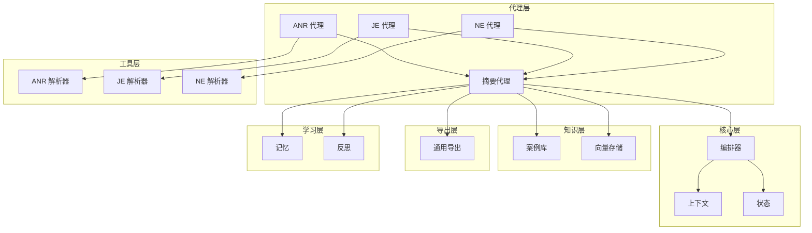
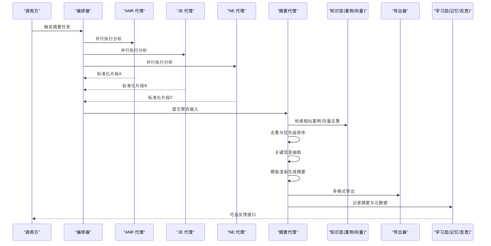
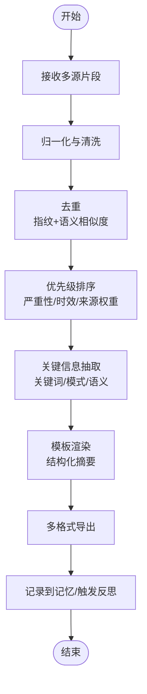
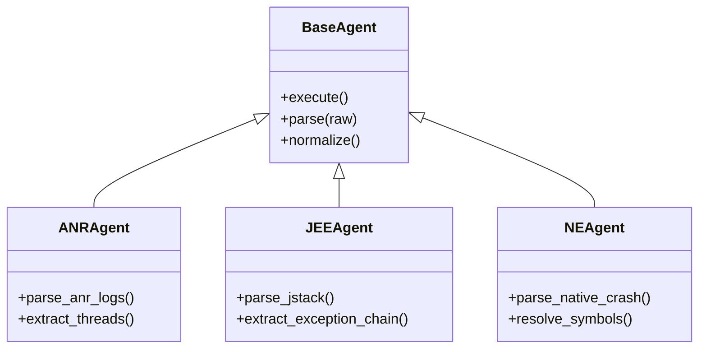
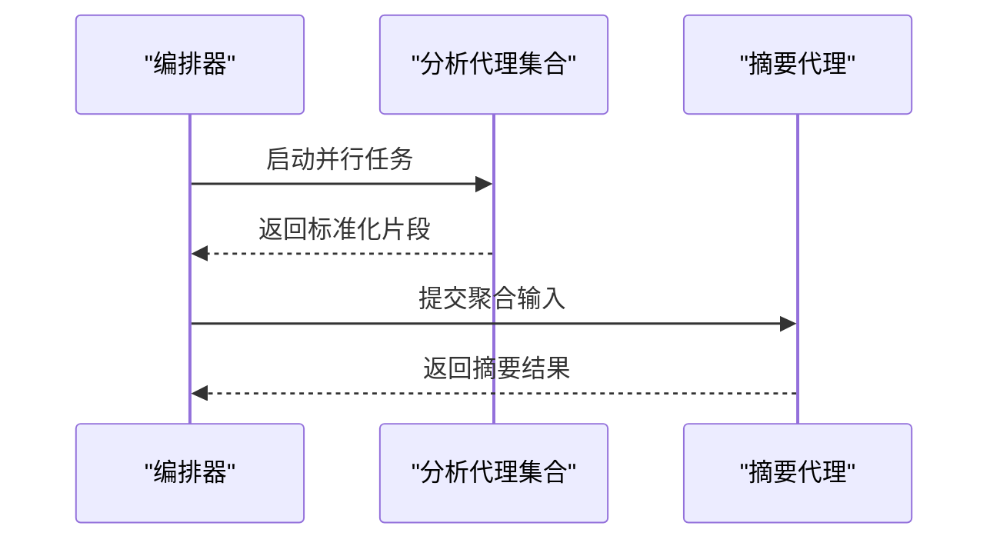
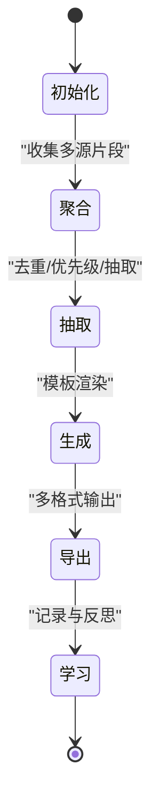
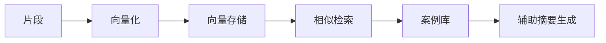
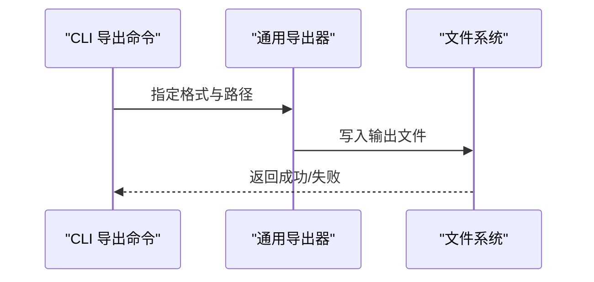
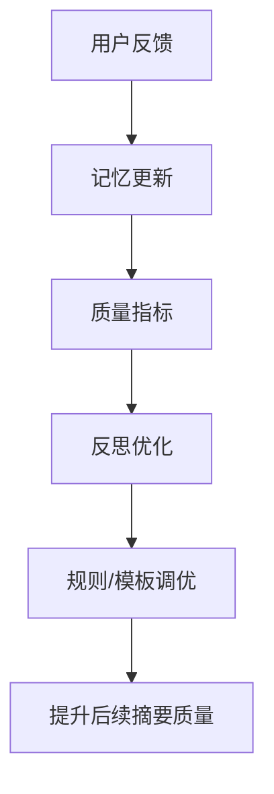
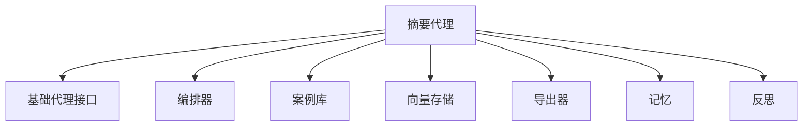

# 摘要生成代理

<cite>
**本文引用的文件**   
- [src/jirin/agents/summary_agent.py](file://src/jirin/agents/summary_agent.py)
- [src/jirin/agents/base.py](file://src/jirin/agents/base.py)
- [src/jirin/core/orchestrator.py](file://src/jirin/core/orchestrator.py)
- [src/jirin/core/context.py](file://src/jirin/core/context.py)
- [src/jirin/core/state.py](file://src/jirin/core/state.py)
- [src/jirin/knowledge/case_store.py](file://src/jirin/knowledge/case_store.py)
- [src/jirin/knowledge/vector_store.py](file://src/jirin/knowledge/vector_store.py)
- [src/jirin/tools/log_parser/anr_parser.py](file://src/jirin/tools/log_parser/anr_parser.py)
- [src/jirin/tools/log_parser/je_parser.py](file://src/jirin/tools/log_parser/je_parser.py)
- [src/jirin/tools/log_parser/ne_parser.py](file://src/jirin/tools/log_parser/ne_parser.py)
- [src/jirin/export/generic.py](file://src/jirin/export/generic.py)
- [src/jirin/cli/commands/export.py](file://src/jirin/cli/commands/export.py)
- [src/jirin/learning/memory.py](file://src/jirin/learning/memory.py)
- [src/jirin/learning/reflector.py](file://src/jirin/learning/reflector.py)
- [config/settings.toml](file://config/settings.toml)
</cite>

## 目录
1. [简介](#简介)
2. [项目结构](#项目结构)
3. [核心组件](#核心组件)
4. [架构总览](#架构总览)
5. [详细组件分析](#详细组件分析)
6. [依赖关系分析](#依赖关系分析)
7. [性能考虑](#性能考虑)
8. [故障排查指南](#故障排查指南)
9. [结论](#结论)
10. [附录](#附录)

## 简介
本技术文档围绕“摘要生成代理”展开，聚焦多源信息聚合、关键信息提取与结构化报告生成的算法与实践。文档涵盖：
- 如何整合来自不同分析代理（ANR、JE、NE）的结果
- 去重与优先级排序机制
- 自然语言处理技术在摘要中的应用
- 报告模板定制与多格式输出支持
- 摘要质量评估、用户反馈学习与持续优化机制
- 自定义摘要规则、模板开发与集成方法

## 项目结构
本项目采用分层与按功能域组织相结合的结构：
- agents：各分析代理与摘要代理的实现
- core：编排器、上下文与状态管理
- tools：日志解析器与搜索工具
- knowledge：案例库与向量存储
- export：通用导出能力
- learning：记忆与反思学习模块
- cli：命令行入口与命令实现
- config：配置项

图表来源
- [src/jirin/agents/summary_agent.py](file://src/jirin/agents/summary_agent.py)
- [src/jirin/core/orchestrator.py](file://src/jirin/core/orchestrator.py)
- [src/jirin/core/context.py](file://src/jirin/core/context.py)
- [src/jirin/core/state.py](file://src/jirin/core/state.py)
- [src/jirin/knowledge/case_store.py](file://src/jirin/knowledge/case_store.py)
- [src/jirin/knowledge/vector_store.py](file://src/jirin/knowledge/vector_store.py)
- [src/jirin/tools/log_parser/anr_parser.py](file://src/jirin/tools/log_parser/anr_parser.py)
- [src/jirin/tools/log_parser/je_parser.py](file://src/jirin/tools/log_parser/je_parser.py)
- [src/jirin/tools/log_parser/ne_parser.py](file://src/jirin/tools/log_parser/ne_parser.py)
- [src/jirin/export/generic.py](file://src/jirin/export/generic.py)
- [src/jirin/learning/memory.py](file://src/jirin/learning/memory.py)
- [src/jirin/learning/reflector.py](file://src/jirin/learning/reflector.py)

章节来源
- [src/jirin/agents/summary_agent.py](file://src/jirin/agents/summary_agent.py)
- [src/jirin/core/orchestrator.py](file://src/jirin/core/orchestrator.py)
- [src/jirin/core/context.py](file://src/jirin/core/context.py)
- [src/jirin/core/state.py](file://src/jirin/core/state.py)
- [src/jirin/knowledge/case_store.py](file://src/jirin/knowledge/case_store.py)
- [src/jirin/knowledge/vector_store.py](file://src/jirin/knowledge/vector_store.py)
- [src/jirin/tools/log_parser/anr_parser.py](file://src/jirin/tools/log_parser/anr_parser.py)
- [src/jirin/tools/log_parser/je_parser.py](file://src/jirin/tools/log_parser/je_parser.py)
- [src/jirin/tools/log_parser/ne_parser.py](file://src/jirin/tools/log_parser/ne_parser.py)
- [src/jirin/export/generic.py](file://src/jirin/export/generic.py)
- [src/jirin/learning/memory.py](file://src/jirin/learning/memory.py)
- [src/jirin/learning/reflector.py](file://src/jirin/learning/reflector.py)

## 核心组件
- 摘要代理：负责汇聚多源分析结果，执行去重、优先级排序、关键信息抽取与结构化摘要生成，并驱动导出与学习流程。
- 分析代理（ANR/JE/NE）：分别解析对应类型的日志或事件，产出标准化中间表示供摘要代理消费。
- 编排器：协调各代理的执行顺序、并发策略与错误恢复。
- 上下文与状态：维护会话级数据、中间产物与最终输出的生命周期。
- 知识层：案例库用于相似问题检索与参考；向量存储用于语义相似度计算与去重。
- 导出层：提供多格式输出（如文本、结构化标记等）。
- 学习层：记忆模块记录历史摘要与反馈；反思模块基于反馈进行规则与模板的迭代优化。

章节来源
- [src/jirin/agents/summary_agent.py](file://src/jirin/agents/summary_agent.py)
- [src/jirin/agents/base.py](file://src/jirin/agents/base.py)
- [src/jirin/core/orchestrator.py](file://src/jirin/core/orchestrator.py)
- [src/jirin/core/context.py](file://src/jirin/core/context.py)
- [src/jirin/core/state.py](file://src/jirin/core/state.py)
- [src/jirin/knowledge/case_store.py](file://src/jirin/knowledge/case_store.py)
- [src/jirin/knowledge/vector_store.py](file://src/jirin/knowledge/vector_store.py)
- [src/jirin/export/generic.py](file://src/jirin/export/generic.py)
- [src/jirin/learning/memory.py](file://src/jirin/learning/memory.py)
- [src/jirin/learning/reflector.py](file://src/jirin/learning/reflector.py)

## 架构总览
摘要生成代理的整体工作流如下：
- 输入：来自 ANR/JE/NE 分析代理的结构化片段
- 聚合：统一归一化、去重、优先级排序
- 抽取：基于关键词、模式匹配与语义相似度识别关键信息
- 生成：依据模板生成结构化摘要
- 输出：多格式导出
- 学习：收集用户反馈，更新记忆与反思模型，持续优化规则与模板

图表来源
- [src/jirin/core/orchestrator.py](file://src/jirin/core/orchestrator.py)
- [src/jirin/agents/summary_agent.py](file://src/jirin/agents/summary_agent.py)
- [src/jirin/knowledge/case_store.py](file://src/jirin/knowledge/case_store.py)
- [src/jirin/knowledge/vector_store.py](file://src/jirin/knowledge/vector_store.py)
- [src/jirin/export/generic.py](file://src/jirin/export/generic.py)
- [src/jirin/learning/memory.py](file://src/jirin/learning/memory.py)
- [src/jirin/learning/reflector.py](file://src/jirin/learning/reflector.py)

## 详细组件分析

### 摘要代理（Summary Agent）
职责与流程
- 接收来自多个分析代理的标准化片段
- 执行去重（基于内容指纹与语义相似度）
- 应用优先级策略（严重性、时间戳、来源可信度等）
- 使用 NLP 技术进行关键信息抽取（实体、事件、因果链）
- 根据模板生成结构化摘要
- 驱动导出与学习流程

图表来源
- [src/jirin/agents/summary_agent.py](file://src/jirin/agents/summary_agent.py)
- [src/jirin/knowledge/vector_store.py](file://src/jirin/knowledge/vector_store.py)
- [src/jirin/export/generic.py](file://src/jirin/export/generic.py)
- [src/jirin/learning/memory.py](file://src/jirin/learning/memory.py)
- [src/jirin/learning/reflector.py](file://src/jirin/learning/reflector.py)

章节来源
- [src/jirin/agents/summary_agent.py](file://src/jirin/agents/summary_agent.py)
- [src/jirin/agents/base.py](file://src/jirin/agents/base.py)

### 分析代理（ANR/JE/NE）
- ANR 代理：解析应用无响应相关日志，提取线程阻塞、主线程 IO、资源竞争等信号
- JE 代理：解析 Java 异常堆栈，定位异常类型、抛出位置与调用链
- NE 代理：解析原生崩溃日志，提取崩溃地址、符号信息与寄存器状态

图表来源
- [src/jirin/agents/base.py](file://src/jirin/agents/base.py)
- [src/jirin/tools/log_parser/anr_parser.py](file://src/jirin/tools/log_parser/anr_parser.py)
- [src/jirin/tools/log_parser/je_parser.py](file://src/jirin/tools/log_parser/je_parser.py)
- [src/jirin/tools/log_parser/ne_parser.py](file://src/jirin/tools/log_parser/ne_parser.py)

章节来源
- [src/jirin/tools/log_parser/anr_parser.py](file://src/jirin/tools/log_parser/anr_parser.py)
- [src/jirin/tools/log_parser/je_parser.py](file://src/jirin/tools/log_parser/je_parser.py)
- [src/jirin/tools/log_parser/ne_parser.py](file://src/jirin/tools/log_parser/ne_parser.py)
- [src/jirin/agents/base.py](file://src/jirin/agents/base.py)

### 编排器（Orchestrator）
职责
- 调度各分析代理并行执行
- 汇总中间结果并转发给摘要代理
- 管理超时、重试与错误传播

图表来源
- [src/jirin/core/orchestrator.py](file://src/jirin/core/orchestrator.py)
- [src/jirin/agents/summary_agent.py](file://src/jirin/agents/summary_agent.py)

章节来源
- [src/jirin/core/orchestrator.py](file://src/jirin/core/orchestrator.py)

### 上下文与状态（Context & State）
- 上下文：保存当前任务的输入、中间产物、配置与临时缓存
- 状态：维护摘要生成过程中的阶段状态（初始化、聚合、抽取、生成、导出、学习）

图表来源
- [src/jirin/core/context.py](file://src/jirin/core/context.py)
- [src/jirin/core/state.py](file://src/jirin/core/state.py)

章节来源
- [src/jirin/core/context.py](file://src/jirin/core/context.py)
- [src/jirin/core/state.py](file://src/jirin/core/state.py)

### 知识层（案例库与向量存储）
- 案例库：存储历史问题与解决方案，支持相似案例检索以辅助摘要生成
- 向量存储：对片段进行向量化，用于语义去重与相似度检索

图表来源
- [src/jirin/knowledge/case_store.py](file://src/jirin/knowledge/case_store.py)
- [src/jirin/knowledge/vector_store.py](file://src/jirin/knowledge/vector_store.py)

章节来源
- [src/jirin/knowledge/case_store.py](file://src/jirin/knowledge/case_store.py)
- [src/jirin/knowledge/vector_store.py](file://src/jirin/knowledge/vector_store.py)

### 导出与 CLI（多格式输出）
- 通用导出器：支持多种输出格式（如文本、结构化标记等），便于下游系统集成
- CLI 导出命令：提供命令行接口，方便批量导出与自动化流水线集成

图表来源
- [src/jirin/export/generic.py](file://src/jirin/export/generic.py)
- [src/jirin/cli/commands/export.py](file://src/jirin/cli/commands/export.py)

章节来源
- [src/jirin/export/generic.py](file://src/jirin/export/generic.py)
- [src/jirin/cli/commands/export.py](file://src/jirin/cli/commands/export.py)

### 学习层（记忆与反思）
- 记忆：记录历史摘要、用户反馈与效果指标，形成可检索的知识
- 反思：基于反馈与指标，自动调整摘要规则、模板参数与优先级权重

图表来源
- [src/jirin/learning/memory.py](file://src/jirin/learning/memory.py)
- [src/jirin/learning/reflector.py](file://src/jirin/learning/reflector.py)

章节来源
- [src/jirin/learning/memory.py](file://src/jirin/learning/memory.py)
- [src/jirin/learning/reflector.py](file://src/jirin/learning/reflector.py)

## 依赖关系分析
- 摘要代理依赖：
  - 分析代理（ANR/JE/NE）产出的标准化片段
  - 知识层（案例库与向量存储）用于相似检索与去重
  - 导出器用于多格式输出
  - 学习层用于反馈闭环
- 编排器作为中心调度者，降低耦合度并提高可扩展性

图表来源
- [src/jirin/agents/summary_agent.py](file://src/jirin/agents/summary_agent.py)
- [src/jirin/agents/base.py](file://src/jirin/agents/base.py)
- [src/jirin/core/orchestrator.py](file://src/jirin/core/orchestrator.py)
- [src/jirin/knowledge/case_store.py](file://src/jirin/knowledge/case_store.py)
- [src/jirin/knowledge/vector_store.py](file://src/jirin/knowledge/vector_store.py)
- [src/jirin/export/generic.py](file://src/jirin/export/generic.py)
- [src/jirin/learning/memory.py](file://src/jirin/learning/memory.py)
- [src/jirin/learning/reflector.py](file://src/jirin/learning/reflector.py)

章节来源
- [src/jirin/agents/summary_agent.py](file://src/jirin/agents/summary_agent.py)
- [src/jirin/agents/base.py](file://src/jirin/agents/base.py)
- [src/jirin/core/orchestrator.py](file://src/jirin/core/orchestrator.py)
- [src/jirin/knowledge/case_store.py](file://src/jirin/knowledge/case_store.py)
- [src/jirin/knowledge/vector_store.py](file://src/jirin/knowledge/vector_store.py)
- [src/jirin/export/generic.py](file://src/jirin/export/generic.py)
- [src/jirin/learning/memory.py](file://src/jirin/learning/memory.py)
- [src/jirin/learning/reflector.py](file://src/jirin/learning/reflector.py)

## 性能考虑
- 并行执行：通过编排器并行运行分析代理，缩短端到端时延
- 去重优化：结合内容指纹与向量相似度阈值，避免重复计算与冗余输出
- 增量更新：仅对新增或变更片段进行向量化与检索，减少全量开销
- 模板渲染：预编译常用模板，减少运行时解析成本
- I/O 优化：批量写入导出文件，减少频繁磁盘操作

[本节为通用指导，不直接分析具体文件]

## 故障排查指南
- 常见问题
  - 多源片段缺失或格式不一致：检查各分析代理的解析器输出是否标准化
  - 去重过度导致信息丢失：调整向量相似度阈值与指纹策略
  - 优先级排序不合理：检查严重性、时效性与来源权重配置
  - 导出失败：确认导出格式与目标路径权限
- 建议步骤
  - 启用详细日志，定位失败阶段
  - 使用最小复现集验证解析器与模板
  - 回滚最近一次规则/模板变更，观察是否恢复

章节来源
- [src/jirin/agents/summary_agent.py](file://src/jirin/agents/summary_agent.py)
- [src/jirin/export/generic.py](file://src/jirin/export/generic.py)
- [config/settings.toml](file://config/settings.toml)

## 结论
摘要生成代理通过多源聚合、智能去重、优先级排序与模板化生成，实现了高质量的结构化报告输出。借助知识层与学习层的闭环，系统能够持续从用户反馈中优化规则与模板，提升摘要准确性与可用性。

[本节为总结性内容，不直接分析具体文件]

## 附录

### 自定义摘要规则
- 定义规则条目：包括触发条件、影响维度（严重性、时效性）、权重系数
- 规则注册：在摘要代理的规则表中注册新规则
- 规则测试：使用历史片段进行回归测试，确保规则生效且无副作用

章节来源
- [src/jirin/agents/summary_agent.py](file://src/jirin/agents/summary_agent.py)
- [config/settings.toml](file://config/settings.toml)

### 模板开发
- 模板结构：定义标题、摘要段落、关键发现、建议措施等区块
- 变量绑定：将抽取到的关键信息映射到模板变量
- 渲染引擎：选择合适模板引擎，支持条件分支与循环

章节来源
- [src/jirin/export/generic.py](file://src/jirin/export/generic.py)

### 集成方法
- 通过 CLI 导出命令集成到 CI/CD 流水线
- 通过 API 或消息队列对接外部系统
- 使用编排器扩展新的分析代理，保持解耦

章节来源
- [src/jirin/cli/commands/export.py](file://src/jirin/cli/commands/export.py)
- [src/jirin/core/orchestrator.py](file://src/jirin/core/orchestrator.py)