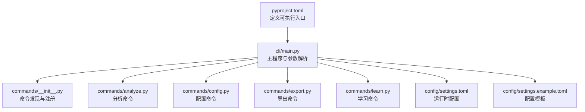
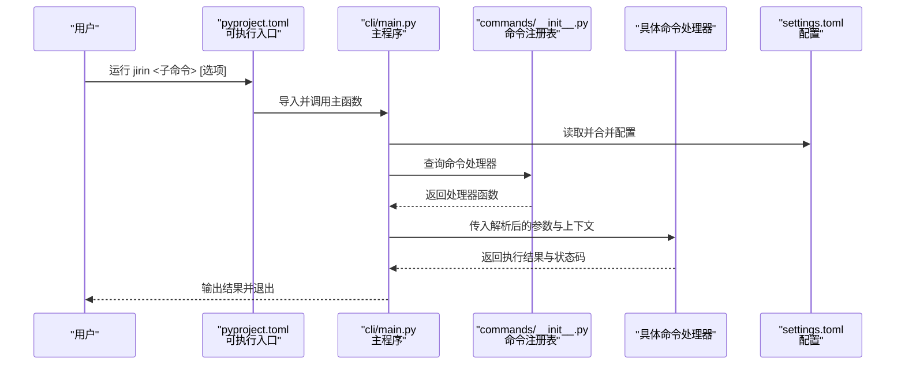
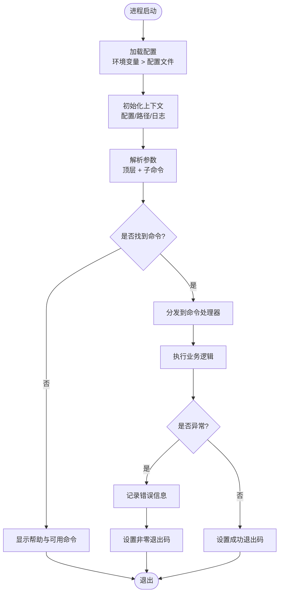
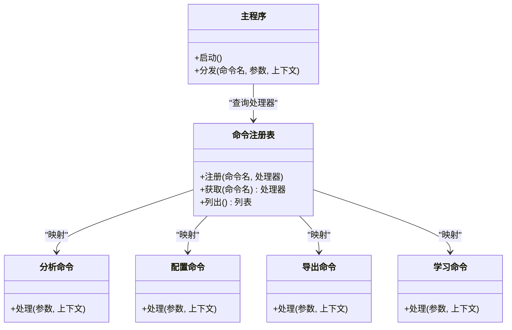
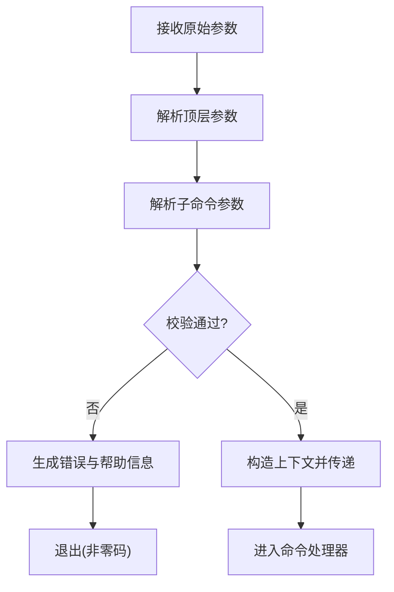
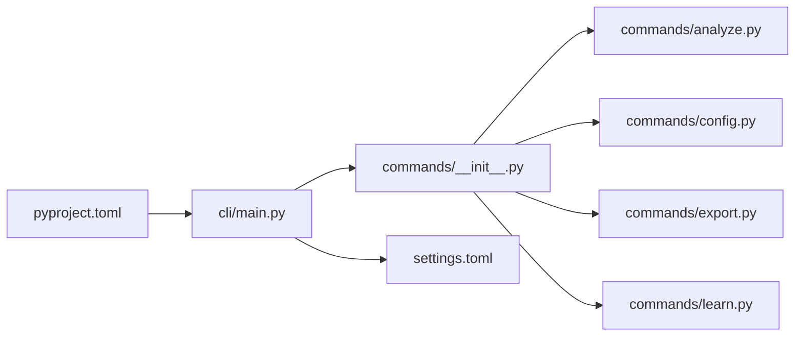

# CLI接口概览

<cite>
**本文引用的文件**   
- [src/jirin/cli/main.py](file://src/jirin/cli/main.py)
- [src/jirin/cli/commands/__init__.py](file://src/jirin/cli/commands/__init__.py)
- [src/jirin/cli/commands/analyze.py](file://src/jirin/cli/commands/analyze.py)
- [src/jirin/cli/commands/config.py](file://src/jirin/cli/commands/config.py)
- [src/jirin/cli/commands/export.py](file://src/jirin/cli/commands/export.py)
- [src/jirin/cli/commands/learn.py](file://src/jirin/cli/commands/learn.py)
- [config/settings.example.toml](file://config/settings.example.toml)
- [config/settings.toml](file://config/settings.toml)
- [pyproject.toml](file://pyproject.toml)
</cite>

## 目录
1. [简介](#简介)
2. [项目结构](#项目结构)
3. [核心组件](#核心组件)
4. [架构总览](#架构总览)
5. [详细组件分析](#详细组件分析)
6. [依赖关系分析](#依赖关系分析)
7. [性能与可扩展性](#性能与可扩展性)
8. [故障排查指南](#故障排查指南)
9. [结论](#结论)
10. [附录：快速入门](#附录快速入门)

## 简介
本概览文档面向Jirin命令行工具的新用户与维护者，系统阐述CLI的整体架构、命令组织与设计原则，解释启动流程、命令注册机制与参数解析体系，并提供常用工作流与环境配置说明。通过分层讲解与图示，帮助读者快速上手并理解设计思路。

## 项目结构
Jirin的CLI入口位于src/jirin/cli目录，采用“主程序 + 子命令插件”的组织方式：
- 主程序负责解析顶层参数、加载全局配置、初始化上下文，并将请求路由到具体子命令。
- 子命令以独立模块存放于src/jirin/cli/commands，每个命令对应一个Python文件，便于扩展与维护。
- 配置项集中在config目录，支持示例模板与实际配置文件分离。
- 可执行入口在pyproject中声明，便于通过包管理器或脚本直接调用。

图表来源
- [pyproject.toml](file://pyproject.toml)
- [src/jirin/cli/main.py](file://src/jirin/cli/main.py)
- [src/jirin/cli/commands/__init__.py](file://src/jirin/cli/commands/__init__.py)
- [src/jirin/cli/commands/analyze.py](file://src/jirin/cli/commands/analyze.py)
- [src/jirin/cli/commands/config.py](file://src/jirin/cli/commands/config.py)
- [src/jirin/cli/commands/export.py](file://src/jirin/cli/commands/export.py)
- [src/jirin/cli/commands/learn.py](file://src/jirin/cli/commands/learn.py)
- [config/settings.toml](file://config/settings.toml)
- [config/settings.example.toml](file://config/settings.example.toml)

章节来源
- [src/jirin/cli/main.py](file://src/jirin/cli/main.py)
- [src/jirin/cli/commands/__init__.py](file://src/jirin/cli/commands/__init__.py)
- [config/settings.example.toml](file://config/settings.example.toml)
- [config/settings.toml](file://config/settings.toml)
- [pyproject.toml](file://pyproject.toml)

## 核心组件
- 主程序（main.py）
  - 职责：解析顶层参数、加载配置、构建运行上下文、分发到子命令、统一错误处理与退出码。
  - 关键流程：初始化日志与配置 → 解析参数 → 选择命令处理器 → 执行业务逻辑 → 输出结果。
- 命令注册中心（commands/__init__.py）
  - 职责：集中注册所有子命令，提供命令名到处理函数的映射，便于新增命令时仅在此处登记。
- 子命令模块
  - analyze.py：分析与诊断相关能力。
  - config.py：查看与修改配置。
  - export.py：将分析结果或知识导出为外部格式。
  - learn.py：学习与记忆相关的功能。
- 配置系统
  - settings.toml：运行时配置，包含路径、开关、阈值等。
  - settings.example.toml：配置模板，用于快速初始化。

章节来源
- [src/jirin/cli/main.py](file://src/jirin/cli/main.py)
- [src/jirin/cli/commands/__init__.py](file://src/jirin/cli/commands/__init__.py)
- [src/jirin/cli/commands/analyze.py](file://src/jirin/cli/commands/analyze.py)
- [src/jirin/cli/commands/config.py](file://src/jirin/cli/commands/config.py)
- [src/jirin/cli/commands/export.py](file://src/jirin/cli/commands/export.py)
- [src/jirin/cli/commands/learn.py](file://src/jirin/cli/commands/learn.py)
- [config/settings.toml](file://config/settings.toml)
- [config/settings.example.toml](file://config/settings.example.toml)

## 架构总览
下图展示了从进程启动到命令执行的端到端流程，包括参数解析、配置加载、命令分发与执行。

图表来源
- [pyproject.toml](file://pyproject.toml)
- [src/jirin/cli/main.py](file://src/jirin/cli/main.py)
- [src/jirin/cli/commands/__init__.py](file://src/jirin/cli/commands/__init__.py)
- [config/settings.toml](file://config/settings.toml)

## 详细组件分析

### 主程序与启动流程
- 启动阶段
  - 加载配置：优先使用环境变量覆盖，再回退到配置文件默认值。
  - 初始化上下文：创建共享状态对象，注入配置、路径、日志级别等。
  - 参数解析：基于顶层参数与子命令参数进行校验与转换。
- 路由阶段
  - 根据命令名查找处理器；若未找到则提示可用命令列表。
  - 将解析后的参数与上下文传递给处理器。
- 执行阶段
  - 处理器执行业务逻辑，记录关键步骤与异常。
  - 主程序统一收集退出码与输出，保证一致的用户体验。

图表来源
- [src/jirin/cli/main.py](file://src/jirin/cli/main.py)

章节来源
- [src/jirin/cli/main.py](file://src/jirin/cli/main.py)

### 命令注册机制
- 注册位置：commands/__init__.py集中维护命令名到处理器的映射。
- 新增命令步骤：
  - 在commands目录下新建命令文件，实现处理器函数。
  - 在注册表中添加映射条目，使主程序可发现该命令。
- 设计原则：
  - 低耦合：命令处理器只关注自身逻辑，不关心注册细节。
  - 高内聚：命令内部参数、校验、执行逻辑集中管理。
  - 易扩展：新增命令无需改动主程序路由逻辑。

图表来源
- [src/jirin/cli/commands/__init__.py](file://src/jirin/cli/commands/__init__.py)
- [src/jirin/cli/commands/analyze.py](file://src/jirin/cli/commands/analyze.py)
- [src/jirin/cli/commands/config.py](file://src/jirin/cli/commands/config.py)
- [src/jirin/cli/commands/export.py](file://src/jirin/cli/commands/export.py)
- [src/jirin/cli/commands/learn.py](file://src/jirin/cli/commands/learn.py)

章节来源
- [src/jirin/cli/commands/__init__.py](file://src/jirin/cli/commands/__init__.py)
- [src/jirin/cli/commands/analyze.py](file://src/jirin/cli/commands/analyze.py)
- [src/jirin/cli/commands/config.py](file://src/jirin/cli/commands/config.py)
- [src/jirin/cli/commands/export.py](file://src/jirin/cli/commands/export.py)
- [src/jirin/cli/commands/learn.py](file://src/jirin/cli/commands/learn.py)

### 参数解析系统
- 顶层参数
  - 常见选项：版本、帮助、日志级别、配置文件路径等。
  - 行为：影响全局行为，如输出格式、调试模式、配置覆盖。
- 子命令参数
  - 每个命令拥有独立的参数集，遵循最小必要原则。
  - 类型校验与默认值由解析器统一处理，确保一致性。
- 优先级
  - 命令行参数 > 环境变量 > 配置文件默认值。
- 错误处理
  - 缺失必填参数时给出明确提示与用法摘要。
  - 类型不匹配时提示期望类型与示例。

图表来源
- [src/jirin/cli/main.py](file://src/jirin/cli/main.py)

章节来源
- [src/jirin/cli/main.py](file://src/jirin/cli/main.py)

### 配置与环境变量
- 配置文件
  - settings.toml：实际生效的配置，建议纳入版本控制但排除敏感信息。
  - settings.example.toml：模板文件，展示所有可用键与默认值。
- 环境变量
  - 支持通过环境变量覆盖配置项，便于CI/CD与多环境部署。
- 典型配置项类别
  - 路径类：输入/输出目录、缓存目录等。
  - 开关类：启用/禁用某功能、调试模式等。
  - 阈值类：超时、重试次数、并发度等。

章节来源
- [config/settings.toml](file://config/settings.toml)
- [config/settings.example.toml](file://config/settings.example.toml)

## 依赖关系分析
- 入口依赖
  - pyproject.toml声明可执行入口，指向主程序。
- 主程序依赖
  - 依赖命令注册表进行路由。
  - 依赖配置系统加载与合并配置。
- 命令模块依赖
  - 各命令模块相互独立，避免循环依赖。
  - 如需共享能力，应通过上层上下文或工具库注入。

图表来源
- [pyproject.toml](file://pyproject.toml)
- [src/jirin/cli/main.py](file://src/jirin/cli/main.py)
- [src/jirin/cli/commands/__init__.py](file://src/jirin/cli/commands/__init__.py)
- [src/jirin/cli/commands/analyze.py](file://src/jirin/cli/commands/analyze.py)
- [src/jirin/cli/commands/config.py](file://src/jirin/cli/commands/config.py)
- [src/jirin/cli/commands/export.py](file://src/jirin/cli/commands/export.py)
- [src/jirin/cli/commands/learn.py](file://src/jirin/cli/commands/learn.py)
- [config/settings.toml](file://config/settings.toml)

章节来源
- [pyproject.toml](file://pyproject.toml)
- [src/jirin/cli/main.py](file://src/jirin/cli/main.py)
- [src/jirin/cli/commands/__init__.py](file://src/jirin/cli/commands/__init__.py)
- [config/settings.toml](file://config/settings.toml)

## 性能与可扩展性
- 启动性能
  - 延迟加载：仅在需要时导入命令模块，减少冷启动开销。
  - 配置预取：按需读取配置，避免不必要的I/O。
- 执行性能
  - 并行化：对可并行的任务（如批量分析）提供并发选项。
  - 缓存：对中间结果与向量检索结果进行缓存，降低重复计算。
- 可扩展性
  - 插件式命令：新增命令只需注册，不影响现有流程。
  - 配置驱动：通过配置切换功能开关与策略，无需改代码。

[本节为通用指导，不涉及具体文件分析]

## 故障排查指南
- 常见问题
  - 找不到命令：检查命令是否正确注册，确认命令名拼写。
  - 参数错误：查看帮助信息与错误提示，核对必填参数与类型。
  - 配置无效：确认配置文件路径与权限，检查环境变量覆盖。
- 定位方法
  - 提高日志级别：使用顶层参数开启更详细的日志输出。
  - 最小复现：剥离无关参数，逐步缩小问题范围。
  - 隔离环境：使用干净的环境变量与配置文件验证。

章节来源
- [src/jirin/cli/main.py](file://src/jirin/cli/main.py)
- [config/settings.toml](file://config/settings.toml)

## 结论
Jirin CLI采用清晰的分层与插件化设计，主程序负责编排与分发，命令模块专注业务逻辑，配置与环境变量提供灵活的控制面。通过统一的参数解析与错误处理，保证了良好的用户体验与可维护性。新用户可通过快速入门掌握常用工作流，维护者可基于注册机制轻松扩展新能力。

[本节为总结性内容，不涉及具体文件分析]

## 附录：快速入门
- 安装与入口
  - 通过包管理器安装后，使用jirin作为可执行名称。
- 基本用法
  - 查看帮助：jirin --help
  - 查看版本：jirin --version
- 常用命令组合
  - 分析：jirin analyze [目标文件或目录] [可选过滤参数]
  - 配置：jirin config show | set [键] [值]
  - 导出：jirin export [源] --format [json|yaml|...] --output [路径]
  - 学习：jirin learn [模式] [数据源] [输出]
- 典型工作流
  - 准备配置：复制settings.example.toml为settings.toml并按需调整。
  - 执行分析：指定输入路径与过滤条件，观察输出与日志。
  - 导出结果：选择合适的导出格式与输出目录，便于后续处理。
  - 迭代优化：结合学习命令更新知识库，提升后续分析质量。
- 环境变量参考
  - 通过环境变量覆盖配置项，例如设置日志级别、输出目录等。
  - 在CI/CD中注入不同环境的配置，实现无侵入切换。

章节来源
- [config/settings.example.toml](file://config/settings.example.toml)
- [config/settings.toml](file://config/settings.toml)
- [src/jirin/cli/commands/analyze.py](file://src/jirin/cli/commands/analyze.py)
- [src/jirin/cli/commands/config.py](file://src/jirin/cli/commands/config.py)
- [src/jirin/cli/commands/export.py](file://src/jirin/cli/commands/export.py)
- [src/jirin/cli/commands/learn.py](file://src/jirin/cli/commands/learn.py)