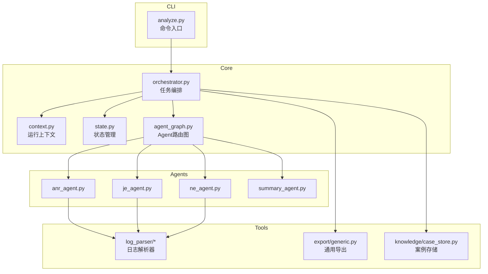
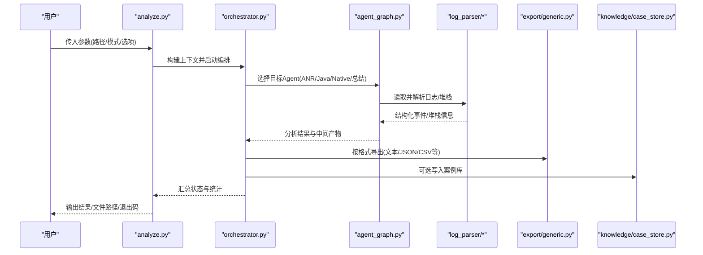
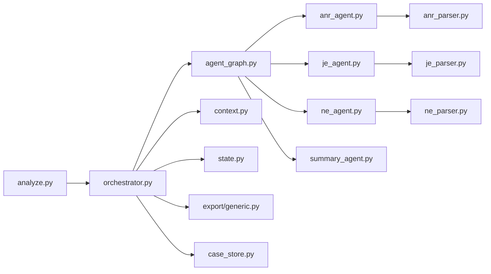

# analyze命令详解

<cite>
**本文引用的文件**   
- [src/jirin/cli/commands/analyze.py](file://src/jirin/cli/commands/analyze.py)
- [src/jirin/core/orchestrator.py](file://src/jirin/core/orchestrator.py)
- [src/jirin/core/context.py](file://src/jirin/core/context.py)
- [src/jirin/core/state.py](file://src/jirin/core/state.py)
- [src/jirin/core/agent_graph.py](file://src/jirin/core/agent_graph.py)
- [src/jirin/agents/anr_agent.py](file://src/jirin/agents/anr_agent.py)
- [src/jirin/agents/je_agent.py](file://src/jirin/agents/je_agent.py)
- [src/jirin/agents/ne_agent.py](file://src/jirin/agents/ne_agent.py)
- [src/jirin/agents/summary_agent.py](file://src/jirin/agents/summary_agent.py)
- [src/jirin/tools/log_parser/anr_parser.py](file://src/jirin/tools/log_parser/anr_parser.py)
- [src/jirin/tools/log_parser/je_parser.py](file://src/jirin/tools/log_parser/je_parser.py)
- [src/jirin/tools/log_parser/ne_parser.py](file://src/jirin/tools/log_parser/ne_parser.py)
- [src/jirin/knowledge/case_store.py](file://src/jirin/knowledge/case_store.py)
- [src/jirin/export/generic.py](file://src/jirin/export/generic.py)
- [pyproject.toml](file://pyproject.toml)
</cite>

## 目录
1. [简介](#简介)
2. [项目结构](#项目结构)
3. [核心组件](#核心组件)
4. [架构总览](#架构总览)
5. [详细组件分析](#详细组件分析)
6. [依赖关系分析](#依赖关系分析)
7. [性能考虑](#性能考虑)
8. [故障排查指南](#故障排查指南)
9. [结论](#结论)
10. [附录](#附录)

## 简介
本文件为 analyze 命令的权威 API 文档，覆盖单文件分析、目录批量分析、实时日志监控等模式；详细说明参数作用、数据类型、默认值与校验规则；提供 Android 崩溃分析常见场景（ANR、Java 异常、Native 崩溃）的使用示例；说明输出格式选项、过滤条件设置与性能优化参数；并给出与其他工具集成和自动化脚本编写方法。

## 项目结构
analyze 命令位于 CLI 层，负责解析用户输入、构建执行上下文、调度编排器与 Agent 图，并将结果导出或回显。核心流程由 orchestrator 驱动，Agent 图根据输入类型选择 ANR、Java 异常、Native 崩溃等专用 Agent，并结合日志解析器进行数据预处理。

图表来源
- [src/jirin/cli/commands/analyze.py](file://src/jirin/cli/commands/analyze.py)
- [src/jirin/core/orchestrator.py](file://src/jirin/core/orchestrator.py)
- [src/jirin/core/context.py](file://src/jirin/core/context.py)
- [src/jirin/core/state.py](file://src/jirin/core/state.py)
- [src/jirin/core/agent_graph.py](file://src/jirin/core/agent_graph.py)
- [src/jirin/agents/anr_agent.py](file://src/jirin/agents/anr_agent.py)
- [src/jirin/agents/je_agent.py](file://src/jirin/agents/je_agent.py)
- [src/jirin/agents/ne_agent.py](file://src/jirin/agents/ne_agent.py)
- [src/jirin/agents/summary_agent.py](file://src/jirin/agents/summary_agent.py)
- [src/jirin/tools/log_parser/anr_parser.py](file://src/jirin/tools/log_parser/anr_parser.py)
- [src/jirin/tools/log_parser/je_parser.py](file://src/jirin/tools/log_parser/je_parser.py)
- [src/jirin/tools/log_parser/ne_parser.py](file://src/jirin/tools/log_parser/ne_parser.py)
- [src/jirin/export/generic.py](file://src/jirin/export/generic.py)
- [src/jirin/knowledge/case_store.py](file://src/jirin/knowledge/case_store.py)

章节来源
- [src/jirin/cli/commands/analyze.py](file://src/jirin/cli/commands/analyze.py)
- [src/jirin/core/orchestrator.py](file://src/jirin/core/orchestrator.py)
- [src/jirin/core/context.py](file://src/jirin/core/context.py)
- [src/jirin/core/state.py](file://src/jirin/core/state.py)
- [src/jirin/core/agent_graph.py](file://src/jirin/core/agent_graph.py)
- [src/jirin/agents/anr_agent.py](file://src/jirin/agents/anr_agent.py)
- [src/jirin/agents/je_agent.py](file://src/jirin/agents/je_agent.py)
- [src/jirin/agents/ne_agent.py](file://src/jirin/agents/ne_agent.py)
- [src/jirin/agents/summary_agent.py](file://src/jirin/agents/summary_agent.py)
- [src/jirin/tools/log_parser/anr_parser.py](file://src/jirin/tools/log_parser/anr_parser.py)
- [src/jirin/tools/log_parser/je_parser.py](file://src/jirin/tools/log_parser/je_parser.py)
- [src/jirin/tools/log_parser/ne_parser.py](file://src/jirin/tools/log_parser/ne_parser.py)
- [src/jirin/export/generic.py](file://src/jirin/export/generic.py)
- [src/jirin/knowledge/case_store.py](file://src/jirin/knowledge/case_store.py)

## 核心组件
- 命令入口：解析命令行参数、构建上下文、调用编排器、处理输出与导出。
- 编排器：统一调度 Agent 图、生命周期管理、错误聚合与进度上报。
- Agent 图：根据输入类型与配置动态选择 ANR/Java/Native/总结 Agent。
- 日志解析器：针对 ANR、Java 异常、Native 崩溃的日志结构化解析。
- 导出模块：将分析结果以多种格式输出到文件或标准输出。
- 知识/案例存储：持久化历史案例与向量检索支持（可选）。

章节来源
- [src/jirin/cli/commands/analyze.py](file://src/jirin/cli/commands/analyze.py)
- [src/jirin/core/orchestrator.py](file://src/jirin/core/orchestrator.py)
- [src/jirin/core/agent_graph.py](file://src/jirin/core/agent_graph.py)
- [src/jirin/tools/log_parser/anr_parser.py](file://src/jirin/tools/log_parser/anr_parser.py)
- [src/jirin/tools/log_parser/je_parser.py](file://src/jirin/tools/log_parser/je_parser.py)
- [src/jirin/tools/log_parser/ne_parser.py](file://src/jirin/tools/log_parser/ne_parser.py)
- [src/jirin/export/generic.py](file://src/jirin/export/generic.py)
- [src/jirin/knowledge/case_store.py](file://src/jirin/knowledge/case_store.py)

## 架构总览
analyze 命令的整体执行流程如下：

图表来源
- [src/jirin/cli/commands/analyze.py](file://src/jirin/cli/commands/analyze.py)
- [src/jirin/core/orchestrator.py](file://src/jirin/core/orchestrator.py)
- [src/jirin/core/agent_graph.py](file://src/jirin/core/agent_graph.py)
- [src/jirin/tools/log_parser/anr_parser.py](file://src/jirin/tools/log_parser/anr_parser.py)
- [src/jirin/tools/log_parser/je_parser.py](file://src/jirin/tools/log_parser/je_parser.py)
- [src/jirin/tools/log_parser/ne_parser.py](file://src/jirin/tools/log_parser/ne_parser.py)
- [src/jirin/export/generic.py](file://src/jirin/export/generic.py)
- [src/jirin/knowledge/case_store.py](file://src/jirin/knowledge/case_store.py)

## 详细组件分析

### 命令入口与参数定义
- 功能要点
  - 支持单文件分析与目录批量分析。
  - 支持实时日志监控模式（持续读取设备或本地日志流）。
  - 提供输出格式选择、过滤条件、并发与超时控制等高级选项。
- 关键参数（概念性说明）
  - 输入源：文件或目录路径。
  - 模式：自动识别、ANR、Java异常、Native崩溃、总结。
  - 输出：文本、JSON、CSV、Markdown 等。
  - 过滤：时间范围、进程/线程名、关键字匹配、严重级别。
  - 性能：并发度、批大小、超时、重试次数。
  - 监控：是否开启实时模式、轮询间隔、最大行数限制。
  - 导出：输出路径、是否追加、是否压缩归档。
  - 其他：调试开关、日志级别、配置文件路径。
- 验证规则（概念性说明）
  - 路径存在性与可读性检查。
  - 模式与输入源的兼容性校验。
  - 数值型参数的边界检查（如并发度>0、超时>0）。
  - 输出格式与导出路径合法性校验。

章节来源
- [src/jirin/cli/commands/analyze.py](file://src/jirin/cli/commands/analyze.py)

### 编排器与上下文
- 编排器职责
  - 初始化运行上下文与状态机。
  - 加载 Agent 图并根据输入类型路由。
  - 管理任务生命周期、错误收集与重试策略。
  - 聚合各 Agent 的分析结果并触发导出。
- 上下文与状态
  - 上下文包含配置、输入源、输出目标、临时目录、并发与超时等。
  - 状态机跟踪任务阶段（准备、解析、分析、导出、完成/失败）。

章节来源
- [src/jirin/core/orchestrator.py](file://src/jirin/core/orchestrator.py)
- [src/jirin/core/context.py](file://src/jirin/core/context.py)
- [src/jirin/core/state.py](file://src/jirin/core/state.py)

### Agent 图与路由
- 路由策略
  - 基于输入类型与模式选择对应 Agent：ANR、Java异常、Native崩溃、总结。
  - 支持多 Agent 串联（例如先解析后总结）。
- Agent 能力
  - ANR Agent：定位主线程阻塞、Looper 卡顿、系统服务交互问题。
  - Java 异常 Agent：解析堆栈、定位异常根因、关联代码片段。
  - Native 崩溃 Agent：解析 native 堆栈、符号表映射、寄存器与内存快照。
  - 总结 Agent：生成可读报告、建议修复步骤与风险等级。

章节来源
- [src/jirin/core/agent_graph.py](file://src/jirin/core/agent_graph.py)
- [src/jirin/agents/anr_agent.py](file://src/jirin/agents/anr_agent.py)
- [src/jirin/agents/je_agent.py](file://src/jirin/agents/je_agent.py)
- [src/jirin/agents/ne_agent.py](file://src/jirin/agents/ne_agent.py)
- [src/jirin/agents/summary_agent.py](file://src/jirin/agents/summary_agent.py)

### 日志解析器
- 解析器分工
  - ANR 解析器：提取 ANR 头、主线程堆栈、系统服务等待信息。
  - Java 异常解析器：抽取异常链、类名、方法名、行号与线程信息。
  - Native 崩溃解析器：解析信号、堆栈帧、模块与偏移、寄存器状态。
- 数据结构与复杂度（概念性说明）
  - 解析结果通常以树形结构表示（异常链/堆栈帧），时间复杂度与日志规模线性相关。
  - 可通过过滤与分页降低单次解析开销。

章节来源
- [src/jirin/tools/log_parser/anr_parser.py](file://src/jirin/tools/log_parser/anr_parser.py)
- [src/jirin/tools/log_parser/je_parser.py](file://src/jirin/tools/log_parser/je_parser.py)
- [src/jirin/tools/log_parser/ne_parser.py](file://src/jirin/tools/log_parser/ne_parser.py)

### 导出与案例存储
- 导出模块
  - 支持多种输出格式与编码。
  - 支持增量导出与归档压缩。
- 案例存储
  - 将典型崩溃案例与分析报告持久化，便于后续检索与学习。

章节来源
- [src/jirin/export/generic.py](file://src/jirin/export/generic.py)
- [src/jirin/knowledge/case_store.py](file://src/jirin/knowledge/case_store.py)

## 依赖关系分析
- 内部依赖
  - analyze.py 依赖 orchestrator、context、state、agent_graph。
  - orchestrator 依赖 agent_graph、导出模块、案例存储。
  - Agent 依赖对应日志解析器。
- 外部依赖
  - 文件系统读写、可选的设备通信（adb）、可选的向量数据库（用于知识检索）。

图表来源
- [src/jirin/cli/commands/analyze.py](file://src/jirin/cli/commands/analyze.py)
- [src/jirin/core/orchestrator.py](file://src/jirin/core/orchestrator.py)
- [src/jirin/core/context.py](file://src/jirin/core/context.py)
- [src/jirin/core/state.py](file://src/jirin/core/state.py)
- [src/jirin/core/agent_graph.py](file://src/jirin/core/agent_graph.py)
- [src/jirin/agents/anr_agent.py](file://src/jirin/agents/anr_agent.py)
- [src/jirin/agents/je_agent.py](file://src/jirin/agents/je_agent.py)
- [src/jirin/agents/ne_agent.py](file://src/jirin/agents/ne_agent.py)
- [src/jirin/agents/summary_agent.py](file://src/jirin/agents/summary_agent.py)
- [src/jirin/tools/log_parser/anr_parser.py](file://src/jirin/tools/log_parser/anr_parser.py)
- [src/jirin/tools/log_parser/je_parser.py](file://src/jirin/tools/log_parser/je_parser.py)
- [src/jirin/tools/log_parser/ne_parser.py](file://src/jirin/tools/log_parser/ne_parser.py)
- [src/jirin/export/generic.py](file://src/jirin/export/generic.py)
- [src/jirin/knowledge/case_store.py](file://src/jirin/knowledge/case_store.py)

章节来源
- [src/jirin/cli/commands/analyze.py](file://src/jirin/cli/commands/analyze.py)
- [src/jirin/core/orchestrator.py](file://src/jirin/core/orchestrator.py)
- [src/jirin/core/agent_graph.py](file://src/jirin/core/agent_graph.py)
- [src/jirin/export/generic.py](file://src/jirin/export/generic.py)
- [src/jirin/knowledge/case_store.py](file://src/jirin/knowledge/case_store.py)

## 性能考虑
- 并发与批处理
  - 合理设置并发度与批大小，避免 I/O 瓶颈与内存峰值过高。
- 过滤与裁剪
  - 使用时间与关键字过滤减少解析量；对超大日志启用分页读取。
- 超时与重试
  - 为网络或设备访问设置超时与重试上限，防止长时间挂起。
- 导出优化
  - 大结果集优先采用流式导出或分片输出；必要时启用压缩归档。

[本节为通用指导，不直接分析具体文件]

## 故障排查指南
- 常见问题
  - 输入路径无效或不可读：检查权限与路径是否存在。
  - 模式与输入不兼容：确认所选模式适用于当前输入类型。
  - 解析失败：查看日志中解析器抛出的错误详情，核对日志格式。
  - 导出失败：检查输出目录权限与磁盘空间。
- 诊断手段
  - 开启调试模式获取更详细的执行轨迹。
  - 使用最小复现样本隔离问题。
  - 通过过滤条件缩小范围快速定位。

章节来源
- [src/jirin/cli/commands/analyze.py](file://src/jirin/cli/commands/analyze.py)
- [src/jirin/core/orchestrator.py](file://src/jirin/core/orchestrator.py)
- [src/jirin/tools/log_parser/anr_parser.py](file://src/jirin/tools/log_parser/anr_parser.py)
- [src/jirin/tools/log_parser/je_parser.py](file://src/jirin/tools/log_parser/je_parser.py)
- [src/jirin/tools/log_parser/ne_parser.py](file://src/jirin/tools/log_parser/ne_parser.py)

## 结论
analyze 命令通过清晰的 CLI 接口、可插拔的 Agent 图与模块化解析器，提供了面向 Android 崩溃分析的完整工作流。借助灵活的过滤与导出选项，以及可扩展的知识存储，能够满足从个人调试到团队自动化流水线的需求。

[本节为总结性内容，不直接分析具体文件]

## 附录

### 使用示例（概念性）
- 单文件分析
  - 指定一个 ANR 日志文件进行分析，输出 JSON 报告。
- 目录批量分析
  - 指定包含多个日志文件的目录，按文件名或时间顺序批量处理，合并导出。
- 实时日志监控
  - 连接设备或监听本地日志流，按关键字过滤并实时输出告警摘要。
- 过滤条件
  - 限定时间窗口、进程/线程名、关键字匹配与严重级别。
- 输出格式
  - 文本、JSON、CSV、Markdown 等格式按需选择，支持写入文件或标准输出。
- 性能优化
  - 调整并发度、批大小、超时与重试次数，结合过滤减少解析量。

[本节为概念性示例，不直接分析具体文件]

### 与其他工具的集成与自动化
- 与 CI/CD 集成
  - 在流水线中作为质量门禁，对提交引入的崩溃日志进行回归分析。
- 与日志采集系统对接
  - 通过管道或消息队列接收日志，调用 analyze 命令进行离线分析。
- 与缺陷管理系统联动
  - 将分析结果与报告链接写入缺陷条目，附带关键堆栈与建议修复。
- 脚本化编排
  - 使用 shell 或 Python 脚本组合 analyze 命令，实现批量处理与结果聚合。

[本节为概念性指导，不直接分析具体文件]

### 参考配置
- 项目级配置
  - 可在 pyproject.toml 中声明 CLI 命令与依赖，确保环境一致性。

章节来源
- [pyproject.toml](file://pyproject.toml)