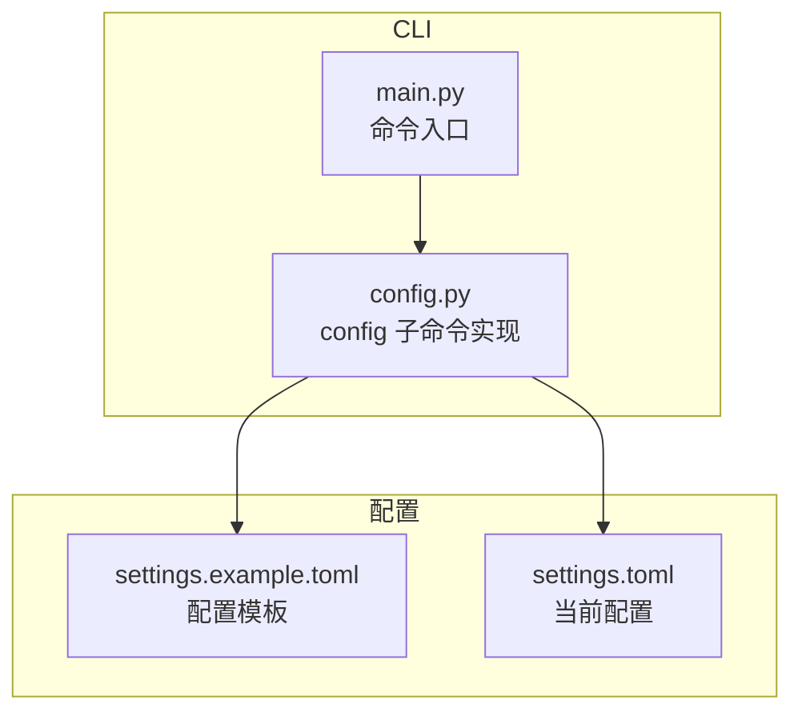
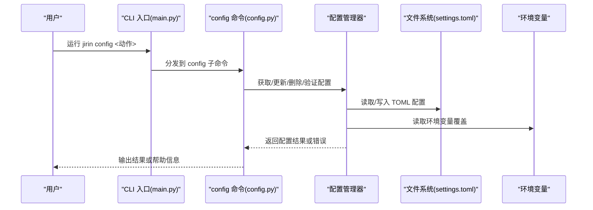
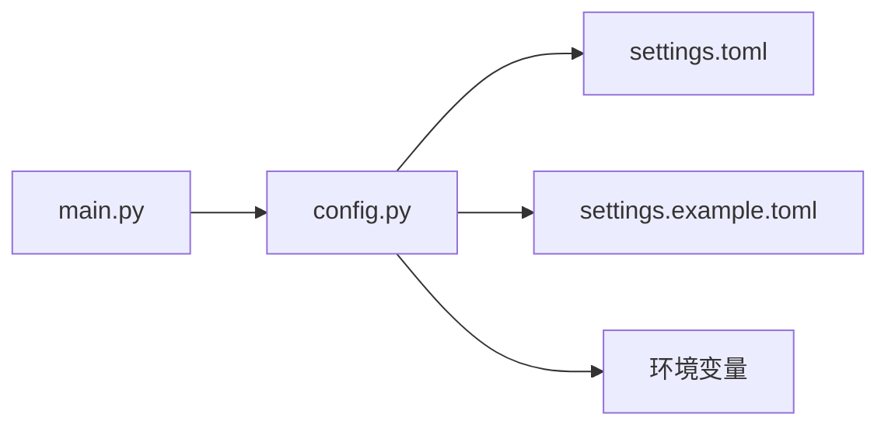

# config命令详解

<cite>
**本文引用的文件**   
- [config.py](file://src/jirin/cli/commands/config.py)
- [settings.example.toml](file://config/settings.example.toml)
- [settings.toml](file://config/settings.toml)
- [main.py](file://src/jirin/cli/main.py)
</cite>

## 目录
1. [简介](#简介)
2. [项目结构](#项目结构)
3. [核心组件](#核心组件)
4. [架构总览](#架构总览)
5. [详细组件分析](#详细组件分析)
6. [依赖关系分析](#依赖关系分析)
7. [性能考虑](#性能考虑)
8. [故障排查指南](#故障排查指南)
9. [结论](#结论)
10. [附录](#附录)

## 简介
本文件为 config 命令的完整 API 文档，覆盖配置查看、设置、删除与验证等全部功能；说明配置文件结构（TOML）、环境变量覆盖机制与优先级规则；提供常用场景示例（如 ADB 设备配置、知识库路径设置、导出格式配置）；包含配置模板、默认值说明与迁移指南；并解释配置验证规则与错误处理方法。

## 项目结构
与 config 命令直接相关的代码与配置位于以下位置：
- CLI 命令实现：src/jirin/cli/commands/config.py
- CLI 入口与命令注册：src/jirin/cli/main.py
- 配置模板与默认配置：config/settings.example.toml、config/settings.toml

图表来源
- [main.py](file://src/jirin/cli/main.py)
- [config.py](file://src/jirin/cli/commands/config.py)
- [settings.example.toml](file://config/settings.example.toml)
- [settings.toml](file://config/settings.toml)

章节来源
- [config.py](file://src/jirin/cli/commands/config.py)
- [main.py](file://src/jirin/cli/main.py)
- [settings.example.toml](file://config/settings.example.toml)
- [settings.toml](file://config/settings.toml)

## 核心组件
- 配置加载器：负责读取 TOML 配置文件，合并环境变量覆盖，生成最终配置对象。
- 配置验证器：对配置项进行类型、范围与约束校验，返回结构化错误信息。
- 配置管理器：提供 get/set/delete/list/validate 等操作接口，封装持久化写入逻辑。
- CLI 命令层：将用户输入解析为配置操作，调用配置管理器执行并输出结果。

章节来源
- [config.py](file://src/jirin/cli/commands/config.py)

## 架构总览
config 命令的整体交互流程如下：

图表来源
- [main.py](file://src/jirin/cli/main.py)
- [config.py](file://src/jirin/cli/commands/config.py)
- [settings.toml](file://config/settings.toml)

## 详细组件分析

### 配置项查看（get/list）
- 功能说明
  - 查看单个配置项的值。
  - 列出所有配置项及其来源（文件/环境变量）。
- 行为要点
  - 若指定键不存在，返回明确的“未找到”提示。
  - 列表模式支持按节（section）过滤。
- 典型用法
  - 查看 ADB 设备 ID：jirin config get device.adb.id
  - 列出所有导出相关配置：jirin config list export.*

章节来源
- [config.py](file://src/jirin/cli/commands/config.py)

### 配置项设置（set）
- 功能说明
  - 新增或更新配置项的值。
  - 支持在任意层级创建新节（section）。
- 行为要点
  - 自动检测目标文件是否存在，不存在则根据模板初始化。
  - 写入前进行基本类型校验，失败时中止并提示修正建议。
- 典型用法
  - 设置知识库根路径：jirin config set knowledge.root /path/to/kb
  - 设置导出默认格式：jirin config set export.default_format json

章节来源
- [config.py](file://src/jirin/cli/commands/config.py)

### 配置项删除（delete）
- 功能说明
  - 删除指定配置项。
  - 支持级联删除整节（可选）。
- 行为要点
  - 删除后即时持久化。
  - 若键不存在，返回明确提示而非报错。
- 典型用法
  - 删除某条 ADB 设备记录：jirin config delete device.adb.devices[2]
  - 删除整个导出配置节：jirin config delete export --cascade

章节来源
- [config.py](file://src/jirin/cli/commands/config.py)

### 配置验证（validate）
- 功能说明
  - 检查当前配置的完整性与合法性。
  - 输出所有错误与警告，便于快速修复。
- 行为要点
  - 校验类型、必填字段、取值范围与依赖关系。
  - 对不推荐但兼容的配置项给出弃用警告。
- 典型用法
  - 全量验证：jirin config validate
  - 仅验证导出相关项：jirin config validate export

章节来源
- [config.py](file://src/jirin/cli/commands/config.py)

### 配置文件结构与默认值
- 文件格式：TOML
- 主要节（section）与常见键
  - device.adb
    - id: 字符串，ADB 设备标识
    - devices: 数组，设备列表
  - knowledge
    - root: 字符串，知识库根路径
    - vector_store: 对象，向量存储参数
  - export
    - default_format: 字符串，默认导出格式（如 json、yaml、markdown）
    - output_dir: 字符串，导出输出目录
- 默认值与模板
  - 使用 settings.example.toml 作为模板，首次运行时可据此生成 settings.toml。
  - 各键的默认值以模板中的注释或示例值为准。

章节来源
- [settings.example.toml](file://config/settings.example.toml)
- [settings.toml](file://config/settings.toml)

### 环境变量覆盖机制与优先级
- 覆盖方式
  - 通过环境变量覆盖对应配置项，变量名通常遵循“大写+下划线”命名，并以特定前缀区分节。
  - 例如：JIRIN_DEVICE_ADB_ID、JIRIN_KNOWLEDGE_ROOT、JIRIN_EXPORT_DEFAULT_FORMAT。
- 优先级规则
  - 运行时环境变量 > 配置文件（settings.toml）> 模板默认值（settings.example.toml）
- 生效时机
  - 每次读取配置时都会重新合并环境变量，确保动态覆盖生效。

章节来源
- [config.py](file://src/jirin/cli/commands/config.py)

### 常用配置场景示例
- ADB 设备配置
  - 添加设备：jirin config set device.adb.devices[0].id "emulator-5554"
  - 查看设备：jirin config get device.adb.devices
- 知识库路径设置
  - 设置根路径：jirin config set knowledge.root ./data/knowledge
  - 验证路径有效性：jirin config validate knowledge
- 导出格式配置
  - 设置默认格式：jirin config set export.default_format yaml
  - 设置输出目录：jirin config set export.output_dir ./data/exports

章节来源
- [config.py](file://src/jirin/cli/commands/config.py)
- [settings.example.toml](file://config/settings.example.toml)

### 配置模板与默认值说明
- 模板文件：settings.example.toml
  - 提供完整的节与键示例，可作为初始化的参考。
- 默认值策略
  - 未在 settings.toml 显式设置的键，回退至模板中的示例值或内置默认值。
  - 建议在首次使用前基于模板生成 settings.toml，再按需修改。

章节来源
- [settings.example.toml](file://config/settings.example.toml)

### 配置迁移指南
- 从旧版本迁移
  - 对比现有 settings.toml 与最新 settings.example.toml，补齐缺失的节与键。
  - 对已弃用的键进行重命名或替换为新键。
- 自动化辅助
  - 使用 validate 命令检查差异与错误，逐步修复。
  - 对于批量变更，可通过脚本读取模板键集并与当前配置比对，生成补丁。

章节来源
- [settings.example.toml](file://config/settings.example.toml)
- [config.py](file://src/jirin/cli/commands/config.py)

### 配置验证规则与错误处理
- 验证规则
  - 类型校验：字符串、整数、布尔、数组、对象等。
  - 必填校验：关键路径与标识符必须存在。
  - 范围校验：数值范围、枚举值、路径存在性检查。
  - 依赖校验：某些键的组合必须同时满足。
- 错误处理
  - 遇到错误时，返回结构化错误列表，包含键路径、期望类型与实际类型、修复建议。
  - 对部分错误允许跳过继续验证，以便一次性收集所有问题。

章节来源
- [config.py](file://src/jirin/cli/commands/config.py)

## 依赖关系分析
config 命令与 CLI 入口及配置文件的依赖关系如下：

图表来源
- [main.py](file://src/jirin/cli/main.py)
- [config.py](file://src/jirin/cli/commands/config.py)
- [settings.toml](file://config/settings.toml)
- [settings.example.toml](file://config/settings.example.toml)

章节来源
- [main.py](file://src/jirin/cli/main.py)
- [config.py](file://src/jirin/cli/commands/config.py)

## 性能考虑
- 配置读取与合并开销较小，适合在每次命令执行时进行。
- 频繁写操作建议批量合并，减少磁盘 I/O。
- 大型配置集合（如大量设备条目）建议使用索引键避免线性扫描。

## 故障排查指南
- 常见问题
  - 键不存在：确认键路径是否正确，必要时使用 list 查看可用键。
  - 类型不匹配：根据 validate 输出的期望类型修正值。
  - 权限不足：确保对 settings.toml 所在目录有读写权限。
  - 路径无效：knowledge.root 等路径需真实存在且可读。
- 定位步骤
  - 先运行 validate 收集所有错误。
  - 逐项修复后再次验证，直至无错误。
  - 若涉及环境变量覆盖，检查变量名与大小写是否符合约定。

章节来源
- [config.py](file://src/jirin/cli/commands/config.py)

## 结论
config 命令提供了完善的配置管理能力，涵盖查看、设置、删除与验证全流程；结合 TOML 配置文件与环境变量覆盖，实现了灵活且可移植的配置方案。通过模板与默认值、迁移指南以及严格的验证规则，用户可以快速上手并安全地维护配置。

## 附录
- 命令速查
  - 查看单个配置项：jirin config get <键路径>
  - 列出配置项：jirin config list [节前缀]
  - 设置配置项：jirin config set <键路径> <值>
  - 删除配置项：jirin config delete <键路径> [--cascade]
  - 验证配置：jirin config validate [节前缀]
- 环境变量命名约定
  - 前缀：JIRIN_
  - 节与键：大写并用下划线分隔，如 JIRIN_DEVICE_ADB_ID
  - 示例：JIRIN_KNOWLEDGE_ROOT、JIRIN_EXPORT_DEFAULT_FORMAT

章节来源
- [config.py](file://src/jirin/cli/commands/config.py)