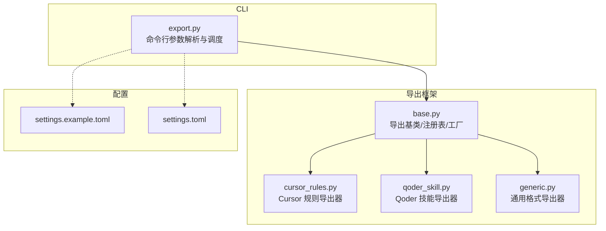
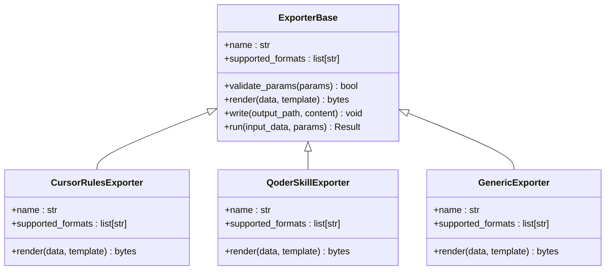
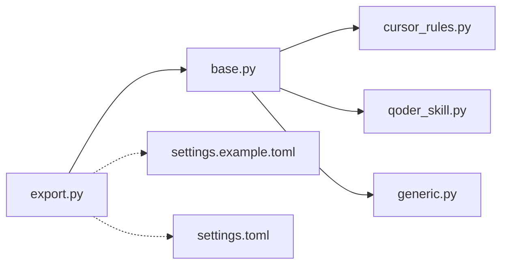

# export命令详解

<cite>
**本文引用的文件**   
- [src/jirin/cli/commands/export.py](file://src/jirin/cli/commands/export.py)
- [src/jirin/export/base.py](file://src/jirin/export/base.py)
- [src/jirin/export/cursor_rules.py](file://src/jirin/export/cursor_rules.py)
- [src/jirin/export/qoder_skill.py](file://src/jirin/export/qoder_skill.py)
- [src/jirin/export/generic.py](file://src/jirin/export/generic.py)
- [config/settings.example.toml](file://config/settings.example.toml)
- [config/settings.toml](file://config/settings.toml)
</cite>

## 目录
1. [简介](#简介)
2. [项目结构](#项目结构)
3. [核心组件](#核心组件)
4. [架构总览](#架构总览)
5. [详细组件分析](#详细组件分析)
6. [依赖关系分析](#依赖关系分析)
7. [性能与扩展性](#性能与扩展性)
8. [故障排查指南](#故障排查指南)
9. [结论](#结论)
10. [附录：导出格式与用法速查](#附录导出格式与用法速查)

## 简介
本文件为 Jirin 的 export 命令提供完整的 API 文档，覆盖结果导出的多种格式（Cursor 规则、Qoder 技能、通用格式等），说明每种格式的用途、结构与适用场景，并提供示例路径、过滤器、自定义模板与批量导出能力。同时给出导出文件的后续使用方法和集成方式，帮助你将分析结果高效转换为 IDE 插件、测试用例或报告文档。

## 项目结构
export 相关代码位于 CLI 层与 export 模块中：
- CLI 入口：src/jirin/cli/commands/export.py
- 导出基类与注册机制：src/jirin/export/base.py
- 具体导出器实现：
  - Cursor 规则：src/jirin/export/cursor_rules.py
  - Qoder 技能：src/jirin/export/qoder_skill.py
  - 通用格式：src/jirin/export/generic.py
- 配置项参考：config/settings.example.toml、config/settings.toml

图表来源
- [src/jirin/cli/commands/export.py](file://src/jirin/cli/commands/export.py)
- [src/jirin/export/base.py](file://src/jirin/export/base.py)
- [src/jirin/export/cursor_rules.py](file://src/jirin/export/cursor_rules.py)
- [src/jirin/export/qoder_skill.py](file://src/jirin/export/qoder_skill.py)
- [src/jirin/export/generic.py](file://src/jirin/export/generic.py)
- [config/settings.example.toml](file://config/settings.example.toml)
- [config/settings.toml](file://config/settings.toml)

章节来源
- [src/jirin/cli/commands/export.py](file://src/jirin/cli/commands/export.py)
- [src/jirin/export/base.py](file://src/jirin/export/base.py)
- [src/jirin/export/cursor_rules.py](file://src/jirin/export/cursor_rules.py)
- [src/jirin/export/qoder_skill.py](file://src/jirin/export/qoder_skill.py)
- [src/jirin/export/generic.py](file://src/jirin/export/generic.py)
- [config/settings.example.toml](file://config/settings.example.toml)
- [config/settings.toml](file://config/settings.toml)

## 核心组件
- 导出基类与注册表
  - 负责定义统一的导出接口、输出目标抽象、错误处理与日志记录。
  - 维护导出器注册表，支持按名称动态选择导出器。
- 导出器实现
  - Cursor 规则导出器：将分析结果转换为 IDE 可识别的规则文件，便于在编辑器内自动提示与检查。
  - Qoder 技能导出器：生成技能包或清单，用于在 Qoder 生态中复用与分析流程。
  - 通用格式导出器：提供 JSON/YAML/Markdown/CSV 等通用结构化输出，便于二次加工与报告生成。
- CLI 调度
  - 解析 export 子命令的参数（如 --format、--output、--filter、--template、--batch 等）。
  - 根据格式选择对应导出器，执行过滤与模板渲染，写入目标路径。

章节来源
- [src/jirin/export/base.py](file://src/jirin/export/base.py)
- [src/jirin/export/cursor_rules.py](file://src/jirin/export/cursor_rules.py)
- [src/jirin/export/qoder_skill.py](file://src/jirin/export/qoder_skill.py)
- [src/jirin/export/generic.py](file://src/jirin/export/generic.py)
- [src/jirin/cli/commands/export.py](file://src/jirin/cli/commands/export.py)

## 架构总览
export 命令采用“基类 + 多实现 + 注册表”的插件式架构，便于新增导出格式与统一行为控制。

图表来源
- [src/jirin/export/base.py](file://src/jirin/export/base.py)
- [src/jirin/export/cursor_rules.py](file://src/jirin/export/cursor_rules.py)
- [src/jirin/export/qoder_skill.py](file://src/jirin/export/qoder_skill.py)
- [src/jirin/export/generic.py](file://src/jirin/export/generic.py)

## 详细组件分析

### 导出基类与注册表（base）
- 职责
  - 定义导出器的统一接口：参数校验、模板渲染、内容写入、运行编排。
  - 维护导出器注册表，支持通过名称或格式映射到具体实现。
- 关键方法
  - validate_params：校验 CLI 传入参数的合法性与完整性。
  - render：结合数据与模板生成最终内容。
  - write：将内容持久化到文件系统或流。
  - run：串联输入数据、过滤器、模板与写盘逻辑，返回执行结果。
- 错误处理
  - 对非法参数、模板缺失、IO 异常进行捕获并返回结构化错误信息。
- 扩展点
  - 新增导出器只需继承基类并实现必要方法，再向注册表登记即可。

章节来源
- [src/jirin/export/base.py](file://src/jirin/export/base.py)

### Cursor 规则导出器（cursor_rules）
- 用途
  - 将分析结果转换为 IDE 插件可消费的结构化规则，用于静态检查、自动修复或智能提示。
- 结构特点
  - 以规则条目为单位组织，包含触发条件、匹配范围、建议动作、优先级等字段。
  - 支持按语言、模块、严重级别进行筛选。
- 适用场景
  - 团队规范落地、IDE 内实时反馈、自动化质量门禁。
- 典型用法
  - 指定格式为 cursor-rules，设置输出目录，可选 filter 与 template。
  - 批量导出时可为不同模块生成独立规则集。

章节来源
- [src/jirin/export/cursor_rules.py](file://src/jirin/export/cursor_rules.py)

### Qoder 技能导出器（qoder_skill）
- 用途
  - 将分析流程与结果打包为 Qoder 技能，便于在 Qoder 生态中复用与分发。
- 结构特点
  - 包含技能元数据、输入契约、处理步骤、输出产物与依赖声明。
  - 支持版本管理与变更日志。
- 适用场景
  - 跨项目复用分析能力、团队协作共享、CI/CD 流水线集成。
- 典型用法
  - 指定格式为 qoder-skill，输出技能包目录，配合模板定制描述与图标。

章节来源
- [src/jirin/export/qoder_skill.py](file://src/jirin/export/qoder_skill.py)

### 通用格式导出器（generic）
- 用途
  - 提供通用的结构化输出，便于二次加工、报表生成与可视化。
- 支持的格式
  - JSON、YAML、Markdown、CSV 等（由实现决定）。
- 结构特点
  - 扁平或嵌套的数据模型均可序列化；支持分页与分片输出。
- 适用场景
  - 测试用例生成、报告文档、数据归档与迁移。
- 典型用法
  - 指定格式为 json/yaml/markdown/csv，配合 filter 抽取关键字段，使用模板统一排版。

章节来源
- [src/jirin/export/generic.py](file://src/jirin/export/generic.py)

### CLI 导出命令（export.py）
- 功能
  - 解析 export 子命令参数，包括格式、输出路径、过滤器、模板、批量模式等。
  - 根据格式选择对应导出器，调用其 run 方法完成导出。
- 参数要点
  - --format：选择导出器（cursor-rules / qoder-skill / generic 等）。
  - --output：输出文件或目录。
  - --filter：键值对形式的过滤条件，支持多级字段与比较操作。
  - --template：模板路径或内置模板名。
  - --batch：批量模式开关，支持按模块/时间/标签分组导出。
- 错误处理
  - 参数校验失败、模板不存在、IO 异常均会返回明确错误码与提示。

章节来源
- [src/jirin/cli/commands/export.py](file://src/jirin/cli/commands/export.py)

## 依赖关系分析
- 组件耦合
  - CLI 仅依赖导出基类与注册表，不直接耦合具体导出器，符合开闭原则。
  - 各导出器之间相互独立，通过统一接口协作。
- 外部依赖
  - 配置文件 settings.toml 与 settings.example.toml 提供默认参数与全局开关。
- 潜在循环依赖
  - 当前设计无循环导入风险，导出器仅向上依赖基类。

图表来源
- [src/jirin/cli/commands/export.py](file://src/jirin/cli/commands/export.py)
- [src/jirin/export/base.py](file://src/jirin/export/base.py)
- [src/jirin/export/cursor_rules.py](file://src/jirin/export/cursor_rules.py)
- [src/jirin/export/qoder_skill.py](file://src/jirin/export/qoder_skill.py)
- [src/jirin/export/generic.py](file://src/jirin/export/generic.py)
- [config/settings.example.toml](file://config/settings.example.toml)
- [config/settings.toml](file://config/settings.toml)

章节来源
- [src/jirin/cli/commands/export.py](file://src/jirin/cli/commands/export.py)
- [src/jirin/export/base.py](file://src/jirin/export/base.py)
- [src/jirin/export/cursor_rules.py](file://src/jirin/export/cursor_rules.py)
- [src/jirin/export/qoder_skill.py](file://src/jirin/export/qoder_skill.py)
- [src/jirin/export/generic.py](file://src/jirin/export/generic.py)
- [config/settings.example.toml](file://config/settings.example.toml)
- [config/settings.toml](file://config/settings.toml)

## 性能与扩展性
- 性能
  - 大结果集导出建议使用批量模式与分片输出，避免单次 IO 压力过大。
  - 过滤器应在渲染前尽早应用，减少不必要的数据传输与渲染开销。
- 扩展性
  - 新增导出器：继承基类、实现必要方法、向注册表登记。
  - 新增过滤器：在参数校验后、渲染前插入过滤链。
  - 新增模板：在模板目录放置模板文件，并通过 --template 指定。

[本节为通用指导，无需源码引用]

## 故障排查指南
- 常见问题
  - 参数校验失败：检查 --format、--output、--filter 是否完整且合法。
  - 模板缺失：确认模板路径存在或模板名正确。
  - IO 异常：检查输出目录权限与磁盘空间。
- 定位建议
  - 开启详细日志，查看导出器名称与执行阶段。
  - 逐步缩小 filter 范围，定位问题数据项。
  - 使用通用格式先行导出，验证数据完整性后再切换至专用格式。

章节来源
- [src/jirin/export/base.py](file://src/jirin/export/base.py)
- [src/jirin/cli/commands/export.py](file://src/jirin/cli/commands/export.py)

## 结论
export 命令通过统一的导出框架与多格式实现，满足从 IDE 规则到技能包再到通用报告的多样化需求。借助过滤器、模板与批量导出，可将分析结果快速转化为可复用的资产，并与 CI/CD、IDE 与团队协作无缝集成。

[本节为总结，无需源码引用]

## 附录：导出格式与用法速查

### 支持的导出格式
- cursor-rules：IDE 规则文件，适用于静态检查与智能提示。
- qoder-skill：Qoder 技能包，适用于流程复用与生态集成。
- generic：通用格式（json/yaml/markdown/csv），适用于报告与二次加工。

章节来源
- [src/jirin/export/cursor_rules.py](file://src/jirin/export/cursor_rules.py)
- [src/jirin/export/qoder_skill.py](file://src/jirin/export/qoder_skill.py)
- [src/jirin/export/generic.py](file://src/jirin/export/generic.py)

### 常用参数
- --format：选择导出器。
- --output：输出文件或目录。
- --filter：过滤条件，支持键值对与简单表达式。
- --template：模板路径或内置模板名。
- --batch：批量模式，支持按维度分组导出。

章节来源
- [src/jirin/cli/commands/export.py](file://src/jirin/cli/commands/export.py)

### 过滤器语法（概览）
- 基本形式：key=value 或 key!=value。
- 组合条件：多个键值对以空格分隔，表示逻辑与。
- 字段路径：支持点号访问嵌套字段，如 module.name=core。
- 数值比较：支持 >、>=、<、<=、==、!=。
- 列表匹配：支持 in/not-in 语义（若实现提供）。

章节来源
- [src/jirin/cli/commands/export.py](file://src/jirin/cli/commands/export.py)
- [src/jirin/export/base.py](file://src/jirin/export/base.py)

### 模板与批量导出
- 模板
  - 内置模板：通过模板名直接使用。
  - 自定义模板：在模板目录放置模板文件，--template 指定相对路径。
- 批量导出
  - 按模块/时间/标签分组，每组生成独立文件。
  - 适合大规模结果集的拆分与归档。

章节来源
- [src/jirin/cli/commands/export.py](file://src/jirin/cli/commands/export.py)
- [src/jirin/export/base.py](file://src/jirin/export/base.py)

### 导出示例（路径指引）
- 将分析结果导出为 Cursor 规则
  - 命令参考：export --format cursor-rules --output ./rules --filter severity>=high
  - 示例路径：[src/jirin/cli/commands/export.py](file://src/jirin/cli/commands/export.py)
- 将分析结果导出为 Qoder 技能
  - 命令参考：export --format qoder-skill --output ./skills --template default
  - 示例路径：[src/jirin/cli/commands/export.py](file://src/jirin/cli/commands/export.py)
- 将分析结果导出为通用格式（JSON/Markdown/CSV）
  - 命令参考：export --format generic --output ./reports.json --filter type=anr
  - 示例路径：[src/jirin/cli/commands/export.py](file://src/jirin/cli/commands/export.py)

章节来源
- [src/jirin/cli/commands/export.py](file://src/jirin/cli/commands/export.py)

### 后续使用与集成
- IDE 插件
  - 将 cursor-rules 输出复制到 IDE 规则目录，启用静态检查与提示。
- 测试用例
  - 使用 generic 的 JSON/CSV 作为测试数据源，驱动自动化测试。
- 报告文档
  - 基于 Markdown 模板生成报告，纳入知识库或发布平台。
- CI/CD 集成
  - 在流水线中执行 export，产出制品并上传到制品库。

章节来源
- [src/jirin/export/cursor_rules.py](file://src/jirin/export/cursor_rules.py)
- [src/jirin/export/generic.py](file://src/jirin/export/generic.py)

### 配置项参考
- 全局默认输出目录、模板路径、日志级别等可在配置文件中设置。
- 推荐先复制示例配置，再按需调整。

章节来源
- [config/settings.example.toml](file://config/settings.example.toml)
- [config/settings.toml](file://config/settings.toml)