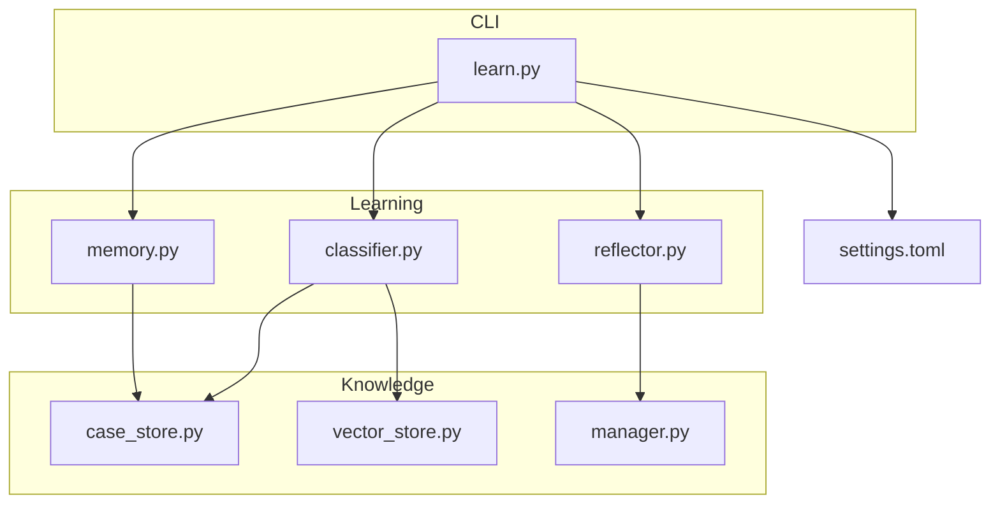
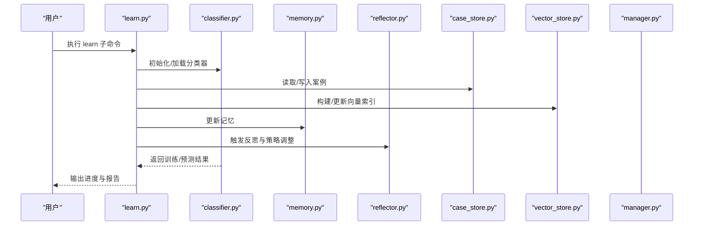
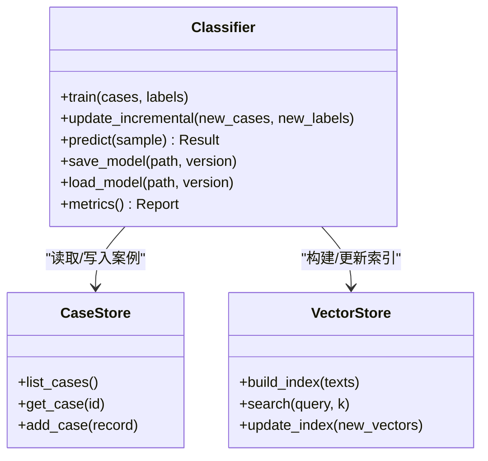
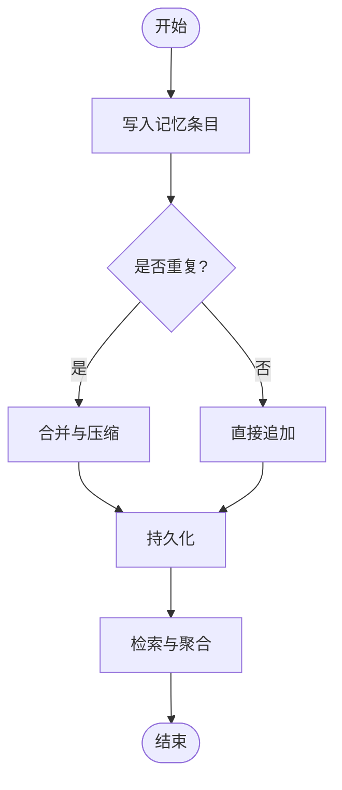
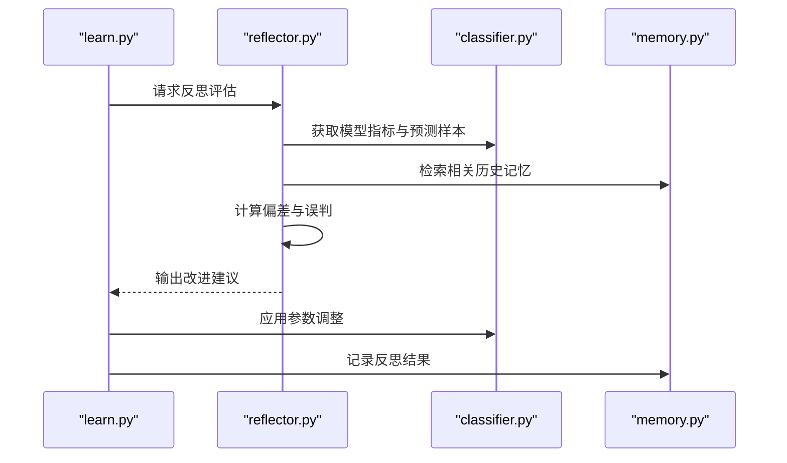
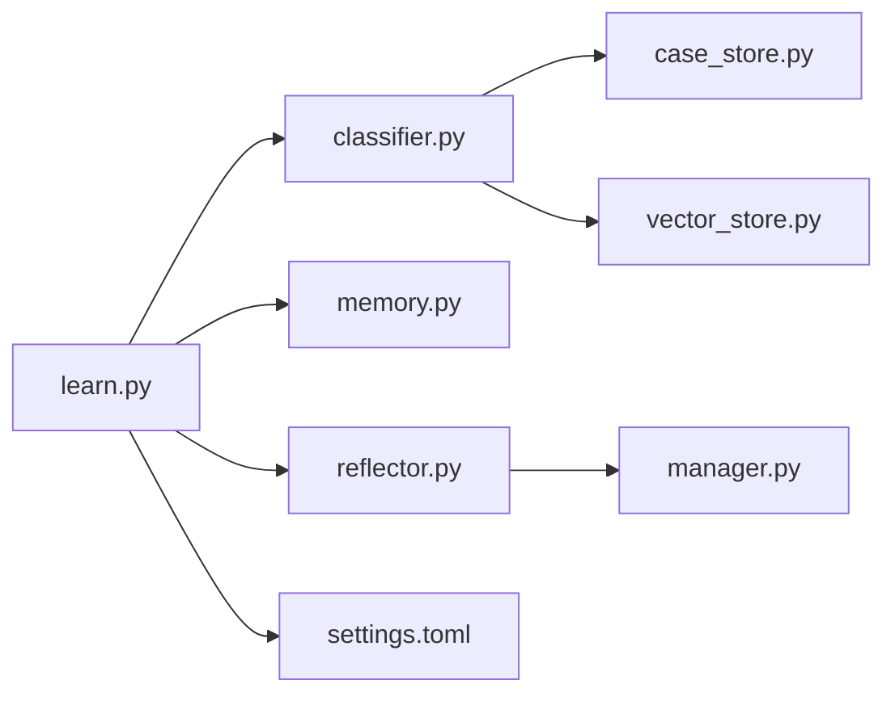

# learn命令详解

<cite>
**本文引用的文件**   
- [src/jirin/cli/commands/learn.py](file://src/jirin/cli/commands/learn.py)
- [src/jirin/learning/classifier.py](file://src/jirin/learning/classifier.py)
- [src/jirin/learning/memory.py](file://src/jirin/learning/memory.py)
- [src/jirin/learning/reflector.py](file://src/jirin/learning/reflector.py)
- [src/jirin/knowledge/case_store.py](file://src/jirin/knowledge/case_store.py)
- [src/jirin/knowledge/vector_store.py](file://src/jirin/knowledge/vector_store.py)
- [src/jirin/knowledge/manager.py](file://src/jirin/knowledge/manager.py)
- [config/settings.toml](file://config/settings.toml)
</cite>

## 目录
1. [简介](#简介)
2. [项目结构](#项目结构)
3. [核心组件](#核心组件)
4. [架构总览](#架构总览)
5. [详细组件分析](#详细组件分析)
6. [依赖关系分析](#依赖关系分析)
7. [性能考虑](#性能考虑)
8. [故障排查指南](#故障排查指南)
9. [结论](#结论)
10. [附录](#附录)

## 简介
本文件为 learn 命令的完整 API 文档，覆盖机器学习相关的命令行接口与内部实现。内容包含：
- 案例学习、模型训练、知识更新等操作的用法与参数说明
- 学习过程的工作原理、数据准备要求与训练参数配置
- 实际示例：添加新崩溃案例、更新分类器模型、优化分析效果
- 学习进度监控、模型版本管理与回滚机制
- 与知识库系统的交互方式与最佳实践建议

## 项目结构
learn 命令位于 CLI 层，调用 learning 模块进行学习与推理，并通过 knowledge 模块持久化案例与向量索引。关键路径如下：
- CLI 入口：src/jirin/cli/commands/learn.py
- 学习引擎：src/jirin/learning/classifier.py、memory.py、reflector.py
- 知识存储：src/jirin/knowledge/case_store.py、vector_store.py、manager.py
- 配置：config/settings.toml

图表来源
- [src/jirin/cli/commands/learn.py](file://src/jirin/cli/commands/learn.py)
- [src/jirin/learning/classifier.py](file://src/jirin/learning/classifier.py)
- [src/jirin/learning/memory.py](file://src/jirin/learning/memory.py)
- [src/jirin/learning/reflector.py](file://src/jirin/learning/reflector.py)
- [src/jirin/knowledge/case_store.py](file://src/jirin/knowledge/case_store.py)
- [src/jirin/knowledge/vector_store.py](file://src/jirin/knowledge/vector_store.py)
- [src/jirin/knowledge/manager.py](file://src/jirin/knowledge/manager.py)
- [config/settings.toml](file://config/settings.toml)

章节来源
- [src/jirin/cli/commands/learn.py](file://src/jirin/cli/commands/learn.py)
- [src/jirin/learning/classifier.py](file://src/jirin/learning/classifier.py)
- [src/jirin/learning/memory.py](file://src/jirin/learning/memory.py)
- [src/jirin/learning/reflector.py](file://src/jirin/learning/reflector.py)
- [src/jirin/knowledge/case_store.py](file://src/jirin/knowledge/case_store.py)
- [src/jirin/knowledge/vector_store.py](file://src/jirin/knowledge/vector_store.py)
- [src/jirin/knowledge/manager.py](file://src/jirin/knowledge/manager.py)
- [config/settings.toml](file://config/settings.toml)

## 核心组件
- 学习命令（learn）：提供子命令用于导入案例、训练分类器、增量更新、反射评估、导出摘要等。
- 分类器（classifier）：负责特征抽取、模型训练、预测与版本管理。
- 记忆（memory）：维护短期/长期记忆，支持检索与聚合。
- 反思（reflector）：对历史结果进行反思与策略调整，提升后续分析质量。
- 案例库（case_store）：结构化存储崩溃案例元数据与关联资源。
- 向量库（vector_store）：维护文本/日志向量化索引，支持相似案例检索。
- 知识管理器（manager）：协调案例与向量索引，提供统一访问接口。

章节来源
- [src/jirin/cli/commands/learn.py](file://src/jirin/cli/commands/learn.py)
- [src/jirin/learning/classifier.py](file://src/jirin/learning/classifier.py)
- [src/jirin/learning/memory.py](file://src/jirin/learning/memory.py)
- [src/jirin/learning/reflector.py](file://src/jirin/learning/reflector.py)
- [src/jirin/knowledge/case_store.py](file://src/jirin/knowledge/case_store.py)
- [src/jirin/knowledge/vector_store.py](file://src/jirin/knowledge/vector_store.py)
- [src/jirin/knowledge/manager.py](file://src/jirin/knowledge/manager.py)

## 架构总览
learn 命令通过 CLI 解析用户意图，调度学习流程；学习流程读取案例与日志，构建特征并训练或更新分类器；同时更新向量索引与记忆，供后续分析与检索使用。

图表来源
- [src/jirin/cli/commands/learn.py](file://src/jirin/cli/commands/learn.py)
- [src/jirin/learning/classifier.py](file://src/jirin/learning/classifier.py)
- [src/jirin/learning/memory.py](file://src/jirin/learning/memory.py)
- [src/jirin/learning/reflector.py](file://src/jirin/learning/reflector.py)
- [src/jirin/knowledge/case_store.py](file://src/jirin/knowledge/case_store.py)
- [src/jirin/knowledge/vector_store.py](file://src/jirin/knowledge/vector_store.py)
- [src/jirin/knowledge/manager.py](file://src/jirin/knowledge/manager.py)

## 详细组件分析

### 学习命令（learn）
- 功能范围
  - 导入案例：从文件或目录批量导入崩溃案例，生成元数据与必要附件。
  - 训练模型：基于现有案例集训练分类器，支持全量训练与增量更新。
  - 知识更新：同步向量索引与记忆，确保检索与分析一致性。
  - 反思评估：对历史结果进行反思，输出改进建议与指标。
  - 版本管理：记录模型版本、训练时间、数据集快照等信息，支持回滚。
- 常用参数
  - 输入源：案例目录、日志文件、配置文件路径
  - 训练选项：是否增量、是否启用反思、是否更新向量索引
  - 输出选项：报告路径、模型保存路径、版本标签
- 典型工作流
  - 导入案例 -> 构建/更新向量索引 -> 训练/更新分类器 -> 反思评估 -> 保存模型与报告

章节来源
- [src/jirin/cli/commands/learn.py](file://src/jirin/cli/commands/learn.py)

### 分类器（classifier）
- 职责
  - 特征抽取：从案例文本、堆栈、日志片段中提取结构化特征。
  - 模型训练：支持全量训练与增量更新，输出可序列化模型对象。
  - 预测与评分：对新案例进行分类与置信度评估。
  - 版本管理：记录模型版本、训练批次、评估指标。
- 关键方法
  - 训练/更新：接收案例集合与标签，完成模型拟合或增量更新。
  - 预测：输入待分析样本，返回类别与置信度。
  - 保存/加载：持久化模型与元数据，支持按版本切换。
- 复杂度与性能
  - 训练阶段的时间复杂度与样本规模线性相关；可通过增量更新降低重复计算。
  - 内存占用受特征维度与向量索引大小影响，需合理控制批次大小。

图表来源
- [src/jirin/learning/classifier.py](file://src/jirin/learning/classifier.py)
- [src/jirin/knowledge/case_store.py](file://src/jirin/knowledge/case_store.py)
- [src/jirin/knowledge/vector_store.py](file://src/jirin/knowledge/vector_store.py)

章节来源
- [src/jirin/learning/classifier.py](file://src/jirin/learning/classifier.py)
- [src/jirin/knowledge/case_store.py](file://src/jirin/knowledge/case_store.py)
- [src/jirin/knowledge/vector_store.py](file://src/jirin/knowledge/vector_store.py)

### 记忆（memory）
- 职责
  - 短期记忆：缓存最近分析结果与中间状态，加速迭代。
  - 长期记忆：沉淀高价值模式与经验，支持跨会话复用。
  - 检索与聚合：按主题、时间、类型检索记忆条目，合并冲突信息。
- 关键方法
  - 写入：追加新的记忆条目，去重与压缩。
  - 查询：关键词/语义检索，返回相关条目与权重。
  - 清理：过期条目回收与冗余合并。

图表来源
- [src/jirin/learning/memory.py](file://src/jirin/learning/memory.py)

章节来源
- [src/jirin/learning/memory.py](file://src/jirin/learning/memory.py)

### 反思（reflector）
- 职责
  - 对历史预测与标注进行反思，识别偏差与误判。
  - 生成改进建议：如特征增强、阈值调整、数据清洗。
  - 策略更新：根据反思结果调整学习策略与参数。
- 关键方法
  - 评估：计算准确率、召回率、混淆矩阵等指标。
  - 建议：输出改进清单与优先级。
  - 应用：将建议转化为具体参数变更或数据修正。

图表来源
- [src/jirin/cli/commands/learn.py](file://src/jirin/cli/commands/learn.py)
- [src/jirin/learning/reflector.py](file://src/jirin/learning/reflector.py)
- [src/jirin/learning/classifier.py](file://src/jirin/learning/classifier.py)
- [src/jirin/learning/memory.py](file://src/jirin/learning/memory.py)

章节来源
- [src/jirin/learning/reflector.py](file://src/jirin/learning/reflector.py)

### 案例库（case_store）
- 职责
  - 管理崩溃案例的结构化元数据与关联资源。
  - 提供增删改查接口，支持批量导入与导出。
  - 维护版本与审计日志，便于追溯。
- 关键方法
  - 列表：按条件筛选案例。
  - 获取：按 ID 或关键字检索单条案例。
  - 新增：校验并写入新案例。
  - 删除：软删除与归档。

章节来源
- [src/jirin/knowledge/case_store.py](file://src/jirin/knowledge/case_store.py)

### 向量库（vector_store）
- 职责
  - 维护文本/日志的向量索引，支持近似最近邻搜索。
  - 增量更新索引，避免全量重建带来的开销。
  - 提供相似度查询与过滤能力。
- 关键方法
  - 构建：从文本集合构建初始索引。
  - 搜索：按查询向量返回 Top-K 相似项。
  - 更新：增量插入新向量并刷新索引。

章节来源
- [src/jirin/knowledge/vector_store.py](file://src/jirin/knowledge/vector_store.py)

### 知识管理器（manager）
- 职责
  - 协调案例库与向量库，提供统一的知识访问接口。
  - 处理事务性操作，保证一致性与完整性。
  - 暴露高层 API 给 CLI 与上层服务。
- 关键方法
  - 同步：在案例变更后同步向量索引。
  - 迁移：在版本升级时迁移数据结构。
  - 备份/恢复：支持快照与回滚。

章节来源
- [src/jirin/knowledge/manager.py](file://src/jirin/knowledge/manager.py)

## 依赖关系分析
learn 命令依赖 learning 与 knowledge 两大子系统，并通过配置中心注入参数。

图表来源
- [src/jirin/cli/commands/learn.py](file://src/jirin/cli/commands/learn.py)
- [src/jirin/learning/classifier.py](file://src/jirin/learning/classifier.py)
- [src/jirin/learning/memory.py](file://src/jirin/learning/memory.py)
- [src/jirin/learning/reflector.py](file://src/jirin/learning/reflector.py)
- [src/jirin/knowledge/case_store.py](file://src/jirin/knowledge/case_store.py)
- [src/jirin/knowledge/vector_store.py](file://src/jirin/knowledge/vector_store.py)
- [src/jirin/knowledge/manager.py](file://src/jirin/knowledge/manager.py)
- [config/settings.toml](file://config/settings.toml)

章节来源
- [src/jirin/cli/commands/learn.py](file://src/jirin/cli/commands/learn.py)
- [config/settings.toml](file://config/settings.toml)

## 性能考虑
- 训练效率
  - 使用增量更新减少重复计算，适合持续集成场景。
  - 分批处理大样本，控制内存峰值。
- 索引构建
  - 向量索引采用增量更新，避免全量重建。
  - 定期压缩与清理低价值条目，保持检索性能。
- 资源规划
  - 根据硬件配置调整批次大小与并行度。
  - 监控磁盘 I/O 与 CPU 利用率，避免瓶颈。

[本节为通用指导，不直接分析具体文件]

## 故障排查指南
- 常见问题
  - 导入失败：检查案例文件格式与必填字段。
  - 训练异常：确认标签分布与特征有效性。
  - 检索不准：验证向量索引是否最新，必要时重建。
  - 版本回滚：确认模型快照存在且元数据完整。
- 定位步骤
  - 查看学习日志与错误堆栈。
  - 核对配置参数与路径权限。
  - 使用反思模块输出诊断报告。

章节来源
- [src/jirin/cli/commands/learn.py](file://src/jirin/cli/commands/learn.py)
- [src/jirin/learning/reflector.py](file://src/jirin/learning/reflector.py)

## 结论
learn 命令提供了端到端的机器学习工作流，涵盖案例导入、模型训练、知识更新与反思评估。通过版本管理与回滚机制，保障生产环境稳定性。结合向量检索与记忆系统，持续提升分析准确性与效率。

[本节为总结性内容，不直接分析具体文件]

## 附录

### 数据准备要求
- 案例格式
  - 必需字段：标题、描述、堆栈、日志片段、标签、时间戳。
  - 可选字段：设备信息、复现步骤、修复方案。
- 日志规范
  - 统一编码与分隔符，便于解析与向量化。
  - 脱敏敏感信息，保护隐私与安全。
- 目录组织
  - 按主题或版本划分目录，便于批量导入与管理。

章节来源
- [src/jirin/knowledge/case_store.py](file://src/jirin/knowledge/case_store.py)
- [src/jirin/knowledge/vector_store.py](file://src/jirin/knowledge/vector_store.py)

### 训练参数配置
- 基本参数
  - 学习率、正则系数、批次大小、最大轮次。
- 高级参数
  - 早停阈值、交叉验证折数、特征选择策略。
- 配置位置
  - 全局设置：config/settings.toml
  - 命令级覆盖：通过 CLI 参数传入

章节来源
- [config/settings.toml](file://config/settings.toml)
- [src/jirin/cli/commands/learn.py](file://src/jirin/cli/commands/learn.py)

### 学习示例
- 添加新崩溃案例
  - 准备案例文件，放入指定目录。
  - 执行导入命令，校验元数据与附件。
  - 更新向量索引，确保可检索。
- 更新分类器模型
  - 选择增量或全量训练。
  - 指定版本标签与保存路径。
  - 运行反思评估，输出改进建议。
- 优化分析效果
  - 根据反思报告调整特征与阈值。
  - 清理低质量案例，提升数据纯度。
  - 定期重建索引，保持检索精度。

章节来源
- [src/jirin/cli/commands/learn.py](file://src/jirin/cli/commands/learn.py)
- [src/jirin/learning/classifier.py](file://src/jirin/learning/classifier.py)
- [src/jirin/learning/reflector.py](file://src/jirin/learning/reflector.py)

### 学习进度监控
- 指标输出
  - 训练损失、验证准确率、召回率、F1 分数。
  - 向量索引大小、检索耗时统计。
- 可视化建议
  - 使用外部工具绘制曲线图与热力图。
  - 将报告导出为结构化文件，便于自动化分析。

章节来源
- [src/jirin/learning/classifier.py](file://src/jirin/learning/classifier.py)
- [src/jirin/knowledge/vector_store.py](file://src/jirin/knowledge/vector_store.py)

### 模型版本管理与回滚
- 版本命名
  - 采用语义化版本，包含日期与变更说明。
- 快照策略
  - 每次训练后保存模型与元数据快照。
  - 保留最近 N 个版本，平衡空间与可用性。
- 回滚流程
  - 选择目标版本，加载模型与索引。
  - 验证指标与回归测试通过后生效。

章节来源
- [src/jirin/learning/classifier.py](file://src/jirin/learning/classifier.py)
- [src/jirin/knowledge/manager.py](file://src/jirin/knowledge/manager.py)

### 与知识库系统的交互方式
- 统一接口
  - 通过知识管理器访问案例与向量索引。
  - 事务性操作保证一致性与完整性。
- 最佳实践
  - 小步快跑：频繁小更新优于一次性大变更。
  - 数据治理：定期清洗与去重，保持高质量数据。
  - 安全合规：脱敏与权限控制，遵循最小权限原则。

章节来源
- [src/jirin/knowledge/manager.py](file://src/jirin/knowledge/manager.py)
- [src/jirin/knowledge/case_store.py](file://src/jirin/knowledge/case_store.py)
- [src/jirin/knowledge/vector_store.py](file://src/jirin/knowledge/vector_store.py)