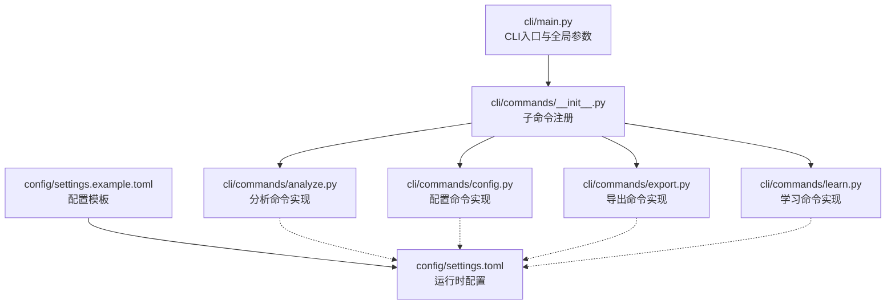
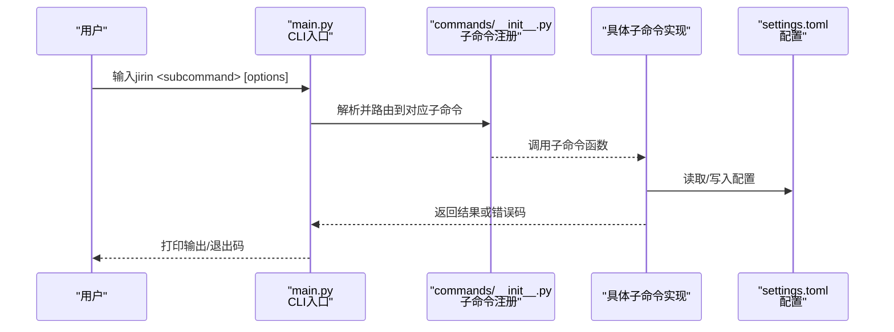
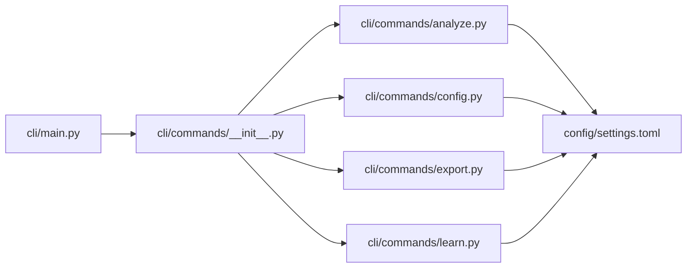

# 命令行接口参考

<cite>
**本文引用的文件**   
- [src/jirin/cli/main.py](file://src/jirin/cli/main.py)
- [src/jirin/cli/commands/__init__.py](file://src/jirin/cli/commands/__init__.py)
- [src/jirin/cli/commands/analyze.py](file://src/jirin/cli/commands/analyze.py)
- [src/jirin/cli/commands/config.py](file://src/jirin/cli/commands/config.py)
- [src/jirin/cli/commands/export.py](file://src/jirin/cli/commands/export.py)
- [src/jirin/cli/commands/learn.py](file://src/jirin/cli/commands/learn.py)
- [config/settings.example.toml](file://config/settings.example.toml)
- [config/settings.toml](file://config/settings.toml)
</cite>

## 目录
1. [简介](#简介)
2. [项目结构](#项目结构)
3. [核心组件](#核心组件)
4. [架构总览](#架构总览)
5. [详细命令参考](#详细命令参考)
6. [依赖关系分析](#依赖关系分析)
7. [性能与使用建议](#性能与使用建议)
8. [故障排查指南](#故障排查指南)
9. [结论](#结论)
10. [附录](#附录)

## 简介
本参考文档面向Jirin的命令行接口（CLI），覆盖以下子命令：analyze、config、export、learn。文档提供每个命令的使用方法、参数选项、返回值格式、错误处理策略，以及常见场景示例（单文件分析、批量处理、配置管理、结果导出）。同时包含参数验证规则、环境变量设置与最佳实践，帮助初学者快速上手，并为高级用户提供完整技术参考。

## 项目结构
CLI入口位于主程序模块中，各子命令以独立模块组织在commands目录下；配置文件位于config目录。下图展示了CLI相关的代码结构与交互关系。

图表来源
- [src/jirin/cli/main.py](file://src/jirin/cli/main.py)
- [src/jirin/cli/commands/__init__.py](file://src/jirin/cli/commands/__init__.py)
- [src/jirin/cli/commands/analyze.py](file://src/jirin/cli/commands/analyze.py)
- [src/jirin/cli/commands/config.py](file://src/jirin/cli/commands/config.py)
- [src/jirin/cli/commands/export.py](file://src/jirin/cli/commands/export.py)
- [src/jirin/cli/commands/learn.py](file://src/jirin/cli/commands/learn.py)
- [config/settings.example.toml](file://config/settings.example.toml)
- [config/settings.toml](file://config/settings.toml)

章节来源
- [src/jirin/cli/main.py](file://src/jirin/cli/main.py)
- [src/jirin/cli/commands/__init__.py](file://src/jirin/cli/commands/__init__.py)
- [config/settings.example.toml](file://config/settings.example.toml)
- [config/settings.toml](file://config/settings.toml)

## 核心组件
- CLI入口与全局参数：负责解析顶层参数、加载配置、分发到具体子命令。
- 子命令注册中心：集中注册analyze、config、export、learn四个子命令。
- 子命令实现：
  - analyze：对日志或崩溃堆栈进行分析，支持单文件与批量模式。
  - config：查看、设置、重置配置项，支持从模板生成默认配置。
  - export：将分析结果导出为多种格式（如通用JSON、Cursor规则等）。
  - learn：基于历史案例进行知识学习与反思，更新本地知识库。
- 配置系统：通过TOML配置文件管理运行参数，支持模板与默认值。

章节来源
- [src/jirin/cli/main.py](file://src/jirin/cli/main.py)
- [src/jirin/cli/commands/__init__.py](file://src/jirin/cli/commands/__init__.py)
- [src/jirin/cli/commands/analyze.py](file://src/jirin/cli/commands/analyze.py)
- [src/jirin/cli/commands/config.py](file://src/jirin/cli/commands/config.py)
- [src/jirin/cli/commands/export.py](file://src/jirin/cli/commands/export.py)
- [src/jirin/cli/commands/learn.py](file://src/jirin/cli/commands/learn.py)
- [config/settings.example.toml](file://config/settings.example.toml)
- [config/settings.toml](file://config/settings.toml)

## 架构总览
下图展示CLI请求的生命周期：用户输入→全局参数解析→子命令路由→业务逻辑执行→输出结果/错误码。

图表来源
- [src/jirin/cli/main.py](file://src/jirin/cli/main.py)
- [src/jirin/cli/commands/__init__.py](file://src/jirin/cli/commands/__init__.py)
- [config/settings.toml](file://config/settings.toml)

## 详细命令参考

### 全局参数与通用行为
- 常用全局选项（由入口模块提供）：
  - --verbose/-v：启用详细日志输出
  - --quiet/-q：仅输出必要信息
  - --config/-c：指定配置文件路径（默认读取config/settings.toml）
  - --version：显示版本信息
- 退出码约定：
  - 0：成功
  - 非0：失败（具体含义见各命令的错误处理）

章节来源
- [src/jirin/cli/main.py](file://src/jirin/cli/main.py)

### 命令：analyze
用途：对Android ANR/Java异常/Native异常日志或崩溃堆栈进行分析，输出结构化结果。

用法
- jirin analyze [选项] <输入>

参数选项
- 输入
  - <input>：文件或目录路径。若为目录则递归扫描支持的日志/堆栈文件。
- 过滤与选择
  - --type/-t：分析类型，可选值包括 anr、je、ne（不区分大小写）。未指定时自动检测。
  - --filter/-f：按关键字或正则表达式过滤日志行（用于缩小分析范围）。
- 输出控制
  - --output/-o：输出文件路径。未指定时输出到stdout。
  - --format/-F：输出格式，可选值包括 json、text。默认为json。
  - --pretty/-p：对JSON输出进行格式化（可读性更好）。
- 并发与批处理
  - --jobs/-j：并行任务数（针对目录批量分析）。默认值为CPU核心数。
  - --batch-size/-b：每批次处理的文件数量（避免内存峰值过高）。
- 其他
  - --dry-run：仅模拟执行，不进行实际分析与I/O。
  - --timeout/-T：单个文件分析超时时间（秒）。

返回值
- 成功：根据--format输出JSON或文本结果；退出码为0。
- 失败：输出错误信息到stderr；退出码为非0。

错误处理
- 输入不存在或无权限：提示路径无效或权限不足。
- 格式不支持：提示不支持的文件类型或扩展名。
- 解析失败：记录解析错误位置与上下文，继续处理其余文件（批量模式下）。
- 超时：跳过当前文件并记录警告。

示例
- 单文件分析（ANR）
  - jirin analyze --type anr --format json --pretty /path/to/anr.log
- 批量分析（目录）
  - jirin analyze /path/to/logs --jobs 4 --batch-size 50
- 过滤特定关键字
  - jirin analyze app_crash.txt --filter "NullPointerException"
- 导出为文本报告
  - jirin analyze report_dir --format text --output report.txt

章节来源
- [src/jirin/cli/commands/analyze.py](file://src/jirin/cli/commands/analyze.py)

### 命令：config
用途：查看、设置、重置配置项；支持从模板生成默认配置。

用法
- jirin config [子命令] [选项]

子命令
- get：读取配置项
  - 语法：jirin config get <key>
  - 说明：返回指定键的值；若不存在则返回空或默认值。
- set：设置配置项
  - 语法：jirin config set <key> <value>
  - 说明：持久化保存至配置文件；支持覆盖已有值。
- reset：恢复默认值
  - 语法：jirin config reset [key]
  - 说明：若无key则重置全部为默认；否则仅重置指定键。
- init：初始化配置
  - 语法：jirin config init [--force]
  - 说明：从模板生成默认配置文件；--force可覆盖现有配置。

参数选项
- --config/-c：指定配置文件路径（默认读取config/settings.toml）
- --section/-s：操作配置节（当get/set/reset需要限定节时使用）
- --env-prefix/-e：环境变量前缀（用于读取/写入环境变量形式的配置）

返回值
- get：成功返回键值字符串；失败返回错误信息。
- set：成功返回确认信息；失败返回错误信息。
- reset：成功返回重置摘要；失败返回错误信息。
- init：成功返回生成的配置文件路径；失败返回错误信息。

错误处理
- 键不存在：提示键无效或未被定义。
- 类型不匹配：提示值类型不符合预期（例如期望整数却传入字符串）。
- 权限不足：无法写入配置文件时提示权限问题。
- 模板缺失：无法找到模板文件时提示检查安装路径。

示例
- 查看配置
  - jirin config get general.timeout
- 设置配置
  - jirin config set general.jobs 4
- 重置全部配置
  - jirin config reset
- 初始化默认配置
  - jirin config init --force

章节来源
- [src/jirin/cli/commands/config.py](file://src/jirin/cli/commands/config.py)
- [config/settings.example.toml](file://config/settings.example.toml)
- [config/settings.toml](file://config/settings.toml)

### 命令：export
用途：将分析结果导出为不同格式，便于后续集成与分享。

用法
- jirin export [选项] <输入>

参数选项
- 输入
  - <input>：分析结果文件或目录。若为目录则合并所有结果。
- 导出格式
  - --format/-F：目标格式，可选值包括 generic、cursor_rules、qoder_skill。
  - --output/-o：输出文件路径；未指定时输出到stdout。
- 过滤与选择
  - --include/-i：包含的条目ID列表（逗号分隔）。
  - --exclude/-x：排除的条目ID列表（逗号分隔）。
- 其他
  - --pretty/-p：对JSON类输出进行格式化。
  - --compress/-z：压缩输出（如适用）。

返回值
- 成功：按指定格式输出内容；退出码为0。
- 失败：输出错误信息到stderr；退出码为非0。

错误处理
- 输入为空或格式不兼容：提示缺少有效数据或格式不支持。
- 导出器不可用：提示未安装相应导出插件或依赖缺失。
- 输出路径不可写：提示权限或路径无效。

示例
- 导出为通用JSON
  - jirin export --format generic --output results.json analysis_output/
- 导出为Cursor规则
  - jirin export --format cursor_rules --output rules.yaml analysis_output/
- 仅导出特定条目
  - jirin export --include "id1,id2" --format qoder_skill analysis_output/

章节来源
- [src/jirin/cli/commands/export.py](file://src/jirin/cli/commands/export.py)

### 命令：learn
用途：基于历史案例进行知识学习与反思，更新本地知识库，提升后续分析质量。

用法
- jirin learn [选项]

参数选项
- 输入源
  - --source/-s：学习数据源路径（文件或目录）。未指定时使用默认知识库路径。
- 学习策略
  - --mode/-m：学习模式，可选值包括 incremental、full。增量模式仅处理新增/变更数据。
  - --threshold/-t：置信度阈值（0~1），低于阈值的样本将被忽略。
- 输出与控制
  - --output/-o：学习日志输出路径；未指定时输出到stdout。
  - --dry-run：仅模拟学习过程，不更新知识库。
  - --jobs/-j：并行学习任务数。

返回值
- 成功：输出学习摘要（新增/更新/忽略统计）；退出码为0。
- 失败：输出错误信息到stderr；退出码为非0。

错误处理
- 数据源无效：提示路径不存在或无权限。
- 模型/索引不可用：提示依赖缺失或索引损坏。
- 学习失败：记录失败样本与原因，继续处理其余样本（批量模式下）。

示例
- 增量学习
  - jirin learn --mode incremental --source new_cases/
- 全量重建
  - jirin learn --mode full --jobs 4
- 仅预览学习过程
  - jirin learn --dry-run

章节来源
- [src/jirin/cli/commands/learn.py](file://src/jirin/cli/commands/learn.py)

## 依赖关系分析
下图展示CLI模块之间的依赖关系与外部配置文件的交互。

图表来源
- [src/jirin/cli/main.py](file://src/jirin/cli/main.py)
- [src/jirin/cli/commands/__init__.py](file://src/jirin/cli/commands/__init__.py)
- [src/jirin/cli/commands/analyze.py](file://src/jirin/cli/commands/analyze.py)
- [src/jirin/cli/commands/config.py](file://src/jirin/cli/commands/config.py)
- [src/jirin/cli/commands/export.py](file://src/jirin/cli/commands/export.py)
- [src/jirin/cli/commands/learn.py](file://src/jirin/cli/commands/learn.py)
- [config/settings.toml](file://config/settings.toml)

章节来源
- [src/jirin/cli/main.py](file://src/jirin/cli/main.py)
- [src/jirin/cli/commands/__init__.py](file://src/jirin/cli/commands/__init__.py)
- [config/settings.toml](file://config/settings.toml)

## 性能与使用建议
- 批量分析
  - 合理设置--jobs与--batch-size，避免内存峰值过高。
  - 优先使用--dry-run验证路径与过滤条件，再正式执行。
- 配置管理
  - 使用config init生成默认配置，再按需修改，减少遗漏。
  - 通过--config指定环境相关配置，便于多环境切换。
- 导出优化
  - 大结果集建议使用--compress以减少传输与存储成本。
  - 使用--include/--exclude精准导出，降低下游处理压力。
- 学习环境
  - 增量学习适用于持续集成流水线；全量重建适合离线重训。
  - 调整--threshold平衡召回率与误报率。

[本节为通用指导，无需列出章节来源]

## 故障排查指南
- 常见问题
  - 找不到配置文件：检查--config路径是否正确，或执行config init重新生成。
  - 权限不足：确保对输入/输出路径具有读写权限。
  - 解析失败：使用--filter缩小范围，定位问题样本；必要时开启--verbose查看详细日志。
  - 导出失败：确认目标格式是否受支持，检查依赖是否安装。
- 调试技巧
  - 使用--verbose获取更详细的执行日志。
  - 使用--dry-run模拟执行，验证参数与路径。
  - 分步执行：先analyze，再export，最后learn，逐步定位问题。

章节来源
- [src/jirin/cli/commands/config.py](file://src/jirin/cli/commands/config.py)
- [src/jirin/cli/commands/analyze.py](file://src/jirin/cli/commands/analyze.py)
- [src/jirin/cli/commands/export.py](file://src/jirin/cli/commands/export.py)
- [src/jirin/cli/commands/learn.py](file://src/jirin/cli/commands/learn.py)

## 结论
本参考文档系统化梳理了Jirin CLI的四个核心命令及其使用方法、参数选项、返回值与错误处理策略。通过合理的配置管理与导出策略，结合性能优化建议与故障排查指南，用户可在不同场景下高效完成日志分析、知识沉淀与结果共享。

[本节为总结性内容，无需列出章节来源]

## 附录
- 环境变量（如支持）
  - JIRIN_CONFIG：覆盖默认配置文件路径
  - JIRIN_LOG_LEVEL：控制日志级别（debug、info、warn、error）
  - JIRIN_OUTPUT_DIR：默认输出目录（当未显式指定-o时生效）
- 最佳实践
  - 在CI/CD中固定配置与版本，确保可重复执行。
  - 定期备份与分析结果，建立版本化的知识库。
  - 使用脚本封装常用流程，提高团队效率。

[本节为补充信息，无需列出章节来源]