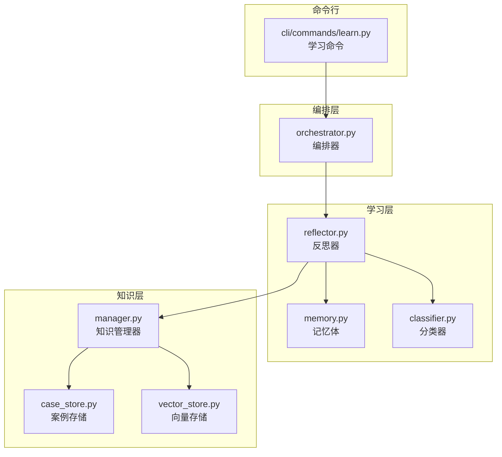
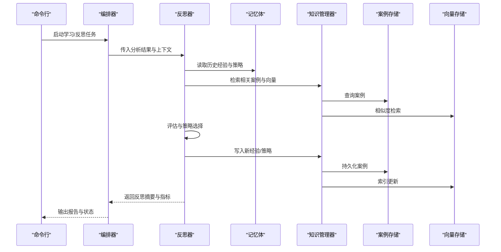
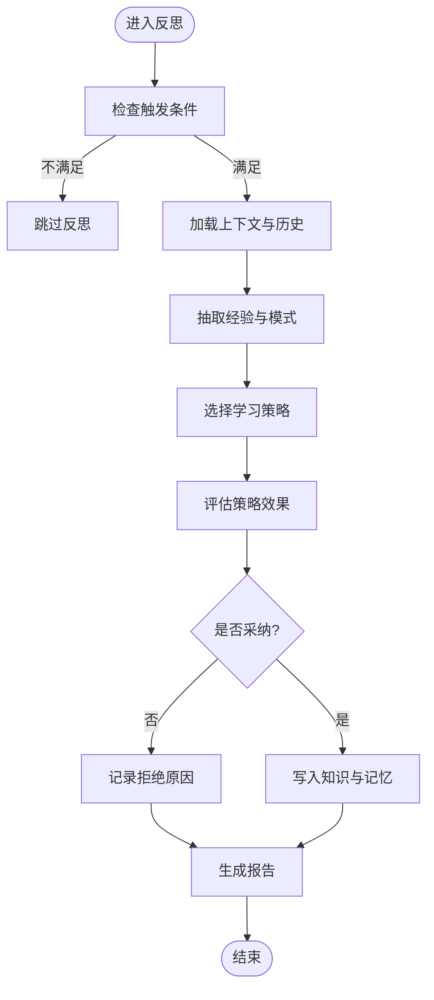
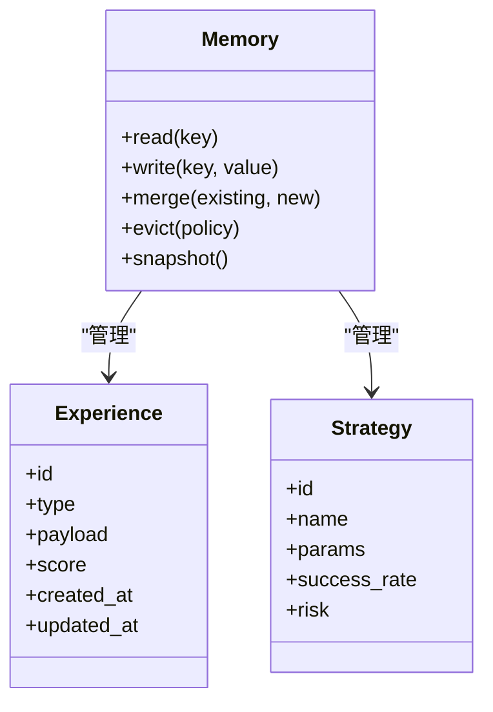
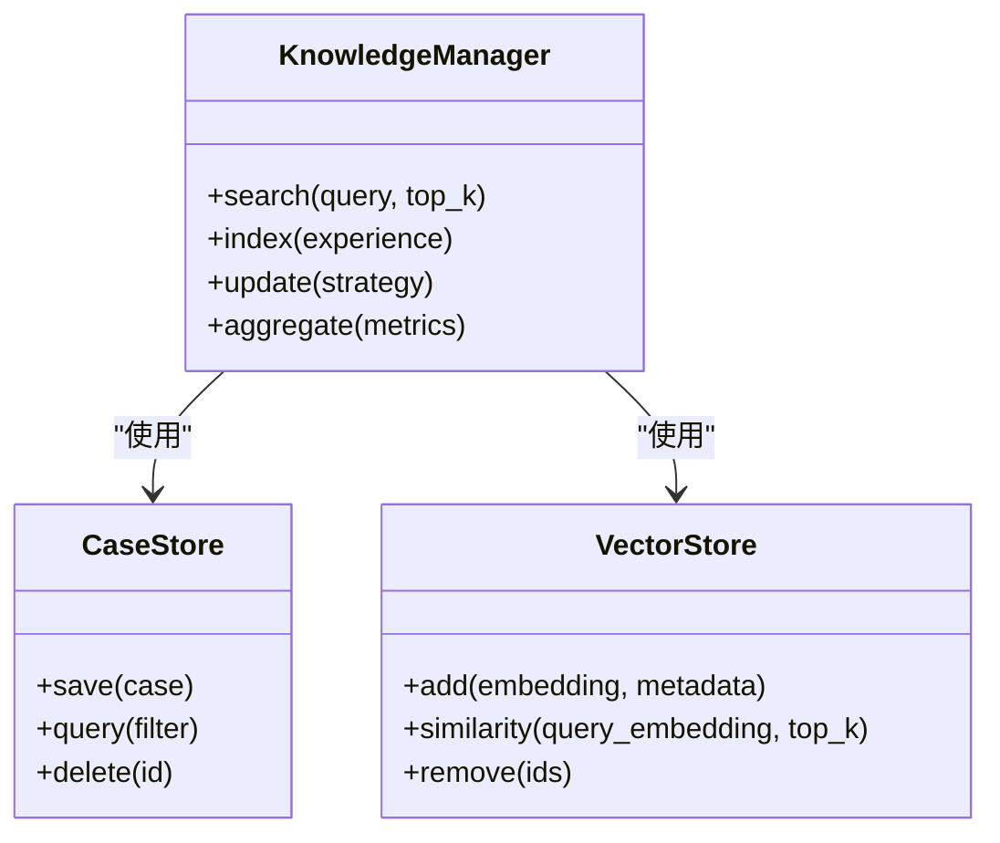
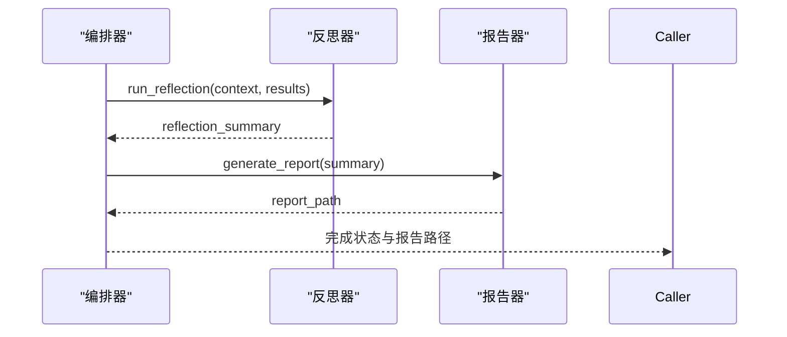
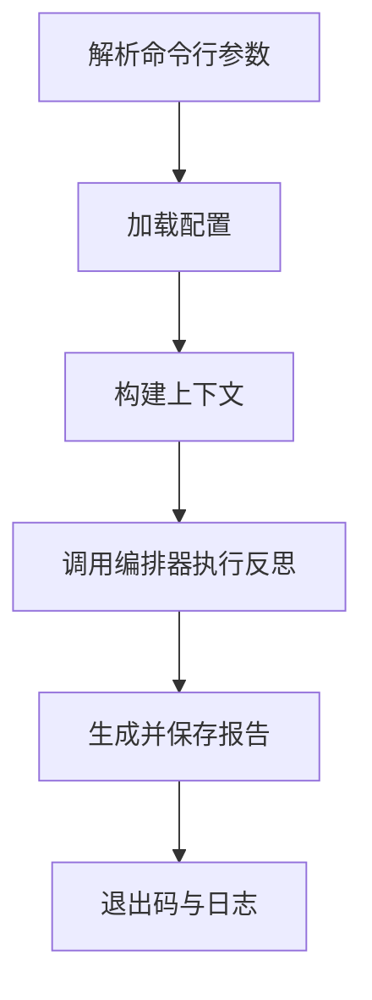
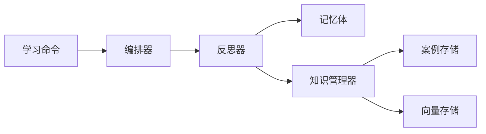

# 反思机制

<cite>
**本文引用的文件**   
- [src/jirin/learning/reflector.py](file://src/jirin/learning/reflector.py)
- [src/jirin/learning/memory.py](file://src/jirin/learning/memory.py)
- [src/jirin/knowledge/manager.py](file://src/jirin/knowledge/manager.py)
- [src/jirin/knowledge/case_store.py](file://src/jirin/knowledge/case_store.py)
- [src/jirin/knowledge/vector_store.py](file://src/jirin/knowledge/vector_store.py)
- [src/jirin/core/orchestrator.py](file://src/jirin/core/orchestrator.py)
- [src/jirin/cli/commands/learn.py](file://src/jirin/cli/commands/learn.py)
- [config/settings.toml](file://config/settings.toml)
</cite>

## 目录
1. [简介](#简介)
2. [项目结构](#项目结构)
3. [核心组件](#核心组件)
4. [架构总览](#架构总览)
5. [详细组件分析](#详细组件分析)
6. [依赖关系分析](#依赖关系分析)
7. [性能考虑](#性能考虑)
8. [故障排查指南](#故障排查指南)
9. [结论](#结论)
10. [附录](#附录)

## 简介
本文件系统化阐述 Jirin 的“反思机制”，覆盖其算法原理、学习循环与知识进化路径。重点说明系统如何从分析结果中提取经验教训、更新知识库并优化后续分析策略，包括：
- 反思触发条件与学习策略选择
- 效果评估与反馈闭环
- 配置参数与自定义学习规则开发方法
- 调试与排障建议

## 项目结构
围绕反思机制的关键代码位于 learning、knowledge、core 与 cli 四个层次：
- learning：实现反思器、记忆体与分类器等学习与反思核心逻辑
- knowledge：管理案例库、向量检索与知识聚合
- core：编排器负责驱动整体流程（含反思阶段）
- cli：提供 learn 命令以触发离线或交互式反思

图表来源
- [src/jirin/learning/reflector.py](file://src/jirin/learning/reflector.py)
- [src/jirin/learning/memory.py](file://src/jirin/learning/memory.py)
- [src/jirin/knowledge/manager.py](file://src/jirin/knowledge/manager.py)
- [src/jirin/knowledge/case_store.py](file://src/jirin/knowledge/case_store.py)
- [src/jirin/knowledge/vector_store.py](file://src/jirin/knowledge/vector_store.py)
- [src/jirin/core/orchestrator.py](file://src/jirin/core/orchestrator.py)
- [src/jirin/cli/commands/learn.py](file://src/jirin/cli/commands/learn.py)

章节来源
- [src/jirin/learning/reflector.py](file://src/jirin/learning/reflector.py)
- [src/jirin/learning/memory.py](file://src/jirin/learning/memory.py)
- [src/jirin/knowledge/manager.py](file://src/jirin/knowledge/manager.py)
- [src/jirin/knowledge/case_store.py](file://src/jirin/knowledge/case_store.py)
- [src/jirin/knowledge/vector_store.py](file://src/jirin/knowledge/vector_store.py)
- [src/jirin/core/orchestrator.py](file://src/jirin/core/orchestrator.py)
- [src/jirin/cli/commands/learn.py](file://src/jirin/cli/commands/learn.py)

## 核心组件
- 反思器（Reflector）
  - 职责：接收分析产物，执行经验抽取、策略生成与策略回写；协调记忆体与知识管理器的读写。
  - 关键能力：触发条件判定、策略选择、效果评估、反馈写入。
- 记忆体（Memory）
  - 职责：维护短期/长期经验缓存、去重与合并、增量更新。
- 知识管理器（Knowledge Manager）
  - 职责：统一访问案例库与向量库，提供检索、写入、聚合与版本化能力。
- 案例存储（Case Store）
  - 职责：持久化结构化案例（输入、过程、输出、标签、评分等）。
- 向量存储（Vector Store）
  - 职责：为经验与策略提供语义检索与相似匹配。
- 编排器（Orchestrator）
  - 职责：在分析流水线中插入反思阶段，控制生命周期与错误恢复。
- 学习命令（CLI learn）
  - 职责：暴露离线/交互式反思入口，支持批量处理与进度报告。

章节来源
- [src/jirin/learning/reflector.py](file://src/jirin/learning/reflector.py)
- [src/jirin/learning/memory.py](file://src/jirin/learning/memory.py)
- [src/jirin/knowledge/manager.py](file://src/jirin/knowledge/manager.py)
- [src/jirin/knowledge/case_store.py](file://src/jirin/knowledge/case_store.py)
- [src/jirin/knowledge/vector_store.py](file://src/jirin/knowledge/vector_store.py)
- [src/jirin/core/orchestrator.py](file://src/jirin/core/orchestrator.py)
- [src/jirin/cli/commands/learn.py](file://src/jirin/cli/commands/learn.py)

## 架构总览
反思机制采用“分析→反思→知识更新→策略优化”的闭环设计。编排器在分析完成后触发反思；反思器基于当前上下文与历史记忆，生成可执行的策略改进项；知识管理器将新经验沉淀到案例与向量库；后续分析通过检索增强策略质量。

图表来源
- [src/jirin/cli/commands/learn.py](file://src/jirin/cli/commands/learn.py)
- [src/jirin/core/orchestrator.py](file://src/jirin/core/orchestrator.py)
- [src/jirin/learning/reflector.py](file://src/jirin/learning/reflector.py)
- [src/jirin/learning/memory.py](file://src/jirin/learning/memory.py)
- [src/jirin/knowledge/manager.py](file://src/jirin/knowledge/manager.py)
- [src/jirin/knowledge/case_store.py](file://src/jirin/knowledge/case_store.py)
- [src/jirin/knowledge/vector_store.py](file://src/jirin/knowledge/vector_store.py)

## 详细组件分析

### 反思器（Reflector）
- 功能要点
  - 触发条件：基于分析结果的质量指标、失败模式、覆盖率阈值、时间窗口等。
  - 学习策略选择：根据问题类型、历史成功率、领域特征选择不同策略（如规则强化、反例归纳、启发式调整）。
  - 效果评估：对比基线与改进后的预期收益，结合置信度与风险进行排序。
  - 反馈机制：将策略变更与效果指标回写到记忆体与知识管理器，形成闭环。
- 数据流
  - 输入：分析产物、上下文、历史策略与效果记录
  - 处理：经验抽取→策略生成→评估排序→决策
  - 输出：策略更新清单、经验条目、评估报告
- 异常与容错
  - 对不可信样本进行过滤与降级
  - 对冲突策略进行仲裁与合并
  - 对持久化失败进行重试与补偿

图表来源
- [src/jirin/learning/reflector.py](file://src/jirin/learning/reflector.py)

章节来源
- [src/jirin/learning/reflector.py](file://src/jirin/learning/reflector.py)

### 记忆体（Memory）
- 功能要点
  - 短期/长期记忆分层：短期用于本轮反思会话，长期跨会话累积。
  - 去重与合并：基于键空间与相似度合并相近经验，避免冗余。
  - 增量更新：仅写入新增或变更的策略与经验，降低开销。
- 数据结构与复杂度
  - 典型操作：插入O(1~logN)、查找O(logN)、近似最近邻O(k·logN)
  - 内存占用随经验规模线性增长，可通过压缩与淘汰策略控制
- 一致性
  - 原子写入与事务性提交，保证知识一致性与可回滚

图表来源
- [src/jirin/learning/memory.py](file://src/jirin/learning/memory.py)

章节来源
- [src/jirin/learning/memory.py](file://src/jirin/learning/memory.py)

### 知识管理器（Knowledge Manager）
- 功能要点
  - 统一接口：封装案例库与向量库的读写与检索
  - 版本化：对策略与经验进行版本标记，支持回溯与对比
  - 聚合统计：按维度汇总成功/失败率、覆盖率、稳定性等
- 集成点
  - 与案例存储和向量存储解耦，便于替换后端实现
  - 与反思器协作，提供检索增强与写入保障

图表来源
- [src/jirin/knowledge/manager.py](file://src/jirin/knowledge/manager.py)
- [src/jirin/knowledge/case_store.py](file://src/jirin/knowledge/case_store.py)
- [src/jirin/knowledge/vector_store.py](file://src/jirin/knowledge/vector_store.py)

章节来源
- [src/jirin/knowledge/manager.py](file://src/jirin/knowledge/manager.py)
- [src/jirin/knowledge/case_store.py](file://src/jirin/knowledge/case_store.py)
- [src/jirin/knowledge/vector_store.py](file://src/jirin/knowledge/vector_store.py)

### 编排器（Orchestrator）
- 功能要点
  - 在分析流水线后注入反思阶段
  - 控制并发与批处理，确保资源可控
  - 捕获异常并上报，保证主流程稳定
- 交互
  - 调用反思器执行策略更新
  - 收集指标并输出报告

图表来源
- [src/jirin/core/orchestrator.py](file://src/jirin/core/orchestrator.py)
- [src/jirin/learning/reflector.py](file://src/jirin/learning/reflector.py)

章节来源
- [src/jirin/core/orchestrator.py](file://src/jirin/core/orchestrator.py)

### 学习命令（CLI learn）
- 功能要点
  - 提供离线/交互式反思入口
  - 支持批量输入、进度显示与结果导出
  - 与配置文件联动，动态加载策略与阈值
- 典型用法
  - 指定输入源（日志/分析结果）
  - 指定输出目录（报告/快照）
  - 设置反思级别与并发度

图表来源
- [src/jirin/cli/commands/learn.py](file://src/jirin/cli/commands/learn.py)

章节来源
- [src/jirin/cli/commands/learn.py](file://src/jirin/cli/commands/learn.py)

## 依赖关系分析
- 模块耦合
  - 反思器强依赖记忆体与知识管理器，弱依赖分类器（可选）
  - 知识管理器对案例存储与向量存储为组合关系，便于替换
  - 编排器与CLI为上层调度，低耦合
- 外部依赖
  - 向量存储可能依赖外部嵌入模型或索引服务
  - 案例存储可能对接文件系统或数据库
- 潜在环依赖
  - 通过接口抽象与事件回调避免直接循环引用

图表来源
- [src/jirin/learning/reflector.py](file://src/jirin/learning/reflector.py)
- [src/jirin/learning/memory.py](file://src/jirin/learning/memory.py)
- [src/jirin/knowledge/manager.py](file://src/jirin/knowledge/manager.py)
- [src/jirin/knowledge/case_store.py](file://src/jirin/knowledge/case_store.py)
- [src/jirin/knowledge/vector_store.py](file://src/jirin/knowledge/vector_store.py)
- [src/jirin/core/orchestrator.py](file://src/jirin/core/orchestrator.py)
- [src/jirin/cli/commands/learn.py](file://src/jirin/cli/commands/learn.py)

章节来源
- [src/jirin/learning/reflector.py](file://src/jirin/learning/reflector.py)
- [src/jirin/learning/memory.py](file://src/jirin/learning/memory.py)
- [src/jirin/knowledge/manager.py](file://src/jirin/knowledge/manager.py)
- [src/jirin/knowledge/case_store.py](file://src/jirin/knowledge/case_store.py)
- [src/jirin/knowledge/vector_store.py](file://src/jirin/knowledge/vector_store.py)
- [src/jirin/core/orchestrator.py](file://src/jirin/core/orchestrator.py)
- [src/jirin/cli/commands/learn.py](file://src/jirin/cli/commands/learn.py)

## 性能考虑
- 反射频率控制
  - 基于时间窗口与事件密度自适应触发，避免频繁反思造成抖动
- 检索加速
  - 向量检索采用近似最近邻与分页限制，减少I/O与计算
- 写入批量化
  - 批量写入案例与向量索引，降低锁竞争与磁盘开销
- 内存管理
  - 对短期记忆设置容量上限与LRU淘汰，防止内存膨胀
- 并发与吞吐
  - 编排器支持并行反思任务，但需限制并发度以避免资源争用

[本节为通用指导，无需特定文件来源]

## 故障排查指南
- 常见问题
  - 反思未触发：检查触发阈值与时间窗口配置
  - 策略未生效：确认策略版本与优先级，查看冲突仲裁日志
  - 检索为空：验证向量索引是否更新，检查查询嵌入与相似度阈值
  - 写入失败：检查存储后端连通性与权限，关注重试与补偿日志
- 定位步骤
  - 启用更详细的日志级别，聚焦反思器与知识管理器
  - 导出反思报告与快照，对比前后差异
  - 隔离测试：最小化输入复现问题，逐步扩大范围
- 恢复策略
  - 回滚到上一稳定版本的知识快照
  - 清理无效索引并重建
  - 重置短期记忆，保留长期经验

章节来源
- [src/jirin/learning/reflector.py](file://src/jirin/learning/reflector.py)
- [src/jirin/knowledge/manager.py](file://src/jirin/knowledge/manager.py)
- [src/jirin/cli/commands/learn.py](file://src/jirin/cli/commands/learn.py)

## 结论
Jirin 的反思机制通过“触发—抽取—评估—更新—反馈”的闭环，持续从分析结果中学习并优化策略。借助记忆体与知识管理器的协同，系统在保持稳定的同时实现了知识的渐进式进化。合理的配置与监控是确保反思有效性的关键。

[本节为总结，无需特定文件来源]

## 附录

### 配置参数参考
以下为常见配置项类别与用途说明（具体键名以实际配置文件为准）：
- 反思触发
  - 时间窗口：控制反思周期
  - 事件阈值：基于失败率、覆盖率等指标
  - 最小样本量：避免小样本偏差
- 学习策略
  - 策略池：可用的策略名称与权重
  - 选择算法：如加权随机、贪心、多臂老虎机等
  - 探索与利用比例：平衡尝试新策略与复用已知策略
- 效果评估
  - 指标集：成功率、稳定性、覆盖率、风险评分
  - 置信区间：用于统计显著性判断
  - 基线对比：与默认策略或历史最佳对比
- 存储与索引
  - 案例存储路径/连接信息
  - 向量存储后端与维度
  - 索引刷新策略与批大小
- 运行与并发
  - 反思并发度
  - 超时与重试次数
  - 日志级别与输出路径

章节来源
- [config/settings.toml](file://config/settings.toml)

### 自定义学习规则开发指南
- 定义规则接口
  - 输入：上下文、历史经验、当前策略
  - 输出：候选策略、评分与解释
- 注册与发现
  - 将规则注册到策略池，支持动态加载
- 单元测试
  - 构造典型场景与边界用例，验证正确性与鲁棒性
- 集成测试
  - 在编排器中端到端验证，观察指标变化
- 灰度发布
  - 小流量引入，监控效果后再全量

章节来源
- [src/jirin/learning/reflector.py](file://src/jirin/learning/reflector.py)
- [src/jirin/cli/commands/learn.py](file://src/jirin/cli/commands/learn.py)