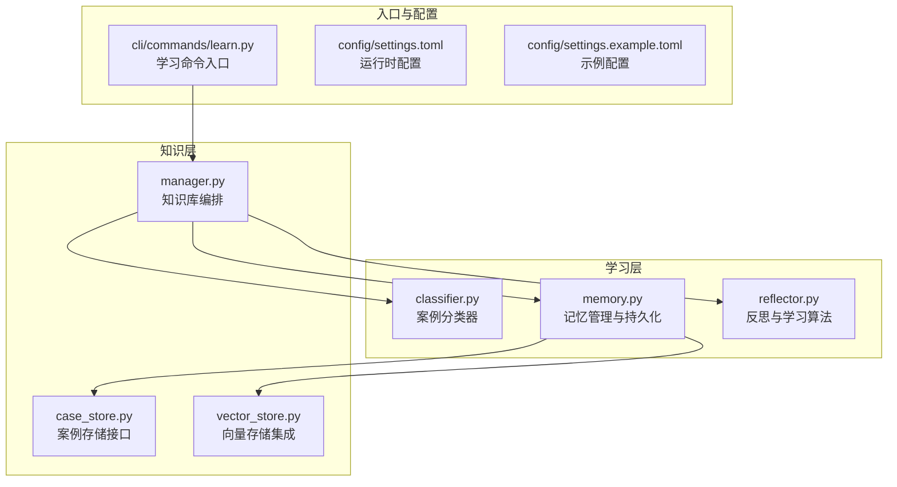
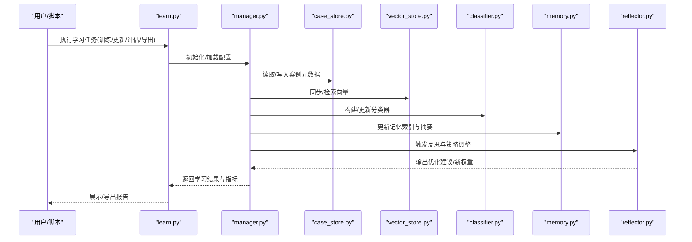
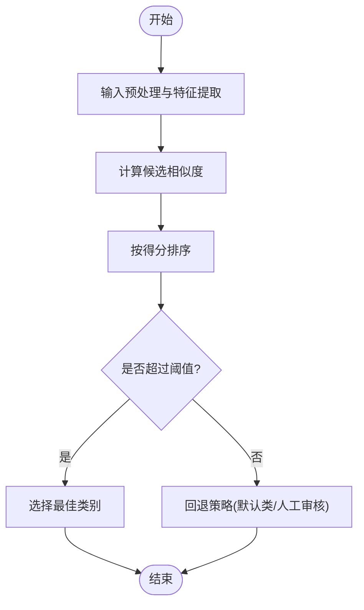
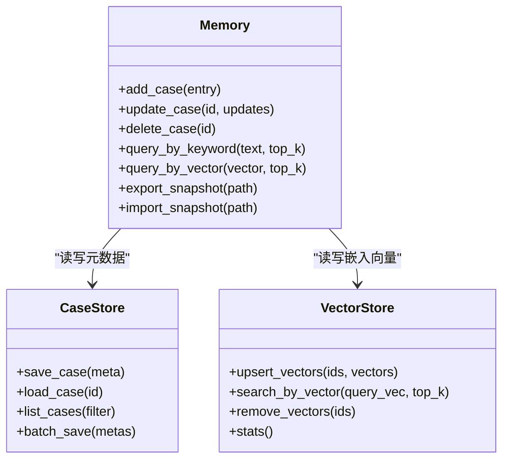
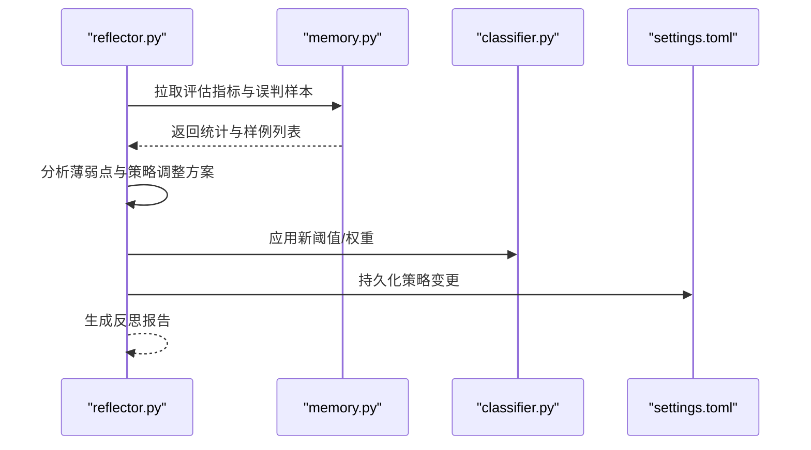
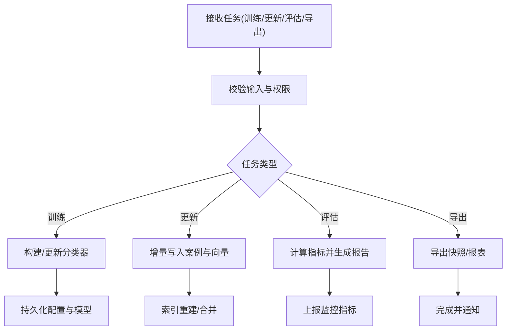
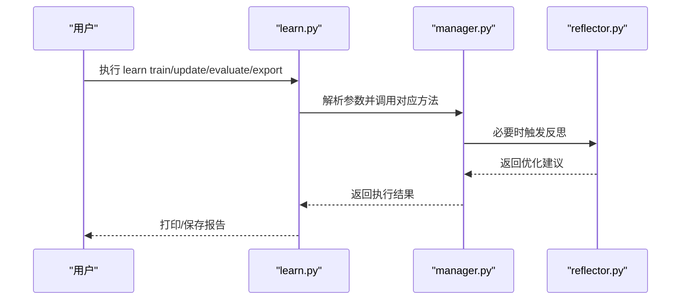
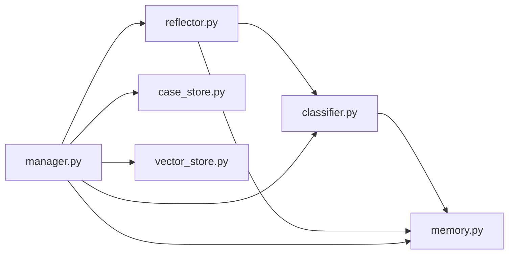

# 学习系统

<cite>
**本文引用的文件**   
- [src/jirin/learning/classifier.py](file://src/jirin/learning/classifier.py)
- [src/jirin/learning/memory.py](file://src/jirin/learning/memory.py)
- [src/jirin/learning/reflector.py](file://src/jirin/learning/reflector.py)
- [src/jirin/knowledge/case_store.py](file://src/jirin/knowledge/case_store.py)
- [src/jirin/knowledge/vector_store.py](file://src/jirin/knowledge/vector_store.py)
- [src/jirin/knowledge/manager.py](file://src/jirin/knowledge/manager.py)
- [config/settings.toml](file://config/settings.toml)
- [config/settings.example.toml](file://config/settings.example.toml)
- [src/jirin/cli/commands/learn.py](file://src/jirin/cli/commands/learn.py)
</cite>

## 目录
1. [简介](#简介)
2. [项目结构](#项目结构)
3. [核心组件](#核心组件)
4. [架构总览](#架构总览)
5. [详细组件分析](#详细组件分析)
6. [依赖关系分析](#依赖关系分析)
7. [性能考虑](#性能考虑)
8. [故障排查指南](#故障排查指南)
9. [结论](#结论)
10. [附录](#附录)

## 简介
本文件面向Jirin的学习系统，系统性阐述其机器学习架构设计、案例分类器实现原理、记忆管理系统的数据结构与持久化机制、反思机制的学习算法。文档同时解释系统如何从历史案例中学习、如何进行相似性匹配与知识积累，并覆盖知识库管理、向量存储集成与性能优化策略。最后提供配置选项、监控指标与调优指南，帮助读者快速上手与深入定制。

## 项目结构
学习系统位于 src/jirin/learning 与 src/jirin/knowledge 两大模块中，CLI命令 learn.py 作为入口，配置文件位于 config 目录。

图表来源
- [src/jirin/learning/classifier.py](file://src/jirin/learning/classifier.py)
- [src/jirin/learning/memory.py](file://src/jirin/learning/memory.py)
- [src/jirin/learning/reflector.py](file://src/jirin/learning/reflector.py)
- [src/jirin/knowledge/case_store.py](file://src/jirin/knowledge/case_store.py)
- [src/jirin/knowledge/vector_store.py](file://src/jirin/knowledge/vector_store.py)
- [src/jirin/knowledge/manager.py](file://src/jirin/knowledge/manager.py)
- [src/jirin/cli/commands/learn.py](file://src/jirin/cli/commands/learn.py)
- [config/settings.toml](file://config/settings.toml)
- [config/settings.example.toml](file://config/settings.example.toml)

章节来源
- [src/jirin/learning/classifier.py](file://src/jirin/learning/classifier.py)
- [src/jirin/learning/memory.py](file://src/jirin/learning/memory.py)
- [src/jirin/learning/reflector.py](file://src/jirin/learning/reflector.py)
- [src/jirin/knowledge/case_store.py](file://src/jirin/knowledge/case_store.py)
- [src/jirin/knowledge/vector_store.py](file://src/jirin/knowledge/vector_store.py)
- [src/jirin/knowledge/manager.py](file://src/jirin/knowledge/manager.py)
- [src/jirin/cli/commands/learn.py](file://src/jirin/cli/commands/learn.py)
- [config/settings.toml](file://config/settings.toml)
- [config/settings.example.toml](file://config/settings.example.toml)

## 核心组件
- 案例分类器：负责将输入问题映射到预定义或动态扩展的案例类别，支持相似度阈值控制与多策略融合。
- 记忆系统：维护历史案例的索引、摘要与嵌入向量，提供增删改查与批量导入导出能力，并与向量存储协同工作。
- 反思机制：基于历史反馈与结果评估，对分类决策与检索策略进行迭代优化，形成“实践—评估—改进”的闭环。
- 知识库管理：统一编排案例存储与向量存储，提供查询、更新、统计与一致性保障。
- CLI学习命令：封装学习流程（训练/更新/评估/导出），便于运维与自动化。

章节来源
- [src/jirin/learning/classifier.py](file://src/jirin/learning/classifier.py)
- [src/jirin/learning/memory.py](file://src/jirin/learning/memory.py)
- [src/jirin/learning/reflector.py](file://src/jirin/learning/reflector.py)
- [src/jirin/knowledge/manager.py](file://src/jirin/knowledge/manager.py)
- [src/jirin/cli/commands/learn.py](file://src/jirin/cli/commands/learn.py)

## 架构总览
学习系统采用分层架构：上层为学习与反思逻辑，中层为知识库编排，底层为案例与向量存储。CLI作为统一入口驱动端到端流程。

图表来源
- [src/jirin/cli/commands/learn.py](file://src/jirin/cli/commands/learn.py)
- [src/jirin/knowledge/manager.py](file://src/jirin/knowledge/manager.py)
- [src/jirin/knowledge/case_store.py](file://src/jirin/knowledge/case_store.py)
- [src/jirin/knowledge/vector_store.py](file://src/jirin/knowledge/vector_store.py)
- [src/jirin/learning/classifier.py](file://src/jirin/learning/classifier.py)
- [src/jirin/learning/memory.py](file://src/jirin/learning/memory.py)
- [src/jirin/learning/reflector.py](file://src/jirin/learning/reflector.py)

## 详细组件分析

### 案例分类器（classifier.py）
- 职责
  - 将输入文本转换为特征表示，计算与已知案例的相似度，输出候选类别及置信度。
  - 支持阈值过滤、类别权重与多策略融合（如关键词+向量相似度）。
- 关键流程
  - 预处理与特征提取
  - 相似度计算与排序
  - 阈值判定与回退策略
  - 增量更新与热重载
- 复杂度与优化
  - 时间复杂度主要取决于候选集规模与相似度度量；可通过近似最近邻检索与分桶策略降低开销。
  - 空间复杂度受嵌入维度与索引大小影响，需结合内存与磁盘权衡。
- 错误处理
  - 空输入、缺失嵌入、类别不存在的边界情况均有保护与日志记录。

图表来源
- [src/jirin/learning/classifier.py](file://src/jirin/learning/classifier.py)

章节来源
- [src/jirin/learning/classifier.py](file://src/jirin/learning/classifier.py)

### 记忆系统（memory.py）
- 数据结构
  - 案例条目：包含唯一标识、文本内容、标签、时间戳、质量评分、摘要等。
  - 索引结构：倒排索引用于关键词检索，向量索引用于语义检索。
  - 缓存层：热点案例与高频查询结果的本地缓存。
- 持久化机制
  - 事务性写入：保证案例与索引的一致性。
  - 增量快照：定期生成快照以加速恢复。
  - 版本控制：支持回滚与迁移。
- 与向量存储集成
  - 通过 manager.py 协调 case_store.py 与 vector_store.py，确保元数据与向量同步。
- 性能特性
  - 批量写入、异步刷新、分页查询、压缩存储。

图表来源
- [src/jirin/learning/memory.py](file://src/jirin/learning/memory.py)
- [src/jirin/knowledge/case_store.py](file://src/jirin/knowledge/case_store.py)
- [src/jirin/knowledge/vector_store.py](file://src/jirin/knowledge/vector_store.py)

章节来源
- [src/jirin/learning/memory.py](file://src/jirin/learning/memory.py)
- [src/jirin/knowledge/case_store.py](file://src/jirin/knowledge/case_store.py)
- [src/jirin/knowledge/vector_store.py](file://src/jirin/knowledge/vector_store.py)

### 反思机制（reflector.py）
- 学习目标
  - 基于历史反馈（准确率、召回率、误判原因）自动调整分类阈值、类别权重与检索策略。
- 学习算法要点
  - 误差聚合：汇总误判样本，识别薄弱类别与模糊边界。
  - 策略更新：使用在线学习或离线重训方式更新模型参数与规则。
  - 验证与回滚：在沙箱环境验证新策略效果，失败则回滚。
- 与记忆系统的协作
  - 读取记忆中的评估指标与样例，输出优化建议并写回配置或模型权重。

图表来源
- [src/jirin/learning/reflector.py](file://src/jirin/learning/reflector.py)
- [src/jirin/learning/memory.py](file://src/jirin/learning/memory.py)
- [src/jirin/learning/classifier.py](file://src/jirin/learning/classifier.py)
- [config/settings.toml](file://config/settings.toml)

章节来源
- [src/jirin/learning/reflector.py](file://src/jirin/learning/reflector.py)
- [src/jirin/learning/memory.py](file://src/jirin/learning/memory.py)
- [src/jirin/learning/classifier.py](file://src/jirin/learning/classifier.py)
- [config/settings.toml](file://config/settings.toml)

### 知识库管理（manager.py）
- 职责
  - 编排案例存储与向量存储，提供统一的查询、更新、统计与一致性保障。
  - 协调学习流程：训练、更新、评估、导出。
- 关键操作
  - 同步元数据与向量索引
  - 批量导入/导出
  - 健康检查与指标采集

图表来源
- [src/jirin/knowledge/manager.py](file://src/jirin/knowledge/manager.py)
- [src/jirin/knowledge/case_store.py](file://src/jirin/knowledge/case_store.py)
- [src/jirin/knowledge/vector_store.py](file://src/jirin/knowledge/vector_store.py)

章节来源
- [src/jirin/knowledge/manager.py](file://src/jirin/knowledge/manager.py)
- [src/jirin/knowledge/case_store.py](file://src/jirin/knowledge/case_store.py)
- [src/jirin/knowledge/vector_store.py](file://src/jirin/knowledge/vector_store.py)

### CLI学习命令（learn.py）
- 功能
  - 提供命令行接口，封装学习全流程，支持参数化配置与输出报告。
- 典型用法
  - 训练：加载数据、构建分类器、更新记忆与向量索引。
  - 更新：增量导入新案例、触发反思与策略调整。
  - 评估：运行基准测试、输出指标与可视化。
  - 导出：导出快照、报表与模型权重。

图表来源
- [src/jirin/cli/commands/learn.py](file://src/jirin/cli/commands/learn.py)
- [src/jirin/knowledge/manager.py](file://src/jirin/knowledge/manager.py)
- [src/jirin/learning/reflector.py](file://src/jirin/learning/reflector.py)

章节来源
- [src/jirin/cli/commands/learn.py](file://src/jirin/cli/commands/learn.py)
- [src/jirin/knowledge/manager.py](file://src/jirin/knowledge/manager.py)
- [src/jirin/learning/reflector.py](file://src/jirin/learning/reflector.py)

## 依赖关系分析
- 模块耦合
  - classifier.py 依赖 memory.py 提供的检索能力与案例元数据。
  - reflector.py 依赖 memory.py 的评估指标与案例样本，并可更新 classifier.py 的策略。
  - manager.py 作为编排者，组合 case_store.py 与 vector_store.py，并为 learning 层提供统一接口。
- 外部依赖
  - 向量存储后端（例如本地文件或远程服务）由 vector_store.py 抽象，便于替换与扩展。
- 潜在循环依赖
  - 通过 manager.py 解耦，避免直接双向依赖。

图表来源
- [src/jirin/learning/classifier.py](file://src/jirin/learning/classifier.py)
- [src/jirin/learning/memory.py](file://src/jirin/learning/memory.py)
- [src/jirin/learning/reflector.py](file://src/jirin/learning/reflector.py)
- [src/jirin/knowledge/manager.py](file://src/jirin/knowledge/manager.py)
- [src/jirin/knowledge/case_store.py](file://src/jirin/knowledge/case_store.py)
- [src/jirin/knowledge/vector_store.py](file://src/jirin/knowledge/vector_store.py)

章节来源
- [src/jirin/learning/classifier.py](file://src/jirin/learning/classifier.py)
- [src/jirin/learning/memory.py](file://src/jirin/learning/memory.py)
- [src/jirin/learning/reflector.py](file://src/jirin/learning/reflector.py)
- [src/jirin/knowledge/manager.py](file://src/jirin/knowledge/manager.py)
- [src/jirin/knowledge/case_store.py](file://src/jirin/knowledge/case_store.py)
- [src/jirin/knowledge/vector_store.py](file://src/jirin/knowledge/vector_store.py)

## 性能考虑
- 向量检索优化
  - 使用近似最近邻索引（如HNSW/IVF）提升大规模检索效率。
  - 合理设置 top_k 与距离阈值，平衡精度与延迟。
- 批处理与并发
  - 批量写入与异步刷新减少I/O抖动。
  - 读写分离与只读副本提高吞吐。
- 内存与存储
  - 嵌入向量的量化与压缩降低内存占用。
  - 冷热分层：热数据驻留内存，冷数据落盘。
- 反射与重训
  - 增量更新优于全量重训，缩短收敛时间。
  - 灰度发布新策略，观察指标后再全量切换。

[本节为通用指导，无需特定文件引用]

## 故障排查指南
- 常见问题
  - 向量索引不一致：检查 case_store.py 与 vector_store.py 的同步流程与事务边界。
  - 分类阈值过低导致误判：通过 reflector.py 的反思报告调整阈值与权重。
  - 导入失败或数据损坏：使用 memory.py 的快照与版本控制进行回滚。
- 诊断步骤
  - 查看 manager.py 的健康检查与指标输出。
  - 核对 settings.toml 的配置项是否与当前环境一致。
  - 使用 learn.py 的评估命令复现问题并定位瓶颈。

章节来源
- [src/jirin/knowledge/manager.py](file://src/jirin/knowledge/manager.py)
- [src/jirin/learning/memory.py](file://src/jirin/learning/memory.py)
- [src/jirin/learning/reflector.py](file://src/jirin/learning/reflector.py)
- [config/settings.toml](file://config/settings.toml)
- [src/jirin/cli/commands/learn.py](file://src/jirin/cli/commands/learn.py)

## 结论
Jirin学习系统通过分类器、记忆系统与反思机制的协同，实现了从历史案例中持续学习与优化的闭环。知识库管理统一编排案例与向量存储，CLI提供便捷的操作入口。配合合理的配置与性能优化策略，系统可在大规模场景下保持高可用与可扩展性。

[本节为总结，无需特定文件引用]

## 附录

### 配置选项（settings.toml / settings.example.toml）
- 分类器相关
  - 相似度阈值、类别权重、回退策略开关
- 记忆系统相关
  - 索引类型、快照周期、压缩级别、缓存大小
- 向量存储相关
  - 后端类型、连接参数、top_k、距离度量
- 反思机制相关
  - 评估窗口、策略更新频率、回滚条件
- CLI相关
  - 输出路径、并行度、日志级别

章节来源
- [config/settings.toml](file://config/settings.toml)
- [config/settings.example.toml](file://config/settings.example.toml)

### 监控指标与调优指南
- 指标
  - 分类准确率、召回率、F1分数
  - 检索延迟P95/P99、QPS
  - 向量索引大小、内存占用、磁盘使用
  - 反思策略生效次数与回滚率
- 调优
  - 根据业务分布调整阈值与权重
  - 增大 top_k 以提升召回，但注意延迟
  - 启用增量更新与灰度发布，降低风险
  - 定期快照与清理，避免数据膨胀

章节来源
- [src/jirin/knowledge/manager.py](file://src/jirin/knowledge/manager.py)
- [src/jirin/learning/classifier.py](file://src/jirin/learning/classifier.py)
- [src/jirin/learning/memory.py](file://src/jirin/learning/memory.py)
- [src/jirin/learning/reflector.py](file://src/jirin/learning/reflector.py)