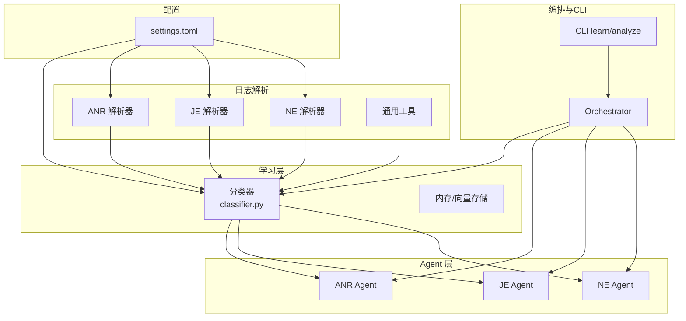
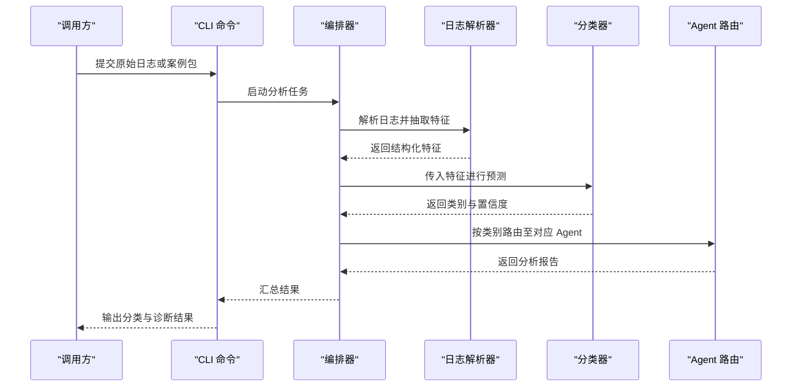
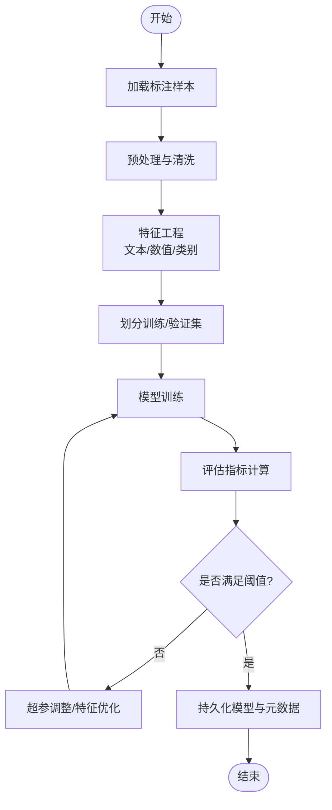
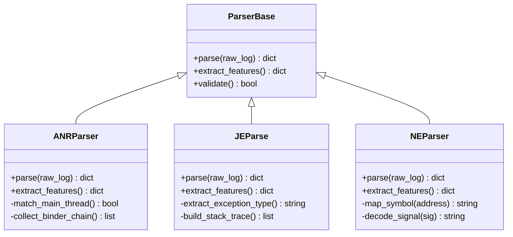
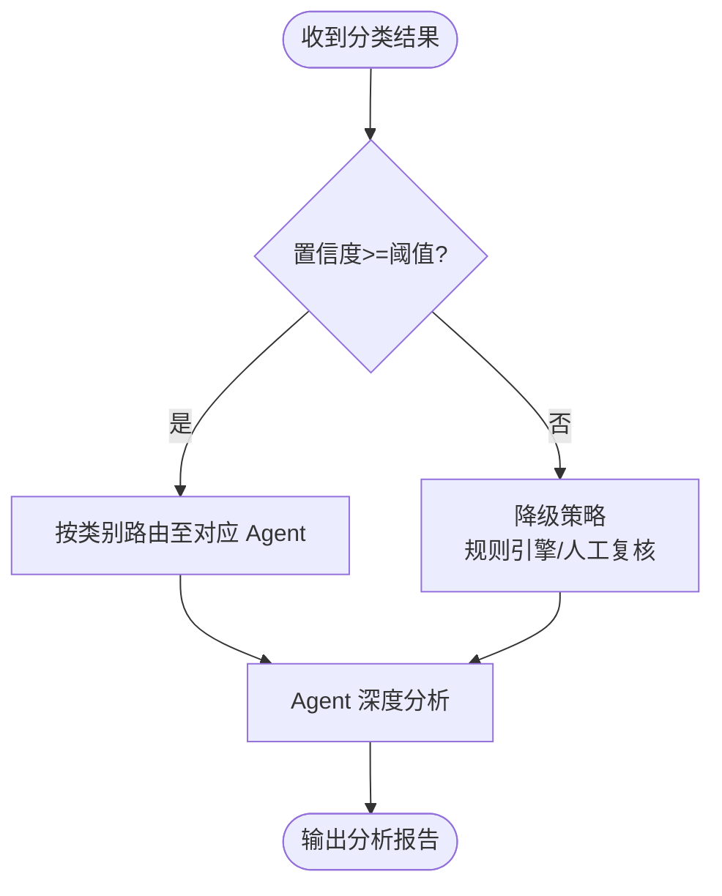
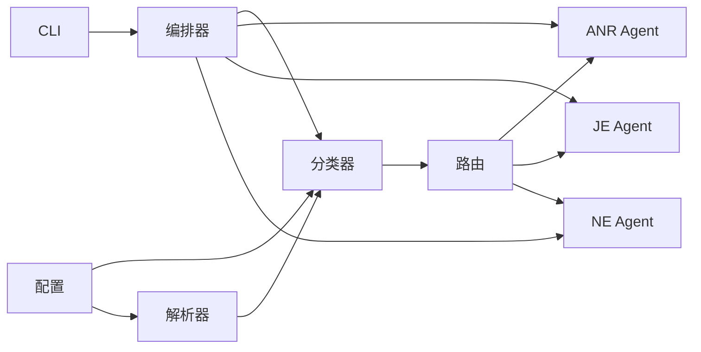

# 案例分类器

<cite>
**本文引用的文件**   
- [src/jirin/learning/classifier.py](file://src/jirin/learning/classifier.py)
- [src/jirin/tools/log_parser/anr_parser.py](file://src/jirin/tools/log_parser/anr_parser.py)
- [src/jirin/tools/log_parser/je_parser.py](file://src/jirin/tools/log_parser/je_parser.py)
- [src/jirin/tools/log_parser/ne_parser.py](file://src/jirin/tools/log_parser/ne_parser.py)
- [src/jirin/tools/log_parser/common.py](file://src/jirin/tools/log_parser/common.py)
- [src/jirin/agents/anr_agent.py](file://src/jirin/agents/anr_agent.py)
- [src/jirin/agents/je_agent.py](file://src/jirin/agents/je_agent.py)
- [src/jirin/agents/ne_agent.py](file://src/jirin/agents/ne_agent.py)
- [src/jirin/core/orchestrator.py](file://src/jirin/core/orchestrator.py)
- [src/jirin/cli/commands/learn.py](file://src/jirin/cli/commands/learn.py)
- [config/settings.toml](file://config/settings.toml)
</cite>

## 目录
1. [简介](#简介)
2. [项目结构](#项目结构)
3. [核心组件](#核心组件)
4. [架构总览](#架构总览)
5. [详细组件分析](#详细组件分析)
6. [依赖关系分析](#依赖关系分析)
7. [性能考虑](#性能考虑)
8. [故障排查指南](#故障排查指南)
9. [结论](#结论)
10. [附录](#附录)

## 简介
本文件为 Jirin 的案例分类器提供系统化文档，覆盖算法实现、特征提取机制、分类策略、训练与模型更新流程、准确率评估方法与性能优化策略。重点说明如何对崩溃案例进行自动分类，包括 ANR、Java 异常（JE）、Native 崩溃（NE）等类型的识别逻辑，并提供配置参数、API 使用示例与集成指南，帮助开发者快速理解并落地使用。

## 项目结构
围绕“日志解析—特征抽取—分类决策—Agent 路由”的链路组织：
- 日志解析层：针对 ANR、JE、NE 三类日志进行结构化抽取
- 学习层：负责特征工程、分类器训练、模型持久化与更新
- Agent 层：根据分类结果将案例路由到对应专家 Agent 进行深入分析
- 编排层：串联解析、分类、路由与分析流程
- CLI 层：提供训练、导出、分析等命令入口
- 配置层：集中管理分类器与解析器的运行参数



图表来源
- [src/jirin/learning/classifier.py](file://src/jirin/learning/classifier.py)
- [src/jirin/tools/log_parser/anr_parser.py](file://src/jirin/tools/log_parser/anr_parser.py)
- [src/jirin/tools/log_parser/je_parser.py](file://src/jirin/tools/log_parser/je_parser.py)
- [src/jirin/tools/log_parser/ne_parser.py](file://src/jirin/tools/log_parser/ne_parser.py)
- [src/jirin/tools/log_parser/common.py](file://src/jirin/tools/log_parser/common.py)
- [src/jirin/agents/anr_agent.py](file://src/jirin/agents/anr_agent.py)
- [src/jirin/agents/je_agent.py](file://src/jirin/agents/je_agent.py)
- [src/jirin/agents/ne_agent.py](file://src/jirin/agents/ne_agent.py)
- [src/jirin/core/orchestrator.py](file://src/jirin/core/orchestrator.py)
- [src/jirin/cli/commands/learn.py](file://src/jirin/cli/commands/learn.py)
- [config/settings.toml](file://config/settings.toml)

章节来源
- [src/jirin/learning/classifier.py](file://src/jirin/learning/classifier.py)
- [src/jirin/tools/log_parser/anr_parser.py](file://src/jirin/tools/log_parser/anr_parser.py)
- [src/jirin/tools/log_parser/je_parser.py](file://src/jirin/tools/log_parser/je_parser.py)
- [src/jirin/tools/log_parser/ne_parser.py](file://src/jirin/tools/log_parser/ne_parser.py)
- [src/jirin/tools/log_parser/common.py](file://src/jirin/tools/log_parser/common.py)
- [src/jirin/agents/anr_agent.py](file://src/jirin/agents/anr_agent.py)
- [src/jirin/agents/je_agent.py](file://src/jirin/agents/je_agent.py)
- [src/jirin/agents/ne_agent.py](file://src/jirin/agents/ne_agent.py)
- [src/jirin/core/orchestrator.py](file://src/jirin/core/orchestrator.py)
- [src/jirin/cli/commands/learn.py](file://src/jirin/cli/commands/learn.py)
- [config/settings.toml](file://config/settings.toml)

## 核心组件
- 分类器（Learning Layer）
  - 负责从解析后的结构化特征中构建样本，执行训练、预测与模型持久化
  - 支持增量学习与回滚策略，确保线上稳定性
- 日志解析器（Parsing Layer）
  - ANR/JE/NE 三类解析器分别抽取关键上下文、堆栈片段、线程状态、信号信息等
  - 通用工具提供正则匹配、时间戳归一化、路径清洗等能力
- Agent 路由（Routing Layer）
  - 基于分类结果将案例分发至对应专家 Agent，进行根因定位与修复建议生成
- 编排器（Orchestrator）
  - 统一调度解析、分类、路由与分析步骤，维护处理上下文与中间结果
- CLI 命令
  - 提供训练、分析、导出等命令，便于离线批量处理与在线服务集成

章节来源
- [src/jirin/learning/classifier.py](file://src/jirin/learning/classifier.py)
- [src/jirin/tools/log_parser/anr_parser.py](file://src/jirin/tools/log_parser/anr_parser.py)
- [src/jirin/tools/log_parser/je_parser.py](file://src/jirin/tools/log_parser/je_parser.py)
- [src/jirin/tools/log_parser/ne_parser.py](file://src/jirin/tools/log_parser/ne_parser.py)
- [src/jirin/tools/log_parser/common.py](file://src/jirin/tools/log_parser/common.py)
- [src/jirin/agents/anr_agent.py](file://src/jirin/agents/anr_agent.py)
- [src/jirin/agents/je_agent.py](file://src/jirin/agents/je_agent.py)
- [src/jirin/agents/ne_agent.py](file://src/jirin/agents/ne_agent.py)
- [src/jirin/core/orchestrator.py](file://src/jirin/core/orchestrator.py)
- [src/jirin/cli/commands/learn.py](file://src/jirin/cli/commands/learn.py)

## 架构总览
整体采用“解析—特征—分类—路由—分析”的分层架构，强调可插拔与可扩展：
- 解析层输出标准化特征字典
- 分类器以特征字典为输入，输出类别标签与置信度
- 路由层依据标签选择对应 Agent 进行深度分析
- Orchestrator 统一管理生命周期与错误恢复
- CLI 暴露训练与分析接口，支持批处理与服务化



图表来源
- [src/jirin/core/orchestrator.py](file://src/jirin/core/orchestrator.py)
- [src/jirin/learning/classifier.py](file://src/jirin/learning/classifier.py)
- [src/jirin/tools/log_parser/anr_parser.py](file://src/jirin/tools/log_parser/anr_parser.py)
- [src/jirin/tools/log_parser/je_parser.py](file://src/jirin/tools/log_parser/je_parser.py)
- [src/jirin/tools/log_parser/ne_parser.py](file://src/jirin/tools/log_parser/ne_parser.py)
- [src/jirin/agents/anr_agent.py](file://src/jirin/agents/anr_agent.py)
- [src/jirin/agents/je_agent.py](file://src/jirin/agents/je_agent.py)
- [src/jirin/agents/ne_agent.py](file://src/jirin/agents/ne_agent.py)
- [src/jirin/cli/commands/learn.py](file://src/jirin/cli/commands/learn.py)

## 详细组件分析

### 分类器（Learning Layer）
- 功能职责
  - 特征向量化：将解析器输出的结构化特征转换为模型输入
  - 模型训练：支持全量训练与增量更新，内置交叉验证与指标统计
  - 预测推理：对未知案例输出类别与置信度，支持阈值过滤与拒识
  - 模型持久化：保存/加载模型权重与元数据，支持版本管理与回滚
- 关键设计
  - 多模态特征融合：文本模式（堆栈片段、关键字）、数值特征（线程数、耗时）、类别特征（平台、模块）
  - 鲁棒性：缺失值填充、噪声过滤、类别不平衡处理
  - 可解释性：输出重要特征贡献度，辅助规则调优
- 训练流程
  - 数据准备：从历史案例库抽取标注样本，划分训练/验证集
  - 特征工程：正则匹配、词频/TF-IDF、时序窗口聚合
  - 模型选择：轻量级树模型或线性分类器，兼顾精度与速度
  - 评估指标：准确率、召回率、F1、AUC；按类别统计混淆矩阵
  - 部署策略：灰度发布、A/B 测试、自动回滚
- 模型更新机制
  - 增量学习：滚动窗口内新样本持续微调
  - 定期重训：周期性全量重训，保证长期漂移适应
  - 版本控制：模型指纹、变更日志、一键切换



图表来源
- [src/jirin/learning/classifier.py](file://src/jirin/learning/classifier.py)

章节来源
- [src/jirin/learning/classifier.py](file://src/jirin/learning/classifier.py)

### 日志解析器（Parsing Layer）
- ANR 解析器
  - 目标：识别应用无响应事件，提取主线程阻塞信息、系统服务交互、超时原因
  - 关键特征：主线程状态、Binder 调用链、锁竞争、I/O 等待、系统服务名称
- JE 解析器
  - 目标：捕获 Java 层异常，提取异常类型、堆栈轨迹、抛出位置、上下文变量
  - 关键特征：异常类名、消息关键字、包名前缀、循环引用提示、OOM 相关字段
- NE 解析器
  - 目标：定位 Native 层崩溃，提取信号类型、寄存器快照、崩溃地址、符号表映射
  - 关键特征：信号号、崩溃函数、模块名、偏移量、ABI 信息
- 通用工具
  - 正则模板库、时间戳归一化、路径脱敏、编码转换、日志分段



图表来源
- [src/jirin/tools/log_parser/anr_parser.py](file://src/jirin/tools/log_parser/anr_parser.py)
- [src/jirin/tools/log_parser/je_parser.py](file://src/jirin/tools/log_parser/je_parser.py)
- [src/jirin/tools/log_parser/ne_parser.py](file://src/jirin/tools/log_parser/ne_parser.py)
- [src/jirin/tools/log_parser/common.py](file://src/jirin/tools/log_parser/common.py)

章节来源
- [src/jirin/tools/log_parser/anr_parser.py](file://src/jirin/tools/log_parser/anr_parser.py)
- [src/jirin/tools/log_parser/je_parser.py](file://src/jirin/tools/log_parser/je_parser.py)
- [src/jirin/tools/log_parser/ne_parser.py](file://src/jirin/tools/log_parser/ne_parser.py)
- [src/jirin/tools/log_parser/common.py](file://src/jirin/tools/log_parser/common.py)

### Agent 路由（Routing Layer）
- 路由策略
  - 硬规则：基于类别标签直接分发
  - 软规则：结合置信度阈值与模糊匹配，必要时进入人工复核
- Agent 职责
  - ANR Agent：聚焦主线程阻塞、死锁、资源争用定位
  - JE Agent：聚焦异常根因、上下文还原、修复建议
  - NE Agent：聚焦符号解析、汇编回溯、底层驱动问题定位



图表来源
- [src/jirin/agents/anr_agent.py](file://src/jirin/agents/anr_agent.py)
- [src/jirin/agents/je_agent.py](file://src/jirin/agents/je_agent.py)
- [src/jirin/agents/ne_agent.py](file://src/jirin/agents/ne_agent.py)

章节来源
- [src/jirin/agents/anr_agent.py](file://src/jirin/agents/anr_agent.py)
- [src/jirin/agents/je_agent.py](file://src/jirin/agents/je_agent.py)
- [src/jirin/agents/ne_agent.py](file://src/jirin/agents/ne_agent.py)

### 编排器（Orchestrator）
- 职责
  - 协调解析、分类、路由与分析阶段
  - 维护任务上下文、中间结果与错误恢复
  - 提供统一的进度与日志上报
- 错误处理
  - 解析失败：回退到默认特征或标记为未分类
  - 分类失败：启用规则引擎或降级到通用 Agent
  - Agent 异常：记录上下文并触发重试或转人工

```mermaid
sequenceDiagram
participant Orch as "编排器"
participant Par as "解析器"
participant Clf as "分类器"
participant Ag as "Agent"
Orch->>Par : 解析日志
Par-->>Orch : 特征
Orch->>Clf : 预测类别
Clf-->>Orch : 类别+置信度
Orch->>Ag : 路由分析
Ag-->>Orch : 报告
Orch-->>Orch : 汇总与上报
```

图表来源
- [src/jirin/core/orchestrator.py](file://src/jirin/core/orchestrator.py)

章节来源
- [src/jirin/core/orchestrator.py](file://src/jirin/core/orchestrator.py)

### CLI 命令（Learn/Analyze）
- 训练命令
  - 读取标注数据集，执行特征工程与模型训练
  - 输出评估报告与模型文件
- 分析命令
  - 接收原始日志或案例包，完成端到端分类与分析
  - 支持批量处理与结果导出

章节来源
- [src/jirin/cli/commands/learn.py](file://src/jirin/cli/commands/learn.py)

## 依赖关系分析
- 内部依赖
  - 分类器依赖解析器输出的特征字典
  - 编排器依赖分类器与 Agent 的路由契约
  - CLI 依赖编排器与配置中心
- 外部依赖
  - 日志格式与平台 ABI 信息
  - 符号表与调试信息（用于 NE 解析）
  - 可选：向量数据库（用于相似案例检索）



图表来源
- [src/jirin/learning/classifier.py](file://src/jirin/learning/classifier.py)
- [src/jirin/tools/log_parser/anr_parser.py](file://src/jirin/tools/log_parser/anr_parser.py)
- [src/jirin/tools/log_parser/je_parser.py](file://src/jirin/tools/log_parser/je_parser.py)
- [src/jirin/tools/log_parser/ne_parser.py](file://src/jirin/tools/log_parser/ne_parser.py)
- [src/jirin/agents/anr_agent.py](file://src/jirin/agents/anr_agent.py)
- [src/jirin/agents/je_agent.py](file://src/jirin/agents/je_agent.py)
- [src/jirin/agents/ne_agent.py](file://src/jirin/agents/ne_agent.py)
- [src/jirin/core/orchestrator.py](file://src/jirin/core/orchestrator.py)
- [src/jirin/cli/commands/learn.py](file://src/jirin/cli/commands/learn.py)
- [config/settings.toml](file://config/settings.toml)

章节来源
- [src/jirin/learning/classifier.py](file://src/jirin/learning/classifier.py)
- [src/jirin/tools/log_parser/anr_parser.py](file://src/jirin/tools/log_parser/anr_parser.py)
- [src/jirin/tools/log_parser/je_parser.py](file://src/jirin/tools/log_parser/je_parser.py)
- [src/jirin/tools/log_parser/ne_parser.py](file://src/jirin/tools/log_parser/ne_parser.py)
- [src/jirin/agents/anr_agent.py](file://src/jirin/agents/anr_agent.py)
- [src/jirin/agents/je_agent.py](file://src/jirin/agents/je_agent.py)
- [src/jirin/agents/ne_agent.py](file://src/jirin/agents/ne_agent.py)
- [src/jirin/core/orchestrator.py](file://src/jirin/core/orchestrator.py)
- [src/jirin/cli/commands/learn.py](file://src/jirin/cli/commands/learn.py)
- [config/settings.toml](file://config/settings.toml)

## 性能考虑
- 解析优化
  - 流式解析与分块处理，降低内存峰值
  - 正则表达式预编译与缓存命中
- 分类优化
  - 特征降维与稀疏表示，减少计算开销
  - 批量预测与异步并发，提升吞吐
- 路由与分析
  - Agent 并行执行与结果合并
  - 长耗时操作设置超时与熔断
- 模型部署
  - 模型轻量化与量化
  - 热更新与灰度发布，避免抖动

[本节为通用指导，不直接分析具体文件]

## 故障排查指南
- 常见问题
  - 解析失败：检查日志格式、编码、分段边界
  - 分类不准：核查特征覆盖率、类别不平衡、阈值设置
  - 路由异常：确认 Agent 可用性与依赖环境
- 定位方法
  - 查看编排器日志与中间特征
  - 对比历史正确样本，定位差异点
  - 使用 CLI 导出中间结果进行离线复现
- 恢复策略
  - 降级到规则引擎或通用 Agent
  - 触发模型回滚与重新训练
  - 人工复核与反馈闭环

章节来源
- [src/jirin/core/orchestrator.py](file://src/jirin/core/orchestrator.py)
- [src/jirin/cli/commands/learn.py](file://src/jirin/cli/commands/learn.py)

## 结论
Jirin 案例分类器通过“解析—特征—分类—路由—分析”的分层架构，实现了 ANR、JE、NE 三类崩溃案例的高效自动分类与深入诊断。其模块化设计与可插拔扩展能力，使得在复杂生产环境中具备高可用性与易维护性。配合完善的训练与评估流程，以及性能优化与故障恢复策略，能够满足大规模日志处理的实际需求。

[本节为总结性内容，不直接分析具体文件]

## 附录

### 配置参数（settings.toml）
- 分类器
  - 模型路径、阈值、类别权重、增量学习开关
- 解析器
  - 正则模板路径、日志分段大小、编码设置
- 路由与分析
  - Agent 超时、重试次数、降级策略
- 存储
  - 模型与中间结果持久化路径、版本管理策略

章节来源
- [config/settings.toml](file://config/settings.toml)

### API 使用示例（概念性）
- 训练
  - 输入：标注数据集路径、配置项
  - 输出：模型文件、评估报告
- 预测
  - 输入：原始日志或结构化特征
  - 输出：类别标签、置信度、中间特征
- 分析
  - 输入：分类结果与上下文
  - 输出：Agent 分析报告

[本节为概念性说明，不直接分析具体文件]