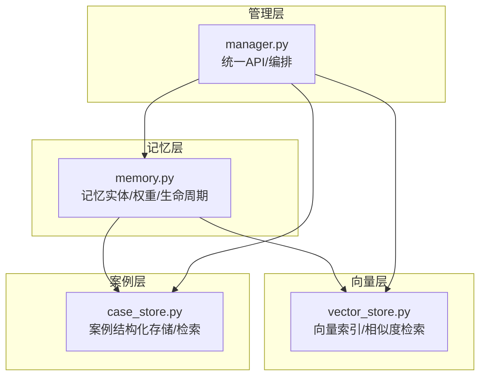
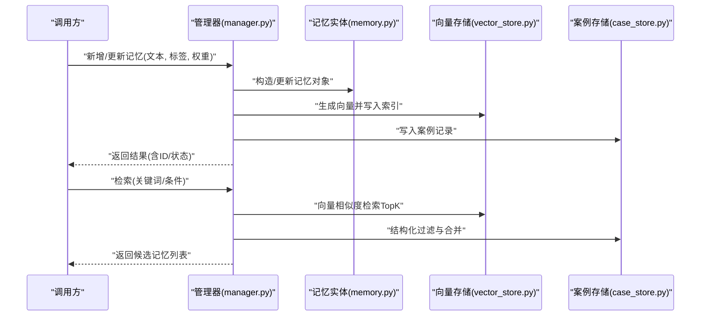
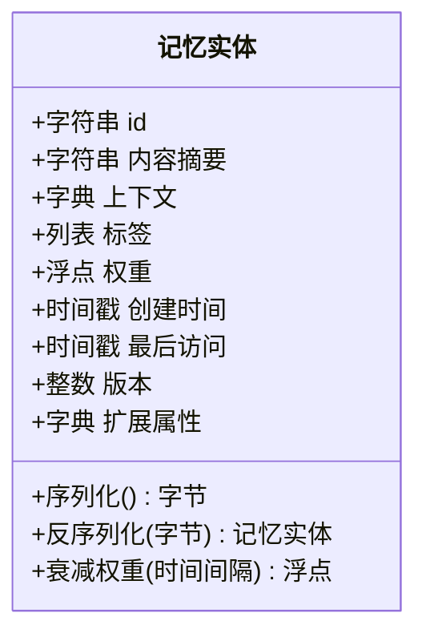
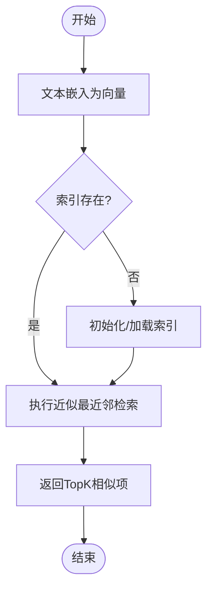
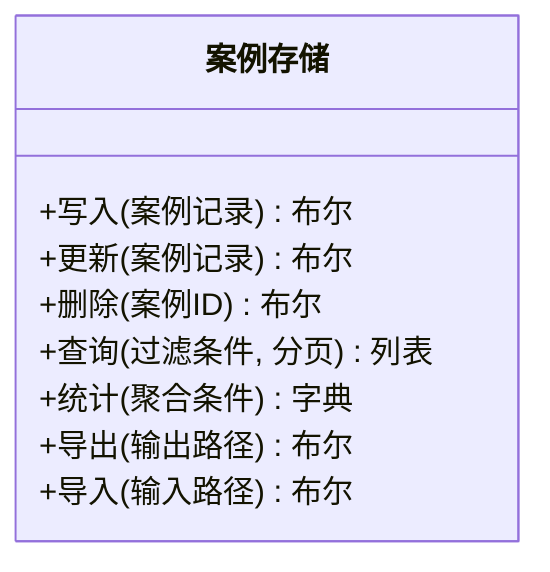
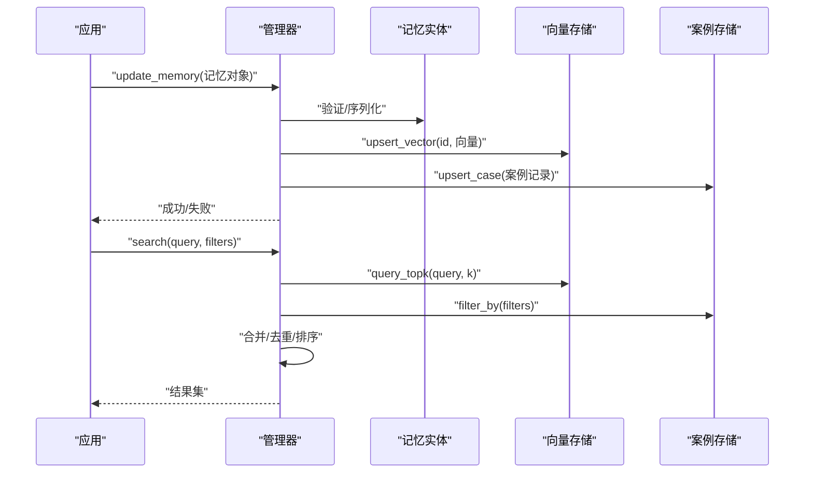
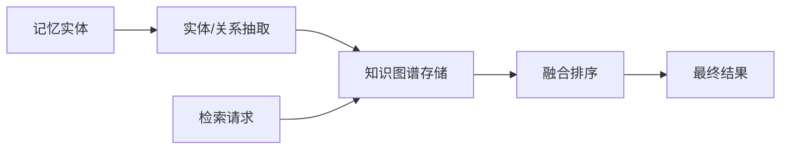
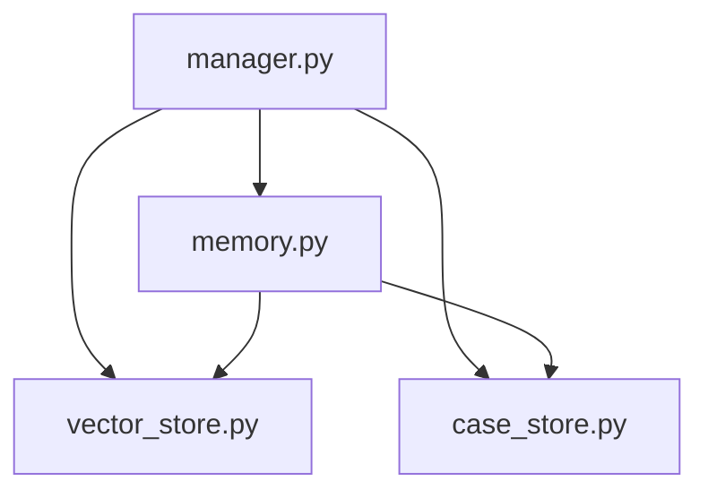

# 记忆管理系统

<cite>
**本文引用的文件**   
- [src/jirin/knowledge/memory.py](file://src/jirin/knowledge/memory.py)
- [src/jirin/knowledge/case_store.py](file://src/jirin/knowledge/case_store.py)
- [src/jirin/knowledge/vector_store.py](file://src/jirin/knowledge/vector_store.py)
- [src/jirin/knowledge/manager.py](file://src/jirin/knowledge/manager.py)
- [config/settings.example.toml](file://config/settings.example.toml)
- [config/settings.toml](file://config/settings.toml)
</cite>

## 目录
1. [简介](#简介)
2. [项目结构](#项目结构)
3. [核心组件](#核心组件)
4. [架构总览](#架构总览)
5. [详细组件分析](#详细组件分析)
6. [依赖关系分析](#依赖关系分析)
7. [性能考虑](#性能考虑)
8. [故障排查指南](#故障排查指南)
9. [结论](#结论)
10. [附录](#附录)

## 简介
本文件为 Jirin 的记忆管理系统提供全面文档，覆盖记忆存储的数据结构设计、持久化机制与检索算法；说明如何实现案例记忆的增删改查（CRUD）、记忆权重管理与过期清理策略；并阐述向量数据库集成、相似度计算与知识图谱构建。同时给出配置选项、性能调优建议与监控指标，以及 API 使用示例和最佳实践。

## 项目结构
记忆系统位于 knowledge 子模块中，围绕“记忆实体”“向量索引”“案例存储”“管理器”四个层次组织：
- memory.py：定义记忆实体、权重、生命周期与序列化/反序列化等基础能力
- vector_store.py：封装向量索引的创建、写入、查询与更新
- case_store.py：实现案例级记忆的结构化存储与检索
- manager.py：协调记忆、向量与案例存储，提供高层 API

图表来源
- [src/jirin/knowledge/memory.py](file://src/jirin/knowledge/memory.py)
- [src/jirin/knowledge/vector_store.py](file://src/jirin/knowledge/vector_store.py)
- [src/jirin/knowledge/case_store.py](file://src/jirin/knowledge/case_store.py)
- [src/jirin/knowledge/manager.py](file://src/jirin/knowledge/manager.py)

章节来源
- [src/jirin/knowledge/memory.py](file://src/jirin/knowledge/memory.py)
- [src/jirin/knowledge/vector_store.py](file://src/jirin/knowledge/vector_store.py)
- [src/jirin/knowledge/case_store.py](file://src/jirin/knowledge/case_store.py)
- [src/jirin/knowledge/manager.py](file://src/jirin/knowledge/manager.py)

## 核心组件
- 记忆实体与权重
  - 负责描述一条记忆的基本信息、上下文、标签、权重与时间戳，并提供序列化为持久化格式的能力
  - 支持基于权重的排序与衰减策略
- 向量存储
  - 提供向量化表示的索引、插入、近似最近邻检索与增量更新
  - 内置或可插拔的相似度度量（如余弦相似度）
- 案例存储
  - 以案例为单位组织记忆，支持按关键字段过滤、范围查询与分页
  - 维护案例元数据与版本信息
- 管理器
  - 对外暴露统一的记忆管理 API，协调记忆实体、向量索引与案例存储
  - 负责事务性写入、一致性校验与过期清理调度

章节来源
- [src/jirin/knowledge/memory.py](file://src/jirin/knowledge/memory.py)
- [src/jirin/knowledge/vector_store.py](file://src/jirin/knowledge/vector_store.py)
- [src/jirin/knowledge/case_store.py](file://src/jirin/knowledge/case_store.py)
- [src/jirin/knowledge/manager.py](file://src/jirin/knowledge/manager.py)

## 架构总览
记忆系统采用分层架构：上层通过管理器调用底层记忆、向量与案例存储；向量层用于语义检索，案例层用于结构化过滤；两者结合形成“语义+结构化”的混合检索路径。

图表来源
- [src/jirin/knowledge/manager.py](file://src/jirin/knowledge/manager.py)
- [src/jirin/knowledge/memory.py](file://src/jirin/knowledge/memory.py)
- [src/jirin/knowledge/vector_store.py](file://src/jirin/knowledge/vector_store.py)
- [src/jirin/knowledge/case_store.py](file://src/jirin/knowledge/case_store.py)

## 详细组件分析

### 记忆实体与权重管理
- 数据结构
  - 字段包含：唯一标识、内容摘要、上下文、标签集合、权重、时间戳、版本、扩展属性等
  - 权重用于排序与衰减，支持按时间衰减与按使用频率提升
- 生命周期
  - 新建、活跃、归档、过期、删除等状态流转
  - 过期判定依据：最后访问时间、绝对过期时间、权重阈值
- 序列化
  - 提供持久化编码（JSON/二进制），便于跨进程/跨服务共享
- 复杂度
  - 单条记忆读写 O(1)，批量写入受后端存储影响
  - 权重更新通常为 O(1) 或 O(logN)（若使用堆/树结构）

图表来源
- [src/jirin/knowledge/memory.py](file://src/jirin/knowledge/memory.py)

章节来源
- [src/jirin/knowledge/memory.py](file://src/jirin/knowledge/memory.py)

### 向量存储与相似度检索
- 功能
  - 向量索引创建、追加写入、近似最近邻检索、增量更新与重建
  - 支持多种相似度度量（默认余弦相似度），可按维度与索引参数调优
- 检索流程
  - 输入文本→嵌入模型→向量→TopK 检索→结果重排（可选）
- 复杂度
  - 写入 O(d)（d 为向量维度）
  - 检索 O(N·d) 或经索引优化后近似 O(logN·d)

图表来源
- [src/jirin/knowledge/vector_store.py](file://src/jirin/knowledge/vector_store.py)

章节来源
- [src/jirin/knowledge/vector_store.py](file://src/jirin/knowledge/vector_store.py)

### 案例存储与结构化检索
- 功能
  - 以案例为单位组织记忆，支持按字段过滤、范围查询、分页与聚合统计
  - 维护案例元数据（版本、来源、关联标签等）
- 典型操作
  - 新增/更新/删除案例
  - 按条件检索与排序
  - 导出/导入案例快照
- 复杂度
  - 单条 CRUD O(1)~O(logN)
  - 复杂过滤取决于索引与后端实现

图表来源
- [src/jirin/knowledge/case_store.py](file://src/jirin/knowledge/case_store.py)

章节来源
- [src/jirin/knowledge/case_store.py](file://src/jirin/knowledge/case_store.py)

### 管理器与统一 API
- 职责
  - 编排记忆实体、向量索引与案例存储
  - 提供一致的增删改查、检索、权重调整与过期清理接口
  - 保证写入一致性与错误恢复
- 关键流程
  - 写入：构造记忆→写向量→写案例→提交
  - 检索：向量检索→结构化过滤→合并排序→返回
  - 清理：扫描过期→标记/删除→回收资源

图表来源
- [src/jirin/knowledge/manager.py](file://src/jirin/knowledge/manager.py)
- [src/jirin/knowledge/memory.py](file://src/jirin/knowledge/memory.py)
- [src/jirin/knowledge/vector_store.py](file://src/jirin/knowledge/vector_store.py)
- [src/jirin/knowledge/case_store.py](file://src/jirin/knowledge/case_store.py)

章节来源
- [src/jirin/knowledge/manager.py](file://src/jirin/knowledge/manager.py)

### 知识图谱构建（概念性说明）
- 目标
  - 将记忆中的实体、关系与事件抽取为图节点与边，支撑推理与溯源
- 方法
  - 从记忆内容与标签中提取实体与关系
  - 将三元组写入图存储，建立反向索引
  - 在检索阶段融合图路径得分与向量相似度
- 注意
  - 该部分为概念设计，具体实现需结合外部图数据库与抽取管线

[本节为概念性说明，不直接对应具体源码文件]

## 依赖关系分析
- 内部依赖
  - 管理器依赖记忆实体、向量存储与案例存储
  - 记忆实体被向量与案例存储共同引用
- 外部依赖
  - 向量存储可能依赖第三方向量库（如本地磁盘索引或远程服务）
  - 案例存储可能依赖文件系统或轻量数据库
- 耦合与内聚
  - 管理器作为门面降低耦合，各子模块保持高内聚
  - 通过接口约定避免循环依赖

图表来源
- [src/jirin/knowledge/manager.py](file://src/jirin/knowledge/manager.py)
- [src/jirin/knowledge/memory.py](file://src/jirin/knowledge/memory.py)
- [src/jirin/knowledge/vector_store.py](file://src/jirin/knowledge/vector_store.py)
- [src/jirin/knowledge/case_store.py](file://src/jirin/knowledge/case_store.py)

章节来源
- [src/jirin/knowledge/manager.py](file://src/jirin/knowledge/manager.py)
- [src/jirin/knowledge/memory.py](file://src/jirin/knowledge/memory.py)
- [src/jirin/knowledge/vector_store.py](file://src/jirin/knowledge/vector_store.py)
- [src/jirin/knowledge/case_store.py](file://src/jirin/knowledge/case_store.py)

## 性能考虑
- 写入吞吐
  - 批量写入时优先使用事务或批接口，减少锁竞争
  - 向量写入与案例写入尽量并行，但需注意一致性边界
- 检索延迟
  - 合理设置 TopK 与过滤条件，避免全表扫描
  - 对热点标签与高频查询建立二级索引
- 内存占用
  - 控制向量缓存大小，按需淘汰
  - 大对象（长文本）采用流式处理与分块
- 过期清理
  - 后台任务定期扫描，按权重与时间双阈值清理
  - 清理过程分批进行，避免阻塞主流程

[本节提供通用指导，不直接分析具体文件]

## 故障排查指南
- 常见问题
  - 向量索引损坏：检查索引文件完整性，必要时重建索引
  - 案例存储不一致：核对版本号与哈希，回滚到最近一致快照
  - 权重异常：确认衰减函数与访问日志是否更新
- 诊断步骤
  - 查看管理器日志，定位失败阶段（向量/案例/记忆）
  - 对比向量与案例的 ID 映射，确保一一对应
  - 回放最近一次写入事务，复现问题
- 恢复策略
  - 从备份恢复案例快照
  - 重新索引向量（仅重建索引，保留原始记忆）
  - 重置异常权重并触发再学习

章节来源
- [src/jirin/knowledge/manager.py](file://src/jirin/knowledge/manager.py)
- [src/jirin/knowledge/vector_store.py](file://src/jirin/knowledge/vector_store.py)
- [src/jirin/knowledge/case_store.py](file://src/jirin/knowledge/case_store.py)

## 结论
Jirin 的记忆管理系统通过“记忆实体—向量索引—案例存储—管理器”的分层设计，实现了可扩展、可检索、可治理的记忆能力。结合权重管理与过期清理，系统在长期运行中能够维持高质量的知识密度与检索效率。建议在部署时关注向量维度、索引参数与清理策略，以获得稳定性能。

## 附录

### 配置选项
- 配置文件位置
  - 示例配置：config/settings.example.toml
  - 实际配置：config/settings.toml
- 常见键位
  - 向量存储
    - 维度：嵌入向量维度
    - 索引类型：HNSW/IVF 等（根据实现）
    - 相似度：cosine/euclidean 等
    - 最大容量：限制索引条目数
  - 案例存储
    - 存储路径：本地目录或数据库连接串
    - 压缩：是否启用压缩
    - 备份周期：定时备份间隔
  - 管理器
    - 并发度：写入/检索并发线程数
    - 超时：向量/案例操作的超时时间
    - 重试：失败重试次数与退避策略
  - 清理策略
    - 权重阈值：低于阈值的记忆将被清理
    - 过期时间：绝对过期时间
    - 空闲时间：长时间未访问的记忆将被清理

章节来源
- [config/settings.example.toml](file://config/settings.example.toml)
- [config/settings.toml](file://config/settings.toml)

### API 使用示例（概念性）
- 新增记忆
  - 输入：文本、标签、权重、上下文
  - 行为：构造记忆实体、写入向量索引、写入案例记录
  - 输出：记忆ID、状态码
- 更新记忆
  - 输入：记忆ID、变更字段
  - 行为：增量更新权重与元数据、同步向量与案例
  - 输出：更新结果
- 删除记忆
  - 输入：记忆ID
  - 行为：软删除或硬删除、清理向量与案例
  - 输出：删除结果
- 检索记忆
  - 输入：查询文本、过滤条件、TopK
  - 行为：向量检索+结构化过滤+合并排序
  - 输出：候选记忆列表（含相似度分数）
- 权重调整
  - 输入：记忆ID、权重增量
  - 行为：更新权重并触发衰减
  - 输出：新权重值
- 过期清理
  - 输入：策略参数
  - 行为：扫描过期记忆、执行清理
  - 输出：清理统计

[本节为概念性说明，不直接对应具体源码文件]

### 监控指标
- 写入指标
  - QPS、P95/P99 延迟、失败率
- 检索指标
  - TopK 命中率、平均召回率、延迟分布
- 资源指标
  - 内存占用、磁盘 I/O、向量索引大小
- 健康指标
  - 索引可用性、案例一致性、清理任务状态

[本节提供通用指导，不直接分析具体文件]