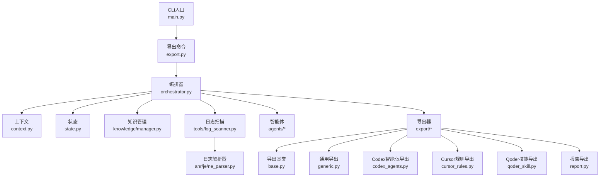
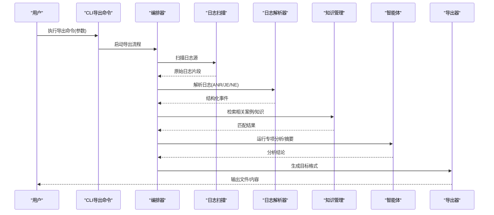
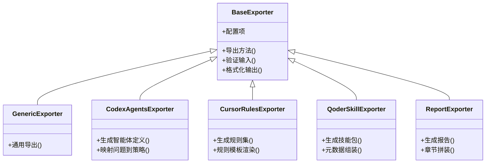
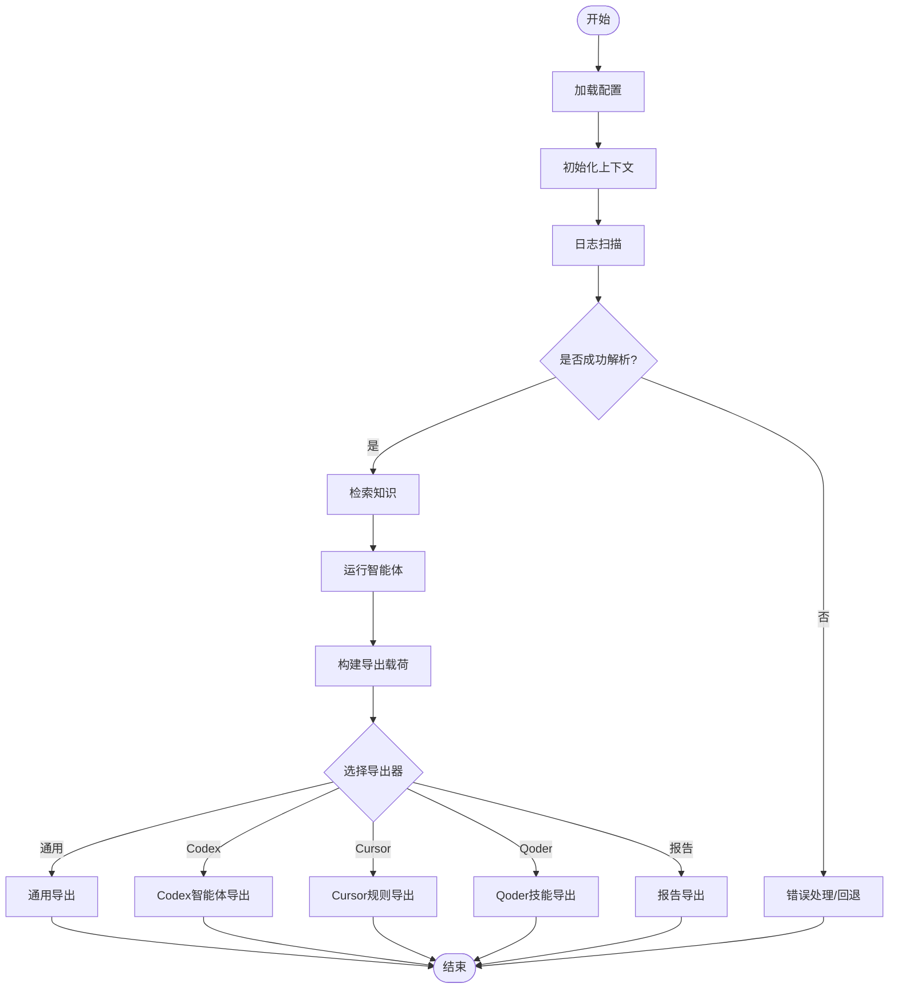
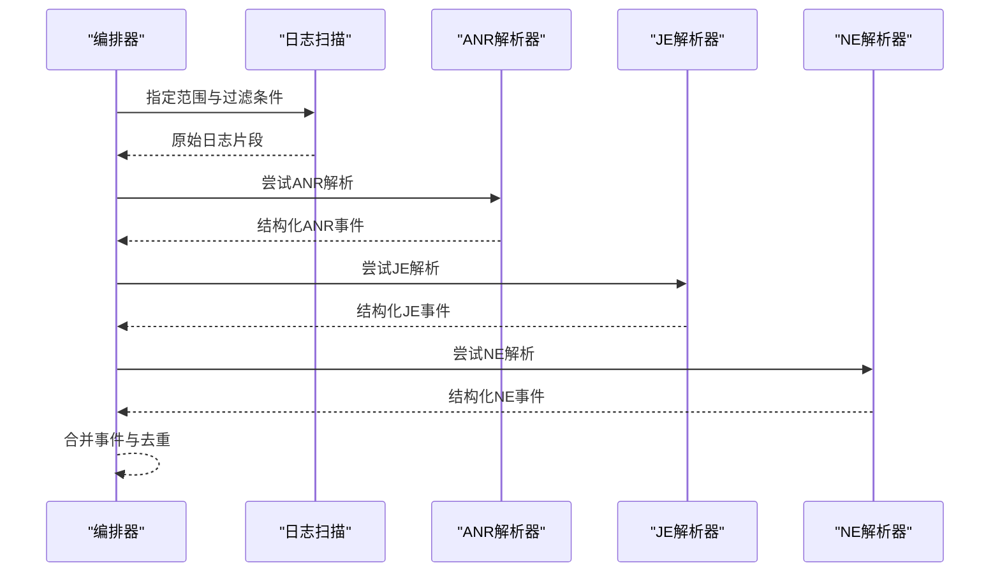
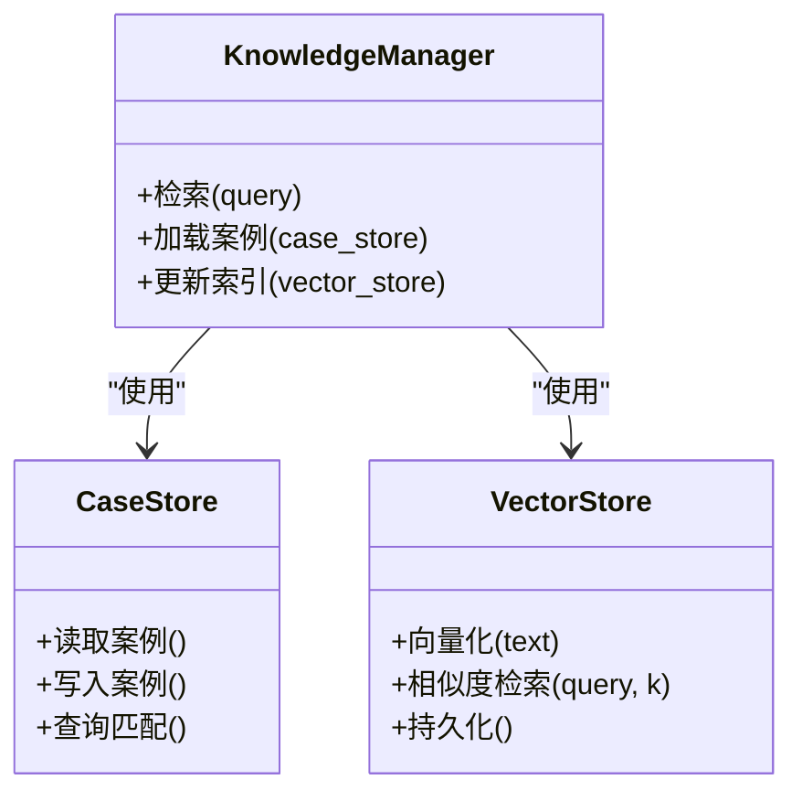
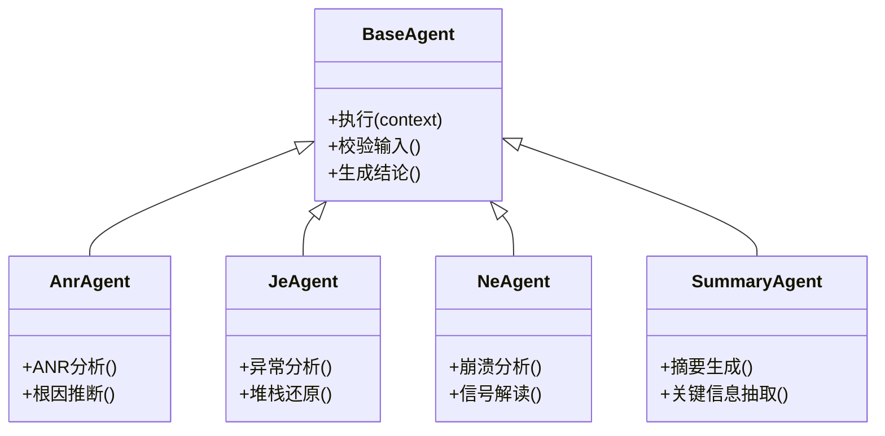
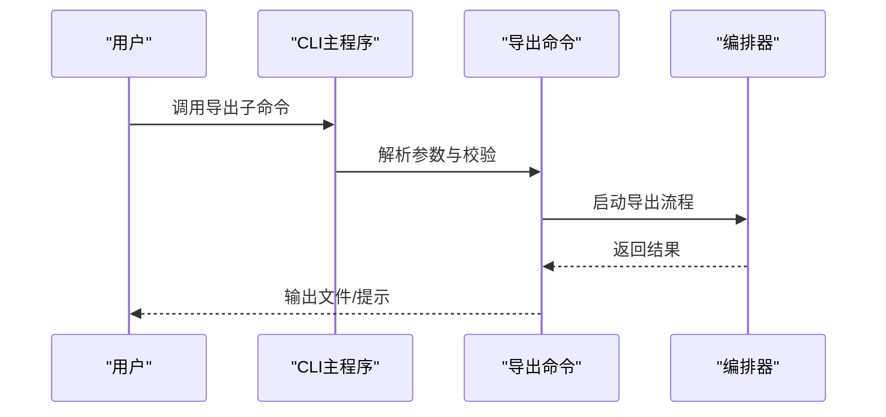
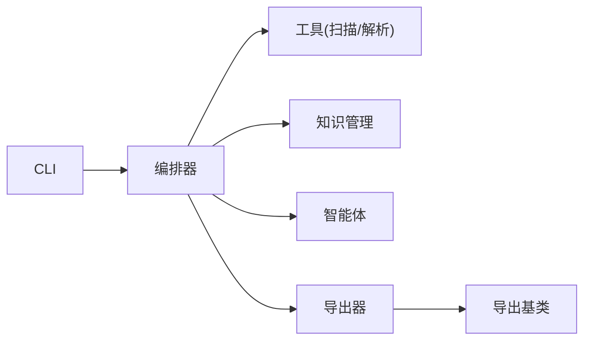

# Codex导出系统

<cite>
**本文引用的文件**
- [pyproject.toml](file://pyproject.toml)
- [config/settings.example.toml](file://config/settings.example.toml)
- [src/jirin/cli/main.py](file://src/jirin/cli/main.py)
- [src/jirin/cli/commands/export.py](file://src/jirin/cli/commands/export.py)
- [src/jirin/export/base.py](file://src/jirin/export/base.py)
- [src/jirin/export/generic.py](file://src/jirin/export/generic.py)
- [src/jirin/export/codex_agents.py](file://src/jirin/export/codex_agents.py)
- [src/jirin/export/cursor_rules.py](file://src/jirin/export/cursor_rules.py)
- [src/jirin/export/qoder_skill.py](file://src/jirin/export/qoder_skill.py)
- [src/jirin/export/report.py](file://src/jirin/export/report.py)
- [src/jirin/core/orchestrator.py](file://src/jirin/core/orchestrator.py)
- [src/jirin/core/context.py](file://src/jirin/core/context.py)
- [src/jirin/core/state.py](file://src/jirin/core/state.py)
- [src/jirin/knowledge/manager.py](file://src/jirin/knowledge/manager.py)
- [src/jirin/knowledge/case_store.py](file://src/jirin/knowledge/case_store.py)
- [src/jirin/knowledge/vector_store.py](file://src/jirin/knowledge/vector_store.py)
- [src/jirin/tools/log_scanner.py](file://src/jirin/tools/log_scanner.py)
- [src/jirin/tools/log_parser/anr_parser.py](file://src/jirin/tools/log_parser/anr_parser.py)
- [src/jirin/tools/log_parser/je_parser.py](file://src/jirin/tools/log_parser/je_parser.py)
- [src/jirin/tools/log_parser/ne_parser.py](file://src/jirin/tools/log_parser/ne_parser.py)
- [src/jirin/agents/base.py](file://src/jirin/agents/base.py)
- [src/jirin/agents/anr_agent.py](file://src/jirin/agents/anr_agent.py)
- [src/jirin/agents/je_agent.py](file://src/jirin/agents/je_agent.py)
- [src/jirin/agents/ne_agent.py](file://src/jirin/agents/ne_agent.py)
- [src/jirin/agents/summary_agent.py](file://src/jirin/agents/summary_agent.py)
</cite>

## 目录
1. [简介](#简介)
2. [项目结构](#项目结构)
3. [核心组件](#核心组件)
4. [架构总览](#架构总览)
5. [详细组件分析](#详细组件分析)
6. [依赖关系分析](#依赖关系分析)
7. [性能考量](#性能考量)
8. [故障排查指南](#故障排查指南)
9. [结论](#结论)
10. [附录](#附录)

## 简介
本文件面向“Codex导出系统”，系统化梳理该系统的目标、架构与实现要点。该系统围绕日志解析、知识管理、智能体编排与多格式导出能力构建，支持将分析结果导出为多种目标（如通用报告、特定平台规则或技能包），并提供命令行入口进行统一调度。文档旨在帮助开发者快速理解模块职责、数据流与控制流，并为扩展新的导出器与分析器提供指导。

## 项目结构
整体采用分层与按功能域组织相结合的结构：
- CLI层：提供命令入口与参数解析，协调导出流程
- Core层：编排器、上下文与状态管理，驱动任务执行
- Export层：导出抽象基类与各具体导出器（通用、Codex智能体、Cursor规则、Qoder技能、报告）
- Knowledge层：案例库、向量存储与知识管理
- Tools层：设备交互、日志扫描与各类日志解析器（ANR、JE、NE）
- Agents层：针对不同类型问题的智能体（ANR、JE、NE、摘要）
- Config层：配置示例与默认设置

图表来源
- [src/jirin/cli/main.py](file://src/jirin/cli/main.py)
- [src/jirin/cli/commands/export.py](file://src/jirin/cli/commands/export.py)
- [src/jirin/core/orchestrator.py](file://src/jirin/core/orchestrator.py)
- [src/jirin/core/context.py](file://src/jirin/core/context.py)
- [src/jirin/core/state.py](file://src/jirin/core/state.py)
- [src/jirin/knowledge/manager.py](file://src/jirin/knowledge/manager.py)
- [src/jirin/tools/log_scanner.py](file://src/jirin/tools/log_scanner.py)
- [src/jirin/tools/log_parser/anr_parser.py](file://src/jirin/tools/log_parser/anr_parser.py)
- [src/jirin/tools/log_parser/je_parser.py](file://src/jirin/tools/log_parser/je_parser.py)
- [src/jirin/tools/log_parser/ne_parser.py](file://src/jirin/tools/log_parser/ne_parser.py)
- [src/jirin/agents/base.py](file://src/jirin/agents/base.py)
- [src/jirin/export/base.py](file://src/jirin/export/base.py)
- [src/jirin/export/generic.py](file://src/jirin/export/generic.py)
- [src/jirin/export/codex_agents.py](file://src/jirin/export/codex_agents.py)
- [src/jirin/export/cursor_rules.py](file://src/jirin/export/cursor_rules.py)
- [src/jirin/export/qoder_skill.py](file://src/jirin/export/qoder_skill.py)
- [src/jirin/export/report.py](file://src/jirin/export/report.py)

章节来源
- [pyproject.toml](file://pyproject.toml)
- [config/settings.example.toml](file://config/settings.example.toml)

## 核心组件
- 导出命令与CLI：负责参数校验、选择导出器、调用编排器并输出结果
- 编排器：串联日志扫描、解析、知识检索、智能体分析与导出器执行
- 上下文与状态：贯穿请求生命周期，承载输入、中间产物与最终结果
- 导出器体系：基于抽象基类的多态导出，支持通用、Codex智能体、Cursor规则、Qoder技能、报告等
- 知识管理：案例库与向量存储，支撑语义检索与复用
- 工具链：日志扫描与解析器，覆盖ANR、JE、NE等典型问题类型
- 智能体：针对不同问题的专项分析与总结

章节来源
- [src/jirin/cli/commands/export.py](file://src/jirin/cli/commands/export.py)
- [src/jirin/core/orchestrator.py](file://src/jirin/core/orchestrator.py)
- [src/jirin/core/context.py](file://src/jirin/core/context.py)
- [src/jirin/core/state.py](file://src/jirin/core/state.py)
- [src/jirin/export/base.py](file://src/jirin/export/base.py)
- [src/jirin/knowledge/manager.py](file://src/jirin/knowledge/manager.py)
- [src/jirin/tools/log_scanner.py](file://src/jirin/tools/log_scanner.py)
- [src/jirin/agents/base.py](file://src/jirin/agents/base.py)

## 架构总览
系统以“命令→编排器→工具/知识/智能体→导出器”为主线，形成清晰的流水线式处理模型。CLI仅做路由与参数装配；编排器负责阶段编排与错误收敛；各导出器通过统一接口输出不同目标格式。

图表来源
- [src/jirin/cli/commands/export.py](file://src/jirin/cli/commands/export.py)
- [src/jirin/core/orchestrator.py](file://src/jirin/core/orchestrator.py)
- [src/jirin/tools/log_scanner.py](file://src/jirin/tools/log_scanner.py)
- [src/jirin/tools/log_parser/anr_parser.py](file://src/jirin/tools/log_parser/anr_parser.py)
- [src/jirin/tools/log_parser/je_parser.py](file://src/jirin/tools/log_parser/je_parser.py)
- [src/jirin/tools/log_parser/ne_parser.py](file://src/jirin/tools/log_parser/ne_parser.py)
- [src/jirin/knowledge/manager.py](file://src/jirin/knowledge/manager.py)
- [src/jirin/agents/base.py](file://src/jirin/agents/base.py)
- [src/jirin/export/base.py](file://src/jirin/export/base.py)

## 详细组件分析

### 导出器体系（抽象与实现）
导出器采用基类抽象+多实现模式，确保统一的导出接口与可扩展性。

图表来源
- [src/jirin/export/base.py](file://src/jirin/export/base.py)
- [src/jirin/export/generic.py](file://src/jirin/export/generic.py)
- [src/jirin/export/codex_agents.py](file://src/jirin/export/codex_agents.py)
- [src/jirin/export/cursor_rules.py](file://src/jirin/export/cursor_rules.py)
- [src/jirin/export/qoder_skill.py](file://src/jirin/export/qoder_skill.py)
- [src/jirin/export/report.py](file://src/jirin/export/report.py)

章节来源
- [src/jirin/export/base.py](file://src/jirin/export/base.py)
- [src/jirin/export/generic.py](file://src/jirin/export/generic.py)
- [src/jirin/export/codex_agents.py](file://src/jirin/export/codex_agents.py)
- [src/jirin/export/cursor_rules.py](file://src/jirin/export/cursor_rules.py)
- [src/jirin/export/qoder_skill.py](file://src/jirin/export/qoder_skill.py)
- [src/jirin/export/report.py](file://src/jirin/export/report.py)

### 编排器与上下文/状态
编排器负责串联扫描、解析、知识检索、智能体分析与导出；上下文承载请求级数据，状态记录阶段进度与结果。

图表来源
- [src/jirin/core/orchestrator.py](file://src/jirin/core/orchestrator.py)
- [src/jirin/core/context.py](file://src/jirin/core/context.py)
- [src/jirin/core/state.py](file://src/jirin/core/state.py)
- [src/jirin/tools/log_scanner.py](file://src/jirin/tools/log_scanner.py)
- [src/jirin/knowledge/manager.py](file://src/jirin/knowledge/manager.py)
- [src/jirin/agents/base.py](file://src/jirin/agents/base.py)
- [src/jirin/export/base.py](file://src/jirin/export/base.py)

章节来源
- [src/jirin/core/orchestrator.py](file://src/jirin/core/orchestrator.py)
- [src/jirin/core/context.py](file://src/jirin/core/context.py)
- [src/jirin/core/state.py](file://src/jirin/core/state.py)

### 日志扫描与解析
日志扫描负责定位与抽取日志片段，解析器将非结构化日志转换为结构化事件，供后续分析与导出使用。

图表来源
- [src/jirin/tools/log_scanner.py](file://src/jirin/tools/log_scanner.py)
- [src/jirin/tools/log_parser/anr_parser.py](file://src/jirin/tools/log_parser/anr_parser.py)
- [src/jirin/tools/log_parser/je_parser.py](file://src/jirin/tools/log_parser/je_parser.py)
- [src/jirin/tools/log_parser/ne_parser.py](file://src/jirin/tools/log_parser/ne_parser.py)

章节来源
- [src/jirin/tools/log_scanner.py](file://src/jirin/tools/log_scanner.py)
- [src/jirin/tools/log_parser/anr_parser.py](file://src/jirin/tools/log_parser/anr_parser.py)
- [src/jirin/tools/log_parser/je_parser.py](file://src/jirin/tools/log_parser/je_parser.py)
- [src/jirin/tools/log_parser/ne_parser.py](file://src/jirin/tools/log_parser/ne_parser.py)

### 知识管理与检索
知识管理模块整合案例库与向量存储，支持语义检索与案例复用，提升导出内容的准确性与一致性。

图表来源
- [src/jirin/knowledge/manager.py](file://src/jirin/knowledge/manager.py)
- [src/jirin/knowledge/case_store.py](file://src/jirin/knowledge/case_store.py)
- [src/jirin/knowledge/vector_store.py](file://src/jirin/knowledge/vector_store.py)

章节来源
- [src/jirin/knowledge/manager.py](file://src/jirin/knowledge/manager.py)
- [src/jirin/knowledge/case_store.py](file://src/jirin/knowledge/case_store.py)
- [src/jirin/knowledge/vector_store.py](file://src/jirin/knowledge/vector_store.py)

### 智能体（ANR/JE/NE/摘要）
智能体针对特定问题类型进行分析与总结，输出标准化结论，供导出器消费。

图表来源
- [src/jirin/agents/base.py](file://src/jirin/agents/base.py)
- [src/jirin/agents/anr_agent.py](file://src/jirin/agents/anr_agent.py)
- [src/jirin/agents/je_agent.py](file://src/jirin/agents/je_agent.py)
- [src/jirin/agents/ne_agent.py](file://src/jirin/agents/ne_agent.py)
- [src/jirin/agents/summary_agent.py](file://src/jirin/agents/summary_agent.py)

章节来源
- [src/jirin/agents/base.py](file://src/jirin/agents/base.py)
- [src/jirin/agents/anr_agent.py](file://src/jirin/agents/anr_agent.py)
- [src/jirin/agents/je_agent.py](file://src/jirin/agents/je_agent.py)
- [src/jirin/agents/ne_agent.py](file://src/jirin/agents/ne_agent.py)
- [src/jirin/agents/summary_agent.py](file://src/jirin/agents/summary_agent.py)

### CLI导出命令
导出命令作为入口，负责参数解析、导出器选择与流程触发。

图表来源
- [src/jirin/cli/main.py](file://src/jirin/cli/main.py)
- [src/jirin/cli/commands/export.py](file://src/jirin/cli/commands/export.py)
- [src/jirin/core/orchestrator.py](file://src/jirin/core/orchestrator.py)

章节来源
- [src/jirin/cli/main.py](file://src/jirin/cli/main.py)
- [src/jirin/cli/commands/export.py](file://src/jirin/cli/commands/export.py)

## 依赖关系分析
- 低耦合高内聚：导出器通过抽象基类解耦，新增导出类型无需改动既有逻辑
- 编排器居中调度：避免模块间直接强耦合，降低循环依赖风险
- 工具与知识分离：日志解析与知识检索各自独立，便于替换与升级
- 外部依赖最小化：尽量使用标准库与轻量第三方库，保证可移植性

图表来源
- [src/jirin/cli/commands/export.py](file://src/jirin/cli/commands/export.py)
- [src/jirin/core/orchestrator.py](file://src/jirin/core/orchestrator.py)
- [src/jirin/tools/log_scanner.py](file://src/jirin/tools/log_scanner.py)
- [src/jirin/knowledge/manager.py](file://src/jirin/knowledge/manager.py)
- [src/jirin/agents/base.py](file://src/jirin/agents/base.py)
- [src/jirin/export/base.py](file://src/jirin/export/base.py)

章节来源
- [src/jirin/core/orchestrator.py](file://src/jirin/core/orchestrator.py)
- [src/jirin/export/base.py](file://src/jirin/export/base.py)

## 性能考量
- 日志扫描优化：按需过滤与分页读取，减少内存占用
- 解析器并行：对多类型日志解析进行并发控制，避免阻塞
- 知识检索缓存：热点案例与向量索引缓存，降低重复计算
- 导出器批处理：批量生成与流式写入，提高I/O吞吐
- 资源回收：及时释放临时文件与句柄，避免泄漏

[本节为通用建议，不直接分析具体文件]

## 故障排查指南
- 日志扫描失败：检查路径权限、日志轮转与过滤条件
- 解析器异常：确认日志格式与正则匹配，必要时增加容错分支
- 知识检索无结果：检查索引构建与相似度阈值
- 智能体执行错误：核对输入上下文与依赖服务可用性
- 导出器失败：验证目标格式约束与输出路径权限

章节来源
- [src/jirin/tools/log_scanner.py](file://src/jirin/tools/log_scanner.py)
- [src/jirin/tools/log_parser/anr_parser.py](file://src/jirin/tools/log_parser/anr_parser.py)
- [src/jirin/tools/log_parser/je_parser.py](file://src/jirin/tools/log_parser/je_parser.py)
- [src/jirin/tools/log_parser/ne_parser.py](file://src/jirin/tools/log_parser/ne_parser.py)
- [src/jirin/knowledge/manager.py](file://src/jirin/knowledge/manager.py)
- [src/jirin/agents/base.py](file://src/jirin/agents/base.py)
- [src/jirin/export/base.py](file://src/jirin/export/base.py)

## 结论
Codex导出系统通过清晰的层次划分与模块化设计，实现了从日志采集、解析、知识检索到智能体分析与多格式导出的完整链路。其导出器抽象与编排器调度机制具备良好的可扩展性与可维护性，适合持续演进与集成更多分析能力与导出目标。

[本节为总结性内容，不直接分析具体文件]

## 附录
- 配置示例：参考配置文件样例，了解环境变量与默认值
- 扩展指南：新增导出器时继承基类并实现必要方法；新增解析器时遵循统一接口
- 测试建议：为关键路径编写单元测试与集成测试，覆盖异常与边界情况

章节来源
- [config/settings.example.toml](file://config/settings.example.toml)
- [pyproject.toml](file://pyproject.toml)