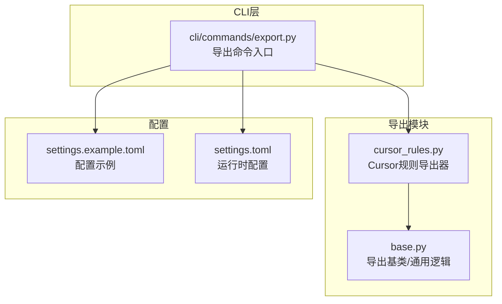
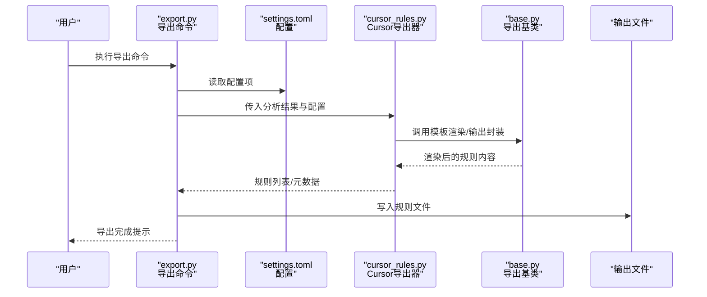
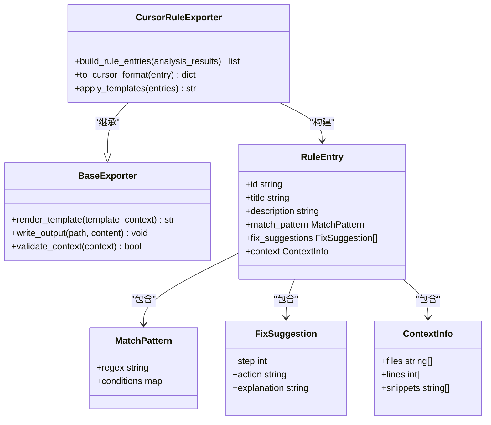
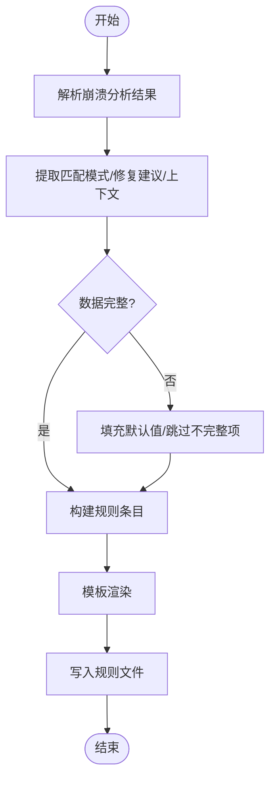
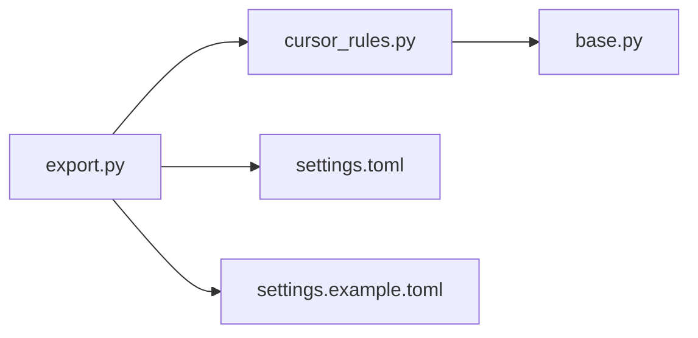

# Cursor规则导出

<cite>
**本文引用的文件**   
- [src/jirin/export/cursor_rules.py](file://src/jirin/export/cursor_rules.py)
- [src/jirin/export/base.py](file://src/jirin/export/base.py)
- [src/jirin/cli/commands/export.py](file://src/jirin/cli/commands/export.py)
- [config/settings.example.toml](file://config/settings.example.toml)
- [config/settings.toml](file://config/settings.toml)
</cite>

## 目录
1. [简介](#简介)
2. [项目结构](#项目结构)
3. [核心组件](#核心组件)
4. [架构总览](#架构总览)
5. [详细组件分析](#详细组件分析)
6. [依赖关系分析](#依赖关系分析)
7. [性能考虑](#性能考虑)
8. [故障排查指南](#故障排查指南)
9. [结论](#结论)
10. [附录](#附录)

## 简介
本文件面向Jirin的“Cursor规则导出”能力，目标是：
- 说明Cursor规则文件格式规范、模板结构与语法要求
- 解释如何将崩溃分析结果转换为Cursor可识别的规则格式（包含匹配模式、修复建议与上下文信息）
- 提供完整的导出示例、配置选项与自定义模板开发指南
- 记录与Cursor IDE的集成方式、规则验证方法与调试技巧
- 总结常见问题解决方案与性能优化建议

## 项目结构
与Cursor规则导出相关的关键代码位于以下位置：
- 导出器实现：src/jirin/export/cursor_rules.py
- 导出基类与通用逻辑：src/jirin/export/base.py
- CLI导出命令入口：src/jirin/cli/commands/export.py
- 配置项定义与示例：config/settings.example.toml、config/settings.toml

图表来源
- [src/jirin/export/cursor_rules.py](file://src/jirin/export/cursor_rules.py)
- [src/jirin/export/base.py](file://src/jirin/export/base.py)
- [src/jirin/cli/commands/export.py](file://src/jirin/cli/commands/export.py)
- [config/settings.example.toml](file://config/settings.example.toml)
- [config/settings.toml](file://config/settings.toml)

章节来源
- [src/jirin/export/cursor_rules.py](file://src/jirin/export/cursor_rules.py)
- [src/jirin/export/base.py](file://src/jirin/export/base.py)
- [src/jirin/cli/commands/export.py](file://src/jirin/cli/commands/export.py)
- [config/settings.example.toml](file://config/settings.example.toml)
- [config/settings.toml](file://config/settings.toml)

## 核心组件
- 导出基类（base.py）
  - 职责：定义导出的通用接口、模板渲染流程、输出路径与编码处理、错误统一包装等。
  - 关键点：抽象方法用于具体导出器实现；提供模板加载与变量注入机制；统一的日志与异常策略。
- Cursor规则导出器（cursor_rules.py）
  - 职责：将崩溃分析结果映射为Cursor规则所需的结构化数据，并按模板生成最终规则文件。
  - 关键点：解析分析结果中的匹配模式、修复建议、上下文片段；按Cursor规则语法组织字段；支持多规则批量导出。
- CLI导出命令（export.py）
  - 职责：暴露命令行参数，读取配置，调用导出器执行导出，并返回状态码与提示信息。
  - 关键点：参数校验、配置合并、输出目录创建、失败重试与回退策略。

章节来源
- [src/jirin/export/base.py](file://src/jirin/export/base.py)
- [src/jirin/export/cursor_rules.py](file://src/jirin/export/cursor_rules.py)
- [src/jirin/cli/commands/export.py](file://src/jirin/cli/commands/export.py)

## 架构总览
整体导出流程从CLI触发，经配置加载后进入导出器，由基类协调模板渲染与输出写入。

图表来源
- [src/jirin/cli/commands/export.py](file://src/jirin/cli/commands/export.py)
- [src/jirin/export/cursor_rules.py](file://src/jirin/export/cursor_rules.py)
- [src/jirin/export/base.py](file://src/jirin/export/base.py)
- [config/settings.toml](file://config/settings.toml)

## 详细组件分析

### 组件A：Cursor规则导出器（cursor_rules.py）
- 功能要点
  - 输入：崩溃分析结果（如ANR/NE/JE等），包含堆栈、线程、时间线、关键日志片段等
  - 处理：抽取匹配模式（正则或结构化条件）、修复建议（步骤化）、上下文信息（文件路径、行号、片段）
  - 输出：符合Cursor规则语法的规则条目集合
- 数据结构与复杂度
  - 典型对象：RuleEntry（规则条目）、MatchPattern（匹配模式）、FixSuggestion（修复建议）、ContextInfo（上下文）
  - 复杂度：对N条分析结果进行映射，通常为O(N)，若涉及正则匹配则额外乘以模式数量M
- 依赖链
  - 依赖导出基类的模板渲染与输出封装
  - 依赖配置项控制是否启用某些字段、输出格式版本等
- 错误处理
  - 对缺失字段进行容错填充
  - 对非法字符进行转义或过滤
  - 对渲染失败进行回滚与重试
- 性能优化
  - 批量渲染避免重复I/O
  - 使用流式写入减少内存占用
  - 缓存常用模板片段

图表来源
- [src/jirin/export/cursor_rules.py](file://src/jirin/export/cursor_rules.py)
- [src/jirin/export/base.py](file://src/jirin/export/base.py)

章节来源
- [src/jirin/export/cursor_rules.py](file://src/jirin/export/cursor_rules.py)
- [src/jirin/export/base.py](file://src/jirin/export/base.py)

### 组件B：导出基类（base.py）
- 功能要点
  - 模板管理：加载模板文件、注入变量、渲染字符串
  - 输出封装：统一编码、换行符处理、原子写入（先写临时文件再替换）
  - 校验与日志：对上下文有效性进行校验，记录渲染与写入过程
- 设计原则
  - 单一职责：仅负责导出通用能力，不关心具体规则格式
  - 可扩展：通过抽象方法让不同导出器实现各自格式转换
- 错误处理
  - 模板不存在时抛出明确异常
  - 写入失败时保留原始文件并提供恢复指引
- 性能考虑
  - 模板编译缓存
  - 大文件分块写入

章节来源
- [src/jirin/export/base.py](file://src/jirin/export/base.py)

### 组件C：CLI导出命令（export.py）
- 功能要点
  - 参数解析：输入分析结果路径、输出目录、模板选择、覆盖策略等
  - 配置合并：默认配置、示例配置、用户配置的优先级
  - 执行流程：初始化导出器、批量导出、汇总报告
- 交互体验
  - 进度反馈与错误摘要
  - 失败时的最小可用产物保留
- 安全与健壮性
  - 路径白名单校验
  - 权限检查与磁盘空间预估

章节来源
- [src/jirin/cli/commands/export.py](file://src/jirin/cli/commands/export.py)

### 概念性概览：规则匹配与修复流程
以下为概念流程图，展示从分析结果到规则生成的关键步骤（非直接对应具体源码）。

[本图为概念流程，无需图表来源]

## 依赖关系分析
- 内部依赖
  - CLI命令依赖导出器与配置
  - 导出器依赖导出基类
- 外部依赖
  - 配置文件（TOML）
  - 文件系统（读写输出）
  - 可选：模板引擎库（由基类封装）

图表来源
- [src/jirin/cli/commands/export.py](file://src/jirin/cli/commands/export.py)
- [src/jirin/export/cursor_rules.py](file://src/jirin/export/cursor_rules.py)
- [src/jirin/export/base.py](file://src/jirin/export/base.py)
- [config/settings.toml](file://config/settings.toml)
- [config/settings.example.toml](file://config/settings.example.toml)

章节来源
- [src/jirin/cli/commands/export.py](file://src/jirin/cli/commands/export.py)
- [src/jirin/export/cursor_rules.py](file://src/jirin/export/cursor_rules.py)
- [src/jirin/export/base.py](file://src/jirin/export/base.py)
- [config/settings.toml](file://config/settings.toml)
- [config/settings.example.toml](file://config/settings.example.toml)

## 性能考虑
- 批量导出
  - 将多条规则合并渲染，减少模板加载与I/O次数
- 流式写入
  - 对大型规则文件采用分块写入，降低峰值内存
- 模板缓存
  - 复用已编译模板，避免重复解析
- 并行处理
  - 在CPU密集型任务中可考虑多线程/进程池（需保证输出顺序与一致性）
- 资源监控
  - 记录渲染耗时与文件大小，便于定位瓶颈

[本节为通用指导，无需章节来源]

## 故障排查指南
- 常见错误与解决
  - 模板缺失：确认模板路径与名称正确，必要时回退至默认模板
  - 配置项无效：对照示例配置逐项核对键名与类型
  - 输出权限不足：检查目标目录权限与磁盘空间
  - 规则未生效：验证规则语法是否符合Cursor期望，确保文件命名与位置正确
- 调试技巧
  - 开启详细日志，关注渲染与写入阶段
  - 使用最小复现集（单条分析结果）快速定位问题
  - 对比示例输出，逐步缩小差异范围
- 回滚与恢复
  - 原子写入策略确保失败时不破坏原有规则文件
  - 提供导出快照以便回溯

章节来源
- [src/jirin/export/base.py](file://src/jirin/export/base.py)
- [src/jirin/cli/commands/export.py](file://src/jirin/cli/commands/export.py)

## 结论
Jirin的Cursor规则导出功能通过清晰的模块化设计与完善的错误处理，实现了从崩溃分析结果到Cursor规则的自动化转换。借助模板系统与配置驱动，用户可灵活定制规则格式与行为，并在IDE中高效应用这些规则以提升排障效率。

[本节为总结，无需章节来源]

## 附录

### 配置选项参考
- 主要配置项（以settings.example.toml为基准）
  - 输出目录：指定规则文件的保存路径
  - 模板选择：选择内置或自定义模板
  - 覆盖策略：是否允许覆盖已有规则文件
  - 编码与换行：统一编码与换行符，保证跨平台一致
  - 日志级别：控制导出过程的详细程度
- 运行时配置（settings.toml）
  - 覆盖示例配置中的默认值
  - 根据环境动态调整导出行为

章节来源
- [config/settings.example.toml](file://config/settings.example.toml)
- [config/settings.toml](file://config/settings.toml)

### 导出示例与用法
- 基本导出
  - 指定分析结果路径与输出目录，执行导出命令
- 批量导出
  - 传入多个分析结果，生成聚合规则文件
- 自定义模板
  - 基于基类提供的渲染接口扩展新模板
  - 在配置中选择自定义模板路径

章节来源
- [src/jirin/cli/commands/export.py](file://src/jirin/cli/commands/export.py)
- [src/jirin/export/base.py](file://src/jirin/export/base.py)

### 与Cursor IDE集成
- 规则放置
  - 将导出的规则文件放入Cursor规则目录（遵循Cursor约定）
- 规则验证
  - 在IDE中打开规则文件，观察语法高亮与提示
  - 使用IDE内置工具进行规则测试与回放
- 调试技巧
  - 结合IDE日志查看规则命中情况
  - 逐步缩小匹配范围，定位误匹配或漏匹配

[本节为概念性指导，无需章节来源]