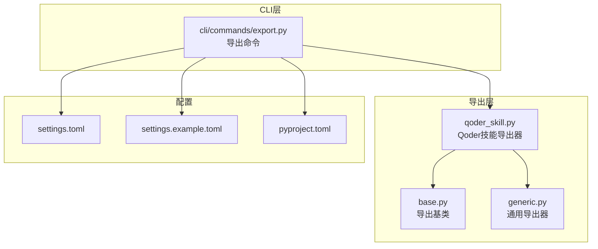
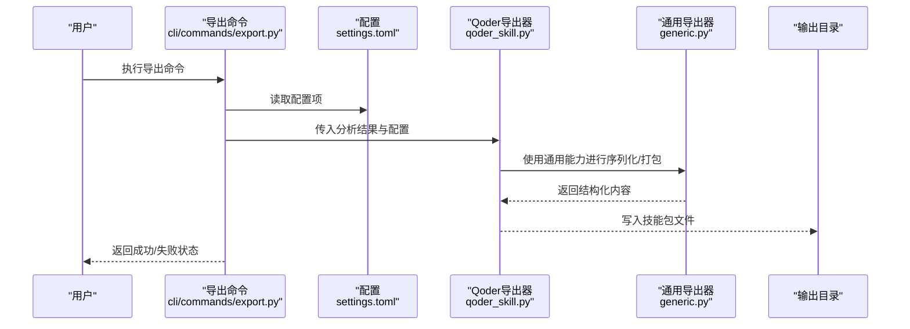
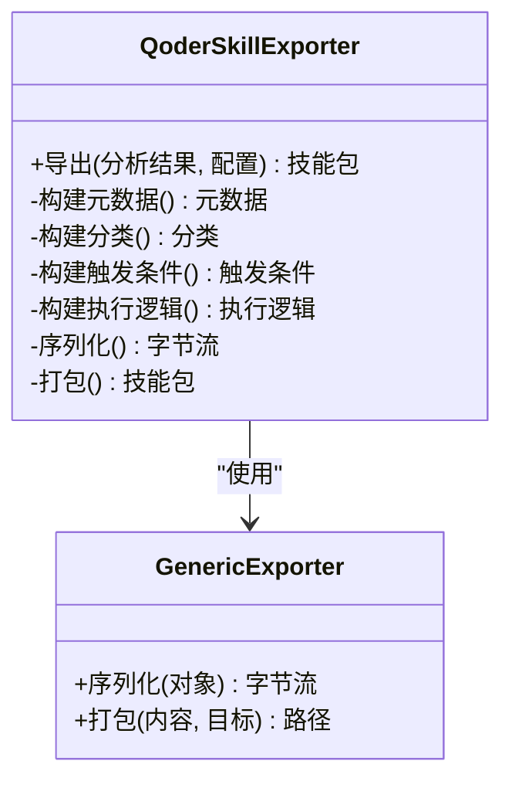
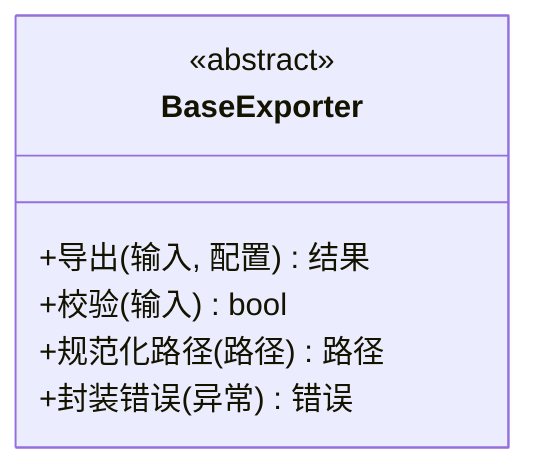
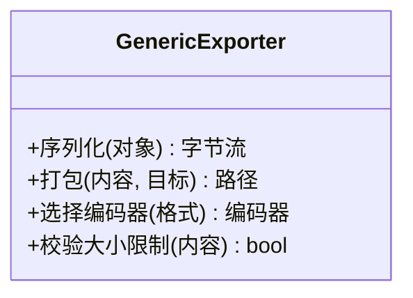
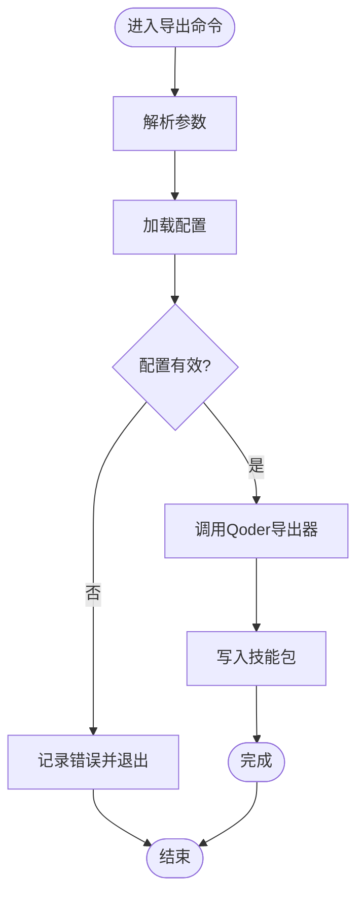
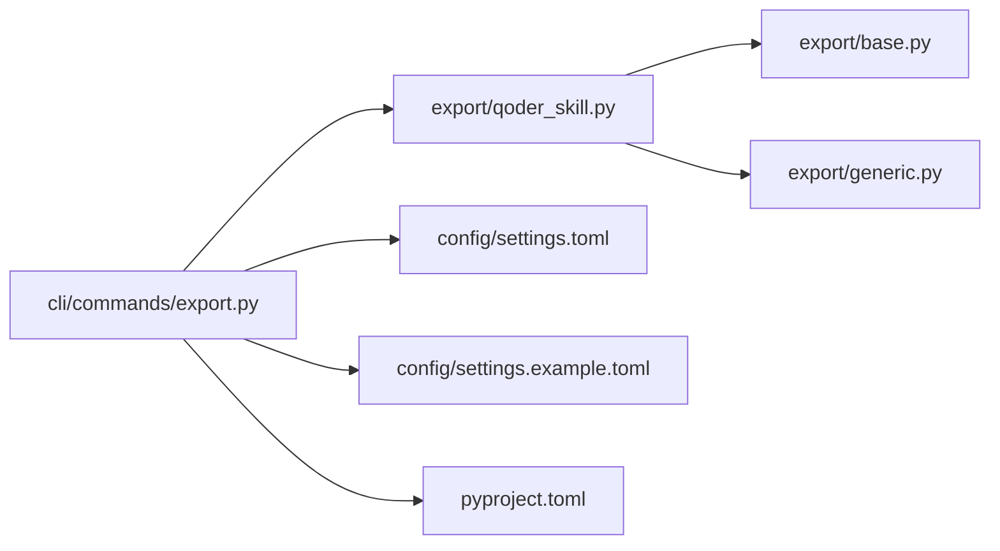

# Qoder技能导出

<cite>
**本文引用的文件**   
- [src/jirin/export/qoder_skill.py](file://src/jirin/export/qoder_skill.py)
- [src/jirin/export/base.py](file://src/jirin/export/base.py)
- [src/jirin/export/generic.py](file://src/jirin/export/generic.py)
- [src/jirin/cli/commands/export.py](file://src/jirin/cli/commands/export.py)
- [config/settings.toml](file://config/settings.toml)
- [config/settings.example.toml](file://config/settings.example.toml)
- [pyproject.toml](file://pyproject.toml)
</cite>

## 目录
1. [简介](#简介)
2. [项目结构](#项目结构)
3. [核心组件](#核心组件)
4. [架构总览](#架构总览)
5. [详细组件分析](#详细组件分析)
6. [依赖关系分析](#依赖关系分析)
7. [性能考虑](#性能考虑)
8. [故障排查指南](#故障排查指南)
9. [结论](#结论)
10. [附录](#附录)

## 简介
本文件面向Jirin的Qoder技能导出能力，系统性说明：
- Qoder技能文件格式规范、元数据定义与技能描述结构
- 如何将分析代理的输出转换为Qoder平台可识别的技能包（含分类、触发条件与执行逻辑）
- 完整的技能包生成示例、配置文件说明与版本管理策略
- 与Qoder平台的集成方式、发布流程与兼容性检查
- 技能包的测试方法、调试工具与最佳实践

## 项目结构
与Qoder技能导出相关的代码主要位于以下模块：
- 导出抽象与通用实现：export/base.py、export/generic.py
- Qoder特定导出器：export/qoder_skill.py
- CLI命令入口：cli/commands/export.py
- 配置项：config/settings.toml、config/settings.example.toml
- 工程元信息：pyproject.toml

图表来源
- [src/jirin/export/base.py](file://src/jirin/export/base.py)
- [src/jirin/export/generic.py](file://src/jirin/export/generic.py)
- [src/jirin/export/qoder_skill.py](file://src/jirin/export/qoder_skill.py)
- [src/jirin/cli/commands/export.py](file://src/jirin/cli/commands/export.py)
- [config/settings.toml](file://config/settings.toml)
- [config/settings.example.toml](file://config/settings.example.toml)
- [pyproject.toml](file://pyproject.toml)

章节来源
- [src/jirin/export/qoder_skill.py](file://src/jirin/export/qoder_skill.py)
- [src/jirin/export/base.py](file://src/jirin/export/base.py)
- [src/jirin/export/generic.py](file://src/jirin/export/generic.py)
- [src/jirin/cli/commands/export.py](file://src/jirin/cli/commands/export.py)
- [config/settings.toml](file://config/settings.toml)
- [config/settings.example.toml](file://config/settings.example.toml)
- [pyproject.toml](file://pyproject.toml)

## 核心组件
- 导出基类（base.py）：定义导出器的统一接口与公共能力，如输入校验、输出路径处理、错误封装等。
- 通用导出器（generic.py）：提供跨格式通用的序列化与打包逻辑，便于扩展新格式。
- Qoder技能导出器（qoder_skill.py）：将分析结果映射为Qoder平台可识别的技能包结构，包括元数据、分类、触发条件与执行逻辑。
- CLI导出命令（cli/commands/export.py）：暴露命令行接口，读取配置、调用导出器并生成技能包。

章节来源
- [src/jirin/export/base.py](file://src/jirin/export/base.py)
- [src/jirin/export/generic.py](file://src/jirin/export/generic.py)
- [src/jirin/export/qoder_skill.py](file://src/jirin/export/qoder_skill.py)
- [src/jirin/cli/commands/export.py](file://src/jirin/cli/commands/export.py)

## 架构总览
整体导出流程从CLI命令开始，加载配置后调用Qoder技能导出器，后者基于通用导出能力完成结构化数据的组装与打包，最终输出到目标目录。

图表来源
- [src/jirin/cli/commands/export.py](file://src/jirin/cli/commands/export.py)
- [config/settings.toml](file://config/settings.toml)
- [src/jirin/export/qoder_skill.py](file://src/jirin/export/qoder_skill.py)
- [src/jirin/export/generic.py](file://src/jirin/export/generic.py)

## 详细组件分析

### Qoder技能导出器（qoder_skill.py）
职责与要点：
- 将分析代理的输出转换为Qoder平台可识别的技能包结构
- 负责元数据定义（名称、版本、作者、描述等）、技能分类、触发条件与执行逻辑的映射
- 与通用导出器协作完成序列化与打包

关键设计点：
- 元数据字段：建议包含标识、版本、摘要、作者、许可证、兼容范围等
- 技能分类：支持按问题域或场景划分，便于检索与管理
- 触发条件：支持基于日志关键字、异常类型、系统事件等多维匹配
- 执行逻辑：以声明式方式描述步骤、参数与环境要求，确保在Qoder平台可解析与运行

图表来源
- [src/jirin/export/qoder_skill.py](file://src/jirin/export/qoder_skill.py)
- [src/jirin/export/generic.py](file://src/jirin/export/generic.py)

章节来源
- [src/jirin/export/qoder_skill.py](file://src/jirin/export/qoder_skill.py)

### 导出基类（base.py）
职责与要点：
- 定义导出器统一接口，约束子类必须实现的导出方法
- 提供输入校验、输出路径规范化、错误封装等公共能力
- 保证不同导出器行为一致，降低上层调用复杂度

图表来源
- [src/jirin/export/base.py](file://src/jirin/export/base.py)

章节来源
- [src/jirin/export/base.py](file://src/jirin/export/base.py)

### 通用导出器（generic.py）
职责与要点：
- 提供跨格式的序列化与打包能力
- 支持多种编码与压缩策略，便于扩展新的导出格式
- 作为Qoder导出器的底层支撑，屏蔽具体实现细节

图表来源
- [src/jirin/export/generic.py](file://src/jirin/export/generic.py)

章节来源
- [src/jirin/export/generic.py](file://src/jirin/export/generic.py)

### CLI导出命令（cli/commands/export.py）
职责与要点：
- 解析命令行参数，加载配置
- 调用Qoder技能导出器完成导出
- 输出进度与结果，处理异常与退出码

图表来源
- [src/jirin/cli/commands/export.py](file://src/jirin/cli/commands/export.py)
- [config/settings.toml](file://config/settings.toml)

章节来源
- [src/jirin/cli/commands/export.py](file://src/jirin/cli/commands/export.py)

## 依赖关系分析
- 导出层内部依赖：Qoder导出器依赖通用导出器与导出基类；CLI命令依赖Qoder导出器与配置模块
- 外部依赖：配置来源于settings.toml与settings.example.toml；工程元信息来自pyproject.toml

图表来源
- [src/jirin/cli/commands/export.py](file://src/jirin/cli/commands/export.py)
- [src/jirin/export/qoder_skill.py](file://src/jirin/export/qoder_skill.py)
- [src/jirin/export/base.py](file://src/jirin/export/base.py)
- [src/jirin/export/generic.py](file://src/jirin/export/generic.py)
- [config/settings.toml](file://config/settings.toml)
- [config/settings.example.toml](file://config/settings.example.toml)
- [pyproject.toml](file://pyproject.toml)

章节来源
- [src/jirin/cli/commands/export.py](file://src/jirin/cli/commands/export.py)
- [src/jirin/export/qoder_skill.py](file://src/jirin/export/qoder_skill.py)
- [src/jirin/export/base.py](file://src/jirin/export/base.py)
- [src/jirin/export/generic.py](file://src/jirin/export/generic.py)
- [config/settings.toml](file://config/settings.toml)
- [config/settings.example.toml](file://config/settings.example.toml)
- [pyproject.toml](file://pyproject.toml)

## 性能考虑
- 序列化与打包阶段应尽量避免重复计算，缓存中间结果
- 大体积内容需启用分块或压缩策略，控制内存占用
- 批量导出时采用并发控制，避免I/O瓶颈
- 对触发条件与分类索引建立轻量级缓存，提升后续查询效率

[本节为通用指导，不直接分析具体文件]

## 故障排查指南
常见问题与建议：
- 配置缺失或无效：检查settings.toml是否包含必要键值，参考settings.example.toml模板
- 导出失败：查看CLI输出的错误信息，定位是输入校验失败还是序列化异常
- 兼容性问题：确认Qoder平台版本与技能包元数据中的兼容范围一致
- 权限与路径：确认输出目录存在且具备写入权限

章节来源
- [config/settings.toml](file://config/settings.toml)
- [config/settings.example.toml](file://config/settings.example.toml)
- [src/jirin/cli/commands/export.py](file://src/jirin/cli/commands/export.py)

## 结论
通过统一的导出基类与通用导出器，结合Qoder特定的导出器实现，Jirin能够稳定地将分析代理的输出转换为Qoder平台可识别的技能包。配合清晰的CLI命令与配置管理，可实现高效的技能包生成、发布与版本管理。

[本节为总结性内容，不直接分析具体文件]

## 附录

### Qoder技能包结构与元数据定义
- 元数据字段建议：
  - 标识：唯一ID
  - 版本：语义化版本号
  - 名称与摘要：人类可读的描述
  - 作者与许可证：归属与授权信息
  - 兼容范围：支持的Qoder平台版本区间
- 技能描述结构建议：
  - 分类：领域或场景标签
  - 触发条件：日志关键字、异常类型、系统事件等
  - 执行逻辑：步骤序列、参数与环境要求

章节来源
- [src/jirin/export/qoder_skill.py](file://src/jirin/export/qoder_skill.py)

### 将分析代理输出转换为技能包
- 输入：分析代理的结构化结果（如日志片段、堆栈、上下文）
- 映射：
  - 分类：根据问题域或场景规则归类
  - 触发条件：提取关键字与模式，形成匹配规则
  - 执行逻辑：将分析步骤转化为可执行的步骤清单
- 输出：Qoder平台可识别的技能包文件

章节来源
- [src/jirin/export/qoder_skill.py](file://src/jirin/export/qoder_skill.py)

### 完整技能包生成示例（步骤说明）
- 准备配置：在settings.toml中填写必要的导出选项
- 运行命令：通过CLI导出命令指定输入与输出路径
- 验证产物：检查生成的技能包结构与元数据完整性
- 发布与部署：上传至Qoder平台并进行兼容性检查

章节来源
- [src/jirin/cli/commands/export.py](file://src/jirin/cli/commands/export.py)
- [config/settings.toml](file://config/settings.toml)

### 配置文件说明
- settings.toml：运行时配置，包含导出路径、编码策略、压缩选项等
- settings.example.toml：配置模板，提供默认键值与注释说明
- pyproject.toml：工程元信息与依赖声明，用于版本管理与环境搭建

章节来源
- [config/settings.toml](file://config/settings.toml)
- [config/settings.example.toml](file://config/settings.example.toml)
- [pyproject.toml](file://pyproject.toml)

### 版本管理策略
- 使用语义化版本号（主.次.修订），在元数据中明确标注
- 变更日志：记录破坏性变更与新特性
- 兼容性矩阵：维护与Qoder平台版本的对应关系
- 发布流水线：自动化构建、签名与校验

章节来源
- [src/jirin/export/qoder_skill.py](file://src/jirin/export/qoder_skill.py)
- [pyproject.toml](file://pyproject.toml)

### 与Qoder平台的集成方式、发布流程与兼容性检查
- 集成方式：通过CLI导出命令生成标准格式的技能包，供平台消费
- 发布流程：构建→校验→签名→上传→注册
- 兼容性检查：对比元数据中的兼容范围与平台版本，必要时回退或提示升级

章节来源
- [src/jirin/cli/commands/export.py](file://src/jirin/cli/commands/export.py)
- [src/jirin/export/qoder_skill.py](file://src/jirin/export/qoder_skill.py)

### 测试方法与调试工具
- 单元测试：覆盖导出器关键路径与边界条件
- 集成测试：端到端验证从CLI到平台发布的完整链路
- 调试工具：启用详细日志、输出中间结构、断言元数据一致性
- 回归用例：针对历史问题构造最小复现集

章节来源
- [src/jirin/export/base.py](file://src/jirin/export/base.py)
- [src/jirin/export/generic.py](file://src/jirin/export/generic.py)
- [src/jirin/export/qoder_skill.py](file://src/jirin/export/qoder_skill.py)
- [src/jirin/cli/commands/export.py](file://src/jirin/cli/commands/export.py)

### 最佳实践指南
- 保持元数据完整与准确，避免歧义
- 触发条件尽量精确，减少误匹配
- 执行逻辑幂等且可重试，增强鲁棒性
- 文档与示例配套，提升可维护性与可复用性

[本节为通用指导，不直接分析具体文件]