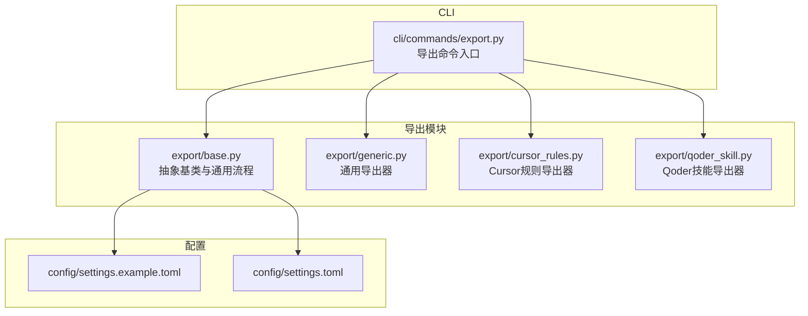
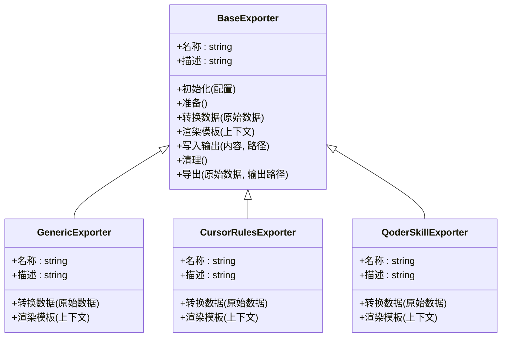
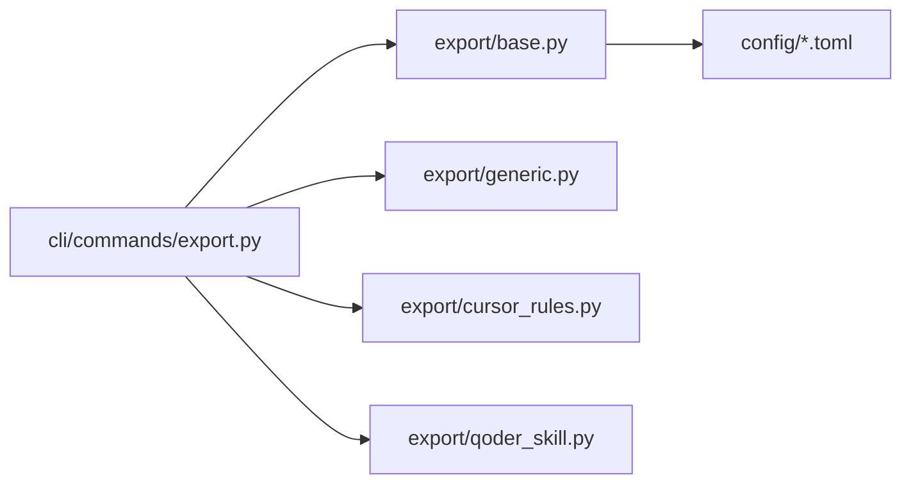
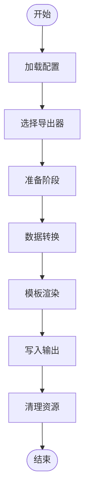

# 导出框架基础

<cite>
**本文引用的文件**   
- [src/jirin/export/base.py](file://src/jirin/export/base.py)
- [src/jirin/export/generic.py](file://src/jirin/export/generic.py)
- [src/jirin/export/cursor_rules.py](file://src/jirin/export/cursor_rules.py)
- [src/jirin/export/qoder_skill.py](file://src/jirin/export/qoder_skill.py)
- [src/jirin/cli/commands/export.py](file://src/jirin/cli/commands/export.py)
- [config/settings.example.toml](file://config/settings.example.toml)
- [config/settings.toml](file://config/settings.toml)
</cite>

## 目录
1. [简介](#简介)
2. [项目结构](#项目结构)
3. [核心组件](#核心组件)
4. [架构总览](#架构总览)
5. [详细组件分析](#详细组件分析)
6. [依赖关系分析](#依赖关系分析)
7. [性能考虑](#性能考虑)
8. [故障排查指南](#故障排查指南)
9. [结论](#结论)
10. [附录](#附录)

## 简介
本文件面向Jirin导出框架的基础架构，聚焦于BaseExporter抽象类的设计模式、导出流程控制、模板引擎集成与错误处理机制；同时说明导出器的注册机制、生命周期管理、配置选项、接口规范、数据转换管道与扩展点设计。文档还提供自定义导出器开发的最佳实践、测试方法与性能优化建议，并记录与核心分析系统的集成方式及数据模型映射关系。

## 项目结构
导出相关代码位于src/jirin/export目录，CLI入口在src/jirin/cli/commands/export.py，配置项位于config目录。整体采用分层组织：导出抽象基类定义统一接口与通用流程，具体导出器实现不同目标格式或用途的导出逻辑，CLI负责参数解析与调度。

图表来源
- [src/jirin/export/base.py](file://src/jirin/export/base.py)
- [src/jirin/export/generic.py](file://src/jirin/export/generic.py)
- [src/jirin/export/cursor_rules.py](file://src/jirin/export/cursor_rules.py)
- [src/jirin/export/qoder_skill.py](file://src/jirin/export/qoder_skill.py)
- [src/jirin/cli/commands/export.py](file://src/jirin/cli/commands/export.py)
- [config/settings.example.toml](file://config/settings.example.toml)
- [config/settings.toml](file://config/settings.toml)

章节来源
- [src/jirin/export/base.py](file://src/jirin/export/base.py)
- [src/jirin/export/generic.py](file://src/jirin/export/generic.py)
- [src/jirin/export/cursor_rules.py](file://src/jirin/export/cursor_rules.py)
- [src/jirin/export/qoder_skill.py](file://src/jirin/export/qoder_skill.py)
- [src/jirin/cli/commands/export.py](file://src/jirin/cli/commands/export.py)
- [config/settings.example.toml](file://config/settings.example.toml)
- [config/settings.toml](file://config/settings.toml)

## 核心组件
- BaseExporter抽象类：定义导出器统一接口、生命周期钩子、模板渲染、数据转换管道与错误处理策略。
- 具体导出器：generic、cursor_rules、qoder_skill等，分别实现不同输出目标（如通用文本、Cursor规则、Qoder技能）。
- CLI导出命令：解析用户输入、加载配置、选择导出器、执行导出流程。
- 配置系统：通过TOML提供默认与本地覆盖的配置项，驱动导出行为。

章节来源
- [src/jirin/export/base.py](file://src/jirin/export/base.py)
- [src/jirin/export/generic.py](file://src/jirin/export/generic.py)
- [src/jirin/export/cursor_rules.py](file://src/jirin/export/cursor_rules.py)
- [src/jirin/export/qoder_skill.py](file://src/jirin/export/qoder_skill.py)
- [src/jirin/cli/commands/export.py](file://src/jirin/cli/commands/export.py)
- [config/settings.example.toml](file://config/settings.example.toml)
- [config/settings.toml](file://config/settings.toml)

## 架构总览
导出框架采用“抽象基类 + 多实现”的策略模式，配合工厂式注册与CLI调度，形成可扩展的导出流水线。

图表来源
- [src/jirin/export/base.py](file://src/jirin/export/base.py)
- [src/jirin/export/generic.py](file://src/jirin/export/generic.py)
- [src/jirin/export/cursor_rules.py](file://src/jirin/export/cursor_rules.py)
- [src/jirin/export/qoder_skill.py](file://src/jirin/export/qoder_skill.py)

## 详细组件分析

### BaseExporter抽象类
- 设计模式
  - 模板方法：定义导出主流程骨架，将可变步骤（数据转换、模板渲染、输出写入）下沉到子类实现。
  - 策略模式：通过配置或注册表选择具体导出策略。
  - 责任链：预处理、转换、渲染、后处理可串联多个处理器。
- 导出流程控制
  - 生命周期钩子：初始化、准备、转换、渲染、写入、清理。
  - 中间件式钩子：可在关键阶段插入日志、指标、重试、限流等横切逻辑。
- 模板引擎集成
  - 抽象渲染接口，支持多种模板后端（字符串模板、Markdown、结构化JSON/YAML等）。
  - 上下文构建：由数据转换阶段产出，供模板使用。
- 错误处理机制
  - 标准化异常类型与错误码，统一捕获与上报。
  - 失败回滚与部分成功策略：对批量导出提供事务性语义。
- 配置选项
  - 模板路径、输出目录、编码、压缩、并发度、重试次数等。
- 扩展点
  - 自定义转换器、渲染器、输出目标、校验器均可通过插件机制接入。

章节来源
- [src/jirin/export/base.py](file://src/jirin/export/base.py)

### 通用导出器 GenericExporter
- 职责：提供通用的文本/结构化导出能力，适配常见场景。
- 数据转换：将分析结果转换为通用数据结构。
- 模板渲染：基于上下文生成最终内容。
- 适用场景：报告、清单、摘要等。

章节来源
- [src/jirin/export/generic.py](file://src/jirin/export/generic.py)

### Cursor规则导出器 CursorRulesExporter
- 职责：将分析结果导出为Cursor规则格式，便于IDE集成。
- 数据转换：将内部模型映射为Cursor规则所需字段。
- 模板渲染：按规则语法生成文件。

章节来源
- [src/jirin/export/cursor_rules.py](file://src/jirin/export/cursor_rules.py)

### Qoder技能导出器 QoderSkillExporter
- 职责：将分析结果导出为Qoder技能包，用于自动化任务编排。
- 数据转换：构造技能元数据与动作序列。
- 模板渲染：生成技能描述与脚本片段。

章节来源
- [src/jirin/export/qoder_skill.py](file://src/jirin/export/qoder_skill.py)

### CLI导出命令
- 功能：解析命令行参数、加载配置、选择导出器、调用导出流程。
- 交互：支持指定导出器名称、输入源、输出路径、模板变量等。
- 错误反馈：统一错误消息与退出码。

章节来源
- [src/jirin/cli/commands/export.py](file://src/jirin/cli/commands/export.py)

### 配置系统
- 默认配置：settings.example.toml提供示例键值。
- 本地覆盖：settings.toml用于覆盖默认值。
- 典型键：导出器选择、模板路径、输出目录、并发度、重试策略、日志级别等。

章节来源
- [config/settings.example.toml](file://config/settings.example.toml)
- [config/settings.toml](file://config/settings.toml)

## 依赖关系分析
导出模块之间的依赖清晰，CLI作为入口聚合各导出器，配置驱动行为。

图表来源
- [src/jirin/cli/commands/export.py](file://src/jirin/cli/commands/export.py)
- [src/jirin/export/base.py](file://src/jirin/export/base.py)
- [src/jirin/export/generic.py](file://src/jirin/export/generic.py)
- [src/jirin/export/cursor_rules.py](file://src/jirin/export/cursor_rules.py)
- [src/jirin/export/qoder_skill.py](file://src/jirin/export/qoder_skill.py)
- [config/settings.example.toml](file://config/settings.example.toml)
- [config/settings.toml](file://config/settings.toml)

章节来源
- [src/jirin/cli/commands/export.py](file://src/jirin/cli/commands/export.py)
- [src/jirin/export/base.py](file://src/jirin/export/base.py)
- [src/jirin/export/generic.py](file://src/jirin/export/generic.py)
- [src/jirin/export/cursor_rules.py](file://src/jirin/export/cursor_rules.py)
- [src/jirin/export/qoder_skill.py](file://src/jirin/export/qoder_skill.py)
- [config/settings.example.toml](file://config/settings.example.toml)
- [config/settings.toml](file://config/settings.toml)

## 性能考虑
- 批处理与分页：对大数据集采用分块处理，降低内存峰值。
- 并发与限流：合理设置并发度，避免I/O争用与下游服务过载。
- 模板缓存：复用已编译模板，减少重复开销。
- 增量导出：仅变更部分重渲染，提升迭代效率。
- I/O优化：合并小文件、启用压缩、异步写入。

[本节为通用指导，不直接分析具体文件]

## 故障排查指南
- 常见问题
  - 模板缺失或路径错误：检查配置中的模板目录与文件名。
  - 输出权限不足：确认输出目录存在且可写。
  - 数据转换失败：核对输入数据结构与转换逻辑契约。
  - 并发导致竞争：降低并发度或增加同步保护。
- 诊断手段
  - 开启详细日志，定位失败阶段。
  - 使用最小复现用例验证问题。
  - 逐步禁用中间件钩子以隔离副作用。

章节来源
- [src/jirin/export/base.py](file://src/jirin/export/base.py)
- [src/jirin/cli/commands/export.py](file://src/jirin/cli/commands/export.py)

## 结论
导出框架通过BaseExporter抽象出统一的导出流程与扩展点，结合具体导出器实现多样化输出目标。CLI与配置系统使框架易于集成与运维。遵循本文最佳实践与性能建议，可快速构建稳定高效的自定义导出器。

[本节为总结性内容，不直接分析具体文件]

## 附录

### 导出器接口规范
- 必需方法
  - 初始化：接收配置对象。
  - 准备：资源预分配与校验。
  - 转换数据：将原始数据转为中间表示。
  - 渲染模板：基于上下文生成内容。
  - 写入输出：持久化到目标位置。
  - 清理：释放资源。
- 可选钩子
  - 预处理/后处理：用于日志、指标、重试等横切逻辑。
- 错误约定
  - 抛出标准化异常，携带错误码与上下文信息。

章节来源
- [src/jirin/export/base.py](file://src/jirin/export/base.py)

### 数据转换管道与扩展点
- 管道阶段
  - 输入校验 → 规范化 → 领域建模 → 视图模型 → 模板上下文。
- 扩展点
  - 自定义转换器：实现标准接口并注册。
  - 自定义渲染器：替换模板后端。
  - 自定义输出目标：支持文件系统、对象存储、消息队列等。

章节来源
- [src/jirin/export/base.py](file://src/jirin/export/base.py)

### 自定义导出器开发最佳实践
- 继承BaseExporter，仅实现必要差异点。
- 保持幂等与可重试，避免副作用。
- 明确输入输出契约，编写单元测试与集成测试。
- 使用配置驱动行为，避免硬编码。
- 提供清晰的错误信息与恢复策略。

章节来源
- [src/jirin/export/generic.py](file://src/jirin/export/generic.py)
- [src/jirin/export/cursor_rules.py](file://src/jirin/export/cursor_rules.py)
- [src/jirin/export/qoder_skill.py](file://src/jirin/export/qoder_skill.py)

### 完整实现示例（路径指引）
- 参考现有导出器实现，对照接口规范完成自定义导出器。
- 示例路径
  - [src/jirin/export/generic.py](file://src/jirin/export/generic.py)
  - [src/jirin/export/cursor_rules.py](file://src/jirin/export/cursor_rules.py)
  - [src/jirin/export/qoder_skill.py](file://src/jirin/export/qoder_skill.py)

章节来源
- [src/jirin/export/generic.py](file://src/jirin/export/generic.py)
- [src/jirin/export/cursor_rules.py](file://src/jirin/export/cursor_rules.py)
- [src/jirin/export/qoder_skill.py](file://src/jirin/export/qoder_skill.py)

### 测试方法
- 单元测试：针对转换与渲染逻辑进行断言。
- 集成测试：端到端验证CLI命令与输出产物。
- 回归测试：使用固定fixtures确保稳定性。

章节来源
- [src/jirin/cli/commands/export.py](file://src/jirin/cli/commands/export.py)
- [src/jirin/export/base.py](file://src/jirin/export/base.py)

### 与核心分析系统的集成与数据模型映射
- 集成方式
  - 从分析结果源读取数据，经转换管道适配导出器需求。
  - 通过配置选择导出器与模板。
- 数据模型映射
  - 分析结果 → 中间表示 → 视图模型 → 模板上下文。
  - 不同导出器对同一模型的投影不同，需明确字段映射。

章节来源
- [src/jirin/export/base.py](file://src/jirin/export/base.py)
- [src/jirin/export/generic.py](file://src/jirin/export/generic.py)
- [src/jirin/export/cursor_rules.py](file://src/jirin/export/cursor_rules.py)
- [src/jirin/export/qoder_skill.py](file://src/jirin/export/qoder_skill.py)

### 导出流程图（概念）

[此图为概念流程，不直接对应具体源码文件]