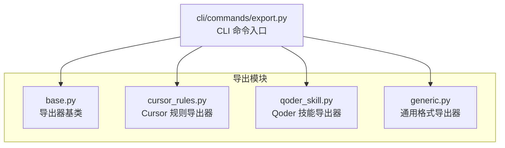
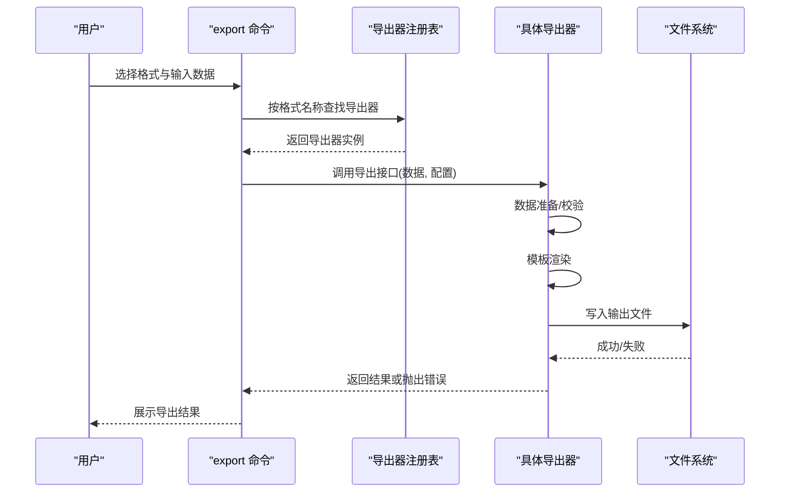
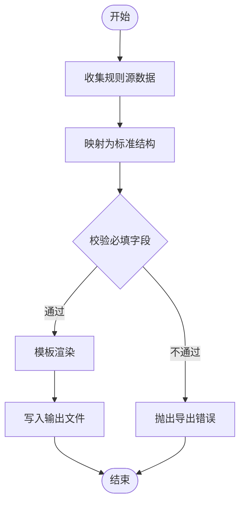
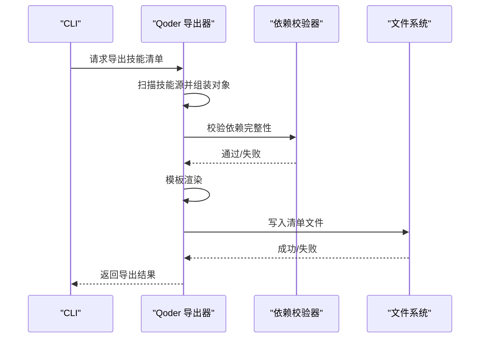
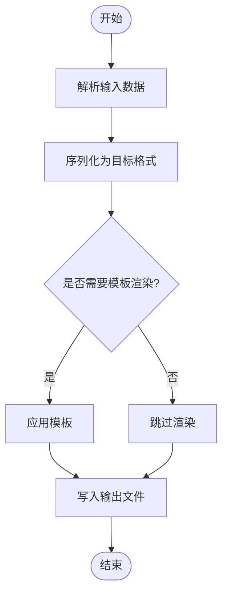
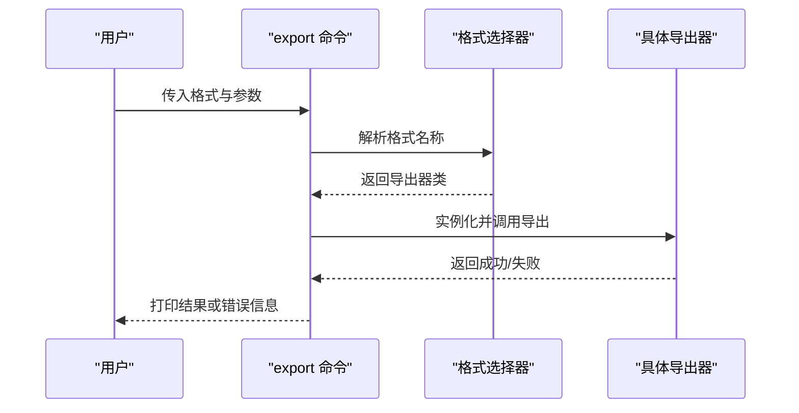
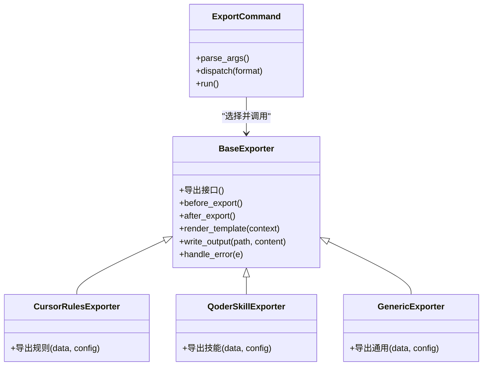

# 导出系统

<cite>
**本文引用的文件**   
- [src/jirin/export/base.py](file://src/jirin/export/base.py)
- [src/jirin/export/cursor_rules.py](file://src/jirin/export/cursor_rules.py)
- [src/jirin/export/qoder_skill.py](file://src/jirin/export/qoder_skill.py)
- [src/jirin/export/generic.py](file://src/jirin/export/generic.py)
- [src/jirin/cli/commands/export.py](file://src/jirin/cli/commands/export.py)
</cite>

## 目录
1. [简介](#简介)
2. [项目结构](#项目结构)
3. [核心组件](#核心组件)
4. [架构总览](#架构总览)
5. [详细组件分析](#详细组件分析)
6. [依赖关系分析](#依赖关系分析)
7. [性能考虑](#性能考虑)
8. [故障排查指南](#故障排查指南)
9. [结论](#结论)
10. [附录](#附录)

## 简介
本文件为 Jirin 的导出系统提供全面文档，涵盖导出框架的架构设计、基础导出类实现、多种导出格式的具体实现（Cursor 规则导出、Qoder 技能导出、通用格式导出），并给出自定义导出器的开发指南与注册方法。文档同时包含错误处理策略、版本兼容性建议以及性能优化要点，帮助开发者快速理解与扩展导出能力。

## 项目结构
导出系统位于 src/jirin/export 目录下，采用“基础抽象 + 多格式实现”的分层组织方式：
- base.py：定义导出器基类与统一接口
- cursor_rules.py：Cursor 规则导出器
- qoder_skill.py：Qoder 技能导出器
- generic.py：通用格式导出器
- cli/commands/export.py：CLI 命令入口，负责参数解析与调度

图表来源
- [src/jirin/export/base.py](file://src/jirin/export/base.py)
- [src/jirin/export/cursor_rules.py](file://src/jirin/export/cursor_rules.py)
- [src/jirin/export/qoder_skill.py](file://src/jirin/export/qoder_skill.py)
- [src/jirin/export/generic.py](file://src/jirin/export/generic.py)
- [src/jirin/cli/commands/export.py](file://src/jirin/cli/commands/export.py)

章节来源
- [src/jirin/export/base.py](file://src/jirin/export/base.py)
- [src/jirin/export/cursor_rules.py](file://src/jirin/export/cursor_rules.py)
- [src/jirin/export/qoder_skill.py](file://src/jirin/export/qoder_skill.py)
- [src/jirin/export/generic.py](file://src/jirin/export/generic.py)
- [src/jirin/cli/commands/export.py](file://src/jirin/cli/commands/export.py)

## 核心组件
- 导出器基类
  - 职责：定义统一的导出接口、生命周期钩子、模板渲染与输出路径管理、错误封装与日志记录。
  - 关键能力：
    - 统一导出入口：接收上下文数据，调用具体格式的序列化逻辑
    - 模板支持：基于模板引擎渲染结构化内容
    - 输出控制：支持文件写入、流式输出、压缩归档等
    - 错误处理：将底层异常转换为一致的导出错误类型
    - 版本兼容：在元数据中携带导出器版本，便于下游消费方校验
- 各格式导出器
  - Cursor 规则导出器：面向 Cursor 生态的规则描述导出
  - Qoder 技能导出器：面向 Qoder 生态的技能清单与依赖导出
  - 通用格式导出器：面向 JSON/YAML/TOML 等通用结构的导出

章节来源
- [src/jirin/export/base.py](file://src/jirin/export/base.py)
- [src/jirin/export/cursor_rules.py](file://src/jirin/export/cursor_rules.py)
- [src/jirin/export/qoder_skill.py](file://src/jirin/export/qoder_skill.py)
- [src/jirin/export/generic.py](file://src/jirin/export/generic.py)

## 架构总览
导出系统遵循“命令驱动 + 插件化导出器”的架构。CLI 根据用户选择的格式动态加载对应导出器，执行数据准备、模板渲染与落盘流程。

图表来源
- [src/jirin/cli/commands/export.py](file://src/jirin/cli/commands/export.py)
- [src/jirin/export/base.py](file://src/jirin/export/base.py)
- [src/jirin/export/cursor_rules.py](file://src/jirin/export/cursor_rules.py)
- [src/jirin/export/qoder_skill.py](file://src/jirin/export/qoder_skill.py)
- [src/jirin/export/generic.py](file://src/jirin/export/generic.py)

## 详细组件分析

### 导出器基类（Base）
- 设计要点
  - 抽象接口：定义导出主入口与可选的生命周期钩子（如 before_export、after_export）
  - 模板渲染：提供模板上下文构建与渲染方法，屏蔽不同模板引擎差异
  - 输出策略：统一处理文件路径生成、编码、覆盖策略与压缩打包
  - 错误模型：定义导出错误类型与消息规范，便于上层统一捕获
  - 版本信息：在导出的元数据中注入导出器版本与时间戳，用于兼容性检查
- 使用建议
  - 继承基类后仅需实现特定格式的序列化逻辑
  - 通过重写钩子函数完成前置校验与后置清理
  - 利用统一的错误模型提升可观测性与调试效率

章节来源
- [src/jirin/export/base.py](file://src/jirin/export/base.py)

### Cursor 规则导出器
- 适用场景
  - 向 Cursor 生态导出规则集，供其规则引擎消费
- 规范与模板结构
  - 字段约定：规则标识、触发条件、动作描述、优先级、适用范围等
  - 模板结构：以列表形式组织多条规则，每条规则包含必要元数据与行为定义
  - 版本兼容：在根节点包含导出器版本与规则集版本，便于升级迁移
- 典型流程
  - 收集规则源数据 → 映射到标准结构 → 模板渲染 → 输出文件

图表来源
- [src/jirin/export/cursor_rules.py](file://src/jirin/export/cursor_rules.py)
- [src/jirin/export/base.py](file://src/jirin/export/base.py)

章节来源
- [src/jirin/export/cursor_rules.py](file://src/jirin/export/cursor_rules.py)
- [src/jirin/export/base.py](file://src/jirin/export/base.py)

### Qoder 技能导出器
- 适用场景
  - 向 Qoder 生态导出技能清单与依赖，供平台或工具链消费
- 规范与模板结构
  - 字段约定：技能标识、名称、描述、版本、依赖项、入口点、权限范围等
  - 模板结构：以清单形式组织多个技能条目，附带全局元数据与版本信息
  - 版本兼容：支持向后兼容的字段弃用标记与默认值回退
- 典型流程
  - 扫描技能源 → 组装技能对象 → 校验依赖完整性 → 模板渲染 → 输出文件

图表来源
- [src/jirin/export/qoder_skill.py](file://src/jirin/export/qoder_skill.py)
- [src/jirin/export/base.py](file://src/jirin/export/base.py)

章节来源
- [src/jirin/export/qoder_skill.py](file://src/jirin/export/qoder_skill.py)
- [src/jirin/export/base.py](file://src/jirin/export/base.py)

### 通用格式导出器
- 适用场景
  - 需要以 JSON/YAML/TOML 等通用结构导出数据，便于跨语言或跨工具消费
- 规范与模板结构
  - 字段约定：顶层包含元数据与数据主体，支持分页与过滤
  - 模板结构：键值对或数组结构，保持可读性与机器友好性
  - 版本兼容：在元数据中包含 schema 版本，便于下游解析器做适配
- 典型流程
  - 接收任意数据结构 → 序列化为目标格式 → 模板渲染（可选）→ 输出文件

图表来源
- [src/jirin/export/generic.py](file://src/jirin/export/generic.py)
- [src/jirin/export/base.py](file://src/jirin/export/base.py)

章节来源
- [src/jirin/export/generic.py](file://src/jirin/export/generic.py)
- [src/jirin/export/base.py](file://src/jirin/export/base.py)

### CLI 命令入口（export）
- 职责
  - 解析命令行参数（格式、输入路径、输出路径、选项）
  - 根据格式选择并实例化对应导出器
  - 调用导出器执行导出，处理错误与结果反馈
- 交互流程
  - 用户输入 → 参数校验 → 选择导出器 → 执行导出 → 输出结果

图表来源
- [src/jirin/cli/commands/export.py](file://src/jirin/cli/commands/export.py)
- [src/jirin/export/base.py](file://src/jirin/export/base.py)

章节来源
- [src/jirin/cli/commands/export.py](file://src/jirin/cli/commands/export.py)
- [src/jirin/export/base.py](file://src/jirin/export/base.py)

## 依赖关系分析
导出器之间通过基类解耦，CLI 通过注册表或命名约定进行动态选择，避免硬耦合。

图表来源
- [src/jirin/export/base.py](file://src/jirin/export/base.py)
- [src/jirin/export/cursor_rules.py](file://src/jirin/export/cursor_rules.py)
- [src/jirin/export/qoder_skill.py](file://src/jirin/export/qoder_skill.py)
- [src/jirin/export/generic.py](file://src/jirin/export/generic.py)
- [src/jirin/cli/commands/export.py](file://src/jirin/cli/commands/export.py)

章节来源
- [src/jirin/export/base.py](file://src/jirin/export/base.py)
- [src/jirin/export/cursor_rules.py](file://src/jirin/export/cursor_rules.py)
- [src/jirin/export/qoder_skill.py](file://src/jirin/export/qoder_skill.py)
- [src/jirin/export/generic.py](file://src/jirin/export/generic.py)
- [src/jirin/cli/commands/export.py](file://src/jirin/cli/commands/export.py)

## 性能考虑
- 批量导出
  - 对大量数据进行分块处理，避免一次性加载导致内存峰值过高
- 模板渲染
  - 预编译常用模板，减少重复解析开销
- I/O 优化
  - 使用缓冲写入与异步落盘（若环境支持），降低磁盘阻塞
- 压缩归档
  - 对大体积输出启用压缩，减少存储与传输成本
- 缓存策略
  - 对不变的数据源进行缓存，避免重复计算

[本节为通用指导，无需源码引用]

## 故障排查指南
- 常见错误
  - 参数缺失或格式不支持：检查 CLI 参数与格式名称映射
  - 模板渲染失败：确认模板语法与上下文字段是否完整
  - 文件写入失败：检查输出路径权限与磁盘空间
  - 依赖不完整：针对 Qoder 技能导出，确保依赖项存在且版本匹配
- 定位步骤
  - 查看导出错误类型与消息，结合日志定位具体环节
  - 使用最小数据集复现问题，逐步缩小范围
  - 开启更详细的日志级别，观察渲染与写入过程
- 恢复建议
  - 修正参数或模板后重试
  - 调整输出路径或权限
  - 补充缺失依赖或降级至兼容版本

章节来源
- [src/jirin/export/base.py](file://src/jirin/export/base.py)
- [src/jirin/cli/commands/export.py](file://src/jirin/cli/commands/export.py)

## 结论
Jirin 导出系统通过清晰的基类抽象与多格式实现，提供了可扩展、易维护的导出能力。配合 CLI 命令入口，用户可以便捷地选择不同格式进行导出。建议在新增导出器时遵循基类契约，完善错误处理与版本兼容，并在大规模导出场景中关注性能优化。

[本节为总结性内容，无需源码引用]

## 附录

### 自定义导出器开发指南
- 步骤
  - 继承导出器基类，实现导出主入口
  - 如需模板渲染，提供模板上下文构建方法
  - 在 CLI 中注册新格式名称与导出器类的映射
  - 编写单元测试，覆盖正常与异常路径
- 示例要点
  - 在导出前进行数据校验，抛出自定义错误
  - 在导出后记录结果与耗时，便于监控
  - 在元数据中注入导出器版本与时间戳，便于下游兼容

章节来源
- [src/jirin/export/base.py](file://src/jirin/export/base.py)
- [src/jirin/cli/commands/export.py](file://src/jirin/cli/commands/export.py)

### 版本兼容性建议
- 在导出元数据中包含 schema 版本与导出器版本
- 对废弃字段提供默认值或迁移提示
- 在导入端进行版本校验，拒绝不兼容版本

章节来源
- [src/jirin/export/base.py](file://src/jirin/export/base.py)