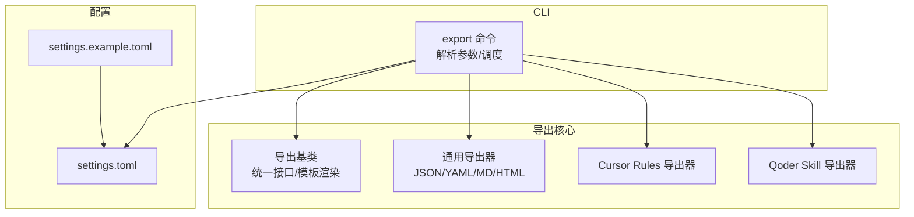
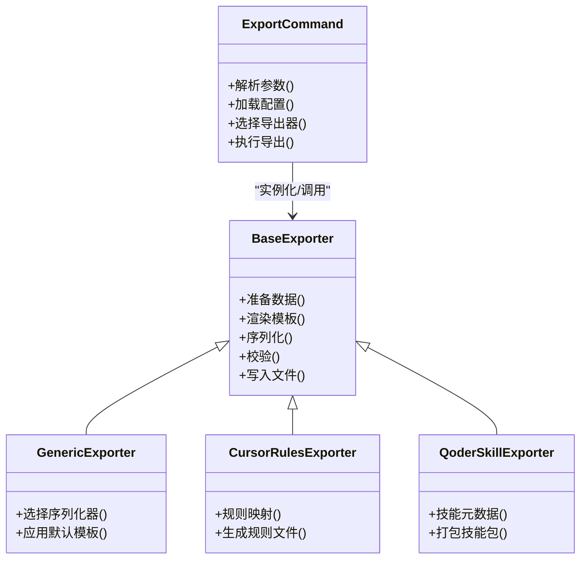
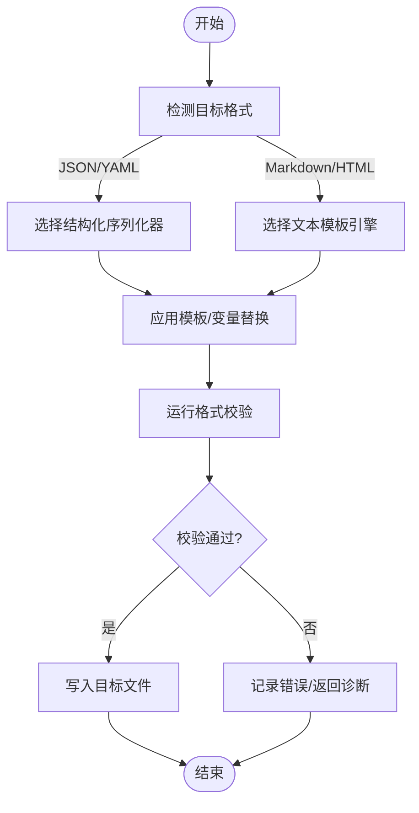
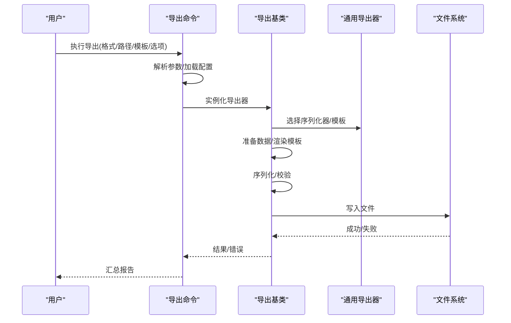
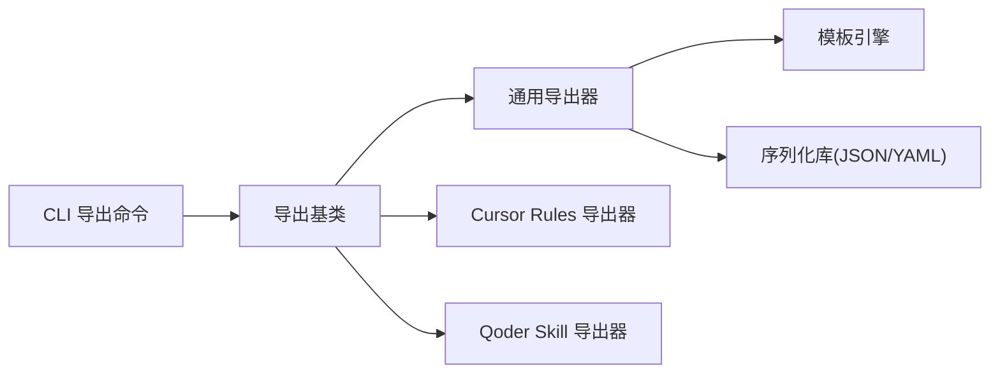

# 通用格式导出

<cite>
**本文引用的文件**   
- [src/jirin/cli/commands/export.py](file://src/jirin/cli/commands/export.py)
- [src/jirin/export/base.py](file://src/jirin/export/base.py)
- [src/jirin/export/generic.py](file://src/jirin/export/generic.py)
- [src/jirin/export/cursor_rules.py](file://src/jirin/export/cursor_rules.py)
- [src/jirin/export/qoder_skill.py](file://src/jirin/export/qoder_skill.py)
- [config/settings.example.toml](file://config/settings.example.toml)
- [config/settings.toml](file://config/settings.toml)
</cite>

## 目录
1. [简介](#简介)
2. [项目结构](#项目结构)
3. [核心组件](#核心组件)
4. [架构总览](#架构总览)
5. [详细组件分析](#详细组件分析)
6. [依赖关系分析](#依赖关系分析)
7. [性能考虑](#性能考虑)
8. [故障排查指南](#故障排查指南)
9. [结论](#结论)
10. [附录](#附录)

## 简介
本章节面向Jirin的“通用格式导出”能力，系统性说明其支持的多种标准格式（JSON、YAML、Markdown、HTML等）及其适用场景；阐述模板结构与变量替换机制、数据序列化方法；提供格式选择指南、自定义模板开发教程与批量导出处理方法；记录格式验证工具、数据完整性检查与向后兼容性策略；并给出与其他系统集成时的格式适配方案与性能调优建议。

## 项目结构
导出功能位于 export 子包与 CLI 命令层：
- CLI 入口：export 命令负责解析参数、加载配置、调度具体导出器。
- 导出基类：定义统一的导出接口、模板渲染与序列化契约。
- 通用导出器：实现 JSON/YAML/Markdown/HTML 等常见格式的导出逻辑。
- 专用导出器：针对特定生态（如 Cursor Rules、Qoder Skill）的格式适配器。
- 配置：settings.toml 与示例配置用于控制输出路径、默认格式、模板位置等。

图表来源
- [src/jirin/cli/commands/export.py](file://src/jirin/cli/commands/export.py)
- [src/jirin/export/base.py](file://src/jirin/export/base.py)
- [src/jirin/export/generic.py](file://src/jirin/export/generic.py)
- [src/jirin/export/cursor_rules.py](file://src/jirin/export/cursor_rules.py)
- [src/jirin/export/qoder_skill.py](file://src/jirin/export/qoder_skill.py)
- [config/settings.example.toml](file://config/settings.example.toml)
- [config/settings.toml](file://config/settings.toml)

章节来源
- [src/jirin/cli/commands/export.py](file://src/jirin/cli/commands/export.py)
- [src/jirin/export/base.py](file://src/jirin/export/base.py)
- [src/jirin/export/generic.py](file://src/jirin/export/generic.py)
- [src/jirin/export/cursor_rules.py](file://src/jirin/export/cursor_rules.py)
- [src/jirin/export/qoder_skill.py](file://src/jirin/export/qoder_skill.py)
- [config/settings.example.toml](file://config/settings.example.toml)
- [config/settings.toml](file://config/settings.toml)

## 核心组件
- 导出基类
  - 职责：定义导出器的统一接口、模板加载与渲染、序列化与校验钩子、错误处理与日志。
  - 关键点：抽象出“准备数据 -> 渲染模板 -> 序列化 -> 写入文件”的标准流程；为各格式提供可插拔的序列化器与校验器。
- 通用导出器
  - 职责：实现 JSON、YAML、Markdown、HTML 等常用格式的导出；内置基础模板与变量映射；支持缩进、编码、换行符等选项。
  - 关键点：按扩展名或显式类型选择对应序列化器；对 Markdown/HTML 使用文本模板引擎进行变量替换。
- 专用导出器
  - Cursor Rules 导出器：将内部规则对象序列化为 Cursor 生态所需的规则文件格式。
  - Qoder Skill 导出器：将技能元数据与内容打包为 Qoder 平台可识别的技能描述格式。
- CLI 导出命令
  - 职责：接收用户输入（目标格式、输出路径、模板路径、是否覆盖等），加载 settings.toml，实例化相应导出器并执行导出。
  - 关键点：支持批量模式（多数据集/多模板）、失败重试、增量更新与幂等输出。

章节来源
- [src/jirin/export/base.py](file://src/jirin/export/base.py)
- [src/jirin/export/generic.py](file://src/jirin/export/generic.py)
- [src/jirin/export/cursor_rules.py](file://src/jirin/export/cursor_rules.py)
- [src/jirin/export/qoder_skill.py](file://src/jirin/export/qoder_skill.py)
- [src/jirin/cli/commands/export.py](file://src/jirin/cli/commands/export.py)

## 架构总览
导出子系统采用“命令 + 基类 + 多实现”的分层设计：
- 命令层负责参数解析与流程编排。
- 基类封装通用能力（模板、序列化、校验、IO）。
- 具体导出器按需实现格式特定的序列化与模板。

图表来源
- [src/jirin/cli/commands/export.py](file://src/jirin/cli/commands/export.py)
- [src/jirin/export/base.py](file://src/jirin/export/base.py)
- [src/jirin/export/generic.py](file://src/jirin/export/generic.py)
- [src/jirin/export/cursor_rules.py](file://src/jirin/export/cursor_rules.py)
- [src/jirin/export/qoder_skill.py](file://src/jirin/export/qoder_skill.py)

## 详细组件分析

### 导出基类（BaseExporter）
- 设计要点
  - 统一接口：定义 prepare_data、render_template、serialize、validate、write_file 等关键步骤。
  - 模板系统：支持从文件系统或内嵌资源加载模板；提供变量注入与上下文隔离。
  - 序列化策略：通过注册表/工厂选择具体序列化器（JSON/YAML/文本）。
  - 校验与回滚：在写入前执行 schema 校验，失败时保留原文件或生成临时文件供诊断。
  - 错误处理：结构化异常、可恢复错误分类、详细日志与追踪信息。
- 复杂度与性能
  - 模板渲染通常为 O(n) 于模板大小；序列化复杂度取决于数据结构规模。
  - 大对象导出建议启用流式写入与分块处理。

章节来源
- [src/jirin/export/base.py](file://src/jirin/export/base.py)

### 通用导出器（GenericExporter）
- 支持格式与适用场景
  - JSON：机器可读、强类型友好，适合 API 对接、自动化流水线。
  - YAML：人类可读、注释友好，适合配置与文档型数据。
  - Markdown：轻量文档，适合报告、知识库与版本化管理。
  - HTML：富文本展示，适合浏览器预览与报表分发。
- 模板结构与变量替换
  - 模板由“骨架 + 占位符”组成；占位符通过上下文字典注入。
  - 支持嵌套对象访问、条件片段与循环遍历（由模板引擎决定语法）。
- 数据序列化方法
  - JSON/YAML：基于标准库或第三方库进行序列化，支持缩进、排序、空值处理等选项。
  - Markdown/HTML：以字符串模板为主，结合上下文渲染为最终文本。
- 默认行为与覆盖
  - 可通过配置指定默认模板路径、编码、换行符、缩进等。
  - 允许在命令行或调用方传入覆盖项。

图表来源
- [src/jirin/export/generic.py](file://src/jirin/export/generic.py)
- [src/jirin/export/base.py](file://src/jirin/export/base.py)

章节来源
- [src/jirin/export/generic.py](file://src/jirin/export/generic.py)
- [src/jirin/export/base.py](file://src/jirin/export/base.py)

### Cursor Rules 导出器
- 职责：将内部规则模型转换为 Cursor 生态的规则文件格式，包含字段映射、命名规范与必要元数据。
- 关键点：确保字段兼容性与必填项校验；提供迁移脚本或转换提示以应对上游变更。

章节来源
- [src/jirin/export/cursor_rules.py](file://src/jirin/export/cursor_rules.py)

### Qoder Skill 导出器
- 职责：将技能元数据与内容打包为 Qoder 平台可识别的技能描述格式。
- 关键点：版本号管理、依赖声明、资源清单与签名/校验（若平台要求）。

章节来源
- [src/jirin/export/qoder_skill.py](file://src/jirin/export/qoder_skill.py)

### CLI 导出命令（export）
- 主要流程
  - 解析参数：目标格式、输出路径、模板路径、是否覆盖、并发度等。
  - 加载配置：读取 settings.toml，合并运行时参数。
  - 选择导出器：根据格式或显式类型选择具体实现。
  - 执行导出：调用基类流程，处理批量任务与错误聚合。
- 批量导出
  - 支持多数据集/多模板组合；可配置并发与失败策略（跳过/继续/中止）。
  - 输出组织：按数据集或模板维度创建子目录，避免覆盖冲突。

图表来源
- [src/jirin/cli/commands/export.py](file://src/jirin/cli/commands/export.py)
- [src/jirin/export/base.py](file://src/jirin/export/base.py)
- [src/jirin/export/generic.py](file://src/jirin/export/generic.py)

章节来源
- [src/jirin/cli/commands/export.py](file://src/jirin/cli/commands/export.py)

## 依赖关系分析
- 模块耦合
  - CLI 仅依赖导出基类与具体导出器，保持低耦合。
  - 通用导出器依赖模板引擎与序列化库，通过配置解耦。
- 外部依赖
  - JSON/YAML 序列化：优先使用标准库或稳定第三方库。
  - 模板引擎：可选 Jinja2 或轻量自研引擎，需保证安全沙箱与性能。
- 潜在循环依赖
  - 导出器之间无直接依赖，均向上依赖基类，避免环。

图表来源
- [src/jirin/cli/commands/export.py](file://src/jirin/cli/commands/export.py)
- [src/jirin/export/base.py](file://src/jirin/export/base.py)
- [src/jirin/export/generic.py](file://src/jirin/export/generic.py)
- [src/jirin/export/cursor_rules.py](file://src/jirin/export/cursor_rules.py)
- [src/jirin/export/qoder_skill.py](file://src/jirin/export/qoder_skill.py)

章节来源
- [src/jirin/cli/commands/export.py](file://src/jirin/cli/commands/export.py)
- [src/jirin/export/base.py](file://src/jirin/export/base.py)
- [src/jirin/export/generic.py](file://src/jirin/export/generic.py)
- [src/jirin/export/cursor_rules.py](file://src/jirin/export/cursor_rules.py)
- [src/jirin/export/qoder_skill.py](file://src/jirin/export/qoder_skill.py)

## 性能考虑
- 模板渲染优化
  - 预编译模板、复用上下文缓存、减少重复计算。
  - 大文档分块渲染与流式写入，降低内存峰值。
- 序列化优化
  - 对大型列表/树形结构采用迭代器/生成器方式序列化。
  - 合理设置缩进与排序，避免不必要的键重排开销。
- I/O 优化
  - 批量导出时并行写入，限制并发度以避免磁盘争用。
  - 使用原子写入（先写临时文件再替换）提升可靠性。
- 监控与度量
  - 记录渲染时长、序列化耗时、I/O 吞吐与错误率，便于定位瓶颈。

[本节为通用指导，不直接分析具体文件]

## 故障排查指南
- 常见问题
  - 模板变量缺失：检查上下文注入与模板占位符一致性。
  - 序列化失败：确认数据类型与目标格式约束（如日期、二进制、循环引用）。
  - 权限与路径：确认输出目录存在且具备写入权限。
  - 并发冲突：批量导出时避免同名文件覆盖，建议使用唯一命名或子目录。
- 诊断手段
  - 启用详细日志与堆栈跟踪；导出失败时保留中间产物以便复现。
  - 使用校验器快速定位字段缺失或类型不匹配问题。
- 恢复策略
  - 失败重试与幂等输出；必要时回滚到上次成功版本。

章节来源
- [src/jirin/export/base.py](file://src/jirin/export/base.py)
- [src/jirin/export/generic.py](file://src/jirin/export/generic.py)
- [src/jirin/cli/commands/export.py](file://src/jirin/cli/commands/export.py)

## 结论
Jirin 的通用格式导出通过清晰的层次设计与可扩展的导出器体系，提供了对 JSON、YAML、Markdown、HTML 等主流格式的标准化支持。借助统一的模板渲染与序列化机制，配合完善的校验与错误处理，既满足日常报告与文档需求，也便于与外部系统集成。通过合理的性能优化与批量处理策略，可在大规模导出场景中保持稳定与高效。

[本节为总结性内容，不直接分析具体文件]

## 附录

### 格式选择指南
- JSON：适合机器消费、API 集成、严格类型校验。
- YAML：适合人类阅读、配置与轻量文档。
- Markdown：适合知识沉淀、版本管理与协作编辑。
- HTML：适合浏览器预览、报表分发与富文本展示。

[本节为概念性内容，不直接分析具体文件]

### 自定义模板开发教程
- 步骤概览
  - 确定目标格式与模板语言（文本模板或结构化模板）。
  - 在模板中定义占位符与条件/循环片段。
  - 准备上下文数据，确保字段名称与类型一致。
  - 通过 CLI 或 API 指定模板路径并执行导出。
- 最佳实践
  - 模板与数据分离，便于维护与测试。
  - 使用最小必要字段，避免冗余输出。
  - 为不同环境（开发/生产）提供差异化模板。

[本节为概念性内容，不直接分析具体文件]

### 批量导出处理方法
- 任务组织：按数据集/模板维度划分任务，生成任务清单。
- 并发控制：根据 CPU/磁盘能力设定并发度，避免过载。
- 失败处理：可选择跳过失败项、重试或整体中止。
- 结果汇总：生成导出报告，包含成功/失败统计与错误摘要。

[本节为概念性内容，不直接分析具体文件]

### 格式验证工具与数据完整性检查
- 验证策略
  - 结构校验：基于 schema 检查必填字段、类型与取值范围。
  - 语义校验：业务规则层面的断言（如关联完整性、枚举合法性）。
- 完整性检查
  - 哈希校验：对输出文件生成校验和，便于传输与归档。
  - 对比校验：与源数据或基准输出进行差异比对。

[本节为概念性内容，不直接分析具体文件]

### 向后兼容性策略
- 版本化模板与导出器：通过版本号或特性开关控制行为。
- 渐进迁移：提供旧格式到新格式的转换脚本与提示。
- 兼容层：在基类中提供默认兼容逻辑，逐步弃用旧行为。

[本节为概念性内容，不直接分析具体文件]

### 与其他系统集成时的格式适配方案
- 适配器模式：为外部系统提供专用导出器，屏蔽差异。
- 约定优于配置：明确字段命名、时间与时区、字符集等约定。
- 契约测试：通过端到端用例验证导出产物与下游系统的兼容性。

[本节为概念性内容，不直接分析具体文件]

### 配置参考
- settings.example.toml：提供默认配置样例，包括输出目录、默认格式、模板路径等。
- settings.toml：实际生效的配置，可按环境覆盖默认值。

章节来源
- [config/settings.example.toml](file://config/settings.example.toml)
- [config/settings.toml](file://config/settings.toml)