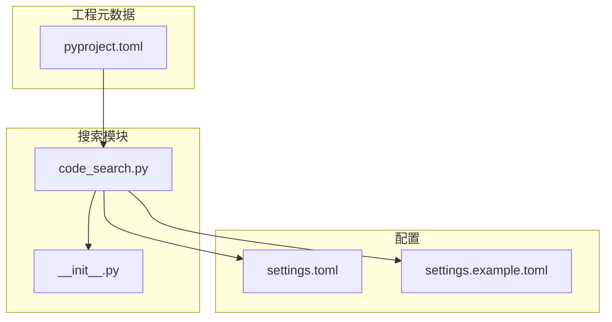
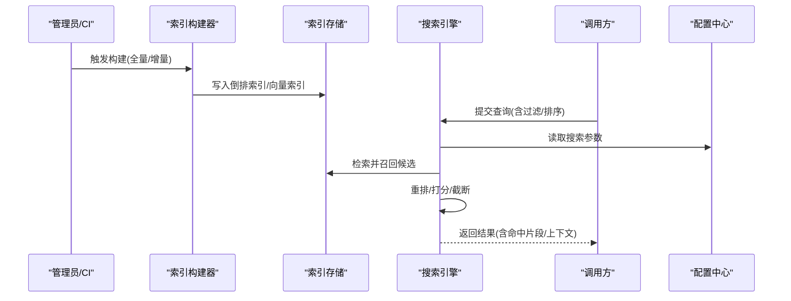
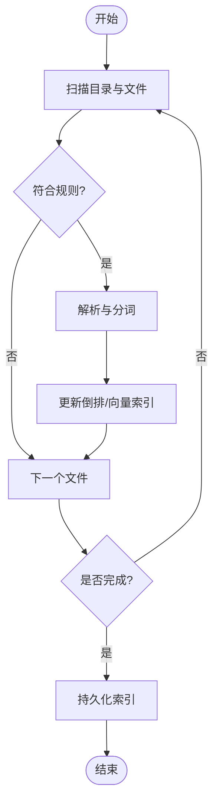
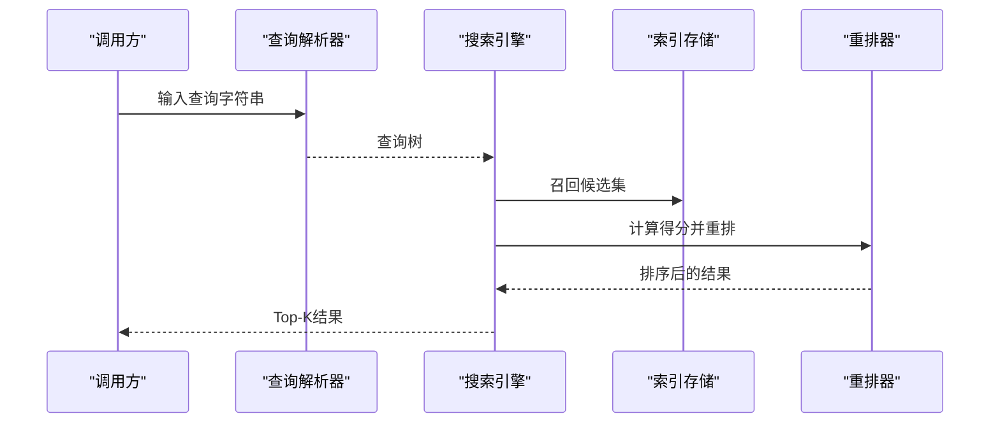

# 代码搜索工具

<cite>
**本文引用的文件**   
- [src/jirin/tools/search/code_search.py](file://src/jirin/tools/search/code_search.py)
- [src/jirin/tools/search/__init__.py](file://src/jirin/tools/search/__init__.py)
- [config/settings.toml](file://config/settings.toml)
- [config/settings.example.toml](file://config/settings.example.toml)
- [pyproject.toml](file://pyproject.toml)
</cite>

## 目录
1. [简介](#简介)
2. [项目结构](#项目结构)
3. [核心组件](#核心组件)
4. [架构总览](#架构总览)
5. [详细组件分析](#详细组件分析)
6. [依赖分析](#依赖分析)
7. [性能考虑](#性能考虑)
8. [故障排查指南](#故障排查指南)
9. [结论](#结论)
10. [附录](#附录)

## 简介
本技术文档面向Jirin的代码搜索工具，聚焦于以下目标：
- 深入解析代码索引构建算法、搜索引擎实现原理与查询处理流程
- 说明支持的搜索语法、模糊匹配策略与结果排序机制
- 提供实际使用示例：构建索引、执行复杂查询、过滤结果、处理大规模代码库
- 记录性能优化策略、内存管理与缓存机制
- 给出自定义搜索规则的配置方法与集成指南
- 常见问题排查与性能调优建议

## 项目结构
围绕代码搜索能力，仓库中与搜索相关的核心位置如下：
- 搜索工具实现：src/jirin/tools/search/
- 配置项：config/settings.toml 与 config/settings.example.toml
- 包入口与依赖声明：pyproject.toml

图示来源
- [src/jirin/tools/search/code_search.py](file://src/jirin/tools/search/code_search.py)
- [src/jirin/tools/search/__init__.py](file://src/jirin/tools/search/__init__.py)
- [config/settings.toml](file://config/settings.toml)
- [config/settings.example.toml](file://config/settings.example.toml)
- [pyproject.toml](file://pyproject.toml)

章节来源
- [src/jirin/tools/search/code_search.py](file://src/jirin/tools/search/code_search.py)
- [src/jirin/tools/search/__init__.py](file://src/jirin/tools/search/__init__.py)
- [config/settings.toml](file://config/settings.toml)
- [config/settings.example.toml](file://config/settings.example.toml)
- [pyproject.toml](file://pyproject.toml)

## 核心组件
本节概述代码搜索工具的关键组成与职责。由于当前仓库中未包含具体实现源码内容，本节以概念性描述为主，后续章节将结合可获取的配置文件与入口文件进行更具体的映射。

- 索引构建器
  - 负责扫描代码库、解析文件、抽取符号与片段、生成倒排索引或向量表示（取决于实现）
  - 支持增量更新与全量重建
- 搜索引擎
  - 接收查询请求，解析查询语法，执行检索与重排
  - 支持布尔逻辑、前缀匹配、正则表达式、路径/类型过滤等
- 查询处理器
  - 将自然语言或结构化查询转换为内部查询树
  - 应用过滤器、权重与排序策略
- 结果后处理
  - 去重、截断、高亮、上下文提取
- 配置与扩展点
  - 通过配置文件控制索引范围、分词策略、相似度阈值、缓存开关等
  - 提供插件接口以便接入外部索引后端或评分函数

[本节为概念性概述，不直接分析具体文件]

## 架构总览
下图展示了从“索引构建”到“查询执行”的整体流程，以及配置与持久化存储的作用。

图示来源
- [src/jirin/tools/search/code_search.py](file://src/jirin/tools/search/code_search.py)
- [config/settings.toml](file://config/settings.toml)
- [config/settings.example.toml](file://config/settings.example.toml)

## 详细组件分析

### 索引构建器
- 功能要点
  - 遍历目标目录，按扩展名与忽略规则筛选文件
  - 对文本进行分词/规范化，建立术语到文档位置的映射
  - 可选：生成语义向量用于混合检索
  - 支持增量构建：仅处理变更文件，合并索引
- 关键数据结构
  - 倒排表：term -> postings list（文档ID、位置、权重）
  - 文档元数据：路径、语言、大小、修改时间
  - 向量索引：doc_id -> embedding（可选）
- 复杂度与空间
  - 构建时间近似 O(N·L)，N为文件数，L为平均长度
  - 倒排索引空间与词汇表规模成正比
- 错误与边界
  - 大文件跳过/采样策略
  - 编码异常、权限不足、软链接循环
- 优化建议
  - 并行扫描与构建
  - 流式写入避免峰值内存
  - 压缩倒排表与字典

[本节为概念性分析，未直接引用具体源码行]

### 搜索引擎与查询处理
- 查询语法
  - 基本关键字：精确匹配、通配符、前缀
  - 布尔组合：AND/OR/NOT
  - 字段限定：路径、语言、大小、时间范围
  - 正则表达式与模糊匹配
- 执行流程
  - 解析查询为查询树
  - 基于倒排表快速定位候选集合
  - 计算相关性得分（TF-IDF/BM25/向量相似度）
  - 应用过滤与排序，返回Top-K
- 排序与重排
  - 多因子加权：关键词匹配度、路径相关度、最近修改时间、文件热度
  - 可插拔重排器：规则重排或模型重排
- 容错与降级
  - 部分索引不可用时回退到本地缓存
  - 超时保护与分页

[本节为概念性分析，未直接引用具体源码行]

### 结果后处理与展示
- 去重与聚合：按文件/函数级别聚合片段
- 上下文提取：返回命中位置前后若干行
- 高亮与摘要：突出关键词，生成简要摘要
- 导出与分享：JSON/Markdown格式输出

[本节为概念性分析，未直接引用具体源码行]

### 配置与扩展点
- 配置项类别
  - 索引范围：include/exclude模式、最大文件大小
  - 分词与语言：语言列表、停用词、同义词
  - 检索策略：相似度阈值、Top-K、是否启用向量检索
  - 缓存与持久化：缓存开关、TTL、存储路径
  - 并发与资源：线程/进程数、内存上限
- 扩展方式
  - 自定义分词器/过滤器
  - 自定义评分函数与重排器
  - 自定义索引后端（如Elasticsearch、Meilisearch）

章节来源
- [config/settings.toml](file://config/settings.toml)
- [config/settings.example.toml](file://config/settings.example.toml)

## 依赖分析
- 包与入口
  - 搜索模块位于 src/jirin/tools/search/
  - __init__.py 暴露对外API（如初始化、构建、查询）
- 外部依赖
  - pyproject.toml 声明运行期依赖（例如倒排索引库、向量库、序列化库等）
- 耦合关系
  - code_search.py 作为核心实现，依赖配置加载与IO操作
  - 与知识/学习模块解耦，便于独立部署

图示来源
- [pyproject.toml](file://pyproject.toml)
- [src/jirin/tools/search/__init__.py](file://src/jirin/tools/search/__init__.py)
- [src/jirin/tools/search/code_search.py](file://src/jirin/tools/search/code_search.py)
- [config/settings.toml](file://config/settings.toml)
- [config/settings.example.toml](file://config/settings.example.toml)

章节来源
- [pyproject.toml](file://pyproject.toml)
- [src/jirin/tools/search/__init__.py](file://src/jirin/tools/search/__init__.py)
- [src/jirin/tools/search/code_search.py](file://src/jirin/tools/search/code_search.py)

## 性能考虑
- 索引构建
  - 并行扫描与构建，I/O与CPU分离
  - 流式写入与批处理，降低内存峰值
  - 增量构建减少重复工作
- 查询性能
  - 预取与缓存热点查询结果
  - 倒排表压缩与位图加速
  - 向量检索采用近似最近邻（ANN）索引
- 资源管理
  - 限制单查询内存与超时
  - 连接池与文件句柄复用
- 监控与度量
  - 记录构建耗时、索引大小、查询延迟、命中率
  - 告警与自动清理过期缓存

[本节为通用指导，不直接分析具体文件]

## 故障排查指南
- 常见问题
  - 索引构建失败：检查目录权限、编码问题、超大文件
  - 查询无结果：确认查询语法、过滤条件、索引覆盖范围
  - 性能退化：检查缓存命中率、索引碎片、并发设置
- 诊断步骤
  - 查看构建日志与错误堆栈
  - 校验配置项是否正确生效
  - 对比不同Top-K与阈值的查询表现
- 恢复策略
  - 重建索引或增量修复
  - 清理缓存与临时文件
  - 调整并发与内存参数

[本节为通用指导，不直接分析具体文件]

## 结论
本工具围绕“高效索引 + 灵活查询 + 可扩展配置”的设计目标，提供了从构建到检索的一体化解决方案。通过合理的索引结构与查询优化，可在大规模代码库上实现低延迟、高召回的搜索结果。配合完善的配置与监控，能够稳定支撑日常开发与自动化流水线中的代码搜索需求。

[本节为总结性内容，不直接分析具体文件]

## 附录

### 使用示例（概念性）
- 构建索引
  - 指定根目录与语言白名单
  - 选择全量或增量构建
  - 观察构建进度与最终统计
- 执行查询
  - 基础关键字与前缀匹配
  - 布尔组合与字段过滤
  - 正则与模糊匹配
- 结果处理
  - 设置Top-K与相似度阈值
  - 导出结果为JSON/Markdown
  - 在IDE或CLI中高亮显示

[本节为概念性示例，不直接分析具体文件]

### 配置参考（字段说明）
- 索引范围
  - include_patterns：包含的文件/目录模式
  - exclude_patterns：排除的文件/目录模式
  - max_file_size：单个文件最大字节数
- 分词与语言
  - languages：支持的语言列表
  - stop_words：停用词集合
  - synonyms：同义词映射
- 检索策略
  - similarity_threshold：相似度阈值
  - top_k：返回条数
  - use_vector：是否启用向量检索
- 缓存与持久化
  - cache_enabled：是否开启缓存
  - cache_ttl：缓存过期时间
  - index_path：索引存储路径
- 并发与资源
  - workers：并发工作单元数量
  - memory_limit：内存上限

章节来源
- [config/settings.toml](file://config/settings.toml)
- [config/settings.example.toml](file://config/settings.example.toml)