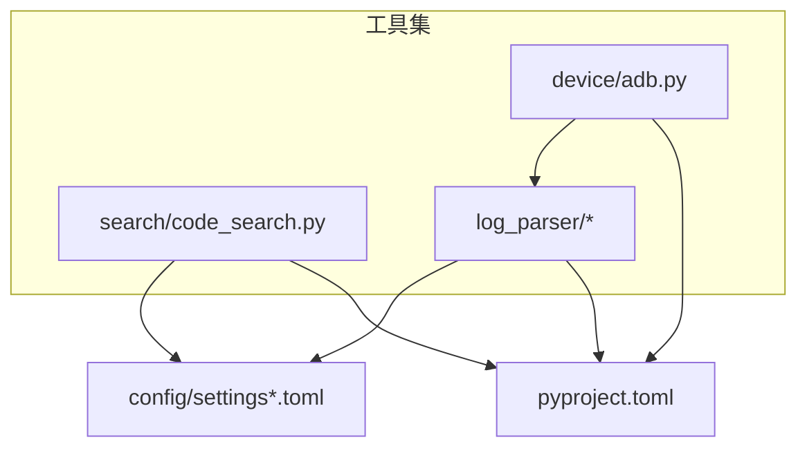
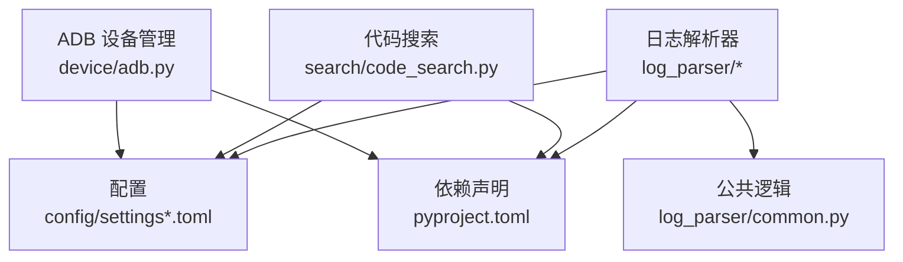
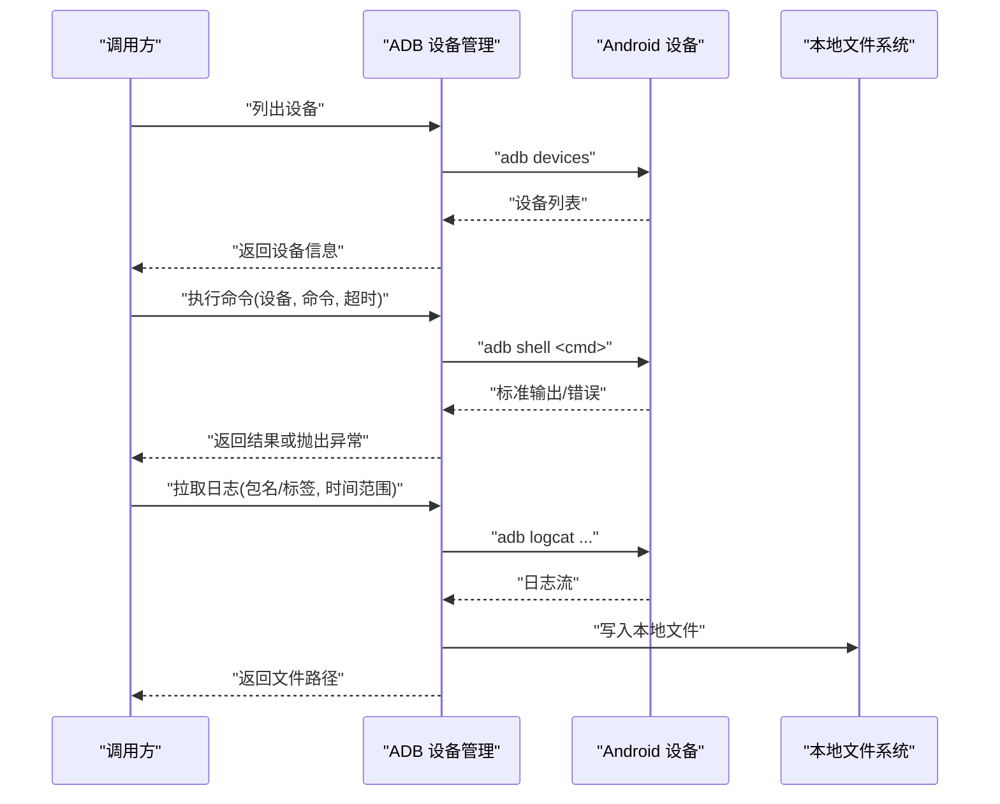
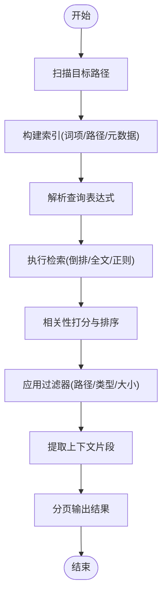
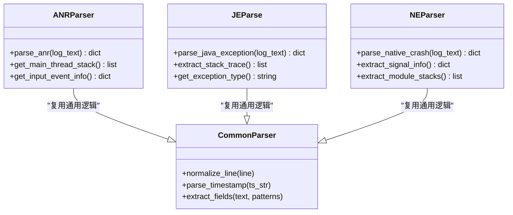
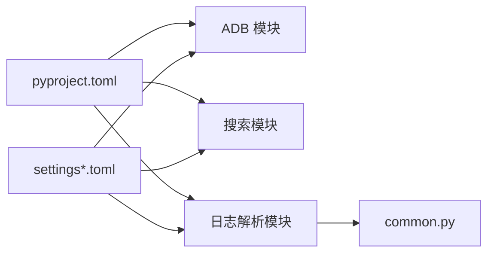

# 工具集

<cite>
**本文引用的文件**   
- [src/jirin/tools/device/adb.py](file://src/jirin/tools/device/adb.py)
- [src/jirin/tools/search/code_search.py](file://src/jirin/tools/search/code_search.py)
- [src/jirin/tools/log_parser/anr_parser.py](file://src/jirin/tools/log_parser/anr_parser.py)
- [src/jirin/tools/log_parser/je_parser.py](file://src/jirin/tools/log_parser/je_parser.py)
- [src/jirin/tools/log_parser/ne_parser.py](file://src/jirin/tools/log_parser/ne_parser.py)
- [src/jirin/tools/log_parser/common.py](file://src/jirin/tools/log_parser/common.py)
- [config/settings.example.toml](file://config/settings.example.toml)
- [config/settings.toml](file://config/settings.toml)
- [pyproject.toml](file://pyproject.toml)
</cite>

## 目录
1. [简介](#简介)
2. [项目结构](#项目结构)
3. [核心组件](#核心组件)
4. [架构总览](#架构总览)
5. [详细组件分析](#详细组件分析)
6. [依赖分析](#依赖分析)
7. [性能考虑](#性能考虑)
8. [故障排查指南](#故障排查指南)
9. [结论](#结论)
10. [附录](#附录)

## 简介
本技术文档聚焦于 Jirin 的工具集，覆盖以下关键能力：
- ADB 设备管理：连接管理、命令执行、日志获取等。
- 代码搜索工具：索引构建、查询语法与搜索结果处理。
- 日志解析器：ANR、Java 异常（JE）、Native 崩溃（NE）的解析流程。
- 使用示例、错误处理策略、性能优化建议。
- 自定义工具开发指南与集成方法。
- 依赖要求、配置选项与最佳实践。

## 项目结构
工具集位于 src/jirin/tools 下，按功能域组织为 device、search、log_parser 三个子模块；配置项集中在 config 目录；依赖声明在 pyproject.toml。

图表来源
- [src/jirin/tools/device/adb.py](file://src/jirin/tools/device/adb.py)
- [src/jirin/tools/search/code_search.py](file://src/jirin/tools/search/code_search.py)
- [src/jirin/tools/log_parser/anr_parser.py](file://src/jirin/tools/log_parser/anr_parser.py)
- [src/jirin/tools/log_parser/je_parser.py](file://src/jirin/tools/log_parser/je_parser.py)
- [src/jirin/tools/log_parser/ne_parser.py](file://src/jirin/tools/log_parser/ne_parser.py)
- [src/jirin/tools/log_parser/common.py](file://src/jirin/tools/log_parser/common.py)
- [config/settings.example.toml](file://config/settings.example.toml)
- [config/settings.toml](file://config/settings.toml)
- [pyproject.toml](file://pyproject.toml)

章节来源
- [src/jirin/tools/device/adb.py](file://src/jirin/tools/device/adb.py)
- [src/jirin/tools/search/code_search.py](file://src/jirin/tools/search/code_search.py)
- [src/jirin/tools/log_parser/anr_parser.py](file://src/jirin/tools/log_parser/anr_parser.py)
- [src/jirin/tools/log_parser/je_parser.py](file://src/jirin/tools/log_parser/je_parser.py)
- [src/jirin/tools/log_parser/ne_parser.py](file://src/jirin/tools/log_parser/ne_parser.py)
- [src/jirin/tools/log_parser/common.py](file://src/jirin/tools/log_parser/common.py)
- [config/settings.example.toml](file://config/settings.example.toml)
- [config/settings.toml](file://config/settings.toml)
- [pyproject.toml](file://pyproject.toml)

## 核心组件
- ADB 设备管理（device/adb.py）
  - 负责设备发现、连接状态维护、命令执行封装、日志拉取与输出。
  - 提供统一的接口供上层调用，屏蔽底层 adb 差异。
- 代码搜索（search/code_search.py）
  - 负责索引构建、查询解析、结果排序与过滤。
  - 支持多种匹配模式与上下文窗口控制。
- 日志解析器（log_parser/*）
  - ANR、JE、NE 三类日志的结构化解析与字段抽取。
  - 公共逻辑抽取到 common.py，避免重复实现。

章节来源
- [src/jirin/tools/device/adb.py](file://src/jirin/tools/device/adb.py)
- [src/jirin/tools/search/code_search.py](file://src/jirin/tools/search/code_search.py)
- [src/jirin/tools/log_parser/anr_parser.py](file://src/jirin/tools/log_parser/anr_parser.py)
- [src/jirin/tools/log_parser/je_parser.py](file://src/jirin/tools/log_parser/je_parser.py)
- [src/jirin/tools/log_parser/ne_parser.py](file://src/jirin/tools/log_parser/ne_parser.py)
- [src/jirin/tools/log_parser/common.py](file://src/jirin/tools/log_parser/common.py)

## 架构总览
工具集整体采用“模块化 + 配置驱动”的设计：
- 各工具通过配置中心读取参数（如设备列表、搜索路径、解析规则）。
- 日志解析器共享通用逻辑，降低耦合度。
- ADB 工具作为外部系统交互层，向上暴露稳定接口。

图表来源
- [src/jirin/tools/device/adb.py](file://src/jirin/tools/device/adb.py)
- [src/jirin/tools/search/code_search.py](file://src/jirin/tools/search/code_search.py)
- [src/jirin/tools/log_parser/anr_parser.py](file://src/jirin/tools/log_parser/anr_parser.py)
- [src/jirin/tools/log_parser/je_parser.py](file://src/jirin/tools/log_parser/je_parser.py)
- [src/jirin/tools/log_parser/ne_parser.py](file://src/jirin/tools/log_parser/ne_parser.py)
- [src/jirin/tools/log_parser/common.py](file://src/jirin/tools/log_parser/common.py)
- [config/settings.example.toml](file://config/settings.example.toml)
- [config/settings.toml](file://config/settings.toml)
- [pyproject.toml](file://pyproject.toml)

## 详细组件分析

### ADB 设备管理（device/adb.py）
职责与能力
- 设备发现与连接管理：枚举已连接设备、校验可达性、维护会话状态。
- 命令执行：统一封装 adb shell 命令，支持超时、重试与错误码映射。
- 日志获取：按包名或标签抓取日志，支持时间范围过滤与本地落盘。

关键流程（序列图）

图表来源
- [src/jirin/tools/device/adb.py](file://src/jirin/tools/device/adb.py)

章节来源
- [src/jirin/tools/device/adb.py](file://src/jirin/tools/device/adb.py)

### 代码搜索（search/code_search.py）
职责与能力
- 索引构建：扫描指定路径，建立词项倒排索引或结构化索引。
- 查询语法：支持关键词、正则、路径前缀、文件类型过滤等组合条件。
- 结果处理：相关性打分、去重、上下文窗口裁剪、分页输出。

索引构建与查询流程（流程图）

图表来源
- [src/jirin/tools/search/code_search.py](file://src/jirin/tools/search/code_search.py)

章节来源
- [src/jirin/tools/search/code_search.py](file://src/jirin/tools/search/code_search.py)

### 日志解析器（log_parser/*）
职责与能力
- ANR 解析：提取进程、线程、主线程阻塞点、输入事件等关键字段。
- JE 解析：捕获 Java 异常栈、异常类型、触发位置与上下文。
- NE 解析：解析 Native 崩溃信号、堆栈、寄存器与模块信息。
- 公共逻辑：日志行规范化、时间戳解析、字段抽取模板。

解析流程（类关系图）

图表来源
- [src/jirin/tools/log_parser/anr_parser.py](file://src/jirin/tools/log_parser/anr_parser.py)
- [src/jirin/tools/log_parser/je_parser.py](file://src/jirin/tools/log_parser/je_parser.py)
- [src/jirin/tools/log_parser/ne_parser.py](file://src/jirin/tools/log_parser/ne_parser.py)
- [src/jirin/tools/log_parser/common.py](file://src/jirin/tools/log_parser/common.py)

章节来源
- [src/jirin/tools/log_parser/anr_parser.py](file://src/jirin/tools/log_parser/anr_parser.py)
- [src/jirin/tools/log_parser/je_parser.py](file://src/jirin/tools/log_parser/je_parser.py)
- [src/jirin/tools/log_parser/ne_parser.py](file://src/jirin/tools/log_parser/ne_parser.py)
- [src/jirin/tools/log_parser/common.py](file://src/jirin/tools/log_parser/common.py)

## 依赖分析
- 运行时依赖
  - Python 版本与第三方库由 pyproject.toml 声明。
  - ADB 工具链需安装并加入 PATH。
- 配置依赖
  - settings.toml 与 settings.example.toml 提供默认与示例配置。
- 模块内依赖
  - 日志解析器内部依赖 common.py 提供的通用函数。
  - 代码搜索可能依赖文件系统遍历与正则表达式库。

图表来源
- [pyproject.toml](file://pyproject.toml)
- [config/settings.example.toml](file://config/settings.example.toml)
- [config/settings.toml](file://config/settings.toml)
- [src/jirin/tools/log_parser/common.py](file://src/jirin/tools/log_parser/common.py)

章节来源
- [pyproject.toml](file://pyproject.toml)
- [config/settings.example.toml](file://config/settings.example.toml)
- [config/settings.toml](file://config/settings.toml)
- [src/jirin/tools/log_parser/common.py](file://src/jirin/tools/log_parser/common.py)

## 性能考虑
- ADB 设备管理
  - 批量命令合并：减少 adb 进程启动开销。
  - 超时与重试：合理设置超时阈值，避免长时间阻塞。
  - 日志拉取分页：按时间范围分段拉取，避免一次性加载过大文件。
- 代码搜索
  - 增量索引：仅对变更文件重建索引，提升构建速度。
  - 并行扫描：多进程/多线程扫描目录树。
  - 结果裁剪：限制上下文窗口大小，减少内存占用。
- 日志解析
  - 流式解析：逐行处理大日志文件，避免整文件读入内存。
  - 正则优化：预编译常用模式，减少重复开销。
  - 缓存命中：对常见异常模式进行缓存，加速解析。

[本节为通用性能指导，不直接分析具体文件]

## 故障排查指南
- ADB 连接问题
  - 检查设备是否在线、权限是否正确、USB 调试是否开启。
  - 查看命令执行返回值与错误输出，定位失败原因。
- 日志拉取失败
  - 确认包名/标签是否存在，时间范围是否有效。
  - 检查磁盘空间与写入权限。
- 搜索无结果
  - 验证索引路径与文件类型过滤条件。
  - 调整查询语法，确保关键词与正则表达式正确。
- 解析异常
  - 核对日志格式是否符合预期，必要时扩展解析规则。
  - 使用公共解析器的日志规范化函数预处理输入。

章节来源
- [src/jirin/tools/device/adb.py](file://src/jirin/tools/device/adb.py)
- [src/jirin/tools/search/code_search.py](file://src/jirin/tools/search/code_search.py)
- [src/jirin/tools/log_parser/common.py](file://src/jirin/tools/log_parser/common.py)

## 结论
Jirin 工具集以模块化设计为核心，围绕 ADB 设备管理、代码搜索与日志解析三大能力，提供稳定、可扩展且易于集成的工具链。通过合理的配置与性能优化策略，可在不同规模的项目中高效落地。

[本节为总结性内容，不直接分析具体文件]

## 附录

### 使用示例（概念性说明）
- ADB 设备管理
  - 列出设备：调用设备管理接口获取已连接设备列表。
  - 执行命令：传入设备标识与命令字符串，获取输出或异常。
  - 拉取日志：指定包名与时间范围，返回本地文件路径。
- 代码搜索
  - 构建索引：指定根目录与忽略规则，生成索引文件。
  - 执行查询：组合关键词、正则与路径过滤，获取分页结果。
- 日志解析
  - 解析 ANR：输入原始日志文本，返回结构化字典。
  - 解析 JE/NE：分别提取异常栈与崩溃信息。

[本节为概念性示例，不直接分析具体文件]

### 错误处理策略
- 统一异常类型：对外暴露明确的异常类别，便于上层捕获与恢复。
- 降级策略：当外部依赖不可用时，返回空结果或提示用户修复环境。
- 可观测性：记录关键步骤与错误上下文，辅助定位问题。

[本节为通用策略，不直接分析具体文件]

### 自定义工具开发指南与集成方法
- 开发步骤
  - 新建工具模块：在 tools 目录下创建新子模块，遵循现有命名规范。
  - 定义接口：明确输入输出契约，保持向后兼容。
  - 配置接入：在 settings.toml 中添加必要配置项。
  - 单元测试：编写用例覆盖正常与异常路径。
- 集成方式
  - 注册入口：在 CLI 或编排器中注册新工具命令。
  - 依赖声明：在 pyproject.toml 中声明新增依赖。
  - 文档更新：补充使用说明与示例。

[本节为通用指南，不直接分析具体文件]

### 依赖要求与配置选项
- 依赖要求
  - Python 环境与第三方库见 pyproject.toml。
  - 系统级 adb 工具需安装并可执行。
- 配置选项
  - settings.toml 与 settings.example.toml 提供默认值与示例。
  - 常见选项包括设备列表、搜索路径、解析规则、超时与重试策略等。

章节来源
- [pyproject.toml](file://pyproject.toml)
- [config/settings.example.toml](file://config/settings.example.toml)
- [config/settings.toml](file://config/settings.toml)

### 最佳实践
- 配置管理：将敏感信息与环境相关配置分离，使用环境变量注入。
- 幂等性：确保工具多次运行不会产生副作用。
- 资源清理：及时释放文件句柄与网络连接。
- 日志与监控：记录关键指标与错误堆栈，便于运维与排障。

[本节为通用实践，不直接分析具体文件]