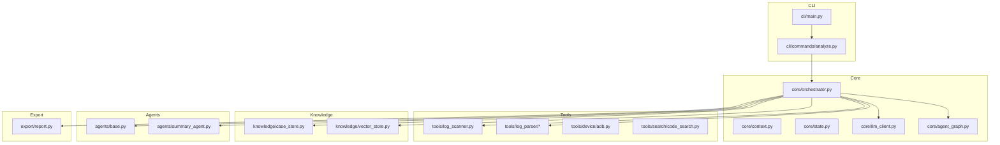
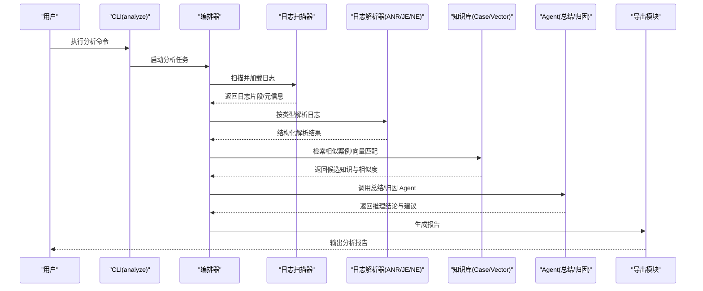
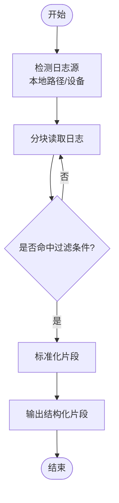
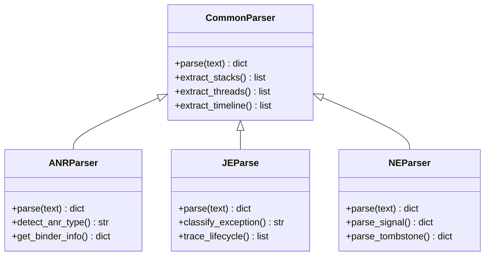
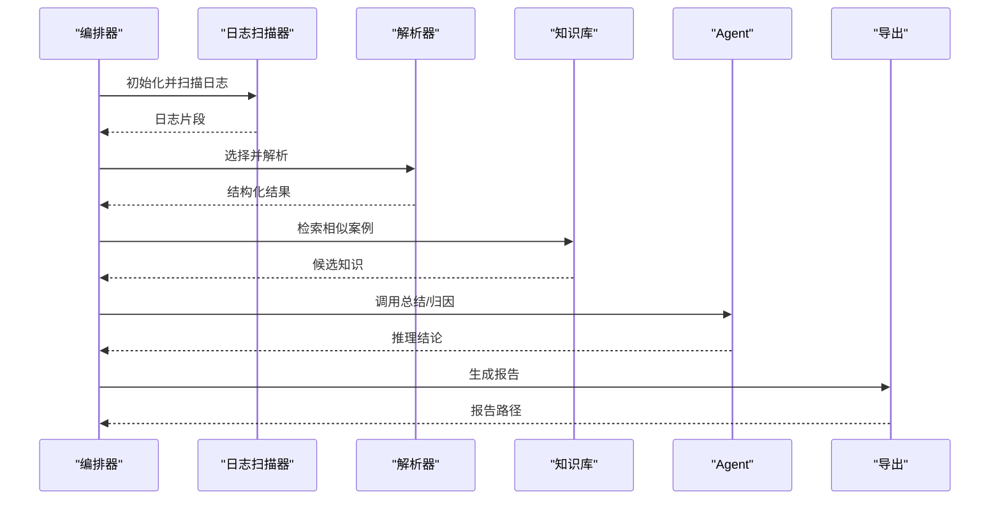
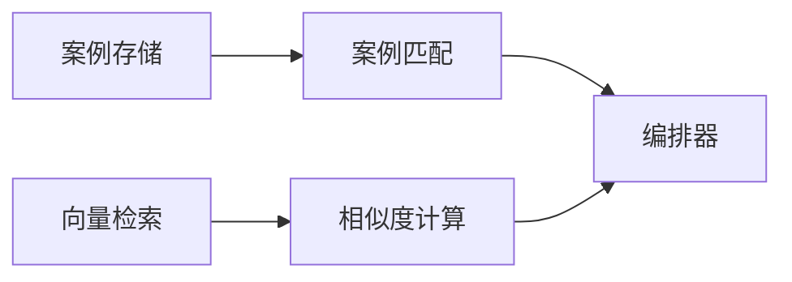
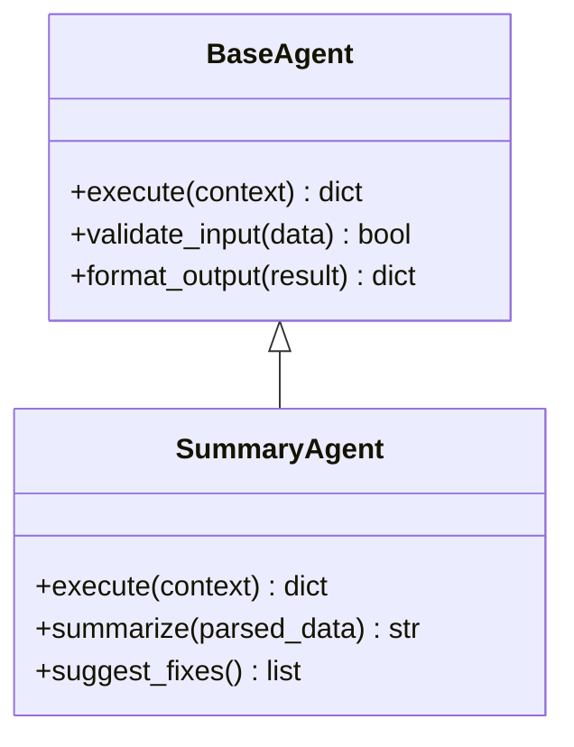
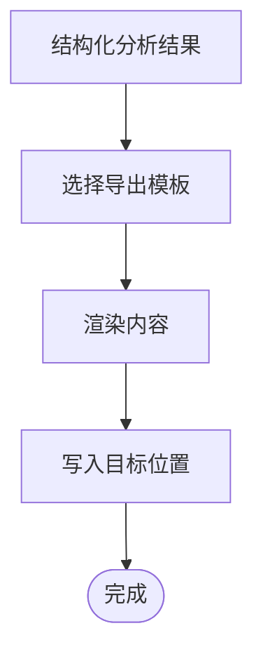
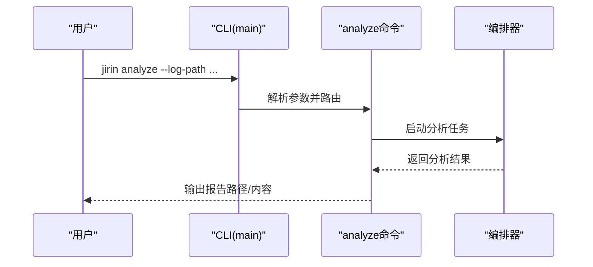
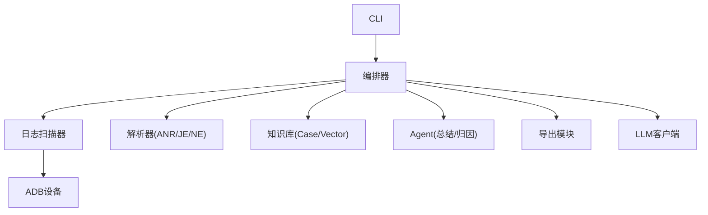

# 日志扫描工具

<cite>
**本文引用的文件**   
- [pyproject.toml](file://pyproject.toml)
- [src/jirin/tools/log_scanner.py](file://src/jirin/tools/log_scanner.py)
- [src/jirin/tools/log_parser/__init__.py](file://src/jirin/tools/log_parser/__init__.py)
- [src/jirin/tools/log_parser/common.py](file://src/jirin/tools/log_parser/common.py)
- [src/jirin/tools/log_parser/anr_parser.py](file://src/jirin/tools/log_parser/anr_parser.py)
- [src/jirin/tools/log_parser/je_parser.py](file://src/jirin/tools/log_parser/je_parser.py)
- [src/jirin/tools/log_parser/ne_parser.py](file://src/jirin/tools/log_parser/ne_parser.py)
- [src/jirin/cli/main.py](file://src/jirin/cli/main.py)
- [src/jirin/cli/commands/analyze.py](file://src/jirin/cli/commands/analyze.py)
- [src/jirin/core/orchestrator.py](file://src/jirin/core/orchestrator.py)
- [src/jirin/core/context.py](file://src/jirin/core/context.py)
- [src/jirin/core/state.py](file://src/jirin/core/state.py)
- [src/jirin/knowledge/case_store.py](file://src/jirin/knowledge/case_store.py)
- [src/jirin/knowledge/vector_store.py](file://src/jirin/knowledge/vector_store.py)
- [src/jirin/agents/base.py](file://src/jirin/agents/base.py)
- [src/jirin/agents/summary_agent.py](file://src/jirin/agents/summary_agent.py)
- [src/jirin/export/report.py](file://src/jirin/export/report.py)
- [config/settings.example.toml](file://config/settings.example.toml)
</cite>

## 目录
1. [简介](#简介)
2. [项目结构](#项目结构)
3. [核心组件](#核心组件)
4. [架构总览](#架构总览)
5. [详细组件分析](#详细组件分析)
6. [依赖关系分析](#依赖关系分析)
7. [性能考量](#性能考量)
8. [故障排查指南](#故障排查指南)
9. [结论](#结论)
10. [附录](#附录)

## 简介
本项目是一个面向 Android 崩溃与异常日志的自动化扫描与分析工具。它通过统一的 CLI 入口，对 ANR、Java 异常（JE）、Native 崩溃（NE）等日志进行解析、上下文增强、知识检索与智能摘要，最终输出结构化报告，辅助定位问题根因。整体采用“解析器 + 编排器 + 知识库 + 导出”的分层架构，具备良好的可扩展性与可维护性。

## 项目结构
- 配置与文档
  - config/settings.example.toml：示例配置项（如 LLM、向量库、路径等）
  - docs/*：用户指南与技术文档
- 核心代码
  - src/jirin/cli：命令行入口与子命令（analyze、export、learn、config）
  - src/jirin/core：编排器、上下文、状态机、LLM 客户端、Agent 图
  - src/jirin/tools：设备交互、日志解析器、代码搜索、通用日志扫描器
  - src/jirin/knowledge：案例存储、向量检索、静态知识库
  - src/jirin/agents：各类 Agent（ANR、JE、NE、总结等）
  - src/jirin/export：报告导出（通用、Codex/Cursor/Qoder Skill 等）
  - src/jirin/utils：日志配置等工具
- 测试
  - tests/*：针对解析器与编排器的单元测试与夹具

**图表来源** 
- [src/jirin/cli/main.py](file://src/jirin/cli/main.py)
- [src/jirin/cli/commands/analyze.py](file://src/jirin/cli/commands/analyze.py)
- [src/jirin/core/orchestrator.py](file://src/jirin/core/orchestrator.py)
- [src/jirin/tools/log_scanner.py](file://src/jirin/tools/log_scanner.py)
- [src/jirin/tools/log_parser/__init__.py](file://src/jirin/tools/log_parser/__init__.py)
- [src/jirin/knowledge/case_store.py](file://src/jirin/knowledge/case_store.py)
- [src/jirin/knowledge/vector_store.py](file://src/jirin/knowledge/vector_store.py)
- [src/jirin/agents/base.py](file://src/jirin/agents/base.py)
- [src/jirin/agents/summary_agent.py](file://src/jirin/agents/summary_agent.py)
- [src/jirin/export/report.py](file://src/jirin/export/report.py)

**章节来源**
- [pyproject.toml](file://pyproject.toml)
- [config/settings.example.toml](file://config/settings.example.toml)

## 核心组件
- 日志扫描器（LogScanner）
  - 负责发现并读取目标日志文件，统一输入格式，支持增量扫描与过滤
- 日志解析器（ANR/JE/NE）
  - 将原始日志文本解析为结构化数据（堆栈、线程、时间线、关键事件）
- 编排器（Orchestrator）
  - 协调解析、知识检索、Agent 推理与报告生成，管理执行上下文与状态
- 知识库（CaseStore/VectorStore）
  - 提供历史案例匹配与语义检索，辅助定位相似问题与根因模式
- Agent 体系（Base/Summary 等）
  - 封装特定分析任务（如总结、归因），基于 LLM 能力进行推理
- 导出模块（Report）
  - 将分析结果导出为多种格式（Markdown、结构化 JSON、Skill 规则等）

**章节来源**
- [src/jirin/tools/log_scanner.py](file://src/jirin/tools/log_scanner.py)
- [src/jirin/tools/log_parser/__init__.py](file://src/jirin/tools/log_parser/__init__.py)
- [src/jirin/tools/log_parser/common.py](file://src/jirin/tools/log_parser/common.py)
- [src/jirin/tools/log_parser/anr_parser.py](file://src/jirin/tools/log_parser/anr_parser.py)
- [src/jirin/tools/log_parser/je_parser.py](file://src/jirin/tools/log_parser/je_parser.py)
- [src/jirin/tools/log_parser/ne_parser.py](file://src/jirin/tools/log_parser/ne_parser.py)
- [src/jirin/core/orchestrator.py](file://src/jirin/core/orchestrator.py)
- [src/jirin/core/context.py](file://src/jirin/core/context.py)
- [src/jirin/core/state.py](file://src/jirin/core/state.py)
- [src/jirin/knowledge/case_store.py](file://src/jirin/knowledge/case_store.py)
- [src/jirin/knowledge/vector_store.py](file://src/jirin/knowledge/vector_store.py)
- [src/jirin/agents/base.py](file://src/jirin/agents/base.py)
- [src/jirin/agents/summary_agent.py](file://src/jirin/agents/summary_agent.py)
- [src/jirin/export/report.py](file://src/jirin/export/report.py)

## 架构总览
系统以 CLI 为入口，调用 analyze 子命令触发分析流程。编排器根据日志类型选择对应解析器，结合知识库与 Agent 完成推理，最后由导出模块输出报告。

**图表来源** 
- [src/jirin/cli/commands/analyze.py](file://src/jirin/cli/commands/analyze.py)
- [src/jirin/core/orchestrator.py](file://src/jirin/core/orchestrator.py)
- [src/jirin/tools/log_scanner.py](file://src/jirin/tools/log_scanner.py)
- [src/jirin/tools/log_parser/anr_parser.py](file://src/jirin/tools/log_parser/anr_parser.py)
- [src/jirin/tools/log_parser/je_parser.py](file://src/jirin/tools/log_parser/je_parser.py)
- [src/jirin/tools/log_parser/ne_parser.py](file://src/jirin/tools/log_parser/ne_parser.py)
- [src/jirin/knowledge/case_store.py](file://src/jirin/knowledge/case_store.py)
- [src/jirin/knowledge/vector_store.py](file://src/jirin/knowledge/vector_store.py)
- [src/jirin/agents/summary_agent.py](file://src/jirin/agents/summary_agent.py)
- [src/jirin/export/report.py](file://src/jirin/export/report.py)

## 详细组件分析

### 日志扫描器（LogScanner）
- 职责
  - 发现目标日志文件（按路径、通配符或设备拉取）
  - 分块读取与过滤（时间窗口、关键字）
  - 统一输出标准化日志片段供后续解析
- 关键点
  - 支持大文件流式处理，避免内存峰值
  - 错误恢复与重试机制，保证稳定性
  - 与设备 ADB 集成，便于远程抓取日志

**图表来源** 
- [src/jirin/tools/log_scanner.py](file://src/jirin/tools/log_scanner.py)

**章节来源**
- [src/jirin/tools/log_scanner.py](file://src/jirin/tools/log_scanner.py)

### 日志解析器（ANR/JE/NE）
- 共同接口
  - 统一解析入口与返回结构（堆栈、线程、时间线、关键事件）
- ANR 解析器
  - 识别主线程阻塞、Binder 耗尽、广播超时等场景
  - 提取关键调用链与服务状态
- JE 解析器
  - 解析 Java 异常堆栈、生命周期崩溃、SystemServer 相关异常
- NE 解析器
  - 解析 Native 崩溃信号、Tombstone、内存问题线索

**图表来源** 
- [src/jirin/tools/log_parser/common.py](file://src/jirin/tools/log_parser/common.py)
- [src/jirin/tools/log_parser/anr_parser.py](file://src/jirin/tools/log_parser/anr_parser.py)
- [src/jirin/tools/log_parser/je_parser.py](file://src/jirin/tools/log_parser/je_parser.py)
- [src/jirin/tools/log_parser/ne_parser.py](file://src/jirin/tools/log_parser/ne_parser.py)

**章节来源**
- [src/jirin/tools/log_parser/__init__.py](file://src/jirin/tools/log_parser/__init__.py)
- [src/jirin/tools/log_parser/common.py](file://src/jirin/tools/log_parser/common.py)
- [src/jirin/tools/log_parser/anr_parser.py](file://src/jirin/tools/log_parser/anr_parser.py)
- [src/jirin/tools/log_parser/je_parser.py](file://src/jirin/tools/log_parser/je_parser.py)
- [src/jirin/tools/log_parser/ne_parser.py](file://src/jirin/tools/log_parser/ne_parser.py)

### 编排器（Orchestrator）
- 职责
  - 管理分析生命周期：准备上下文、调度解析器、调用知识库与 Agent、生成报告
  - 维护运行状态与中间结果，支持断点续跑
- 关键点
  - 与 LLM 客户端集成，驱动 Agent 推理
  - 错误隔离与降级策略，确保部分失败不影响整体流程

**图表来源** 
- [src/jirin/core/orchestrator.py](file://src/jirin/core/orchestrator.py)
- [src/jirin/core/context.py](file://src/jirin/core/context.py)
- [src/jirin/core/state.py](file://src/jirin/core/state.py)

**章节来源**
- [src/jirin/core/orchestrator.py](file://src/jirin/core/orchestrator.py)
- [src/jirin/core/context.py](file://src/jirin/core/context.py)
- [src/jirin/core/state.py](file://src/jirin/core/state.py)

### 知识库（CaseStore/VectorStore）
- CaseStore
  - 存储历史案例与标签，支持快速匹配与回溯
- VectorStore
  - 基于向量的语义检索，提升相似问题召回率
- 使用方式
  - 在编排阶段注入候选知识，辅助 Agent 决策

**图表来源** 
- [src/jirin/knowledge/case_store.py](file://src/jirin/knowledge/case_store.py)
- [src/jirin/knowledge/vector_store.py](file://src/jirin/knowledge/vector_store.py)

**章节来源**
- [src/jirin/knowledge/case_store.py](file://src/jirin/knowledge/case_store.py)
- [src/jirin/knowledge/vector_store.py](file://src/jirin/knowledge/vector_store.py)

### Agent 体系（Base/Summary）
- Base Agent
  - 定义统一接口与执行框架（输入校验、上下文注入、输出格式化）
- Summary Agent
  - 基于 LLM 对解析结果进行总结、归因与建议生成

**图表来源** 
- [src/jirin/agents/base.py](file://src/jirin/agents/base.py)
- [src/jirin/agents/summary_agent.py](file://src/jirin/agents/summary_agent.py)

**章节来源**
- [src/jirin/agents/base.py](file://src/jirin/agents/base.py)
- [src/jirin/agents/summary_agent.py](file://src/jirin/agents/summary_agent.py)

### 导出模块（Report）
- 职责
  - 将分析结果导出为 Markdown、JSON、Skill 规则等格式
- 关键点
  - 模板化输出，便于二次加工与集成
  - 支持多目标导出（本地文件、远程服务）

**图表来源** 
- [src/jirin/export/report.py](file://src/jirin/export/report.py)

**章节来源**
- [src/jirin/export/report.py](file://src/jirin/export/report.py)

### CLI 入口与 analyze 子命令
- main.py
  - 注册子命令、参数解析、全局日志配置
- analyze.py
  - 接收日志路径、类型、输出格式等参数，调用编排器执行分析

**图表来源** 
- [src/jirin/cli/main.py](file://src/jirin/cli/main.py)
- [src/jirin/cli/commands/analyze.py](file://src/jirin/cli/commands/analyze.py)

**章节来源**
- [src/jirin/cli/main.py](file://src/jirin/cli/main.py)
- [src/jirin/cli/commands/analyze.py](file://src/jirin/cli/commands/analyze.py)

## 依赖关系分析
- 内部依赖
  - CLI 依赖编排器；编排器依赖扫描器、解析器、知识库、Agent、导出模块
  - 解析器共享公共逻辑（common），降低重复实现
- 外部依赖
  - LLM 客户端用于 Agent 推理
  - 向量数据库用于语义检索
  - ADB 用于设备日志拉取

**图表来源** 
- [src/jirin/cli/main.py](file://src/jirin/cli/main.py)
- [src/jirin/cli/commands/analyze.py](file://src/jirin/cli/commands/analyze.py)
- [src/jirin/core/orchestrator.py](file://src/jirin/core/orchestrator.py)
- [src/jirin/tools/log_scanner.py](file://src/jirin/tools/log_scanner.py)
- [src/jirin/tools/log_parser/__init__.py](file://src/jirin/tools/log_parser/__init__.py)
- [src/jirin/knowledge/case_store.py](file://src/jirin/knowledge/case_store.py)
- [src/jirin/knowledge/vector_store.py](file://src/jirin/knowledge/vector_store.py)
- [src/jirin/agents/base.py](file://src/jirin/agents/base.py)
- [src/jirin/export/report.py](file://src/jirin/export/report.py)

**章节来源**
- [src/jirin/core/orchestrator.py](file://src/jirin/core/orchestrator.py)
- [src/jirin/tools/log_scanner.py](file://src/jirin/tools/log_scanner.py)
- [src/jirin/tools/log_parser/__init__.py](file://src/jirin/tools/log_parser/__init__.py)
- [src/jirin/knowledge/case_store.py](file://src/jirin/knowledge/case_store.py)
- [src/jirin/knowledge/vector_store.py](file://src/jirin/knowledge/vector_store.py)
- [src/jirin/agents/base.py](file://src/jirin/agents/base.py)
- [src/jirin/export/report.py](file://src/jirin/export/report.py)

## 性能考量
- 日志扫描
  - 采用分块读取与流式处理，控制内存占用
  - 合理设置过滤条件，减少无效数据处理
- 解析器
  - 正则与模式匹配需优化，避免回溯爆炸
  - 对超大日志建议分段解析与并行处理
- 知识库检索
  - 向量检索应建立索引，提升查询效率
  - 案例匹配可采用缓存与去重策略
- Agent 推理
  - 控制 LLM 调用频率与上下文长度，降低成本与延迟
  - 对复杂推理任务进行拆分与批处理

[本节为通用指导，不直接分析具体文件]

## 故障排查指南
- 常见问题
  - 日志路径错误或权限不足：检查路径与读取权限
  - 解析失败：确认日志类型与解析器匹配，查看错误日志
  - 知识库为空：检查向量库初始化与数据导入
  - LLM 调用失败：检查网络与密钥配置
- 调试建议
  - 启用详细日志，定位失败环节
  - 逐步验证各组件输入输出，缩小问题范围
  - 使用最小复现用例，快速定位根因

**章节来源**
- [src/jirin/core/orchestrator.py](file://src/jirin/core/orchestrator.py)
- [src/jirin/tools/log_scanner.py](file://src/jirin/tools/log_scanner.py)
- [src/jirin/tools/log_parser/common.py](file://src/jirin/tools/log_parser/common.py)
- [src/jirin/knowledge/vector_store.py](file://src/jirin/knowledge/vector_store.py)

## 结论
该日志扫描工具通过清晰的模块化设计与可扩展的 Agent 体系，实现了从日志采集、解析、知识检索到智能摘要与报告导出的完整闭环。其架构兼顾性能与可维护性，适合持续集成与大规模日志分析场景。未来可进一步增强多语言日志支持、动态规则引擎与可视化诊断界面。

[本节为总结性内容，不直接分析具体文件]

## 附录
- 配置参考
  - settings.example.toml：包含 LLM、向量库、路径等示例配置
- 扩展开发
  - 新增解析器：继承公共解析器接口，实现类型专属解析逻辑
  - 新增 Agent：实现 Base Agent 接口，接入编排器流水线
  - 新增导出模板：在导出模块中注册新模板与渲染逻辑

**章节来源**
- [config/settings.example.toml](file://config/settings.example.toml)
- [src/jirin/tools/log_parser/common.py](file://src/jirin/tools/log_parser/common.py)
- [src/jirin/agents/base.py](file://src/jirin/agents/base.py)
- [src/jirin/export/report.py](file://src/jirin/export/report.py)