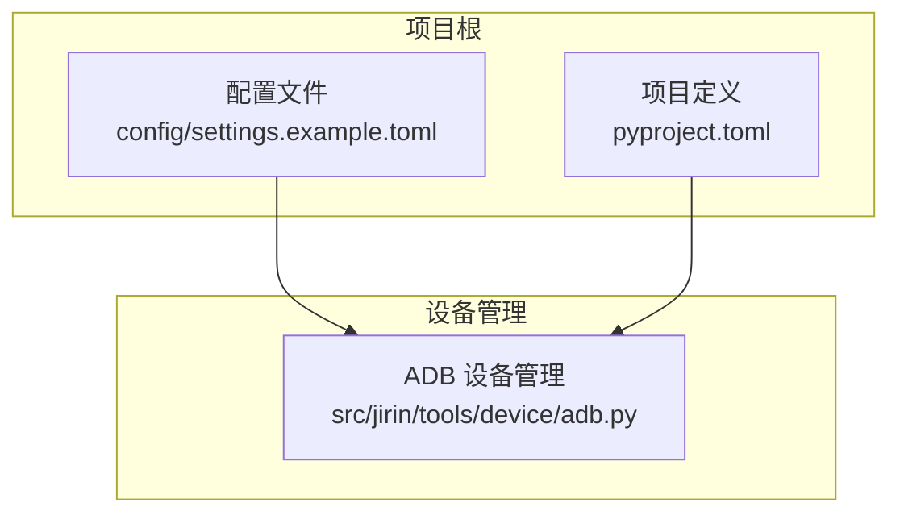
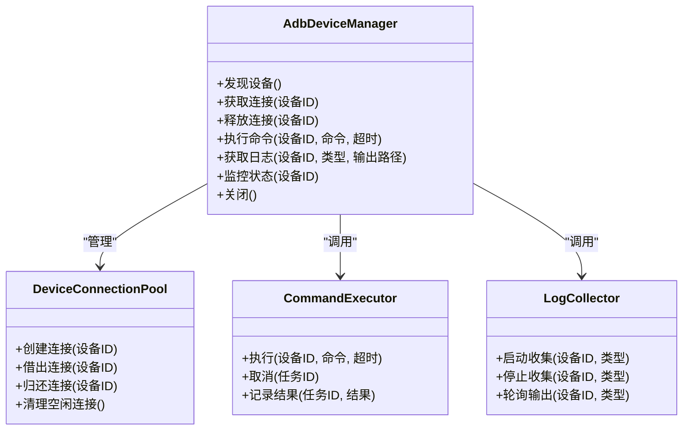
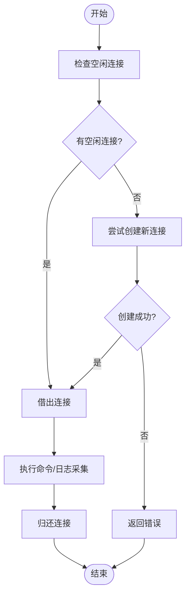
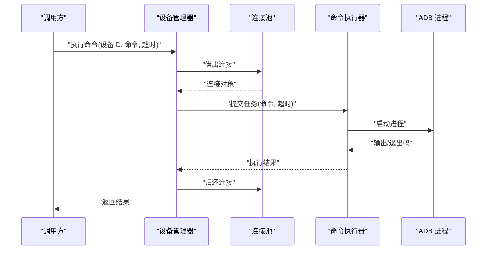
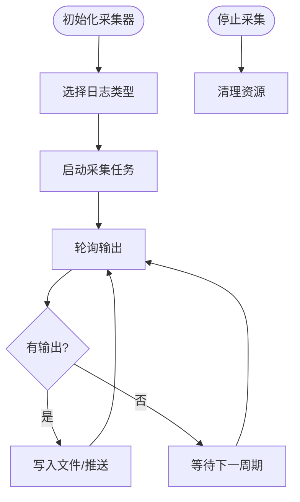
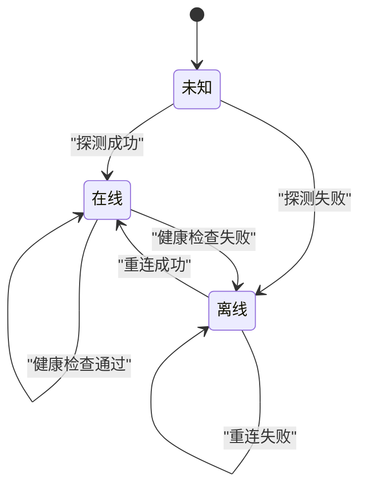
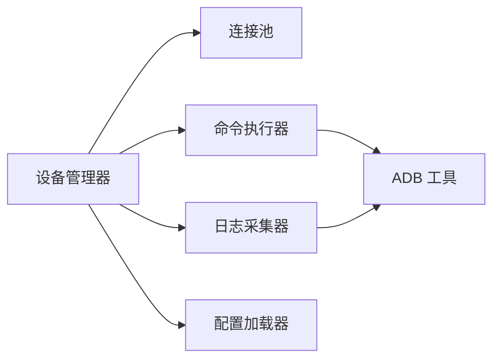

# 设备管理工具

<cite>
**本文引用的文件**   
- [src/jirin/tools/device/adb.py](file://src/jirin/tools/device/adb.py)
- [config/settings.example.toml](file://config/settings.example.toml)
- [config/settings.toml](file://config/settings.toml)
- [pyproject.toml](file://pyproject.toml)
</cite>

## 目录
1. [简介](#简介)
2. [项目结构](#项目结构)
3. [核心组件](#核心组件)
4. [架构总览](#架构总览)
5. [详细组件分析](#详细组件分析)
6. [依赖关系分析](#依赖关系分析)
7. [性能考虑](#性能考虑)
8. [故障排除指南](#故障排除指南)
9. [结论](#结论)
10. [附录](#附录)

## 简介
本技术文档聚焦于 Jirin 的设备管理工具，围绕 ADB（Android Debug Bridge）设备的连接管理、命令执行与日志获取等核心能力展开。文档将系统阐述设备发现机制、连接池管理、命令超时处理与错误恢复策略，并提供面向实际使用的初始化、命令执行、崩溃日志与堆栈跟踪采集示例路径说明。同时给出设备状态监控、连接重试机制与性能优化建议，以及常见问题排查方法与最佳实践。

## 项目结构
Jirin 的设备管理能力集中在 tools/device 模块中，其中 adb.py 是设备管理的核心实现；配置项通过 config 目录下的 settings.*.toml 提供；项目元数据与依赖定义位于 pyproject.toml。

图表来源
- [src/jirin/tools/device/adb.py](file://src/jirin/tools/device/adb.py)
- [config/settings.example.toml](file://config/settings.example.toml)
- [pyproject.toml](file://pyproject.toml)

章节来源
- [src/jirin/tools/device/adb.py](file://src/jirin/tools/device/adb.py)
- [config/settings.example.toml](file://config/settings.example.toml)
- [pyproject.toml](file://pyproject.toml)

## 核心组件
- ADB 设备管理器：负责设备发现、连接建立、命令执行、日志抓取、状态监控与生命周期管理。
- 配置加载器：从 TOML 配置文件中读取 ADB 相关参数（如超时、重试、日志路径等）。
- 外部依赖：ADB 命令行工具、Python 标准库（进程、线程、时间、异常等）。

章节来源
- [src/jirin/tools/device/adb.py](file://src/jirin/tools/device/adb.py)
- [config/settings.example.toml](file://config/settings.example.toml)

## 架构总览
设备管理工具采用“管理器 + 资源池”的架构模式：管理器对外暴露统一接口，内部维护设备连接池，协调命令调度、超时控制、错误恢复与日志采集。

图表来源
- [src/jirin/tools/device/adb.py](file://src/jirin/tools/device/adb.py)

## 详细组件分析

### ADB 设备管理器
- 职责
  - 设备发现：枚举已连接的 Android 设备并返回可用列表。
  - 连接管理：为每个设备维护一个连接对象，支持复用与回收。
  - 命令执行：封装 ADB shell 命令执行，支持超时与结果解析。
  - 日志采集：支持实时或一次性抓取崩溃日志、ANR、堆栈跟踪等。
  - 状态监控：周期性检查设备在线状态与关键指标。
  - 生命周期：初始化、优雅关闭与资源清理。
- 关键流程
  - 初始化：加载配置、启动连接池、注册信号处理器。
  - 执行命令：选择设备 -> 借出连接 -> 设置超时 -> 执行 -> 记录结果 -> 归还连接。
  - 日志采集：根据类型启动采集器 -> 按周期轮询输出 -> 写入文件或流式返回。
  - 错误恢复：捕获异常 -> 判断可恢复性 -> 触发重试或降级策略 -> 上报状态。
- 典型使用路径
  - 初始化设备管理器：参考 [src/jirin/tools/device/adb.py](file://src/jirin/tools/device/adb.py)
  - 执行 shell 命令：参考 [src/jirin/tools/device/adb.py](file://src/jirin/tools/device/adb.py)
  - 获取崩溃日志与堆栈跟踪：参考 [src/jirin/tools/device/adb.py](file://src/jirin/tools/device/adb.py)

章节来源
- [src/jirin/tools/device/adb.py](file://src/jirin/tools/device/adb.py)

### 连接池管理
- 设计要点
  - 连接对象：封装 ADB 会话，包含设备标识、句柄、最后使用时间、健康状态。
  - 池化策略：最大连接数、空闲超时、懒创建与预创建、驱逐策略。
  - 并发安全：读写锁保护共享状态，避免竞态条件。
  - 健康检查：心跳检测、命令探测、自动剔除不可用连接。
- 操作语义
  - 借出：若存在空闲且健康的连接则直接返回，否则尝试新建。
  - 归还：更新最后使用时间，标记为空闲，必要时触发清理。
  - 清理：定时任务扫描并关闭超过空闲阈值的连接。
- 图示

图表来源
- [src/jirin/tools/device/adb.py](file://src/jirin/tools/device/adb.py)

章节来源
- [src/jirin/tools/device/adb.py](file://src/jirin/tools/device/adb.py)

### 命令执行与超时处理
- 执行模型
  - 异步执行：基于子进程或事件循环驱动，避免阻塞主线程。
  - 超时控制：在进程层与应用层双重保障，确保及时释放资源。
  - 结果解析：区分 stdout/stderr，结构化返回退出码与输出片段。
- 超时与取消
  - 超时阈值：由配置项决定，默认值可在 settings.toml 中调整。
  - 取消机制：支持中断长时间运行的命令，清理残留进程。
- 错误分类
  - 网络/设备类：设备离线、权限不足、端口占用。
  - 命令类：语法错误、无输出、非零退出码。
  - 系统类：进程被杀、内存不足、IO 异常。
- 图示

图表来源
- [src/jirin/tools/device/adb.py](file://src/jirin/tools/device/adb.py)

章节来源
- [src/jirin/tools/device/adb.py](file://src/jirin/tools/device/adb.py)

### 日志采集与崩溃分析
- 采集类型
  - 崩溃日志：系统级与应用级崩溃信息。
  - ANR 日志：应用无响应日志。
  - 堆栈跟踪：Java/Kotlin/C++ 堆栈信息。
- 采集方式
  - 一次性抓取：适合快照分析。
  - 实时流式：适合持续监控与告警。
- 存储与输出
  - 本地文件：按设备与日期分目录组织。
  - 流式输出：供上层服务消费或转发至日志平台。
- 图示

图表来源
- [src/jirin/tools/device/adb.py](file://src/jirin/tools/device/adb.py)

章节来源
- [src/jirin/tools/device/adb.py](file://src/jirin/tools/device/adb.py)

### 设备状态监控与重试机制
- 状态维度
  - 在线/离线：基于 ping 或轻量命令探测。
  - 健康度：最近命令成功率、平均延迟、错误率。
  - 容量：当前连接数、队列长度、CPU/内存占用。
- 监控策略
  - 定时巡检：周期性拉取设备状态并聚合指标。
  - 事件驱动：对异常事件进行即时上报与告警。
- 重试策略
  - 指数退避：失败后逐步增加等待时间。
  - 熔断保护：连续失败达到阈值时暂停重试，避免雪崩。
  - 降级方案：切换备用设备或回退到只读操作。
- 图示

图表来源
- [src/jirin/tools/device/adb.py](file://src/jirin/tools/device/adb.py)

章节来源
- [src/jirin/tools/device/adb.py](file://src/jirin/tools/device/adb.py)

### 配置与环境
- 配置项建议
  - 超时：命令执行超时、连接建立超时、日志轮询间隔。
  - 重试：最大重试次数、退避策略、熔断阈值。
  - 路径：日志输出目录、临时文件目录。
  - 并发：连接池大小、最大并行命令数。
- 加载顺序
  - 默认值 -> 环境变量 -> 配置文件 -> 运行时覆盖。
- 示例位置
  - 示例配置模板：[config/settings.example.toml](file://config/settings.example.toml)
  - 当前配置：[config/settings.toml](file://config/settings.toml)

章节来源
- [config/settings.example.toml](file://config/settings.example.toml)
- [config/settings.toml](file://config/settings.toml)

## 依赖关系分析
- 内部依赖
  - 设备管理器依赖连接池、命令执行器、日志采集器。
  - 配置加载器为各组件提供参数。
- 外部依赖
  - ADB 命令行工具：必须安装并可执行。
  - Python 标准库：进程、线程、时间、异常、序列化等。
- 图示

图表来源
- [src/jirin/tools/device/adb.py](file://src/jirin/tools/device/adb.py)

章节来源
- [src/jirin/tools/device/adb.py](file://src/jirin/tools/device/adb.py)

## 性能考虑
- 连接复用：优先借出空闲连接，减少握手开销。
- 批量命令：合并短小命令，降低上下文切换成本。
- 异步执行：避免阻塞主线程，提升吞吐。
- 超时调优：根据业务 SLA 合理设置超时，避免长尾。
- 日志采样：高频日志按需采样，降低 IO 压力。
- 资源限制：限制最大连接数与并发命令数，防止过载。
- 缓存热点：对频繁查询的结果进行短期缓存。

## 故障排除指南
- 常见问题
  - 设备未识别：检查 USB 调试、驱动安装、ADB 版本兼容性。
  - 命令超时：确认设备负载、网络状况、命令复杂度。
  - 日志缺失：核对权限、路径、采集器是否启动。
  - 连接泄漏：检查归还逻辑与异常分支是否正确释放。
- 定位步骤
  - 查看设备列表与状态：确认设备在线与健康度。
  - 启用调试日志：提高日志级别，观察关键路径。
  - 复现最小用例：隔离问题范围，快速验证修复。
- 恢复策略
  - 自动重试：对瞬时错误进行指数退避重试。
  - 熔断降级：连续失败时暂停任务，等待恢复。
  - 人工介入：告警通知运维人员处理。

## 结论
本设备管理工具以连接池为核心，结合超时控制、错误恢复与日志采集，形成完整的 ADB 设备管理能力。通过合理的配置与监控，可在多设备场景下稳定运行，满足自动化测试与线上诊断需求。建议在生产环境完善告警与审计，持续优化性能与可靠性。

## 附录
- 初始化设备连接示例路径
  - [src/jirin/tools/device/adb.py](file://src/jirin/tools/device/adb.py)
- 执行 shell 命令示例路径
  - [src/jirin/tools/device/adb.py](file://src/jirin/tools/device/adb.py)
- 实时获取崩溃日志与堆栈跟踪示例路径
  - [src/jirin/tools/device/adb.py](file://src/jirin/tools/device/adb.py)
- 配置项参考
  - [config/settings.example.toml](file://config/settings.example.toml)
  - [config/settings.toml](file://config/settings.toml)
- 项目依赖与入口
  - [pyproject.toml](file://pyproject.toml)