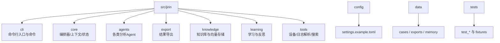
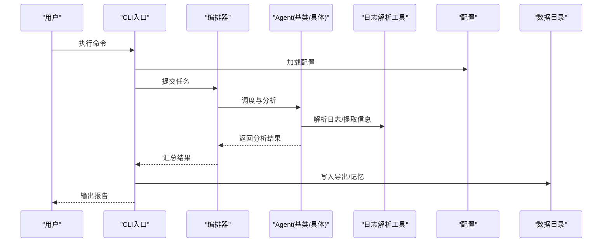
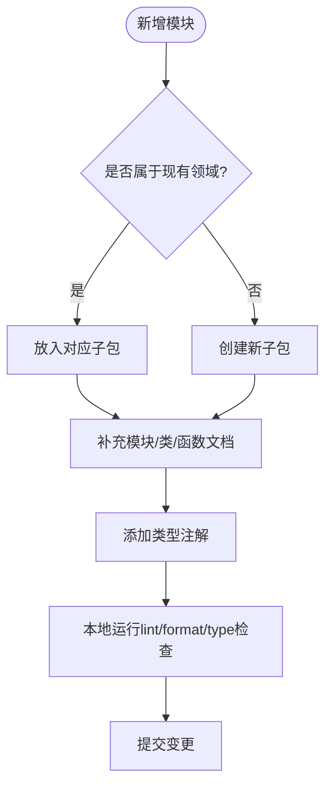
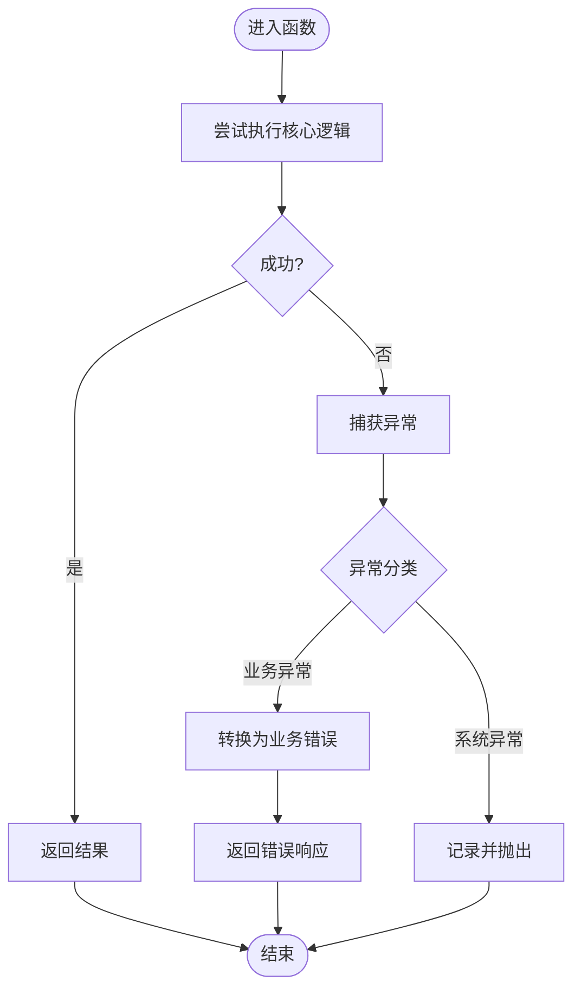
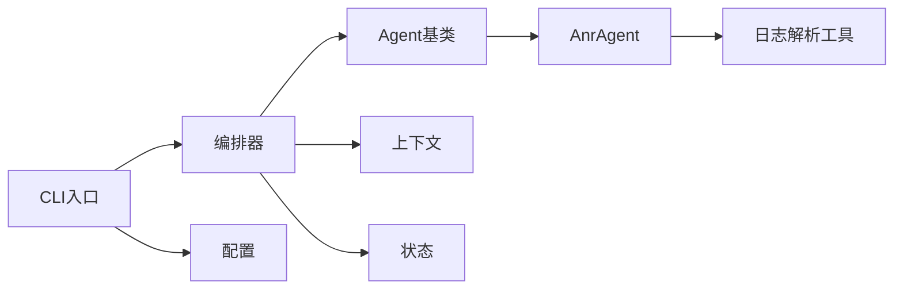

# 代码规范

<cite>
**本文引用的文件**   
- [pyproject.toml](file://pyproject.toml)
- [src/jirin/__init__.py](file://src/jirin/__init__.py)
- [src/jirin/core/orchestrator.py](file://src/jirin/core/orchestrator.py)
- [src/jirin/core/context.py](file://src/jirin/core/context.py)
- [src/jirin/core/state.py](file://src/jirin/core/state.py)
- [src/jirin/agents/base.py](file://src/jirin/agents/base.py)
- [src/jirin/agents/anr_agent.py](file://src/jirin/agents/anr_agent.py)
- [src/jirin/cli/main.py](file://src/jirin/cli/main.py)
- [src/jirin/tools/log_parser/common.py](file://src/jirin/tools/log_parser/common.py)
- [config/settings.example.toml](file://config/settings.example.toml)
</cite>

## 目录
1. [简介](#简介)
2. [项目结构](#项目结构)
3. [核心组件](#核心组件)
4. [架构总览](#架构总览)
5. [详细组件分析](#详细组件分析)
6. [依赖分析](#依赖分析)
7. [性能考虑](#性能考虑)
8. [故障排查指南](#故障排查指南)
9. [结论](#结论)
10. [附录](#附录)

## 简介
本规范旨在为Jirin项目建立统一的Python代码风格与工程实践，覆盖PEP8遵循、命名约定、注释标准、文件组织、模块导入顺序、异常处理模式、日志记录规范，并提供代码审查检查清单与自动化检查工具配置（flake8、black、mypy等）。目标是在保证可读性与可维护性的同时，提升团队协作效率与交付质量。

## 项目结构
Jirin采用分层与按功能域混合的组织方式：
- src/jirin：核心包，包含CLI入口、编排器、Agent体系、导出、知识管理、学习、工具等子模块
- config：运行时配置示例与默认配置
- data：数据与中间产物目录（cases、exports、memory）
- tests：测试用例与夹具

**图表来源** 
- [src/jirin/__init__.py](file://src/jirin/__init__.py)
- [src/jirin/cli/main.py](file://src/jirin/cli/main.py)
- [src/jirin/core/orchestrator.py](file://src/jirin/core/orchestrator.py)
- [src/jirin/core/context.py](file://src/jirin/core/context.py)
- [src/jirin/core/state.py](file://src/jirin/core/state.py)
- [src/jirin/agents/base.py](file://src/jirin/agents/base.py)
- [src/jirin/agents/anr_agent.py](file://src/jirin/agents/anr_agent.py)
- [src/jirin/tools/log_parser/common.py](file://src/jirin/tools/log_parser/common.py)
- [config/settings.example.toml](file://config/settings.example.toml)

**章节来源**
- [src/jirin/__init__.py](file://src/jirin/__init__.py)
- [src/jirin/cli/main.py](file://src/jirin/cli/main.py)
- [src/jirin/core/orchestrator.py](file://src/jirin/core/orchestrator.py)
- [src/jirin/core/context.py](file://src/jirin/core/context.py)
- [src/jirin/core/state.py](file://src/jirin/core/state.py)
- [src/jirin/agents/base.py](file://src/jirin/agents/base.py)
- [src/jirin/agents/anr_agent.py](file://src/jirin/agents/anr_agent.py)
- [src/jirin/tools/log_parser/common.py](file://src/jirin/tools/log_parser/common.py)
- [config/settings.example.toml](file://config/settings.example.toml)

## 核心组件
- CLI入口与命令注册：提供统一命令行接口，负责参数解析与命令分发
- 编排器：协调Agent执行流程、上下文传递与状态管理
- Agent基类与具体实现：定义Agent抽象契约与通用能力，具体Agent实现不同分析逻辑
- 上下文与状态：承载运行期上下文与持久化状态
- 日志解析工具：提供通用解析能力与具体日志格式解析

**章节来源**
- [src/jirin/cli/main.py](file://src/jirin/cli/main.py)
- [src/jirin/core/orchestrator.py](file://src/jirin/core/orchestrator.py)
- [src/jirin/core/context.py](file://src/jirin/core/context.py)
- [src/jirin/core/state.py](file://src/jirin/core/state.py)
- [src/jirin/agents/base.py](file://src/jirin/agents/base.py)
- [src/jirin/agents/anr_agent.py](file://src/jirin/agents/anr_agent.py)
- [src/jirin/tools/log_parser/common.py](file://src/jirin/tools/log_parser/common.py)

## 架构总览
下图展示从CLI到编排器、Agent与工具的调用关系，以及配置与数据的流向。

**图表来源** 
- [src/jirin/cli/main.py](file://src/jirin/cli/main.py)
- [src/jirin/core/orchestrator.py](file://src/jirin/core/orchestrator.py)
- [src/jirin/agents/base.py](file://src/jirin/agents/base.py)
- [src/jirin/tools/log_parser/common.py](file://src/jirin/tools/log_parser/common.py)
- [config/settings.example.toml](file://config/settings.example.toml)

## 详细组件分析

### Python代码风格与命名规范
- PEP8遵循
  - 缩进：使用空格，每级4个空格；行宽建议不超过88字符（与Black兼容）
  - 空行：模块级两个空行，类方法之间一个空行
  - 引号：字符串优先使用双引号，保持一致性
  - 运算符与逗号后加空格，避免多余空格
- 命名约定
  - 模块与包：小写+下划线，如 log_parser
  - 类名：大驼峰，如 AnrAgent
  - 函数与方法：小写+下划线，如 parse_log
  - 常量：大写+下划线，如 MAX_RETRIES
  - 私有成员：单下划线前缀，如 _cache
- 类型提示
  - 所有公开API建议使用类型注解
  - 复杂类型使用 typing 模块或内置泛型
- 文档字符串
  - 模块级：说明用途、依赖、外部交互
  - 类级：职责、生命周期、线程安全说明
  - 函数/方法：参数、返回值、异常、副作用、复杂度

**章节来源**
- [src/jirin/agents/base.py](file://src/jirin/agents/base.py)
- [src/jirin/core/orchestrator.py](file://src/jirin/core/orchestrator.py)
- [src/jirin/tools/log_parser/common.py](file://src/jirin/tools/log_parser/common.py)

### 注释标准
- 公共API必须包含docstring，描述行为、边界条件与错误语义
- 复杂算法需附简要思路与时间/空间复杂度说明
- 对外部系统交互（ADB、文件系统、网络）需标注风险与重试策略
- 临时方案与TODO需以明确标签标记并关联问题追踪

**章节来源**
- [src/jirin/agents/anr_agent.py](file://src/jirin/agents/anr_agent.py)
- [src/jirin/core/context.py](file://src/jirin/core/context.py)

### 文件组织结构
- 包内模块按职责拆分，避免单文件过大
- 工具类放入 tools 子包，按领域划分（device、log_parser、search）
- 配置集中管理，示例与默认值分离
- 数据目录仅存放产物，不纳入版本控制

**图表来源** 
- [src/jirin/tools/log_parser/common.py](file://src/jirin/tools/log_parser/common.py)
- [src/jirin/agents/base.py](file://src/jirin/agents/base.py)
- [src/jirin/core/state.py](file://src/jirin/core/state.py)

### 模块导入顺序
- 标准库
- 第三方库
- 本地应用模块（相对导入用于同包内，绝对导入用于跨包）
- 禁止循环导入；必要时延迟导入或重构

**章节来源**
- [src/jirin/core/orchestrator.py](file://src/jirin/core/orchestrator.py)
- [src/jirin/agents/anr_agent.py](file://src/jirin/agents/anr_agent.py)

### 异常处理模式
- 自定义业务异常继承自统一基类，携带结构化错误码与上下文
- 捕获范围最小化，避免吞掉异常；在边界处转换为用户可见错误
- 对I/O与外部系统调用增加重试与退避策略
- 记录异常时包含必要上下文（请求ID、输入摘要、堆栈）

**图表来源** 
- [src/jirin/core/orchestrator.py](file://src/jirin/core/orchestrator.py)
- [src/jirin/tools/log_parser/common.py](file://src/jirin/tools/log_parser/common.py)

### 日志记录规范
- 使用标准logging或结构化日志库，避免print
- 日志级别：DEBUG/INFO/WARNING/ERROR/CRITICAL，合理分级
- 敏感信息脱敏（路径、密钥、用户标识）
- 关键路径打点：开始/结束、耗时、失败原因
- 日志输出至文件与控制台，支持轮转

**章节来源**
- [src/jirin/core/orchestrator.py](file://src/jirin/core/orchestrator.py)
- [src/jirin/tools/log_parser/common.py](file://src/jirin/tools/log_parser/common.py)

### 配置与环境
- 使用TOML进行配置管理，示例与默认值分离
- 启动时合并默认配置与用户配置，校验必填项
- 敏感配置通过环境变量注入

**章节来源**
- [config/settings.example.toml](file://config/settings.example.toml)

## 依赖分析
- 内部依赖
  - CLI依赖编排器与命令实现
  - 编排器依赖Agent基类与上下文/状态
  - Agent依赖日志解析工具与外部设备接口
- 外部依赖
  - 配置文件读取、日志框架、类型检查与格式化/静态检查工具

**图表来源** 
- [src/jirin/cli/main.py](file://src/jirin/cli/main.py)
- [src/jirin/core/orchestrator.py](file://src/jirin/core/orchestrator.py)
- [src/jirin/agents/base.py](file://src/jirin/agents/base.py)
- [src/jirin/agents/anr_agent.py](file://src/jirin/agents/anr_agent.py)
- [src/jirin/core/context.py](file://src/jirin/core/context.py)
- [src/jirin/core/state.py](file://src/jirin/core/state.py)
- [src/jirin/tools/log_parser/common.py](file://src/jirin/tools/log_parser/common.py)
- [config/settings.example.toml](file://config/settings.example.toml)

**章节来源**
- [src/jirin/cli/main.py](file://src/jirin/cli/main.py)
- [src/jirin/core/orchestrator.py](file://src/jirin/core/orchestrator.py)
- [src/jirin/agents/base.py](file://src/jirin/agents/base.py)
- [src/jirin/agents/anr_agent.py](file://src/jirin/agents/anr_agent.py)
- [src/jirin/core/context.py](file://src/jirin/core/context.py)
- [src/jirin/core/state.py](file://src/jirin/core/state.py)
- [src/jirin/tools/log_parser/common.py](file://src/jirin/tools/log_parser/common.py)
- [config/settings.example.toml](file://config/settings.example.toml)

## 性能考虑
- 避免在热路径中进行I/O与重计算，使用缓存与惰性加载
- 批量处理日志与数据，减少对象创建与GC压力
- 合理使用生成器与迭代器，降低内存占用
- 对长耗时操作引入超时与取消机制
- 监控关键指标：CPU、内存、I/O等待、错误率

[本节为通用指导，无需特定文件引用]

## 故障排查指南
- 常见问题定位
  - 配置缺失或类型错误：检查配置键与默认值
  - 日志解析失败：确认日志格式与正则匹配
  - 外部设备不可用：检查ADB连接与权限
- 诊断步骤
  - 开启DEBUG日志，收集完整堆栈
  - 复现最小用例，隔离问题范围
  - 验证数据完整性与一致性
- 恢复策略
  - 重试与回滚，保留断点以便续跑
  - 降级模式：跳过非关键步骤继续执行

**章节来源**
- [src/jirin/tools/log_parser/common.py](file://src/jirin/tools/log_parser/common.py)
- [src/jirin/core/orchestrator.py](file://src/jirin/core/orchestrator.py)

## 结论
通过统一的代码风格、清晰的模块边界、严格的异常与日志规范，以及完善的自动化检查与审查清单，Jirin项目可在保持高可维护性的同时快速演进。建议在CI中强制运行格式化、静态检查与类型检查，确保团队一致性与质量基线。

[本节为总结性内容，无需特定文件引用]

## 附录

### 代码审查检查清单
- 风格与可读性
  - 遵循PEP8与Black格式
  - 命名清晰、无魔法字符串/数字
  - 文档字符串完整且准确
- 正确性与健壮性
  - 边界条件与异常路径已覆盖
  - 资源释放与锁使用正确
  - 无循环导入
- 安全与合规
  - 敏感信息未硬编码
  - 输入校验与脱敏到位
- 性能与可观测性
  - 热点路径优化
  - 关键路径日志与指标完善
- 测试与可维护性
  - 单元测试覆盖率达标
  - 变更影响评估与回归用例

[本节为通用清单，无需特定文件引用]

### 自动化检查工具配置（基于pyproject.toml）
- Black（格式化）
  - 行宽：88
  - 目标Python版本：与项目一致
- Flake8（风格检查）
  - 忽略规则：E501（由Black接管）、W503（换行符位置）
  - 最大复杂度限制：圈复杂度≤10
- MyPy（类型检查）
  - 严格模式：启用大部分严格选项
  - 忽略未声明类型的外部库
- 集成建议
  - pre-commit钩子：format → lint → type-check
  - CI流水线：并行执行上述检查，失败阻断合并

**章节来源**
- [pyproject.toml](file://pyproject.toml)