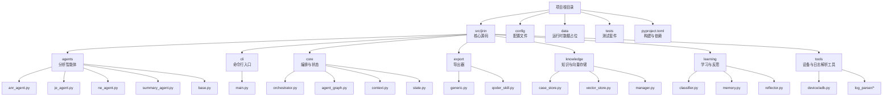
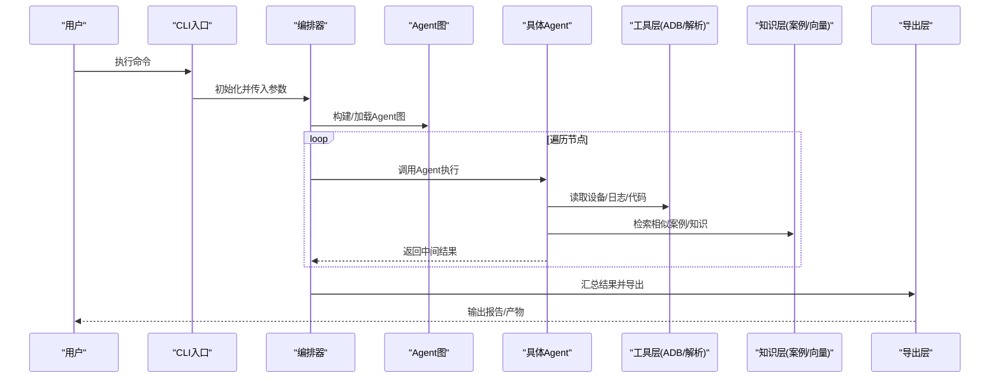
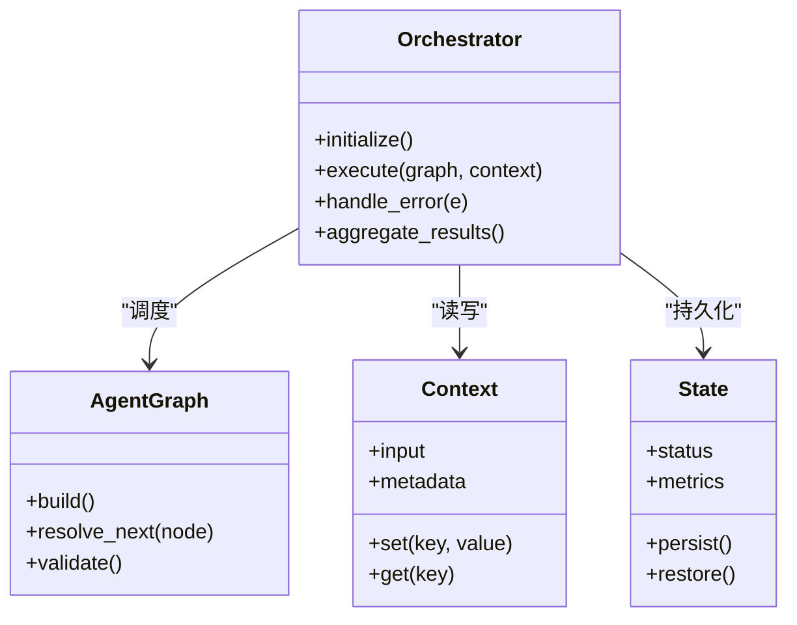
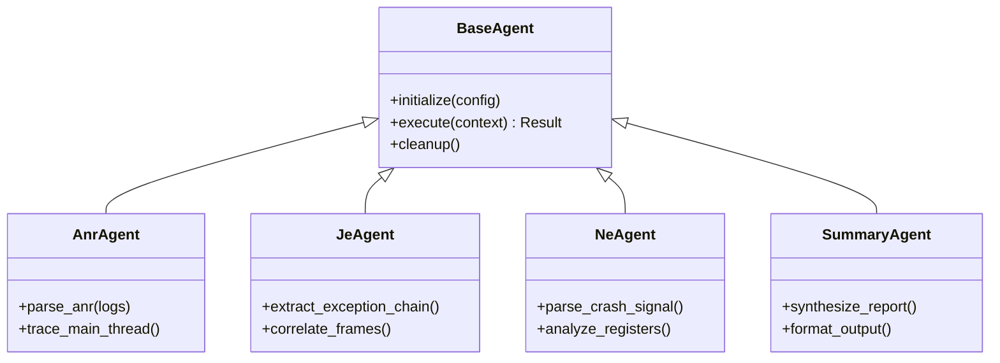
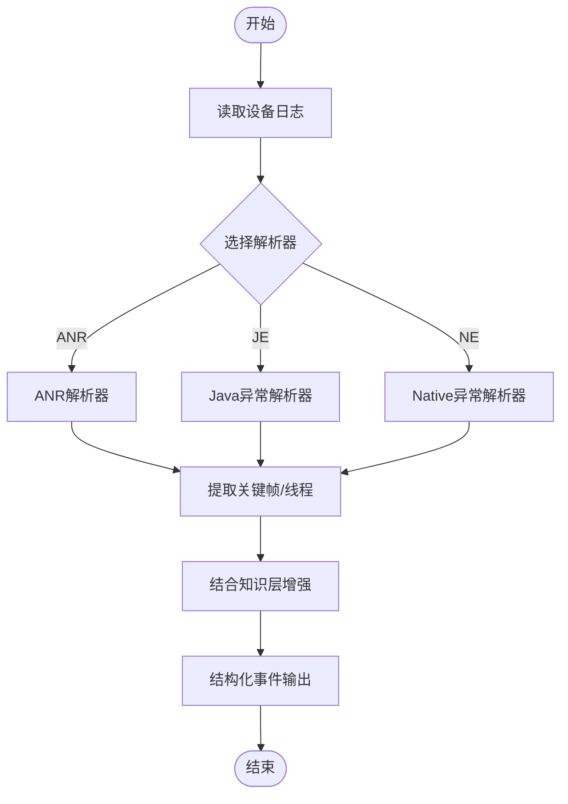
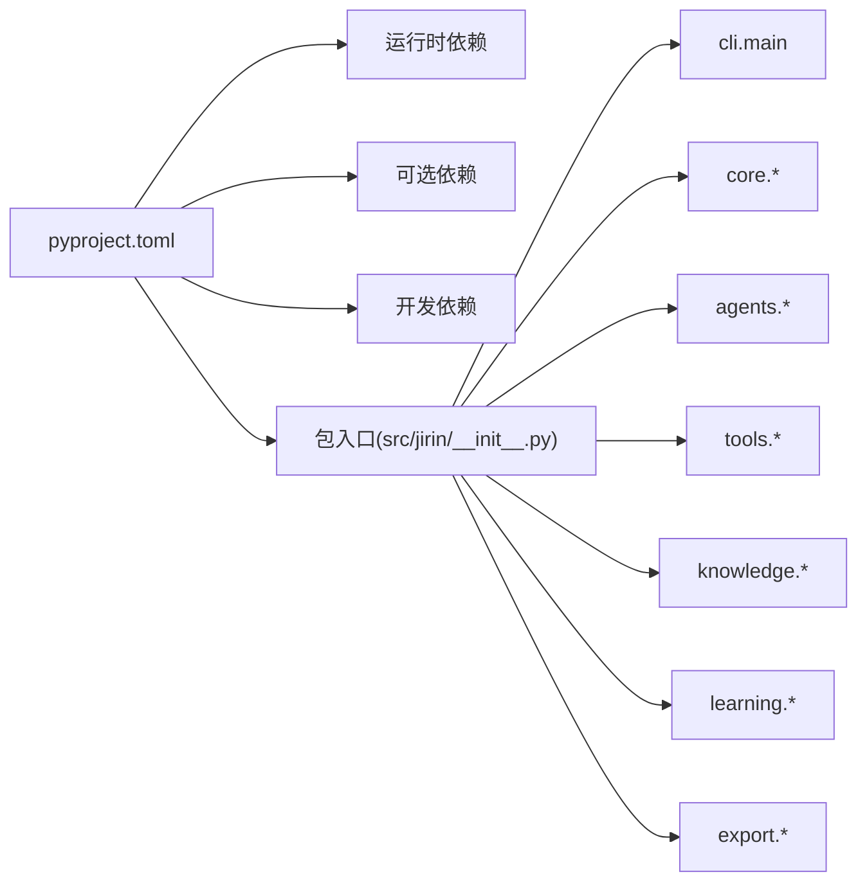

# 开发指南

<cite>
**本文引用的文件**   
- [pyproject.toml](file://pyproject.toml)
- [config/settings.example.toml](file://config/settings.example.toml)
- [config/settings.toml](file://config/settings.toml)
- [src/jirin/__init__.py](file://src/jirin/__init__.py)
- [src/jirin/cli/main.py](file://src/jirin/cli/main.py)
- [src/jirin/core/orchestrator.py](file://src/jirin/core/orchestrator.py)
- [src/jirin/core/agent_graph.py](file://src/jirin/core/agent_graph.py)
- [src/jirin/core/context.py](file://src/jirin/core/context.py)
- [src/jirin/core/state.py](file://src/jirin/core/state.py)
- [src/jirin/agents/base.py](file://src/jirin/agents/base.py)
- [src/jirin/agents/anr_agent.py](file://src/jirin/agents/anr_agent.py)
- [src/jirin/agents/je_agent.py](file://src/jirin/agents/je_agent.py)
- [src/jirin/agents/ne_agent.py](file://src/jirin/agents/ne_agent.py)
- [src/jirin/agents/summary_agent.py](file://src/jirin/agents/summary_agent.py)
- [src/jirin/tools/device/adb.py](file://src/jirin/tools/device/adb.py)
- [src/jirin/tools/log_parser/anr_parser.py](file://src/jirin/tools/log_parser/anr_parser.py)
- [src/jirin/tools/log_parser/je_parser.py](file://src/jirin/tools/log_parser/je_parser.py)
- [src/jirin/tools/log_parser/ne_parser.py](file://src/jirin/tools/log_parser/ne_parser.py)
- [src/jirin/knowledge/case_store.py](file://src/jirin/knowledge/case_store.py)
- [src/jirin/knowledge/vector_store.py](file://src/jirin/knowledge/vector_store.py)
- [src/jirin/knowledge/manager.py](file://src/jirin/knowledge/manager.py)
- [src/jirin/export/generic.py](file://src/jirin/export/generic.py)
- [src/jirin/export/qoder_skill.py](file://src/jirin/export/qoder_skill.py)
- [src/jirin/learning/classifier.py](file://src/jirin/learning/classifier.py)
- [src/jirin/learning/memory.py](file://src/jirin/learning/memory.py)
- [src/jirin/learning/reflector.py](file://src/jirin/learning/reflector.py)
- [tests/fixtures/](file://tests/fixtures/)
</cite>

## 目录
1. [简介](#简介)
2. [项目结构](#项目结构)
3. [核心组件](#核心组件)
4. [架构总览](#架构总览)
5. [详细组件分析](#详细组件分析)
6. [依赖分析](#依赖分析)
7. [性能考虑](#性能考虑)
8. [故障排查指南](#故障排查指南)
9. [结论](#结论)
10. [附录](#附录)

## 简介
本指南面向Jirin项目的开发者，覆盖从环境搭建、依赖安装、代码规范、测试策略与编写方法，到Git工作流、代码审查要求、贡献流程、调试技巧、性能分析方法、问题排查流程、新功能开发模板、单元测试与集成测试最佳实践，以及发布流程与版本管理策略。目标是帮助新成员快速上手并高效协作。

## 项目结构
Jirin采用Python包组织方式，核心逻辑位于src/jirin下，按功能域划分为agents、cli、core、export、knowledge、learning、tools等模块；配置集中于config；测试用例位于tests；构建与依赖声明在pyproject.toml中。

图表来源
- [pyproject.toml](file://pyproject.toml)
- [src/jirin/cli/main.py](file://src/jirin/cli/main.py)
- [src/jirin/core/orchestrator.py](file://src/jirin/core/orchestrator.py)
- [src/jirin/core/agent_graph.py](file://src/jirin/core/agent_graph.py)
- [src/jirin/core/context.py](file://src/jirin/core/context.py)
- [src/jirin/core/state.py](file://src/jirin/core/state.py)
- [src/jirin/agents/base.py](file://src/jirin/agents/base.py)
- [src/jirin/agents/anr_agent.py](file://src/jirin/agents/anr_agent.py)
- [src/jirin/agents/je_agent.py](file://src/jirin/agents/je_agent.py)
- [src/jirin/agents/ne_agent.py](file://src/jirin/agents/ne_agent.py)
- [src/jirin/agents/summary_agent.py](file://src/jirin/agents/summary_agent.py)
- [src/jirin/tools/device/adb.py](file://src/jirin/tools/device/adb.py)
- [src/jirin/tools/log_parser/anr_parser.py](file://src/jirin/tools/log_parser/anr_parser.py)
- [src/jirin/tools/log_parser/je_parser.py](file://src/jirin/tools/log_parser/je_parser.py)
- [src/jirin/tools/log_parser/ne_parser.py](file://src/jirin/tools/log_parser/ne_parser.py)
- [src/jirin/knowledge/case_store.py](file://src/jirin/knowledge/case_store.py)
- [src/jirin/knowledge/vector_store.py](file://src/jirin/knowledge/vector_store.py)
- [src/jirin/knowledge/manager.py](file://src/jirin/knowledge/manager.py)
- [src/jirin/export/generic.py](file://src/jirin/export/generic.py)
- [src/jirin/export/qoder_skill.py](file://src/jirin/export/qoder_skill.py)
- [src/jirin/learning/classifier.py](file://src/jirin/learning/classifier.py)
- [src/jirin/learning/memory.py](file://src/jirin/learning/memory.py)
- [src/jirin/learning/reflector.py](file://src/jirin/learning/reflector.py)

章节来源
- [pyproject.toml](file://pyproject.toml)
- [src/jirin/cli/main.py](file://src/jirin/cli/main.py)

## 核心组件
- CLI入口：提供命令注册与参数解析，驱动上层编排器执行任务。
- 编排器（Orchestrator）：协调Agent图执行、上下文传递与状态流转。
- Agent基类与各具体Agent：定义统一的分析与处理接口，实现ANR、Java异常、Native异常等场景的专用逻辑。
- 工具层：设备交互（ADB）、日志解析（ANR/JE/NE）、代码搜索等。
- 知识层：案例库与向量检索，支撑可复用经验与相似案例匹配。
- 学习层：分类器、记忆与反思机制，用于持续改进分析质量。
- 导出层：将分析结果导出为通用格式或特定技能包。

章节来源
- [src/jirin/cli/main.py](file://src/jirin/cli/main.py)
- [src/jirin/core/orchestrator.py](file://src/jirin/core/orchestrator.py)
- [src/jirin/core/agent_graph.py](file://src/jirin/core/agent_graph.py)
- [src/jirin/core/context.py](file://src/jirin/core/context.py)
- [src/jirin/core/state.py](file://src/jirin/core/state.py)
- [src/jirin/agents/base.py](file://src/jirin/agents/base.py)
- [src/jirin/agents/anr_agent.py](file://src/jirin/agents/anr_agent.py)
- [src/jirin/agents/je_agent.py](file://src/jirin/agents/je_agent.py)
- [src/jirin/agents/ne_agent.py](file://src/jirin/agents/ne_agent.py)
- [src/jirin/agents/summary_agent.py](file://src/jirin/agents/summary_agent.py)
- [src/jirin/tools/device/adb.py](file://src/jirin/tools/device/adb.py)
- [src/jirin/tools/log_parser/anr_parser.py](file://src/jirin/tools/log_parser/anr_parser.py)
- [src/jirin/tools/log_parser/je_parser.py](file://src/jirin/tools/log_parser/je_parser.py)
- [src/jirin/tools/log_parser/ne_parser.py](file://src/jirin/tools/log_parser/ne_parser.py)
- [src/jirin/knowledge/case_store.py](file://src/jirin/knowledge/case_store.py)
- [src/jirin/knowledge/vector_store.py](file://src/jirin/knowledge/vector_store.py)
- [src/jirin/knowledge/manager.py](file://src/jirin/knowledge/manager.py)
- [src/jirin/export/generic.py](file://src/jirin/export/generic.py)
- [src/jirin/export/qoder_skill.py](file://src/jirin/export/qoder_skill.py)
- [src/jirin/learning/classifier.py](file://src/jirin/learning/classifier.py)
- [src/jirin/learning/memory.py](file://src/jirin/learning/memory.py)
- [src/jirin/learning/reflector.py](file://src/jirin/learning/reflector.py)

## 架构总览
Jirin以“CLI -> 编排器 -> Agent图 -> 工具/知识/学习”的分层架构运行。CLI负责接收用户指令，编排器根据Agent图调度各Agent执行，Agent通过工具层获取设备与日志数据，结合知识层的案例与向量检索进行推理，最终由导出层输出结果。

图表来源
- [src/jirin/cli/main.py](file://src/jirin/cli/main.py)
- [src/jirin/core/orchestrator.py](file://src/jirin/core/orchestrator.py)
- [src/jirin/core/agent_graph.py](file://src/jirin/core/agent_graph.py)
- [src/jirin/agents/base.py](file://src/jirin/agents/base.py)
- [src/jirin/tools/device/adb.py](file://src/jirin/tools/device/adb.py)
- [src/jirin/tools/log_parser/anr_parser.py](file://src/jirin/tools/log_parser/anr_parser.py)
- [src/jirin/knowledge/case_store.py](file://src/jirin/knowledge/case_store.py)
- [src/jirin/knowledge/vector_store.py](file://src/jirin/knowledge/vector_store.py)
- [src/jirin/export/generic.py](file://src/jirin/export/generic.py)

## 详细组件分析

### 命令行与入口
- 职责：注册子命令、解析参数、初始化配置与日志、调用编排器执行。
- 关键点：
  - 使用统一入口脚本暴露jirin命令。
  - 支持多子命令（如analyze、export、learn等）。
  - 与配置系统对接，加载settings。

章节来源
- [src/jirin/cli/main.py](file://src/jirin/cli/main.py)
- [config/settings.example.toml](file://config/settings.example.toml)
- [config/settings.toml](file://config/settings.toml)

### 编排器与Agent图
- 编排器：负责生命周期管理、错误传播、并发控制与结果聚合。
- Agent图：描述节点与边，决定执行顺序与条件分支。
- 上下文与状态：贯穿请求的生命周期，保存输入、中间态与输出。

图表来源
- [src/jirin/core/orchestrator.py](file://src/jirin/core/orchestrator.py)
- [src/jirin/core/agent_graph.py](file://src/jirin/core/agent_graph.py)
- [src/jirin/core/context.py](file://src/jirin/core/context.py)
- [src/jirin/core/state.py](file://src/jirin/core/state.py)

章节来源
- [src/jirin/core/orchestrator.py](file://src/jirin/core/orchestrator.py)
- [src/jirin/core/agent_graph.py](file://src/jirin/core/agent_graph.py)
- [src/jirin/core/context.py](file://src/jirin/core/context.py)
- [src/jirin/core/state.py](file://src/jirin/core/state.py)

### Agent体系
- 基类：定义统一接口（初始化、执行、清理），约束输入输出契约。
- 具体Agent：
  - ANR分析：解析ANR堆栈、定位主线程阻塞点。
  - Java异常分析：提取异常链、关键帧与调用栈。
  - Native异常分析：解析崩溃信号、寄存器与内存信息。
  - 摘要Agent：汇总多源信息生成可读报告。

图表来源
- [src/jirin/agents/base.py](file://src/jirin/agents/base.py)
- [src/jirin/agents/anr_agent.py](file://src/jirin/agents/anr_agent.py)
- [src/jirin/agents/je_agent.py](file://src/jirin/agents/je_agent.py)
- [src/jirin/agents/ne_agent.py](file://src/jirin/agents/ne_agent.py)
- [src/jirin/agents/summary_agent.py](file://src/jirin/agents/summary_agent.py)

章节来源
- [src/jirin/agents/base.py](file://src/jirin/agents/base.py)
- [src/jirin/agents/anr_agent.py](file://src/jirin/agents/anr_agent.py)
- [src/jirin/agents/je_agent.py](file://src/jirin/agents/je_agent.py)
- [src/jirin/agents/ne_agent.py](file://src/jirin/agents/ne_agent.py)
- [src/jirin/agents/summary_agent.py](file://src/jirin/agents/summary_agent.py)

### 工具层（设备与日志解析）
- 设备工具：封装ADB交互，拉取日志、查询进程与设备信息。
- 日志解析：针对ANR/JE/NE的专用解析器，抽取结构化事件。
- 代码搜索：辅助定位相关源码位置与调用关系。

图表来源
- [src/jirin/tools/device/adb.py](file://src/jirin/tools/device/adb.py)
- [src/jirin/tools/log_parser/anr_parser.py](file://src/jirin/tools/log_parser/anr_parser.py)
- [src/jirin/tools/log_parser/je_parser.py](file://src/jirin/tools/log_parser/je_parser.py)
- [src/jirin/tools/log_parser/ne_parser.py](file://src/jirin/tools/log_parser/ne_parser.py)
- [src/jirin/knowledge/manager.py](file://src/jirin/knowledge/manager.py)

章节来源
- [src/jirin/tools/device/adb.py](file://src/jirin/tools/device/adb.py)
- [src/jirin/tools/log_parser/anr_parser.py](file://src/jirin/tools/log_parser/anr_parser.py)
- [src/jirin/tools/log_parser/je_parser.py](file://src/jirin/tools/log_parser/je_parser.py)
- [src/jirin/tools/log_parser/ne_parser.py](file://src/jirin/tools/log_parser/ne_parser.py)

### 知识层（案例与向量检索）
- 案例库：存储历史案例与修复方案，支持导入导出。
- 向量存储：对案例与日志片段进行向量化，提供相似度检索。
- 管理器：统一访问接口，维护索引与缓存。

章节来源
- [src/jirin/knowledge/case_store.py](file://src/jirin/knowledge/case_store.py)
- [src/jirin/knowledge/vector_store.py](file://src/jirin/knowledge/vector_store.py)
- [src/jirin/knowledge/manager.py](file://src/jirin/knowledge/manager.py)

### 学习层（分类、记忆与反思）
- 分类器：基于特征对问题类型进行分类，指导后续Agent路径。
- 记忆：记录运行轨迹与决策依据，便于回溯与审计。
- 反思：对失败案例进行复盘，更新规则与阈值。

章节来源
- [src/jirin/learning/classifier.py](file://src/jirin/learning/classifier.py)
- [src/jirin/learning/memory.py](file://src/jirin/learning/memory.py)
- [src/jirin/learning/reflector.py](file://src/jirin/learning/reflector.py)

### 导出层（通用与技能包）
- 通用导出：将结果序列化为JSON/Markdown等通用格式。
- 技能包导出：生成特定平台或IDE可用的技能包，便于二次集成。

章节来源
- [src/jirin/export/generic.py](file://src/jirin/export/generic.py)
- [src/jirin/export/qoder_skill.py](file://src/jirin/export/qoder_skill.py)

## 依赖分析
- 构建与依赖：通过pyproject.toml声明运行时依赖、可选依赖与开发依赖。
- 包入口：通过包初始化文件暴露顶层API与子模块。
- 外部集成：ADB工具链、日志解析库、向量数据库客户端等。

图表来源
- [pyproject.toml](file://pyproject.toml)
- [src/jirin/__init__.py](file://src/jirin/__init__.py)
- [src/jirin/cli/main.py](file://src/jirin/cli/main.py)

章节来源
- [pyproject.toml](file://pyproject.toml)
- [src/jirin/__init__.py](file://src/jirin/__init__.py)

## 性能考虑
- I/O优化：批量读取日志、异步拉取设备数据，减少阻塞等待。
- 解析优化：增量解析与流式处理，避免一次性加载大文件。
- 缓存策略：对向量检索与案例匹配结果进行短期缓存。
- 并发控制：限制并行度，避免资源争用与OOM。
- 监控指标：在编排器中收集耗时、吞吐与错误率，便于定位瓶颈。

[本节为通用建议，不直接分析具体文件]

## 故障排查指南
- 常见问题
  - 设备连接失败：检查ADB路径与权限，确认设备在线。
  - 日志缺失：确认日志采集范围与时间窗口，验证解析器是否匹配。
  - 向量检索无结果：检查索引是否构建完成，相似度阈值是否过高。
- 诊断步骤
  - 启用详细日志，定位失败阶段。
  - 复现最小用例，隔离问题边界。
  - 检查配置项与外部服务连通性。
- 恢复措施
  - 重建索引、回滚配置变更、重启服务。
  - 使用导出产物进行离线分析。

章节来源
- [src/jirin/tools/device/adb.py](file://src/jirin/tools/device/adb.py)
- [src/jirin/knowledge/vector_store.py](file://src/jirin/knowledge/vector_store.py)
- [src/jirin/core/orchestrator.py](file://src/jirin/core/orchestrator.py)

## 结论
Jirin以模块化与可扩展为核心设计，通过清晰的层次划分与统一接口，实现了跨场景的分析能力。遵循本指南中的规范与实践，可有效提升开发效率与交付质量。

[本节为总结性内容，不直接分析具体文件]

## 附录

### 开发环境搭建
- 前置条件
  - Python解释器与包管理工具。
  - ADB工具链已安装并可执行。
- 克隆与初始化
  - 克隆仓库至本地。
  - 进入项目根目录。
- 虚拟环境与依赖
  - 创建并激活虚拟环境。
  - 使用pyproject.toml安装依赖（含开发依赖）。
- 配置
  - 复制示例配置为实际配置。
  - 填写必要参数（如ADB路径、导出目录等）。
- 验证
  - 运行CLI帮助命令，确认命令可用。
  - 执行一次轻量分析任务，验证端到端流程。

章节来源
- [pyproject.toml](file://pyproject.toml)
- [config/settings.example.toml](file://config/settings.example.toml)
- [config/settings.toml](file://config/settings.toml)
- [src/jirin/cli/main.py](file://src/jirin/cli/main.py)

### 代码规范约定
- 命名与风格
  - 模块与包名使用小写下划线。
  - 类名使用驼峰，函数与方法使用小写下划线。
  - 常量使用大写加下划线。
- 文档与注释
  - 模块级docstring说明用途与依赖。
  - 公共API提供清晰参数与返回值说明。
- 错误处理
  - 明确异常类型与错误码。
  - 对外抛出友好错误信息，内部保留详细堆栈。
- 配置管理
  - 所有外部可调参数集中到配置文件中。
  - 提供默认值与校验逻辑。

[本节为通用规范，不直接分析具体文件]

### 测试策略与编写方法
- 分层测试
  - 单元测试：覆盖工具函数、解析器与Agent核心逻辑。
  - 集成测试：验证CLI到编排器到工具的完整链路。
  - 回归测试：基于历史案例集进行稳定性验证。
- 测试数据
  - 使用fixtures存放样例日志与配置。
  - 保持数据最小化与可重复性。
- 断言与覆盖率
  - 明确断言目标（输入/输出/副作用）。
  - 设定覆盖率阈值并纳入CI。
- 示例参考
  - 参考现有测试目录结构与命名约定。

章节来源
- [tests/fixtures/](file://tests/fixtures/)

### Git工作流程与贡献指南
- 分支模型
  - main：稳定分支，仅接受合并。
  - develop：集成分支，日常开发提交。
  - feature/*：功能分支，完成后发起PR。
  - hotfix/*：紧急修复分支，快速合并并打标签。
- 提交规范
  - 使用语义化提交信息（feat/fix/docs/chore等）。
  - 每次提交聚焦单一变更。
- 代码审查
  - 至少一名Reviewer批准后方可合并。
  - 关注正确性、可读性与性能影响。
- 贡献流程
  - Fork仓库并创建分支。
  - 本地自测通过后提交PR。
  - 响应评审意见并完成迭代。

[本节为通用流程，不直接分析具体文件]

### 调试技巧与性能分析方法
- 调试技巧
  - 在关键路径添加结构化日志。
  - 使用断点与交互式调试器定位问题。
  - 构造最小复现场景，隔离外部依赖。
- 性能分析
  - 使用性能剖析工具识别热点。
  - 统计关键路径耗时与I/O占比。
  - 对比不同配置下的吞吐与延迟。

[本节为通用建议，不直接分析具体文件]

### 新功能开发模板
- 新增Agent
  - 在agents目录下创建新文件，继承基类。
  - 实现初始化、执行与清理方法。
  - 在Agent图中注册节点与边。
- 新增解析器
  - 在tools/log_parser下创建解析器。
  - 定义输入格式与输出结构。
  - 补充单元测试与样例数据。
- 新增导出器
  - 在export目录下实现导出逻辑。
  - 提供配置项与格式化选项。
  - 在CLI中注册对应命令。

章节来源
- [src/jirin/agents/base.py](file://src/jirin/agents/base.py)
- [src/jirin/core/agent_graph.py](file://src/jirin/core/agent_graph.py)
- [src/jirin/tools/log_parser/anr_parser.py](file://src/jirin/tools/log_parser/anr_parser.py)
- [src/jirin/export/generic.py](file://src/jirin/export/generic.py)

### 发布流程与版本管理
- 版本策略
  - 采用语义化版本号（主.次.修订）。
  - 重大变更升级主版本，兼容改进升级次版本，修复升级修订号。
- 发布步骤
  - 合并develop到main并打标签。
  - 构建产物并上传至制品库。
  - 更新变更日志与发布说明。
- 回滚策略
  - 保留最近稳定版本标签。
  - 提供一键回滚脚本与操作指引。

[本节为通用流程，不直接分析具体文件]