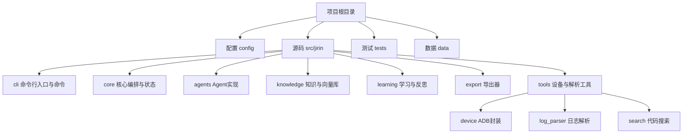
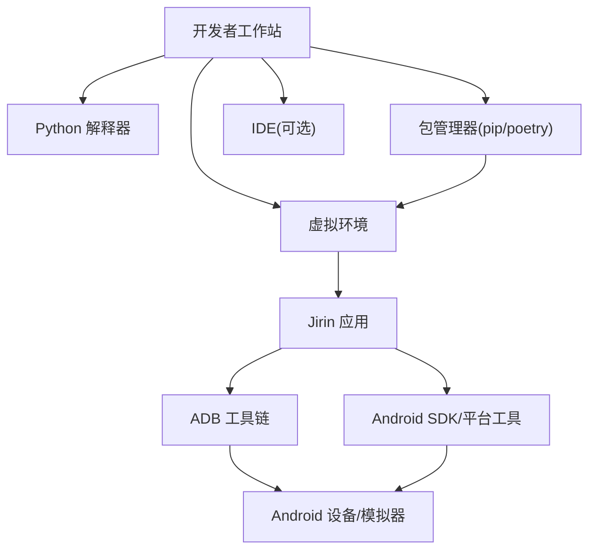
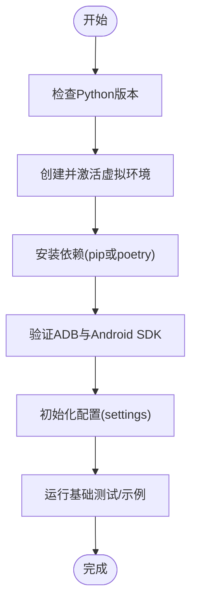

# 开发环境搭建

<cite>
**本文引用的文件**   
- [pyproject.toml](file://pyproject.toml)
- [settings.example.toml](file://config/settings.example.toml)
- [adb.py](file://src/jirin/tools/device/adb.py)
</cite>

## 目录
1. [简介](#简介)
2. [项目结构](#项目结构)
3. [核心组件](#核心组件)
4. [架构总览](#架构总览)
5. [详细组件分析](#详细组件分析)
6. [依赖分析](#依赖分析)
7. [性能考虑](#性能考虑)
8. [故障排查指南](#故障排查指南)
9. [结论](#结论)
10. [附录](#附录)

## 简介
本指南面向Jirin项目的开发者，提供从零开始的本地开发环境搭建说明。内容涵盖Python版本与包管理、虚拟环境创建与管理、ADB与Android SDK配置、IDE建议、系统工具安装以及常见问题排查。目标是让开发者在最短时间获得可运行的本地环境，并顺利参与开发与调试。

## 项目结构
Jirin采用模块化组织方式：
- 配置：项目级配置模板与默认配置
- 源码：按功能域划分（CLI、核心编排、Agent、知识、学习、导出、工具等）
- 测试：针对各模块的测试骨架
- 数据：案例、导出结果、记忆存储等占位目录

[本节为概念性结构说明，不直接分析具体文件，故无“章节来源”]

## 核心组件
- 包管理与依赖声明：通过项目根目录的配置文件集中声明Python版本约束与第三方依赖，便于统一环境构建。
- 配置管理：提供示例配置模板，用于初始化或覆盖默认行为。
- 设备交互：通过ADB封装对Android设备进行连接、拉取日志等操作。

**章节来源**
- [pyproject.toml](file://pyproject.toml)
- [settings.example.toml](file://config/settings.example.toml)
- [adb.py](file://src/jirin/tools/device/adb.py)

## 架构总览
下图展示了开发环境与运行时关键外部依赖的关系，包括Python解释器、包管理器、ADB与Android SDK。

[本图为概念性架构图，未映射到具体源文件，故无“图表来源”]

## 详细组件分析

### Python与包管理
- Python版本要求：以项目配置中声明的版本为准。请在本地安装对应主版本的Python解释器，并确保pip可用。
- 依赖安装：
  - 使用pip：在项目根目录执行依赖安装命令，确保虚拟环境已激活。
  - 使用poetry：若仓库包含poetry锁定文件或配置，优先使用poetry进行依赖解析与安装，以获得更稳定的复现环境。
- 虚拟环境：
  - 推荐使用venv或conda创建隔离环境，避免系统Python污染。
  - 在IDE中指向该环境的解释器路径，保证导入与运行一致。

**章节来源**
- [pyproject.toml](file://pyproject.toml)

### 配置初始化
- 首次运行前，建议复制示例配置到实际配置文件位置，并根据需要调整参数。
- 常见配置项包括：日志级别、输出目录、设备连接策略等。请根据实际环境修改。

**章节来源**
- [settings.example.toml](file://config/settings.example.toml)

### ADB与Android SDK
- ADB安装与PATH：
  - 将ADB所在目录加入系统环境变量PATH，以便在任何终端直接使用adb命令。
  - 验证安装：在终端执行adb version，确认能正常返回版本信息。
- Android SDK设置：
  - 推荐安装Android Studio以获取SDK与平台工具；或使用独立SDK Manager安装platform-tools。
  - 将platform-tools路径加入PATH，确保adb、fastboot等命令可用。
- 设备连接与权限：
  - 开启设备的开发者选项与USB调试。
  - 首次连接时允许授权，必要时重启adb服务。
- 常用操作：
  - 列出设备：adb devices
  - 查看日志：adb logcat
  - 拉取崩溃/ANR日志：结合Jirin的日志解析能力进行分析

**章节来源**
- [adb.py](file://src/jirin/tools/device/adb.py)

### IDE配置建议
- VS Code：
  - 安装Python扩展，选择项目虚拟环境作为解释器。
  - 启用Pylance与flake8/ruff等检查插件，提升编码体验。
  - 配置任务与调试器，支持直接运行CLI命令与断点调试。
- PyCharm：
  - 新建项目时指定已有虚拟环境解释器。
  - 配置Run/Debug Configuration，设置工作目录为项目根。
  - 启用代码风格检查与自动格式化。

[本节为通用建议，不直接分析具体文件，故无“章节来源”]

### 系统工具与环境变量
- PATH：确保python、pip、adb、java（如需要）均可在任意终端调用。
- 代理与镜像：在国内网络环境下，可为pip/poetry配置国内镜像源以提升下载速度。
- 权限问题：Windows下注意管理员权限与UAC限制；macOS/Linux注意脚本可执行权限。

[本节为通用建议，不直接分析具体文件，故无“章节来源”]

## 依赖分析
- 依赖声明位置：项目根目录的配置文件集中维护Python版本与依赖列表，便于统一构建。
- 依赖类型：
  - 运行期依赖：核心库、ADB交互、日志解析、向量检索等。
  - 开发期依赖：测试框架、代码质量工具、文档生成等。
- 版本锁定：建议使用poetry锁定依赖版本，或在团队内约定pip freeze/virtualenv方案保持一致。

[本图为概念流程，未映射到具体源文件，故无“图表来源”]

**章节来源**
- [pyproject.toml](file://pyproject.toml)

## 性能考虑
- 依赖安装：优先使用离线缓存或镜像源，减少网络抖动影响。
- 虚拟环境：保持最小化依赖集，按需添加扩展，缩短启动与导入时间。
- ADB交互：批量拉取日志时建议分片处理，避免一次性读取过大文件导致内存压力。
- 日志解析：对大日志文件可采用流式解析与增量索引，降低CPU与I/O峰值。

[本节为通用建议，不直接分析具体文件，故无“章节来源”]

## 故障排查指南
- Python环境问题
  - 症状：pip/poetry无法识别或版本不符
  - 排查：确认PATH中包含正确的Python与pip路径；使用python --version与pip --version核对
  - 解决：重新安装目标版本Python，或在IDE中选择正确解释器
- 虚拟环境问题
  - 症状：导入失败或找不到包
  - 排查：确认当前终端是否处于激活的虚拟环境；检查解释器路径
  - 解决：重新创建虚拟环境并安装依赖
- ADB不可用
  - 症状：adb命令未找到或设备未识别
  - 排查：检查platform-tools是否在PATH；执行adb devices看是否有设备
  - 解决：重新安装Android SDK platform-tools；重启adb服务；检查设备驱动与USB调试开关
- 权限与端口占用
  - 症状：adb授权失败或端口冲突
  - 解决：关闭占用端口的进程；在设备上重新授权；必要时重启设备或电脑
- 配置错误
  - 症状：运行时报错找不到配置或字段缺失
  - 排查：确认配置文件路径与键名是否正确
  - 解决：从示例配置复制并逐项对照修改

**章节来源**
- [adb.py](file://src/jirin/tools/device/adb.py)
- [settings.example.toml](file://config/settings.example.toml)

## 结论
按照本指南完成Python与包管理、虚拟环境、ADB与Android SDK配置后，即可在本地稳定运行Jirin。建议在团队内统一Python版本与依赖锁定策略，并通过IDE提升开发效率。遇到环境问题，优先从PATH、虚拟环境与设备授权三方面入手排查。

[本节为总结性内容，不直接分析具体文件，故无“章节来源”]

## 附录
- 快速清单
  - 安装Python并加入PATH
  - 创建并激活虚拟环境
  - 安装项目依赖（pip或poetry）
  - 安装Android SDK platform-tools并将platform-tools加入PATH
  - 初始化配置文件
  - 连接设备并验证adb可用
  - 运行基础测试或示例命令
- 参考路径
  - 依赖声明：[pyproject.toml](file://pyproject.toml)
  - 配置模板：[settings.example.toml](file://config/settings.example.toml)
  - ADB封装：[adb.py](file://src/jirin/tools/device/adb.py)