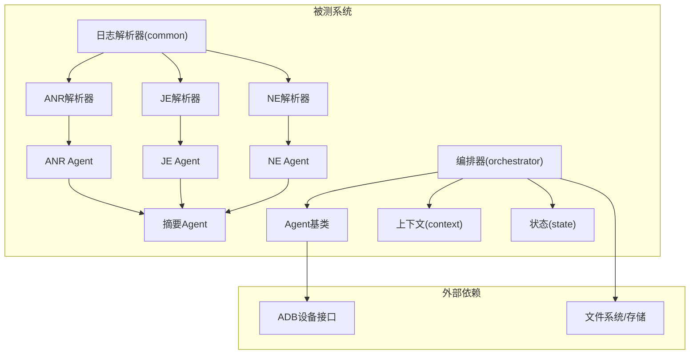
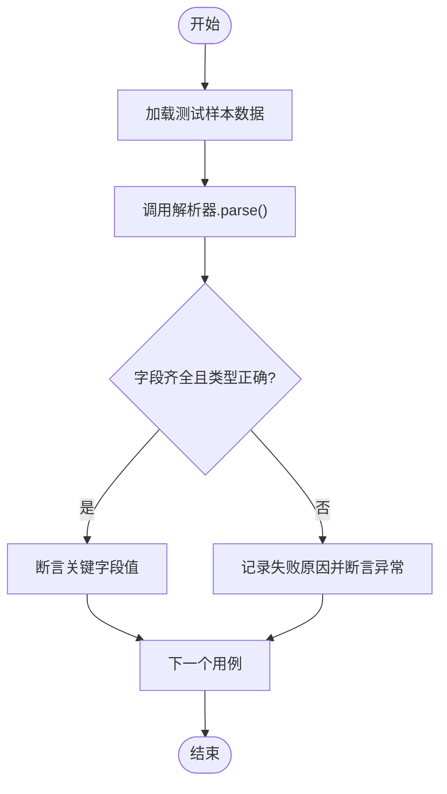
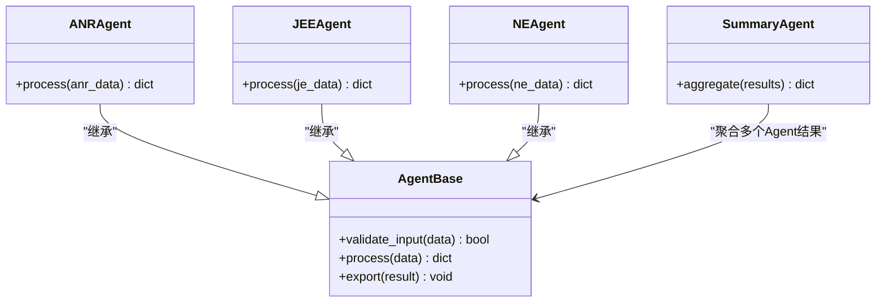
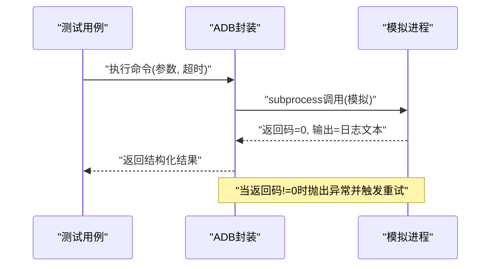
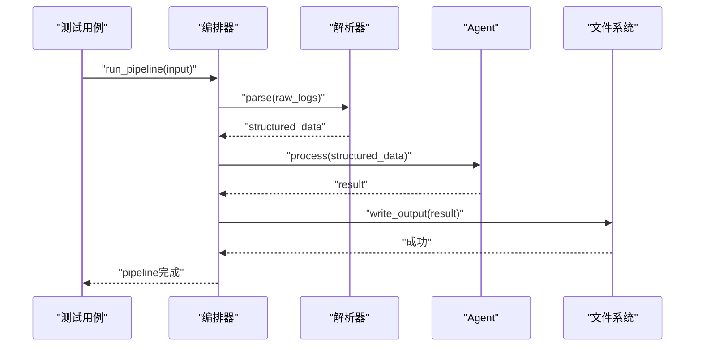
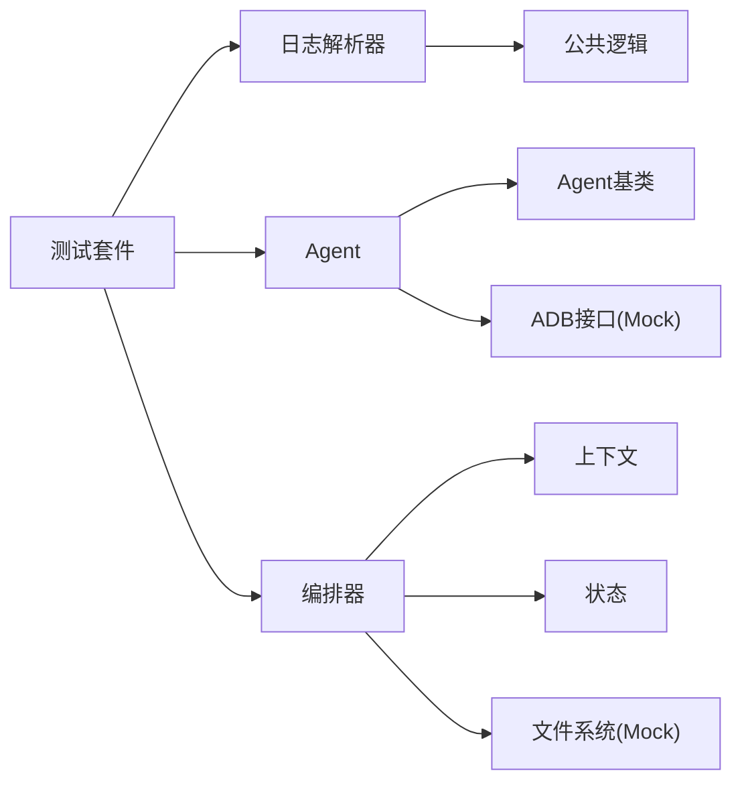

# 测试策略

<cite>
**本文引用的文件**   
- [pyproject.toml](file://pyproject.toml)
- [src/jirin/agents/base.py](file://src/jirin/agents/base.py)
- [src/jirin/agents/anr_agent.py](file://src/jirin/agents/anr_agent.py)
- [src/jirin/agents/je_agent.py](file://src/jirin/agents/je_agent.py)
- [src/jirin/agents/ne_agent.py](file://src/jirin/agents/ne_agent.py)
- [src/jirin/agents/summary_agent.py](file://src/jirin/agents/summary_agent.py)
- [src/jirin/core/orchestrator.py](file://src/jirin/core/orchestrator.py)
- [src/jirin/core/context.py](file://src/jirin/core/context.py)
- [src/jirin/core/state.py](file://src/jirin/core/state.py)
- [src/jirin/tools/log_parser/common.py](file://src/jirin/tools/log_parser/common.py)
- [src/jirin/tools/log_parser/anr_parser.py](file://src/jirin/tools/log_parser/anr_parser.py)
- [src/jirin/tools/log_parser/je_parser.py](file://src/jirin/tools/log_parser/je_parser.py)
- [src/jirin/tools/log_parser/ne_parser.py](file://src/jirin/tools/log_parser/ne_parser.py)
- [src/jirin/tools/device/adb.py](file://src/jirin/tools/device/adb.py)
- [tests/fixtures/__init__.py](file://tests/fixtures/__init__.py)
</cite>

## 目录
1. [简介](#简介)
2. [项目结构](#项目结构)
3. [核心组件](#核心组件)
4. [架构总览](#架构总览)
5. [详细组件分析](#详细组件分析)
6. [依赖分析](#依赖分析)
7. [性能考虑](#性能考虑)
8. [故障排查指南](#故障排查指南)
9. [结论](#结论)
10. [附录](#附录)

## 简介
本文件为Jirin项目的测试策略与框架设计文档，目标是在现有代码基础上建立完善的测试体系，覆盖单元测试、集成测试与端到端测试。内容涵盖：
- pytest配置与运行规范
- 测试数据管理（fixtures）
- Mock对象使用与隔离外部依赖
- 异步测试处理
- Agent测试模板
- 日志解析器测试示例
- ADB交互测试方案
- 覆盖率要求与持续集成建议

## 项目结构
当前仓库已提供基础测试目录结构与工具模块，便于扩展测试用例。关键位置如下：
- tests/: 测试根目录，包含 fixtures、test_agents、test_knowledge、test_tools 等子目录
- src/jirin/tools/log_parser: 日志解析器实现，适合编写单元测试与边界用例
- src/jirin/agents: Agent实现，适合编写单元与集成测试
- src/jirin/tools/device/adb.py: ADB交互封装，适合Mock与隔离测试
- pyproject.toml: 项目配置入口，可集中声明pytest与覆盖率插件

```mermaid
graph TB
subgraph "测试层"
T_fix["tests/fixtures"]
T_agents["tests/test_agents"]
T_tools["tests/test_tools"]
T_core["tests/test_core"]
end
subgraph "源码层"
A_base["src/jirin/agents/base.py"]
A_anr["src/jirin/agents/anr_agent.py"]
A_je["src/jirin/agents/je_agent.py"]
A_ne["src/jirin/agents/ne_agent.py"]
A_sum["src/jirin/agents/summary_agent.py"]
L_common["src/jirin/tools/log_parser/common.py"]
L_anr["src/jirin/tools/log_parser/anr_parser.py"]
L_je["src/jirin/tools/log_parser/je_parser.py"]
L_ne["src/jirin/tools/log_parser/ne_parser.py"]
D_adb["src/jirin/tools/device/adb.py"]
C_ctx["src/jirin/core/context.py"]
C_state["src/jirin/core/state.py"]
C_orch["src/jirin/core/orchestrator.py"]
end
T_fix --> A_base
T_fix --> L_common
T_fix --> D_adb
T_agents --> A_base
T_agents --> A_anr
T_agents --> A_je
T_agents --> A_ne
T_agents --> A_sum
T_tools --> L_anr
T_tools --> L_je
T_tools --> L_ne
T_tools --> D_adb
T_core --> C_ctx
T_core --> C_state
T_core --> C_orch
```

图表来源
- [pyproject.toml](file://pyproject.toml)
- [src/jirin/agents/base.py](file://src/jirin/agents/base.py)
- [src/jirin/tools/log_parser/common.py](file://src/jirin/tools/log_parser/common.py)
- [src/jirin/tools/device/adb.py](file://src/jirin/tools/device/adb.py)
- [src/jirin/core/context.py](file://src/jirin/core/context.py)
- [src/jirin/core/state.py](file://src/jirin/core/state.py)
- [src/jirin/core/orchestrator.py](file://src/jirin/core/orchestrator.py)

章节来源
- [pyproject.toml](file://pyproject.toml)

## 核心组件
围绕以下三类核心组件制定测试策略：
- Agent组件：负责按规则或模型对日志进行分析与总结
- 日志解析器：将原始日志结构化输出，供Agent消费
- ADB设备交互：与Android设备通信，获取日志与执行命令

测试分层建议：
- 单元测试：聚焦函数/类方法的最小行为验证，如解析器的正则匹配、字段抽取；Agent的输入校验与输出格式；ADB命令构造与参数校验
- 集成测试：组合多个组件，如“解析器+Agent”链路；在Mock ADB的前提下验证端到端流程
- 端到端测试：在真实或仿真设备上运行完整流程，包括ADB拉取日志、解析、Agent分析与导出结果

章节来源
- [src/jirin/agents/base.py](file://src/jirin/agents/base.py)
- [src/jirin/tools/log_parser/common.py](file://src/jirin/tools/log_parser/common.py)
- [src/jirin/tools/device/adb.py](file://src/jirin/tools/device/adb.py)

## 架构总览
下图展示测试视角下的系统交互关系，标注了需要Mock的外部依赖与内部协作点。

图表来源
- [src/jirin/tools/log_parser/common.py](file://src/jirin/tools/log_parser/common.py)
- [src/jirin/tools/log_parser/anr_parser.py](file://src/jirin/tools/log_parser/anr_parser.py)
- [src/jirin/tools/log_parser/je_parser.py](file://src/jirin/tools/log_parser/je_parser.py)
- [src/jirin/tools/log_parser/ne_parser.py](file://src/jirin/tools/log_parser/ne_parser.py)
- [src/jirin/agents/base.py](file://src/jirin/agents/base.py)
- [src/jirin/agents/anr_agent.py](file://src/jirin/agents/anr_agent.py)
- [src/jirin/agents/je_agent.py](file://src/jirin/agents/je_agent.py)
- [src/jirin/agents/ne_agent.py](file://src/jirin/agents/ne_agent.py)
- [src/jirin/agents/summary_agent.py](file://src/jirin/agents/summary_agent.py)
- [src/jirin/core/orchestrator.py](file://src/jirin/core/orchestrator.py)
- [src/jirin/core/context.py](file://src/jirin/core/context.py)
- [src/jirin/core/state.py](file://src/jirin/core/state.py)

## 详细组件分析

### 日志解析器测试示例
目标：确保各解析器能正确识别并结构化日志关键字段，且对异常输入具备鲁棒性。

- 测试范围
  - 正常路径：典型ANR/JE/NE日志片段，断言关键字段存在且类型正确
  - 边界条件：空字符串、超长行、缺失字段、乱码、重复事件
  - 错误路径：非法编码、非预期格式、部分匹配导致歧义
- 测试要点
  - 使用固定样本数据（fixtures），避免网络与设备依赖
  - 针对公共逻辑（common）抽取通用断言与辅助函数
  - 对正则/模式匹配进行针对性用例覆盖
- 推荐组织
  - tests/test_tools/test_log_parser/ 下按解析器分文件
  - 每个解析器至少包含：基本用例、边界用例、异常用例

图表来源
- [src/jirin/tools/log_parser/common.py](file://src/jirin/tools/log_parser/common.py)
- [src/jirin/tools/log_parser/anr_parser.py](file://src/jirin/tools/log_parser/anr_parser.py)
- [src/jirin/tools/log_parser/je_parser.py](file://src/jirin/tools/log_parser/je_parser.py)
- [src/jirin/tools/log_parser/ne_parser.py](file://src/jirin/tools/log_parser/ne_parser.py)

章节来源
- [src/jirin/tools/log_parser/common.py](file://src/jirin/tools/log_parser/common.py)
- [src/jirin/tools/log_parser/anr_parser.py](file://src/jirin/tools/log_parser/anr_parser.py)
- [src/jirin/tools/log_parser/je_parser.py](file://src/jirin/tools/log_parser/je_parser.py)
- [src/jirin/tools/log_parser/ne_parser.py](file://src/jirin/tools/log_parser/ne_parser.py)

### Agent测试模板
目标：验证Agent对结构化日志的处理能力，以及与其他组件的协作。

- 测试范围
  - 输入校验：拒绝非法/不完整的结构化日志
  - 处理逻辑：基于规则或模型的推理路径（若为规则驱动，重点断言输出字段）
  - 输出格式：统一的数据模型或JSON Schema
- 测试要点
  - 使用Agent基类的接口约定，保证多Agent一致性
  - 通过fixture注入不同场景的结构化日志
  - 对耗时或外部依赖（如模型调用）进行Mock
- 推荐组织
  - tests/test_agents/ 下按Agent分文件
  - 每个Agent包含：基本用例、边界用例、异常用例、与Summary Agent的集成用例

图表来源
- [src/jirin/agents/base.py](file://src/jirin/agents/base.py)
- [src/jirin/agents/anr_agent.py](file://src/jirin/agents/anr_agent.py)
- [src/jirin/agents/je_agent.py](file://src/jirin/agents/je_agent.py)
- [src/jirin/agents/ne_agent.py](file://src/jirin/agents/ne_agent.py)
- [src/jirin/agents/summary_agent.py](file://src/jirin/agents/summary_agent.py)

章节来源
- [src/jirin/agents/base.py](file://src/jirin/agents/base.py)
- [src/jirin/agents/anr_agent.py](file://src/jirin/agents/anr_agent.py)
- [src/jirin/agents/je_agent.py](file://src/jirin/agents/je_agent.py)
- [src/jirin/agents/ne_agent.py](file://src/jirin/agents/ne_agent.py)
- [src/jirin/agents/summary_agent.py](file://src/jirin/agents/summary_agent.py)

### ADB交互测试方案
目标：在不连接真实设备的情况下，验证ADB命令构造、错误处理与重试逻辑。

- 测试范围
  - 命令构造：参数拼接、转义、超时设置
  - 错误处理：设备离线、权限不足、命令不存在
  - 重试与回退：指数退避、最大重试次数
- 测试要点
  - 使用unittest.mock或pytest-mock替换底层进程调用
  - 模拟不同返回码与标准输出/错误流
  - 断言最终抛出的异常类型与消息
- 推荐组织
  - tests/test_tools/test_device/ 下编写ADB相关用例
  - 结合夹具提供常见设备响应样例

图表来源
- [src/jirin/tools/device/adb.py](file://src/jirin/tools/device/adb.py)

章节来源
- [src/jirin/tools/device/adb.py](file://src/jirin/tools/device/adb.py)

### 编排器与上下文/状态集成测试
目标：验证编排器如何协调解析器与Agent，并在上下文中维护状态。

- 测试范围
  - 流程编排：解析→Agent→汇总→导出
  - 上下文传递：共享配置、中间结果
  - 状态持久化：阶段性状态写入与恢复
- 测试要点
  - 使用夹具准备最小可运行的上下文与状态
  - Mock外部依赖（ADB、文件系统）
  - 断言每一步的输出与副作用

图表来源
- [src/jirin/core/orchestrator.py](file://src/jirin/core/orchestrator.py)
- [src/jirin/core/context.py](file://src/jirin/core/context.py)
- [src/jirin/core/state.py](file://src/jirin/core/state.py)

章节来源
- [src/jirin/core/orchestrator.py](file://src/jirin/core/orchestrator.py)
- [src/jirin/core/context.py](file://src/jirin/core/context.py)
- [src/jirin/core/state.py](file://src/jirin/core/state.py)

## 依赖分析
测试对以下外部依赖的耦合度较高，建议在测试中尽量Mock：
- ADB设备接口：用于拉取日志与执行命令
- 文件系统：用于读写中间结果与导出产物
- 第三方库：如日志解析可能依赖正则表达式库、时间解析库等

图表来源
- [src/jirin/tools/log_parser/common.py](file://src/jirin/tools/log_parser/common.py)
- [src/jirin/agents/base.py](file://src/jirin/agents/base.py)
- [src/jirin/core/orchestrator.py](file://src/jirin/core/orchestrator.py)
- [src/jirin/core/context.py](file://src/jirin/core/context.py)
- [src/jirin/core/state.py](file://src/jirin/core/state.py)
- [src/jirin/tools/device/adb.py](file://src/jirin/tools/device/adb.py)

章节来源
- [src/jirin/tools/log_parser/common.py](file://src/jirin/tools/log_parser/common.py)
- [src/jirin/agents/base.py](file://src/jirin/agents/base.py)
- [src/jirin/core/orchestrator.py](file://src/jirin/core/orchestrator.py)
- [src/jirin/core/context.py](file://src/jirin/core/context.py)
- [src/jirin/core/state.py](file://src/jirin/core/state.py)
- [src/jirin/tools/device/adb.py](file://src/jirin/tools/device/adb.py)

## 性能考虑
- 单元测试应快速执行，避免I/O与网络操作；必要时使用内存中的临时目录
- 解析器测试可使用小样本数据，批量测试时使用参数化减少重复
- 对Agent的复杂逻辑，优先断言关键路径与边界分支，避免过度依赖外部模型
- 并行执行测试时注意资源隔离（如临时目录命名空间）

## 故障排查指南
- 解析器失败
  - 检查样本数据是否覆盖缺失字段与异常编码
  - 确认正则/模式是否过于严格或宽松
- Agent处理异常
  - 核对输入数据结构是否符合契约
  - 检查Mock返回值是否与真实环境一致
- ADB交互问题
  - 确认模拟返回码与输出格式
  - 检查重试与超时策略是否合理

## 结论
通过分层测试策略、严格的Mock与夹具管理，以及对关键组件的细致覆盖，Jirin项目可在不依赖真实设备的情况下高效验证核心功能。建议逐步提升覆盖率指标，并将测试纳入持续集成流水线，保障质量与交付效率。

## 附录

### pytest配置建议
- 插件与选项
  - 启用pytest-cov以生成覆盖率报告
  - 使用pytest-mock简化Mock
  - 配置测试发现路径与忽略规则
- 常用命令行
  - 运行全部测试：pytest
  - 指定目录：pytest tests/test_tools
  - 生成覆盖率：pytest --cov=src/jirin --cov-report=html
- 配置文件位置
  - 在pyproject.toml中集中声明pytest与覆盖率配置

章节来源
- [pyproject.toml](file://pyproject.toml)

### 测试数据管理（fixtures）
- 存放位置
  - tests/fixtures/ 下按模块划分夹具文件
- 内容建议
  - 日志样本：ANR/JE/NE的典型与异常片段
  - 设备响应：ADB命令的模拟输出与错误码
  - 上下文与状态：最小可运行的Context与State实例
- 使用方式
  - 在测试函数中以参数形式注入夹具
  - 对大型样本使用lazy fixture或按需加载

章节来源
- [tests/fixtures/__init__.py](file://tests/fixtures/__init__.py)

### Mock对象使用
- 推荐库
  - unittest.mock或pytest-mock
- 常见用法
  - 替换ADB底层进程调用
  - 模拟文件系统读写
  - 拦截第三方库的网络请求
- 注意事项
  - 保持Mock返回值与真实环境一致
  - 断言被调用的方法与参数

### 异步测试处理
- 若涉及异步API，建议使用pytest-asyncio
- 使用async def定义异步测试函数
- 对阻塞型I/O进行Mock，避免影响测试速度

### 覆盖率要求
- 建议阈值
  - 语句覆盖率≥80%
  - 分支覆盖率≥70%
  - 关键模块（解析器、Agent、ADB）覆盖率≥90%
- 报告输出
  - HTML与终端双格式，便于审查与归档

### 持续集成配置建议
- 触发条件
  - 每次提交与合并请求
- 任务清单
  - 安装依赖
  - 运行单元测试与集成测试
  - 生成覆盖率报告
  - 上传报告至制品库
- 缓存与加速
  - 缓存Python包与构建产物
  - 并行执行测试套件