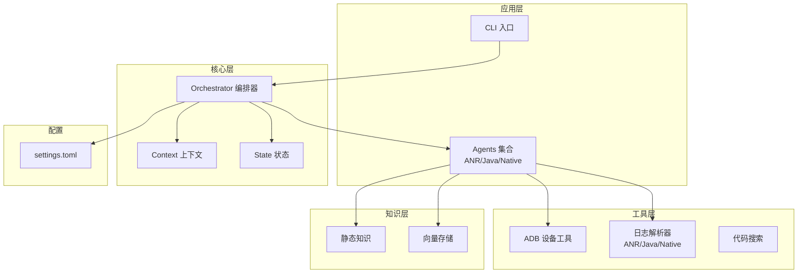
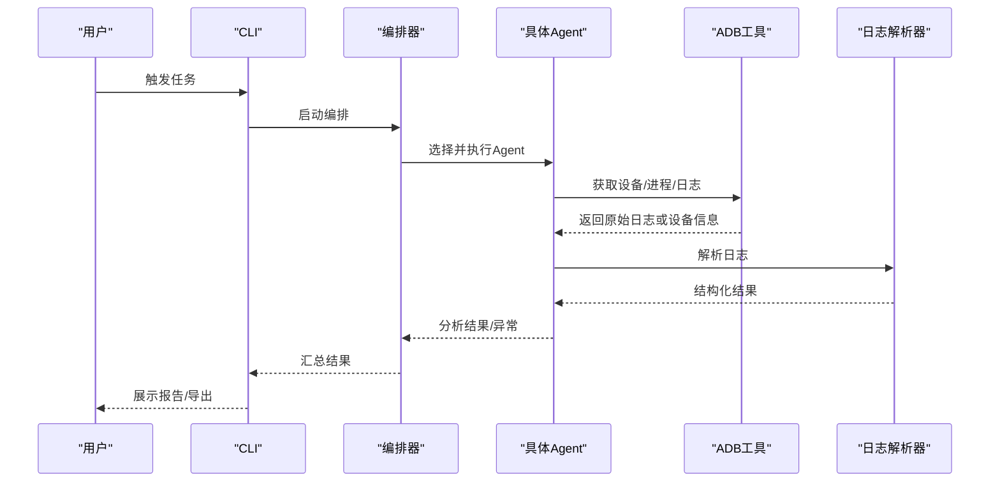
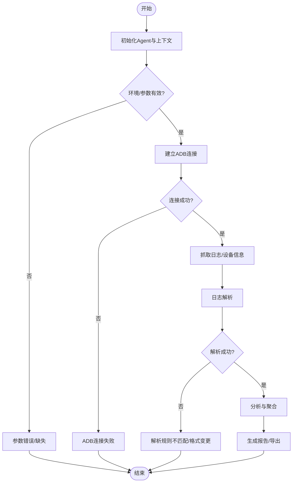
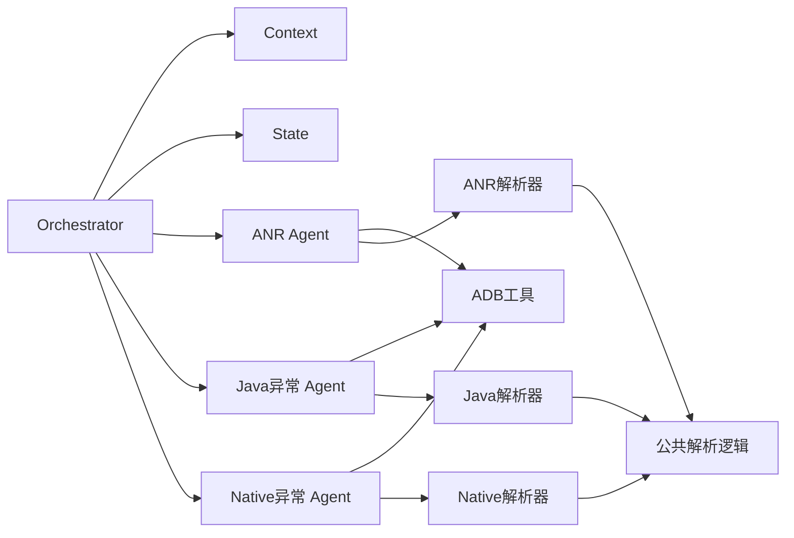

# 调试与问题排查

<cite>
**本文引用的文件**   
- [src/jirin/agents/base.py](file://src/jirin/agents/base.py)
- [src/jirin/agents/anr_agent.py](file://src/jirin/agents/anr_agent.py)
- [src/jirin/agents/je_agent.py](file://src/jirin/agents/je_agent.py)
- [src/jirin/agents/ne_agent.py](file://src/jirin/agents/ne_agent.py)
- [src/jirin/core/orchestrator.py](file://src/jirin/core/orchestrator.py)
- [src/jirin/core/context.py](file://src/jirin/core/context.py)
- [src/jirin/tools/device/adb.py](file://src/jirin/tools/device/adb.py)
- [src/jirin/tools/log_parser/common.py](file://src/jirin/tools/log_parser/common.py)
- [src/jirin/tools/log_parser/anr_parser.py](file://src/jirin/tools/log_parser/anr_parser.py)
- [src/jirin/tools/log_parser/je_parser.py](file://src/jirin/tools/log_parser/je_parser.py)
- [src/jirin/tools/log_parser/ne_parser.py](file://src/jirin/tools/log_parser/ne_parser.py)
- [config/settings.example.toml](file://config/settings.example.toml)
- [config/settings.toml](file://config/settings.toml)
</cite>

## 目录
1. [简介](#简介)
2. [项目结构](#项目结构)
3. [核心组件](#核心组件)
4. [架构总览](#架构总览)
5. [详细组件分析](#详细组件分析)
6. [依赖关系分析](#依赖关系分析)
7. [性能考虑](#性能考虑)
8. [故障排除指南](#故障排除指南)
9. [结论](#结论)
10. [附录](#附录)

## 简介
本指南面向Jirin项目的开发与运维人员，聚焦于调试与问题排查。内容覆盖：
- Agent执行流程的调试方法
- ADB连接问题的定位与修复
- 日志解析错误的诊断与修复
- 内存泄漏检测、CPU性能分析与网络请求监控的实践建议
- 常见问题FAQ与可视化故障排除流程图

## 项目结构
Jirin采用模块化分层组织：
- agents：各类Agent实现（ANR、Java异常、Native异常等）
- core：编排器、上下文与状态管理
- tools：设备交互（ADB）、日志解析、代码搜索等工具
- knowledge：静态知识与向量存储
- export：导出能力
- cli：命令行入口与子命令
- config：配置项示例与实际配置

**图表来源** 
- [src/jirin/core/orchestrator.py](file://src/jirin/core/orchestrator.py)
- [src/jirin/core/context.py](file://src/jirin/core/context.py)
- [src/jirin/agents/anr_agent.py](file://src/jirin/agents/anr_agent.py)
- [src/jirin/agents/je_agent.py](file://src/jirin/agents/je_agent.py)
- [src/jirin/agents/ne_agent.py](file://src/jirin/agents/ne_agent.py)
- [src/jirin/tools/device/adb.py](file://src/jirin/tools/device/adb.py)
- [src/jirin/tools/log_parser/anr_parser.py](file://src/jirin/tools/log_parser/anr_parser.py)
- [src/jirin/tools/log_parser/je_parser.py](file://src/jirin/tools/log_parser/je_parser.py)
- [src/jirin/tools/log_parser/ne_parser.py](file://src/jirin/tools/log_parser/ne_parser.py)
- [config/settings.toml](file://config/settings.toml)

**章节来源**
- [src/jirin/core/orchestrator.py](file://src/jirin/core/orchestrator.py)
- [src/jirin/core/context.py](file://src/jirin/core/context.py)
- [src/jirin/agents/anr_agent.py](file://src/jirin/agents/anr_agent.py)
- [src/jirin/agents/je_agent.py](file://src/jirin/agents/je_agent.py)
- [src/jirin/agents/ne_agent.py](file://src/jirin/agents/ne_agent.py)
- [src/jirin/tools/device/adb.py](file://src/jirin/tools/device/adb.py)
- [src/jirin/tools/log_parser/anr_parser.py](file://src/jirin/tools/log_parser/anr_parser.py)
- [src/jirin/tools/log_parser/je_parser.py](file://src/jirin/tools/log_parser/je_parser.py)
- [src/jirin/tools/log_parser/ne_parser.py](file://src/jirin/tools/log_parser/ne_parser.py)
- [config/settings.toml](file://config/settings.toml)

## 核心组件
- 编排器（Orchestrator）：负责调度Agent、管理执行上下文与生命周期，串联ADB与日志解析流程。
- 上下文（Context）：保存运行期数据、中间结果与共享状态，便于跨模块传递。
- Agent基类与具体Agent：定义统一的执行接口与扩展点；ANR/Java/Native Agent分别处理不同崩溃场景。
- ADB工具：封装设备连接、日志抓取、进程/线程查询等能力。
- 日志解析器：将原始日志结构化输出，供上层分析与决策。

**章节来源**
- [src/jirin/core/orchestrator.py](file://src/jirin/core/orchestrator.py)
- [src/jirin/core/context.py](file://src/jirin/core/context.py)
- [src/jirin/agents/base.py](file://src/jirin/agents/base.py)
- [src/jirin/agents/anr_agent.py](file://src/jirin/agents/anr_agent.py)
- [src/jirin/agents/je_agent.py](file://src/jirin/agents/je_agent.py)
- [src/jirin/agents/ne_agent.py](file://src/jirin/agents/ne_agent.py)
- [src/jirin/tools/device/adb.py](file://src/jirin/tools/device/adb.py)
- [src/jirin/tools/log_parser/anr_parser.py](file://src/jirin/tools/log_parser/anr_parser.py)
- [src/jirin/tools/log_parser/je_parser.py](file://src/jirin/tools/log_parser/je_parser.py)
- [src/jirin/tools/log_parser/ne_parser.py](file://src/jirin/tools/log_parser/ne_parser.py)

## 架构总览
下图展示了从CLI到Agent再到ADB与日志解析的整体调用链，以及错误回传路径。

**图表来源** 
- [src/jirin/core/orchestrator.py](file://src/jirin/core/orchestrator.py)
- [src/jirin/agents/anr_agent.py](file://src/jirin/agents/anr_agent.py)
- [src/jirin/agents/je_agent.py](file://src/jirin/agents/je_agent.py)
- [src/jirin/agents/ne_agent.py](file://src/jirin/agents/ne_agent.py)
- [src/jirin/tools/device/adb.py](file://src/jirin/tools/device/adb.py)
- [src/jirin/tools/log_parser/anr_parser.py](file://src/jirin/tools/log_parser/anr_parser.py)
- [src/jirin/tools/log_parser/je_parser.py](file://src/jirin/tools/log_parser/je_parser.py)
- [src/jirin/tools/log_parser/ne_parser.py](file://src/jirin/tools/log_parser/ne_parser.py)

## 详细组件分析

### Agent执行流程调试
- 统一入口：所有Agent继承自基类，具备一致的初始化、执行与清理钩子。
- 关键断点建议：
  - Agent初始化阶段：检查参数校验、资源准备与环境变量。
  - 设备交互前：确认ADB连接状态、目标包名/进程名、权限与SELinux策略。
  - 日志解析前后：对比原始日志片段与结构化结果，定位正则/规则匹配失败。
  - 结果聚合阶段：验证上下文字段是否完整、类型是否正确。
- 常用技巧：
  - 在Agent内部增加阶段性日志，记录输入摘要与耗时。
  - 使用最小复现用例，固定时间窗口与日志范围，降低噪声。
  - 对解析失败的样本进行离线回放，逐步缩小正则范围。

**图表来源** 
- [src/jirin/agents/base.py](file://src/jirin/agents/base.py)
- [src/jirin/agents/anr_agent.py](file://src/jirin/agents/anr_agent.py)
- [src/jirin/agents/je_agent.py](file://src/jirin/agents/je_agent.py)
- [src/jirin/agents/ne_agent.py](file://src/jirin/agents/ne_agent.py)
- [src/jirin/tools/device/adb.py](file://src/jirin/tools/device/adb.py)
- [src/jirin/tools/log_parser/anr_parser.py](file://src/jirin/tools/log_parser/anr_parser.py)
- [src/jirin/tools/log_parser/je_parser.py](file://src/jirin/tools/log_parser/je_parser.py)
- [src/jirin/tools/log_parser/ne_parser.py](file://src/jirin/tools/log_parser/ne_parser.py)

**章节来源**
- [src/jirin/agents/base.py](file://src/jirin/agents/base.py)
- [src/jirin/agents/anr_agent.py](file://src/jirin/agents/anr_agent.py)
- [src/jirin/agents/je_agent.py](file://src/jirin/agents/je_agent.py)
- [src/jirin/agents/ne_agent.py](file://src/jirin/agents/ne_agent.py)
- [src/jirin/tools/device/adb.py](file://src/jirin/tools/device/adb.py)
- [src/jirin/tools/log_parser/anr_parser.py](file://src/jirin/tools/log_parser/anr_parser.py)
- [src/jirin/tools/log_parser/je_parser.py](file://src/jirin/tools/log_parser/je_parser.py)
- [src/jirin/tools/log_parser/ne_parser.py](file://src/jirin/tools/log_parser/ne_parser.py)

### ADB连接问题排查
- 常见症状：设备未识别、权限不足、端口占用、多设备歧义、超时。
- 排查步骤：
  - 基础连通性：确认设备已授权、驱动安装正确、USB调试开启。
  - 多设备场景：明确指定设备序列号或使用环境变量约束。
  - 权限与SELinux：确保具备读取系统日志与进程信息的权限。
  - 重试与退避：对瞬时失败实施指数退避重试。
  - 抓包与日志：记录ADB命令与输出，便于离线分析。
- 建议增强：
  - 在ADB工具中增加连接健康检查与自动恢复逻辑。
  - 提供“预检”命令，提前发现环境问题。

**章节来源**
- [src/jirin/tools/device/adb.py](file://src/jirin/tools/device/adb.py)

### 日志解析错误诊断
- 典型错误：正则不匹配、字段缺失、编码异常、时间戳不一致、多语言/多版本差异。
- 诊断方法：
  - 抽取最小可复现日志片段，逐条验证解析规则。
  - 打印解析中间态（如匹配组、偏移量），定位失败行。
  - 引入容错分支与降级策略，避免单条异常导致整体失败。
  - 为每种解析器维护测试集，持续回归。
- 改进建议：
  - 将解析规则外置化，支持热更新与灰度发布。
  - 增加解析覆盖率统计与告警。

**章节来源**
- [src/jirin/tools/log_parser/common.py](file://src/jirin/tools/log_parser/common.py)
- [src/jirin/tools/log_parser/anr_parser.py](file://src/jirin/tools/log_parser/anr_parser.py)
- [src/jirin/tools/log_parser/je_parser.py](file://src/jirin/tools/log_parser/je_parser.py)
- [src/jirin/tools/log_parser/ne_parser.py](file://src/jirin/tools/log_parser/ne_parser.py)

### 内存泄漏检测
- 推荐工具与方法：
  - Python侧：tracemalloc、objgraph、memory_profiler定位对象增长与引用环。
  - Android侧：LeakCanary、MAT、Heap Dump分析。
- 实践要点：
  - 在Agent长生命周期对象上设置弱引用与显式释放。
  - 定期采样堆快照，对比增量变化。
  - 结合业务事件埋点，关联泄漏发生时机。

[本节为通用指导，无需源码引用]

### CPU性能分析
- 推荐工具与方法：
  - Python侧：cProfile、py-spy、perfetto/py-spy火焰图。
  - Android侧：systrace、Perfetto、CPU Profiler。
- 实践要点：
  - 针对热点函数与I/O密集段进行采样。
  - 区分阻塞与非阻塞路径，优化等待与并发度。
  - 结合Agent执行时序，定位瓶颈阶段。

[本节为通用指导，无需源码引用]

### 网络请求监控
- 推荐工具与方法：
  - Python侧：requests-mock、httpx日志、代理抓包（mitmproxy）。
  - Android侧：Charles/Fiddler、Wireshark、OkHttp拦截器。
- 实践要点：
  - 记录请求头、响应码、耗时与重试次数。
  - 对超时与限流进行阈值告警。
  - 隔离外部依赖，使用Mock稳定测试。

[本节为通用指导，无需源码引用]

## 依赖关系分析
- 低耦合设计：Agent通过接口与工具层交互，避免直接依赖底层实现。
- 关键依赖：
  - Orchestrator依赖Context与State，用于状态流转。
  - Agent依赖ADB与日志解析器，完成数据采集与分析。
  - 解析器之间共享公共逻辑，减少重复。
- 潜在风险：
  - 若ADB工具抛出未捕获异常，可能导致Agent级联失败。
  - 解析器规则变更需同步更新测试集与文档。

**图表来源** 
- [src/jirin/core/orchestrator.py](file://src/jirin/core/orchestrator.py)
- [src/jirin/core/context.py](file://src/jirin/core/context.py)
- [src/jirin/agents/anr_agent.py](file://src/jirin/agents/anr_agent.py)
- [src/jirin/agents/je_agent.py](file://src/jirin/agents/je_agent.py)
- [src/jirin/agents/ne_agent.py](file://src/jirin/agents/ne_agent.py)
- [src/jirin/tools/device/adb.py](file://src/jirin/tools/device/adb.py)
- [src/jirin/tools/log_parser/anr_parser.py](file://src/jirin/tools/log_parser/anr_parser.py)
- [src/jirin/tools/log_parser/je_parser.py](file://src/jirin/tools/log_parser/je_parser.py)
- [src/jirin/tools/log_parser/ne_parser.py](file://src/jirin/tools/log_parser/ne_parser.py)
- [src/jirin/tools/log_parser/common.py](file://src/jirin/tools/log_parser/common.py)

**章节来源**
- [src/jirin/core/orchestrator.py](file://src/jirin/core/orchestrator.py)
- [src/jirin/core/context.py](file://src/jirin/core/context.py)
- [src/jirin/agents/anr_agent.py](file://src/jirin/agents/anr_agent.py)
- [src/jirin/agents/je_agent.py](file://src/jirin/agents/je_agent.py)
- [src/jirin/agents/ne_agent.py](file://src/jirin/agents/ne_agent.py)
- [src/jirin/tools/device/adb.py](file://src/jirin/tools/device/adb.py)
- [src/jirin/tools/log_parser/anr_parser.py](file://src/jirin/tools/log_parser/anr_parser.py)
- [src/jirin/tools/log_parser/je_parser.py](file://src/jirin/tools/log_parser/je_parser.py)
- [src/jirin/tools/log_parser/ne_parser.py](file://src/jirin/tools/log_parser/ne_parser.py)
- [src/jirin/tools/log_parser/common.py](file://src/jirin/tools/log_parser/common.py)

## 性能考虑
- 批量处理：对大日志文件采用分块读取与并行解析，控制内存峰值。
- 缓存命中：对频繁访问的设备信息与索引结果进行短期缓存。
- I/O优化：减少不必要的ADB往返，合并命令与批处理。
- 资源回收：及时关闭文件句柄与网络连接，避免泄漏。
- 可观测性：增加关键指标（耗时、吞吐、错误率）以便容量规划。

[本节为通用指导，无需源码引用]

## 故障排除指南

### 常见问题FAQ
- 问：ADB无法识别设备怎么办？
  - 答：检查USB调试与驱动；尝试重新插拔；在多设备环境下指定序列号；查看系统日志中的USB枚举信息。
- 问：日志解析结果为空或不完整？
  - 答：核对时间窗口与过滤条件；确认日志版本与编码；用最小样本验证解析规则；必要时启用降级模式。
- 问：Agent执行中途崩溃？
  - 答：定位最近一次成功阶段；检查外部依赖可用性；增加更细粒度日志；对异常进行捕获与上报。
- 问：性能抖动明显？
  - 答：采集CPU与内存快照；分析热点函数与I/O等待；评估并发度与队列长度；调整批大小与超时。

[本节为通用指导，无需源码引用]

### 故障排除流程图

```mermaid
flowchart TD
A["问题出现"] --> B["收集现象与日志"]
B --> C{"ADB连接正常?"}
C --> |否| D["修复ADB连接"]
C --> |是| E{"日志可获取?"}
E --> |否| F["检查权限/SELinux/设备状态"]
E --> |是| G{"解析成功?"}
G --> |否| H["定位解析规则/格式差异"]
G --> |是| I{"结果合理?"}
I --> |否| J["补充上下文/扩大采样范围"]
I --> |是| K["定位业务根因并修复"]
D --> L["复测"]
F --> L
H --> L
J --> L
K --> M["归档与复盘"]
```

[本节为概念性流程图，无需源码引用]

## 结论
通过规范化的调试流程、完善的日志与性能观测手段，以及对ADB与解析器的稳健化处理，可以显著提升Jirin项目的稳定性与可维护性。建议在团队内推广最小复现、离线回放与回归测试的最佳实践，持续完善知识库与自动化排障能力。

[本节为总结性内容，无需源码引用]

## 附录
- 配置参考：settings.example.toml与settings.toml用于环境与行为开关，建议按环境拆分配置并纳入版本管理。
- 建议新增：
  - 统一的错误码与告警通道
  - 解析规则版本管理与灰度发布
  - 端到端集成测试套件

**章节来源**
- [config/settings.example.toml](file://config/settings.example.toml)
- [config/settings.toml](file://config/settings.toml)