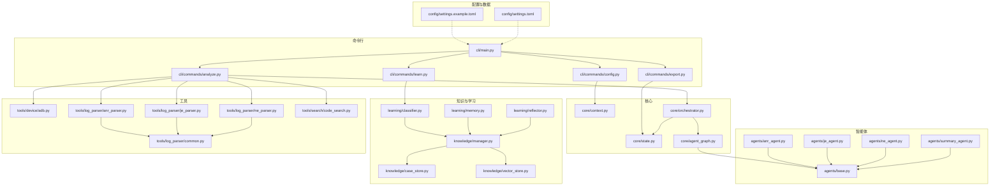
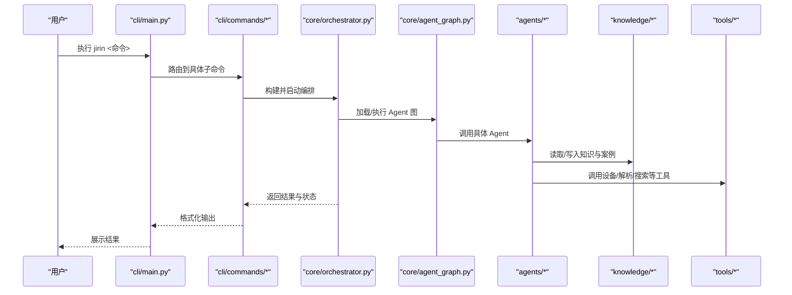
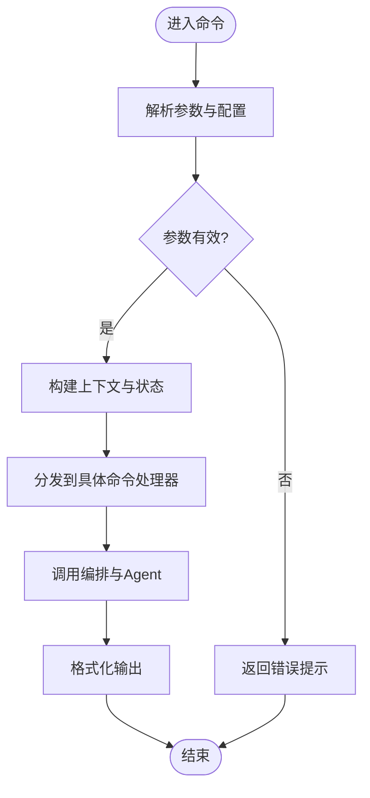
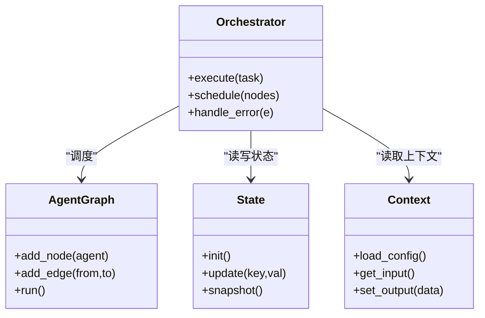
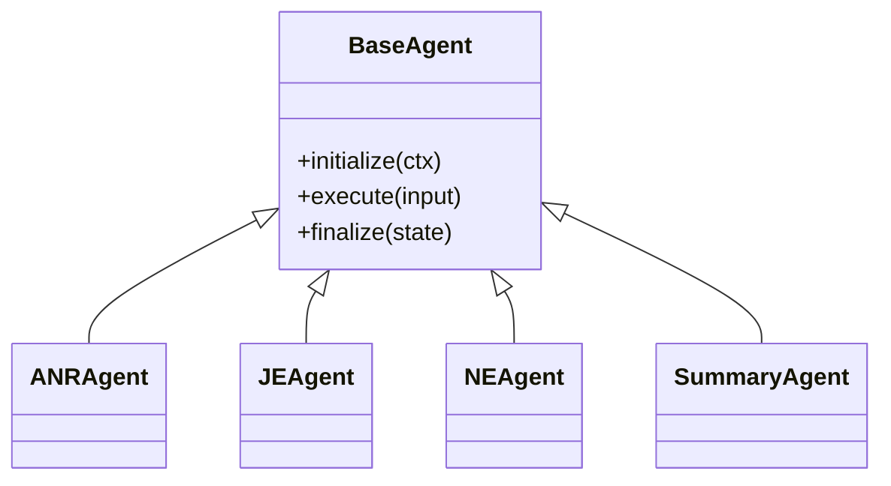
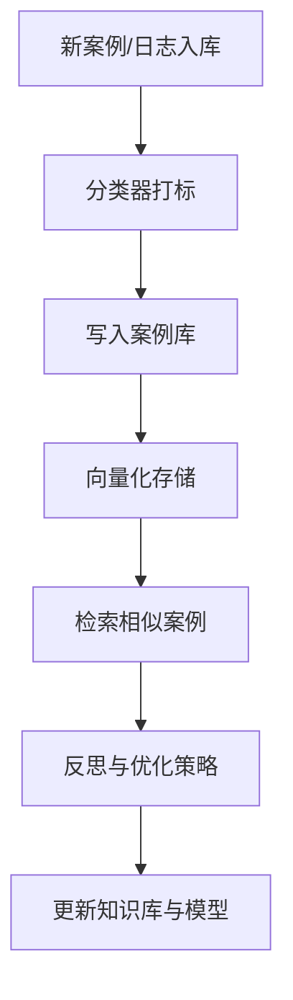
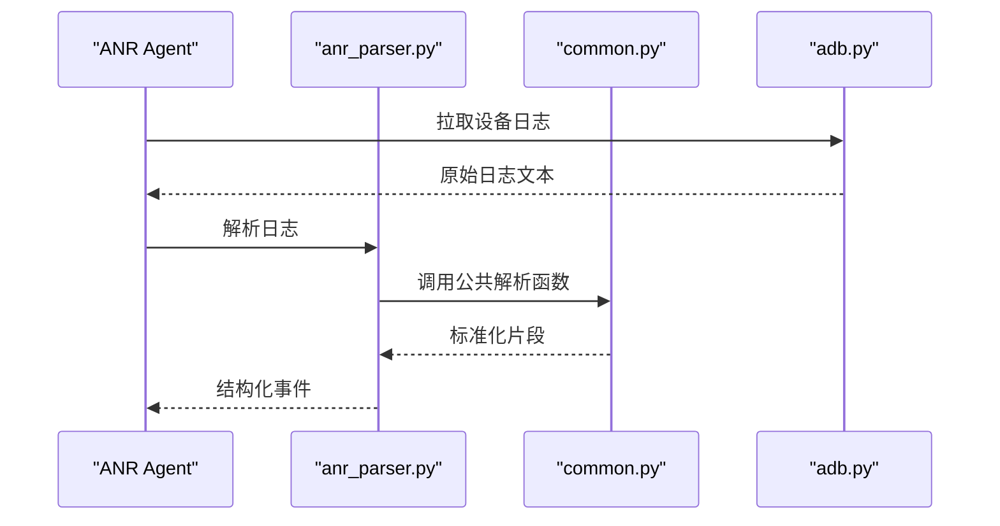
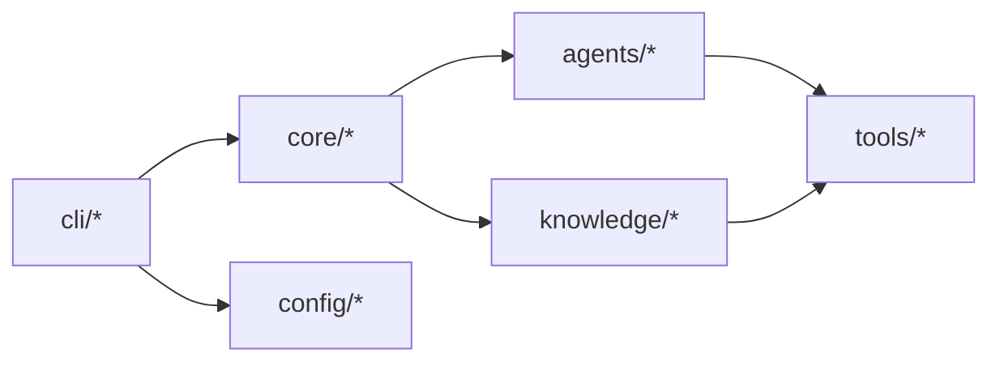
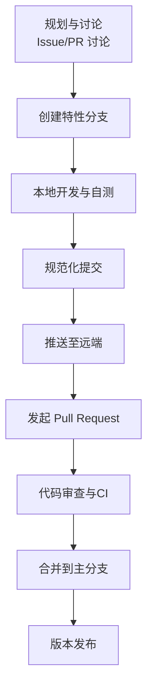

# 贡献工作流程

<cite>
**本文引用的文件**   
- [pyproject.toml](file://pyproject.toml)
- [.gitignore](file://.gitignore)
- [settings.example.toml](file://config/settings.example.toml)
- [settings.toml](file://config/settings.toml)
- [main.py](file://src/jirin/cli/main.py)
- [analyze.py](file://src/jirin/cli/commands/analyze.py)
- [config.py](file://src/jirin/cli/commands/config.py)
- [export.py](file://src/jirin/cli/commands/export.py)
- [learn.py](file://src/jirin/cli/commands/learn.py)
- [orchestrator.py](file://src/jirin/core/orchestrator.py)
- [agent_graph.py](file://src/jirin/core/agent_graph.py)
- [context.py](file://src/jirin/core/context.py)
- [state.py](file://src/jirin/core/state.py)
- [base.py](file://src/jirin/agents/base.py)
- [anr_agent.py](file://src/jirin/agents/anr_agent.py)
- [je_agent.py](file://src/jirin/agents/je_agent.py)
- [ne_agent.py](file://src/jirin/agents/ne_agent.py)
- [summary_agent.py](file://src/jirin/agents/summary_agent.py)
- [case_store.py](file://src/jirin/knowledge/case_store.py)
- [manager.py](file://src/jirin/knowledge/manager.py)
- [vector_store.py](file://src/jirin/knowledge/vector_store.py)
- [classifier.py](file://src/jirin/learning/classifier.py)
- [memory.py](file://src/jirin/learning/memory.py)
- [reflector.py](file://src/jirin/learning/reflector.py)
- [adb.py](file://src/jirin/tools/device/adb.py)
- [anr_parser.py](file://src/jirin/tools/log_parser/anr_parser.py)
- [je_parser.py](file://src/jirin/tools/log_parser/je_parser.py)
- [ne_parser.py](file://src/jirin/tools/log_parser/ne_parser.py)
- [common.py](file://src/jirin/tools/log_parser/common.py)
- [code_search.py](file://src/jirin/tools/search/code_search.py)
</cite>

## 目录
1. [简介](#简介)
2. [项目结构](#项目结构)
3. [核心组件](#核心组件)
4. [架构总览](#架构总览)
5. [详细组件分析](#详细组件分析)
6. [依赖分析](#依赖分析)
7. [性能考虑](#性能考虑)
8. [故障排查指南](#故障排查指南)
9. [结论](#结论)
10. [附录](#附录)

## 简介
本文件定义 Jirin 项目的贡献工作流程与协作规范，覆盖 Git 分支策略、提交信息规范、Pull Request 流程、代码审查要求；Issue 报告格式、功能请求流程、Bug 修复流程；新功能开发模板、文档更新要求、版本发布流程；以及社区行为准则与联系方式。目标是让新老贡献者快速上手、高效协作、稳定交付。

## 项目结构
Jirin 采用按领域分层组织：CLI 命令入口、核心编排与状态、Agent 实现、知识管理与学习、工具集（设备、日志解析、搜索）。配置与数据目录分离，便于本地开发与测试。

图表来源
- [main.py:1-200](file://src/jirin/cli/main.py#L1-L200)
- [analyze.py:1-200](file://src/jirin/cli/commands/analyze.py#L1-L200)
- [config.py:1-200](file://src/jirin/cli/commands/config.py#L1-L200)
- [export.py:1-200](file://src/jirin/cli/commands/export.py#L1-L200)
- [learn.py:1-200](file://src/jirin/cli/commands/learn.py#L1-L200)
- [orchestrator.py:1-200](file://src/jirin/core/orchestrator.py#L1-L200)
- [agent_graph.py:1-200](file://src/jirin/core/agent_graph.py#L1-L200)
- [context.py:1-200](file://src/jirin/core/context.py#L1-L200)
- [state.py:1-200](file://src/jirin/core/state.py#L1-L200)
- [base.py:1-200](file://src/jirin/agents/base.py#L1-L200)
- [anr_agent.py:1-200](file://src/jirin/agents/anr_agent.py#L1-L200)
- [je_agent.py:1-200](file://src/jirin/agents/je_agent.py#L1-L200)
- [ne_agent.py:1-200](file://src/jirin/agents/ne_agent.py#L1-L200)
- [summary_agent.py:1-200](file://src/jirin/agents/summary_agent.py#L1-L200)
- [manager.py:1-200](file://src/jirin/knowledge/manager.py#L1-L200)
- [case_store.py:1-200](file://src/jirin/knowledge/case_store.py#L1-L200)
- [vector_store.py:1-200](file://src/jirin/knowledge/vector_store.py#L1-L200)
- [classifier.py:1-200](file://src/jirin/learning/classifier.py#L1-L200)
- [memory.py:1-200](file://src/jirin/learning/memory.py#L1-L200)
- [reflector.py:1-200](file://src/jirin/learning/reflector.py#L1-L200)
- [adb.py:1-200](file://src/jirin/tools/device/adb.py#L1-L200)
- [common.py:1-200](file://src/jirin/tools/log_parser/common.py#L1-L200)
- [anr_parser.py:1-200](file://src/jirin/tools/log_parser/anr_parser.py#L1-L200)
- [je_parser.py:1-200](file://src/jirin/tools/log_parser/je_parser.py#L1-L200)
- [ne_parser.py:1-200](file://src/jirin/tools/log_parser/ne_parser.py#L1-L200)
- [code_search.py:1-200](file://src/jirin/tools/search/code_search.py#L1-L200)
- [settings.example.toml:1-200](file://config/settings.example.toml#L1-L200)
- [settings.toml:1-200](file://config/settings.toml#L1-L200)

章节来源
- [pyproject.toml](file://pyproject.toml)
- [.gitignore](file://.gitignore)
- [settings.example.toml:1-200](file://config/settings.example.toml#L1-L200)
- [settings.toml:1-200](file://config/settings.toml#L1-L200)
- [main.py:1-200](file://src/jirin/cli/main.py#L1-L200)

## 核心组件
- 命令行层：提供 analyze、config、export、learn 等子命令，统一入口在 main.py。
- 核心层：orchestrator 负责任务编排，agent_graph 管理 Agent 图，context/state 维护运行上下文与状态。
- Agent 层：以 base 为抽象基类，anr/je/ne/summary 分别处理不同场景的分析与总结。
- 知识与学习：manager 聚合 case_store 与 vector_store；classifier/memory/reflector 支撑学习与反思。
- 工具层：device/adb 用于设备交互；log_parser 下各解析器配合 common 公共逻辑；search/code_search 提供代码检索能力。
- 配置与数据：settings.example.toml 提供默认配置样例，settings.toml 为本地覆盖配置；data 目录存放用例、导出与记忆数据。

章节来源
- [main.py:1-200](file://src/jirin/cli/main.py#L1-L200)
- [orchestrator.py:1-200](file://src/jirin/core/orchestrator.py#L1-L200)
- [agent_graph.py:1-200](file://src/jirin/core/agent_graph.py#L1-L200)
- [context.py:1-200](file://src/jirin/core/context.py#L1-L200)
- [state.py:1-200](file://src/jirin/core/state.py#L1-L200)
- [base.py:1-200](file://src/jirin/agents/base.py#L1-L200)
- [anr_agent.py:1-200](file://src/jirin/agents/anr_agent.py#L1-L200)
- [je_agent.py:1-200](file://src/jirin/agents/je_agent.py#L1-L200)
- [ne_agent.py:1-200](file://src/jirin/agents/ne_agent.py#L1-L200)
- [summary_agent.py:1-200](file://src/jirin/agents/summary_agent.py#L1-L200)
- [manager.py:1-200](file://src/jirin/knowledge/manager.py#L1-L200)
- [case_store.py:1-200](file://src/jirin/knowledge/case_store.py#L1-L200)
- [vector_store.py:1-200](file://src/jirin/knowledge/vector_store.py#L1-L200)
- [classifier.py:1-200](file://src/jirin/learning/classifier.py#L1-L200)
- [memory.py:1-200](file://src/jirin/learning/memory.py#L1-L200)
- [reflector.py:1-200](file://src/jirin/learning/reflector.py#L1-L200)
- [adb.py:1-200](file://src/jirin/tools/device/adb.py#L1-L200)
- [common.py:1-200](file://src/jirin/tools/log_parser/common.py#L1-L200)
- [anr_parser.py:1-200](file://src/jirin/tools/log_parser/anr_parser.py#L1-L200)
- [je_parser.py:1-200](file://src/jirin/tools/log_parser/je_parser.py#L1-L200)
- [ne_parser.py:1-200](file://src/jirin/tools/log_parser/ne_parser.py#L1-L200)
- [code_search.py:1-200](file://src/jirin/tools/search/code_search.py#L1-L200)

## 架构总览
下图展示从 CLI 到核心编排、Agent、知识与学习、工具的调用关系，体现“命令驱动、编排调度、插件化 Agent、可插拔工具”的架构风格。

图表来源
- [main.py:1-200](file://src/jirin/cli/main.py#L1-L200)
- [analyze.py:1-200](file://src/jirin/cli/commands/analyze.py#L1-L200)
- [orchestrator.py:1-200](file://src/jirin/core/orchestrator.py#L1-L200)
- [agent_graph.py:1-200](file://src/jirin/core/agent_graph.py#L1-L200)
- [base.py:1-200](file://src/jirin/agents/base.py#L1-L200)
- [manager.py:1-200](file://src/jirin/knowledge/manager.py#L1-L200)
- [adb.py:1-200](file://src/jirin/tools/device/adb.py#L1-L200)

## 详细组件分析

### 命令行与命令模块
- 职责：解析参数、加载配置、调用核心编排、输出结果。
- 关键路径：
  - 入口：[main.py](file://src/jirin/cli/main.py)
  - 分析命令：[analyze.py](file://src/jirin/cli/commands/analyze.py)
  - 配置命令：[config.py](file://src/jirin/cli/commands/config.py)
  - 导出命令：[export.py](file://src/jirin/cli/commands/export.py)
  - 学习命令：[learn.py](file://src/jirin/cli/commands/learn.py)

图表来源
- [main.py:1-200](file://src/jirin/cli/main.py#L1-L200)
- [analyze.py:1-200](file://src/jirin/cli/commands/analyze.py#L1-L200)
- [config.py:1-200](file://src/jirin/cli/commands/config.py#L1-L200)
- [export.py:1-200](file://src/jirin/cli/commands/export.py#L1-L200)
- [learn.py:1-200](file://src/jirin/cli/commands/learn.py#L1-L200)

章节来源
- [main.py:1-200](file://src/jirin/cli/main.py#L1-L200)
- [analyze.py:1-200](file://src/jirin/cli/commands/analyze.py#L1-L200)
- [config.py:1-200](file://src/jirin/cli/commands/config.py#L1-L200)
- [export.py:1-200](file://src/jirin/cli/commands/export.py#L1-L200)
- [learn.py:1-200](file://src/jirin/cli/commands/learn.py#L1-L200)

### 核心编排与状态
- orchestrator：负责任务生命周期、并行度控制、错误恢复与结果汇总。
- agent_graph：描述 Agent 节点与边，支持动态加载与执行顺序。
- context/state：承载输入上下文、中间产物与最终状态，贯穿整个执行链路。

图表来源
- [orchestrator.py:1-200](file://src/jirin/core/orchestrator.py#L1-L200)
- [agent_graph.py:1-200](file://src/jirin/core/agent_graph.py#L1-L200)
- [context.py:1-200](file://src/jirin/core/context.py#L1-L200)
- [state.py:1-200](file://src/jirin/core/state.py#L1-L200)

章节来源
- [orchestrator.py:1-200](file://src/jirin/core/orchestrator.py#L1-L200)
- [agent_graph.py:1-200](file://src/jirin/core/agent_graph.py#L1-L200)
- [context.py:1-200](file://src/jirin/core/context.py#L1-L200)
- [state.py:1-200](file://src/jirin/core/state.py#L1-L200)

### Agent 体系
- base：定义 Agent 抽象接口与通用能力（初始化、执行、清理）。
- anr/je/ne/summary：针对特定问题域的实现，复用 base 能力并扩展领域逻辑。

图表来源
- [base.py:1-200](file://src/jirin/agents/base.py#L1-L200)
- [anr_agent.py:1-200](file://src/jirin/agents/anr_agent.py#L1-L200)
- [je_agent.py:1-200](file://src/jirin/agents/je_agent.py#L1-L200)
- [ne_agent.py:1-200](file://src/jirin/agents/ne_agent.py#L1-L200)
- [summary_agent.py:1-200](file://src/jirin/agents/summary_agent.py#L1-L200)

章节来源
- [base.py:1-200](file://src/jirin/agents/base.py#L1-L200)
- [anr_agent.py:1-200](file://src/jirin/agents/anr_agent.py#L1-L200)
- [je_agent.py:1-200](file://src/jirin/agents/je_agent.py#L1-L200)
- [ne_agent.py:1-200](file://src/jirin/agents/ne_agent.py#L1-L200)
- [summary_agent.py:1-200](file://src/jirin/agents/summary_agent.py#L1-L200)

### 知识与学习
- manager：统一管理知识存储与检索。
- case_store：结构化案例存取。
- vector_store：向量索引与相似度检索。
- classifier/memory/reflector：分类、记忆与反思机制，提升分析与建议质量。

图表来源
- [manager.py:1-200](file://src/jirin/knowledge/manager.py#L1-L200)
- [case_store.py:1-200](file://src/jirin/knowledge/case_store.py#L1-L200)
- [vector_store.py:1-200](file://src/jirin/knowledge/vector_store.py#L1-L200)
- [classifier.py:1-200](file://src/jirin/learning/classifier.py#L1-L200)
- [memory.py:1-200](file://src/jirin/learning/memory.py#L1-L200)
- [reflector.py:1-200](file://src/jirin/learning/reflector.py#L1-L200)

章节来源
- [manager.py:1-200](file://src/jirin/knowledge/manager.py#L1-L200)
- [case_store.py:1-200](file://src/jirin/knowledge/case_store.py#L1-L200)
- [vector_store.py:1-200](file://src/jirin/knowledge/vector_store.py#L1-L200)
- [classifier.py:1-200](file://src/jirin/learning/classifier.py#L1-L200)
- [memory.py:1-200](file://src/jirin/learning/memory.py#L1-L200)
- [reflector.py:1-200](file://src/jirin/learning/reflector.py#L1-L200)

### 工具层
- device/adb：设备连接与基础操作封装。
- log_parser：对 ANR/Java异常/Native异常日志进行解析，common 提供公共解析逻辑。
- search/code_search：基于代码语义或关键字的检索能力。

图表来源
- [anr_agent.py:1-200](file://src/jirin/agents/anr_agent.py#L1-L200)
- [anr_parser.py:1-200](file://src/jirin/tools/log_parser/anr_parser.py#L1-L200)
- [common.py:1-200](file://src/jirin/tools/log_parser/common.py#L1-L200)
- [adb.py:1-200](file://src/jirin/tools/device/adb.py#L1-L200)

章节来源
- [adb.py:1-200](file://src/jirin/tools/device/adb.py#L1-L200)
- [common.py:1-200](file://src/jirin/tools/log_parser/common.py#L1-L200)
- [anr_parser.py:1-200](file://src/jirin/tools/log_parser/anr_parser.py#L1-L200)
- [je_parser.py:1-200](file://src/jirin/tools/log_parser/je_parser.py#L1-L200)
- [ne_parser.py:1-200](file://src/jirin/tools/log_parser/ne_parser.py#L1-L200)
- [code_search.py:1-200](file://src/jirin/tools/search/code_search.py#L1-L200)

## 依赖分析
- 内部依赖：CLI 依赖 core 与 tools；core 依赖 agents 与 knowledge；agents 依赖 tools 与 knowledge。
- 外部依赖：通过 pyproject.toml 声明 Python 包依赖；配置文件使用 TOML；数据目录独立于源码。
- 耦合点：orchestrator 与 agent_graph 强耦合；Agent 与 tools 通过接口解耦；knowledge 与 learning 通过 manager 聚合。

图表来源
- [pyproject.toml](file://pyproject.toml)
- [main.py:1-200](file://src/jirin/cli/main.py#L1-L200)
- [orchestrator.py:1-200](file://src/jirin/core/orchestrator.py#L1-L200)
- [manager.py:1-200](file://src/jirin/knowledge/manager.py#L1-L200)

章节来源
- [pyproject.toml](file://pyproject.toml)
- [.gitignore](file://.gitignore)

## 性能考虑
- 并发与批处理：在 orchestrator 中合理设置并发度，避免 I/O 热点阻塞。
- 缓存与增量：对向量检索与案例查询引入缓存策略，减少重复计算。
- 日志与追踪：在关键路径埋点，记录耗时与错误，便于定位瓶颈。
- 资源限制：对大日志解析与搜索设置超时与内存上限，防止 OOM。

## 故障排查指南
- 常见问题
  - 配置缺失或无效：检查 settings.toml 是否包含必要字段，参考 settings.example.toml。
  - 设备不可用：确认 adb 可用且设备已授权。
  - 日志解析失败：核对日志格式与解析器匹配，查看 common 公共逻辑。
- 定位步骤
  - 启用详细日志与调试开关。
  - 复现最小用例，逐步缩小范围。
  - 检查 orchestrator 的错误处理与重试策略。
- 上报信息
  - 环境信息（系统、Python 版本、依赖版本）
  - 完整日志与堆栈
  - 复现步骤与期望/实际结果

章节来源
- [settings.example.toml:1-200](file://config/settings.example.toml#L1-L200)
- [settings.toml:1-200](file://config/settings.toml#L1-L200)
- [adb.py:1-200](file://src/jirin/tools/device/adb.py#L1-L200)
- [common.py:1-200](file://src/jirin/tools/log_parser/common.py#L1-L200)
- [orchestrator.py:1-200](file://src/jirin/core/orchestrator.py#L1-L200)

## 结论
本规范明确了 Jirin 的贡献流程与协作约定，确保从需求到发布的每个环节都可追溯、可评审、可回滚。遵循分支策略与提交规范，结合严格的 PR 审查与自动化检查，将显著提升代码质量与交付效率。

## 附录

### 贡献工作流程总览

### Git 分支策略
- 主分支
  - main：稳定发布基线，仅允许受控合并。
  - develop：集成开发分支，日常特性在此汇聚。
- 特性分支
  - feature/<ISSUE号>-<简短描述>：新功能开发。
  - fix/<ISSUE号>-<简短描述>：缺陷修复。
  - docs/<ISSUE号>-<简短描述>：文档更新。
  - refactor/<ISSUE号>-<简短描述>：重构与优化。
- 发布分支
  - release/vX.Y.Z：预发布准备，冻结非紧急变更。
- 热修复分支
  - hotfix/<ISSUE号>-<简短描述>：线上紧急修复。

### 提交信息规范
- 格式：type(scope): subject
- type 示例：feat、fix、docs、style、refactor、perf、test、build、ci、chore、revert
- scope 示例：cli、core、agents、knowledge、learning、tools、config
- 规则
  - 主题行不超过 72 字符，简明扼要说明变更目的。
  - 正文解释动机与影响，必要时列出破坏性变更。
  - 关联 Issue：在正文末尾添加 “Refs #<issue号>”。
  - 多提交尽量原子化，避免混合无关变更。

### Pull Request 流程
- 前置条件
  - 分支命名符合策略，提交信息规范。
  - 本地通过全部测试与静态检查。
- 内容要求
  - 变更摘要与影响范围说明。
  - 新增/修改 API 的兼容性说明。
  - 相关测试用例与覆盖率变化。
  - 文档与配置更新清单。
- 审查要点
  - 正确性与健壮性、可读性与可维护性、性能与安全、兼容性与回归风险。
- 合并策略
  - 至少一名 Maintainer 批准，CI 全绿，无冲突后 squash merge 或 rebase merge。

### 代码审查要求
- 关注点
  - 设计合理性、边界与异常处理、日志与可观测性、资源释放与并发安全。
- 反馈原则
  - 建设性、具体可操作、尊重作者、聚焦问题而非个人。
- 自动化
  - 强制 CI 检查：单元测试、集成测试、lint、类型检查、安全扫描。

### Issue 报告格式
- Bug 报告
  - 标题：清晰描述现象
  - 环境：操作系统、Python 版本、依赖版本
  - 复现步骤：编号步骤与预期/实际结果
  - 日志与堆栈：完整输出与截图
  - 附加材料：最小复现代码或数据
- 功能请求
  - 背景与目标
  - 使用场景与价值
  - 方案建议与替代方案
  - 验收标准

### 新功能开发模板
- 概述：功能目标与范围
- 设计：架构图与关键类/方法
- 接口：API 定义与示例
- 数据：模型与存储变更
- 测试：单元与集成用例
- 文档：README/帮助/示例更新
- 迁移：向后兼容与升级指引

### 文档更新要求
- 同步更新 README、命令帮助、配置说明与示例。
- 变更日志记录破坏性变更与重要改进。
- 图示与流程图保持与实际实现一致。

### 版本发布流程
- 版本号：遵循语义化版本（主.次.修订）
- 发布前
  - 冻结非紧急变更，完成回归测试与性能验证。
  - 更新变更日志与发布说明。
- 发布时
  - 打 tag 并发布制品，通知社区。
- 发布后
  - 监控告警与问题收集，必要时发布补丁版本。

### 社区行为准则
- 尊重与包容：尊重不同背景与观点，禁止歧视与骚扰。
- 专业与友善：理性讨论，聚焦问题，避免人身攻击。
- 透明与开放：公开决策过程，鼓励参与与反馈。
- 责任与担当：遵守承诺，及时响应，承担后果。

### 联系方式
- 问题与建议：通过 Issue 提交，选择合适标签。
- 讨论区：使用 Discussions 进行开放式交流。
- 邮件列表：用于正式公告与协调。
- 即时通讯：加入群组获取实时支持与答疑。