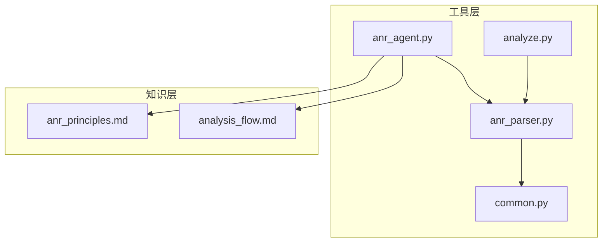
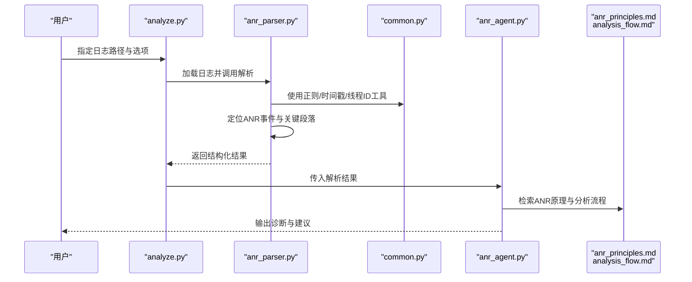
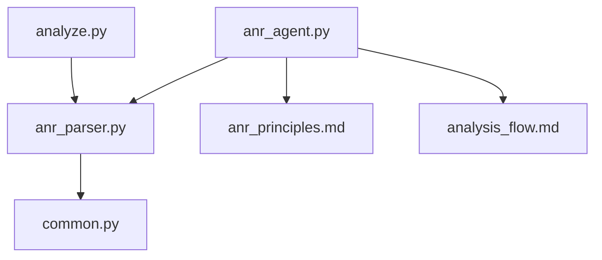

# ANR日志解析器

<cite>
**本文引用的文件**   
- [anr_parser.py](file://src/jirin/tools/log_parser/anr_parser.py)
- [common.py](file://src/jirin/tools/log_parser/common.py)
- [anr_agent.py](file://src/jirin/agents/anr_agent.py)
- [analyze.py](file://src/jirin/cli/commands/analyze.py)
- [analysis_flow.md](file://src/jirin/knowledge/static/analysis_flow.md)
- [anr_principles.md](file://src/jirin/knowledge/static/anr_principles.md)
</cite>

## 目录
1. [简介](#简介)
2. [项目结构](#项目结构)
3. [核心组件](#核心组件)
4. [架构总览](#架构总览)
5. [详细组件分析](#详细组件分析)
6. [依赖关系分析](#依赖关系分析)
7. [性能考虑](#性能考虑)
8. [故障排查指南](#故障排查指南)
9. [结论](#结论)
10. [附录](#附录)

## 简介
本技术文档面向Jirin的ANR（Application Not Responding）日志解析器，系统性阐述ANR日志的结构特征、关键信息提取逻辑与线程状态分析方法。文档覆盖主线程阻塞检测、死锁识别、I/O操作分析与系统调用监控的实现要点，并对ANR类型分类（InputDispatchTimeout、Watchdog、ServiceTimeout等）、堆栈跟踪解析与上下文信息提取进行详细说明。同时提供完整的ANR日志样本解析示例、输出数据结构定义以及常见ANR场景的诊断模式，并给出解析准确性优化与误报减少策略。

## 项目结构
ANR解析相关代码主要位于工具层与知识层：
- 工具层
  - log_parser/anr_parser.py：ANR日志解析的核心实现
  - log_parser/common.py：通用正则、时间戳处理、线程/进程ID归一化等公共能力
  - agents/anr_agent.py：将解析结果接入Agent工作流，驱动后续分析与报告生成
  - cli/commands/analyze.py：命令行入口，负责读取日志、调用解析器与导出结果
- 知识层
  - knowledge/static/anr_principles.md：ANR原理与分类说明
  - knowledge/static/analysis_flow.md：整体分析流程与阶段划分

图表来源
- [anr_parser.py](file://src/jirin/tools/log_parser/anr_parser.py)
- [common.py](file://src/jirin/tools/log_parser/common.py)
- [anr_agent.py](file://src/jirin/agents/anr_agent.py)
- [analyze.py](file://src/jirin/cli/commands/analyze.py)
- [anr_principles.md](file://src/jirin/knowledge/static/anr_principles.md)
- [analysis_flow.md](file://src/jirin/knowledge/static/analysis_flow.md)

章节来源
- [anr_parser.py](file://src/jirin/tools/log_parser/anr_parser.py)
- [common.py](file://src/jirin/tools/log_parser/common.py)
- [anr_agent.py](file://src/jirin/agents/anr_agent.py)
- [analyze.py](file://src/jirin/cli/commands/analyze.py)
- [anr_principles.md](file://src/jirin/knowledge/static/anr_principles.md)
- [analysis_flow.md](file://src/jirin/knowledge/static/analysis_flow.md)

## 核心组件
- ANR解析器（anr_parser.py）
  - 负责从原始logcat中定位ANR事件、提取关键段落（如“*** ***”、“main”线程堆栈、服务超时、输入分发超时等），并进行结构化输出。
  - 支持多类ANR类型的识别与区分，包括InputDispatchTimeout、Watchdog、ServiceTimeout等。
  - 对线程状态、同步原语（锁、条件变量）、I/O阻塞与系统调用进行标注与聚合。
- 公共模块（common.py）
  - 提供正则表达式集合、时间戳解析、线程/进程ID规范化、堆栈帧清洗与去重等基础能力。
- Agent集成（anr_agent.py）
  - 将解析结果注入Agent图，结合知识库（anr_principles.md、analysis_flow.md）进行推理与诊断建议生成。
- CLI入口（analyze.py）
  - 负责参数解析、日志加载、调用解析器、输出结构化结果或导出为下游工具可用格式。

章节来源
- [anr_parser.py](file://src/jirin/tools/log_parser/anr_parser.py)
- [common.py](file://src/jirin/tools/log_parser/common.py)
- [anr_agent.py](file://src/jirin/agents/anr_agent.py)
- [analyze.py](file://src/jirin/cli/commands/analyze.py)

## 架构总览
ANR解析的整体流程如下：
- 输入：Android设备logcat导出的文本日志
- 预处理：按进程/线程过滤、时间窗口裁剪、重复行清理
- 解析：基于规则与正则匹配定位ANR事件与关键段落
- 结构化：抽取ANR类型、触发时间、主线程/关键线程堆栈、锁等待、I/O阻塞、系统调用等
- 增强：结合知识库进行根因假设与风险评分
- 输出：结构化JSON/Markdown报告，供Agent进一步分析或人工复核

图表来源
- [analyze.py](file://src/jirin/cli/commands/analyze.py)
- [anr_parser.py](file://src/jirin/tools/log_parser/anr_parser.py)
- [common.py](file://src/jirin/tools/log_parser/common.py)
- [anr_agent.py](file://src/jirin/agents/anr_agent.py)
- [anr_principles.md](file://src/jirin/knowledge/static/anr_principles.md)
- [analysis_flow.md](file://src/jirin/knowledge/static/analysis_flow.md)

## 详细组件分析

### ANR日志结构与关键信息
- 典型ANR日志片段包含：
  - 事件头：包含ANR类型与触发时间
  - 主线程堆栈：显示当前执行位置与调用链
  - 其他线程堆栈：用于判断是否存在死锁或资源竞争
  - 锁与同步信息：如持有锁、等待锁、条件变量
  - I/O与系统调用：如磁盘读写、网络请求、Binder调用
- 关键信息提取逻辑：
  - 通过正则匹配定位“ANR”关键字与类型标签
  - 以“main”线程为核心，提取其堆栈帧序列
  - 扫描其他线程，识别锁持有者与等待者，构建锁图
  - 标记I/O阻塞点与系统调用热点

章节来源
- [anr_parser.py](file://src/jirin/tools/log_parser/anr_parser.py)
- [common.py](file://src/jirin/tools/log_parser/common.py)

### 主线程阻塞检测
- 检测目标：主线程长时间处于非响应状态（UI无刷新、输入无响应）
- 实现要点：
  - 定位“main”线程堆栈，检查是否停留在UI调度、消息循环或长耗时任务
  - 结合时间戳计算阻塞持续时间
  - 若存在锁等待，记录锁对象与持有线程
- 输出字段：
  - 主线程阻塞开始/结束时间
  - 阻塞原因（锁等待、I/O阻塞、CPU占用过高）
  - 相关堆栈摘要与关键帧

章节来源
- [anr_parser.py](file://src/jirin/tools/log_parser/anr_parser.py)

### 死锁识别
- 检测目标：两个或多个线程互相等待对方持有的锁
- 实现要点：
  - 构建“线程-锁”关系图，识别环状依赖
  - 标注每个线程的锁持有与等待状态
  - 输出死锁路径与最小环路
- 输出字段：
  - 参与死锁的线程列表
  - 锁对象标识与获取顺序
  - 死锁路径描述

章节来源
- [anr_parser.py](file://src/jirin/tools/log_parser/anr_parser.py)

### I/O操作分析
- 检测目标：磁盘读写、网络请求、数据库查询等I/O导致的阻塞
- 实现要点：
  - 在堆栈中标记I/O相关方法名与库调用
  - 统计I/O热点方法与调用次数
  - 关联系统调用（如read/write/ioctl）与错误码
- 输出字段：
  - I/O热点方法列表
  - 平均/最大I/O耗时估计
  - 相关错误码与重试次数

章节来源
- [anr_parser.py](file://src/jirin/tools/log_parser/anr_parser.py)

### 系统调用监控
- 检测目标：底层系统调用引发的阻塞或异常
- 实现要点：
  - 扫描内核态堆栈或应用层封装的系统调用
  - 记录系统调用名称、参数与返回值
  - 与上层方法建立映射，便于定位业务代码
- 输出字段：
  - 系统调用清单与调用频次
  - 失败调用与错误码
  - 与业务方法的关联关系

章节来源
- [anr_parser.py](file://src/jirin/tools/log_parser/anr_parser.py)

### ANR类型分类
- InputDispatchTimeout：输入事件分发超时，通常与主线程阻塞相关
- Watchdog：系统守护进程检测到应用无响应
- ServiceTimeout：后台服务启动或执行超时
- 分类依据：
  - 日志中的类型标签与触发源
  - 主线程与其他线程的状态差异
  - 是否存在特定服务或广播接收器的上下文

章节来源
- [anr_parser.py](file://src/jirin/tools/log_parser/anr_parser.py)
- [anr_principles.md](file://src/jirin/knowledge/static/anr_principles.md)

### 堆栈跟踪解析与上下文信息提取
- 堆栈解析：
  - 识别堆栈起始与结束边界
  - 提取方法名、类名、文件名与行号
  - 去重与合并相似帧
- 上下文提取：
  - 捕获ANR前后时间窗口的关键日志
  - 提取相关线程的最近活动与状态变化
  - 收集系统属性与服务状态快照

章节来源
- [anr_parser.py](file://src/jirin/tools/log_parser/anr_parser.py)
- [common.py](file://src/jirin/tools/log_parser/common.py)

### 完整ANR日志样本解析示例
- 输入：包含ANR事件、主线程堆栈、其他线程堆栈与锁信息的logcat片段
- 处理步骤：
  - 定位ANR事件头与类型
  - 提取主线程堆栈并标注阻塞点
  - 构建锁图并识别死锁
  - 标记I/O与系统调用热点
- 输出：结构化JSON，包含ANR类型、时间、线程状态、锁关系、I/O与系统调用摘要

章节来源
- [anr_parser.py](file://src/jirin/tools/log_parser/anr_parser.py)

### 输出数据结构定义
- 顶层字段：
  - anr_type：ANR类型（InputDispatchTimeout、Watchdog、ServiceTimeout等）
  - timestamp：触发时间戳
  - process_id：进程ID
  - main_thread：主线程信息（状态、堆栈摘要、阻塞原因）
  - other_threads：其他线程列表（状态、堆栈摘要、锁关系）
  - locks：锁关系图（持有者、等待者、环状依赖）
  - io_hotspots：I/O热点方法与时耗估计
  - syscalls：系统调用清单与错误码
  - context：上下文信息（前后日志片段、服务状态）
- 字段约束：
  - 所有时间戳统一为UTC毫秒
  - 线程ID与方法名需经规范化处理
  - 锁对象标识唯一且可追溯

章节来源
- [anr_parser.py](file://src/jirin/tools/log_parser/anr_parser.py)

### 常见ANR场景的诊断模式
- UI线程阻塞：主线程执行长耗时任务导致输入无响应
- 死锁：多个线程互相等待锁导致永久阻塞
- I/O瓶颈：大量磁盘或网络I/O导致主线程等待
- 系统调用异常：底层系统调用失败或超时引发上层阻塞
- 服务启动超时：后台服务初始化耗时过长被系统判定为超时

章节来源
- [anr_principles.md](file://src/jirin/knowledge/static/anr_principles.md)
- [anr_parser.py](file://src/jirin/tools/log_parser/anr_parser.py)

### 解析准确性优化与误报减少策略
- 正则优化：
  - 针对特定厂商logcat格式扩展匹配规则
  - 引入上下文校验，避免误匹配相似文本
- 时间窗口裁剪：
  - 仅保留ANR前后合理时间段的日志，降低噪声
- 去重与合并：
  - 对重复堆栈帧与方法调用进行合并，突出关键路径
- 置信度评分：
  - 基于证据强度（锁环、I/O热点、系统调用错误）计算根因置信度
- 反馈闭环：
  - 记录误报案例并持续迭代规则集

章节来源
- [anr_parser.py](file://src/jirin/tools/log_parser/anr_parser.py)
- [common.py](file://src/jirin/tools/log_parser/common.py)

## 依赖关系分析
ANR解析器与其依赖的关系如下：
- anr_parser.py依赖common.py提供的正则与工具函数
- anr_agent.py依赖anr_parser.py的输出并结合知识库进行推理
- analyze.py作为CLI入口，协调日志加载与解析流程

图表来源
- [anr_parser.py](file://src/jirin/tools/log_parser/anr_parser.py)
- [common.py](file://src/jirin/tools/log_parser/common.py)
- [anr_agent.py](file://src/jirin/agents/anr_agent.py)
- [analyze.py](file://src/jirin/cli/commands/analyze.py)
- [anr_principles.md](file://src/jirin/knowledge/static/anr_principles.md)
- [analysis_flow.md](file://src/jirin/knowledge/static/analysis_flow.md)

章节来源
- [anr_parser.py](file://src/jirin/tools/log_parser/anr_parser.py)
- [common.py](file://src/jirin/tools/log_parser/common.py)
- [anr_agent.py](file://src/jirin/agents/anr_agent.py)
- [analyze.py](file://src/jirin/cli/commands/analyze.py)
- [anr_principles.md](file://src/jirin/knowledge/static/anr_principles.md)
- [analysis_flow.md](file://src/jirin/knowledge/static/analysis_flow.md)

## 性能考虑
- 日志分块读取：避免一次性加载大日志到内存
- 正则预编译：提升匹配效率
- 并行线程扫描：对多进程日志进行并发解析
- 增量更新：仅对新追加日志进行解析与合并
- 缓存机制：对已解析的堆栈与方法信息进行缓存，减少重复计算

[本节为通用性能指导，不直接分析具体文件]

## 故障排查指南
- 常见问题：
  - 无法定位ANR事件：检查日志是否包含完整ANR头与类型标签
  - 主线程堆栈缺失：确认logcat权限与导出范围
  - 锁关系不完整：确保其他线程堆栈与锁信息未被截断
  - I/O与系统调用未识别：验证正则规则是否覆盖目标平台
- 调试建议：
  - 启用详细日志模式，输出中间解析结果
  - 使用样例日志进行回归测试，验证规则有效性
  - 对比不同厂商logcat格式，扩展匹配规则

章节来源
- [anr_parser.py](file://src/jirin/tools/log_parser/anr_parser.py)
- [common.py](file://src/jirin/tools/log_parser/common.py)

## 结论
Jirin的ANR日志解析器通过规则与正则匹配，结合线程状态、锁关系、I/O与系统调用分析，能够准确识别多种ANR类型并提供结构化输出。配合Agent与知识库，可实现自动化诊断与建议生成。通过持续优化正则规则、时间窗口裁剪与置信度评分，可有效提升解析准确性并减少误报。

[本节为总结性内容，不直接分析具体文件]

## 附录
- 术语表：
  - ANR：Application Not Responding，应用无响应
  - 主线程：Android应用中负责UI交互与消息循环的线程
  - 锁图：表示线程与锁之间持有与等待关系的有向图
  - I/O热点：频繁或耗时较长的I/O操作集合
  - 系统调用：应用层与内核交互的接口
- 参考链接：
  - Android官方ANR文档
  - logcat使用指南

[本节为概念性内容，不直接分析具体文件]