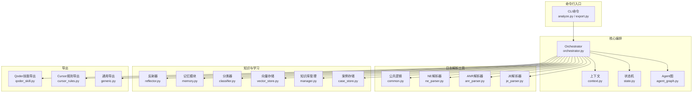
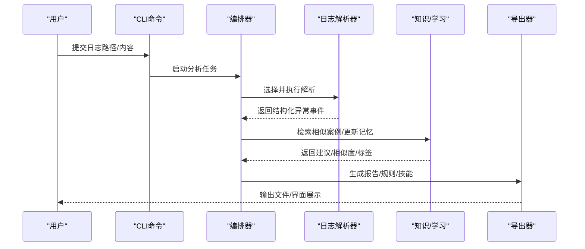
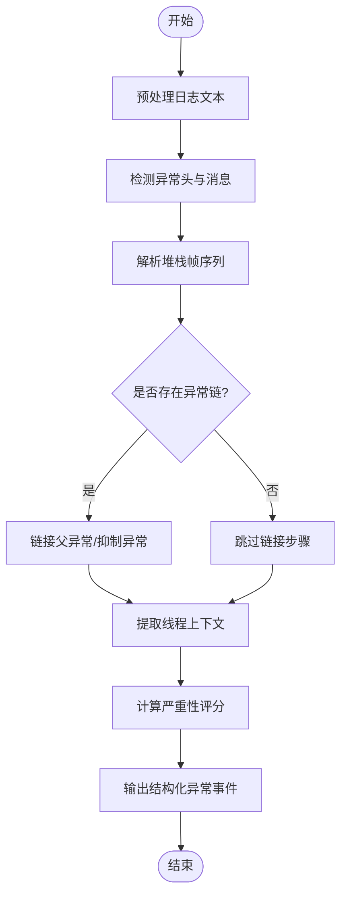
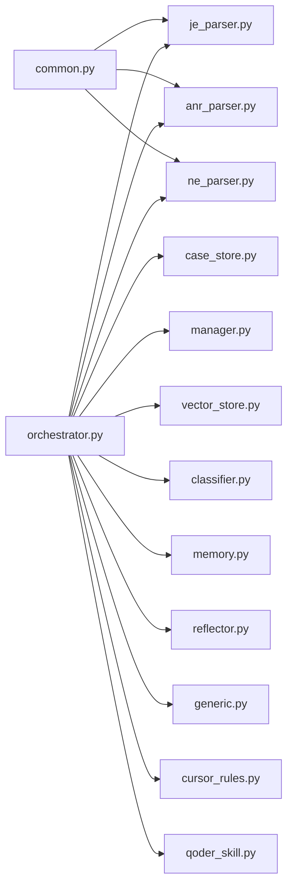

# Java异常日志解析器

<cite>
**本文引用的文件**   
- [je_parser.py](file://src/jirin/tools/log_parser/je_parser.py)
- [anr_parser.py](file://src/jirin/tools/log_parser/anr_parser.py)
- [ne_parser.py](file://src/jirin/tools/log_parser/ne_parser.py)
- [common.py](file://src/jirin/tools/log_parser/common.py)
- [__init__.py](file://src/jirin/tools/log_parser/__init__.py)
- [agent_graph.py](file://src/jirin/core/agent_graph.py)
- [orchestrator.py](file://src/jirin/core/orchestrator.py)
- [state.py](file://src/jirin/core/state.py)
- [context.py](file://src/jirin/core/context.py)
- [analyze.py](file://src/jirin/cli/commands/analyze.py)
- [export.py](file://src/jirin/cli/commands/export.py)
- [generic.py](file://src/jirin/export/generic.py)
- [cursor_rules.py](file://src/jirin/export/cursor_rules.py)
- [qoder_skill.py](file://src/jirin/export/qoder_skill.py)
- [case_store.py](file://src/jirin/knowledge/case_store.py)
- [manager.py](file://src/jirin/knowledge/manager.py)
- [vector_store.py](file://src/jirin/knowledge/vector_store.py)
- [classifier.py](file://src/jirin/learning/classifier.py)
- [memory.py](file://src/jirin/learning/memory.py)
- [reflector.py](file://src/jirin/learning/reflector.py)
</cite>

## 目录
1. [简介](#简介)
2. [项目结构](#项目结构)
3. [核心组件](#核心组件)
4. [架构总览](#架构总览)
5. [详细组件分析](#详细组件分析)
6. [依赖关系分析](#依赖关系分析)
7. [性能考虑](#性能考虑)
8. [故障排查指南](#故障排查指南)
9. [结论](#结论)
10. [附录](#附录)

## 简介
本技术文档聚焦于Jirin的Java异常日志解析能力，围绕以下目标展开：
- 全面说明Java异常堆栈跟踪的解析逻辑、异常类型识别与错误分类机制
- 记录常见异常的自动识别与处理策略（如空指针、内存溢出、并发修改等）
- 阐述异常链追踪、线程上下文关联与代码位置映射的实现细节
- 提供完整的异常日志解析示例、结构化输出格式与严重性评估方法
- 覆盖多语言异常消息处理、第三方库异常适配与性能监控集成方案

## 项目结构
本项目采用“工具层 + 核心编排 + 知识/学习 + CLI入口”的分层组织方式。与Java异常日志解析直接相关的模块位于tools/log_parser下，并通过core与cli进行编排与调用；knowledge与learning用于案例存储、向量检索与学习增强；export负责将解析结果导出为多种格式。

图表来源
- [orchestrator.py](file://src/jirin/core/orchestrator.py)
- [agent_graph.py](file://src/jirin/core/agent_graph.py)
- [state.py](file://src/jirin/core/state.py)
- [context.py](file://src/jirin/core/context.py)
- [je_parser.py](file://src/jirin/tools/log_parser/je_parser.py)
- [anr_parser.py](file://src/jirin/tools/log_parser/anr_parser.py)
- [ne_parser.py](file://src/jirin/tools/log_parser/ne_parser.py)
- [common.py](file://src/jirin/tools/log_parser/common.py)
- [case_store.py](file://src/jirin/knowledge/case_store.py)
- [manager.py](file://src/jirin/knowledge/manager.py)
- [vector_store.py](file://src/jirin/knowledge/vector_store.py)
- [classifier.py](file://src/jirin/learning/classifier.py)
- [memory.py](file://src/jirin/learning/memory.py)
- [reflector.py](file://src/jirin/learning/reflector.py)
- [generic.py](file://src/jirin/export/generic.py)
- [cursor_rules.py](file://src/jirin/export/cursor_rules.py)
- [qoder_skill.py](file://src/jirin/export/qoder_skill.py)

章节来源
- [je_parser.py](file://src/jirin/tools/log_parser/je_parser.py)
- [anr_parser.py](file://src/jirin/tools/log_parser/anr_parser.py)
- [ne_parser.py](file://src/jirin/tools/log_parser/ne_parser.py)
- [common.py](file://src/jirin/tools/log_parser/common.py)
- [__init__.py](file://src/jirin/tools/log_parser/__init__.py)
- [orchestrator.py](file://src/jirin/core/orchestrator.py)
- [agent_graph.py](file://src/jirin/core/agent_graph.py)
- [state.py](file://src/jirin/core/state.py)
- [context.py](file://src/jirin/core/context.py)
- [analyze.py](file://src/jirin/cli/commands/analyze.py)
- [export.py](file://src/jirin/cli/commands/export.py)
- [generic.py](file://src/jirin/export/generic.py)
- [cursor_rules.py](file://src/jirin/export/cursor_rules.py)
- [qoder_skill.py](file://src/jirin/export/qoder_skill.py)
- [case_store.py](file://src/jirin/knowledge/case_store.py)
- [manager.py](file://src/jirin/knowledge/manager.py)
- [vector_store.py](file://src/jirin/knowledge/vector_store.py)
- [classifier.py](file://src/jirin/learning/classifier.py)
- [memory.py](file://src/jirin/learning/memory.py)
- [reflector.py](file://src/jirin/learning/reflector.py)

## 核心组件
- 日志解析器族
  - Java异常（JE）解析器：负责从原始日志中抽取异常类型、消息、堆栈帧、线程信息，并构建结构化对象
  - ANR/NE解析器：分别针对Android应用无响应与Native崩溃场景，复用公共解析能力
  - 公共模块：提供正则匹配、文本清洗、时间戳/线程名提取、堆栈规范化等基础能力
- 编排与状态
  - Orchestrator：统一调度解析流程、加载配置、协调各解析器与导出器
  - Agent图与状态机：定义解析阶段、节点流转与中间态持久化
  - 上下文：承载输入日志、解析结果、元数据与临时缓存
- 知识与学习
  - 案例存储与向量检索：支持历史相似案例召回与对比
  - 分类器与记忆：对异常进行分类、聚类与经验沉淀
  - 反射器：动态扩展异常类型与处理策略
- 导出
  - 通用导出：JSON/YAML/Markdown等结构化输出
  - Cursor规则导出：生成IDE辅助规则
  - Qoder技能导出：生成可被智能体消费的技能描述

章节来源
- [je_parser.py](file://src/jirin/tools/log_parser/je_parser.py)
- [anr_parser.py](file://src/jirin/tools/log_parser/anr_parser.py)
- [ne_parser.py](file://src/jirin/tools/log_parser/ne_parser.py)
- [common.py](file://src/jirin/tools/log_parser/common.py)
- [__init__.py](file://src/jirin/tools/log_parser/__init__.py)
- [orchestrator.py](file://src/jirin/core/orchestrator.py)
- [agent_graph.py](file://src/jirin/core/agent_graph.py)
- [state.py](file://src/jirin/core/state.py)
- [context.py](file://src/jirin/core/context.py)
- [generic.py](file://src/jirin/export/generic.py)
- [cursor_rules.py](file://src/jirin/export/cursor_rules.py)
- [qoder_skill.py](file://src/jirin/export/qoder_skill.py)
- [case_store.py](file://src/jirin/knowledge/case_store.py)
- [manager.py](file://src/jirin/knowledge/manager.py)
- [vector_store.py](file://src/jirin/knowledge/vector_store.py)
- [classifier.py](file://src/jirin/learning/classifier.py)
- [memory.py](file://src/jirin/learning/memory.py)
- [reflector.py](file://src/jirin/learning/reflector.py)

## 架构总览
下图展示了从CLI到解析器、再到导出与知识增强的端到端流程。

图表来源
- [analyze.py](file://src/jirin/cli/commands/analyze.py)
- [export.py](file://src/jirin/cli/commands/export.py)
- [orchestrator.py](file://src/jirin/core/orchestrator.py)
- [je_parser.py](file://src/jirin/tools/log_parser/je_parser.py)
- [anr_parser.py](file://src/jirin/tools/log_parser/anr_parser.py)
- [ne_parser.py](file://src/jirin/tools/log_parser/ne_parser.py)
- [generic.py](file://src/jirin/export/generic.py)
- [cursor_rules.py](file://src/jirin/export/cursor_rules.py)
- [qoder_skill.py](file://src/jirin/export/qoder_skill.py)
- [case_store.py](file://src/jirin/knowledge/case_store.py)
- [manager.py](file://src/jirin/knowledge/manager.py)
- [vector_store.py](file://src/jirin/knowledge/vector_store.py)
- [classifier.py](file://src/jirin/learning/classifier.py)
- [memory.py](file://src/jirin/learning/memory.py)
- [reflector.py](file://src/jirin/learning/reflector.py)

## 详细组件分析

### Java异常（JE）解析器
职责与能力
- 从原始日志中识别异常头、异常链、堆栈帧、线程上下文
- 标准化堆栈帧格式，提取类名、方法名、源文件与行号
- 识别常见异常类型并进行初步分类
- 输出结构化异常事件，包含元数据、严重性评分与建议

关键流程
- 输入预处理：过滤无关日志、合并多行堆栈、清理空白与噪声
- 异常头匹配：定位异常类型与消息
- 堆栈解析：逐行解析帧信息，构建有序列表
- 异常链追踪：根据cause/Suppressed字段建立链式关系
- 线程上下文：提取线程名、优先级、守护标志等
- 严重性评估：基于异常类型、堆栈深度、是否主线程、是否重复出现等因素打分
- 输出构造：组装结构化对象供后续使用

图表来源
- [je_parser.py](file://src/jirin/tools/log_parser/je_parser.py)
- [common.py](file://src/jirin/tools/log_parser/common.py)

章节来源
- [je_parser.py](file://src/jirin/tools/log_parser/je_parser.py)
- [common.py](file://src/jirin/tools/log_parser/common.py)

#### 常见异常识别与处理
- NullPointerException
  - 识别特征：异常类型为NPE或消息中包含空引用相关关键词
  - 处理要点：标记高风险，优先检查最近一次访问对象的调用点
- OutOfMemoryError
  - 识别特征：异常类型为OOM或消息包含内存不足关键字
  - 处理要点：结合堆大小、GC日志、分配热点进行二次分析
- ConcurrentModificationException
  - 识别特征：异常类型为CME或消息包含并发修改关键字
  - 处理要点：定位迭代器与集合修改的交叉点，建议加锁或使用并发安全容器

章节来源
- [je_parser.py](file://src/jirin/tools/log_parser/je_parser.py)

### ANR与NE解析器
- ANR解析器：面向Android应用无响应场景，解析主线程阻塞、Looper等待、InputDispatcher超时等线索
- NE解析器：面向Native崩溃，解析信号、段错误、寄存器快照与JNI调用栈

二者均复用公共解析能力，并在各自领域内做特定模式匹配与上下文增强。

章节来源
- [anr_parser.py](file://src/jirin/tools/log_parser/anr_parser.py)
- [ne_parser.py](file://src/jirin/tools/log_parser/ne_parser.py)
- [common.py](file://src/jirin/tools/log_parser/common.py)

### 公共解析能力（common）
- 文本清洗：去除ANSI颜色码、控制字符、多余换行
- 正则匹配：异常头、堆栈帧、线程头、时间戳、包名前缀
- 规范化：统一类名与方法签名格式，归一化路径分隔符
- 工具函数：行号提取、文件名剥离、包名推断、去重与压缩

章节来源
- [common.py](file://src/jirin/tools/log_parser/common.py)

### 编排与状态（orchestrator、agent_graph、state、context）
- Orchestrator：负责加载配置、选择解析器、驱动解析流程、聚合结果
- Agent图：以有向图形式定义解析阶段与依赖关系
- 状态机：维护解析生命周期与中间态
- 上下文：贯穿整个流程的数据载体，包括输入、中间结果、元数据与缓存

章节来源
- [orchestrator.py](file://src/jirin/core/orchestrator.py)
- [agent_graph.py](file://src/jirin/core/agent_graph.py)
- [state.py](file://src/jirin/core/state.py)
- [context.py](file://src/jirin/core/context.py)

### 知识与学习（case_store、manager、vector_store、classifier、memory、reflector）
- 案例存储：持久化历史异常案例，支持按类型、时间、严重度检索
- 向量存储：对异常描述与堆栈摘要进行向量化，提升相似案例召回质量
- 分类器：基于规则与模型对异常进行分类与打标签
- 记忆模块：沉淀高频问题与修复经验，形成可复用的建议
- 反射器：动态注册新的异常类型与处理策略，实现可扩展性

章节来源
- [case_store.py](file://src/jirin/knowledge/case_store.py)
- [manager.py](file://src/jirin/knowledge/manager.py)
- [vector_store.py](file://src/jirin/knowledge/vector_store.py)
- [classifier.py](file://src/jirin/learning/classifier.py)
- [memory.py](file://src/jirin/learning/memory.py)
- [reflector.py](file://src/jirin/learning/reflector.py)

### 导出（generic、cursor_rules、qoder_skill）
- 通用导出：将结构化异常事件导出为JSON/YAML/Markdown等格式
- Cursor规则导出：生成IDE侧的规则文件，辅助开发者快速定位问题
- Qoder技能导出：生成智能体可消费的技能描述，便于自动化分析与修复

章节来源
- [generic.py](file://src/jirin/export/generic.py)
- [cursor_rules.py](file://src/jirin/export/cursor_rules.py)
- [qoder_skill.py](file://src/jirin/export/qoder_skill.py)

## 依赖关系分析
- 解析器之间通过公共模块解耦，避免重复实现
- 编排器作为中心枢纽，降低上层调用复杂度
- 知识与学习模块可选接入，不影响基础解析链路
- 导出模块独立于解析器，便于替换与扩展

图表来源
- [common.py](file://src/jirin/tools/log_parser/common.py)
- [je_parser.py](file://src/jirin/tools/log_parser/je_parser.py)
- [anr_parser.py](file://src/jirin/tools/log_parser/anr_parser.py)
- [ne_parser.py](file://src/jirin/tools/log_parser/ne_parser.py)
- [orchestrator.py](file://src/jirin/core/orchestrator.py)
- [case_store.py](file://src/jirin/knowledge/case_store.py)
- [manager.py](file://src/jirin/knowledge/manager.py)
- [vector_store.py](file://src/jirin/knowledge/vector_store.py)
- [classifier.py](file://src/jirin/learning/classifier.py)
- [memory.py](file://src/jirin/learning/memory.py)
- [reflector.py](file://src/jirin/learning/reflector.py)
- [generic.py](file://src/jirin/export/generic.py)
- [cursor_rules.py](file://src/jirin/export/cursor_rules.py)
- [qoder_skill.py](file://src/jirin/export/qoder_skill.py)

章节来源
- [je_parser.py](file://src/jirin/tools/log_parser/je_parser.py)
- [anr_parser.py](file://src/jirin/tools/log_parser/anr_parser.py)
- [ne_parser.py](file://src/jirin/tools/log_parser/ne_parser.py)
- [common.py](file://src/jirin/tools/log_parser/common.py)
- [orchestrator.py](file://src/jirin/core/orchestrator.py)
- [generic.py](file://src/jirin/export/generic.py)
- [cursor_rules.py](file://src/jirin/export/cursor_rules.py)
- [qoder_skill.py](file://src/jirin/export/qoder_skill.py)
- [case_store.py](file://src/jirin/knowledge/case_store.py)
- [manager.py](file://src/jirin/knowledge/manager.py)
- [vector_store.py](file://src/jirin/knowledge/vector_store.py)
- [classifier.py](file://src/jirin/learning/classifier.py)
- [memory.py](file://src/jirin/learning/memory.py)
- [reflector.py](file://src/jirin/learning/reflector.py)

## 性能考虑
- 流式读取与分块解析：对大日志文件采用增量读取，避免一次性载入内存
- 正则优化：预编译常用正则表达式，减少重复开销
- 去重与压缩：对重复堆栈帧进行压缩，降低输出体积
- 并行处理：在CPU密集环节（如向量化、分类）启用多线程或多进程
- 缓存命中：对相似异常进行指纹缓存，加速后续分析
- I/O优化：批量写入导出文件，减少系统调用次数

[本节为通用指导，不直接分析具体文件]

## 故障排查指南
- 解析失败
  - 检查日志格式是否符合预期，确认异常头与堆栈帧是否完整
  - 查看公共模块的正则匹配是否覆盖当前日志变体
- 异常链断裂
  - 确认cause/Suppressed字段是否被正确识别与链接
  - 检查跨行拼接是否正确
- 线程上下文缺失
  - 验证线程头是否被识别，必要时调整线程名匹配规则
- 严重性评分异常
  - 核对评分因子权重与阈值设置
  - 检查是否误判主线程或重复出现频率
- 导出异常
  - 确认导出模板与字段映射是否一致
  - 检查权限与路径有效性

章节来源
- [je_parser.py](file://src/jirin/tools/log_parser/je_parser.py)
- [common.py](file://src/jirin/tools/log_parser/common.py)
- [generic.py](file://src/jirin/export/generic.py)

## 结论
Jirin的Java异常日志解析器通过模块化设计与可扩展机制，实现了从原始日志到结构化异常事件的稳定转换。借助公共解析能力、编排器与知识/学习模块，系统在准确性、可维护性与智能化方面具备良好平衡。未来可在异常根因定位、自动修复建议与更丰富的导出形态上持续演进。

[本节为总结性内容，不直接分析具体文件]

## 附录

### 结构化输出格式（示例）
以下为典型的结构化输出字段说明（字段名称与层级以实际实现为准）：
- 基本信息
  - 异常类型：字符串，表示异常类全限定名
  - 异常消息：字符串，原始或标准化后的消息
  - 发生时间：时间戳或ISO字符串
  - 平台/环境：设备、操作系统、运行时版本等
- 线程上下文
  - 线程名：字符串
  - 线程ID：整数
  - 是否主线程：布尔
  - 守护标志：布尔
- 堆栈帧
  - 序号：整数
  - 类名：字符串
  - 方法名：字符串
  - 源文件：字符串
  - 行号：整数
  - 包名：字符串（可选）
- 异常链
  - 父异常：引用或嵌套对象
  - 抑制异常：数组
- 严重性评估
  - 评分：数值
  - 等级：枚举（低/中/高/致命）
  - 依据：数组，列出影响评分的关键因素
- 建议与标签
  - 建议：字符串或数组
  - 标签：数组，如“空指针”、“内存溢出”、“并发问题”等
- 元数据
  - 解析器版本：字符串
  - 处理耗时：毫秒
  - 日志长度：字节数
  - 去重统计：整数

章节来源
- [je_parser.py](file://src/jirin/tools/log_parser/je_parser.py)
- [generic.py](file://src/jirin/export/generic.py)

### 多语言异常消息处理
- 语言检测：基于消息前缀、编码特征与区域设置判断
- 翻译与归一化：将多语言消息转换为统一语义表达，便于分类与检索
- 术语映射：将不同语言的异常关键词映射到标准术语集

章节来源
- [je_parser.py](file://src/jirin/tools/log_parser/je_parser.py)
- [common.py](file://src/jirin/tools/log_parser/common.py)

### 第三方库异常适配
- 白名单/黑名单：对已知第三方库异常进行特殊处理或忽略
- 包名前缀：按包名分组，应用不同的解析策略
- 插件机制：通过反射器动态注册新库的适配规则

章节来源
- [je_parser.py](file://src/jirin/tools/log_parser/je_parser.py)
- [reflector.py](file://src/jirin/learning/reflector.py)

### 性能监控集成方案
- 指标采集：解析耗时、内存占用、正则命中率、去重率
- 采样与限流：对高频异常进行采样分析，避免过载
- 告警与上报：当严重性超过阈值时触发告警，并上报至监控系统

章节来源
- [orchestrator.py](file://src/jirin/core/orchestrator.py)
- [generic.py](file://src/jirin/export/generic.py)