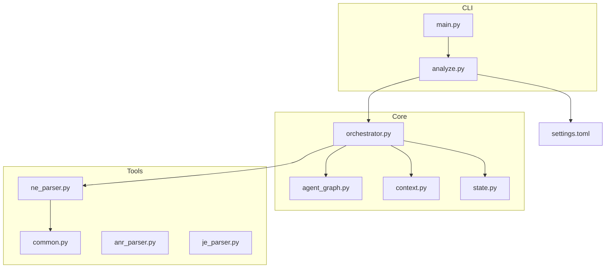
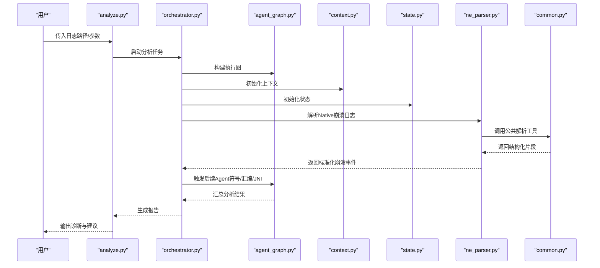
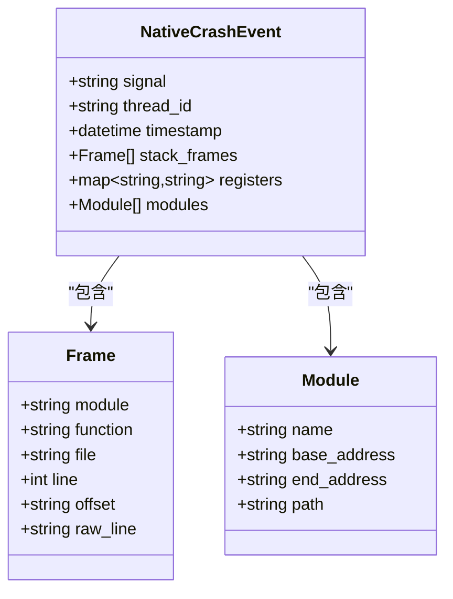
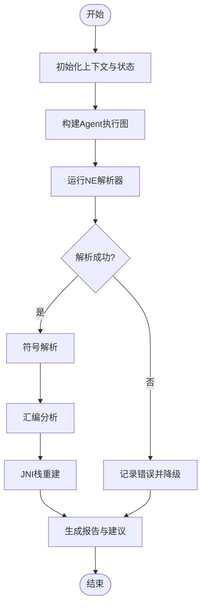
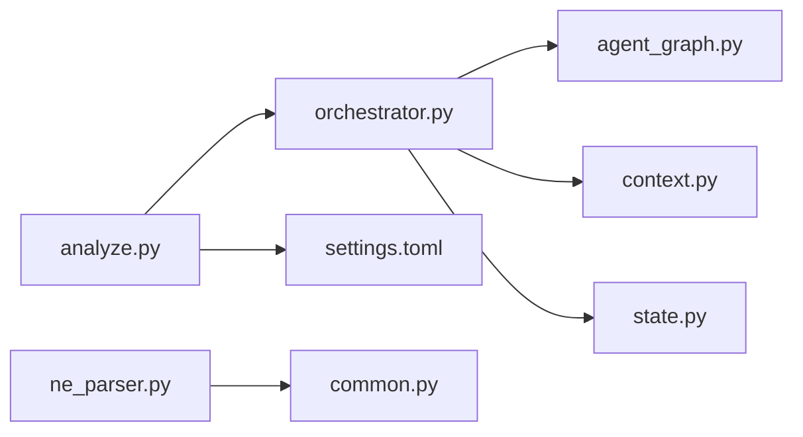
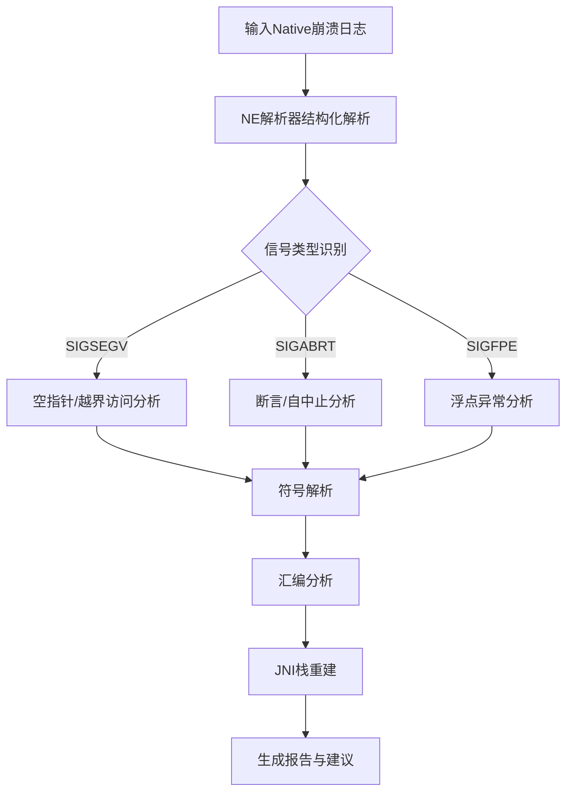

# Native崩溃日志解析器

<cite>
**本文引用的文件**   
- [ne_parser.py](file://src/jirin/tools/log_parser/ne_parser.py)
- [common.py](file://src/jirin/tools/log_parser/common.py)
- [anr_parser.py](file://src/jirin/tools/log_parser/anr_parser.py)
- [je_parser.py](file://src/jirin/tools/log_parser/je_parser.py)
- [agent_graph.py](file://src/jirin/core/agent_graph.py)
- [orchestrator.py](file://src/jirin/core/orchestrator.py)
- [context.py](file://src/jirin/core/context.py)
- [state.py](file://src/jirin/core/state.py)
- [analyze.py](file://src/jirin/cli/commands/analyze.py)
- [main.py](file://src/jirin/cli/main.py)
- [settings.toml](file://config/settings.toml)
</cite>

## 目录
1. [简介](#简介)
2. [项目结构](#项目结构)
3. [核心组件](#核心组件)
4. [架构总览](#架构总览)
5. [详细组件分析](#详细组件分析)
6. [依赖关系分析](#依赖关系分析)
7. [性能考虑](#性能考虑)
8. [故障排查指南](#故障排查指南)
9. [结论](#结论)
10. [附录](#附录)

## 简介
本技术文档面向Jirin的Native崩溃日志解析能力，聚焦于Native层崩溃的特征识别、信号处理与崩溃现场分析。内容覆盖SIGSEGV、SIGABRT、SIGFPE等关键信号的解析逻辑、寄存器状态提取、内存布局分析；并给出JNI调用栈重建、C/C++符号解析与汇编代码分析的集成方案。同时提供完整的Native崩溃日志解析示例、崩溃原因推断与修复建议生成流程，记录NDK调试符号处理、多线程崩溃分析与跨平台兼容性要点。

## 项目结构
本项目采用“工具解析 + 编排调度 + CLI入口”的分层组织方式：
- 工具层：log_parser下包含ANR、Java异常（JE）与Native错误（NE）解析器，其中NE解析器负责Native崩溃日志的结构化解析。
- 核心层：orchestrator与agent_graph负责任务编排与Agent协作；context与state承载上下文与状态。
- CLI层：main与analyze命令提供命令行入口与分析流程触发点。
- 配置层：settings.toml提供全局配置项。

图表来源
- [main.py](file://src/jirin/cli/main.py)
- [analyze.py](file://src/jirin/cli/commands/analyze.py)
- [orchestrator.py](file://src/jirin/core/orchestrator.py)
- [agent_graph.py](file://src/jirin/core/agent_graph.py)
- [context.py](file://src/jirin/core/context.py)
- [state.py](file://src/jirin/core/state.py)
- [ne_parser.py](file://src/jirin/tools/log_parser/ne_parser.py)
- [common.py](file://src/jirin/tools/log_parser/common.py)
- [settings.toml](file://config/settings.toml)

章节来源
- [main.py](file://src/jirin/cli/main.py)
- [analyze.py](file://src/jirin/cli/commands/analyze.py)
- [orchestrator.py](file://src/jirin/core/orchestrator.py)
- [agent_graph.py](file://src/jirin/core/agent_graph.py)
- [context.py](file://src/jirin/core/context.py)
- [state.py](file://src/jirin/core/state.py)
- [ne_parser.py](file://src/jirin/tools/log_parser/ne_parser.py)
- [common.py](file://src/jirin/tools/log_parser/common.py)
- [settings.toml](file://config/settings.toml)

## 核心组件
- Native错误解析器（NE Parser）
  - 职责：从原始Native崩溃日志中抽取信号类型、崩溃地址、线程信息、寄存器快照、堆栈帧、模块映射等结构化数据。
  - 输入：系统或应用输出的Native崩溃文本日志。
  - 输出：标准化的崩溃事件模型，供上层分析与修复建议生成使用。
- 公共解析工具（Common）
  - 职责：提供正则匹配、时间戳解析、地址对齐、十六进制格式统一等通用能力。
- 编排与上下文（Orchestrator/Agent Graph/Context/State）
  - 职责：协调解析器与其他Agent（如符号解析、汇编分析、JNI栈重建）完成端到端分析流程，维护分析上下文与中间结果。
- CLI入口（Main/Analyze）
  - 职责：接收用户参数，加载配置，启动分析流程，输出报告。

章节来源
- [ne_parser.py](file://src/jirin/tools/log_parser/ne_parser.py)
- [common.py](file://src/jirin/tools/log_parser/common.py)
- [orchestrator.py](file://src/jirin/core/orchestrator.py)
- [agent_graph.py](file://src/jirin/core/agent_graph.py)
- [context.py](file://src/jirin/core/context.py)
- [state.py](file://src/jirin/core/state.py)
- [analyze.py](file://src/jirin/cli/commands/analyze.py)
- [main.py](file://src/jirin/cli/main.py)

## 架构总览
整体流程由CLI驱动，通过编排器调度解析器与相关Agent，最终产出可操作的诊断报告。

图表来源
- [analyze.py](file://src/jirin/cli/commands/analyze.py)
- [orchestrator.py](file://src/jirin/core/orchestrator.py)
- [agent_graph.py](file://src/jirin/core/agent_graph.py)
- [context.py](file://src/jirin/core/context.py)
- [state.py](file://src/jirin/core/state.py)
- [ne_parser.py](file://src/jirin/tools/log_parser/ne_parser.py)
- [common.py](file://src/jirin/tools/log_parser/common.py)

## 详细组件分析

### Native错误解析器（NE Parser）
- 功能要点
  - 信号识别：支持SIGSEGV、SIGABRT、SIGFPE等常见致命信号的类型判定与分类。
  - 崩溃现场：提取PC、SP、LR、R0-R12等寄存器快照，以及线程ID、崩溃时间、进程名。
  - 堆栈帧：解析每帧的模块名、偏移量、函数名（若可用）、源文件与行号（若符号完整）。
  - 模块映射：收集.so/.dll基址与范围，用于后续符号解析与地址重定位。
  - JNI栈重建：在存在Java侧关联时，尝试拼接JNI调用链，辅助定位上层触发点。
  - 内存布局：结合模块映射与寄存器访问地址，判断越界、空指针、未对齐访问等典型问题。
- 数据结构与复杂度
  - 主要对象包括：崩溃事件、线程快照、寄存器集合、堆栈帧列表、模块映射表。
  - 解析过程以线性扫描为主，正则匹配与字典查找为O(n)，总体时间复杂度近似O(n)。
- 错误处理与边界条件
  - 对缺失字段进行容错填充，避免中断主流程。
  - 对非法十六进制或越界地址进行校验与告警。
  - 对多语言编码与换行差异进行规范化处理。
- 优化机会
  - 预编译正则表达式，减少重复开销。
  - 增量解析大日志，分块读取降低内存峰值。
  - 缓存模块映射与符号表，避免重复加载。

图表来源
- [ne_parser.py](file://src/jirin/tools/log_parser/ne_parser.py)

章节来源
- [ne_parser.py](file://src/jirin/tools/log_parser/ne_parser.py)

### 公共解析工具（Common）
- 功能要点
  - 正则库：封装常用模式（信号头、寄存器行、帧行、模块映射行）。
  - 数值转换：十六进制/十进制互转、地址对齐计算、偏移量归一化。
  - 文本清洗：去除ANSI控制码、统一换行、过滤空行。
- 复杂度与健壮性
  - 正则匹配为O(n)，具备良好容错与回退策略。
  - 提供可选的严格模式与宽松模式，适配不同设备/系统输出差异。

章节来源
- [common.py](file://src/jirin/tools/log_parser/common.py)

### 编排与上下文（Orchestrator/Agent Graph/Context/State）
- 编排器（Orchestrator）
  - 负责按依赖顺序调度解析器与后续分析Agent，管理并发与重试。
- Agent图（Agent Graph）
  - 定义节点与边，表达“解析→符号→汇编→JNI→报告”的执行流。
- 上下文（Context）
  - 保存输入日志、中间产物、配置项与临时缓存。
- 状态（State）
  - 记录各阶段执行结果、错误信息与进度。

图表来源
- [orchestrator.py](file://src/jirin/core/orchestrator.py)
- [agent_graph.py](file://src/jirin/core/agent_graph.py)
- [context.py](file://src/jirin/core/context.py)
- [state.py](file://src/jirin/core/state.py)

章节来源
- [orchestrator.py](file://src/jirin/core/orchestrator.py)
- [agent_graph.py](file://src/jirin/core/agent_graph.py)
- [context.py](file://src/jirin/core/context.py)
- [state.py](file://src/jirin/core/state.py)

### CLI入口（Main/Analyze）
- main.py
  - 解析命令行参数，加载配置，分发到具体命令。
- analyze.py
  - 实现“分析”命令：读取日志、调用编排器、输出报告。

章节来源
- [main.py](file://src/jirin/cli/main.py)
- [analyze.py](file://src/jirin/cli/commands/analyze.py)

## 依赖关系分析
- 内部依赖
  - analyze.py依赖orchestrator.py与settings.toml。
  - orchestrator.py依赖agent_graph.py、context.py、state.py。
  - ne_parser.py依赖common.py。
- 外部依赖
  - 符号解析与汇编分析通常依赖NDK工具链（如addr2line、llvm-symbolizer、objdump），可通过配置注入路径与环境变量。
  - JNI栈重建可能依赖Java侧崩溃日志或JNI导出符号表。

图表来源
- [analyze.py](file://src/jirin/cli/commands/analyze.py)
- [orchestrator.py](file://src/jirin/core/orchestrator.py)
- [agent_graph.py](file://src/jirin/core/agent_graph.py)
- [context.py](file://src/jirin/core/context.py)
- [state.py](file://src/jirin/core/state.py)
- [ne_parser.py](file://src/jirin/tools/log_parser/ne_parser.py)
- [common.py](file://src/jirin/tools/log_parser/common.py)
- [settings.toml](file://config/settings.toml)

章节来源
- [analyze.py](file://src/jirin/cli/commands/analyze.py)
- [orchestrator.py](file://src/jirin/core/orchestrator.py)
- [agent_graph.py](file://src/jirin/core/agent_graph.py)
- [context.py](file://src/jirin/core/context.py)
- [state.py](file://src/jirin/core/state.py)
- [ne_parser.py](file://src/jirin/tools/log_parser/ne_parser.py)
- [common.py](file://src/jirin/tools/log_parser/common.py)
- [settings.toml](file://config/settings.toml)

## 性能考虑
- 解析效率
  - 预编译正则、惰性读取大日志、分块处理以降低内存占用。
- 符号解析
  - 缓存符号表与模块映射，按需增量更新。
- 并发与并行
  - 在安全前提下并行执行独立Agent（如多个线程的符号解析）。
- I/O优化
  - 使用缓冲读写与流式输出，避免一次性加载全部日志到内存。

[本节为通用指导，不直接分析具体文件]

## 故障排查指南
- 常见问题
  - 日志不完整或缺失关键帧：检查采集链路是否截断，确认日志完整性。
  - 符号缺失导致无法定位函数：确认NDK调试符号路径与版本一致。
  - 多线程竞争导致的非确定性崩溃：结合线程快照与锁持有信息进行交叉验证。
  - 跨平台差异（ARM vs x86_64）：确保寄存器集与ABI规则正确匹配。
- 定位步骤
  - 使用NE解析器输出结构化事件，核对信号类型与崩溃地址。
  - 通过符号解析将偏移还原为函数名与源码位置。
  - 借助汇编分析验证指令级行为（如越界访存、除零）。
  - 结合JNI栈重建，追溯上层调用路径。
- 恢复与改进
  - 增加更严格的输入校验与容错分支。
  - 引入单元测试与回归用例，覆盖典型崩溃样本。
  - 完善配置项，支持动态切换解析模式与工具路径。

章节来源
- [ne_parser.py](file://src/jirin/tools/log_parser/ne_parser.py)
- [common.py](file://src/jirin/tools/log_parser/common.py)
- [orchestrator.py](file://src/jirin/core/orchestrator.py)
- [agent_graph.py](file://src/jirin/core/agent_graph.py)
- [context.py](file://src/jirin/core/context.py)
- [state.py](file://src/jirin/core/state.py)
- [analyze.py](file://src/jirin/cli/commands/analyze.py)

## 结论
Jirin的Native崩溃日志解析器通过模块化设计与清晰的编排流程，实现了从原始日志到可操作诊断报告的端到端能力。其核心在于稳健的信号识别、现场提取与符号/汇编/JNI集成，配合完善的上下文与状态管理，能够在复杂场景下提供高可用的崩溃分析体验。未来可在符号解析性能、多线程并发与跨平台适配方面持续优化。

[本节为总结性内容，不直接分析具体文件]

## 附录

### 解析流程示例（概念性）
以下为概念性流程图，展示从日志输入到报告输出的关键步骤。该图不绑定具体源码文件。

[此图为概念性说明，无需图表来源]

### NDK调试符号处理
- 符号来源
  - .so/.dll中的调试信息（DWARF/PDB），或通过ndk-stack/llvm-symbolizer生成的符号表。
- 路径配置
  - 在配置文件中指定符号目录与工具链路径，确保与目标二进制版本一致。
- 版本一致性
  - 保证编译产物与符号版本一致，避免符号错位。

[本节为通用指导，不直接分析具体文件]

### 多线程崩溃分析
- 线程快照
  - 提取每个线程的寄存器与堆栈，识别主线程与工作线程的差异。
- 竞态条件
  - 结合锁持有与共享资源访问轨迹，定位潜在竞态。
- 死锁与饥饿
  - 分析等待图与同步原语，识别阻塞点。

[本节为通用指导，不直接分析具体文件]

### 跨平台兼容性
- ABI与寄存器集
  - ARM/ARM64/x86/x86_64寄存器命名与对齐规则不同，需根据目标平台选择正确的解析模板。
- 日志格式差异
  - 不同Android版本或厂商定制输出可能存在差异，需在公共工具中提供兼容模式。
- 工具链差异
  - addr2line、llvm-symbolizer、objdump在不同平台的用法略有差异，应通过配置抽象。

[本节为通用指导，不直接分析具体文件]