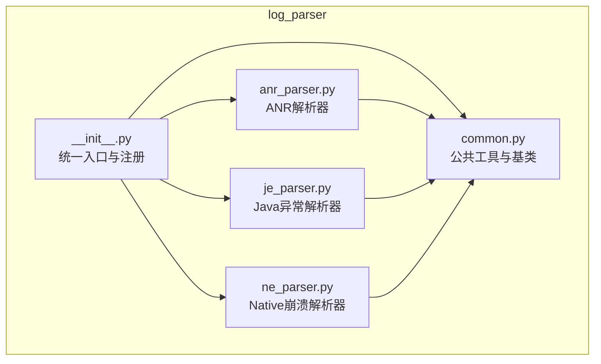
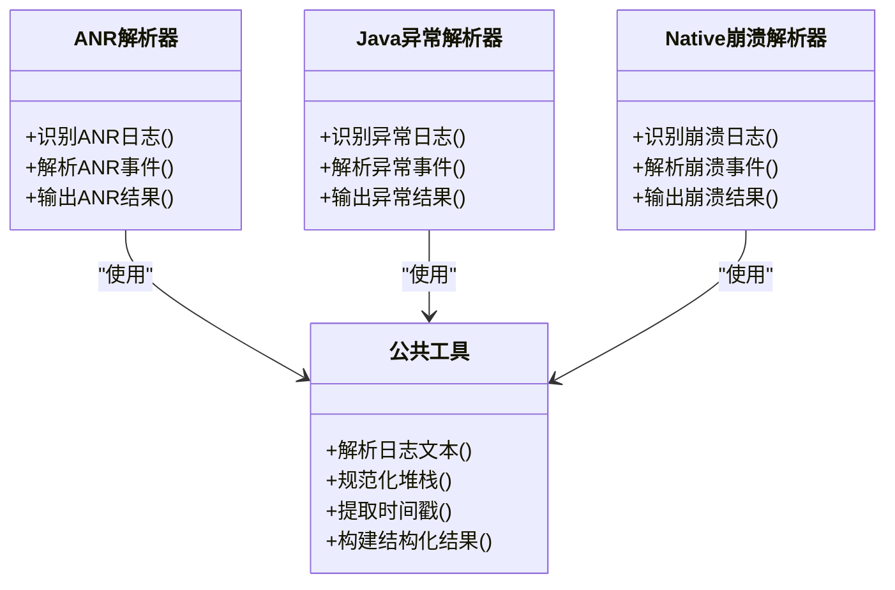
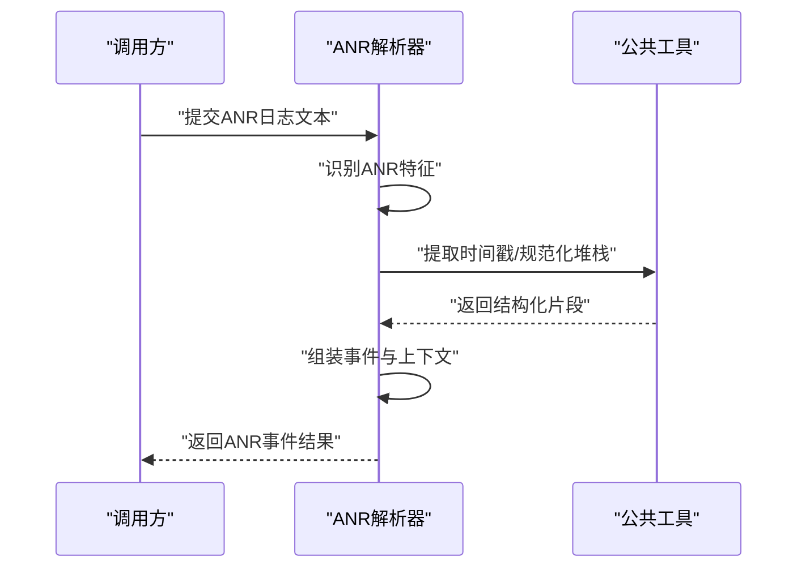
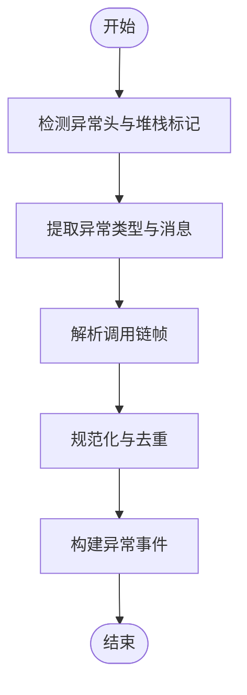
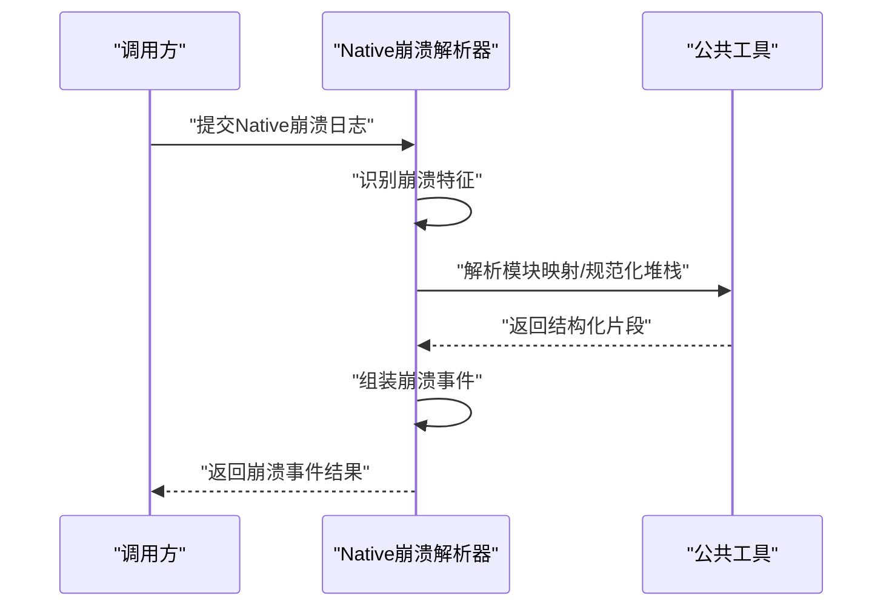
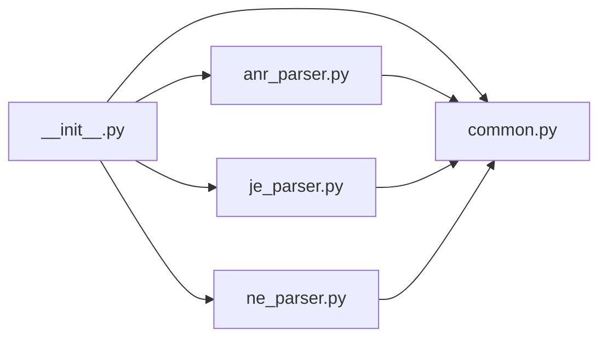

# 日志解析器

<cite>
**本文引用的文件**   
- [src/jirin/tools/log_parser/__init__.py](file://src/jirin/tools/log_parser/__init__.py)
- [src/jirin/tools/log_parser/common.py](file://src/jirin/tools/log_parser/common.py)
- [src/jirin/tools/log_parser/anr_parser.py](file://src/jirin/tools/log_parser/anr_parser.py)
- [src/jirin/tools/log_parser/je_parser.py](file://src/jirin/tools/log_parser/je_parser.py)
- [src/jirin/tools/log_parser/ne_parser.py](file://src/jirin/tools/log_parser/ne_parser.py)
</cite>

## 目录
1. [简介](#简介)
2. [项目结构](#项目结构)
3. [核心组件](#核心组件)
4. [架构总览](#架构总览)
5. [详细组件分析](#详细组件分析)
6. [依赖关系分析](#依赖关系分析)
7. [性能考虑](#性能考虑)
8. [故障排查指南](#故障排查指南)
9. [结论](#结论)
10. [附录](#附录)

## 简介
本技术文档面向Jirin的日志解析器子系统，聚焦统一架构设计、公共工具与基类实现，并深入说明ANR日志解析器、Java异常日志解析器（JE）、Native崩溃日志解析器（NE）的解析逻辑、数据结构定义与输出格式。同时提供自定义解析器的开发指南、测试方法与最佳实践，涵盖性能优化、错误处理与兼容性策略。

## 项目结构
日志解析器位于 tools/log_parser 目录下，采用“公共层 + 多解析器”的分层组织方式：
- 公共层：提供通用数据结构、正则工具、时间戳处理、堆栈归一化等能力
- 解析器层：针对ANR、Java异常、Native崩溃三类日志分别实现专用解析器
- 入口层：通过包级 __init__ 暴露统一的注册与调用接口

图表来源
- [src/jirin/tools/log_parser/__init__.py](file://src/jirin/tools/log_parser/__init__.py)
- [src/jirin/tools/log_parser/common.py](file://src/jirin/tools/log_parser/common.py)
- [src/jirin/tools/log_parser/anr_parser.py](file://src/jirin/tools/log_parser/anr_parser.py)
- [src/jirin/tools/log_parser/je_parser.py](file://src/jirin/tools/log_parser/je_parser.py)
- [src/jirin/tools/log_parser/ne_parser.py](file://src/jirin/tools/log_parser/ne_parser.py)

章节来源
- [src/jirin/tools/log_parser/__init__.py](file://src/jirin/tools/log_parser/__init__.py)
- [src/jirin/tools/log_parser/common.py](file://src/jirin/tools/log_parser/common.py)
- [src/jirin/tools/log_parser/anr_parser.py](file://src/jirin/tools/log_parser/anr_parser.py)
- [src/jirin/tools/log_parser/je_parser.py](file://src/jirin/tools/log_parser/je_parser.py)
- [src/jirin/tools/log_parser/ne_parser.py](file://src/jirin/tools/log_parser/ne_parser.py)

## 核心组件
本节概述公共工具与基类的职责边界，以及各解析器的输入输出契约。

- 公共工具与基类（common.py）
  - 提供统一的日志行模型、结构化结果模型、时间戳解析、堆栈帧规范化、正则表达式缓存等基础能力
  - 定义解析器基类或协议，约束子类必须实现的接口（如识别规则、主解析函数、辅助方法）
  - 提供跨解析器复用的错误分类与上下文提取工具

- ANR解析器（anr_parser.py）
  - 负责从Android ANR日志中抽取关键信息：应用进程、线程、阻塞原因、主线程堆栈、系统服务交互点等
  - 输出包含事件元数据、根因线索、可执行路径建议的结构化对象

- Java异常解析器（je_parser.py）
  - 负责从Java异常堆栈中提取异常类型、消息、触发位置、调用链、相关模块与参数摘要
  - 输出标准化异常事件，便于后续分析与检索

- Native崩溃解析器（ne_parser.py）
  - 负责从Native崩溃日志中定位崩溃信号、寄存器状态、崩溃地址、符号化堆栈、共享库信息等
  - 输出崩溃事件，包含二进制映射、偏移量、符号信息与调试建议

章节来源
- [src/jirin/tools/log_parser/common.py](file://src/jirin/tools/log_parser/common.py)
- [src/jirin/tools/log_parser/anr_parser.py](file://src/jirin/tools/log_parser/anr_parser.py)
- [src/jirin/tools/log_parser/je_parser.py](file://src/jirin/tools/log_parser/je_parser.py)
- [src/jirin/tools/log_parser/ne_parser.py](file://src/jirin/tools/log_parser/ne_parser.py)

## 架构总览
解析器采用“统一入口 + 插件式解析器”的架构。入口负责分发与聚合，解析器遵循统一协议，公共层提供通用能力。

图表来源
- [src/jirin/tools/log_parser/common.py](file://src/jirin/tools/log_parser/common.py)
- [src/jirin/tools/log_parser/anr_parser.py](file://src/jirin/tools/log_parser/anr_parser.py)
- [src/jirin/tools/log_parser/je_parser.py](file://src/jirin/tools/log_parser/je_parser.py)
- [src/jirin/tools/log_parser/ne_parser.py](file://src/jirin/tools/log_parser/ne_parser.py)

## 详细组件分析

### 公共工具与基类（common.py）
- 职责
  - 提供日志行模型与结构化结果模型，确保不同解析器输出一致
  - 封装常用正则匹配、时间戳解析、堆栈帧清洗与排序
  - 定义解析器协议（识别、解析、输出），降低耦合度
- 关键抽象
  - 识别规则：用于快速判断日志是否属于某类问题
  - 解析主流程：将原始文本转换为结构化事件
  - 辅助方法：堆栈归一化、上下文片段提取、错误分类
- 复杂度与性能
  - 正则表达式缓存避免重复编译开销
  - 流式读取与分块处理以降低内存占用
  - 对大日志进行预过滤以减少无效匹配

章节来源
- [src/jirin/tools/log_parser/common.py](file://src/jirin/tools/log_parser/common.py)

### ANR解析器（anr_parser.py）
- 解析目标
  - Android ANR日志中的关键线索：应用标识、线程名、阻塞点、主线程堆栈、系统服务交互
- 主要流程
  - 识别ANR特征：关键字、时间窗口、线程状态
  - 抽取事件元数据：应用、进程、时间、设备信息
  - 解析堆栈：主线程与关键子线程堆栈，定位热点方法
  - 生成结果：结构化事件，包含根因线索与建议步骤
- 数据结构
  - 事件对象：包含应用、线程、阻塞原因、堆栈列表、上下文片段
  - 堆栈帧：方法签名、文件位置、行号、加载模块
- 输出格式
  - 标准化JSON结构，字段包括事件类型、时间戳、应用信息、线程信息、堆栈、建议

图表来源
- [src/jirin/tools/log_parser/anr_parser.py](file://src/jirin/tools/log_parser/anr_parser.py)
- [src/jirin/tools/log_parser/common.py](file://src/jirin/tools/log_parser/common.py)

章节来源
- [src/jirin/tools/log_parser/anr_parser.py](file://src/jirin/tools/log_parser/anr_parser.py)
- [src/jirin/tools/log_parser/common.py](file://src/jirin/tools/log_parser/common.py)

### Java异常解析器（je_parser.py）
- 解析目标
  - Java异常堆栈：异常类型、消息、触发位置、调用链、相关模块与参数摘要
- 主要流程
  - 识别异常特征：异常头、堆栈起始标记
  - 抽取异常信息：类型、消息、抛出位置
  - 解析调用链：逐帧还原调用顺序，去重与合并相似帧
  - 生成结果：标准化异常事件，附带上下文与建议
- 数据结构
  - 异常事件：类型、消息、抛出位置、调用链、模块信息
  - 堆栈帧：类名、方法名、文件名、行号
- 输出格式
  - 标准化JSON结构，字段包括异常类型、消息、位置、调用链、上下文

图表来源
- [src/jirin/tools/log_parser/je_parser.py](file://src/jirin/tools/log_parser/je_parser.py)
- [src/jirin/tools/log_parser/common.py](file://src/jirin/tools/log_parser/common.py)

章节来源
- [src/jirin/tools/log_parser/je_parser.py](file://src/jirin/tools/log_parser/je_parser.py)
- [src/jirin/tools/log_parser/common.py](file://src/jirin/tools/log_parser/common.py)

### Native崩溃解析器（ne_parser.py）
- 解析目标
  - Native崩溃日志：信号类型、寄存器状态、崩溃地址、符号化堆栈、共享库映射
- 主要流程
  - 识别崩溃特征：信号、崩溃地址、堆栈起始
  - 抽取崩溃上下文：寄存器、PC值、模块映射
  - 解析符号化堆栈：库名、偏移、符号名、行号
  - 生成结果：崩溃事件，包含二进制映射、偏移、符号信息与调试建议
- 数据结构
  - 崩溃事件：信号、崩溃地址、模块映射、堆栈帧列表
  - 堆栈帧：库名、偏移、符号名、行号
- 输出格式
  - 标准化JSON结构，字段包括信号、地址、模块、堆栈、建议

图表来源
- [src/jirin/tools/log_parser/ne_parser.py](file://src/jirin/tools/log_parser/ne_parser.py)
- [src/jirin/tools/log_parser/common.py](file://src/jirin/tools/log_parser/common.py)

章节来源
- [src/jirin/tools/log_parser/ne_parser.py](file://src/jirin/tools/log_parser/ne_parser.py)
- [src/jirin/tools/log_parser/common.py](file://src/jirin/tools/log_parser/common.py)

## 依赖关系分析
- 内部依赖
  - 所有解析器均依赖公共工具提供的通用能力
  - 入口模块负责注册与调度，降低上层调用复杂度
- 外部依赖
  - 标准库正则表达式、时间处理、JSON序列化
  - 可选：第三方符号化工具（用于Native堆栈符号化）

图表来源
- [src/jirin/tools/log_parser/__init__.py](file://src/jirin/tools/log_parser/__init__.py)
- [src/jirin/tools/log_parser/common.py](file://src/jirin/tools/log_parser/common.py)
- [src/jirin/tools/log_parser/anr_parser.py](file://src/jirin/tools/log_parser/anr_parser.py)
- [src/jirin/tools/log_parser/je_parser.py](file://src/jirin/tools/log_parser/je_parser.py)
- [src/jirin/tools/log_parser/ne_parser.py](file://src/jirin/tools/log_parser/ne_parser.py)

章节来源
- [src/jirin/tools/log_parser/__init__.py](file://src/jirin/tools/log_parser/__init__.py)
- [src/jirin/tools/log_parser/common.py](file://src/jirin/tools/log_parser/common.py)
- [src/jirin/tools/log_parser/anr_parser.py](file://src/jirin/tools/log_parser/anr_parser.py)
- [src/jirin/tools/log_parser/je_parser.py](file://src/jirin/tools/log_parser/je_parser.py)
- [src/jirin/tools/log_parser/ne_parser.py](file://src/jirin/tools/log_parser/ne_parser.py)

## 性能考虑
- 正则表达式缓存：避免重复编译，提升匹配速度
- 流式读取与分块处理：降低大日志内存占用
- 预过滤与快速失败：在识别阶段尽早排除无关日志
- 堆栈规范化与去重：减少冗余帧，提高后续分析效率
- 并发解析：对独立日志段并行处理，提升吞吐

[本节为通用指导，不直接分析具体文件]

## 故障排查指南
- 常见问题
  - 日志格式不一致：检查识别规则与正则覆盖范围
  - 堆栈缺失或不完整：确认上下文片段提取逻辑与边界条件
  - 时间戳解析失败：验证时间格式与区域设置
  - 符号化失败：检查符号表与二进制映射是否正确
- 诊断建议
  - 启用详细日志记录，输出中间结构与匹配结果
  - 使用最小复现样本进行回归测试
  - 对比不同版本日志格式差异，逐步增强兼容规则

章节来源
- [src/jirin/tools/log_parser/common.py](file://src/jirin/tools/log_parser/common.py)
- [src/jirin/tools/log_parser/anr_parser.py](file://src/jirin/tools/log_parser/anr_parser.py)
- [src/jirin/tools/log_parser/je_parser.py](file://src/jirin/tools/log_parser/je_parser.py)
- [src/jirin/tools/log_parser/ne_parser.py](file://src/jirin/tools/log_parser/ne_parser.py)

## 结论
Jirin日志解析器以统一架构与公共工具为基础，实现了ANR、Java异常、Native崩溃三类日志的高效解析。通过标准化输出与可扩展的解析器协议，系统具备良好的可维护性与扩展性。建议在新增解析器时遵循现有协议，充分利用公共工具能力，并结合性能与兼容性策略进行持续优化。

[本节为总结性内容，不直接分析具体文件]

## 附录

### 自定义解析器开发指南
- 步骤
  - 新建解析器文件：在 log_parser 目录下创建新解析器
  - 实现识别规则：定义快速判断日志类型的正则或关键字
  - 实现解析主流程：将原始文本转换为结构化事件
  - 复用公共工具：使用堆栈规范化、时间戳解析等通用能力
  - 注册与导出：在入口模块中注册新解析器，暴露统一接口
- 数据结构约定
  - 事件对象：包含类型、时间戳、上下文、堆栈、建议
  - 堆栈帧：方法签名、文件位置、行号、模块信息
- 输出格式
  - 标准化JSON结构，字段命名与语义保持一致
- 测试方法
  - 准备典型与非典型样本，覆盖边界情况
  - 断言事件字段完整性与准确性
  - 性能基准：评估大日志解析耗时与内存占用
  - 回归测试：确保升级后行为稳定

章节来源
- [src/jirin/tools/log_parser/__init__.py](file://src/jirin/tools/log_parser/__init__.py)
- [src/jirin/tools/log_parser/common.py](file://src/jirin/tools/log_parser/common.py)