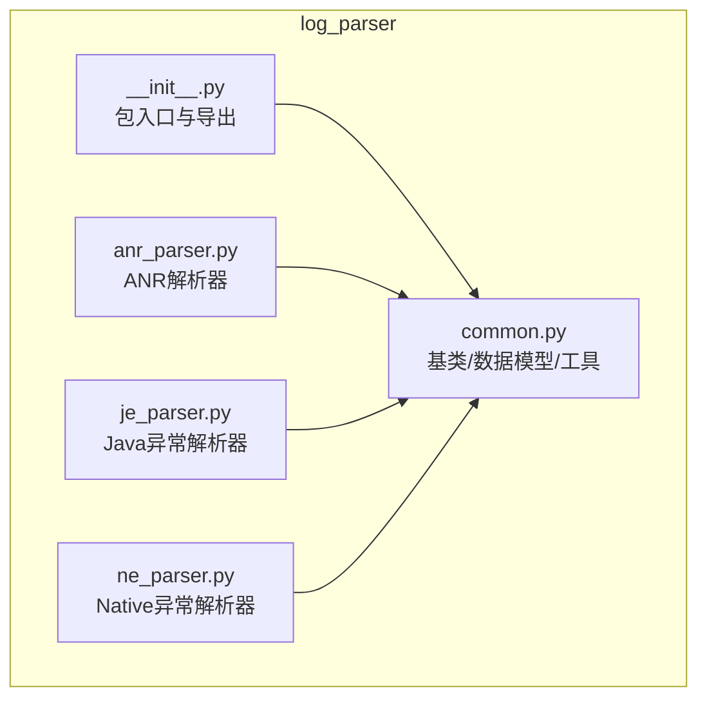
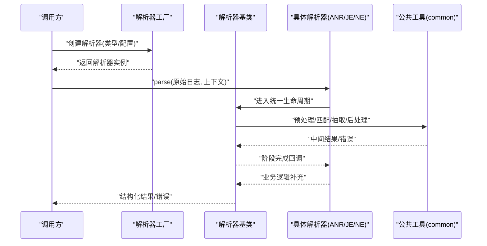
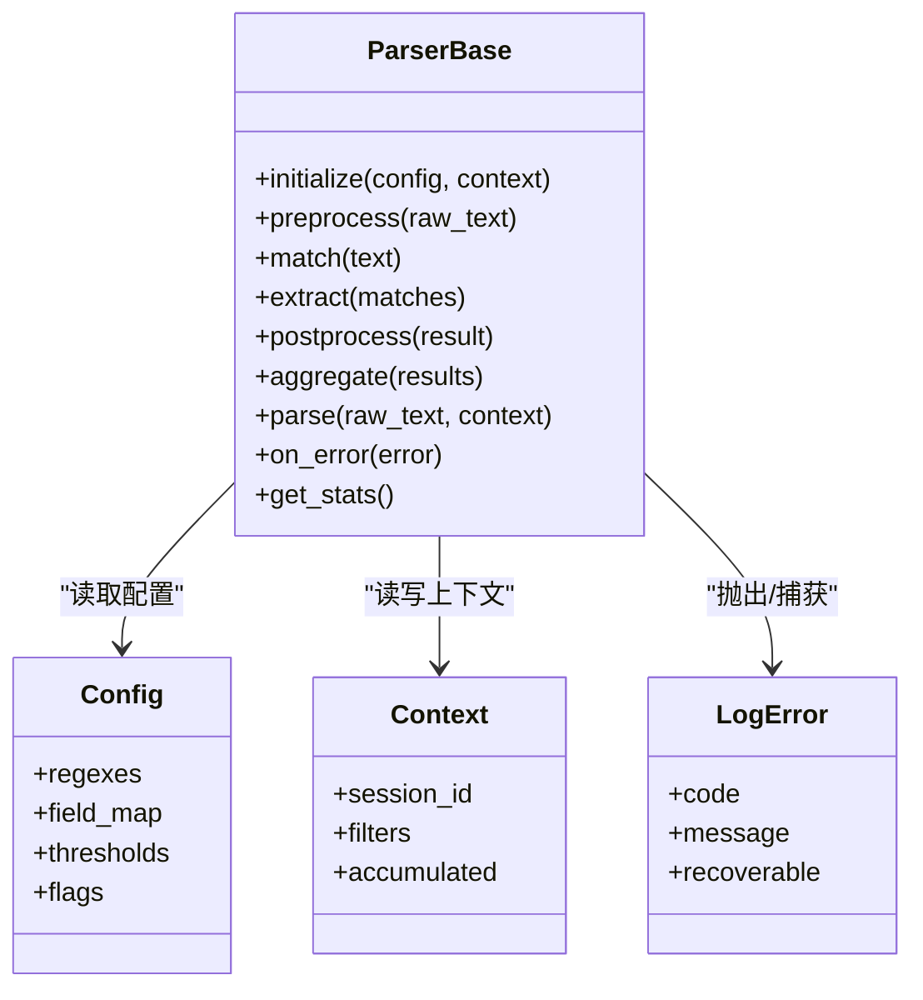
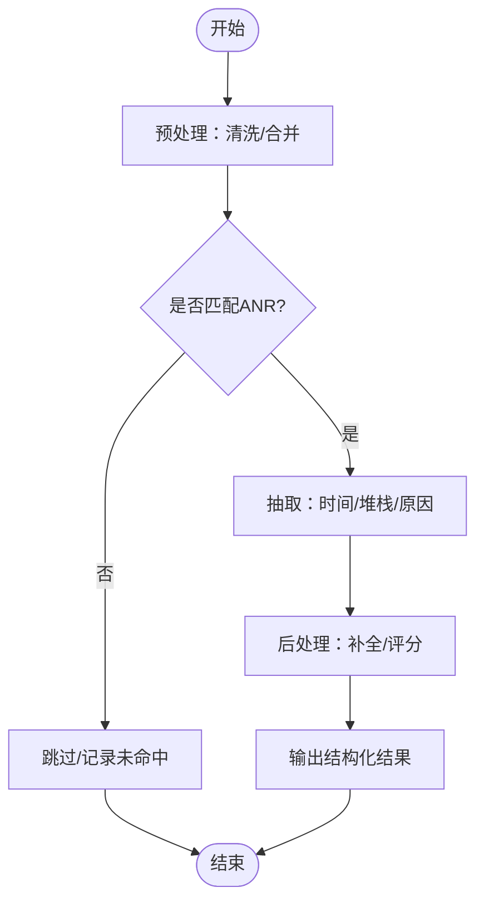
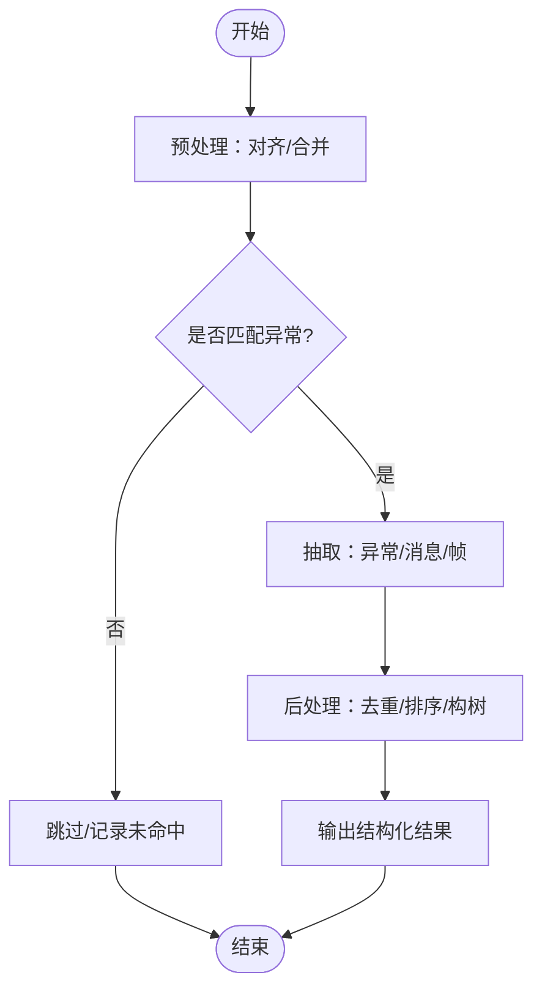
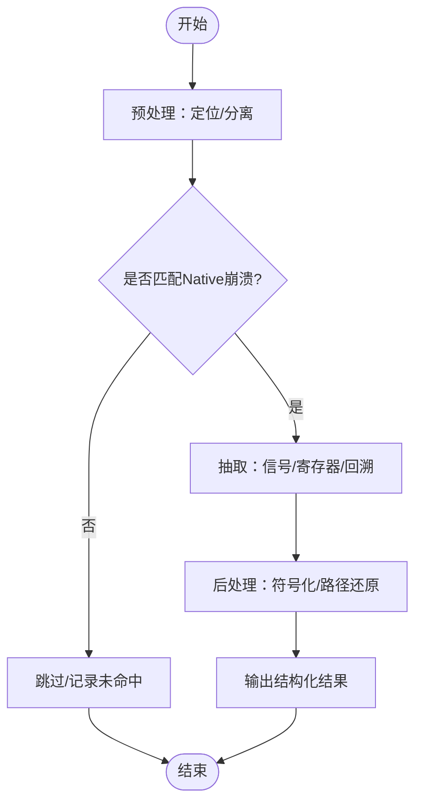
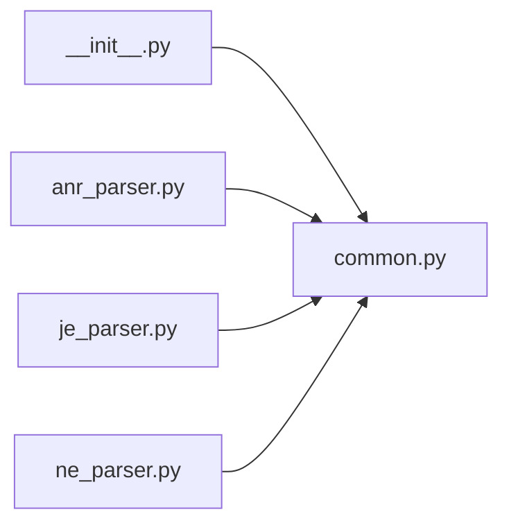

# 解析器框架与公共工具

<cite>
**本文引用的文件**   
- [src/jirin/tools/log_parser/__init__.py](file://src/jirin/tools/log_parser/__init__.py)
- [src/jirin/tools/log_parser/common.py](file://src/jirin/tools/log_parser/common.py)
- [src/jirin/tools/log_parser/anr_parser.py](file://src/jirin/tools/log_parser/anr_parser.py)
- [src/jirin/tools/log_parser/je_parser.py](file://src/jirin/tools/log_parser/je_parser.py)
- [src/jirin/tools/log_parser/ne_parser.py](file://src/jirin/tools/log_parser/ne_parser.py)
</cite>

## 目录
1. [简介](#简介)
2. [项目结构](#项目结构)
3. [核心组件](#核心组件)
4. [架构总览](#架构总览)
5. [详细组件分析](#详细组件分析)
6. [依赖分析](#依赖分析)
7. [性能考虑](#性能考虑)
8. [故障排查指南](#故障排查指南)
9. [结论](#结论)
10. [附录](#附录)

## 简介
本文件面向Jirin日志解析器的通用框架与公共工具，聚焦以下目标：
- 统一架构设计：定义解析器基类、接口规范与扩展点。
- 标准流程与数据模型：描述从输入到结构化结果的标准化处理链路。
- 错误处理机制：提供一致的错误分类、传播与恢复策略。
- 配置选项与扩展点：说明如何以声明式方式驱动解析行为。
- 自定义解析器开发指南：继承关系、方法重写、数据转换示例。
- 性能优化、内存管理与并发处理建议。

## 项目结构
日志解析相关代码位于 tools/log_parser 目录下，采用“基类+具体实现”的分层组织方式：
- __init__.py：包入口，负责导出公共能力（如基类、工厂函数、注册表）。
- common.py：公共工具与基础类型定义，包括解析器基类、数据结构、错误类型、配置对象等。
- anr_parser.py / je_parser.py / ne_parser.py：针对ANR、Java异常、Native异常的专用解析器实现。

图表来源
- [src/jirin/tools/log_parser/__init__.py](file://src/jirin/tools/log_parser/__init__.py)
- [src/jirin/tools/log_parser/common.py](file://src/jirin/tools/log_parser/common.py)
- [src/jirin/tools/log_parser/anr_parser.py](file://src/jirin/tools/log_parser/anr_parser.py)
- [src/jirin/tools/log_parser/je_parser.py](file://src/jirin/tools/log_parser/je_parser.py)
- [src/jirin/tools/log_parser/ne_parser.py](file://src/jirin/tools/log_parser/ne_parser.py)

章节来源
- [src/jirin/tools/log_parser/__init__.py](file://src/jirin/tools/log_parser/__init__.py)
- [src/jirin/tools/log_parser/common.py](file://src/jirin/tools/log_parser/common.py)
- [src/jirin/tools/log_parser/anr_parser.py](file://src/jirin/tools/log_parser/anr_parser.py)
- [src/jirin/tools/log_parser/je_parser.py](file://src/jirin/tools/log_parser/je_parser.py)
- [src/jirin/tools/log_parser/ne_parser.py](file://src/jirin/tools/log_parser/ne_parser.py)

## 核心组件
本节概述解析器框架的核心抽象与公共能力，帮助快速理解整体设计与扩展方式。

- 解析器基类
  - 职责：封装统一的解析生命周期（初始化、预处理、匹配、抽取、后处理、结果聚合）、上下文管理、配置注入、错误上报与统计。
  - 关键能力：
    - 生命周期钩子：允许子类在特定阶段插入逻辑。
    - 配置驱动：通过配置对象控制正则策略、阈值、输出字段等。
    - 上下文传递：携带会话级信息（如设备ID、时间窗口、过滤规则）。
    - 错误分类：将异常归类为可重试、不可重试、格式不匹配等。
    - 统计指标：记录解析耗时、命中次数、丢弃条数等。

- 公共数据模型
  - 解析结果：包含事件类型、时间戳、原始片段、结构化字段、置信度、溯源信息等。
  - 配置对象：集中管理解析器参数（如正则表达式集合、字段映射、阈值、开关）。
  - 上下文对象：跨解析阶段的共享状态（如已识别的进程/线程、过滤条件、累积统计）。

- 公共工具函数
  - 文本预处理：去噪、规范化、分块、编码检测。
  - 模式匹配：多正则组合、优先级排序、短路匹配。
  - 字段抽取：基于命名捕获组或位置规则的字段提取。
  - 时间解析：多种时间格式的归一化与偏移校正。
  - 错误构造：统一的错误类型与消息模板。

- 注册与发现
  - 解析器注册表：支持按类型/标签动态选择解析器。
  - 工厂函数：根据配置或输入特征自动实例化合适解析器。

章节来源
- [src/jirin/tools/log_parser/common.py](file://src/jirin/tools/log_parser/common.py)
- [src/jirin/tools/log_parser/__init__.py](file://src/jirin/tools/log_parser/__init__.py)

## 架构总览
下图展示了从原始日志到结构化结果的端到端流程，以及各组件的职责边界。

图表来源
- [src/jirin/tools/log_parser/common.py](file://src/jirin/tools/log_parser/common.py)
- [src/jirin/tools/log_parser/anr_parser.py](file://src/jirin/tools/log_parser/anr_parser.py)
- [src/jirin/tools/log_parser/je_parser.py](file://src/jirin/tools/log_parser/je_parser.py)
- [src/jirin/tools/log_parser/ne_parser.py](file://src/jirin/tools/log_parser/ne_parser.py)

## 详细组件分析

### 解析器基类与公共工具（common）
- 设计要点
  - 统一生命周期：初始化→预处理→匹配→抽取→后处理→聚合→输出。
  - 可扩展钩子：提供可覆盖的方法，便于子类定制匹配与抽取逻辑。
  - 错误与统计：内置错误分类与轻量统计，便于监控与排障。
  - 配置与上下文：通过配置对象和上下文对象解耦外部依赖。
- 关键抽象
  - 解析器基类：定义 parse、preprocess、match、extract、postprocess、aggregate 等接口。
  - 配置对象：集中管理正则、阈值、字段映射、开关等。
  - 上下文对象：保存会话级状态与中间结果。
  - 错误类型：区分格式错误、匹配失败、超时、资源不足等。
- 典型用法
  - 子类仅需实现 match/extract 等核心方法，其余由基类编排。
  - 通过配置对象切换不同策略（如启用/禁用某类正则、调整阈值）。
  - 使用上下文对象在多个阶段间传递信息（如已识别的进程/线程）。

图表来源
- [src/jirin/tools/log_parser/common.py](file://src/jirin/tools/log_parser/common.py)

章节来源
- [src/jirin/tools/log_parser/common.py](file://src/jirin/tools/log_parser/common.py)

### ANR解析器（anr_parser）
- 职责
  - 识别Android ANR事件，抽取关键信息（触发时间、主线程堆栈、系统服务状态、CPU/IO等待等）。
- 关键流程
  - 预处理：清理无关行、合并多行堆栈。
  - 匹配：定位ANR关键字与堆栈起始/结束标记。
  - 抽取：提取线程名、阻塞原因、关键调用链。
  - 后处理：补全缺失字段、计算耗时、标注严重等级。
- 扩展点
  - 新增ANR变种：在匹配阶段增加正则分支。
  - 自定义字段：在抽取阶段追加字段映射。

图表来源
- [src/jirin/tools/log_parser/anr_parser.py](file://src/jirin/tools/log_parser/anr_parser.py)
- [src/jirin/tools/log_parser/common.py](file://src/jirin/tools/log_parser/common.py)

章节来源
- [src/jirin/tools/log_parser/anr_parser.py](file://src/jirin/tools/log_parser/anr_parser.py)
- [src/jirin/tools/log_parser/common.py](file://src/jirin/tools/log_parser/common.py)

### Java异常解析器（je_parser）
- 职责
  - 识别Java异常堆栈，抽取异常类型、消息、根因调用链、线程信息。
- 关键流程
  - 预处理：去除噪声、对齐缩进、合并连续堆栈帧。
  - 匹配：定位异常头与堆栈帧模式。
  - 抽取：解析异常类名、消息、文件名/行号、方法签名。
  - 后处理：去重、排序、构建调用树。
- 扩展点
  - 自定义异常类型映射：将常见异常映射为业务语义。
  - 过滤低价值堆栈：基于包名前缀或行数阈值。

图表来源
- [src/jirin/tools/log_parser/je_parser.py](file://src/jirin/tools/log_parser/je_parser.py)
- [src/jirin/tools/log_parser/common.py](file://src/jirin/tools/log_parser/common.py)

章节来源
- [src/jirin/tools/log_parser/je_parser.py](file://src/jirin/tools/log_parser/je_parser.py)
- [src/jirin/tools/log_parser/common.py](file://src/jirin/tools/log_parser/common.py)

### Native异常解析器（ne_parser）
- 职责
  - 识别Native崩溃（如SIGSEGV/SIGABRT），抽取信号类型、寄存器、回溯地址、模块信息。
- 关键流程
  - 预处理：定位崩溃头、分离模块段、清理调试信息。
  - 匹配：匹配信号与回溯模式。
  - 抽取：解析信号码、PC/SP、模块名、偏移、符号（若可用）。
  - 后处理：地址转符号（可选）、生成最小复现路径。
- 扩展点
  - 符号解析集成：接入ndk-stack/symbolizer等工具。
  - 平台差异适配：针对不同ABI/内核版本调整匹配规则。

图表来源
- [src/jirin/tools/log_parser/ne_parser.py](file://src/jirin/tools/log_parser/ne_parser.py)
- [src/jirin/tools/log_parser/common.py](file://src/jirin/tools/log_parser/common.py)

章节来源
- [src/jirin/tools/log_parser/ne_parser.py](file://src/jirin/tools/log_parser/ne_parser.py)
- [src/jirin/tools/log_parser/common.py](file://src/jirin/tools/log_parser/common.py)

### 包入口与导出（__init__.py）
- 职责
  - 暴露公共API：解析器基类、工厂函数、注册表、常用工具。
  - 简化导入：对外隐藏内部实现细节。
- 典型用法
  - 直接导入基类进行自定义解析器开发。
  - 使用工厂函数按类型获取解析器实例。
  - 通过注册表动态加载第三方解析器。

章节来源
- [src/jirin/tools/log_parser/__init__.py](file://src/jirin/tools/log_parser/__init__.py)

## 依赖分析
- 组件耦合
  - 具体解析器均依赖公共基类与工具，形成松耦合的“实现→抽象”关系。
  - 包入口仅依赖公共模块，避免循环依赖。
- 外部依赖
  - 正则表达式库、时间解析库、可选的符号化工具（用于Native回溯）。
- 潜在风险
  - 正则复杂度增长导致匹配退化；需定期评估与裁剪。
  - 大日志文件一次性加载可能引发内存压力；建议流式处理。

图表来源
- [src/jirin/tools/log_parser/__init__.py](file://src/jirin/tools/log_parser/__init__.py)
- [src/jirin/tools/log_parser/common.py](file://src/jirin/tools/log_parser/common.py)
- [src/jirin/tools/log_parser/anr_parser.py](file://src/jirin/tools/log_parser/anr_parser.py)
- [src/jirin/tools/log_parser/je_parser.py](file://src/jirin/tools/log_parser/je_parser.py)
- [src/jirin/tools/log_parser/ne_parser.py](file://src/jirin/tools/log_parser/ne_parser.py)

章节来源
- [src/jirin/tools/log_parser/__init__.py](file://src/jirin/tools/log_parser/__init__.py)
- [src/jirin/tools/log_parser/common.py](file://src/jirin/tools/log_parser/common.py)
- [src/jirin/tools/log_parser/anr_parser.py](file://src/jirin/tools/log_parser/anr_parser.py)
- [src/jirin/tools/log_parser/je_parser.py](file://src/jirin/tools/log_parser/je_parser.py)
- [src/jirin/tools/log_parser/ne_parser.py](file://src/jirin/tools/log_parser/ne_parser.py)

## 性能考虑
- 正则优化
  - 预编译与缓存：对高频正则进行预编译并复用。
  - 短路匹配：优先匹配高命中率模式，减少后续开销。
  - 分组精简：避免过多捕获组，必要时使用非捕获组。
- 流式处理
  - 逐行/分块读取：降低峰值内存占用。
  - 增量聚合：边读边聚合，避免全量驻留。
- 并发处理
  - 无状态解析器可并行处理不同文件或不同批次。
  - 有状态上下文需加锁或使用线程局部存储。
- I/O与序列化
  - 批量写入与缓冲输出，减少频繁磁盘I/O。
  - 选择性字段输出，避免冗余数据。
- 监控与调优
  - 利用基类统计指标观察耗时分布与吞吐瓶颈。
  - 针对热点正则进行A/B测试与回归验证。

[本节为通用指导，无需源码引用]

## 故障排查指南
- 常见问题
  - 未命中：检查正则优先级与输入格式差异；启用调试日志查看匹配过程。
  - 字段缺失：确认字段映射与抽取逻辑；校验上下文中的过滤条件。
  - 性能退化：定位慢正则；拆分复杂匹配；启用流式处理。
  - 内存溢出：改用分块读取；限制中间结果大小；及时释放临时对象。
- 错误分类与恢复
  - 可重试错误：如网络/外部工具不可用，采用退避重试。
  - 不可重试错误：如格式不合法，记录并跳过，继续处理其他条目。
  - 部分成功：保留已解析字段，标记缺失项，供下游容错。
- 诊断手段
  - 开启详细日志：记录预处理前后文本、匹配结果、抽取字段。
  - 采样回放：对失败样本进行离线回归测试。
  - 指标看板：关注命中率、平均耗时、错误率趋势。

章节来源
- [src/jirin/tools/log_parser/common.py](file://src/jirin/tools/log_parser/common.py)

## 结论
本框架通过统一的解析器基类与公共工具，实现了日志解析的可扩展、可维护与高性能。具体解析器只需关注领域特定的匹配与抽取逻辑，即可快速集成到统一流水线中。配合配置驱动与上下文传递，既能满足多样化场景，又便于持续演进与性能优化。

[本节为总结性内容，无需源码引用]

## 附录

### 解析器接口规范
- 必需方法
  - initialize(config, context)：初始化解析器，加载配置与上下文。
  - preprocess(raw_text)：文本预处理，返回清洗后的文本或分块序列。
  - match(text)：模式匹配，返回匹配结果集合。
  - extract(matches)：字段抽取，将匹配结果转换为结构化字段。
  - postprocess(result)：后处理，补全字段、计算评分、格式化输出。
  - aggregate(results)：结果聚合，合并多条记录的关联信息。
  - parse(raw_text, context)：统一入口，编排上述步骤。
- 可选钩子
  - on_error(error)：错误处理回调。
  - get_stats()：统计指标查询。

章节来源
- [src/jirin/tools/log_parser/common.py](file://src/jirin/tools/log_parser/common.py)

### 配置选项参考
- 正则集合：按事件类型组织，支持优先级与开关。
- 字段映射：定义抽取字段与默认值。
- 阈值与开关：控制严格模式、过滤规则、输出粒度。
- 外部工具：符号化、时间同步等可选依赖的配置。

章节来源
- [src/jirin/tools/log_parser/common.py](file://src/jirin/tools/log_parser/common.py)

### 自定义解析器开发指南
- 继承基类
  - 新建解析器类，继承解析器基类。
  - 在 initialize 中加载配置与上下文。
- 实现核心方法
  - 在 match 中编写领域特定的匹配逻辑。
  - 在 extract 中将匹配结果映射为目标字段。
  - 在 postprocess 中进行字段补全与评分。
- 注册与发现
  - 在包入口注册新解析器类型。
  - 通过工厂函数按类型获取实例。
- 数据转换示例
  - 将原始堆栈帧转换为调用树节点。
  - 将时间字符串归一化为统一时区与精度。
  - 将多行日志合并为单条事件。

章节来源
- [src/jirin/tools/log_parser/common.py](file://src/jirin/tools/log_parser/common.py)
- [src/jirin/tools/log_parser/__init__.py](file://src/jirin/tools/log_parser/__init__.py)