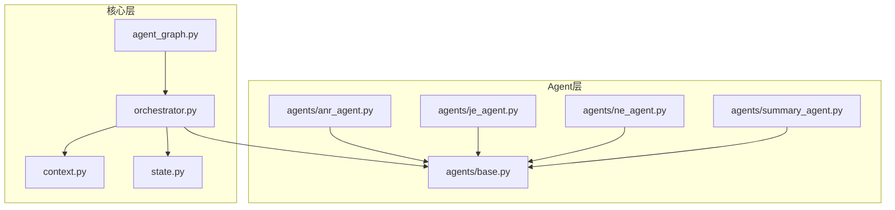
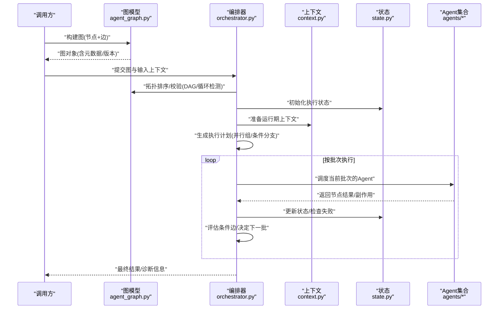
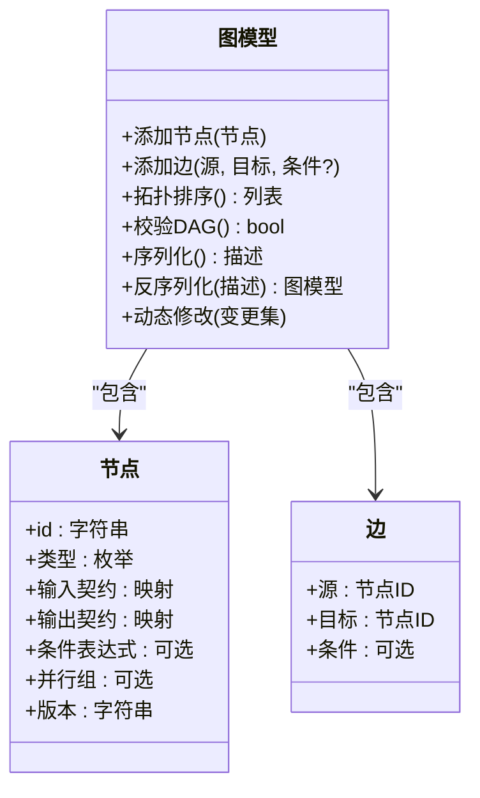
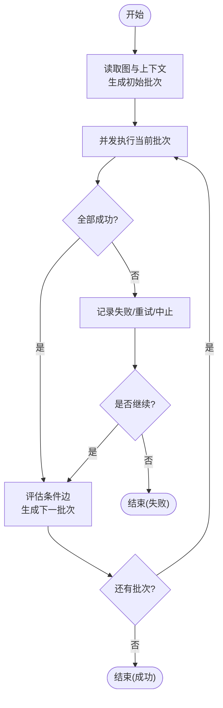
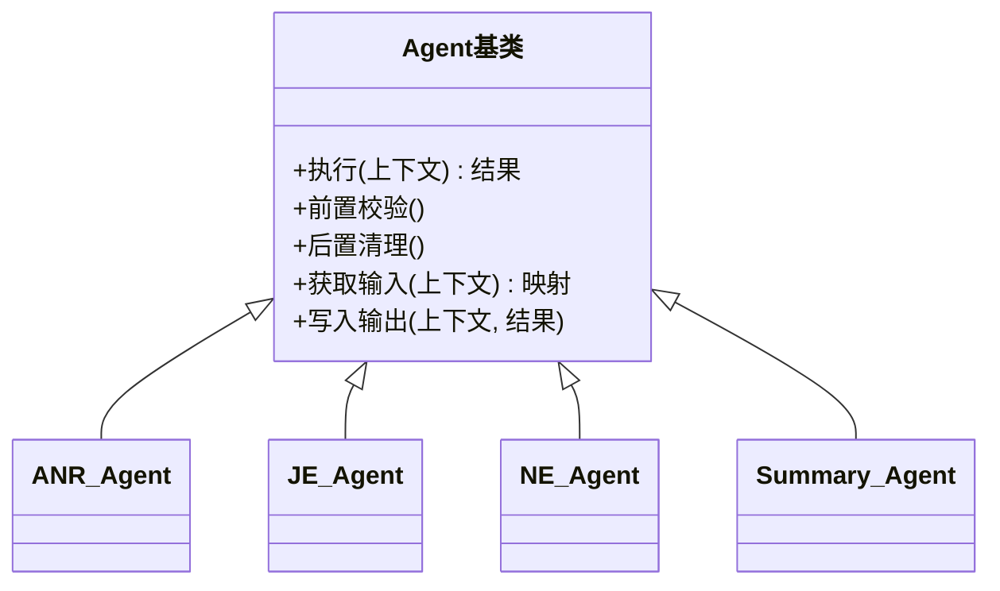
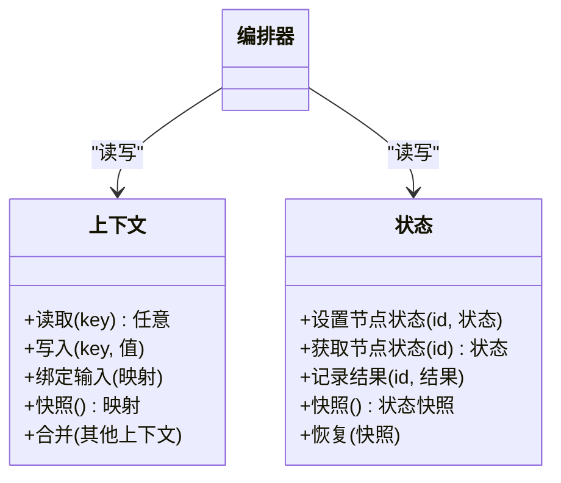
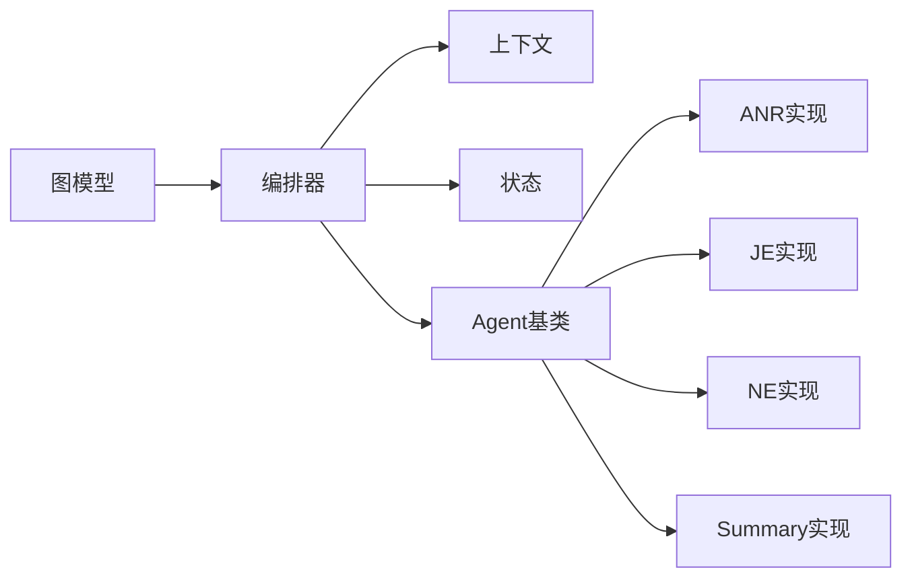

# Agent图结构系统

<cite>
**本文引用的文件**   
- [src/jirin/core/agent_graph.py](file://src/jirin/core/agent_graph.py)
- [src/jirin/core/orchestrator.py](file://src/jirin/core/orchestrator.py)
- [src/jirin/core/context.py](file://src/jirin/core/context.py)
- [src/jirin/core/state.py](file://src/jirin/core/state.py)
- [src/jirin/agents/base.py](file://src/jirin/agents/base.py)
- [src/jirin/agents/anr_agent.py](file://src/jirin/agents/anr_agent.py)
- [src/jirin/agents/je_agent.py](file://src/jirin/agents/je_agent.py)
- [src/jirin/agents/ne_agent.py](file://src/jirin/agents/ne_agent.py)
- [src/jirin/agents/summary_agent.py](file://src/jirin/agents/summary_agent.py)
</cite>

## 目录
1. [简介](#简介)
2. [项目结构](#项目结构)
3. [核心组件](#核心组件)
4. [架构总览](#架构总览)
5. [详细组件分析](#详细组件分析)
6. [依赖关系分析](#依赖关系分析)
7. [性能考量](#性能考量)
8. [故障排查指南](#故障排查指南)
9. [结论](#结论)
10. [附录](#附录)

## 简介
本文件面向Jirin的Agent图结构系统，系统性阐述基于有向无环图（DAG）的Agent编排与执行机制。文档覆盖以下主题：
- DAG设计模式、节点定义与边连接规则
- 图的构建算法与执行路径规划
- Agent依赖关系的声明方式、条件分支逻辑、并行执行机制与循环检测
- 图结构的序列化/反序列化处理、版本兼容性与动态修改能力
- 自定义Agent注册与图模板创建实践指南

## 项目结构
围绕Agent图的核心代码位于core与agents两个子包中：
- core：提供图模型、编排器、上下文与状态管理
- agents：提供具体Agent实现及其基类

图表来源
- [src/jirin/core/agent_graph.py](file://src/jirin/core/agent_graph.py)
- [src/jirin/core/orchestrator.py](file://src/jirin/core/orchestrator.py)
- [src/jirin/core/context.py](file://src/jirin/core/context.py)
- [src/jirin/core/state.py](file://src/jirin/core/state.py)
- [src/jirin/agents/base.py](file://src/jirin/agents/base.py)
- [src/jirin/agents/anr_agent.py](file://src/jirin/agents/anr_agent.py)
- [src/jirin/agents/je_agent.py](file://src/jirin/agents/je_agent.py)
- [src/jirin/agents/ne_agent.py](file://src/jirin/agents/ne_agent.py)
- [src/jirin/agents/summary_agent.py](file://src/jirin/agents/summary_agent.py)

章节来源
- [src/jirin/core/agent_graph.py](file://src/jirin/core/agent_graph.py)
- [src/jirin/core/orchestrator.py](file://src/jirin/core/orchestrator.py)
- [src/jirin/core/context.py](file://src/jirin/core/context.py)
- [src/jirin/core/state.py](file://src/jirin/core/state.py)
- [src/jirin/agents/base.py](file://src/jirin/agents/base.py)
- [src/jirin/agents/anr_agent.py](file://src/jirin/agents/anr_agent.py)
- [src/jirin/agents/je_agent.py](file://src/jirin/agents/je_agent.py)
- [src/jirin/agents/ne_agent.py](file://src/jirin/agents/ne_agent.py)
- [src/jirin/agents/summary_agent.py](file://src/jirin/agents/summary_agent.py)

## 核心组件
本节聚焦于图模型、编排器、上下文与状态等关键模块的职责与交互。

- 图模型（agent_graph.py）
  - 负责定义节点类型、边关系、拓扑校验、构建与序列化/反序列化接口
  - 提供条件边、并行分组、版本元数据等扩展点
- 编排器（orchestrator.py）
  - 负责解析图、计算可执行顺序、调度并发执行、处理分支与错误恢复
  - 维护运行期上下文与状态快照
- 上下文（context.py）
  - 提供跨节点共享的数据通道、输入输出绑定、运行时参数注入
- 状态（state.py）
  - 定义节点执行状态机、结果持久化、重试与回滚策略

章节来源
- [src/jirin/core/agent_graph.py](file://src/jirin/core/agent_graph.py)
- [src/jirin/core/orchestrator.py](file://src/jirin/core/orchestrator.py)
- [src/jirin/core/context.py](file://src/jirin/core/context.py)
- [src/jirin/core/state.py](file://src/jirin/core/state.py)

## 架构总览
下图展示了从“图定义”到“执行计划生成”再到“并发调度”的整体流程。

图表来源
- [src/jirin/core/agent_graph.py](file://src/jirin/core/agent_graph.py)
- [src/jirin/core/orchestrator.py](file://src/jirin/core/orchestrator.py)
- [src/jirin/core/context.py](file://src/jirin/core/context.py)
- [src/jirin/core/state.py](file://src/jirin/core/state.py)
- [src/jirin/agents/base.py](file://src/jirin/agents/base.py)

## 详细组件分析

### 图模型与DAG设计（agent_graph.py）
- 节点定义
  - 节点标识、类型、输入/输出契约、可选的条件表达式、并行分组标签、版本元数据
- 边连接规则
  - 有向边表示数据/控制依赖；支持条件边（由上下文或前序节点结果决定）
  - 禁止形成环；在构建阶段进行拓扑校验
- 构建算法
  - 增量添加节点与边；维护邻接表与入度计数
  - 拓扑排序用于生成执行批次；条件边在运行时动态生效
- 序列化/反序列化
  - 将图结构导出为结构化描述（包含节点、边、版本），并支持从描述重建图
  - 版本字段用于兼容性判断与迁移提示
- 动态修改
  - 提供增删节点/边的API；每次变更后需重新校验与重算拓扑

图表来源
- [src/jirin/core/agent_graph.py](file://src/jirin/core/agent_graph.py)

章节来源
- [src/jirin/core/agent_graph.py](file://src/jirin/core/agent_graph.py)

### 编排器与执行路径规划（orchestrator.py）
- 执行计划生成
  - 基于拓扑排序划分批次；同一批次内节点可并行执行
  - 条件边根据上下文与前序结果动态决定是否加入后续批次
- 并行执行机制
  - 使用任务队列/线程池或协程池并发调度同批节点
  - 资源隔离与限流策略（如最大并发数、超时控制）
- 条件分支逻辑
  - 在每批完成后评估条件边，动态追加下一批候选节点
- 循环检测
  - 构建阶段进行环检测；若检测到环则拒绝构建并给出冲突边信息
- 错误处理与恢复
  - 节点失败时记录状态；可选择重试、跳过或中断整图
  - 提供断点续跑与状态回滚能力

图表来源
- [src/jirin/core/orchestrator.py](file://src/jirin/core/orchestrator.py)
- [src/jirin/core/state.py](file://src/jirin/core/state.py)
- [src/jirin/core/context.py](file://src/jirin/core/context.py)

章节来源
- [src/jirin/core/orchestrator.py](file://src/jirin/core/orchestrator.py)
- [src/jirin/core/state.py](file://src/jirin/core/state.py)
- [src/jirin/core/context.py](file://src/jirin/core/context.py)

### Agent基类与具体实现（agents/base.py 与 agents/*）
- 基类职责
  - 统一输入/输出契约、生命周期钩子、日志与指标上报、错误包装
- 具体Agent示例
  - anr_agent、je_agent、ne_agent、summary_agent：分别承担不同分析任务，通过图边声明依赖关系
- 依赖声明方式
  - 在图中以边表达数据依赖；也可在Agent内部声明对上下文的键依赖
- 条件与并行
  - 通过节点的并行组与条件边实现复杂分支与并行

图表来源
- [src/jirin/agents/base.py](file://src/jirin/agents/base.py)
- [src/jirin/agents/anr_agent.py](file://src/jirin/agents/anr_agent.py)
- [src/jirin/agents/je_agent.py](file://src/jirin/agents/je_agent.py)
- [src/jirin/agents/ne_agent.py](file://src/jirin/agents/ne_agent.py)
- [src/jirin/agents/summary_agent.py](file://src/jirin/agents/summary_agent.py)

章节来源
- [src/jirin/agents/base.py](file://src/jirin/agents/base.py)
- [src/jirin/agents/anr_agent.py](file://src/jirin/agents/anr_agent.py)
- [src/jirin/agents/je_agent.py](file://src/jirin/agents/je_agent.py)
- [src/jirin/agents/ne_agent.py](file://src/jirin/agents/ne_agent.py)
- [src/jirin/agents/summary_agent.py](file://src/jirin/agents/summary_agent.py)

### 上下文与状态（context.py 与 state.py）
- 上下文
  - 提供键值存储、输入绑定、运行时参数注入、中间结果共享
- 状态
  - 维护节点执行状态（待执行/运行中/成功/失败/跳过）、结果缓存、重试计数、时间戳
  - 支持快照与恢复，便于断点续跑与审计

图表来源
- [src/jirin/core/context.py](file://src/jirin/core/context.py)
- [src/jirin/core/state.py](file://src/jirin/core/state.py)

章节来源
- [src/jirin/core/context.py](file://src/jirin/core/context.py)
- [src/jirin/core/state.py](file://src/jirin/core/state.py)

## 依赖关系分析
- 耦合与内聚
  - 图模型与编排器解耦：前者负责静态结构与校验，后者负责动态调度
  - Agent与编排器通过统一的执行接口与上下文/状态交互，降低耦合
- 外部依赖
  - 并发调度可能依赖线程池/进程池或异步框架
  - 序列化格式可能依赖JSON/YAML等通用格式
- 潜在循环依赖
  - 确保Agent不反向依赖编排器；仅通过上下文/状态交换数据

图表来源
- [src/jirin/core/agent_graph.py](file://src/jirin/core/agent_graph.py)
- [src/jirin/core/orchestrator.py](file://src/jirin/core/orchestrator.py)
- [src/jirin/core/context.py](file://src/jirin/core/context.py)
- [src/jirin/core/state.py](file://src/jirin/core/state.py)
- [src/jirin/agents/base.py](file://src/jirin/agents/base.py)
- [src/jirin/agents/anr_agent.py](file://src/jirin/agents/anr_agent.py)
- [src/jirin/agents/je_agent.py](file://src/jirin/agents/je_agent.py)
- [src/jirin/agents/ne_agent.py](file://src/jirin/agents/ne_agent.py)
- [src/jirin/agents/summary_agent.py](file://src/jirin/agents/summary_agent.py)

章节来源
- [src/jirin/core/agent_graph.py](file://src/jirin/core/agent_graph.py)
- [src/jirin/core/orchestrator.py](file://src/jirin/core/orchestrator.py)
- [src/jirin/core/context.py](file://src/jirin/core/context.py)
- [src/jirin/core/state.py](file://src/jirin/core/state.py)
- [src/jirin/agents/base.py](file://src/jirin/agents/base.py)
- [src/jirin/agents/anr_agent.py](file://src/jirin/agents/anr_agent.py)
- [src/jirin/agents/je_agent.py](file://src/jirin/agents/je_agent.py)
- [src/jirin/agents/ne_agent.py](file://src/jirin/agents/ne_agent.py)
- [src/jirin/agents/summary_agent.py](file://src/jirin/agents/summary_agent.py)

## 性能考量
- 并行度控制
  - 合理设置最大并发数，避免资源争用与上下文过大导致内存压力
- 数据局部性
  - 尽量在同一批次内聚合相关计算，减少跨批次的大对象传输
- 条件边评估开销
  - 将昂贵的条件表达式延迟到需要时再计算，必要时缓存结果
- I/O与网络
  - 对耗时I/O采用异步或缓冲策略，避免阻塞调度器
- 序列化体积
  - 大图或大量中间结果序列化时注意压缩与分页

[本节为通用指导，无需特定文件引用]

## 故障排查指南
- 常见错误
  - 循环依赖：构建阶段抛出环检测异常，需检查边方向与条件边
  - 缺失输入：上下文未提供必要键，需在图入口绑定或上游节点产出
  - 条件边未触发：条件表达式结果为假，需检查上下文与前序结果
- 定位手段
  - 查看状态快照与节点日志，确认失败节点与原因
  - 打印执行计划与批次划分，验证拓扑与并行分组
- 恢复策略
  - 启用断点续跑，从最近成功状态恢复
  - 针对可重试节点配置重试次数与退避策略

章节来源
- [src/jirin/core/orchestrator.py](file://src/jirin/core/orchestrator.py)
- [src/jirin/core/state.py](file://src/jirin/core/state.py)
- [src/jirin/core/context.py](file://src/jirin/core/context.py)

## 结论
Jirin的Agent图结构系统以DAG为核心，结合条件边与并行分组实现了灵活而可控的执行路径规划。通过清晰的图模型与编排器分离、完善的上下文与状态管理，系统在可扩展性、可观测性与可恢复性方面具备良好基础。建议在生产环境中配合监控与审计，持续优化并行度与序列化策略。

[本节为总结性内容，无需特定文件引用]

## 附录

### 实践指南：自定义Agent注册与图模板创建
- 自定义Agent注册
  - 继承Agent基类，实现统一执行接口与输入/输出契约
  - 在Agent元数据中标注版本与依赖说明，便于图模板复用
- 图模板创建
  - 使用图模型的构建API定义节点与边，标注并行组与条件边
  - 提供默认上下文绑定与版本信息，便于在不同环境快速实例化
- 动态修改与版本兼容
  - 通过动态修改接口增删节点/边，并在变更后重新校验与重算拓扑
  - 在序列化描述中包含版本字段，升级时进行兼容性检查与迁移提示

章节来源
- [src/jirin/agents/base.py](file://src/jirin/agents/base.py)
- [src/jirin/core/agent_graph.py](file://src/jirin/core/agent_graph.py)
- [src/jirin/core/orchestrator.py](file://src/jirin/core/orchestrator.py)