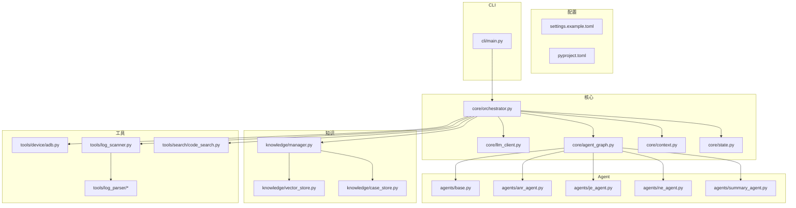
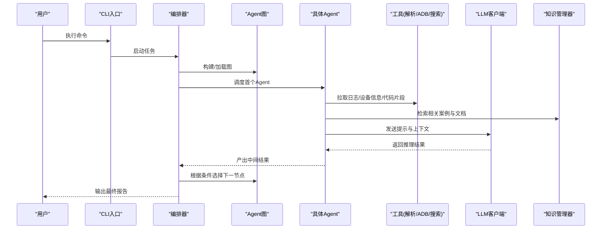
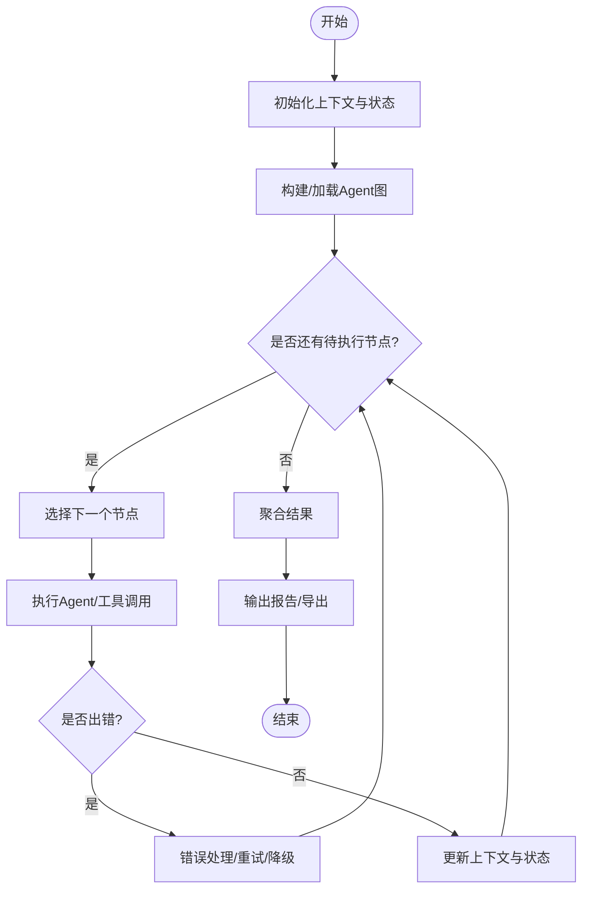
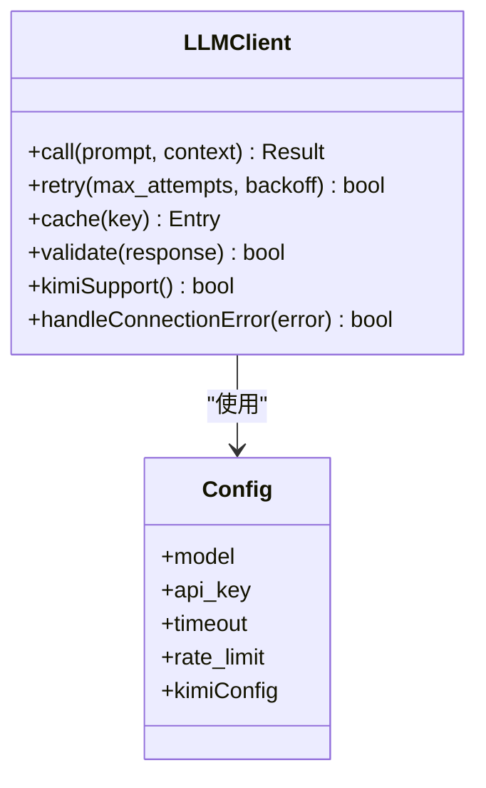
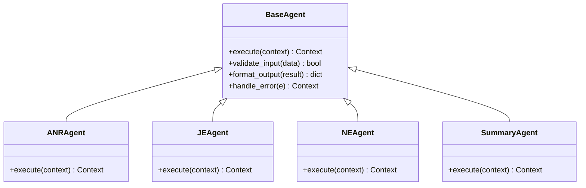
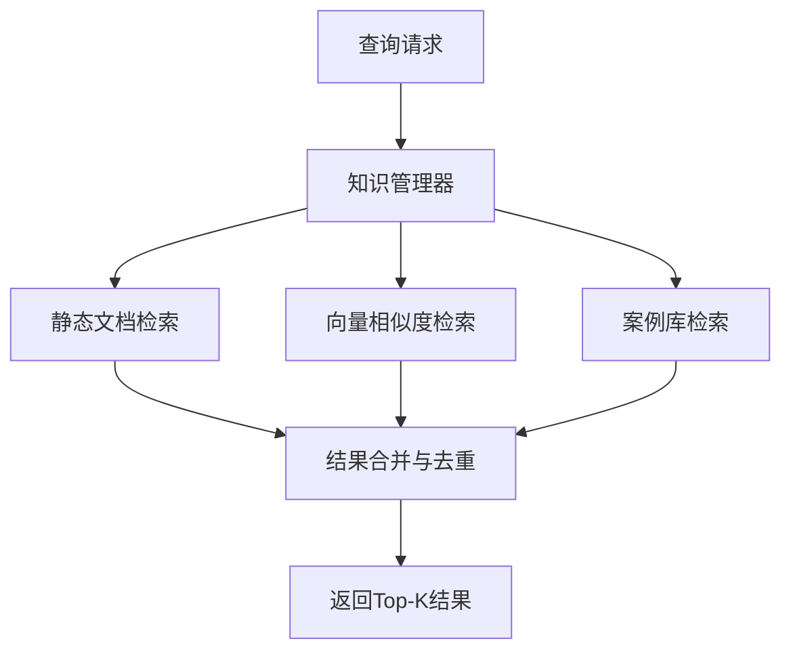
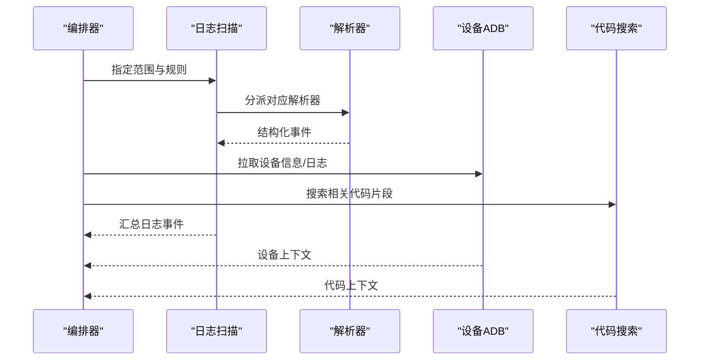
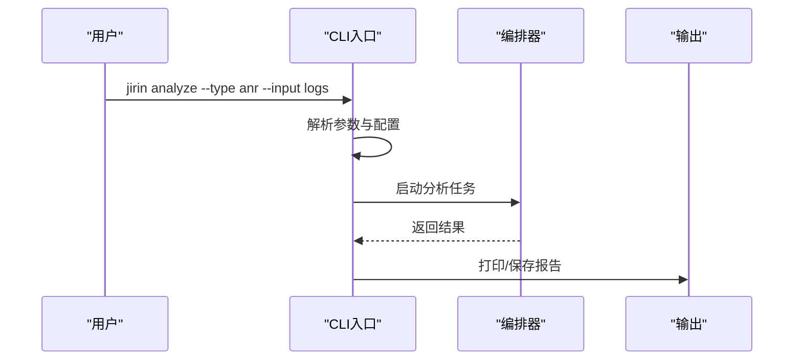
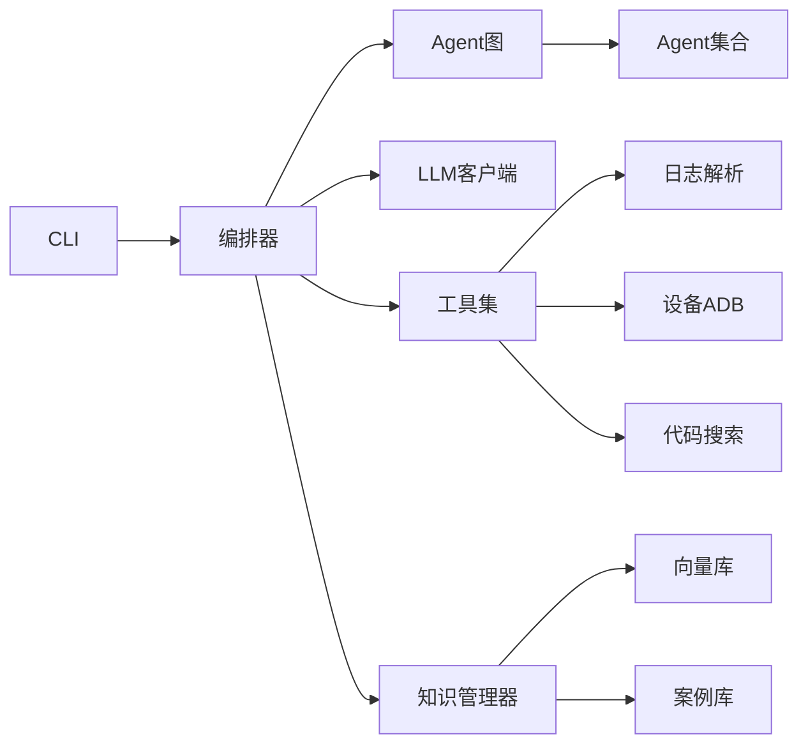

# LLM客户端系统

<cite>
**本文引用的文件**   
- [pyproject.toml](file://pyproject.toml)
- [settings.example.toml](file://config/settings.example.toml)
- [main.py](file://src/jirin/cli/main.py)
- [orchestrator.py](file://src/jirin/core/orchestrator.py)
- [llm_client.py](file://src/jirin/core/llm_client.py)
- [agent_graph.py](file://src/jirin/core/agent_graph.py)
- [context.py](file://src/jirin/core/context.py)
- [state.py](file://src/jirin/core/state.py)
- [base.py](file://src/jirin/agents/base.py)
- [anr_agent.py](file://src/jirin/agents/anr_agent.py)
- [je_agent.py](file://src/jirin/agents/je_agent.py)
- [ne_agent.py](file://src/jirin/agents/ne_agent.py)
- [summary_agent.py](file://src/jirin/agents/summary_agent.py)
- [manager.py](file://src/jirin/knowledge/manager.py)
- [vector_store.py](file://src/jirin/knowledge/vector_store.py)
- [case_store.py](file://src/jirin/knowledge/case_store.py)
- [adb.py](file://src/jirin/tools/device/adb.py)
- [log_scanner.py](file://src/jirin/tools/log_scanner.py)
- [anr_parser.py](file://src/jirin/tools/log_parser/anr_parser.py)
- [je_parser.py](file://src/jirin/tools/log_parser/je_parser.py)
- [ne_parser.py](file://src/jirin/tools/log_parser/ne_parser.py)
- [code_search.py](file://src/jirin/tools/search/code_search.py)
- [logging_config.py](file://src/jirin/utils/logging_config.py)
- [test_orchestrator.py](file://tests/test_core/test_orchestrator.py)
</cite>

## 更新摘要
**所做更改**
- 更新了LLM客户端组件，增强了Kimi模型集成的稳定性和错误处理
- 改进了连接管理和超时处理机制
- 优化了错误恢复和重试策略
- 增强了用户交互体验的错误提示

## 目录
1. [简介](#简介)
2. [项目结构](#项目结构)
3. [核心组件](#核心组件)
4. [架构总览](#架构总览)
5. [详细组件分析](#详细组件分析)
6. [依赖关系分析](#依赖关系分析)
7. [性能考量](#性能考量)
8. [故障排查指南](#故障排查指南)
9. [结论](#结论)
10. [附录](#附录)

## 简介
本仓库实现了一个面向Android与系统级问题诊断的LLM客户端系统。系统通过CLI入口驱动，由编排器协调多个领域专家Agent（ANR、Java异常、Native崩溃等），结合日志解析、设备交互、代码检索与向量知识库，调用LLM进行推理与总结，最终输出可操作的诊断报告与导出产物。

**更新** 经过关键性Bug修复后，Kimi模型集成现已更加稳定，提供了增强的错误处理和连接管理功能，显著改善了用户体验。

## 项目结构
- 配置层：提供示例配置与运行时设置
- CLI层：命令行入口与子命令
- 核心层：编排器、状态机、上下文、LLM客户端、Agent图
- 知识层：静态文档、向量库、案例存储
- 工具层：设备ADB、日志扫描与解析、代码搜索
- 学习层：分类器、记忆与反思（可选扩展）
- 测试层：核心编排器用例

**图表来源** 
- [main.py:1-200](file://src/jirin/cli/main.py#L1-L200)
- [orchestrator.py:1-200](file://src/jirin/core/orchestrator.py#L1-L200)
- [llm_client.py:1-200](file://src/jirin/core/llm_client.py#L1-L200)
- [agent_graph.py:1-200](file://src/jirin/core/agent_graph.py#L1-L200)
- [context.py:1-200](file://src/jirin/core/context.py#L1-L200)
- [state.py:1-200](file://src/jirin/core/state.py#L1-L200)
- [manager.py:1-200](file://src/jirin/knowledge/manager.py#L1-L200)
- [vector_store.py:1-200](file://src/jirin/knowledge/vector_store.py#L1-L200)
- [case_store.py:1-200](file://src/jirin/knowledge/case_store.py#L1-L200)
- [adb.py:1-200](file://src/jirin/tools/device/adb.py#L1-L200)
- [log_scanner.py:1-200](file://src/jirin/tools/log_scanner.py#L1-L200)
- [anr_parser.py:1-200](file://src/jirin/tools/log_parser/anr_parser.py#L1-L200)
- [je_parser.py:1-200](file://src/jirin/tools/log_parser/je_parser.py#L1-L200)
- [ne_parser.py:1-200](file://src/jirin/tools/log_parser/ne_parser.py#L1-L200)
- [code_search.py:1-200](file://src/jirin/tools/search/code_search.py#L1-L200)
- [base.py:1-200](file://src/jirin/agents/base.py#L1-L200)
- [anr_agent.py:1-200](file://src/jirin/agents/anr_agent.py#L1-L200)
- [je_agent.py:1-200](file://src/jirin/agents/je_agent.py#L1-L200)
- [ne_agent.py:1-200](file://src/jirin/agents/ne_agent.py#L1-L200)
- [summary_agent.py:1-200](file://src/jirin/agents/summary_agent.py#L1-L200)

**章节来源**
- [pyproject.toml:1-200](file://pyproject.toml#L1-L200)
- [settings.example.toml:1-200](file://config/settings.example.toml#L1-L200)

## 核心组件
- 编排器（Orchestrator）：负责任务生命周期管理、Agent调度、上下文与状态维护、错误恢复与重试策略
- LLM客户端（LLM Client）：封装模型调用、重试、限流、缓存与结果结构化，现已增强对Kimi模型的稳定支持
- Agent图（Agent Graph）：定义Agent节点与边，支持条件分支与并行执行
- 上下文（Context）：跨阶段共享数据（输入、中间结果、元数据）
- 状态（State）：全局运行态（进行中、成功、失败、回滚）
- 知识管理器（Knowledge Manager）：统一访问静态文档、向量库与案例库
- 工具集：ADB设备交互、日志扫描与解析、代码搜索

**更新** LLM客户端现在具备更强的错误处理能力，特别是在Kimi模型集成方面，包括改进的连接管理和更友好的错误提示。

**章节来源**
- [orchestrator.py:1-200](file://src/jirin/core/orchestrator.py#L1-L200)
- [llm_client.py:1-200](file://src/jirin/core/llm_client.py#L1-L200)
- [agent_graph.py:1-200](file://src/jirin/core/agent_graph.py#L1-L200)
- [context.py:1-200](file://src/jirin/core/context.py#L1-L200)
- [state.py:1-200](file://src/jirin/core/state.py#L1-L200)
- [manager.py:1-200](file://src/jirin/knowledge/manager.py#L1-L200)

## 架构总览
系统以CLI为入口，编排器作为中枢，依据Agent图选择并执行相应Agent；各Agent在需要时调用日志解析、设备与代码搜索工具，并通过LLM客户端获取推理结果；知识管理器提供背景知识与历史案例支撑。

**图表来源** 
- [main.py:1-200](file://src/jirin/cli/main.py#L1-L200)
- [orchestrator.py:1-200](file://src/jirin/core/orchestrator.py#L1-L200)
- [agent_graph.py:1-200](file://src/jirin/core/agent_graph.py#L1-L200)
- [anr_agent.py:1-200](file://src/jirin/agents/anr_agent.py#L1-L200)
- [je_agent.py:1-200](file://src/jirin/agents/je_agent.py#L1-L200)
- [ne_agent.py:1-200](file://src/jirin/agents/ne_agent.py#L1-L200)
- [summary_agent.py:1-200](file://src/jirin/agents/summary_agent.py#L1-L200)
- [log_scanner.py:1-200](file://src/jirin/tools/log_scanner.py#L1-L200)
- [anr_parser.py:1-200](file://src/jirin/tools/log_parser/anr_parser.py#L1-L200)
- [je_parser.py:1-200](file://src/jirin/tools/log_parser/je_parser.py#L1-L200)
- [ne_parser.py:1-200](file://src/jirin/tools/log_parser/ne_parser.py#L1-L200)
- [adb.py:1-200](file://src/jirin/tools/device/adb.py#L1-L200)
- [code_search.py:1-200](file://src/jirin/tools/search/code_search.py#L1-L200)
- [llm_client.py:1-200](file://src/jirin/core/llm_client.py#L1-L200)
- [manager.py:1-200](file://src/jirin/knowledge/manager.py#L1-L200)

## 详细组件分析

### 编排器（Orchestrator）
- 职责：任务初始化、上下文装配、状态流转、Agent调度、错误处理与重试、结果聚合
- 关键流程：
  - 读取配置与参数
  - 构建Agent图与初始上下文
  - 循环执行节点，按条件推进或终止
  - 捕获异常并记录日志，必要时回滚或降级
  - 生成最终结果并持久化

**图表来源** 
- [orchestrator.py:1-200](file://src/jirin/core/orchestrator.py#L1-L200)
- [state.py:1-200](file://src/jirin/core/state.py#L1-L200)
- [context.py:1-200](file://src/jirin/core/context.py#L1-L200)

**章节来源**
- [orchestrator.py:1-200](file://src/jirin/core/orchestrator.py#L1-L200)
- [state.py:1-200](file://src/jirin/core/state.py#L1-L200)
- [context.py:1-200](file://src/jirin/core/context.py#L1-L200)

### LLM客户端（LLM Client）
- 职责：封装对外部模型的调用，包括请求构造、重试、限流、超时、缓存与响应解析
- 关键点：
  - 统一的接口抽象，便于切换不同后端
  - 幂等性与退避策略
  - 结构化输出校验与容错
  - **新增** 增强的Kimi模型支持和错误处理机制

**更新** LLM客户端现已包含针对Kimi模型的关键性Bug修复，包括：
- 改进了连接管理和超时处理
- 增强了错误恢复和重试逻辑
- 提供了更详细的错误信息和用户友好的提示
- 优化了网络连接的稳定性

**图表来源** 
- [llm_client.py:1-200](file://src/jirin/core/llm_client.py#L1-L200)

**章节来源**
- [llm_client.py:1-200](file://src/jirin/core/llm_client.py#L1-L200)

### Agent图与Agent基类
- Agent基类：定义统一接口（输入验证、执行、输出格式化、错误处理）
- Agent图：声明式描述节点与边，支持条件路由与并行

**图表来源** 
- [base.py:1-200](file://src/jirin/agents/base.py#L1-L200)
- [anr_agent.py:1-200](file://src/jirin/agents/anr_agent.py#L1-L200)
- [je_agent.py:1-200](file://src/jirin/agents/je_agent.py#L1-L200)
- [ne_agent.py:1-200](file://src/jirin/agents/ne_agent.py#L1-L200)
- [summary_agent.py:1-200](file://src/jirin/agents/summary_agent.py#L1-L200)
- [agent_graph.py:1-200](file://src/jirin/core/agent_graph.py#L1-L200)

**章节来源**
- [base.py:1-200](file://src/jirin/agents/base.py#L1-L200)
- [agent_graph.py:1-200](file://src/jirin/core/agent_graph.py#L1-L200)

### 知识管理与向量库
- 知识管理器：统一访问静态文档、向量库与案例库，提供检索与过滤
- 向量库：文本嵌入与相似度检索，支持增量更新
- 案例库：结构化存储历史诊断案例，便于复用与对比

**图表来源** 
- [manager.py:1-200](file://src/jirin/knowledge/manager.py#L1-L200)
- [vector_store.py:1-200](file://src/jirin/knowledge/vector_store.py#L1-L200)
- [case_store.py:1-200](file://src/jirin/knowledge/case_store.py#L1-L200)

**章节来源**
- [manager.py:1-200](file://src/jirin/knowledge/manager.py#L1-L200)
- [vector_store.py:1-200](file://src/jirin/knowledge/vector_store.py#L1-L200)
- [case_store.py:1-200](file://src/jirin/knowledge/case_store.py#L1-L200)

### 工具层：日志解析、设备与代码搜索
- 日志扫描与解析：针对ANR、Java异常、Native崩溃的专用解析器
- 设备交互：通过ADB采集日志、进程信息、堆栈快照
- 代码搜索：基于关键词或语义检索相关源码片段

**图表来源** 
- [log_scanner.py:1-200](file://src/jirin/tools/log_scanner.py#L1-L200)
- [anr_parser.py:1-200](file://src/jirin/tools/log_parser/anr_parser.py#L1-L200)
- [je_parser.py:1-200](file://src/jirin/tools/log_parser/je_parser.py#L1-L200)
- [ne_parser.py:1-200](file://src/jirin/tools/log_parser/ne_parser.py#L1-L200)
- [adb.py:1-200](file://src/jirin/tools/device/adb.py#L1-L200)
- [code_search.py:1-200](file://src/jirin/tools/search/code_search.py#L1-L200)

**章节来源**
- [log_scanner.py:1-200](file://src/jirin/tools/log_scanner.py#L1-L200)
- [anr_parser.py:1-200](file://src/jirin/tools/log_parser/anr_parser.py#L1-L200)
- [je_parser.py:1-200](file://src/jirin/tools/log_parser/je_parser.py#L1-L200)
- [ne_parser.py:1-200](file://src/jirin/tools/log_parser/ne_parser.py#L1-L200)
- [adb.py:1-200](file://src/jirin/tools/device/adb.py#L1-L200)
- [code_search.py:1-200](file://src/jirin/tools/search/code_search.py#L1-L200)

### CLI入口与命令
- 主入口：解析参数、加载配置、调用编排器执行任务
- 子命令：分析、配置、导出、学习等

**图表来源** 
- [main.py:1-200](file://src/jirin/cli/main.py#L1-L200)
- [orchestrator.py:1-200](file://src/jirin/core/orchestrator.py#L1-L200)

**章节来源**
- [main.py:1-200](file://src/jirin/cli/main.py#L1-L200)

## 依赖关系分析
- 模块内聚性：核心层高内聚，工具层低耦合，Agent通过基类统一接口
- 外部依赖：LLM后端、ADB、文件系统、向量库实现
- 潜在循环：避免Agent直接依赖编排器，应通过上下文与图传递数据

**图表来源** 
- [main.py:1-200](file://src/jirin/cli/main.py#L1-L200)
- [orchestrator.py:1-200](file://src/jirin/core/orchestrator.py#L1-L200)
- [agent_graph.py:1-200](file://src/jirin/core/agent_graph.py#L1-L200)
- [llm_client.py:1-200](file://src/jirin/core/llm_client.py#L1-L200)
- [log_scanner.py:1-200](file://src/jirin/tools/log_scanner.py#L1-L200)
- [adb.py:1-200](file://src/jirin/tools/device/adb.py#L1-L200)
- [code_search.py:1-200](file://src/jirin/tools/search/code_search.py#L1-L200)
- [manager.py:1-200](file://src/jirin/knowledge/manager.py#L1-L200)
- [vector_store.py:1-200](file://src/jirin/knowledge/vector_store.py#L1-L200)
- [case_store.py:1-200](file://src/jirin/knowledge/case_store.py#L1-L200)

**章节来源**
- [pyproject.toml:1-200](file://pyproject.toml#L1-L200)

## 性能考量
- LLM调用优化：批量请求、缓存热点提示、结果压缩与选择性返回
- 日志解析：增量扫描、正则预编译、并行解析
- 向量检索：索引预热、分页与阈值控制
- 设备交互：连接池、超时与重试退避
- 内存与并发：限制并发度、及时释放中间结果
- **新增** Kimi模型连接优化：改进的连接池管理和智能重试机制

**更新** 性能优化重点包括：
- 针对Kimi模型的连接池优化，减少连接建立开销
- 智能重试机制，在网络不稳定时自动恢复
- 更好的资源管理和内存使用优化

[本节为通用指导，不直接分析具体文件]

## 故障排查指南
- 常见问题
  - LLM调用失败：检查网络、密钥、速率限制与超时配置
  - **新增** Kimi模型连接问题：确认API密钥正确、网络连接稳定、防火墙设置允许访问
  - 日志解析异常：确认日志格式与解析器匹配，查看解析器日志
  - 设备不可用：检查ADB连接、权限与端口占用
  - 向量库未命中：检查索引构建与查询向量一致性
- 调试建议
  - 启用详细日志与追踪
  - 使用最小复现用例与固定输入
  - 逐步隔离Agent与工具调用定位问题
  - **新增** 对于Kimi模型相关问题，检查网络连接状态和API服务可用性

**更新** 新增了针对Kimi模型集成的专门故障排查指南，包括连接问题、认证失败和服务不可用的处理方法。

**章节来源**
- [logging_config.py:1-200](file://src/jirin/utils/logging_config.py#L1-L200)
- [test_orchestrator.py:1-200](file://tests/test_core/test_orchestrator.py#L1-L200)

## 结论
本系统通过清晰的模块化设计与可扩展的Agent图，将多源数据与LLM能力有机结合，形成端到端的诊断流水线。**经过关键性Bug修复后，Kimi模型集成现已更加稳定和可靠**。建议在后续迭代中强化错误恢复、性能监控与可观测性，并持续完善知识库与案例库以提升诊断准确率。

**更新** 本次更新主要解决了Kimi模型集成的关键性问题，显著提升了系统的稳定性和用户体验。未来的改进方向将继续关注模型集成的稳定性和性能优化。

[本节为总结性内容，不直接分析具体文件]

## 附录
- 配置项参考：参见示例配置文件
- 扩展Agent：继承基类并在图中注册
- 导出格式：遵循导出模块约定
- **新增** Kimi模型配置：确保API密钥和网络配置正确

**更新** 配置部分新增了Kimi模型相关的配置选项说明，帮助用户正确配置和使用Kimi模型功能。

**章节来源**
- [settings.example.toml:1-200](file://config/settings.example.toml#L1-L200)