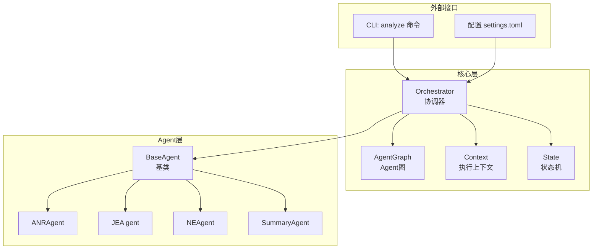
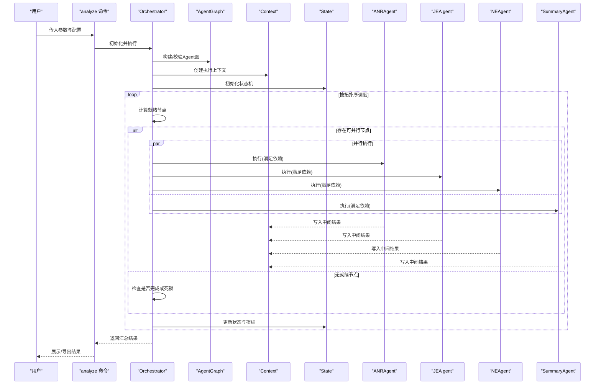
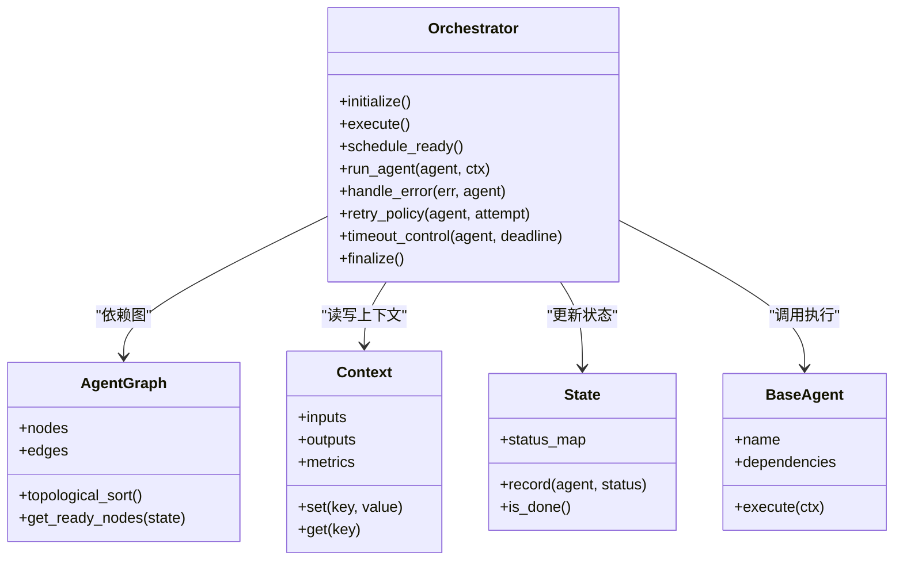
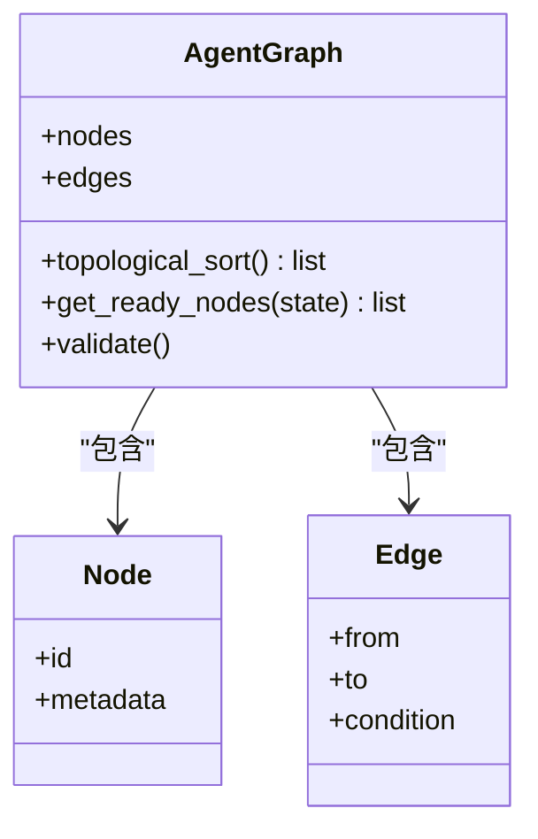
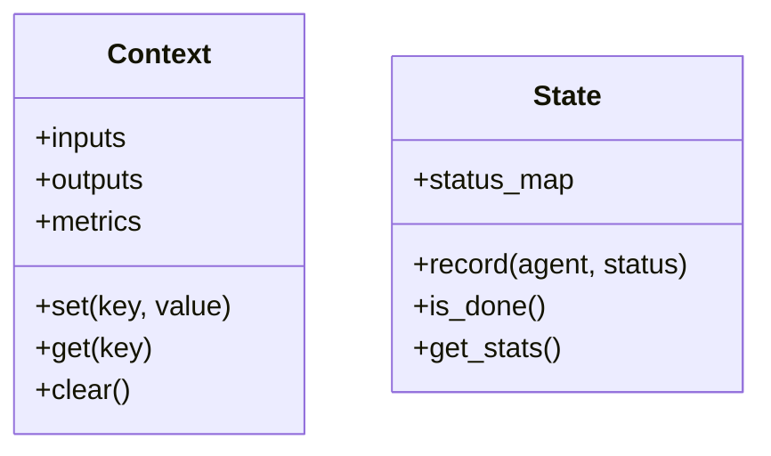
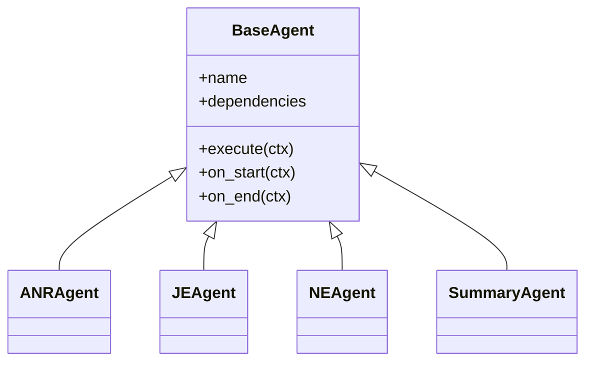
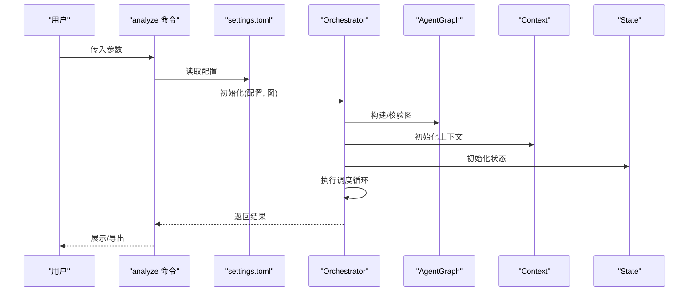
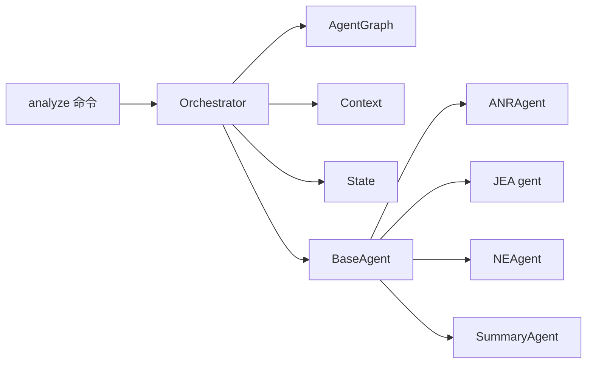

# Orchestrator协调器设计

<cite>
**本文引用的文件**   
- [orchestrator.py](file://src/jirin/core/orchestrator.py)
- [agent_graph.py](file://src/jirin/core/agent_graph.py)
- [context.py](file://src/jirin/core/context.py)
- [state.py](file://src/jirin/core/state.py)
- [base.py](file://src/jirin/agents/base.py)
- [anr_agent.py](file://src/jirin/agents/anr_agent.py)
- [je_agent.py](file://src/jirin/agents/je_agent.py)
- [ne_agent.py](file://src/jirin/agents/ne_agent.py)
- [summary_agent.py](file://src/jirin/agents/summary_agent.py)
- [analyze.py](file://src/jirin/cli/commands/analyze.py)
- [settings.toml](file://config/settings.toml)
</cite>

## 目录
1. [简介](#简介)
2. [项目结构](#项目结构)
3. [核心组件](#核心组件)
4. [架构总览](#架构总览)
5. [详细组件分析](#详细组件分析)
6. [依赖关系分析](#依赖关系分析)
7. [性能考虑](#性能考虑)
8. [故障排查指南](#故障排查指南)
9. [结论](#结论)
10. [附录](#附录)

## 简介
本文件面向Jirin的Orchestrator协调器，系统性阐述其如何管理Agent工作流、调度不同分析代理的执行顺序、处理Agent间的通信与依赖关系。文档覆盖协调器的生命周期管理、错误处理机制、重试策略与超时控制，并提供配置与使用示例路径、与Agent图结构的集成方式、性能优化建议以及故障排查指南。读者无需深入源码即可理解整体设计与使用方法。

## 项目结构
Jirin采用分层组织：核心编排位于core模块，Agent实现位于agents模块，CLI命令入口在cli.commands中，配置位于config。Orchestrator作为核心编排器，负责解析Agent图、维护执行上下文、驱动任务调度、处理错误与重试、并输出结果。

图表来源
- [orchestrator.py](file://src/jirin/core/orchestrator.py)
- [agent_graph.py](file://src/jirin/core/agent_graph.py)
- [context.py](file://src/jirin/core/context.py)
- [state.py](file://src/jirin/core/state.py)
- [base.py](file://src/jirin/agents/base.py)
- [anr_agent.py](file://src/jirin/agents/anr_agent.py)
- [je_agent.py](file://src/jirin/agents/je_agent.py)
- [ne_agent.py](file://src/jirin/agents/ne_agent.py)
- [summary_agent.py](file://src/jirin/agents/summary_agent.py)
- [analyze.py](file://src/jirin/cli/commands/analyze.py)
- [settings.toml](file://config/settings.toml)

章节来源
- [orchestrator.py](file://src/jirin/core/orchestrator.py)
- [agent_graph.py](file://src/jirin/core/agent_graph.py)
- [context.py](file://src/jirin/core/context.py)
- [state.py](file://src/jirin/core/state.py)
- [base.py](file://src/jirin/agents/base.py)
- [anr_agent.py](file://src/jirin/agents/anr_agent.py)
- [je_agent.py](file://src/jirin/agents/je_agent.py)
- [ne_agent.py](file://src/jirin/agents/ne_agent.py)
- [summary_agent.py](file://src/jirin/agents/summary_agent.py)
- [analyze.py](file://src/jirin/cli/commands/analyze.py)
- [settings.toml](file://config/settings.toml)

## 核心组件
- Orchestrator协调器：负责任务图的解析、拓扑排序、并发调度、上下文传播、错误与重试、超时控制、生命周期钩子与结果聚合。
- AgentGraph：描述Agent节点与边（依赖关系），提供拓扑排序与可执行集合计算。
- Context：跨Agent共享的数据载体，包含输入参数、中间产物、日志与指标等。
- State：记录每个Agent实例的运行状态（待执行、运行中、成功、失败、跳过等）及统计信息。
- BaseAgent与具体Agent：定义统一的Agent接口与能力扩展点；具体Agent实现ANR/JE/NE/Summary等分析逻辑。
- CLI analyze命令：用户入口，加载配置、构建图、调用协调器执行并输出结果。

章节来源
- [orchestrator.py](file://src/jirin/core/orchestrator.py)
- [agent_graph.py](file://src/jirin/core/agent_graph.py)
- [context.py](file://src/jirin/core/context.py)
- [state.py](file://src/jirin/core/state.py)
- [base.py](file://src/jirin/agents/base.py)
- [anr_agent.py](file://src/jirin/agents/anr_agent.py)
- [je_agent.py](file://src/jirin/agents/je_agent.py)
- [ne_agent.py](file://src/jirin/agents/ne_agent.py)
- [summary_agent.py](file://src/jirin/agents/summary_agent.py)
- [analyze.py](file://src/jirin/cli/commands/analyze.py)

## 架构总览
协调器以“图驱动”的方式组织Agent执行流程。Agent之间通过有向边表达数据依赖，协调器根据拓扑序选择就绪节点并行执行，并通过Context传递数据。

图表来源
- [orchestrator.py](file://src/jirin/core/orchestrator.py)
- [agent_graph.py](file://src/jirin/core/agent_graph.py)
- [context.py](file://src/jirin/core/context.py)
- [state.py](file://src/jirin/core/state.py)
- [anr_agent.py](file://src/jirin/agents/anr_agent.py)
- [je_agent.py](file://src/jirin/agents/je_agent.py)
- [ne_agent.py](file://src/jirin/agents/ne_agent.py)
- [summary_agent.py](file://src/jirin/agents/summary_agent.py)
- [analyze.py](file://src/jirin/cli/commands/analyze.py)

## 详细组件分析

### Orchestrator协调器
职责
- 解析并校验Agent图，生成拓扑序。
- 维护执行上下文与状态机，跟踪每个Agent的生命周期。
- 调度可并行执行的Agent，支持并发度限制。
- 统一错误捕获、重试与超时控制。
- 收集并聚合各Agent的输出，形成最终报告。

关键流程
- 启动阶段：加载配置、构建图、初始化上下文与状态。
- 执行阶段：循环选择就绪节点，分发到对应Agent执行，更新上下文与状态。
- 收尾阶段：汇总结果、触发清理钩子、输出日志与指标。

错误与恢复
- 对单个Agent执行进行异常隔离，避免级联失败。
- 支持基于配置的指数退避重试与最大重试次数。
- 支持全局与单节点超时控制，防止长时间阻塞。

并发与资源
- 通过并发池限制同时运行的Agent数量，避免资源争用。
- 对I/O密集型Agent与CPU密集型Agent分别优化（如线程/进程池）。

章节来源
- [orchestrator.py](file://src/jirin/core/orchestrator.py)

#### 协调器类图

图表来源
- [orchestrator.py](file://src/jirin/core/orchestrator.py)
- [agent_graph.py](file://src/jirin/core/agent_graph.py)
- [context.py](file://src/jirin/core/context.py)
- [state.py](file://src/jirin/core/state.py)
- [base.py](file://src/jirin/agents/base.py)

### Agent图结构
职责
- 声明式定义Agent节点与依赖边。
- 提供拓扑排序与就绪节点查询。
- 支持条件边与可选依赖（由具体实现决定）。

数据结构
- nodes：Agent标识与元数据。
- edges：源节点到目标节点的依赖关系。
- 方法：topological_sort、get_ready_nodes等。

章节来源
- [agent_graph.py](file://src/jirin/core/agent_graph.py)

#### 图结构类图

图表来源
- [agent_graph.py](file://src/jirin/core/agent_graph.py)

### 执行上下文与状态机
- Context：跨Agent共享的键值存储，用于传递输入、中间结果与指标。
- State：记录每个Agent的状态与统计信息，辅助判断完成与死锁检测。

章节来源
- [context.py](file://src/jirin/core/context.py)
- [state.py](file://src/jirin/core/state.py)

#### 上下文与状态类图

图表来源
- [context.py](file://src/jirin/core/context.py)
- [state.py](file://src/jirin/core/state.py)

### Agent基类与具体Agent
- BaseAgent：定义Agent通用接口（名称、依赖、执行入口）、默认行为与扩展点。
- 具体Agent：ANRAgent、JEA gent、NEAgent、SummaryAgent等，各自实现特定分析逻辑，读取Context中的输入并写入输出。

章节来源
- [base.py](file://src/jirin/agents/base.py)
- [anr_agent.py](file://src/jirin/agents/anr_agent.py)
- [je_agent.py](file://src/jirin/agents/je_agent.py)
- [ne_agent.py](file://src/jirin/agents/ne_agent.py)
- [summary_agent.py](file://src/jirin/agents/summary_agent.py)

#### Agent类图

图表来源
- [base.py](file://src/jirin/agents/base.py)
- [anr_agent.py](file://src/jirin/agents/anr_agent.py)
- [je_agent.py](file://src/jirin/agents/je_agent.py)
- [ne_agent.py](file://src/jirin/agents/ne_agent.py)
- [summary_agent.py](file://src/jirin/agents/summary_agent.py)

### CLI入口与配置
- analyze命令：解析命令行参数、加载配置、构建Agent图、调用协调器执行、输出结果。
- settings.toml：存放协调器与Agent相关的全局配置项（如并发度、重试策略、超时阈值等）。

章节来源
- [analyze.py](file://src/jirin/cli/commands/analyze.py)
- [settings.toml](file://config/settings.toml)

#### 执行序列图（CLI到协调器）

图表来源
- [analyze.py](file://src/jirin/cli/commands/analyze.py)
- [settings.toml](file://config/settings.toml)
- [orchestrator.py](file://src/jirin/core/orchestrator.py)
- [agent_graph.py](file://src/jirin/core/agent_graph.py)
- [context.py](file://src/jirin/core/context.py)
- [state.py](file://src/jirin/core/state.py)

## 依赖关系分析
- Orchestrator强依赖AgentGraph、Context、State与BaseAgent接口。
- 具体Agent通过继承BaseAgent接入系统，不直接耦合协调器内部实现。
- CLI仅依赖协调器对外API，保持松耦合。

图表来源
- [orchestrator.py](file://src/jirin/core/orchestrator.py)
- [agent_graph.py](file://src/jirin/core/agent_graph.py)
- [context.py](file://src/jirin/core/context.py)
- [state.py](file://src/jirin/core/state.py)
- [base.py](file://src/jirin/agents/base.py)
- [anr_agent.py](file://src/jirin/agents/anr_agent.py)
- [je_agent.py](file://src/jirin/agents/je_agent.py)
- [ne_agent.py](file://src/jirin/agents/ne_agent.py)
- [summary_agent.py](file://src/jirin/agents/summary_agent.py)
- [analyze.py](file://src/jirin/cli/commands/analyze.py)

章节来源
- [orchestrator.py](file://src/jirin/core/orchestrator.py)
- [agent_graph.py](file://src/jirin/core/agent_graph.py)
- [context.py](file://src/jirin/core/context.py)
- [state.py](file://src/jirin/core/state.py)
- [base.py](file://src/jirin/agents/base.py)
- [analyze.py](file://src/jirin/cli/commands/analyze.py)

## 性能考虑
- 并发度调优：根据硬件资源与Agent类型（I/O密集/CPU密集）调整并发池大小，避免过度竞争。
- 图规模优化：减少不必要的依赖边，尽量扁平化图结构以提升并行度。
- 上下文大小控制：避免在Context中存储过大对象，必要时使用持久化存储或分块传输。
- 重试与退避：合理设置最大重试次数与退避间隔，避免雪崩效应。
- 超时控制：为长耗时Agent设置独立超时，及时释放资源。
- 缓存与复用：对重复计算的中间结果进行缓存，减少重复I/O与计算。

[本节为通用指导，不涉及具体文件分析]

## 故障排查指南
常见问题
- 死锁或无法推进：检查Agent依赖环与条件边，确认所有前置输出已就绪。
- 频繁重试：查看Agent日志与错误类型，区分瞬时错误与业务错误，调整重试策略。
- 超时过多：评估Agent耗时分布，优化慢路径或增加超时阈值。
- 内存溢出：监控Context大小与Agent输出体积，拆分大任务或使用流式处理。

定位步骤
- 启用详细日志，记录每个Agent的开始/结束时间与错误堆栈。
- 打印当前就绪节点与未就绪节点列表，识别瓶颈。
- 检查配置项（并发度、重试、超时）与实际运行环境匹配性。
- 针对特定Agent编写最小复现用例，隔离问题范围。

章节来源
- [orchestrator.py](file://src/jirin/core/orchestrator.py)
- [state.py](file://src/jirin/core/state.py)
- [context.py](file://src/jirin/core/context.py)
- [analyze.py](file://src/jirin/cli/commands/analyze.py)

## 结论
Orchestrator协调器通过图驱动的调度模型，将多Agent分析流程解耦为可组合、可扩展、可观测的工作流。借助上下文与状态机，协调器实现了可靠的错误隔离、重试与超时控制，并在CLI与配置的支持下提供了良好的易用性与可运维性。遵循本文的性能与排障建议，可在复杂场景下获得稳定高效的执行体验。

[本节为总结性内容，不涉及具体文件分析]

## 附录

### 配置与使用示例路径
- 协调器初始化与执行入口参考：[orchestrator.py](file://src/jirin/core/orchestrator.py)
- Agent图构建与拓扑排序参考：[agent_graph.py](file://src/jirin/core/agent_graph.py)
- 上下文读写与指标记录参考：[context.py](file://src/jirin/core/context.py)
- 状态机与完成判定参考：[state.py](file://src/jirin/core/state.py)
- Agent基类与扩展点参考：[base.py](file://src/jirin/agents/base.py)
- 具体Agent实现参考：
  - [anr_agent.py](file://src/jirin/agents/anr_agent.py)
  - [je_agent.py](file://src/jirin/agents/je_agent.py)
  - [ne_agent.py](file://src/jirin/agents/ne_agent.py)
  - [summary_agent.py](file://src/jirin/agents/summary_agent.py)
- CLI命令与参数解析参考：[analyze.py](file://src/jirin/cli/commands/analyze.py)
- 全局配置项参考：[settings.toml](file://config/settings.toml)

章节来源
- [orchestrator.py](file://src/jirin/core/orchestrator.py)
- [agent_graph.py](file://src/jirin/core/agent_graph.py)
- [context.py](file://src/jirin/core/context.py)
- [state.py](file://src/jirin/core/state.py)
- [base.py](file://src/jirin/agents/base.py)
- [anr_agent.py](file://src/jirin/agents/anr_agent.py)
- [je_agent.py](file://src/jirin/agents/je_agent.py)
- [ne_agent.py](file://src/jirin/agents/ne_agent.py)
- [summary_agent.py](file://src/jirin/agents/summary_agent.py)
- [analyze.py](file://src/jirin/cli/commands/analyze.py)
- [settings.toml](file://config/settings.toml)