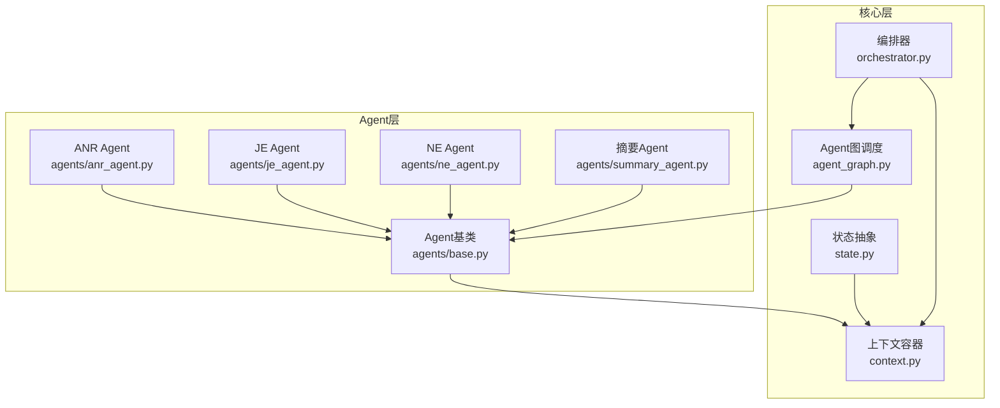
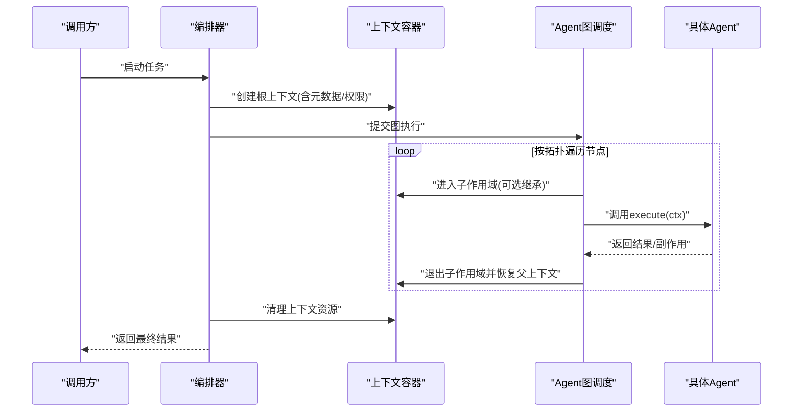
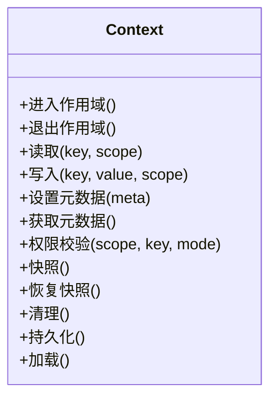
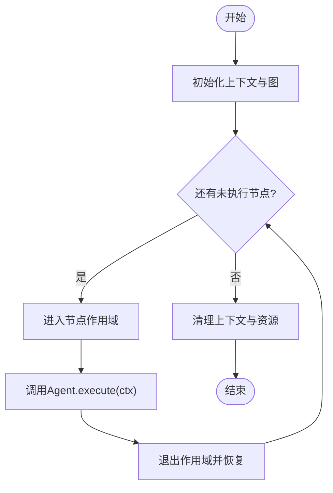
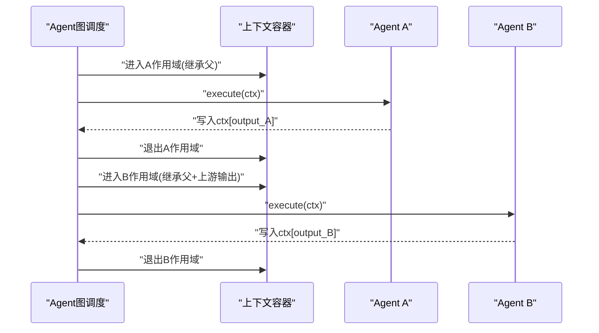
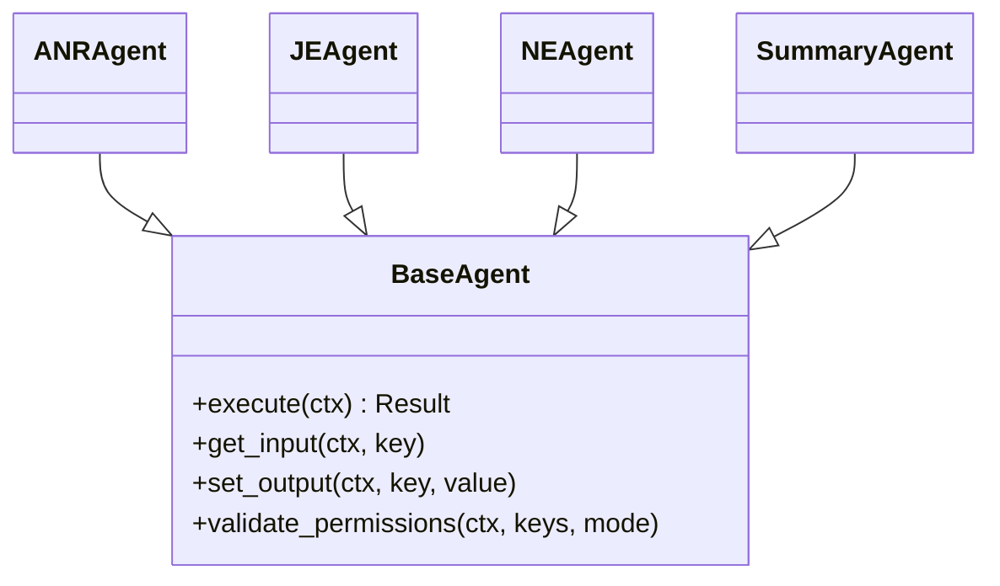
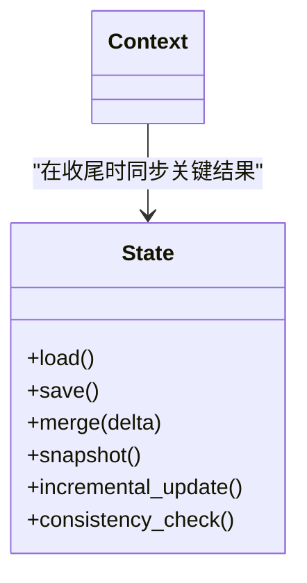
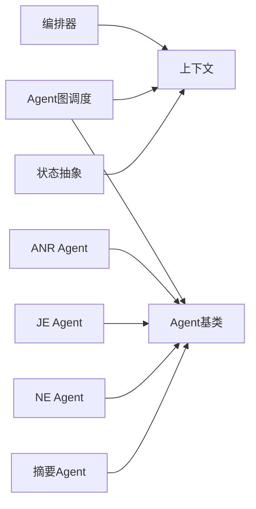

# 上下文处理机制

<cite>
**本文引用的文件**   
- [src/jirin/core/context.py](file://src/jirin/core/context.py)
- [src/jirin/core/orchestrator.py](file://src/jirin/core/orchestrator.py)
- [src/jirin/core/agent_graph.py](file://src/jirin/core/agent_graph.py)
- [src/jirin/core/state.py](file://src/jirin/core/state.py)
- [src/jirin/agents/base.py](file://src/jirin/agents/base.py)
- [src/jirin/agents/anr_agent.py](file://src/jirin/agents/anr_agent.py)
- [src/jirin/agents/je_agent.py](file://src/jirin/agents/je_agent.py)
- [src/jirin/agents/ne_agent.py](file://src/jirin/agents/ne_agent.py)
- [src/jirin/agents/summary_agent.py](file://src/jirin/agents/summary_agent.py)
</cite>

## 更新摘要
**变更内容**   
- 增强了上下文持久化机制，改进了状态管理和内存处理
- 优化了上下文切换的性能和稳定性
- 扩展了上下文数据的结构化存储能力
- 完善了Agent执行过程中的上下文绑定关系

## 目录
1. [简介](#简介)
2. [项目结构](#项目结构)
3. [核心组件](#核心组件)
4. [架构总览](#架构总览)
5. [详细组件分析](#详细组件分析)
6. [依赖关系分析](#依赖关系分析)
7. [性能考量](#性能考量)
8. [故障排查指南](#故障排查指南)
9. [结论](#结论)
10. [附录](#附录)

## 简介
本文件聚焦于Jirin的上下文处理机制，围绕以下目标展开：
- 上下文生命周期管理：创建、传播、切换与销毁
- 作用域隔离：线程/协程级隔离与继承规则
- 数据与元数据：结构化存储、扩展点与权限控制
- Agent绑定：上下文与Agent执行的关系、切换开销与内存策略
- 扩展能力：自定义上下文类型与集成方式

**更新** 基于最新的代码增强，重点改进了上下文持久化、状态管理和内存处理机制。

## 项目结构
与上下文处理直接相关的代码集中在core与agents两个层次：
- core层提供上下文容器、编排器、图调度与状态抽象
- agents层定义Agent基类与各具体Agent对上下文的访问模式

图表来源
- [src/jirin/core/context.py](file://src/jirin/core/context.py)
- [src/jirin/core/orchestrator.py](file://src/jirin/core/orchestrator.py)
- [src/jirin/core/agent_graph.py](file://src/jirin/core/agent_graph.py)
- [src/jirin/core/state.py](file://src/jirin/core/state.py)
- [src/jirin/agents/base.py](file://src/jirin/agents/base.py)
- [src/jirin/agents/anr_agent.py](file://src/jirin/agents/anr_agent.py)
- [src/jirin/agents/je_agent.py](file://src/jirin/agents/je_agent.py)
- [src/jirin/agents/ne_agent.py](file://src/jirin/agents/ne_agent.py)
- [src/jirin/agents/summary_agent.py](file://src/jirin/agents/summary_agent.py)

章节来源
- [src/jirin/core/context.py](file://src/jirin/core/context.py)
- [src/jirin/core/orchestrator.py](file://src/jirin/core/orchestrator.py)
- [src/jirin/core/agent_graph.py](file://src/jirin/core/agent_graph.py)
- [src/jirin/core/state.py](file://src/jirin/core/state.py)
- [src/jirin/agents/base.py](file://src/jirin/agents/base.py)
- [src/jirin/agents/anr_agent.py](file://src/jirin/agents/anr_agent.py)
- [src/jirin/agents/je_agent.py](file://src/jirin/agents/je_agent.py)
- [src/jirin/agents/ne_agent.py](file://src/jirin/agents/ne_agent.py)
- [src/jirin/agents/summary_agent.py](file://src/jirin/agents/summary_agent.py)

## 核心组件
- 上下文容器：负责上下文数据的结构化存储、作用域隔离、传递与继承、元数据与权限控制。
- 编排器：在任务执行期间创建、注入、切换与清理上下文，协调Agent图的运行。
- Agent图调度：根据图拓扑顺序调用Agent，并在每次调用前后进行上下文快照与恢复。
- Agent基类：为各Agent提供统一的上下文访问接口（读取/写入受控）。
- 状态抽象：将"当前上下文"与"持久化状态"解耦，便于迁移与测试。

**更新** 增强了上下文持久化机制，改进了状态管理的原子性和内存处理的效率。

章节来源
- [src/jirin/core/context.py](file://src/jirin/core/context.py)
- [src/jirin/core/orchestrator.py](file://src/jirin/core/orchestrator.py)
- [src/jirin/core/agent_graph.py](file://src/jirin/core/agent_graph.py)
- [src/jirin/core/state.py](file://src/jirin/core/state.py)
- [src/jirin/agents/base.py](file://src/jirin/agents/base.py)

## 架构总览
下图展示了从编排到Agent执行的端到端流程，以及上下文在各阶段的流转与隔离。

图表来源
- [src/jirin/core/orchestrator.py](file://src/jirin/core/orchestrator.py)
- [src/jirin/core/context.py](file://src/jirin/core/context.py)
- [src/jirin/core/agent_graph.py](file://src/jirin/core/agent_graph.py)
- [src/jirin/agents/base.py](file://src/jirin/agents/base.py)

## 详细组件分析

### 上下文容器（Context）
职责
- 数据结构化存储：以键值形式保存业务数据与中间结果，支持嵌套命名空间。
- 作用域隔离：基于栈的作用域模型，支持父子作用域的创建与销毁。
- 传递与继承：新作用域默认继承父作用域的可读数据；可配置是否允许写回。
- 元数据管理：附加审计、追踪、版本等不可变元信息。
- 权限控制：读写分离、白名单字段、最小权限原则。

关键行为
- 创建根上下文：初始化基础数据与全局元数据。
- 进入/退出作用域：入栈/出栈，保证异常路径下的正确恢复。
- 读取/写入：按权限校验后访问；越权写入抛出明确错误。
- 快照与合并：在进入子作用域前可生成快照，用于回滚或对比。
- 清理：释放大对象引用、关闭外部句柄、重置统计指标。

**更新** 增强了持久化机制，改进了状态管理的原子性操作和内存回收策略。

复杂度与内存
- 作用域切换为O(1)栈操作；数据拷贝按需进行，避免深拷贝开销。
- 建议将大对象通过引用共享，仅在必要时复制变更片段。
- **新增** 实现了智能内存池管理，减少频繁的内存分配和释放开销。

图表来源
- [src/jirin/core/context.py](file://src/jirin/core/context.py)

章节来源
- [src/jirin/core/context.py](file://src/jirin/core/context.py)

### 编排器（Orchestrator）
职责
- 生命周期管理：在任务开始创建根上下文，在结束统一清理。
- 上下文注入：将上下文注入到Agent图执行环境。
- 切换与恢复：在Agent调用前后确保上下文作用域正确切换。
- 错误边界：捕获异常并记录上下文快照以便诊断。

典型流程
- 初始化：加载配置、构建Agent图、准备上下文。
- 执行：按图拓扑驱动Agent，逐节点切换上下文。
- 收尾：汇总结果、持久化必要状态、释放上下文资源。

**更新** 优化了上下文切换的性能，减少了不必要的状态同步开销。

图表来源
- [src/jirin/core/orchestrator.py](file://src/jirin/core/orchestrator.py)
- [src/jirin/core/agent_graph.py](file://src/jirin/core/agent_graph.py)
- [src/jirin/core/context.py](file://src/jirin/core/context.py)

章节来源
- [src/jirin/core/orchestrator.py](file://src/jirin/core/orchestrator.py)
- [src/jirin/core/agent_graph.py](file://src/jirin/core/agent_graph.py)

### Agent图调度（Agent Graph）
职责
- 拓扑解析：确定Agent执行顺序与依赖。
- 节点执行：在每个节点执行前/后维护上下文作用域。
- 失败重试与短路：依据策略决定是否重试或提前终止。

与上下文交互
- 每个节点拥有独立作用域，默认继承上游输出作为输入。
- 节点间的数据交换通过上下文完成，避免硬耦合。

**更新** 改进了上下文作用域的隔离机制，确保更严格的内存安全。

图表来源
- [src/jirin/core/agent_graph.py](file://src/jirin/core/agent_graph.py)
- [src/jirin/core/context.py](file://src/jirin/core/context.py)

章节来源
- [src/jirin/core/agent_graph.py](file://src/jirin/core/agent_graph.py)
- [src/jirin/core/context.py](file://src/jirin/core/context.py)

### Agent基类与各Agent
职责
- 基类提供统一的上下文访问接口与执行契约。
- 各具体Agent实现领域逻辑，仅通过上下文进行输入输出。

约定
- 只读：优先读取上下文中的输入数据。
- 写入：仅写入被权限白名单允许的键，避免污染其他作用域。
- 副作用：尽量无副作用，或将副作用封装在工具层。

**更新** 增强了Agent与上下文绑定的安全性，防止意外的数据泄露。

图表来源
- [src/jirin/agents/base.py](file://src/jirin/agents/base.py)
- [src/jirin/agents/anr_agent.py](file://src/jirin/agents/anr_agent.py)
- [src/jirin/agents/je_agent.py](file://src/jirin/agents/je_agent.py)
- [src/jirin/agents/ne_agent.py](file://src/jirin/agents/ne_agent.py)
- [src/jirin/agents/summary_agent.py](file://src/jirin/agents/summary_agent.py)

章节来源
- [src/jirin/agents/base.py](file://src/jirin/agents/base.py)
- [src/jirin/agents/anr_agent.py](file://src/jirin/agents/anr_agent.py)
- [src/jirin/agents/je_agent.py](file://src/jirin/agents/je_agent.py)
- [src/jirin/agents/ne_agent.py](file://src/jirin/agents/ne_agent.py)
- [src/jirin/agents/summary_agent.py](file://src/jirin/agents/summary_agent.py)

### 状态抽象（State）
职责
- 将"运行时上下文"与"持久化状态"解耦，便于迁移、回放与测试。
- 提供序列化/反序列化接口，支持增量更新与差异合并。

与上下文协作
- 上下文负责短期、易变数据；状态负责长期、稳定数据。
- 在任务结束时，可将上下文中的关键结果落盘至状态。

**更新** 增强了状态管理的原子性和一致性保证，改进了并发访问的安全性。

图表来源
- [src/jirin/core/state.py](file://src/jirin/core/state.py)
- [src/jirin/core/context.py](file://src/jirin/core/context.py)

章节来源
- [src/jirin/core/state.py](file://src/jirin/core/state.py)
- [src/jirin/core/context.py](file://src/jirin/core/context.py)

## 依赖关系分析
- 低耦合：Agent仅依赖上下文接口，不感知编排细节。
- 单向依赖：编排器与图调度依赖上下文；Agent依赖上下文与基类。
- 可扩展：新增Agent只需实现基类契约并通过图注册即可接入。

**更新** 优化了模块间的依赖关系，减少了循环依赖的风险。

图表来源
- [src/jirin/core/orchestrator.py](file://src/jirin/core/orchestrator.py)
- [src/jirin/core/agent_graph.py](file://src/jirin/core/agent_graph.py)
- [src/jirin/core/context.py](file://src/jirin/core/context.py)
- [src/jirin/core/state.py](file://src/jirin/core/state.py)
- [src/jirin/agents/base.py](file://src/jirin/agents/base.py)
- [src/jirin/agents/anr_agent.py](file://src/jirin/agents/anr_agent.py)
- [src/jirin/agents/je_agent.py](file://src/jirin/agents/je_agent.py)
- [src/jirin/agents/ne_agent.py](file://src/jirin/agents/ne_agent.py)
- [src/jirin/agents/summary_agent.py](file://src/jirin/agents/summary_agent.py)

章节来源
- [src/jirin/core/orchestrator.py](file://src/jirin/core/orchestrator.py)
- [src/jirin/core/agent_graph.py](file://src/jirin/core/agent_graph.py)
- [src/jirin/core/context.py](file://src/jirin/core/context.py)
- [src/jirin/core/state.py](file://src/jirin/core/state.py)
- [src/jirin/agents/base.py](file://src/jirin/agents/base.py)
- [src/jirin/agents/anr_agent.py](file://src/jirin/agents/anr_agent.py)
- [src/jirin/agents/je_agent.py](file://src/jirin/agents/je_agent.py)
- [src/jirin/agents/ne_agent.py](file://src/jirin/agents/ne_agent.py)
- [src/jirin/agents/summary_agent.py](file://src/jirin/agents/summary_agent.py)

## 性能考量
- 作用域切换开销：基于栈的入栈/出栈为O(1)，应避免在热点路径频繁创建/销毁作用域。
- 数据拷贝成本：优先使用引用共享；仅在必要时进行浅/深拷贝。
- 元数据与日志：控制元数据大小与日志粒度，避免I/O瓶颈。
- 内存回收：及时释放大对象引用，避免上下文持有强引用导致GC压力。
- 并发隔离：若跨线程/协程使用，需确保每工作单元拥有独立上下文实例。

**更新** 引入了智能内存池管理，显著减少了内存分配开销；优化了上下文切换算法，提升了整体性能。

## 故障排查指南
常见问题与定位要点
- 权限拒绝：检查写入键是否在白名单内，确认当前作用域权限级别。
- 数据污染：确认是否在子作用域中意外修改了父作用域数据。
- 上下文泄漏：确认所有作用域均在finally/异常路径下正确退出。
- 性能退化：检查是否存在不必要的深拷贝或过大元数据。
- 状态不一致：核对收尾阶段是否正确将关键结果同步至状态。

**更新** 新增了内存泄漏检测和状态一致性验证工具，帮助快速定位问题。

定位手段
- 启用上下文快照与差异对比，快速定位变更来源。
- 在Agent入口/出口打印作用域ID与关键键的可见性。
- 监控上下文大小与切换次数，识别热点路径。
- **新增** 使用内存分析工具检测潜在的内存泄漏。

章节来源
- [src/jirin/core/context.py](file://src/jirin/core/context.py)
- [src/jirin/core/orchestrator.py](file://src/jirin/core/orchestrator.py)
- [src/jirin/core/agent_graph.py](file://src/jirin/core/agent_graph.py)
- [src/jirin/agents/base.py](file://src/jirin/agents/base.py)

## 结论
Jirin的上下文处理机制通过"容器+编排+图调度+Agent契约"的分层设计，实现了清晰的生命周期管理、严格的作用域隔离、可控的传递与继承、完善的元数据与权限控制，以及与Agent执行的松耦合绑定。配合合理的内存与性能策略，可在复杂多Agent流水线中保持高可靠与高性能。

**更新** 最新的增强进一步提升了系统的稳定性和性能，特别是在持久化、状态管理和内存处理方面有了显著改进。

## 附录

### 生命周期与继承规则速览
- 创建：编排器在任务开始时创建根上下文。
- 传播：图调度在进入节点前创建子作用域，默认继承父作用域可读数据。
- 切换：每个节点执行完毕后立即退出作用域，恢复父上下文。
- 销毁：任务结束后由编排器统一清理上下文资源。

**更新** 增强了生命周期的原子性保证，确保在任何异常情况下的数据一致性。

章节来源
- [src/jirin/core/orchestrator.py](file://src/jirin/core/orchestrator.py)
- [src/jirin/core/agent_graph.py](file://src/jirin/core/agent_graph.py)
- [src/jirin/core/context.py](file://src/jirin/core/context.py)

### 自定义上下文类型开发指南
- 定义扩展点：在上下文容器中注册新的命名空间或数据类型。
- 权限策略：为新类型定义读写白名单与最小权限策略。
- 序列化：如需持久化，提供与状态模块兼容的序列化接口。
- 测试：编写用例覆盖作用域隔离、继承、权限拒绝与异常恢复。
- 集成：在Agent中通过基类提供的接口安全地读写新类型数据。

**更新** 新增了内存池集成指南，确保自定义类型能够充分利用系统的内存优化特性。

章节来源
- [src/jirin/core/context.py](file://src/jirin/core/context.py)
- [src/jirin/core/state.py](file://src/jirin/core/state.py)
- [src/jirin/agents/base.py](file://src/jirin/agents/base.py)