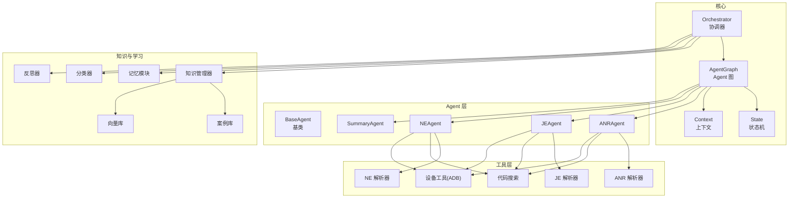
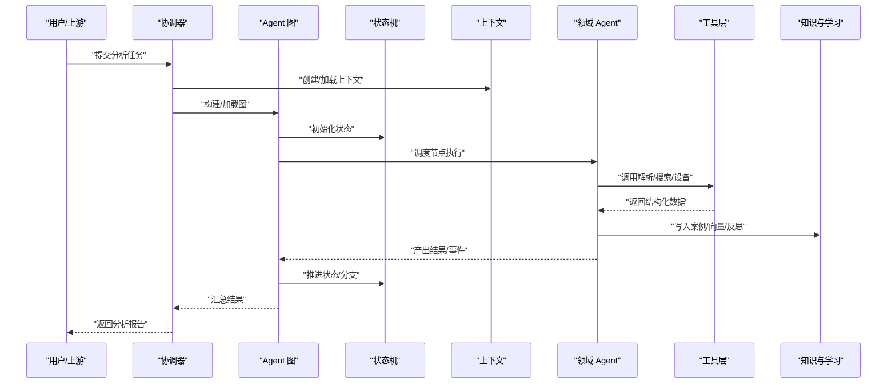
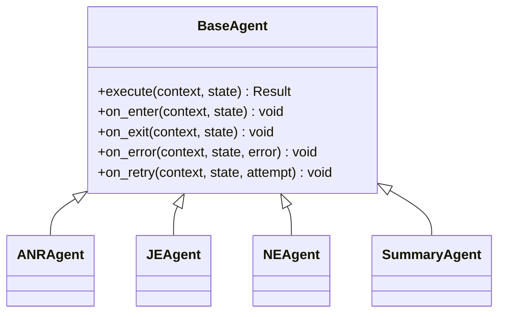
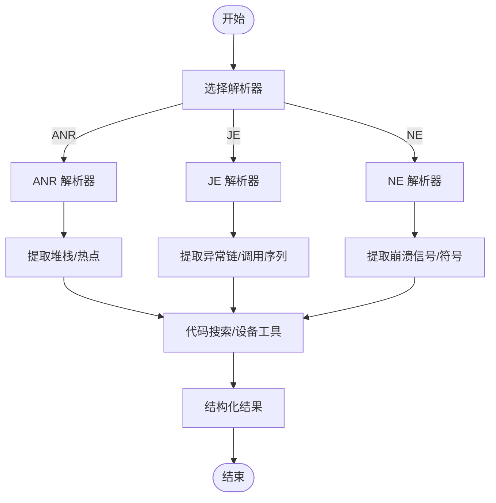
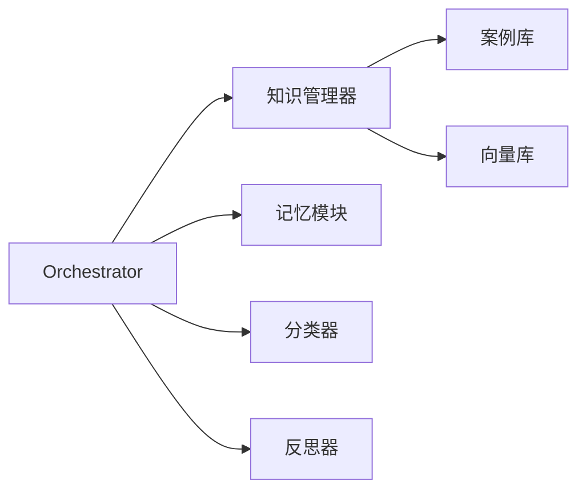
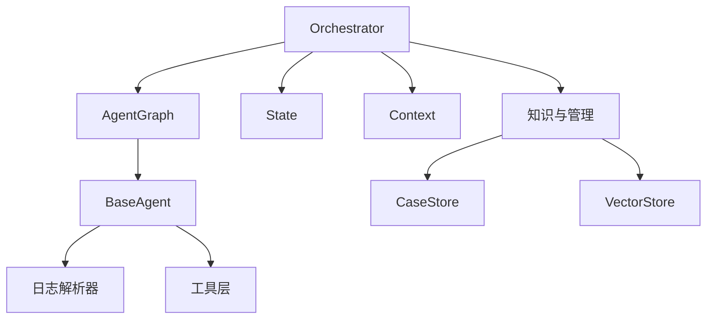

# 核心架构设计

<cite>
**本文引用的文件**   
- [src/jirin/core/orchestrator.py](file://src/jirin/core/orchestrator.py)
- [src/jirin/core/agent_graph.py](file://src/jirin/core/agent_graph.py)
- [src/jirin/core/state.py](file://src/jirin/core/state.py)
- [src/jirin/core/context.py](file://src/jirin/core/context.py)
- [src/jirin/agents/base.py](file://src/jirin/agents/base.py)
- [src/jirin/agents/anr_agent.py](file://src/jirin/agents/anr_agent.py)
- [src/jirin/agents/je_agent.py](file://src/jirin/agents/je_agent.py)
- [src/jirin/agents/ne_agent.py](file://src/jirin/agents/ne_agent.py)
- [src/jirin/agents/summary_agent.py](file://src/jirin/agents/summary_agent.py)
- [src/jirin/tools/log_parser/anr_parser.py](file://src/jirin/tools/log_parser/anr_parser.py)
- [src/jirin/tools/log_parser/je_parser.py](file://src/jirin/tools/log_parser/je_parser.py)
- [src/jirin/tools/log_parser/ne_parser.py](file://src/jirin/tools/log_parser/ne_parser.py)
- [src/jirin/knowledge/case_store.py](file://src/jirin/knowledge/case_store.py)
- [src/jirin/knowledge/vector_store.py](file://src/jirin/knowledge/vector_store.py)
- [src/jirin/knowledge/manager.py](file://src/jirin/knowledge/manager.py)
- [src/jirin/learning/memory.py](file://src/jirin/learning/memory.py)
- [src/jirin/learning/classifier.py](file://src/jirin/learning/classifier.py)
- [src/jirin/learning/reflector.py](file://src/jirin/learning/reflector.py)
- [config/settings.toml](file://config/settings.toml)
</cite>

## 目录
1. [简介](#简介)
2. [项目结构](#项目结构)
3. [核心组件](#核心组件)
4. [架构总览](#架构总览)
5. [详细组件分析](#详细组件分析)
6. [依赖关系分析](#依赖关系分析)
7. [性能考虑](#性能考虑)
8. [故障排查指南](#故障排查指南)
9. [结论](#结论)
10. [附录](#附录)

## 简介
本文件面向开发者，系统化阐述 Jirin 的核心架构与协作模式。Jirin 采用基于 Agent 的协作式架构：由 Orchestrator（协调器）驱动 Agent 图执行，围绕“状态 + 上下文”的事件驱动工作流进行编排。Agent 负责特定领域任务（如 ANR、Java 异常、Native 崩溃等），通过工具层解析日志、检索知识、调用设备能力，最终产出结构化结果并沉淀到案例库与向量知识库中，支持学习与反思闭环。

## 项目结构
- 核心运行期位于 src/jirin/core，包含协调器、Agent 图、状态机与上下文管理。
- Agent 实现位于 src/jirin/agents，提供基础抽象与具体领域 Agent。
- 工具层位于 src/jirin/tools，封装日志解析、代码搜索、设备交互等能力。
- 知识与学习位于 src/jirin/knowledge 与 src/jirin/learning，支撑案例存储、向量检索、分类与反思。
- 配置位于 config/settings.toml，统一系统参数。

图表来源
- [src/jirin/core/orchestrator.py](file://src/jirin/core/orchestrator.py)
- [src/jirin/core/agent_graph.py](file://src/jirin/core/agent_graph.py)
- [src/jirin/core/state.py](file://src/jirin/core/state.py)
- [src/jirin/core/context.py](file://src/jirin/core/context.py)
- [src/jirin/agents/base.py](file://src/jirin/agents/base.py)
- [src/jirin/agents/anr_agent.py](file://src/jirin/agents/anr_agent.py)
- [src/jirin/agents/je_agent.py](file://src/jirin/agents/je_agent.py)
- [src/jirin/agents/ne_agent.py](file://src/jirin/agents/ne_agent.py)
- [src/jirin/agents/summary_agent.py](file://src/jirin/agents/summary_agent.py)
- [src/jirin/tools/log_parser/anr_parser.py](file://src/jirin/tools/log_parser/anr_parser.py)
- [src/jirin/tools/log_parser/je_parser.py](file://src/jirin/tools/log_parser/je_parser.py)
- [src/jirin/tools/log_parser/ne_parser.py](file://src/jirin/tools/log_parser/ne_parser.py)
- [src/jirin/knowledge/case_store.py](file://src/jirin/knowledge/case_store.py)
- [src/jirin/knowledge/vector_store.py](file://src/jirin/knowledge/vector_store.py)
- [src/jirin/knowledge/manager.py](file://src/jirin/knowledge/manager.py)
- [src/jirin/learning/memory.py](file://src/jirin/learning/memory.py)
- [src/jirin/learning/classifier.py](file://src/jirin/learning/classifier.py)
- [src/jirin/learning/reflector.py](file://src/jirin/learning/reflector.py)

章节来源
- [src/jirin/core/orchestrator.py](file://src/jirin/core/orchestrator.py)
- [src/jirin/core/agent_graph.py](file://src/jirin/core/agent_graph.py)
- [src/jirin/core/state.py](file://src/jirin/core/state.py)
- [src/jirin/core/context.py](file://src/jirin/core/context.py)
- [src/jirin/agents/base.py](file://src/jirin/agents/base.py)
- [src/jirin/agents/anr_agent.py](file://src/jirin/agents/anr_agent.py)
- [src/jirin/agents/je_agent.py](file://src/jirin/agents/je_agent.py)
- [src/jirin/agents/ne_agent.py](file://src/jirin/agents/ne_agent.py)
- [src/jirin/agents/summary_agent.py](file://src/jirin/agents/summary_agent.py)
- [src/jirin/tools/log_parser/anr_parser.py](file://src/jirin/tools/log_parser/anr_parser.py)
- [src/jirin/tools/log_parser/je_parser.py](file://src/jirin/tools/log_parser/je_parser.py)
- [src/jirin/tools/log_parser/ne_parser.py](file://src/jirin/tools/log_parser/ne_parser.py)
- [src/jirin/knowledge/case_store.py](file://src/jirin/knowledge/case_store.py)
- [src/jirin/knowledge/vector_store.py](file://src/jirin/knowledge/vector_store.py)
- [src/jirin/knowledge/manager.py](file://src/jirin/knowledge/manager.py)
- [src/jirin/learning/memory.py](file://src/jirin/learning/memory.py)
- [src/jirin/learning/classifier.py](file://src/jirin/learning/classifier.py)
- [src/jirin/learning/reflector.py](file://src/jirin/learning/reflector.py)
- [config/settings.toml](file://config/settings.toml)

## 核心组件
- Orchestrator（协调器）
  - 职责：接收输入事件，构建或加载 Agent 图，驱动状态机推进，调度 Agent 节点执行，聚合输出，触发学习与反思。
  - 关键流程：初始化上下文 -> 构建图 -> 启动执行 -> 监听事件 -> 更新状态 -> 持久化结果 -> 结束。
- AgentGraph（Agent 图）
  - 职责：定义节点（Agent）、边（条件/数据依赖）、入口与出口；提供拓扑校验、执行计划生成与容错策略。
- State（状态机）
  - 职责：维护全局状态、阶段标记、中间产物索引；提供状态转换、快照与回滚能力。
- Context（上下文）
  - 职责：承载请求级数据、临时缓存、工具句柄、权限与资源；在节点间传递不可变视图与可变片段。
- BaseAgent（Agent 基类）
  - 职责：定义统一的执行接口、生命周期钩子、错误处理与可观测性；提供默认重试、超时与日志记录。
- 领域 Agent（ANR/JE/NE/Summary）
  - 职责：分别针对 Android ANR、Java 异常、Native 崩溃与总结报告，组合工具与知识完成专项分析。

章节来源
- [src/jirin/core/orchestrator.py](file://src/jirin/core/orchestrator.py)
- [src/jirin/core/agent_graph.py](file://src/jirin/core/agent_graph.py)
- [src/jirin/core/state.py](file://src/jirin/core/state.py)
- [src/jirin/core/context.py](file://src/jirin/core/context.py)
- [src/jirin/agents/base.py](file://src/jirin/agents/base.py)
- [src/jirin/agents/anr_agent.py](file://src/jirin/agents/anr_agent.py)
- [src/jirin/agents/je_agent.py](file://src/jirin/agents/je_agent.py)
- [src/jirin/agents/ne_agent.py](file://src/jirin/agents/ne_agent.py)
- [src/jirin/agents/summary_agent.py](file://src/jirin/agents/summary_agent.py)

## 架构总览
下图展示从事件入站到结果输出的端到端流程，以及各组件间的交互关系。

图表来源
- [src/jirin/core/orchestrator.py](file://src/jirin/core/orchestrator.py)
- [src/jirin/core/agent_graph.py](file://src/jirin/core/agent_graph.py)
- [src/jirin/core/state.py](file://src/jirin/core/state.py)
- [src/jirin/core/context.py](file://src/jirin/core/context.py)
- [src/jirin/agents/base.py](file://src/jirin/agents/base.py)
- [src/jirin/knowledge/case_store.py](file://src/jirin/knowledge/case_store.py)
- [src/jirin/knowledge/vector_store.py](file://src/jirin/knowledge/vector_store.py)
- [src/jirin/knowledge/manager.py](file://src/jirin/knowledge/manager.py)
- [src/jirin/learning/memory.py](file://src/jirin/learning/memory.py)
- [src/jirin/learning/classifier.py](file://src/jirin/learning/classifier.py)
- [src/jirin/learning/reflector.py](file://src/jirin/learning/reflector.py)

## 详细组件分析

### 协调器 Orchestrator
- 角色定位：系统主控制器，负责编排 Agent 图执行、事件分发、状态同步与结果聚合。
- 关键职责：
  - 生命周期管理：启动、暂停、恢复、终止。
  - 事件驱动：订阅/发布任务事件，驱动图推进。
  - 资源治理：上下文隔离、并发控制、超时与重试。
  - 可观测性：指标采集、链路追踪、审计日志。
- 扩展点：
  - 自定义事件处理器。
  - 动态图注入与热插拔。
  - 外部系统集成（消息总线、监控平台）。

章节来源
- [src/jirin/core/orchestrator.py](file://src/jirin/core/orchestrator.py)

### Agent 图 AgentGraph
- 角色定位：描述 Agent 之间的有向无环图（DAG），定义执行顺序、条件分支与数据依赖。
- 关键职责：
  - 图构建：声明式定义节点与边，支持模板与参数化。
  - 执行计划：拓扑排序、并行度控制、失败重试与熔断。
  - 数据流：节点间通过上下文与状态共享数据，避免紧耦合。
- 约束与权衡：
  - DAG 限制保证无环，便于推理与调试。
  - 条件边支持动态路由，但需保持幂等与可重放。

章节来源
- [src/jirin/core/agent_graph.py](file://src/jirin/core/agent_graph.py)

### 状态机 State
- 角色定位：维护全局状态与阶段标记，确保执行一致性与可恢复性。
- 关键职责：
  - 状态定义：阶段枚举、中间产物键空间、版本控制。
  - 转换规则：原子更新、冲突检测、快照与回滚。
  - 查询接口：按阶段/键快速检索中间结果。
- 设计要点：
  - 读写分离：只读视图用于下游消费，写路径受锁保护。
  - 幂等性：同一事件多次触发不改变最终状态。

章节来源
- [src/jirin/core/state.py](file://src/jirin/core/state.py)

### 上下文 Context
- 角色定位：贯穿一次分析的请求级数据载体，提供安全的数据共享与资源访问。
- 关键职责：
  - 数据分区：按 Agent 域划分命名空间，避免污染。
  - 生命周期：随任务创建/销毁，支持序列化与跨进程传递。
  - 资源句柄：工具实例、连接池、临时文件等。
- 最佳实践：
  - 尽量使用不可变对象传递大对象引用。
  - 敏感信息加密存储，访问受鉴权控制。

章节来源
- [src/jirin/core/context.py](file://src/jirin/core/context.py)

### Agent 基类与领域 Agent
- BaseAgent
  - 统一接口：execute(context, state) -> result/event。
  - 生命周期钩子：on_enter/on_exit、on_error、on_retry。
  - 可观测性：埋点、耗时统计、错误码规范。
- 领域 Agent
  - ANRAgent：结合 ANR 解析器与代码搜索，定位主线程阻塞与死锁线索。
  - JEAgent：解析 Java 异常堆栈，关联源码与变更记录。
  - NEAgent：解析 Native 崩溃日志，联动符号表与内存快照。
  - SummaryAgent：汇总多 Agent 结果，生成可读报告与行动建议。

图表来源
- [src/jirin/agents/base.py](file://src/jirin/agents/base.py)
- [src/jirin/agents/anr_agent.py](file://src/jirin/agents/anr_agent.py)
- [src/jirin/agents/je_agent.py](file://src/jirin/agents/je_agent.py)
- [src/jirin/agents/ne_agent.py](file://src/jirin/agents/ne_agent.py)
- [src/jirin/agents/summary_agent.py](file://src/jirin/agents/summary_agent.py)

章节来源
- [src/jirin/agents/base.py](file://src/jirin/agents/base.py)
- [src/jirin/agents/anr_agent.py](file://src/jirin/agents/anr_agent.py)
- [src/jirin/agents/je_agent.py](file://src/jirin/agents/je_agent.py)
- [src/jirin/agents/ne_agent.py](file://src/jirin/agents/ne_agent.py)
- [src/jirin/agents/summary_agent.py](file://src/jirin/agents/summary_agent.py)

### 工具层与日志解析器
- 日志解析器
  - ANR 解析器：提取线程堆栈、主线程等待、IO/CPU 热点。
  - JE 解析器：解析异常类型、根因链、相关方法调用序列。
  - NE 解析器：解析崩溃信号、寄存器、内存地址与符号映射。
- 代码搜索与设备工具
  - 代码搜索：基于关键词/语义检索相关源码与变更。
  - 设备工具：通过 ADB 拉取日志、抓取堆转储、重启设备等。

图表来源
- [src/jirin/tools/log_parser/anr_parser.py](file://src/jirin/tools/log_parser/anr_parser.py)
- [src/jirin/tools/log_parser/je_parser.py](file://src/jirin/tools/log_parser/je_parser.py)
- [src/jirin/tools/log_parser/ne_parser.py](file://src/jirin/tools/log_parser/ne_parser.py)

章节来源
- [src/jirin/tools/log_parser/anr_parser.py](file://src/jirin/tools/log_parser/anr_parser.py)
- [src/jirin/tools/log_parser/je_parser.py](file://src/jirin/tools/log_parser/je_parser.py)
- [src/jirin/tools/log_parser/ne_parser.py](file://src/jirin/tools/log_parser/ne_parser.py)

### 知识与学习子系统
- 知识管理
  - 案例库：结构化存储历史问题、根因、修复方案与证据链。
  - 向量库：对文本/代码片段进行嵌入，支持相似检索与推荐。
  - 管理器：统一 CRUD、索引重建、版本迁移与一致性保障。
- 学习闭环
  - 记忆模块：短期/长期记忆，经验沉淀与遗忘曲线。
  - 分类器：自动标注问题类型、严重等级与影响范围。
  - 反思器：复盘执行路径，识别瓶颈与改进点，生成优化建议。

图表来源
- [src/jirin/knowledge/case_store.py](file://src/jirin/knowledge/case_store.py)
- [src/jirin/knowledge/vector_store.py](file://src/jirin/knowledge/vector_store.py)
- [src/jirin/knowledge/manager.py](file://src/jirin/knowledge/manager.py)
- [src/jirin/learning/memory.py](file://src/jirin/learning/memory.py)
- [src/jirin/learning/classifier.py](file://src/jirin/learning/classifier.py)
- [src/jirin/learning/reflector.py](file://src/jirin/learning/reflector.py)

章节来源
- [src/jirin/knowledge/case_store.py](file://src/jirin/knowledge/case_store.py)
- [src/jirin/knowledge/vector_store.py](file://src/jirin/knowledge/vector_store.py)
- [src/jirin/knowledge/manager.py](file://src/jirin/knowledge/manager.py)
- [src/jirin/learning/memory.py](file://src/jirin/learning/memory.py)
- [src/jirin/learning/classifier.py](file://src/jirin/learning/classifier.py)
- [src/jirin/learning/reflector.py](file://src/jirin/learning/reflector.py)

## 依赖关系分析
- 松耦合原则
  - Orchestrator 仅依赖抽象接口（AgentGraph、State、Context），降低与具体实现的耦合。
  - Agent 通过工具层与知识层交互，避免直接访问底层设施。
- 内聚性
  - 每个 Agent 聚焦单一领域，内部组合必要工具与知识，提升内聚。
- 外部依赖
  - 设备交互（ADB）、向量数据库、文件系统与配置中心。

图表来源
- [src/jirin/core/orchestrator.py](file://src/jirin/core/orchestrator.py)
- [src/jirin/core/agent_graph.py](file://src/jirin/core/agent_graph.py)
- [src/jirin/core/state.py](file://src/jirin/core/state.py)
- [src/jirin/core/context.py](file://src/jirin/core/context.py)
- [src/jirin/agents/base.py](file://src/jirin/agents/base.py)
- [src/jirin/tools/log_parser/anr_parser.py](file://src/jirin/tools/log_parser/anr_parser.py)
- [src/jirin/tools/log_parser/je_parser.py](file://src/jirin/tools/log_parser/je_parser.py)
- [src/jirin/tools/log_parser/ne_parser.py](file://src/jirin/tools/log_parser/ne_parser.py)
- [src/jirin/knowledge/case_store.py](file://src/jirin/knowledge/case_store.py)
- [src/jirin/knowledge/vector_store.py](file://src/jirin/knowledge/vector_store.py)

章节来源
- [src/jirin/core/orchestrator.py](file://src/jirin/core/orchestrator.py)
- [src/jirin/core/agent_graph.py](file://src/jirin/core/agent_graph.py)
- [src/jirin/core/state.py](file://src/jirin/core/state.py)
- [src/jirin/core/context.py](file://src/jirin/core/context.py)
- [src/jirin/agents/base.py](file://src/jirin/agents/base.py)
- [src/jirin/tools/log_parser/anr_parser.py](file://src/jirin/tools/log_parser/anr_parser.py)
- [src/jirin/tools/log_parser/je_parser.py](file://src/jirin/tools/log_parser/je_parser.py)
- [src/jirin/tools/log_parser/ne_parser.py](file://src/jirin/tools/log_parser/ne_parser.py)
- [src/jirin/knowledge/case_store.py](file://src/jirin/knowledge/case_store.py)
- [src/jirin/knowledge/vector_store.py](file://src/jirin/knowledge/vector_store.py)

## 性能考虑
- 并发与并行
  - 图执行支持并行节点调度，注意共享状态加锁与上下文隔离。
- I/O 与缓存
  - 日志解析与代码搜索应引入本地缓存与去重，减少重复计算。
- 资源上限
  - 设置超时、重试次数与熔断阈值，防止雪崩。
- 批处理与增量
  - 批量写入案例与向量库，增量索引更新，降低开销。
- 可观测性
  - 关键路径埋点，收集延迟、吞吐与错误率，指导容量规划。

[本节为通用指导，无需列出具体文件来源]

## 故障排查指南
- 常见问题
  - 图执行卡住：检查状态转换是否满足前置条件，确认边条件与事件是否到达。
  - Agent 执行失败：查看 on_error 钩子日志与错误码，确认工具可用性。
  - 上下文污染：核对命名空间与生命周期，避免跨任务共享可变对象。
  - 知识写入失败：检查向量库索引与案例库权限，必要时触发重建。
- 诊断步骤
  - 启用详细日志与链路追踪，定位失败节点与调用链。
  - 导出中间状态快照，对比预期差异。
  - 回放事件序列，验证幂等与可重放性。
- 恢复策略
  - 利用状态回滚与断点续跑，最小化损失。
  - 降级到只读模式，优先保障服务可用。

章节来源
- [src/jirin/core/state.py](file://src/jirin/core/state.py)
- [src/jirin/core/context.py](file://src/jirin/core/context.py)
- [src/jirin/agents/base.py](file://src/jirin/agents/base.py)
- [src/jirin/knowledge/case_store.py](file://src/jirin/knowledge/case_store.py)
- [src/jirin/knowledge/vector_store.py](file://src/jirin/knowledge/vector_store.py)

## 结论
Jirin 以 Orchestrator 为核心，结合 AgentGraph、State 与 Context，构建了高内聚、低耦合的 Agent 协作体系。通过工具层与知识/学习子系统，形成“分析-沉淀-反思-优化”的闭环。该架构具备良好的可扩展性与可观测性，适合持续演进与复杂场景落地。

[本节为总结性内容，无需列出具体文件来源]

## 附录

### 技术决策与权衡
- 基于 Agent 的协作模式
  - 优点：职责清晰、易于扩展、可并行执行。
  - 风险：图复杂度上升、调试难度增加。
  - 缓解：严格 DAG 约束、可视化图编辑与强类型上下文。
- 事件驱动编排
  - 优点：解耦、灵活、易集成外部系统。
  - 风险：时序与竞态问题。
  - 缓解：幂等设计、事件去重与补偿机制。
- 状态与上下文分离
  - 优点：关注点分离、便于测试与回放。
  - 风险：数据一致性挑战。
  - 缓解：原子更新、快照与版本化。

[本节为概念性内容，无需列出具体文件来源]

### 扩展点与自定义 Agent 开发指南
- 扩展点
  - 自定义 Agent：继承 BaseAgent，实现 execute 与生命周期钩子。
  - 自定义工具：封装解析器/搜索/设备操作，注册到工具层。
  - 自定义知识源：接入新的案例/向量存储后端。
  - 自定义事件：定义新事件类型并在 Orchestrator 中注册处理器。
- 开发步骤
  - 明确职责边界与输入输出契约。
  - 编写单元测试与集成测试，覆盖异常路径。
  - 添加可观测性埋点与文档说明。
  - 通过 AgentGraph 声明式集成，进行端到端验证。

章节来源
- [src/jirin/agents/base.py](file://src/jirin/agents/base.py)
- [src/jirin/core/agent_graph.py](file://src/jirin/core/agent_graph.py)
- [src/jirin/core/orchestrator.py](file://src/jirin/core/orchestrator.py)

### 配置与环境
- 配置文件
  - settings.toml：集中管理系统参数、工具开关、存储路径与并发限制。
- 环境变量
  - 敏感信息（密钥、令牌）通过环境变量注入，避免硬编码。
- 部署建议
  - 容器化部署，资源配额与健康检查完善。
  - 灰度发布与回滚策略。

章节来源
- [config/settings.toml](file://config/settings.toml)