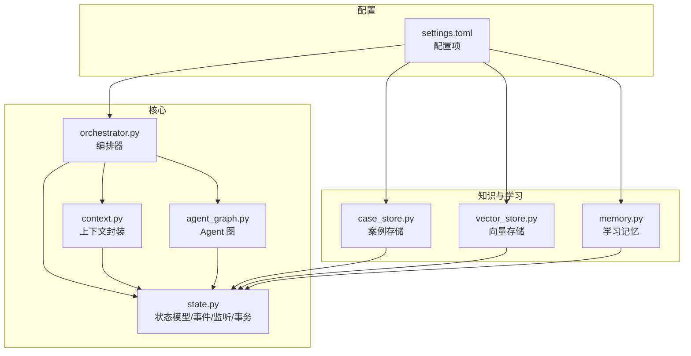
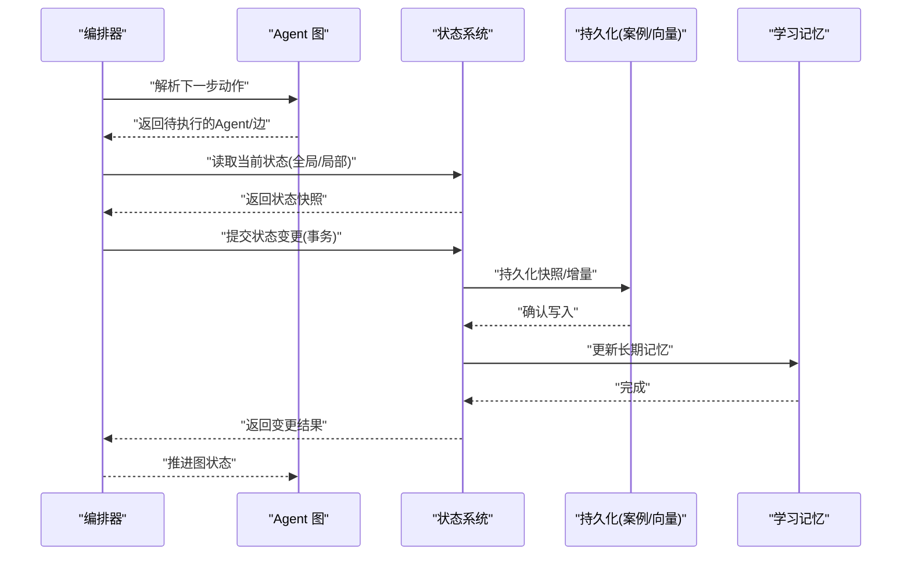
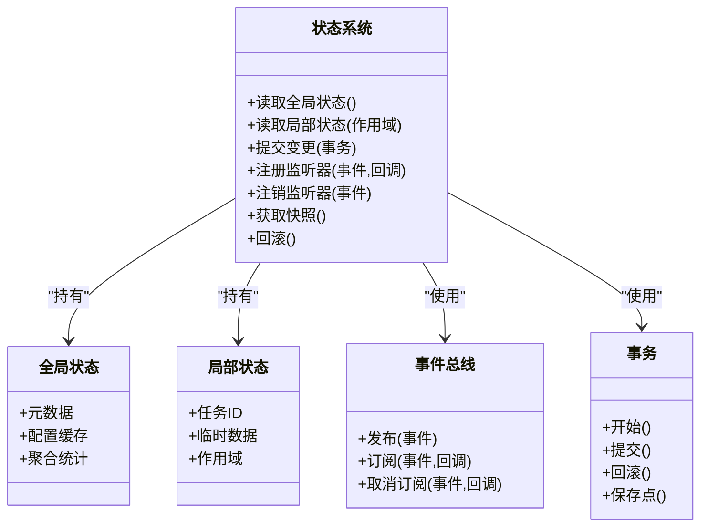
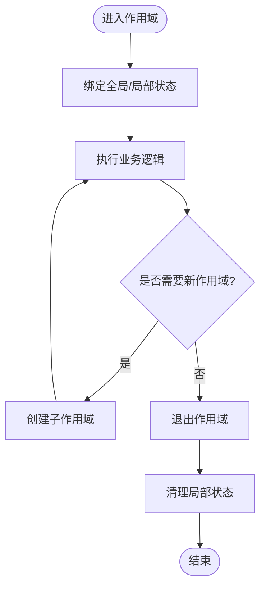
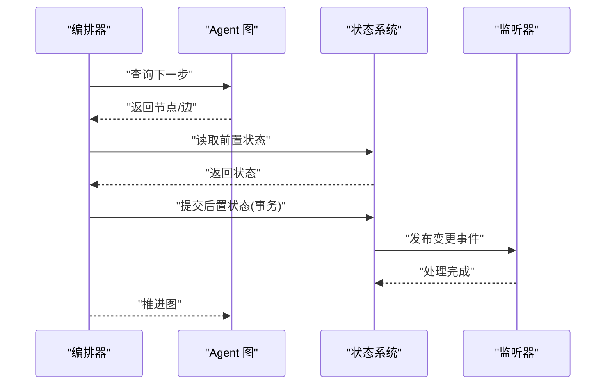
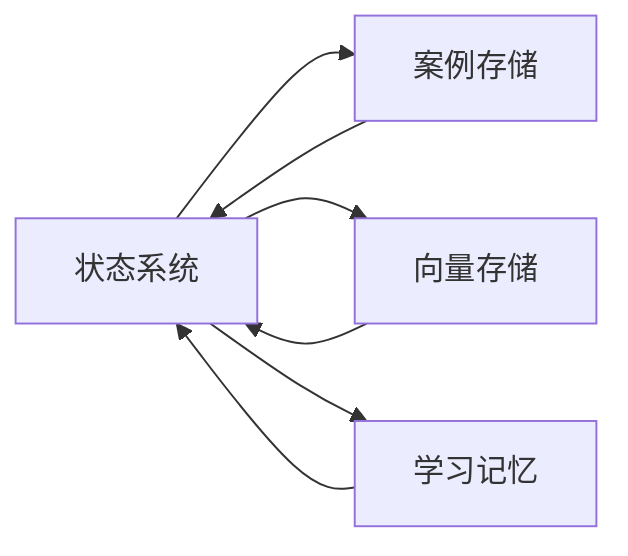
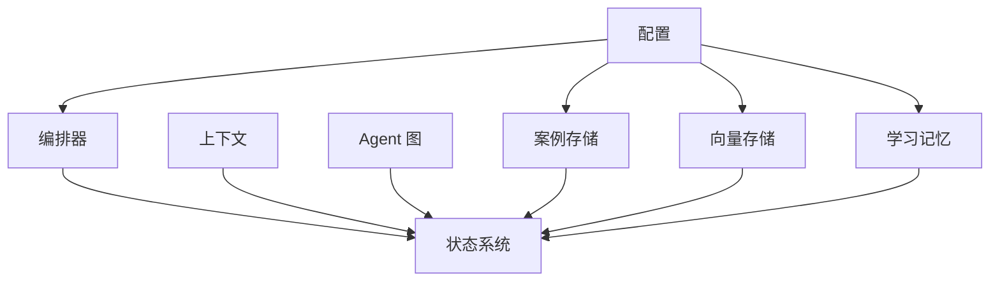

# 状态管理系统

<cite>
**本文引用的文件**   
- [src/jirin/core/state.py](file://src/jirin/core/state.py)
- [src/jirin/core/context.py](file://src/jirin/core/context.py)
- [src/jirin/core/orchestrator.py](file://src/jirin/core/orchestrator.py)
- [src/jirin/core/agent_graph.py](file://src/jirin/core/agent_graph.py)
- [src/jirin/knowledge/case_store.py](file://src/jirin/knowledge/case_store.py)
- [src/jirin/knowledge/vector_store.py](file://src/jirin/knowledge/vector_store.py)
- [src/jirin/learning/memory.py](file://src/jirin/learning/memory.py)
- [config/settings.toml](file://config/settings.toml)
</cite>

## 目录
1. [简介](#简介)
2. [项目结构](#项目结构)
3. [核心组件](#核心组件)
4. [架构总览](#架构总览)
5. [详细组件分析](#详细组件分析)
6. [依赖关系分析](#依赖关系分析)
7. [性能考虑](#性能考虑)
8. [故障排查指南](#故障排查指南)
9. [结论](#结论)
10. [附录](#附录)

## 简介
本技术文档聚焦于 Jirin 的状态管理系统，围绕全局状态与局部状态的设计模式、状态持久化机制、状态变更事件与监听器模式、线程安全与并发访问控制、状态回滚策略、状态迁移与版本兼容、以及状态验证规则进行系统化说明。同时提供状态调试工具的使用方法与性能监控指标建议，帮助开发者在复杂多 Agent 协作场景下稳定地管理状态。

## 项目结构
Jirin 的状态相关代码主要分布在 core 层与知识/学习子系统中：
- core/state.py：定义状态模型、变更事件、监听器、事务与回滚等核心能力
- core/context.py：上下文封装，承载当前执行环境中的状态引用与生命周期
- core/orchestrator.py：编排器，负责调度 Agent 并驱动状态流转
- core/agent_graph.py：Agent 图，描述节点（Agent）与边（状态依赖/触发）的关系
- knowledge/case_store.py 与 knowledge/vector_store.py：案例与向量存储的持久化接口
- learning/memory.py：学习与记忆模块，涉及长期状态的读写与更新
- config/settings.toml：配置项，包含持久化路径、日志级别、重试与超时等

图表来源
- [src/jirin/core/state.py](file://src/jirin/core/state.py)
- [src/jirin/core/context.py](file://src/jirin/core/context.py)
- [src/jirin/core/orchestrator.py](file://src/jirin/core/orchestrator.py)
- [src/jirin/core/agent_graph.py](file://src/jirin/core/agent_graph.py)
- [src/jirin/knowledge/case_store.py](file://src/jirin/knowledge/case_store.py)
- [src/jirin/knowledge/vector_store.py](file://src/jirin/knowledge/vector_store.py)
- [src/jirin/learning/memory.py](file://src/jirin/learning/memory.py)
- [config/settings.toml](file://config/settings.toml)

章节来源
- [src/jirin/core/state.py](file://src/jirin/core/state.py)
- [src/jirin/core/context.py](file://src/jirin/core/context.py)
- [src/jirin/core/orchestrator.py](file://src/jirin/core/orchestrator.py)
- [src/jirin/core/agent_graph.py](file://src/jirin/core/agent_graph.py)
- [src/jirin/knowledge/case_store.py](file://src/jirin/knowledge/case_store.py)
- [src/jirin/knowledge/vector_store.py](file://src/jirin/knowledge/vector_store.py)
- [src/jirin/learning/memory.py](file://src/jirin/learning/memory.py)
- [config/settings.toml](file://config/settings.toml)

## 核心组件
- 状态模型与变更事件
  - 定义全局状态与局部状态的数据结构，支持增量变更与快照
  - 通过事件总线发布状态变更事件，供监听器订阅处理
- 监听器模式
  - 支持注册/注销监听器，按事件类型分发回调
  - 可配置同步或异步派发，避免阻塞主流程
- 事务与回滚
  - 提供原子性状态变更边界，失败时自动回滚至最近一致快照
  - 支持嵌套事务与保存点
- 上下文封装
  - 将当前任务/会话的全局状态与局部状态注入到执行上下文中
  - 提供作用域隔离，确保并发下的可见性与一致性
- 编排器与 Agent 图
  - 编排器基于 Agent 图驱动状态机流转，协调各 Agent 对状态的读写
  - 在关键节点前后插入状态校验与审计钩子

章节来源
- [src/jirin/core/state.py](file://src/jirin/core/state.py)
- [src/jirin/core/context.py](file://src/jirin/core/context.py)
- [src/jirin/core/orchestrator.py](file://src/jirin/core/orchestrator.py)
- [src/jirin/core/agent_graph.py](file://src/jirin/core/agent_graph.py)

## 架构总览
下图展示了从编排器到状态系统、再到持久化与学习的整体交互。

图表来源
- [src/jirin/core/orchestrator.py](file://src/jirin/core/orchestrator.py)
- [src/jirin/core/agent_graph.py](file://src/jirin/core/agent_graph.py)
- [src/jirin/core/state.py](file://src/jirin/core/state.py)
- [src/jirin/knowledge/case_store.py](file://src/jirin/knowledge/case_store.py)
- [src/jirin/knowledge/vector_store.py](file://src/jirin/knowledge/vector_store.py)
- [src/jirin/learning/memory.py](file://src/jirin/learning/memory.py)

## 详细组件分析

### 状态系统与事件监听器
- 设计要点
  - 全局状态：跨会话/任务共享的核心数据，如运行元信息、聚合统计、配置缓存
  - 局部状态：单次任务或 Agent 执行期间的临时数据，具备作用域隔离
  - 变更事件：每次状态变更后发布事件，携带变更摘要与时间戳
  - 监听器：订阅特定事件类型，实现审计、告警、索引更新等副作用
- 线程安全与并发控制
  - 使用读写锁保护全局状态，读多写少场景优化
  - 局部状态采用不可变快照+合并策略，减少锁竞争
  - 事件派发可选异步队列，避免阻塞状态提交
- 事务与回滚
  - 以事务为单位收集变更，提交前进行一致性校验
  - 失败时回滚至最近有效快照，保证最终一致性
- 状态迁移与版本兼容
  - 为状态模型维护版本号，迁移脚本按版本顺序执行
  - 兼容旧格式：读取时自动升级，写入时输出最新格式
- 状态验证规则
  - 字段级约束（非空、范围、枚举）
  - 业务级约束（依赖关系、不变式）
  - 校验失败即中止事务并抛出明确错误

图表来源
- [src/jirin/core/state.py](file://src/jirin/core/state.py)

章节来源
- [src/jirin/core/state.py](file://src/jirin/core/state.py)

### 上下文封装与作用域隔离
- 职责
  - 在当前执行流中注入全局状态与局部状态
  - 提供作用域隔离，确保并发任务互不干扰
  - 暴露统一的访问接口，屏蔽底层实现细节
- 生命周期
  - 创建上下文时绑定当前任务/会话
  - 退出作用域时清理局部状态与资源
- 与编排器的集成
  - 编排器在进入/退出 Agent 节点时切换上下文
  - 保证每个 Agent 仅看到其作用域内的状态

图表来源
- [src/jirin/core/context.py](file://src/jirin/core/context.py)

章节来源
- [src/jirin/core/context.py](file://src/jirin/core/context.py)

### 编排器与 Agent 图的状态驱动
- 编排器
  - 根据 Agent 图决定下一步动作
  - 在关键节点前后调用状态系统的校验与持久化
- Agent 图
  - 节点表示 Agent，边表示状态依赖或触发条件
  - 支持动态扩展新的 Agent 与边，无需修改核心逻辑
- 状态流转
  - 每步执行后发布状态变更事件
  - 监听器可据此更新外部索引或触发告警

图表来源
- [src/jirin/core/orchestrator.py](file://src/jirin/core/orchestrator.py)
- [src/jirin/core/agent_graph.py](file://src/jirin/core/agent_graph.py)
- [src/jirin/core/state.py](file://src/jirin/core/state.py)

章节来源
- [src/jirin/core/orchestrator.py](file://src/jirin/core/orchestrator.py)
- [src/jirin/core/agent_graph.py](file://src/jirin/core/agent_graph.py)
- [src/jirin/core/state.py](file://src/jirin/core/state.py)

### 持久化与学习记忆
- 案例存储
  - 将关键状态快照与变更序列持久化，用于回溯与复现
  - 支持按任务/会话维度组织数据
- 向量存储
  - 将状态特征向量化，便于检索与相似匹配
  - 与学习模块协同，持续优化检索质量
- 学习记忆
  - 长期状态更新与压缩，保留关键经验
  - 提供增量更新与冲突解决策略

图表来源
- [src/jirin/knowledge/case_store.py](file://src/jirin/knowledge/case_store.py)
- [src/jirin/knowledge/vector_store.py](file://src/jirin/knowledge/vector_store.py)
- [src/jirin/learning/memory.py](file://src/jirin/learning/memory.py)
- [src/jirin/core/state.py](file://src/jirin/core/state.py)

章节来源
- [src/jirin/knowledge/case_store.py](file://src/jirin/knowledge/case_store.py)
- [src/jirin/knowledge/vector_store.py](file://src/jirin/knowledge/vector_store.py)
- [src/jirin/learning/memory.py](file://src/jirin/learning/memory.py)
- [src/jirin/core/state.py](file://src/jirin/core/state.py)

## 依赖关系分析
- 耦合与内聚
  - 状态系统为核心，被编排器、上下文、持久化与学习模块共同依赖
  - 事件总线解耦了状态变更与副作用处理，提升内聚性
- 外部依赖
  - 配置中心提供持久化路径、重试策略、日志级别等
  - 文件系统或对象存储作为案例与向量数据的后端
- 潜在循环依赖
  - 通过事件与接口抽象避免直接循环依赖
  - 若出现循环，应引入中间层或重构为事件驱动

图表来源
- [src/jirin/core/orchestrator.py](file://src/jirin/core/orchestrator.py)
- [src/jirin/core/context.py](file://src/jirin/core/context.py)
- [src/jirin/core/agent_graph.py](file://src/jirin/core/agent_graph.py)
- [src/jirin/core/state.py](file://src/jirin/core/state.py)
- [src/jirin/knowledge/case_store.py](file://src/jirin/knowledge/case_store.py)
- [src/jirin/knowledge/vector_store.py](file://src/jirin/knowledge/vector_store.py)
- [src/jirin/learning/memory.py](file://src/jirin/learning/memory.py)
- [config/settings.toml](file://config/settings.toml)

章节来源
- [src/jirin/core/orchestrator.py](file://src/jirin/core/orchestrator.py)
- [src/jirin/core/context.py](file://src/jirin/core/context.py)
- [src/jirin/core/agent_graph.py](file://src/jirin/core/agent_graph.py)
- [src/jirin/core/state.py](file://src/jirin/core/state.py)
- [src/jirin/knowledge/case_store.py](file://src/jirin/knowledge/case_store.py)
- [src/jirin/knowledge/vector_store.py](file://src/jirin/knowledge/vector_store.py)
- [src/jirin/learning/memory.py](file://src/jirin/learning/memory.py)
- [config/settings.toml](file://config/settings.toml)

## 性能考虑
- 读写分离与批量操作
  - 读多写少场景优先使用只读快照
  - 批量提交减少锁竞争与 I/O 次数
- 异步事件派发
  - 将审计、索引更新等副作用放入异步队列
- 内存与磁盘平衡
  - 合理设置快照频率与增量大小
  - 定期归档历史快照，释放空间
- 监控指标建议
  - 状态提交延迟、事件派发耗时、持久化吞吐
  - 锁等待时长、事务回滚率、监听器处理失败率

[本节为通用指导，不直接分析具体文件]

## 故障排查指南
- 常见问题定位
  - 状态不一致：检查事务边界与回滚路径，确认校验规则是否生效
  - 事件丢失：确认事件队列容量与消费者健康度
  - 持久化失败：查看存储后端连接与权限，核对配置项
- 调试工具
  - 启用状态变更审计日志，记录事件与快照差异
  - 提供状态导出命令，便于离线分析
  - 可视化回放最近 N 次事务，辅助定位问题
- 恢复策略
  - 基于最近有效快照重建状态
  - 重放必要的事件序列，达到目标一致性

章节来源
- [src/jirin/core/state.py](file://src/jirin/core/state.py)
- [src/jirin/core/orchestrator.py](file://src/jirin/core/orchestrator.py)
- [config/settings.toml](file://config/settings.toml)

## 结论
Jirin 的状态管理系统以状态模型、事件监听器、事务与回滚为核心，结合上下文作用域隔离与编排器驱动，实现了高内聚、低耦合且可扩展的状态管理能力。通过完善的迁移与验证机制、可靠的持久化与学习记忆，系统在复杂多 Agent 协作场景中保持了稳定性与可观测性。建议在生产环境中配合监控与调试工具，持续优化性能与可靠性。

[本节为总结性内容，不直接分析具体文件]

## 附录
- 术语表
  - 全局状态：跨任务/会话共享的核心数据
  - 局部状态：单次任务或 Agent 执行期间的临时数据
  - 事务：原子性状态变更边界
  - 监听器：订阅状态变更事件的回调处理器
- 最佳实践
  - 明确作用域边界，避免不必要的状态共享
  - 使用事务包裹关键变更，确保一致性
  - 为重要状态变更编写迁移脚本与测试用例
  - 开启审计日志与监控指标，建立可观测性

[本节为补充信息，不直接分析具体文件]