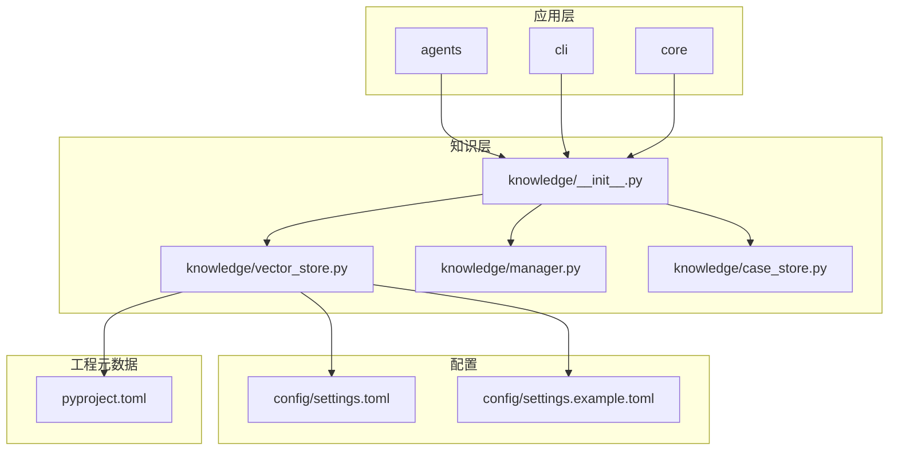
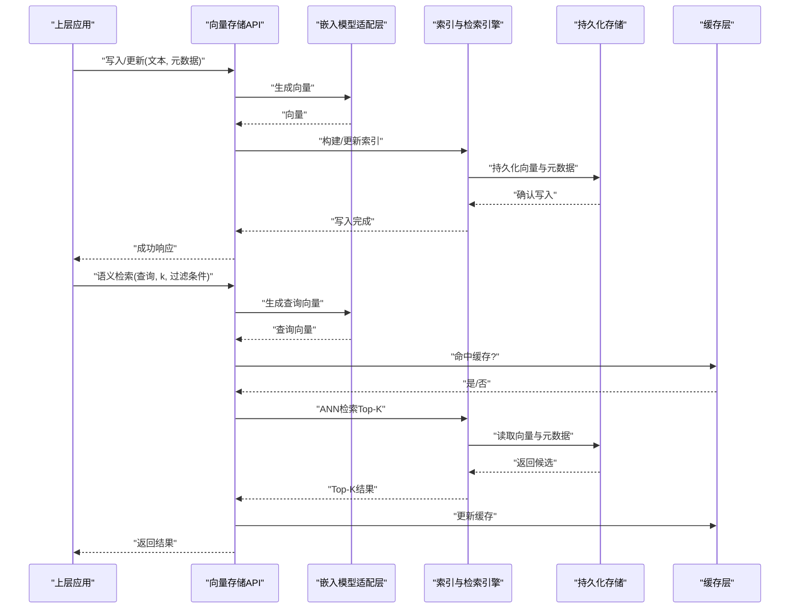
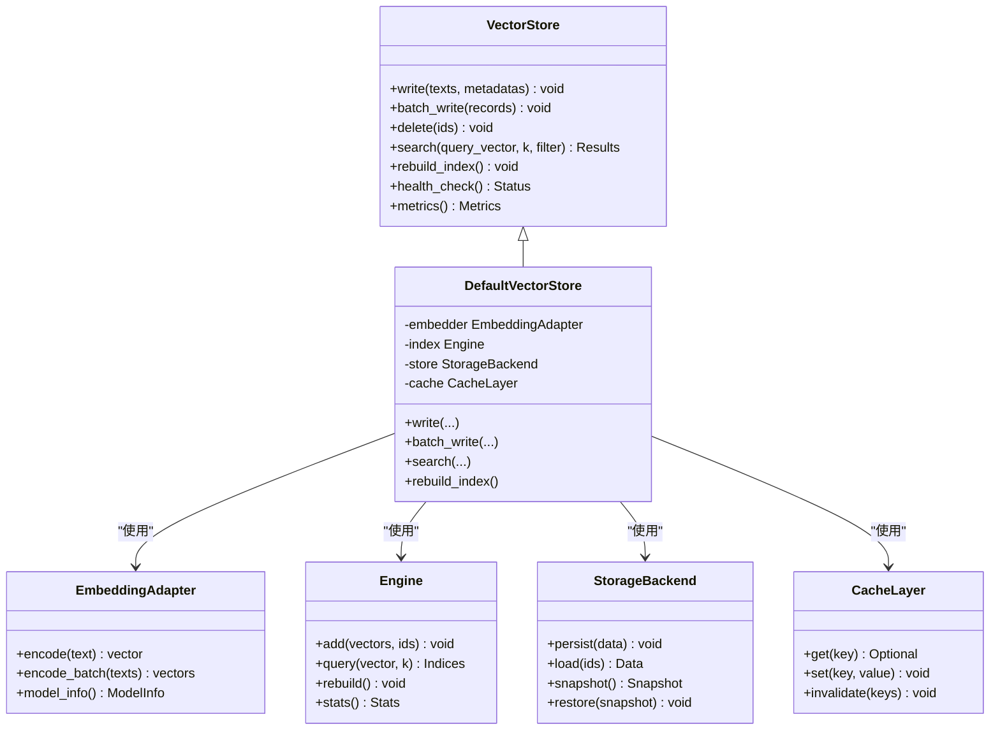
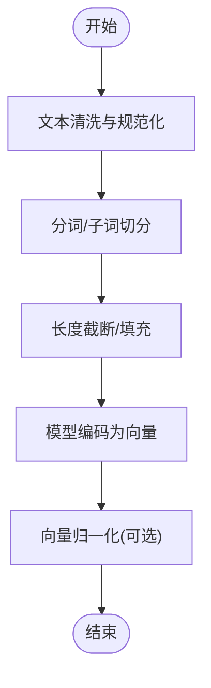
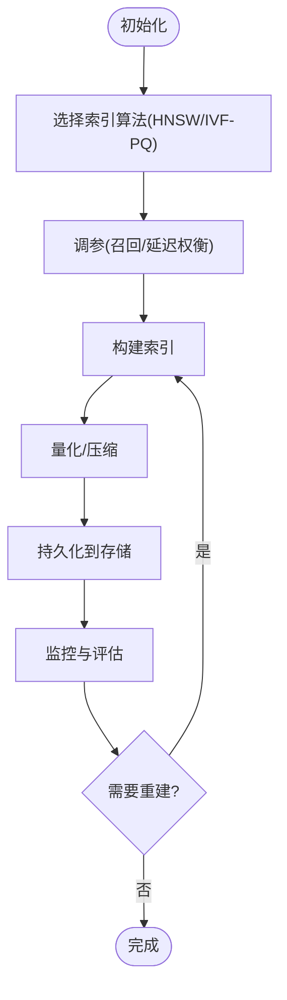
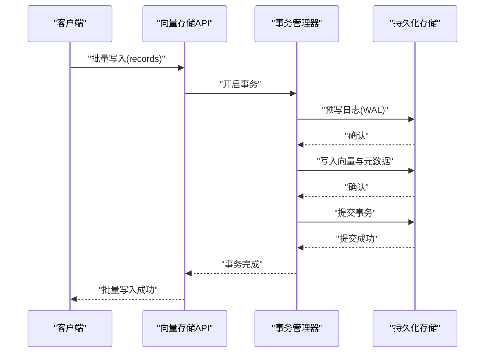
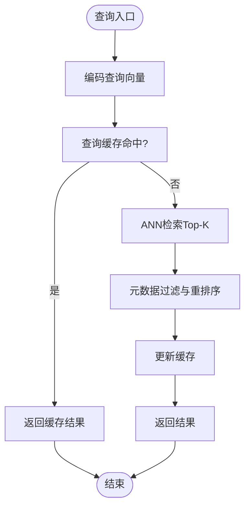
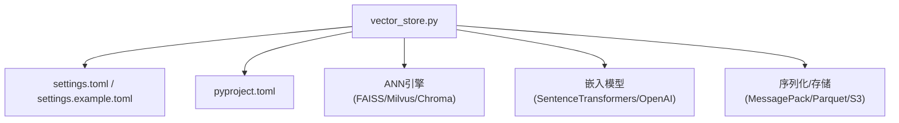

# 向量存储

<cite>
**本文引用的文件**   
- [src/jirin/knowledge/vector_store.py](file://src/jirin/knowledge/vector_store.py)
- [config/settings.toml](file://config/settings.toml)
- [config/settings.example.toml](file://config/settings.example.toml)
- [pyproject.toml](file://pyproject.toml)
</cite>

## 目录
1. [简介](#简介)
2. [项目结构](#项目结构)
3. [核心组件](#核心组件)
4. [架构总览](#架构总览)
5. [详细组件分析](#详细组件分析)
6. [依赖分析](#依赖分析)
7. [性能考虑](#性能考虑)
8. [故障排查指南](#故障排查指南)
9. [结论](#结论)
10. [附录](#附录)

## 简介
本技术文档围绕 Jirin 的向量存储系统，系统性阐述其架构设计、嵌入模型选择与相似度计算算法、向量的生成与索引构建、存储优化与检索策略；并覆盖配置参数、连接池管理、批量操作与事务处理、语义搜索实现原理、查询优化与性能调优、数据持久化/备份恢复/迁移方案、内存使用优化、缓存策略与并发访问控制机制。文档旨在帮助开发者快速理解并高效扩展该子系统。

## 项目结构
Jirin 的向量存储相关代码位于 knowledge 模块下，配置文件集中于 config 目录，依赖声明在 pyproject.toml 中。整体组织遵循“按功能域划分”的结构：knowledge 负责知识管理与向量存储，config 提供运行时配置，core 与 agents 等上层模块通过接口调用向量存储能力。

图表来源
- [src/jirin/knowledge/vector_store.py](file://src/jirin/knowledge/vector_store.py)
- [config/settings.toml](file://config/settings.toml)
- [config/settings.example.toml](file://config/settings.example.toml)
- [pyproject.toml](file://pyproject.toml)

章节来源
- [src/jirin/knowledge/vector_store.py](file://src/jirin/knowledge/vector_store.py)
- [config/settings.toml](file://config/settings.toml)
- [config/settings.example.toml](file://config/settings.example.toml)
- [pyproject.toml](file://pyproject.toml)

## 核心组件
- 向量存储抽象与实现
  - 定义统一的向量存储接口（增删改查、批量写入、近似最近邻检索、元数据过滤、索引重建等）。
  - 提供默认实现（如基于本地磁盘或内存的轻量后端），并支持可扩展的后端替换。
- 嵌入模型适配层
  - 封装文本到向量的转换逻辑，支持多种嵌入模型（本地模型或远程服务），并提供模型切换与降级策略。
- 相似度计算与检索引擎
  - 内置常用相似度度量（余弦相似度、内积等）与近似最近邻检索（ANN）策略（如 HNSW、IVF-PQ 等可选）。
- 配置与连接管理
  - 从配置中心加载向量库连接参数、维度、距离函数、索引参数、批大小、超时与重试策略等。
  - 维护连接池与资源生命周期，确保高并发下的稳定性。
- 持久化与事务
  - 提供原子写入与回滚能力，保证批量操作的 ACID 特性；支持快照与增量日志用于恢复。
- 缓存与内存优化
  - 对热点向量与结果集进行多级缓存（进程内 LRU + 可选外部缓存），降低重复计算与 IO 开销。
- 监控与可观测性
  - 暴露关键指标（延迟、吞吐、命中率、错误率、内存占用、索引大小等），便于定位瓶颈。

章节来源
- [src/jirin/knowledge/vector_store.py](file://src/jirin/knowledge/vector_store.py)
- [config/settings.toml](file://config/settings.toml)
- [config/settings.example.toml](file://config/settings.example.toml)
- [pyproject.toml](file://pyproject.toml)

## 架构总览
下图展示了 Jirin 向量存储系统的端到端流程：上层业务通过统一接口提交文本，嵌入模型将其转换为向量，随后写入索引并持久化；检索时，查询文本同样被嵌入为向量，经相似度计算返回 Top-K 结果，并结合元数据进行二次过滤与排序。

图表来源
- [src/jirin/knowledge/vector_store.py](file://src/jirin/knowledge/vector_store.py)
- [config/settings.toml](file://config/settings.toml)
- [config/settings.example.toml](file://config/settings.example.toml)

## 详细组件分析

### 向量存储接口与实现
- 职责边界
  - 对外暴露一致的读写与检索接口，屏蔽底层存储差异。
  - 内部协调嵌入模型、索引引擎、持久化与缓存。
- 关键能力
  - 单条/批量写入、删除、更新；近似最近邻检索；元数据过滤；索引重建与压缩；健康检查与统计信息导出。
- 扩展点
  - 通过插件式后端接入不同向量数据库（如 Milvus、Chroma、FAISS 等），仅需实现统一接口契约。

图表来源
- [src/jirin/knowledge/vector_store.py](file://src/jirin/knowledge/vector_store.py)

章节来源
- [src/jirin/knowledge/vector_store.py](file://src/jirin/knowledge/vector_store.py)

### 嵌入模型选择与相似度计算
- 模型选择原则
  - 根据任务领域与精度需求选择合适模型；优先选择开源、可本地部署的模型以降低延迟与成本。
  - 支持多模型热切换与降级（例如主模型不可用时回退至轻量模型）。
- 相似度度量
  - 默认采用余弦相似度；在高维稀疏场景可考虑内积或归一化后的欧氏距离。
  - 针对 ANN 引擎，选择合适的距离函数以匹配索引类型。
- 预处理与标准化
  - 文本清洗、分词/子词切分、长度截断与填充；向量归一化以提升相似度稳定性。

图表来源
- [src/jirin/knowledge/vector_store.py](file://src/jirin/knowledge/vector_store.py)

章节来源
- [src/jirin/knowledge/vector_store.py](file://src/jirin/knowledge/vector_store.py)

### 索引构建与存储优化
- 索引策略
  - 平衡召回率与延迟：HNSW 适合低延迟高召回；IVF-PQ 适合大规模高维数据的压缩与检索。
  - 动态调整索引参数（M、efConstruction、nlist、nprobe 等）以适应数据规模与查询负载。
- 存储优化
  - 向量量化（PQ/OPQ）、稀疏表示、列式存储与压缩；冷热分层存储（热数据内存/SSD，冷数据对象存储）。
  - 定期合并与碎片整理，减少索引膨胀。
- 元数据索引
  - 对高频过滤字段建立倒排或位图索引，加速条件筛选。

图表来源
- [src/jirin/knowledge/vector_store.py](file://src/jirin/knowledge/vector_store.py)

章节来源
- [src/jirin/knowledge/vector_store.py](file://src/jirin/knowledge/vector_store.py)

### 配置参数与连接池管理
- 配置项要点
  - 连接参数：后端地址、认证、超时、重试次数。
  - 索引参数：算法、维度、距离函数、M/ef/nlist/nprobe 等。
  - 批处理：批量大小、写入并发度、落盘阈值。
  - 缓存：容量、过期时间、淘汰策略。
  - 监控：指标采集频率、采样率、告警阈值。
- 连接池
  - 最小/最大连接数、空闲回收、心跳检测、失败转移与熔断。
  - 读写分离与只读副本（若后端支持）。

章节来源
- [config/settings.toml](file://config/settings.toml)
- [config/settings.example.toml](file://config/settings.example.toml)

### 批量操作与事务处理
- 批量写入
  - 将多条记录打包为批次，利用并行写入提升吞吐；失败重试与幂等键避免重复。
- 事务与一致性
  - 提供事务边界：同一批次内要么全部成功，要么全部回滚；支持快照与增量日志用于崩溃恢复。
  - 跨节点一致性（分布式场景）采用两阶段提交或最终一致性补偿。

图表来源
- [src/jirin/knowledge/vector_store.py](file://src/jirin/knowledge/vector_store.py)

章节来源
- [src/jirin/knowledge/vector_store.py](file://src/jirin/knowledge/vector_store.py)

### 语义搜索实现原理与查询优化
- 实现原理
  - 查询文本经嵌入模型转为向量，使用 ANN 引擎检索 Top-K 相似向量，再结合元数据过滤与重排序。
- 查询优化
  - 查询缓存：对常见查询向量与结果进行缓存，缩短延迟。
  - 预取与分页：按需拉取元数据，避免一次性加载全量。
  - 过滤下推：将过滤条件尽可能下推到存储层，减少网络与计算开销。
  - 自适应 k：根据业务场景动态调整 k 值，平衡召回与性能。

图表来源
- [src/jirin/knowledge/vector_store.py](file://src/jirin/knowledge/vector_store.py)

章节来源
- [src/jirin/knowledge/vector_store.py](file://src/jirin/knowledge/vector_store.py)

### 持久化、备份恢复与数据迁移
- 持久化
  - 向量与元数据分别落盘，采用列式存储与压缩格式；WAL 保障崩溃恢复。
- 备份与恢复
  - 全量快照 + 增量日志；支持在线快照与离线归档；恢复时先回放 WAL 再加载快照。
- 数据迁移
  - 版本化 schema；灰度迁移与双写校验；迁移工具提供校验与回滚能力。

章节来源
- [src/jirin/knowledge/vector_store.py](file://src/jirin/knowledge/vector_store.py)

### 内存使用优化、缓存策略与并发控制
- 内存优化
  - 流式处理大文件；惰性加载与分页；向量量化与稀疏化；对象池复用临时缓冲区。
- 缓存策略
  - 多级缓存：进程内 LRU + 共享缓存（Redis/Memcached）；热点键常驻，冷数据自动淘汰。
- 并发控制
  - 读写锁与无锁队列；背压与限流；隔离不同租户/任务的资源配额。

章节来源
- [src/jirin/knowledge/vector_store.py](file://src/jirin/knowledge/vector_store.py)

## 依赖分析
- 外部依赖
  - 向量数据库/ANN 引擎：Milvus、Chroma、FAISS 等（具体取决于后端实现）。
  - 嵌入模型：SentenceTransformers、OpenAI Embeddings、本地 ONNX/TensorRT 推理等。
  - 序列化与存储：MessagePack/Parquet、对象存储（S3/OSS）、本地文件系统。
- 内部依赖
  - knowledge 模块内的 manager 与 case_store 通过统一接口调用向量存储。
  - 配置由 settings.toml 与示例配置驱动，pyproject.toml 声明运行期依赖。

图表来源
- [src/jirin/knowledge/vector_store.py](file://src/jirin/knowledge/vector_store.py)
- [config/settings.toml](file://config/settings.toml)
- [config/settings.example.toml](file://config/settings.example.toml)
- [pyproject.toml](file://pyproject.toml)

章节来源
- [src/jirin/knowledge/vector_store.py](file://src/jirin/knowledge/vector_store.py)
- [config/settings.toml](file://config/settings.toml)
- [config/settings.example.toml](file://config/settings.example.toml)
- [pyproject.toml](file://pyproject.toml)

## 性能考虑
- 索引与检索
  - 合理设置 ef/nprobe 等参数，在召回率与延迟间取得平衡；对热点集合单独建索引。
- 批处理与并发
  - 增大批大小与并发度需结合后端吞吐上限与资源水位，避免 OOM 与抖动。
- 缓存命中率
  - 提高查询去重与结果复用，降低重复编码与检索开销。
- 监控与调优
  - 关注 P95/P99 延迟、吞吐、错误率、缓存命中率、索引大小与增长速率；基于指标持续迭代参数。

[本节为通用指导，不直接分析具体文件]

## 故障排查指南
- 常见问题
  - 连接失败：检查后端地址、认证、防火墙与超时配置；启用重试与熔断。
  - 索引异常：验证维度与数据类型；重建索引并观察错误日志。
  - 检索质量差：调整相似度度量与 ANN 参数；增加训练/校准样本。
  - 内存溢出：减小批大小、启用量化与分页；监控峰值内存。
- 诊断手段
  - 启用详细日志与指标采集；导出快照与 WAL 进行分析；对比不同参数的基准测试结果。

章节来源
- [src/jirin/knowledge/vector_store.py](file://src/jirin/knowledge/vector_store.py)

## 结论
Jirin 的向量存储系统以统一接口为核心，整合嵌入模型、ANN 索引、持久化与缓存，形成高可用、可扩展的语义检索基础设施。通过合理的配置与参数调优，可在不同规模与负载下获得稳定的召回与延迟表现。建议在生产环境完善监控与告警，并定期进行索引重建与数据迁移演练，确保系统长期稳健运行。

[本节为总结性内容，不直接分析具体文件]

## 附录
- 配置参考
  - 连接与超时、索引与检索参数、批处理与并发、缓存与监控等均可在配置文件中集中管理。
- 最佳实践
  - 小步快跑地迭代索引与检索参数；对热点数据做专项优化；保持模型与索引版本的灰度发布与回滚能力。

章节来源
- [config/settings.toml](file://config/settings.toml)
- [config/settings.example.toml](file://config/settings.example.toml)
- [pyproject.toml](file://pyproject.toml)