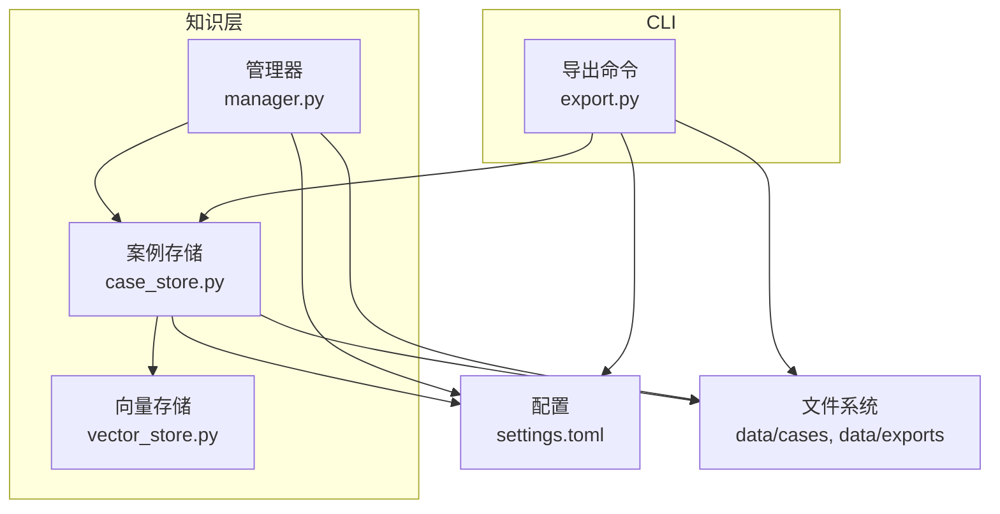
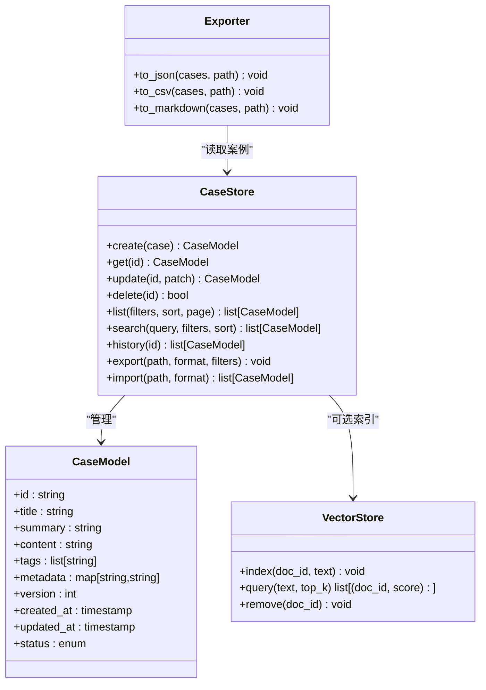
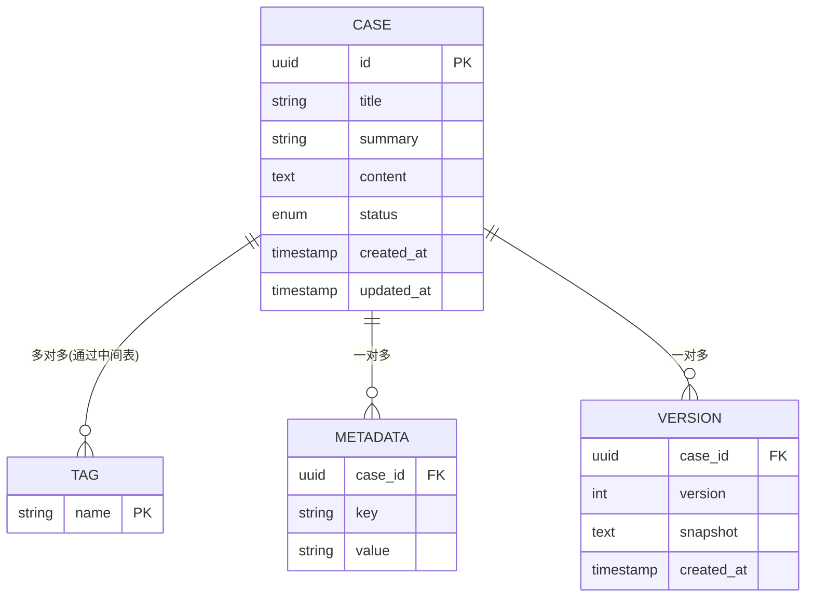
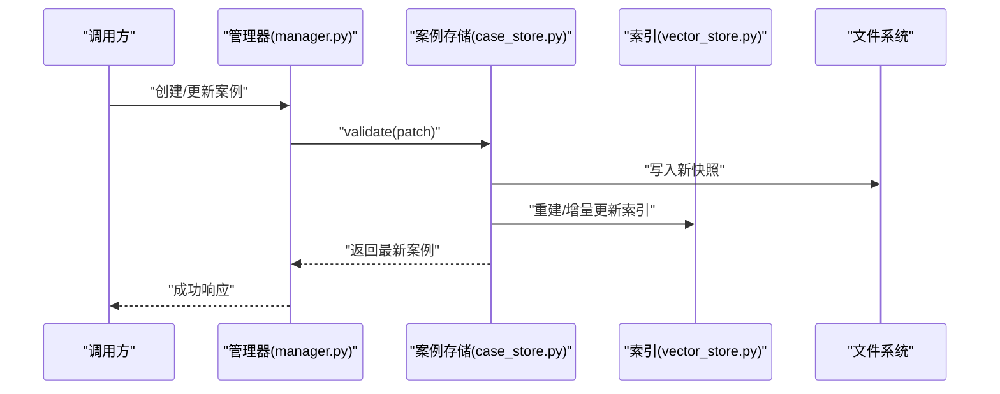
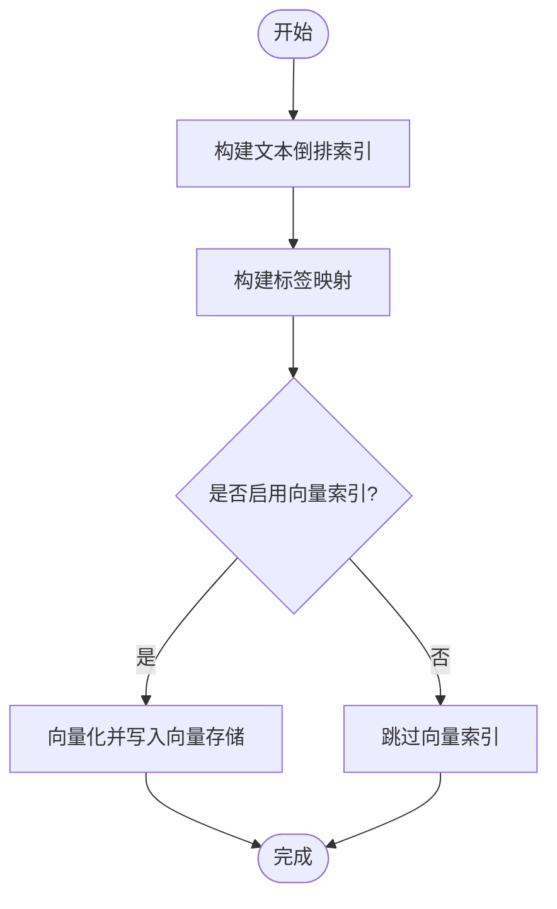
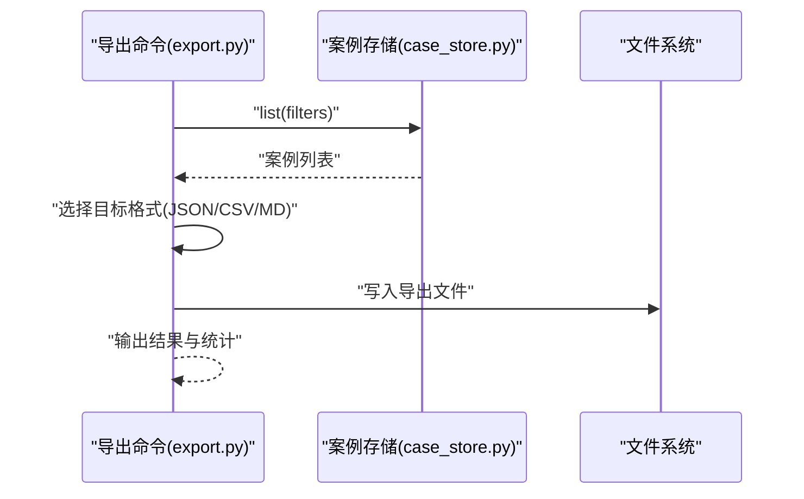
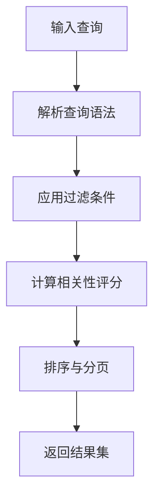
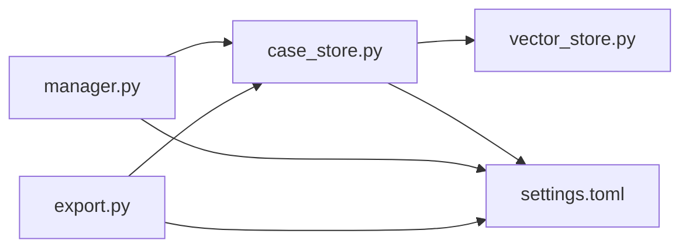

# 案例存储

<cite>
**本文引用的文件**   
- [case_store.py](file://src/jirin/knowledge/case_store.py)
- [manager.py](file://src/jirin/knowledge/manager.py)
- [vector_store.py](file://src/jirin/knowledge/vector_store.py)
- [export.py](file://src/jirin/cli/commands/export.py)
- [settings.toml](file://config/settings.toml)
</cite>

## 目录
1. [简介](#简介)
2. [项目结构](#项目结构)
3. [核心组件](#核心组件)
4. [架构总览](#架构总览)
5. [详细组件分析](#详细组件分析)
6. [依赖关系分析](#依赖关系分析)
7. [性能考虑](#性能考虑)
8. [故障排查指南](#故障排查指南)
9. [结论](#结论)
10. [附录](#附录)

## 简介
本技术文档围绕 Jirin 的案例存储系统，系统性阐述案例数据模型设计、字段定义与关系映射；说明案例的增删改查（CRUD）、版本控制与历史追踪机制；覆盖分类标签、元数据管理与索引策略；提供导入导出、批量操作与格式转换能力；详述持久化方案、数据压缩与存储空间优化；并给出高级检索语法、过滤条件与排序规则。同时，文档对数据完整性校验、冲突解决与一致性保证进行说明，帮助读者全面理解与高效使用案例存储子系统。

## 项目结构
案例存储相关代码主要位于 knowledge 模块与 CLI export 命令中，配置项集中于 settings.toml。整体组织遵循“领域模块 + 工具层 + 配置”的分层方式：
- knowledge/case_store.py：案例存储核心实现，包含模型定义、CRUD、版本与历史、索引与查询等
- knowledge/manager.py：高层编排与用例入口，协调 case_store 与外部服务
- knowledge/vector_store.py：向量检索与相似度搜索支持
- cli/commands/export.py：导出命令实现，负责导出流程与格式转换
- config/settings.toml：运行时配置（如路径、存储后端、压缩开关等）

图表来源
- [case_store.py](file://src/jirin/knowledge/case_store.py)
- [manager.py](file://src/jirin/knowledge/manager.py)
- [vector_store.py](file://src/jirin/knowledge/vector_store.py)
- [export.py](file://src/jirin/cli/commands/export.py)
- [settings.toml](file://config/settings.toml)

章节来源
- [case_store.py](file://src/jirin/knowledge/case_store.py)
- [manager.py](file://src/jirin/knowledge/manager.py)
- [vector_store.py](file://src/jirin/knowledge/vector_store.py)
- [export.py](file://src/jirin/cli/commands/export.py)
- [settings.toml](file://config/settings.toml)

## 核心组件
- 案例模型与元数据：定义案例的核心字段、分类标签、时间戳、版本标识、摘要与内容等，并提供序列化/反序列化能力
- 版本与历史：基于版本号或快照记录变更，保留历史版本以便回溯与对比
- 索引与检索：提供全文检索、标签过滤、时间范围筛选、排序与分页；可选向量相似度检索
- CRUD 与事务：提供创建、读取、更新、删除接口，确保原子性与一致性
- 导入导出：支持多格式导出（如 JSON、CSV、Markdown 等），并可按条件批量导出
- 配置与持久化：通过配置文件指定存储路径、压缩策略、索引类型等

章节来源
- [case_store.py](file://src/jirin/knowledge/case_store.py)
- [manager.py](file://src/jirin/knowledge/manager.py)
- [vector_store.py](file://src/jirin/knowledge/vector_store.py)
- [export.py](file://src/jirin/cli/commands/export.py)
- [settings.toml](file://config/settings.toml)

## 架构总览
案例存储采用“领域模型 + 存储引擎 + 检索索引 + 导出管道”的分层架构。上层由 manager 编排业务流，case_store 封装领域逻辑与持久化细节，vector_store 提供语义检索能力，export 命令负责将内部模型转换为外部格式。

图表来源
- [case_store.py](file://src/jirin/knowledge/case_store.py)
- [vector_store.py](file://src/jirin/knowledge/vector_store.py)
- [export.py](file://src/jirin/cli/commands/export.py)

## 详细组件分析

### 案例数据模型与关系映射
- 主键与唯一性：每个案例具备全局唯一 ID，用于定位与关联
- 基础字段：标题、摘要、正文内容、状态、时间戳（创建/更新）
- 分类与标签：支持多标签分类，便于快速筛选与聚合
- 元数据：扩展键值对，用于存储额外上下文信息（如来源、环境、关联问题编号等）
- 版本与历史：每次更新生成新版本号，历史版本以快照形式保存，支持回滚与差异对比
- 关系映射：案例可与其他实体（如日志片段、堆栈、复现步骤）建立引用关系，通常通过外键或 URI 引用

图表来源
- [case_store.py](file://src/jirin/knowledge/case_store.py)

章节来源
- [case_store.py](file://src/jirin/knowledge/case_store.py)

### 案例的 CRUD 与版本控制
- 创建：生成唯一 ID、初始化时间戳与默认状态，写入存储并构建索引
- 读取：按 ID 获取最新版本，或指定版本快照
- 更新：应用补丁，递增版本号，追加历史快照，更新索引
- 删除：软删除标记或物理删除，清理索引与向量索引
- 版本控制：基于不可变快照的版本链，支持分支与合并策略（如需）
- 历史追踪：提供版本列表、差异比较与回滚能力

图表来源
- [manager.py](file://src/jirin/knowledge/manager.py)
- [case_store.py](file://src/jirin/knowledge/case_store.py)
- [vector_store.py](file://src/jirin/knowledge/vector_store.py)

章节来源
- [manager.py](file://src/jirin/knowledge/manager.py)
- [case_store.py](file://src/jirin/knowledge/case_store.py)
- [vector_store.py](file://src/jirin/knowledge/vector_store.py)

### 分类标签、元数据管理与索引策略
- 分类标签：支持多标签，标签集合用于快速过滤与聚合统计
- 元数据：键值对扩展，允许灵活附加上下文信息
- 索引策略：
  - 文本索引：对标题、摘要、正文建立倒排索引，支持关键词匹配与短语搜索
  - 标签索引：维护标签到案例 ID 的映射，加速标签过滤
  - 向量索引：可选，将文本向量化后存入向量存储，支持语义相似度检索
  - 复合索引：组合标签、时间范围、状态等条件提升查询性能

图表来源
- [case_store.py](file://src/jirin/knowledge/case_store.py)
- [vector_store.py](file://src/jirin/knowledge/vector_store.py)

章节来源
- [case_store.py](file://src/jirin/knowledge/case_store.py)
- [vector_store.py](file://src/jirin/knowledge/vector_store.py)

### 导入导出、批量操作与格式转换
- 导出：支持 JSON、CSV、Markdown 等格式，可按过滤器批量导出
- 导入：从外部文件导入案例，自动解析格式并写入存储
- 格式转换：在导出时进行格式转换，适配不同下游系统需求
- 批量操作：支持批量创建、更新与删除，结合事务保证一致性

图表来源
- [export.py](file://src/jirin/cli/commands/export.py)
- [case_store.py](file://src/jirin/knowledge/case_store.py)

章节来源
- [export.py](file://src/jirin/cli/commands/export.py)
- [case_store.py](file://src/jirin/knowledge/case_store.py)

### 持久化方案、数据压缩与存储空间优化
- 持久化：案例快照以结构化文件形式落盘，配合索引文件与向量索引文件
- 压缩：可对大文本内容或历史快照进行压缩存储，降低磁盘占用
- 空间优化：
  - 去重：相同内容的快照仅保留一份，通过引用共享
  - 增量：仅存储变更部分，减少重复数据
  - 归档：冷数据定期归档至低成本存储介质

章节来源
- [case_store.py](file://src/jirin/knowledge/case_store.py)
- [settings.toml](file://config/settings.toml)

### 高级检索语法、过滤条件与排序规则
- 检索语法：支持布尔表达式、通配符、短语匹配与正则（视实现而定）
- 过滤条件：按标签、时间范围、状态、元数据键值等进行过滤
- 排序规则：按更新时间、创建时间、相关性评分、自定义权重排序
- 分页与游标：支持分页与基于游标的翻页，避免深分页性能问题
- 向量检索：结合关键词与语义相似度，提高召回质量

图表来源
- [case_store.py](file://src/jirin/knowledge/case_store.py)
- [vector_store.py](file://src/jirin/knowledge/vector_store.py)

章节来源
- [case_store.py](file://src/jirin/knowledge/case_store.py)
- [vector_store.py](file://src/jirin/knowledge/vector_store.py)

### 数据完整性校验、冲突解决与一致性保证
- 完整性校验：
  - 结构校验：必填字段、类型约束、枚举值检查
  - 内容校验：摘要长度限制、标签唯一性、元数据键合法性
  - 一致性校验：版本链连续性、时间戳单调递增
- 冲突解决：
  - 并发更新：基于乐观锁（版本号）或 CAS 操作，失败重试或提示用户
  - 合并策略：提供字段级合并或拒绝合并的策略
- 一致性保证：
  - 事务边界：导入/导出与批量操作在事务内执行，失败回滚
  - 幂等性：同一请求多次执行不会产生副作用

章节来源
- [case_store.py](file://src/jirin/knowledge/case_store.py)
- [manager.py](file://src/jirin/knowledge/manager.py)

## 依赖关系分析
- 模块耦合：
  - manager 依赖 case_store 提供领域能力
  - case_store 可选依赖 vector_store 进行语义检索
  - export 命令依赖 case_store 读取数据并进行格式转换
- 外部依赖：
  - 文件系统：用于持久化快照与导出文件
  - 配置中心：settings.toml 提供运行时参数

图表来源
- [manager.py](file://src/jirin/knowledge/manager.py)
- [case_store.py](file://src/jirin/knowledge/case_store.py)
- [vector_store.py](file://src/jirin/knowledge/vector_store.py)
- [export.py](file://src/jirin/cli/commands/export.py)
- [settings.toml](file://config/settings.toml)

章节来源
- [manager.py](file://src/jirin/knowledge/manager.py)
- [case_store.py](file://src/jirin/knowledge/case_store.py)
- [vector_store.py](file://src/jirin/knowledge/vector_store.py)
- [export.py](file://src/jirin/cli/commands/export.py)
- [settings.toml](file://config/settings.toml)

## 性能考虑
- 索引构建：首次构建索引耗时较大，建议在低峰期执行或增量更新
- 查询优化：合理使用过滤条件与排序字段，避免全表扫描
- 向量检索：向量化与相似度计算开销较高，建议按需开启与缓存热点查询
- 批量操作：分批提交事务，避免长事务导致锁竞争
- 存储优化：启用压缩与去重，定期归档冷数据

## 故障排查指南
- 常见问题：
  - 索引不一致：重建索引或修复损坏的索引文件
  - 导入失败：检查文件格式与字段约束，查看错误日志定位具体行
  - 导出为空：确认过滤器条件是否正确，检查权限与路径
- 诊断方法：
  - 启用调试日志，记录关键步骤与异常堆栈
  - 校验案例结构与版本链，确认无断裂
  - 检查配置项（路径、压缩开关、索引类型）是否与运行环境一致

章节来源
- [case_store.py](file://src/jirin/knowledge/case_store.py)
- [export.py](file://src/jirin/cli/commands/export.py)
- [settings.toml](file://config/settings.toml)

## 结论
Jirin 的案例存储系统以清晰的领域模型为基础，结合版本控制、历史追踪与多维索引，提供了完整的 CRUD、导入导出与高级检索能力。通过合理的持久化与压缩策略，系统在功能性与性能之间取得平衡。建议在生产环境中启用向量检索与压缩，并结合监控与日志完善运维保障。

## 附录
- 配置项参考（示例）：
  - 存储路径：data/cases、data/exports
  - 压缩开关：启用/禁用
  - 索引类型：倒排索引、向量索引
  - 并发与批大小：影响导入导出与批量操作性能

章节来源
- [settings.toml](file://config/settings.toml)