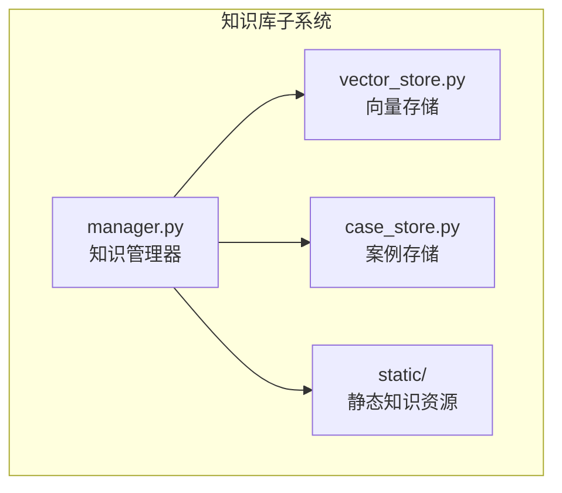
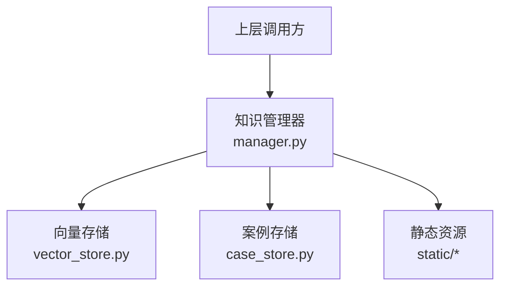
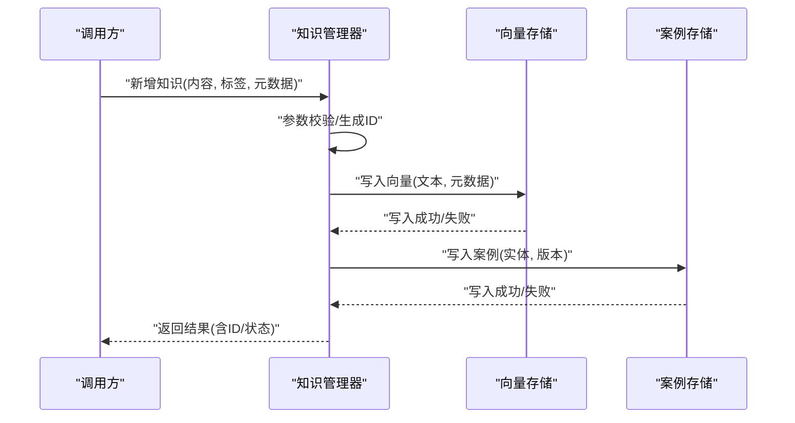
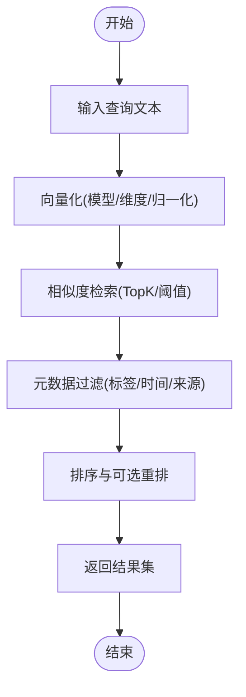
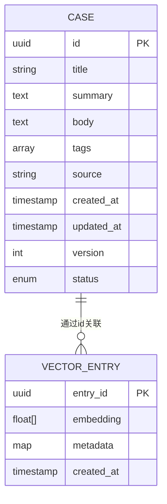
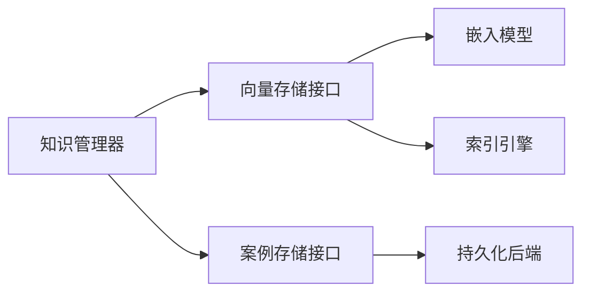

# 知识库管理

<cite>
**本文引用的文件**   
- [src/jirin/knowledge/manager.py](file://src/jirin/knowledge/manager.py)
- [src/jirin/knowledge/vector_store.py](file://src/jirin/knowledge/vector_store.py)
- [src/jirin/knowledge/case_store.py](file://src/jirin/knowledge/case_store.py)
- [config/settings.toml](file://config/settings.toml)
- [config/settings.example.toml](file://config/settings.example.toml)
</cite>

## 目录
1. [简介](#简介)
2. [项目结构](#项目结构)
3. [核心组件](#核心组件)
4. [架构总览](#架构总览)
5. [详细组件分析](#详细组件分析)
6. [依赖关系分析](#依赖关系分析)
7. [性能考虑](#性能考虑)
8. [故障排查指南](#故障排查指南)
9. [结论](#结论)
10. [附录](#附录)

## 简介
本技术文档面向Jirin的知识库管理系统，围绕整体架构、管理器工作流、向量存储的语义检索机制、案例存储的数据模型与持久化策略展开。文档同时覆盖知识的增删改查流程、向量数据库配置与优化、相似度计算算法、索引策略与性能调优，以及备份恢复、迁移升级和监控维护实践，帮助读者快速理解并高效使用知识库子系统。

## 项目结构
知识库子系统位于 src/jirin/knowledge 目录，包含以下关键模块：
- manager.py：知识管理的统一入口，协调向量存储与案例存储，提供对外API（添加、检索、更新、删除等）。
- vector_store.py：封装向量数据库操作，负责文本向量化、相似度检索、索引管理与元数据过滤。
- case_store.py：管理结构化案例数据，定义数据模型并提供持久化能力（如JSON/SQLite等后端）。
- static/：静态知识资源（原则说明、流程图等），供学习或导出使用。

图表来源
- [src/jirin/knowledge/manager.py](file://src/jirin/knowledge/manager.py)
- [src/jirin/knowledge/vector_store.py](file://src/jirin/knowledge/vector_store.py)
- [src/jirin/knowledge/case_store.py](file://src/jirin/knowledge/case_store.py)

章节来源
- [src/jirin/knowledge/manager.py](file://src/jirin/knowledge/manager.py)
- [src/jirin/knowledge/vector_store.py](file://src/jirin/knowledge/vector_store.py)
- [src/jirin/knowledge/case_store.py](file://src/jirin/knowledge/case_store.py)

## 核心组件
- 知识管理器（Knowledge Manager）
  - 职责：统一编排知识的生命周期（新增、检索、更新、删除），聚合向量检索结果与案例信息，提供一致的接口给上层调用。
  - 关键点：参数校验、事务性写入、结果合并与去重、错误处理与日志记录。
- 向量存储（Vector Store）
  - 职责：文本到向量的转换、相似度检索、索引构建与维护、元数据过滤、分页与排序。
  - 关键点：嵌入模型选择、批量写入、索引策略（HNSW/IVF/PQ等）、距离度量（余弦/内积/L2）。
- 案例存储（Case Store）
  - 职责：案例实体的建模、CRUD、版本控制、持久化（本地文件或轻量数据库）。
  - 关键点：模式演进、幂等写入、回滚与一致性保障。

章节来源
- [src/jirin/knowledge/manager.py](file://src/jirin/knowledge/manager.py)
- [src/jirin/knowledge/vector_store.py](file://src/jirin/knowledge/vector_store.py)
- [src/jirin/knowledge/case_store.py](file://src/jirin/knowledge/case_store.py)

## 架构总览
知识库子系统采用“管理器+双存储”的分层架构：管理器作为门面，屏蔽底层差异；向量存储负责语义检索；案例存储负责结构化数据的可靠持久化。

图表来源
- [src/jirin/knowledge/manager.py](file://src/jirin/knowledge/manager.py)
- [src/jirin/knowledge/vector_store.py](file://src/jirin/knowledge/vector_store.py)
- [src/jirin/knowledge/case_store.py](file://src/jirin/knowledge/case_store.py)

## 详细组件分析

### 知识管理器（manager.py）
- 设计要点
  - 统一入口：对外暴露 add_knowledge、search_knowledge、update_knowledge、delete_knowledge 等方法。
  - 组合模式：内部组合向量存储与案例存储实例，按业务需要并行或串行调用。
  - 事务性：对写操作进行原子性包装，失败时回滚已变更的部分。
  - 结果融合：将向量检索的相似片段与案例信息进行关联，返回结构化结果。
- 典型流程
  - 新增知识：校验输入 -> 生成ID/时间戳 -> 写入向量存储 -> 写入案例存储 -> 提交事务。
  - 语义检索：接收查询 -> 向量化 -> 相似度检索 -> 过滤与排序 -> 合并案例上下文 -> 返回TopN。
  - 更新知识：定位条目 -> 增量更新向量与案例 -> 重建必要索引 -> 提交事务。
  - 删除知识：软删除标记 -> 清理向量索引 -> 归档案例 -> 提交事务。

图表来源
- [src/jirin/knowledge/manager.py](file://src/jirin/knowledge/manager.py)
- [src/jirin/knowledge/vector_store.py](file://src/jirin/knowledge/vector_store.py)
- [src/jirin/knowledge/case_store.py](file://src/jirin/knowledge/case_store.py)

章节来源
- [src/jirin/knowledge/manager.py](file://src/jirin/knowledge/manager.py)

### 向量存储（vector_store.py）
- 功能概览
  - 文本向量化：支持多种嵌入模型与批量编码。
  - 相似度检索：支持余弦、内积、L2等距离度量，提供TopK与阈值过滤。
  - 索引管理：支持HNSW、IVF、PQ等索引类型，可配置维度、efConstruction、nlist等。
  - 元数据过滤：在检索阶段按标签、时间范围、来源等进行筛选。
  - 持久化：向量与索引落盘，支持热加载与增量更新。
- 关键参数
  - 嵌入模型：模型名称、维度、归一化开关。
  - 索引策略：索引类型、参数、重建触发条件。
  - 检索策略：TopK、相似度阈值、是否开启重排。
  - 批大小：写入与检索批大小，影响吞吐与延迟。
- 复杂度与性能
  - 写入：O(N·D) 向量化 + O(N·logN) 索引插入（取决于索引类型）。
  - 检索：近似最近邻搜索，通常 O(logN)~O(N^α)，受索引参数与k影响。
  - 内存占用：与向量数量×维度×索引开销相关，需结合硬件容量规划。

图表来源
- [src/jirin/knowledge/vector_store.py](file://src/jirin/knowledge/vector_store.py)

章节来源
- [src/jirin/knowledge/vector_store.py](file://src/jirin/knowledge/vector_store.py)

### 案例存储（case_store.py）
- 数据模型
  - 案例实体：唯一ID、标题、摘要、正文、标签、来源、创建/更新时间、版本、状态。
  - 关联关系：与向量条目通过ID映射，支持一对多（一个案例对应多个片段）。
- 持久化策略
  - 本地文件：JSON/Markdown，适合小规模与可移植场景。
  - 轻量数据库：SQLite，适合中等规模与并发读多写少场景。
  - 事务与幂等：写入前检查存在性，避免重复；失败可重试。
- 版本与回滚
  - 每次更新生成新版本号，保留历史快照。
  - 支持按版本回滚与差异对比。

图表来源
- [src/jirin/knowledge/case_store.py](file://src/jirin/knowledge/case_store.py)

章节来源
- [src/jirin/knowledge/case_store.py](file://src/jirin/knowledge/case_store.py)

## 依赖关系分析
- 组件耦合
  - 管理器对向量存储与案例存储为松耦合组合，便于替换实现与扩展。
  - 向量存储与案例存储之间通过ID解耦，避免直接依赖。
- 外部依赖
  - 嵌入模型：可选择本地或远程服务，需配置端点与认证。
  - 向量数据库：可选FAISS、Milvus、Chroma等，通过抽象接口适配。
  - 持久化后端：文件/SQLite/其他KV存储，通过策略模式切换。

图表来源
- [src/jirin/knowledge/manager.py](file://src/jirin/knowledge/manager.py)
- [src/jirin/knowledge/vector_store.py](file://src/jirin/knowledge/vector_store.py)
- [src/jirin/knowledge/case_store.py](file://src/jirin/knowledge/case_store.py)

章节来源
- [src/jirin/knowledge/manager.py](file://src/jirin/knowledge/manager.py)
- [src/jirin/knowledge/vector_store.py](file://src/jirin/knowledge/vector_store.py)
- [src/jirin/knowledge/case_store.py](file://src/jirin/knowledge/case_store.py)

## 性能考虑
- 向量数据库配置
  - 嵌入维度：根据模型与精度需求选择，维度越高精度越好但内存与计算成本更高。
  - 索引类型：大规模数据优先HNSW（高召回低延迟）或IVF+PQ（压缩节省空间）。
  - 批大小：写入批大小建议与CPU核数匹配，检索批大小根据延迟目标调整。
- 相似度计算
  - 距离度量：余弦适合归一化向量，内积适合未归一化且关注方向，L2适合欧氏空间。
  - 阈值过滤：设置最小相似度阈值减少噪声结果。
- 索引策略
  - efConstruction/nlist/m：根据数据规模与查询量调参，平衡构建时间与检索速度。
  - 增量更新：定期重建索引或在低峰期合并小段索引。
- 缓存与预热
  - 热点查询缓存：对高频查询结果做短期缓存。
  - 索引预热：启动时加载常用索引分区，降低冷启动延迟。
- 监控指标
  - 写入吞吐、检索延迟、命中率、索引大小、内存占用、错误率。

[本节为通用指导，不直接分析具体文件]

## 故障排查指南
- 常见问题
  - 写入失败：检查嵌入模型连接、磁盘空间、权限与事务锁。
  - 检索超时：调整TopK与阈值，检查索引参数与硬件资源。
  - 结果不准：验证文本预处理、嵌入模型选择与归一化设置。
  - 数据不一致：核对向量与案例的ID映射，检查幂等写入逻辑。
- 诊断步骤
  - 查看管理器日志，确认各子步骤状态码与异常堆栈。
  - 单独测试向量存储与案例存储接口，隔离问题域。
  - 使用小样本回归测试，逐步扩大数据规模定位瓶颈。
- 恢复策略
  - 从备份恢复向量索引与案例快照。
  - 对损坏索引执行重建，必要时降级至纯关键词检索。

章节来源
- [src/jirin/knowledge/manager.py](file://src/jirin/knowledge/manager.py)
- [src/jirin/knowledge/vector_store.py](file://src/jirin/knowledge/vector_store.py)
- [src/jirin/knowledge/case_store.py](file://src/jirin/knowledge/case_store.py)

## 结论
Jirin知识库以管理器为核心，结合向量存储与案例存储，形成高可用、可扩展的语义检索体系。通过合理的索引策略、相似度计算与持久化方案，可在不同规模下取得良好的检索效果与性能表现。配合完善的监控与运维实践，可实现稳定运行与持续演进。

[本节为总结性内容，不直接分析具体文件]

## 附录

### 配置参考
- settings.toml 与 settings.example.toml 提供默认配置项示例，包括嵌入模型、向量存储、案例存储路径与索引参数等。部署时请根据实际环境调整。

章节来源
- [config/settings.toml](file://config/settings.toml)
- [config/settings.example.toml](file://config/settings.example.toml)