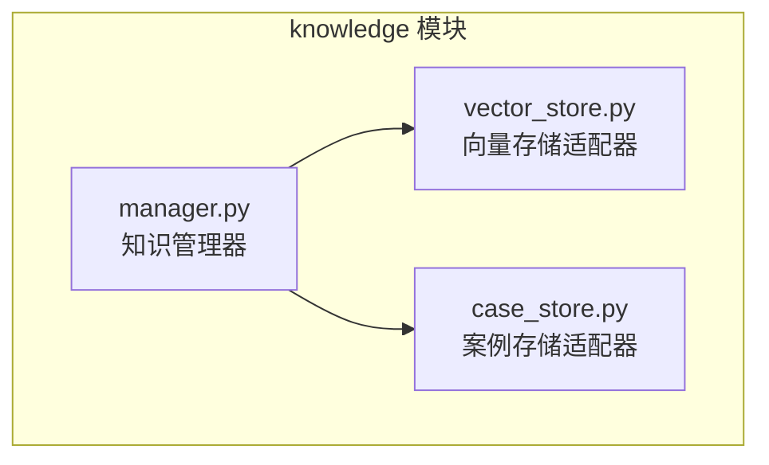
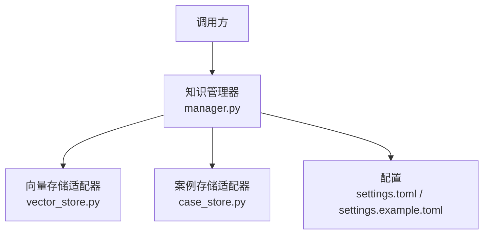
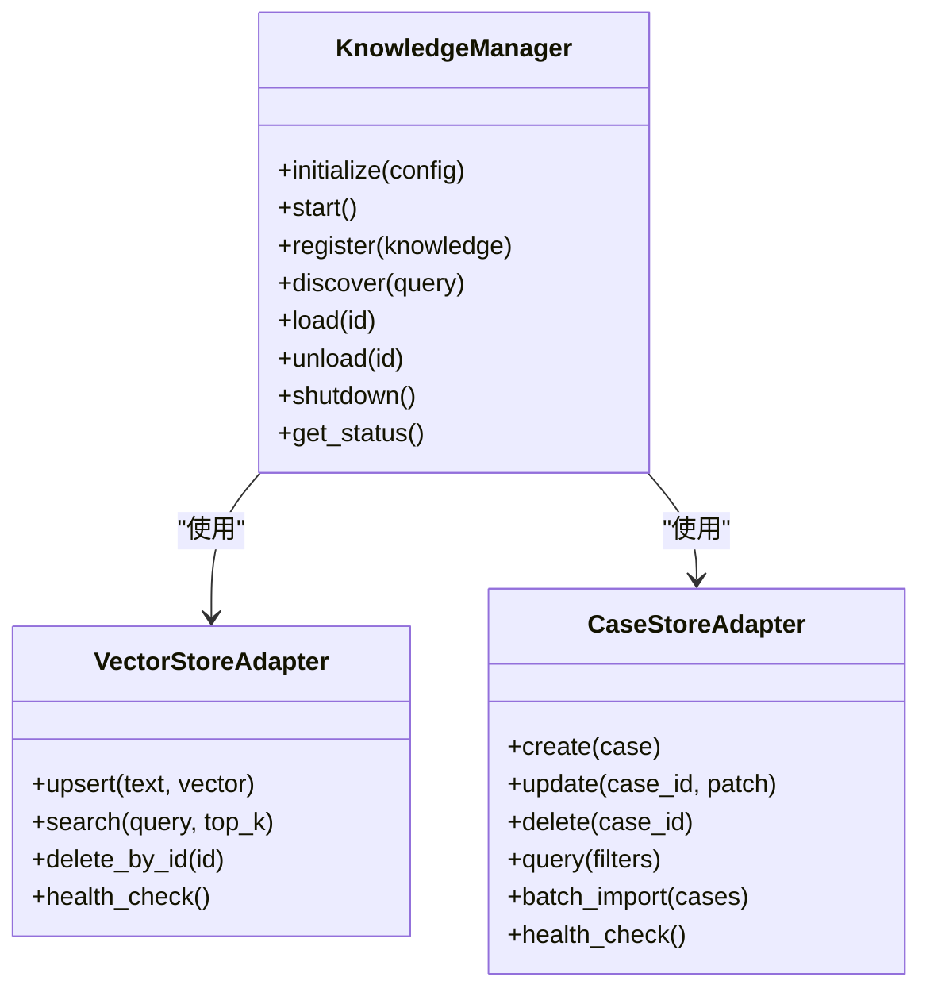
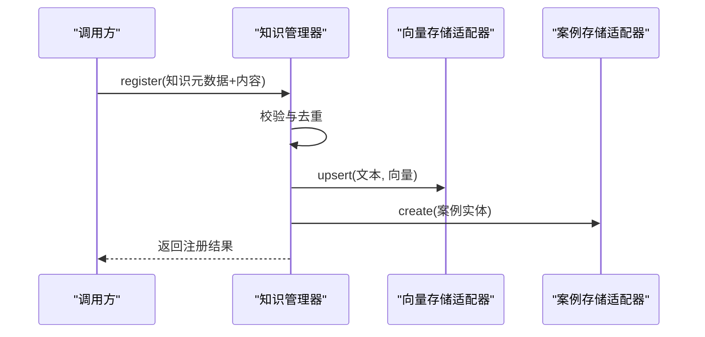
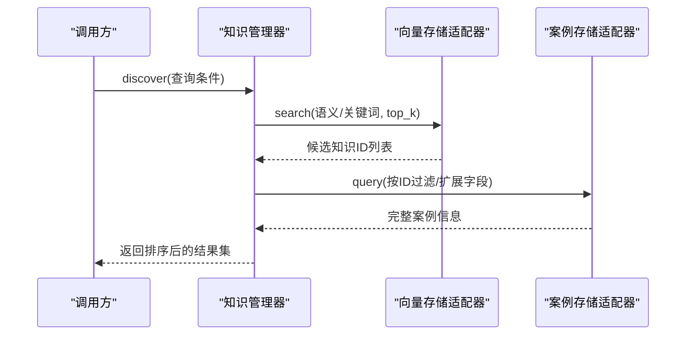
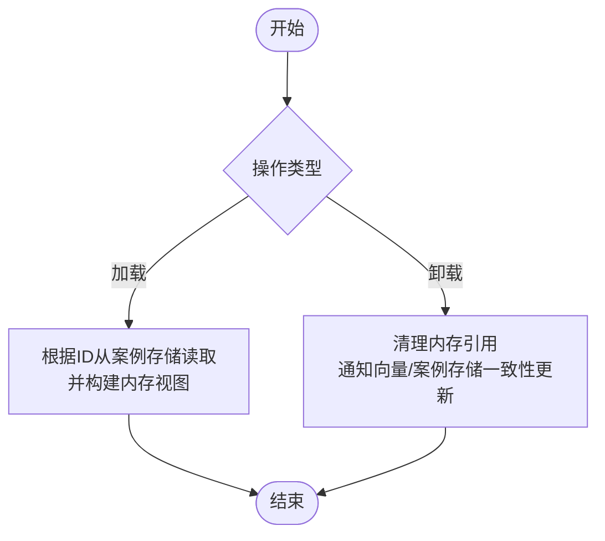
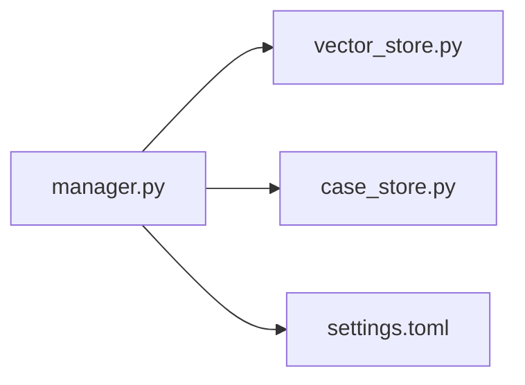

# 知识管理器

<cite>
**本文引用的文件**   
- [src/jirin/knowledge/manager.py](file://src/jirin/knowledge/manager.py)
- [src/jirin/knowledge/case_store.py](file://src/jirin/knowledge/case_store.py)
- [src/jirin/knowledge/vector_store.py](file://src/jirin/knowledge/vector_store.py)
- [config/settings.toml](file://config/settings.toml)
- [config/settings.example.toml](file://config/settings.example.toml)
</cite>

## 目录
1. [简介](#简介)
2. [项目结构](#项目结构)
3. [核心组件](#核心组件)
4. [架构总览](#架构总览)
5. [详细组件分析](#详细组件分析)
6. [依赖关系分析](#依赖关系分析)
7. [性能考虑](#性能考虑)
8. [故障排查指南](#故障排查指南)
9. [结论](#结论)
10. [附录：API 参考](#附录api-参考)

## 简介
本技术文档围绕 Jirin 的知识管理器展开，聚焦其核心职责、生命周期管理、组件协调机制与运行时状态。文档将系统阐述知识的注册、发现、加载与卸载流程，说明配置项与初始化参数，给出 API 接口参考，并详细描述与向量存储、案例存储的交互模式与错误处理策略。同时涵盖性能监控、日志记录与故障恢复的实现要点，帮助读者快速理解并高效使用知识管理器。

## 项目结构
知识管理器位于 knowledge 子模块中，包含三个关键文件：
- manager.py：知识管理器的核心编排逻辑，负责注册、发现、加载、卸载以及对外暴露的 API。
- vector_store.py：向量存储适配器，提供向量化检索、索引维护等能力。
- case_store.py：案例存储适配器，提供结构化案例数据的持久化与查询。

图表来源
- [src/jirin/knowledge/manager.py](file://src/jirin/knowledge/manager.py)
- [src/jirin/knowledge/vector_store.py](file://src/jirin/knowledge/vector_store.py)
- [src/jirin/knowledge/case_store.py](file://src/jirin/knowledge/case_store.py)

章节来源
- [src/jirin/knowledge/manager.py](file://src/jirin/knowledge/manager.py)
- [src/jirin/knowledge/vector_store.py](file://src/jirin/knowledge/vector_store.py)
- [src/jirin/knowledge/case_store.py](file://src/jirin/knowledge/case_store.py)

## 核心组件
- 知识管理器（KnowledgeManager）
  - 职责：统一编排知识的注册、发现、加载与卸载；维护运行时状态；协调向量存储与案例存储；提供对外 API。
  - 生命周期：初始化 -> 启动 -> 运行期服务 -> 关闭。
  - 状态：跟踪已注册知识、加载状态、索引健康度、统计指标等。
- 向量存储适配器（VectorStoreAdapter）
  - 职责：提供文本/语义向量的写入、更新、删除与相似度检索；维护索引一致性。
- 案例存储适配器（CaseStoreAdapter）
  - 职责：提供案例实体的增删改查、批量导入导出、按条件过滤与聚合。

章节来源
- [src/jirin/knowledge/manager.py](file://src/jirin/knowledge/manager.py)
- [src/jirin/knowledge/vector_store.py](file://src/jirin/knowledge/vector_store.py)
- [src/jirin/knowledge/case_store.py](file://src/jirin/knowledge/case_store.py)

## 架构总览
知识管理器作为中枢，向上层提供统一的 API，向下对接向量存储与案例存储。配置通过 settings.toml 注入，支持不同后端与行为开关。

图表来源
- [src/jirin/knowledge/manager.py](file://src/jirin/knowledge/manager.py)
- [src/jirin/knowledge/vector_store.py](file://src/jirin/knowledge/vector_store.py)
- [src/jirin/knowledge/case_store.py](file://src/jirin/knowledge/case_store.py)
- [config/settings.toml](file://config/settings.toml)
- [config/settings.example.toml](file://config/settings.example.toml)

## 详细组件分析

### 知识管理器（KnowledgeManager）
- 核心职责
  - 注册：接收知识元数据与内容，完成去重校验、索引准备与持久化。
  - 发现：基于关键词、标签或语义相似度进行检索。
  - 加载：按需从存储读取知识实体，构建内存视图。
  - 卸载：清理内存引用，触发底层索引与数据的一致性更新。
- 生命周期管理
  - 初始化：解析配置，创建/连接向量与案例存储，预热必要索引。
  - 启动：后台任务（如索引重建、统计收集）启动。
  - 运行期：处理注册/发现/加载/卸载请求，维护状态与指标。
  - 关闭：优雅停机，刷新缓存与索引，释放资源。
- 组件协调
  - 对向量存储：执行嵌入生成、索引写入、相似度检索。
  - 对案例存储：执行案例实体的 CRUD、批量操作与筛选。
- 运行时状态
  - 已注册知识清单、加载状态、索引健康度、错误计数、耗时统计等。

图表来源
- [src/jirin/knowledge/manager.py](file://src/jirin/knowledge/manager.py)
- [src/jirin/knowledge/vector_store.py](file://src/jirin/knowledge/vector_store.py)
- [src/jirin/knowledge/case_store.py](file://src/jirin/knowledge/case_store.py)

章节来源
- [src/jirin/knowledge/manager.py](file://src/jirin/knowledge/manager.py)

#### 注册流程

图表来源
- [src/jirin/knowledge/manager.py](file://src/jirin/knowledge/manager.py)
- [src/jirin/knowledge/vector_store.py](file://src/jirin/knowledge/vector_store.py)
- [src/jirin/knowledge/case_store.py](file://src/jirin/knowledge/case_store.py)

章节来源
- [src/jirin/knowledge/manager.py](file://src/jirin/knowledge/manager.py)

#### 发现流程

图表来源
- [src/jirin/knowledge/manager.py](file://src/jirin/knowledge/manager.py)
- [src/jirin/knowledge/vector_store.py](file://src/jirin/knowledge/vector_store.py)
- [src/jirin/knowledge/case_store.py](file://src/jirin/knowledge/case_store.py)

章节来源
- [src/jirin/knowledge/manager.py](file://src/jirin/knowledge/manager.py)

#### 加载与卸载流程

图表来源
- [src/jirin/knowledge/manager.py](file://src/jirin/knowledge/manager.py)
- [src/jirin/knowledge/case_store.py](file://src/jirin/knowledge/case_store.py)

章节来源
- [src/jirin/knowledge/manager.py](file://src/jirin/knowledge/manager.py)

### 向量存储适配器（VectorStoreAdapter）
- 职责
  - 向量化写入：接收文本与对应向量，执行 upsert。
  - 相似度检索：基于查询向量返回 top_k 候选。
  - 删除与一致性：按 ID 删除，保证与案例存储一致。
  - 健康检查：返回索引可用性与延迟指标。
- 错误处理
  - 网络/IO 异常重试与退避。
  - 索引损坏时触发重建或降级为只读。
- 性能优化
  - 批量写入、异步提交、分页检索。
  - 缓存热点查询结果。

章节来源
- [src/jirin/knowledge/vector_store.py](file://src/jirin/knowledge/vector_store.py)

### 案例存储适配器（CaseStoreAdapter）
- 职责
  - 单条与批量 CRUD：创建、更新、删除、批量导入。
  - 条件查询：按标签、时间范围、关键字等过滤。
  - 健康检查：返回存储连通性与容量指标。
- 错误处理
  - 事务性写入失败回滚。
  - 并发冲突检测与重试。
- 性能优化
  - 批量插入、索引优化、读写分离（若后端支持）。

章节来源
- [src/jirin/knowledge/case_store.py](file://src/jirin/knowledge/case_store.py)

## 依赖关系分析
- 内部依赖
  - 知识管理器依赖向量与案例存储适配器，形成松耦合的插件式结构。
- 外部依赖
  - 配置文件 settings.toml 与示例 settings.example.toml 提供后端地址、认证、超时、批大小等参数。
- 潜在循环依赖
  - 当前设计无循环依赖；各适配器仅被管理器依赖。

图表来源
- [src/jirin/knowledge/manager.py](file://src/jirin/knowledge/manager.py)
- [src/jirin/knowledge/vector_store.py](file://src/jirin/knowledge/vector_store.py)
- [src/jirin/knowledge/case_store.py](file://src/jirin/knowledge/case_store.py)
- [config/settings.toml](file://config/settings.toml)
- [config/settings.example.toml](file://config/settings.example.toml)

章节来源
- [src/jirin/knowledge/manager.py](file://src/jirin/knowledge/manager.py)
- [src/jirin/knowledge/vector_store.py](file://src/jirin/knowledge/vector_store.py)
- [src/jirin/knowledge/case_store.py](file://src/jirin/knowledge/case_store.py)
- [config/settings.toml](file://config/settings.toml)
- [config/settings.example.toml](file://config/settings.example.toml)

## 性能考虑
- 批量操作：优先使用批量写入与查询以降低 I/O 次数。
- 索引策略：合理设置 top_k、分片与缓存命中率。
- 异步与并发：非阻塞检索与写入，避免阻塞主流程。
- 监控与告警：记录延迟、吞吐、错误率，设置阈值告警。
- 资源控制：限制并发度、队列长度与内存占用上限。

[本节为通用指导，不直接分析具体文件]

## 故障排查指南
- 常见问题定位
  - 注册失败：检查向量/案例存储连通性、权限与配额。
  - 检索为空：确认索引是否就绪、查询向量维度是否正确。
  - 卸载不一致：核对删除顺序与事务回滚情况。
- 日志与诊断
  - 关键路径打点：注册、检索、加载、卸载、健康检查。
  - 指标采集：QPS、P95/P99 延迟、错误码分布。
- 恢复策略
  - 自动重试与指数退避。
  - 索引重建与数据校验。
  - 降级模式：只读或本地缓存兜底。

章节来源
- [src/jirin/knowledge/manager.py](file://src/jirin/knowledge/manager.py)
- [src/jirin/knowledge/vector_store.py](file://src/jirin/knowledge/vector_store.py)
- [src/jirin/knowledge/case_store.py](file://src/jirin/knowledge/case_store.py)

## 结论
知识管理器以清晰的职责边界与良好的生命周期管理，实现了知识的统一接入与高效检索。通过与向量与案例存储适配器的解耦协作，系统在可扩展性、可观测性与稳定性方面具备良好基础。建议在生产环境完善监控告警与自动化恢复策略，进一步提升可用性。

[本节为总结性内容，不直接分析具体文件]

## 附录：API 参考

- 初始化与生命周期
  - initialize(config): 解析配置并建立存储连接
  - start(): 启动后台任务与健康检查
  - shutdown(): 优雅关闭，刷新与释放资源

- 知识注册
  - register(knowledge): 注册新知识与案例，返回唯一标识

- 知识发现
  - discover(query): 基于语义/关键词检索，返回排序结果

- 知识加载/卸载
  - load(id): 按 ID 加载知识到内存
  - unload(id): 卸载并清理引用

- 状态与运维
  - get_status(): 返回运行时状态与指标
  - health_check(): 整体健康检查

- 向量存储适配器
  - upsert(text, vector): 写入或更新向量
  - search(query, top_k): 相似度检索
  - delete_by_id(id): 按 ID 删除
  - health_check(): 向量存储健康检查

- 案例存储适配器
  - create(case): 创建案例
  - update(case_id, patch): 部分更新
  - delete(case_id): 删除案例
  - query(filters): 条件查询
  - batch_import(cases): 批量导入
  - health_check(): 案例存储健康检查

章节来源
- [src/jirin/knowledge/manager.py](file://src/jirin/knowledge/manager.py)
- [src/jirin/knowledge/vector_store.py](file://src/jirin/knowledge/vector_store.py)
- [src/jirin/knowledge/case_store.py](file://src/jirin/knowledge/case_store.py)