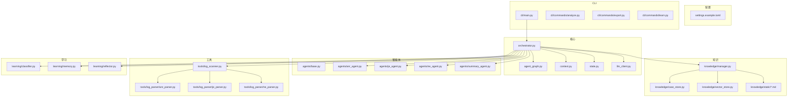
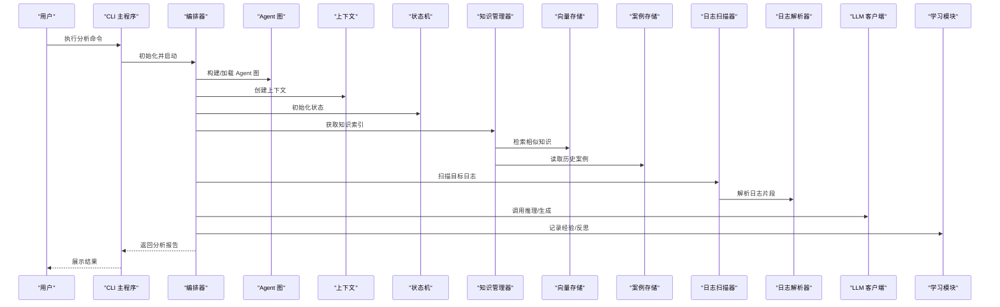
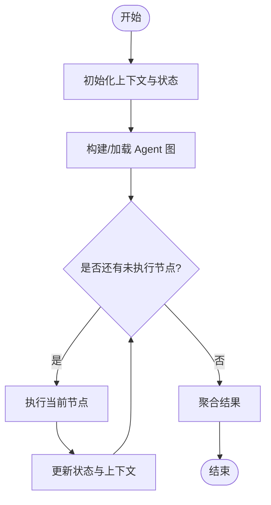
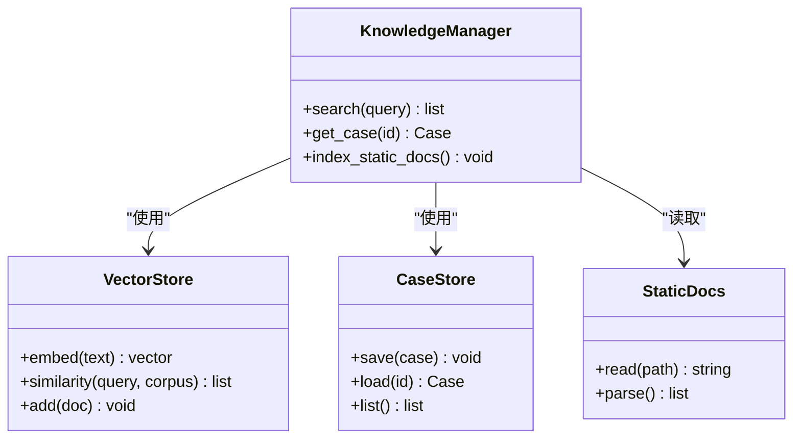
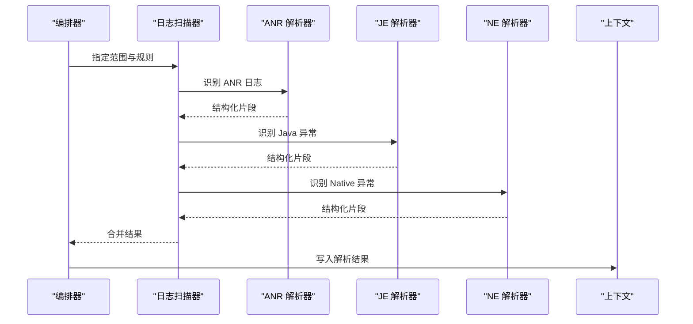
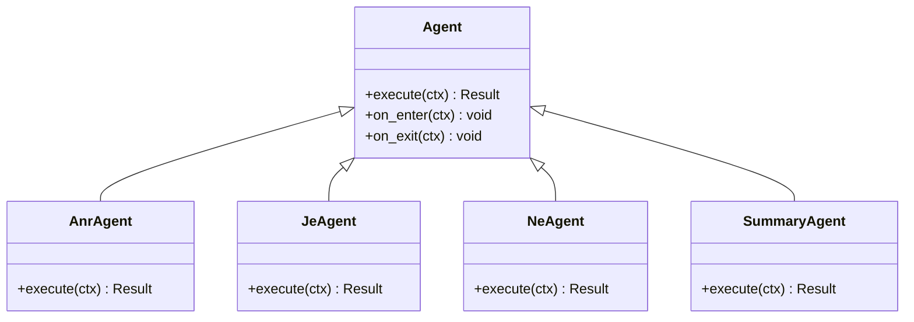
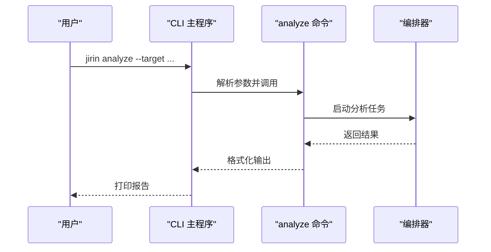
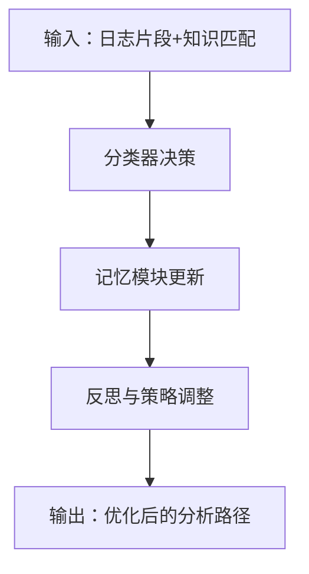
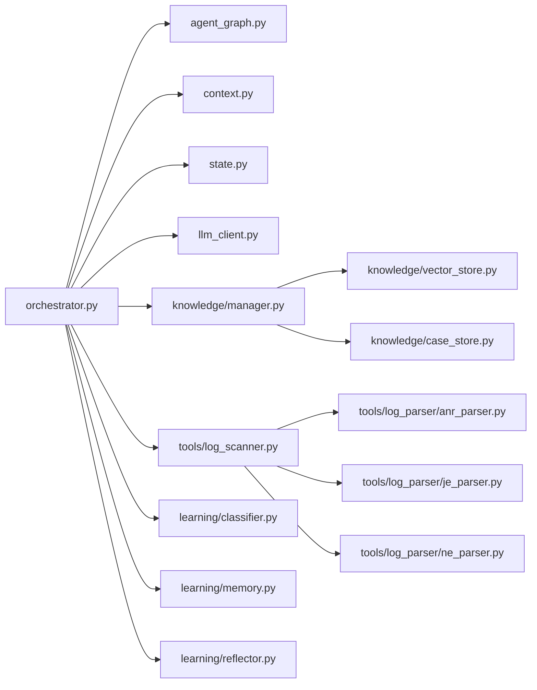

# 静态知识库系统

<cite>
**本文引用的文件**   
- [pyproject.toml](file://pyproject.toml)
- [config/settings.example.toml](file://config/settings.example.toml)
- [src/jirin/__init__.py](file://src/jirin/__init__.py)
- [src/jirin/core/orchestrator.py](file://src/jirin/core/orchestrator.py)
- [src/jirin/core/agent_graph.py](file://src/jirin/core/agent_graph.py)
- [src/jirin/core/context.py](file://src/jirin/core/context.py)
- [src/jirin/core/state.py](file://src/jirin/core/state.py)
- [src/jirin/core/llm_client.py](file://src/jirin/core/llm_client.py)
- [src/jirin/knowledge/manager.py](file://src/jirin/knowledge/manager.py)
- [src/jirin/knowledge/case_store.py](file://src/jirin/knowledge/case_store.py)
- [src/jirin/knowledge/vector_store.py](file://src/jirin/knowledge/vector_store.py)
- [src/jirin/knowledge/static/analysis_flow.md](file://src/jirin/knowledge/static/analysis_flow.md)
- [src/jirin/agents/base.py](file://src/jirin/agents/base.py)
- [src/jirin/agents/anr_agent.py](file://src/jirin/agents/anr_agent.py)
- [src/jirin/agents/je_agent.py](file://src/jirin/agents/je_agent.py)
- [src/jirin/agents/ne_agent.py](file://src/jirin/agents/ne_agent.py)
- [src/jirin/agents/summary_agent.py](file://src/jirin/agents/summary_agent.py)
- [src/jirin/cli/main.py](file://src/jirin/cli/main.py)
- [src/jirin/cli/commands/analyze.py](file://src/jirin/cli/commands/analyze.py)
- [src/jirin/cli/commands/export.py](file://src/jirin/cli/commands/export.py)
- [src/jirin/cli/commands/learn.py](file://src/jirin/cli/commands/learn.py)
- [src/jirin/tools/log_scanner.py](file://src/jirin/tools/log_scanner.py)
- [src/jirin/tools/log_parser/anr_parser.py](file://src/jirin/tools/log_parser/anr_parser.py)
- [src/jirin/tools/log_parser/je_parser.py](file://src/jirin/tools/log_parser/je_parser.py)
- [src/jirin/tools/log_parser/ne_parser.py](file://src/jirin/tools/log_parser/ne_parser.py)
- [src/jirin/learning/classifier.py](file://src/jirin/learning/classifier.py)
- [src/jirin/learning/memory.py](file://src/jirin/learning/memory.py)
- [src/jirin/learning/reflector.py](file://src/jirin/learning/reflector.py)
- [tests/test_core/test_orchestrator.py](file://tests/test_core/test_orchestrator.py)
</cite>

## 目录
1. [简介](#简介)
2. [项目结构](#项目结构)
3. [核心组件](#核心组件)
4. [架构总览](#架构总览)
5. [详细组件分析](#详细组件分析)
6. [依赖关系分析](#依赖关系分析)
7. [性能考量](#性能考量)
8. [故障排查指南](#故障排查指南)
9. [结论](#结论)
10. [附录](#附录)

## 简介
本仓库实现了一个面向崩溃与异常分析的“静态知识库系统”，围绕 Android 平台常见的 ANR、Java 异常（JE）、Native 异常（NE）等场景，提供知识检索、日志解析、智能体编排与导出能力。系统通过 CLI 驱动，结合核心编排器、Agent 图与上下文状态管理，将静态知识库与学习模块有机整合，形成从“问题输入—知识匹配—分析推理—结果输出”的闭环流程。

## 项目结构
- 配置层：提供示例配置文件，用于运行时参数与环境设置。
- 核心层：包含编排器、Agent 图、上下文与状态管理、LLM 客户端等关键基础设施。
- 知识层：静态文档库、案例存储与向量检索，支撑语义化知识查询。
- 智能体层：针对 ANR、JE、NE 以及摘要生成的专用 Agent。
- 工具层：设备交互、日志扫描与多类日志解析器。
- 学习层：分类器、记忆与反思模块，支持经验沉淀与策略优化。
- CLI 层：命令入口与子命令（分析、导出、学习等）。
- 测试层：覆盖核心编排与日志解析的关键用例。

**图表来源** 
- [config/settings.example.toml](file://config/settings.example.toml)
- [src/jirin/core/orchestrator.py](file://src/jirin/core/orchestrator.py)
- [src/jirin/core/agent_graph.py](file://src/jirin/core/agent_graph.py)
- [src/jirin/core/context.py](file://src/jirin/core/context.py)
- [src/jirin/core/state.py](file://src/jirin/core/state.py)
- [src/jirin/core/llm_client.py](file://src/jirin/core/llm_client.py)
- [src/jirin/knowledge/manager.py](file://src/jirin/knowledge/manager.py)
- [src/jirin/knowledge/case_store.py](file://src/jirin/knowledge/case_store.py)
- [src/jirin/knowledge/vector_store.py](file://src/jirin/knowledge/vector_store.py)
- [src/jirin/knowledge/static/analysis_flow.md](file://src/jirin/knowledge/static/analysis_flow.md)
- [src/jirin/agents/base.py](file://src/jirin/agents/base.py)
- [src/jirin/agents/anr_agent.py](file://src/jirin/agents/anr_agent.py)
- [src/jirin/agents/je_agent.py](file://src/jirin/agents/je_agent.py)
- [src/jirin/agents/ne_agent.py](file://src/jirin/agents/ne_agent.py)
- [src/jirin/agents/summary_agent.py](file://src/jirin/agents/summary_agent.py)
- [src/jirin/tools/log_scanner.py](file://src/jirin/tools/log_scanner.py)
- [src/jirin/tools/log_parser/anr_parser.py](file://src/jirin/tools/log_parser/anr_parser.py)
- [src/jirin/tools/log_parser/je_parser.py](file://src/jirin/tools/log_parser/je_parser.py)
- [src/jirin/tools/log_parser/ne_parser.py](file://src/jirin/tools/log_parser/ne_parser.py)
- [src/jirin/learning/classifier.py](file://src/jirin/learning/classifier.py)
- [src/jirin/learning/memory.py](file://src/jirin/learning/memory.py)
- [src/jirin/learning/reflector.py](file://src/jirin/learning/reflector.py)
- [src/jirin/cli/main.py](file://src/jirin/cli/main.py)

**章节来源**
- [pyproject.toml](file://pyproject.toml)
- [config/settings.example.toml](file://config/settings.example.toml)

## 核心组件
- 编排器（Orchestrator）：统一调度 Agent 图、上下文与状态，协调知识检索、日志解析与学习模块，驱动端到端分析流程。
- Agent 图（Agent Graph）：定义 Agent 节点与边，描述执行顺序、条件分支与数据流转。
- 上下文（Context）：承载请求级数据、中间结果与共享变量，贯穿整个分析链路。
- 状态（State）：维护全局或会话级状态机，控制流程推进与回退。
- LLM 客户端（LLM Client）：封装大模型调用接口，为 Agent 提供推理与生成能力。
- 知识管理器（Knowledge Manager）：聚合静态文档、案例与向量检索，提供统一的知识访问接口。
- 案例存储（Case Store）：持久化历史案例与经验，支持复用与对比。
- 向量存储（Vector Store）：提供语义相似度检索，加速知识定位。

**章节来源**
- [src/jirin/core/orchestrator.py](file://src/jirin/core/orchestrator.py)
- [src/jirin/core/agent_graph.py](file://src/jirin/core/agent_graph.py)
- [src/jirin/core/context.py](file://src/jirin/core/context.py)
- [src/jirin/core/state.py](file://src/jirin/core/state.py)
- [src/jirin/core/llm_client.py](file://src/jirin/core/llm_client.py)
- [src/jirin/knowledge/manager.py](file://src/jirin/knowledge/manager.py)
- [src/jirin/knowledge/case_store.py](file://src/jirin/knowledge/case_store.py)
- [src/jirin/knowledge/vector_store.py](file://src/jirin/knowledge/vector_store.py)

## 架构总览
系统以 CLI 为入口，通过编排器组织 Agent 图，结合上下文与状态机驱动分析流程；知识层提供静态文档与向量检索，工具层负责日志扫描与解析，学习层进行经验沉淀与策略优化。整体呈现“输入—编排—知识—工具—学习—输出”的分层协作模式。

**图表来源**
- [src/jirin/cli/main.py](file://src/jirin/cli/main.py)
- [src/jirin/core/orchestrator.py](file://src/jirin/core/orchestrator.py)
- [src/jirin/core/agent_graph.py](file://src/jirin/core/agent_graph.py)
- [src/jirin/core/context.py](file://src/jirin/core/context.py)
- [src/jirin/core/state.py](file://src/jirin/core/state.py)
- [src/jirin/knowledge/manager.py](file://src/jirin/knowledge/manager.py)
- [src/jirin/knowledge/vector_store.py](file://src/jirin/knowledge/vector_store.py)
- [src/jirin/knowledge/case_store.py](file://src/jirin/knowledge/case_store.py)
- [src/jirin/tools/log_scanner.py](file://src/jirin/tools/log_scanner.py)
- [src/jirin/tools/log_parser/anr_parser.py](file://src/jirin/tools/log_parser/anr_parser.py)
- [src/jirin/tools/log_parser/je_parser.py](file://src/jirin/tools/log_parser/je_parser.py)
- [src/jirin/tools/log_parser/ne_parser.py](file://src/jirin/tools/log_parser/ne_parser.py)
- [src/jirin/core/llm_client.py](file://src/jirin/core/llm_client.py)
- [src/jirin/learning/classifier.py](file://src/jirin/learning/classifier.py)
- [src/jirin/learning/memory.py](file://src/jirin/learning/memory.py)
- [src/jirin/learning/reflector.py](file://src/jirin/learning/reflector.py)

## 详细组件分析

### 编排器与 Agent 图
- 编排器负责生命周期管理、错误恢复与并行/串行调度。
- Agent 图定义节点类型、入出边与数据传递契约，支持条件跳转与重试。
- 典型流程：初始化上下文与状态 → 构建 Agent 图 → 按图执行 → 汇总结果。

**图表来源**
- [src/jirin/core/orchestrator.py](file://src/jirin/core/orchestrator.py)
- [src/jirin/core/agent_graph.py](file://src/jirin/core/agent_graph.py)
- [src/jirin/core/context.py](file://src/jirin/core/context.py)
- [src/jirin/core/state.py](file://src/jirin/core/state.py)

**章节来源**
- [src/jirin/core/orchestrator.py](file://src/jirin/core/orchestrator.py)
- [src/jirin/core/agent_graph.py](file://src/jirin/core/agent_graph.py)

### 知识管理与检索
- 知识管理器统一接入静态文档、案例与向量检索，提供语义化查询接口。
- 向量存储基于文本嵌入进行相似度匹配，提升定位效率。
- 案例存储支持历史复用，辅助快速比对与根因收敛。

**图表来源**
- [src/jirin/knowledge/manager.py](file://src/jirin/knowledge/manager.py)
- [src/jirin/knowledge/vector_store.py](file://src/jirin/knowledge/vector_store.py)
- [src/jirin/knowledge/case_store.py](file://src/jirin/knowledge/case_store.py)
- [src/jirin/knowledge/static/analysis_flow.md](file://src/jirin/knowledge/static/analysis_flow.md)

**章节来源**
- [src/jirin/knowledge/manager.py](file://src/jirin/knowledge/manager.py)
- [src/jirin/knowledge/vector_store.py](file://src/jirin/knowledge/vector_store.py)
- [src/jirin/knowledge/case_store.py](file://src/jirin/knowledge/case_store.py)

### 日志扫描与解析
- 日志扫描器负责定位与分析目标日志片段，提高解析精度。
- 解析器分别处理 ANR、JE、NE 三类日志，提取关键信息（堆栈、线程、信号等）。
- 解析结果注入上下文，供后续 Agent 分析与推理使用。

**图表来源**
- [src/jirin/tools/log_scanner.py](file://src/jirin/tools/log_scanner.py)
- [src/jirin/tools/log_parser/anr_parser.py](file://src/jirin/tools/log_parser/anr_parser.py)
- [src/jirin/tools/log_parser/je_parser.py](file://src/jirin/tools/log_parser/je_parser.py)
- [src/jirin/tools/log_parser/ne_parser.py](file://src/jirin/tools/log_parser/ne_parser.py)
- [src/jirin/core/context.py](file://src/jirin/core/context.py)

**章节来源**
- [src/jirin/tools/log_scanner.py](file://src/jirin/tools/log_scanner.py)
- [src/jirin/tools/log_parser/anr_parser.py](file://src/jirin/tools/log_parser/anr_parser.py)
- [src/jirin/tools/log_parser/je_parser.py](file://src/jirin/tools/log_parser/je_parser.py)
- [src/jirin/tools/log_parser/ne_parser.py](file://src/jirin/tools/log_parser/ne_parser.py)

### 智能体（Agent）体系
- 基类 Agent 定义统一接口与生命周期钩子。
- ANR/JE/NE 专用 Agent 聚焦各自领域的特征抽取与诊断建议。
- 摘要 Agent 对分析结果进行归纳与可视化输出。

**图表来源**
- [src/jirin/agents/base.py](file://src/jirin/agents/base.py)
- [src/jirin/agents/anr_agent.py](file://src/jirin/agents/anr_agent.py)
- [src/jirin/agents/je_agent.py](file://src/jirin/agents/je_agent.py)
- [src/jirin/agents/ne_agent.py](file://src/jirin/agents/ne_agent.py)
- [src/jirin/agents/summary_agent.py](file://src/jirin/agents/summary_agent.py)

**章节来源**
- [src/jirin/agents/base.py](file://src/jirin/agents/base.py)
- [src/jirin/agents/anr_agent.py](file://src/jirin/agents/anr_agent.py)
- [src/jirin/agents/je_agent.py](file://src/jirin/agents/je_agent.py)
- [src/jirin/agents/ne_agent.py](file://src/jirin/agents/ne_agent.py)
- [src/jirin/agents/summary_agent.py](file://src/jirin/agents/summary_agent.py)

### CLI 与命令
- 主程序提供命令路由与参数解析。
- analyze 命令驱动分析流程，export 命令输出报告，learn 命令触发学习与反思。

**图表来源**
- [src/jirin/cli/main.py](file://src/jirin/cli/main.py)
- [src/jirin/cli/commands/analyze.py](file://src/jirin/cli/commands/analyze.py)
- [src/jirin/cli/commands/export.py](file://src/jirin/cli/commands/export.py)
- [src/jirin/cli/commands/learn.py](file://src/jirin/cli/commands/learn.py)
- [src/jirin/core/orchestrator.py](file://src/jirin/core/orchestrator.py)

**章节来源**
- [src/jirin/cli/main.py](file://src/jirin/cli/main.py)
- [src/jirin/cli/commands/analyze.py](file://src/jirin/cli/commands/analyze.py)
- [src/jirin/cli/commands/export.py](file://src/jirin/cli/commands/export.py)
- [src/jirin/cli/commands/learn.py](file://src/jirin/cli/commands/learn.py)

### 学习模块
- 分类器根据日志与知识匹配结果进行分类决策。
- 记忆模块保存经验与策略，支持增量更新。
- 反思模块对失败案例进行复盘，优化后续行为。

**图表来源**
- [src/jirin/learning/classifier.py](file://src/jirin/learning/classifier.py)
- [src/jirin/learning/memory.py](file://src/jirin/learning/memory.py)
- [src/jirin/learning/reflector.py](file://src/jirin/learning/reflector.py)

**章节来源**
- [src/jirin/learning/classifier.py](file://src/jirin/learning/classifier.py)
- [src/jirin/learning/memory.py](file://src/jirin/learning/memory.py)
- [src/jirin/learning/reflector.py](file://src/jirin/learning/reflector.py)

## 依赖关系分析
- 编排器依赖 Agent 图、上下文、状态机与 LLM 客户端，构成核心控制面。
- 知识管理器依赖向量存储与案例存储，屏蔽底层差异。
- 工具层被编排器按需调用，解析结果注入上下文。
- 学习模块在分析后介入，持续优化策略。

**图表来源**
- [src/jirin/core/orchestrator.py](file://src/jirin/core/orchestrator.py)
- [src/jirin/core/agent_graph.py](file://src/jirin/core/agent_graph.py)
- [src/jirin/core/context.py](file://src/jirin/core/context.py)
- [src/jirin/core/state.py](file://src/jirin/core/state.py)
- [src/jirin/core/llm_client.py](file://src/jirin/core/llm_client.py)
- [src/jirin/knowledge/manager.py](file://src/jirin/knowledge/manager.py)
- [src/jirin/knowledge/vector_store.py](file://src/jirin/knowledge/vector_store.py)
- [src/jirin/knowledge/case_store.py](file://src/jirin/knowledge/case_store.py)
- [src/jirin/tools/log_scanner.py](file://src/jirin/tools/log_scanner.py)
- [src/jirin/tools/log_parser/anr_parser.py](file://src/jirin/tools/log_parser/anr_parser.py)
- [src/jirin/tools/log_parser/je_parser.py](file://src/jirin/tools/log_parser/je_parser.py)
- [src/jirin/tools/log_parser/ne_parser.py](file://src/jirin/tools/log_parser/ne_parser.py)
- [src/jirin/learning/classifier.py](file://src/jirin/learning/classifier.py)
- [src/jirin/learning/memory.py](file://src/jirin/learning/memory.py)
- [src/jirin/learning/reflector.py](file://src/jirin/learning/reflector.py)

**章节来源**
- [src/jirin/core/orchestrator.py](file://src/jirin/core/orchestrator.py)
- [src/jirin/knowledge/manager.py](file://src/jirin/knowledge/manager.py)
- [src/jirin/tools/log_scanner.py](file://src/jirin/tools/log_scanner.py)
- [src/jirin/learning/classifier.py](file://src/jirin/learning/classifier.py)

## 性能考量
- 向量检索应缓存热门查询结果，降低重复计算开销。
- 日志扫描可启用增量扫描与并行解析，提升吞吐。
- Agent 图支持并行执行路径，需关注资源竞争与锁粒度。
- LLM 调用建议批量与超时控制，避免阻塞主流程。
- 案例存储采用轻量索引，避免全表扫描。

[本节为通用指导，不直接分析具体文件]

## 故障排查指南
- 编排器异常：检查 Agent 图配置与上下文字段完整性，确认状态机转移合法。
- 知识检索失败：验证向量索引构建与静态文档路径正确性。
- 日志解析错误：核对日志格式与解析器规则，必要时扩展正则或模板。
- LLM 调用失败：检查网络、密钥与限流策略，增加重试与降级逻辑。
- 学习模块偏差：审查分类器训练样本与记忆更新策略，进行反思修正。

**章节来源**
- [tests/test_core/test_orchestrator.py](file://tests/test_core/test_orchestrator.py)

## 结论
静态知识库系统通过清晰的模块化设计与编排机制，将知识检索、日志解析与智能体分析有机结合，形成可扩展、可演进的崩溃与异常分析平台。建议在工程实践中持续完善向量索引质量、日志解析鲁棒性与学习策略，以提升诊断准确率与运行效率。

[本节为总结性内容，不直接分析具体文件]

## 附录
- 配置项参考：参见示例配置文件，了解运行时参数与环境变量。
- 使用示例：通过 CLI 命令执行分析、导出与学习操作。
- 扩展建议：新增 Agent、解析器与知识文档即可扩展领域能力。

[本节为补充说明，不直接分析具体文件]