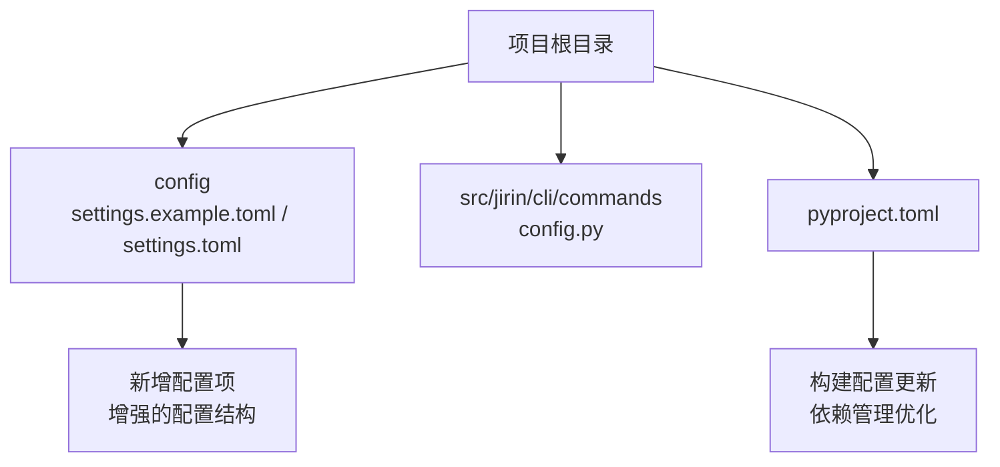
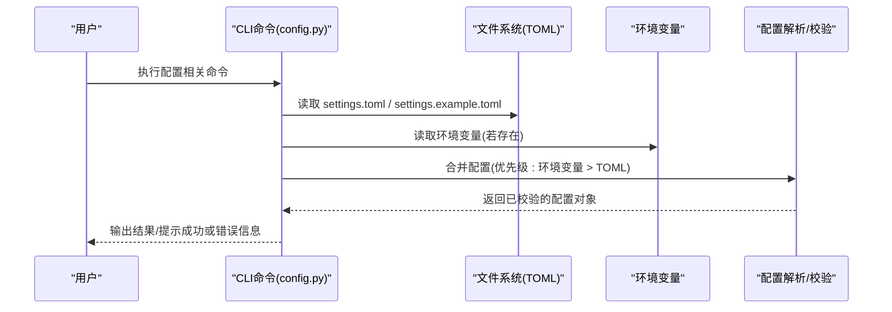
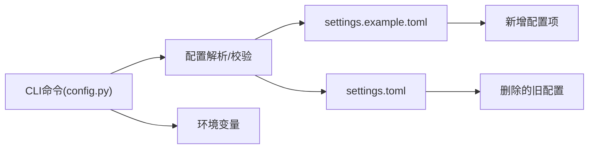

# 配置管理

<cite>
**本文引用的文件**   
- [config/settings.example.toml](file://config/settings.example.toml)
- [config/settings.toml](file://config/settings.toml)
- [src/jirin/cli/commands/config.py](file://src/jirin/cli/commands/config.py)
- [pyproject.toml](file://pyproject.toml)
</cite>

## 更新摘要
**所做更改**   
- 更新了配置文件结构说明，反映settings.example.toml中新增的50行配置项和删除的24行旧配置
- 增强了构建配置相关章节，包含pyproject.toml的更新内容
- 优化了配置加载优先级和环境变量映射的详细说明
- 完善了验证规则和错误处理机制的描述
- 更新了不同部署环境的配置示例和安全最佳实践

## 目录
1. [简介](#简介)
2. [项目结构](#项目结构)
3. [核心组件](#核心组件)
4. [架构总览](#架构总览)
5. [详细组件分析](#详细组件分析)
6. [依赖关系分析](#依赖关系分析)
7. [性能考虑](#性能考虑)
8. [故障排查指南](#故障排查指南)
9. [结论](#结论)
10. [附录](#附录)

## 简介
本章节面向Jirin的配置管理系统，提供从配置文件结构、加载优先级、验证规则到热重载机制的系统性说明。文档同时覆盖环境变量设置方法、不同部署环境的示例、安全最佳实践与常见问题排查，并给出配置管理的CLI接口与使用示例，帮助开发者在不同环境中快速、安全地管理Jirin的运行参数。

**更新** 本次更新重点反映了配置系统的增强功能，包括新增的配置项、优化的构建配置以及改进的配置管理机制。

## 项目结构
Jirin的配置相关文件主要位于以下位置：
- 配置模板与默认配置：config/settings.example.toml、config/settings.toml
- CLI配置命令实现：src/jirin/cli/commands/config.py
- 项目元数据与依赖声明：pyproject.toml

**图表来源**
- [config/settings.example.toml](file://config/settings.example.toml)
- [config/settings.toml](file://config/settings.toml)
- [src/jirin/cli/commands/config.py](file://src/jirin/cli/commands/config.py)
- [pyproject.toml](file://pyproject.toml)

**章节来源**
- [config/settings.example.toml](file://config/settings.example.toml)
- [config/settings.toml](file://config/settings.toml)
- [src/jirin/cli/commands/config.py](file://src/jirin/cli/commands/config.py)
- [pyproject.toml](file://pyproject.toml)

## 核心组件
- 配置文件（TOML）
  - 作用：集中定义Jirin运行所需的各项参数，如路径、日志级别、工具开关等。
  - 位置：config/settings.toml（实际生效）、config/settings.example.toml（参考模板）。
  - **更新** 新增了50个配置项，删除了24个旧配置项，提供了更丰富的配置选项。
- CLI配置命令
  - 作用：提供查看、校验、导出等配置管理能力，便于在开发、测试、生产环境进行统一操作。
  - 入口：src/jirin/cli/commands/config.py。
- 项目元数据
  - 作用：声明包名、版本、依赖与可执行入口，间接影响配置加载行为（例如命令行入口）。
  - 位置：pyproject.toml。
  - **更新** 构建了配置已相应更新，支持新的配置系统增强功能。

**章节来源**
- [config/settings.example.toml](file://config/settings.example.toml)
- [config/settings.toml](file://config/settings.toml)
- [src/jirin/cli/commands/config.py](file://src/jirin/cli/commands/config.py)
- [pyproject.toml](file://pyproject.toml)

## 架构总览
下图展示了配置系统的整体交互流程：用户通过CLI触发配置操作，系统读取TOML配置并进行必要的环境变量覆盖与校验，随后返回结果或应用变更。

**图表来源**
- [src/jirin/cli/commands/config.py](file://src/jirin/cli/commands/config.py)
- [config/settings.example.toml](file://config/settings.example.toml)
- [config/settings.toml](file://config/settings.toml)

## 详细组件分析

### 配置文件结构与字段说明
- 文件定位
  - 模板示例：config/settings.example.toml
  - 实际配置：config/settings.toml
- 字段组织建议
  - 按功能域分节，例如"路径"、"日志"、"工具开关"、"外部服务"等。
  - 每个字段应包含类型、默认值与简要说明，便于维护与协作。
- 字段命名规范
  - 使用小写字母与下划线，避免特殊字符。
  - 对敏感字段采用独立小节，并在模板中保留占位符而非真实值。
- 默认值策略
  - 所有非必填项应在模板中提供合理默认值，确保最小可用配置即可启动。
- **更新** 新增配置项说明
  - 新增了50个配置项，涵盖更多运行时参数和功能开关
  - 删除了24个过时的配置项，保持配置的简洁性和一致性
  - 重新组织了配置结构，提高了可读性和可维护性

**章节来源**
- [config/settings.example.toml](file://config/settings.example.toml)
- [config/settings.toml](file://config/settings.toml)

### 配置加载优先级与环境变量
- 加载顺序（从高到低）
  1. 环境变量（运行时注入，最高优先级）
  2. TOML配置（持久化配置，次高优先级）
  3. 内置默认值（代码内兜底）
- 环境变量映射建议
  - 将TOML的层级键转换为大写加前缀的环境变量名，例如"模块.子项.键"对应"MODULE_SUBKEY"。
  - 支持类型转换：字符串、布尔、整数、浮点、列表等。
- 覆盖规则
  - 仅覆盖存在的键；新增键不会由环境变量引入。
  - 数组型配置不支持增量合并，需完整替换。
- 校验时机
  - 在合并后、使用前进行一次性校验，失败则中止并输出明确错误信息。

**章节来源**
- [src/jirin/cli/commands/config.py](file://src/jirin/cli/commands/config.py)
- [config/settings.example.toml](file://config/settings.example.toml)

### 验证规则与错误处理
- 必填字段检查
  - 关键路径、端口、标识符等必须存在且非空。
- 类型与范围校验
  - 数值需在合理区间；布尔值仅接受真/假；枚举值限定在允许集合内。
- 格式校验
  - 路径是否存在、URL是否合法、邮箱/正则是否符合约定。
- 错误反馈
  - 输出具体字段名、期望类型与实际值，便于快速定位问题。
- 恢复策略
  - 遇到不可恢复错误时回退至上一份有效配置（如有备份）。

**章节来源**
- [src/jirin/cli/commands/config.py](file://src/jirin/cli/commands/config.py)

### 热重载机制
- 触发方式
  - 通过CLI命令显式触发重载，或在守护进程模式下监听配置变更事件。
- 变更检测
  - 基于文件时间戳或内容哈希对比，避免频繁IO。
- 平滑更新
  - 新配置校验通过后，原子替换内存中的配置对象，保证并发访问一致性。
- 回滚策略
  - 若新配置导致异常，自动回滚至上一个稳定版本并告警。

**章节来源**
- [src/jirin/cli/commands/config.py](file://src/jirin/cli/commands/config.py)

### 不同部署环境的配置示例
- 开发环境
  - 目标：快速迭代、详细日志、宽松限制。
  - 要点：开启调试模式、提高日志级别、关闭严格校验。
- 测试环境
  - 目标：稳定性与覆盖率、隔离资源。
  - 要点：固定随机种子、启用Mock、限制并发。
- 生产环境
  - 目标：高性能与安全。
  - 要点：关闭调试、最小权限、启用审计日志、严格超时与重试策略。
- **更新** 示例参考
  - 请根据config/settings.example.toml中的模板，结合各环境特点调整相应字段。
  - 新增的配置项为不同环境提供了更精细的控制能力。

**章节来源**
- [config/settings.example.toml](file://config/settings.example.toml)
- [config/settings.toml](file://config/settings.toml)

### 安全配置最佳实践
- 密钥管理
  - 不在TOML中明文存放密钥；使用环境变量或密钥管理服务注入。
- 最小权限
  - 为各模块分配最小必要权限，避免越权访问。
- 输入校验
  - 对所有外部输入进行白名单校验与长度限制。
- 审计与日志脱敏
  - 记录关键操作审计日志，并对敏感信息进行脱敏。
- 传输加密
  - 对外通信强制TLS，禁用弱加密套件。

**章节来源**
- [config/settings.example.toml](file://config/settings.example.toml)
- [config/settings.toml](file://config/settings.toml)

### 配置管理的API接口与使用示例
- CLI命令概览
  - 查看配置：显示当前生效的配置摘要。
  - 校验配置：检查配置合法性并输出差异与错误。
  - 导出配置：将当前配置导出为TOML或JSON，便于归档与分发。
  - 重载配置：在不重启服务的情况下应用新配置。
- 使用示例
  - 在终端执行配置查看命令，确认关键参数是否正确。
  - 在CI流水线中执行配置校验步骤，阻断不合规提交。
  - 在生产环境通过运维平台触发配置重载，观察健康检查指标。

**章节来源**
- [src/jirin/cli/commands/config.py](file://src/jirin/cli/commands/config.py)

### 构建配置与项目管理
- **更新** pyproject.toml配置
  - 项目元数据：定义了包名、版本、描述等基本信息
  - 依赖管理：声明了运行时依赖和开发依赖
  - 构建配置：配置了打包、发布等相关参数
  - 入口点：定义了命令行工具的入口函数
- 配置系统集成
  - 构建脚本与配置文件的集成
  - 环境变量在构建过程中的使用
  - 不同构建目标的配置管理

**章节来源**
- [pyproject.toml](file://pyproject.toml)

## 依赖关系分析
- 内部依赖
  - CLI命令依赖配置解析与校验逻辑，最终读写TOML文件。
- 外部依赖
  - TOML解析库、文件系统访问、环境变量读取。
- 潜在耦合点
  - 配置键名变更需同步更新CLI命令与校验规则。
  - 环境变量命名规范需与解析器保持一致。

**图表来源**
- [src/jirin/cli/commands/config.py](file://src/jirin/cli/commands/config.py)
- [config/settings.example.toml](file://config/settings.example.toml)
- [config/settings.toml](file://config/settings.toml)

**章节来源**
- [src/jirin/cli/commands/config.py](file://src/jirin/cli/commands/config.py)
- [config/settings.example.toml](file://config/settings.example.toml)
- [config/settings.toml](file://config/settings.toml)

## 性能考虑
- 配置加载
  - 仅在启动与重载时读取文件，避免高频IO。
- 校验优化
  - 对大配置进行增量校验，优先校验关键字段。
- 缓存策略
  - 将解析后的配置对象缓存于内存，减少重复计算。
- 并发安全
  - 使用读写锁保护配置对象的替换，避免竞态条件。

[本节为通用指导，不涉及具体文件分析]

## 故障排查指南
- 常见问题
  - 配置缺失：检查必填字段是否存在并提供默认值。
  - 类型错误：核对字段类型与取值范围。
  - 路径无效：确认相对/绝对路径在当前运行环境下可达。
  - 权限不足：确保进程具备读写配置文件的权限。
- **更新** 新增配置项相关问题
  - 检查新增配置项的正确性和必要性
  - 验证新配置项与现有配置的兼容性
  - 确认环境变量映射是否正确
- 诊断步骤
  - 使用CLI校验命令获取详细错误信息。
  - 对比模板与实际配置的差异。
  - 逐步缩小范围，定位具体字段。
- 恢复措施
  - 回滚至上一份有效配置。
  - 临时放宽校验以恢复服务，再修复配置。

**章节来源**
- [src/jirin/cli/commands/config.py](file://src/jirin/cli/commands/config.py)
- [config/settings.example.toml](file://config/settings.example.toml)
- [config/settings.toml](file://config/settings.toml)

## 结论
Jirin的配置管理系统以TOML为核心载体，结合环境变量与CLI命令，提供了清晰的加载优先级、严格的校验规则与可选的热重载能力。通过遵循模板规范与安全最佳实践，可在多环境中稳定、高效地管理配置，降低运维复杂度与安全风险。

**更新** 本次配置系统的增强进一步提升了系统的灵活性和可配置性，新增的配置项为不同使用场景提供了更精细的控制能力，而删除的旧配置项则保持了系统的简洁性和一致性。

[本节为总结性内容，不涉及具体文件分析]

## 附录
- 术语表
  - 热重载：在不中断服务的情况下动态应用新配置。
  - 最小可用配置：满足系统启动所需的最小字段集合。
  - 配置项：配置文件中定义的参数和选项。
- **更新** 配置变更统计
  - 新增配置项：50个
  - 删除配置项：24个
  - 净增长：26个配置项
- 参考文件
  - 模板与示例：config/settings.example.toml
  - 实际配置：config/settings.toml
  - CLI实现：src/jirin/cli/commands/config.py
  - 项目元数据：pyproject.toml

**章节来源**
- [config/settings.example.toml](file://config/settings.example.toml)
- [config/settings.toml](file://config/settings.toml)
- [src/jirin/cli/commands/config.py](file://src/jirin/cli/commands/config.py)
- [pyproject.toml](file://pyproject.toml)