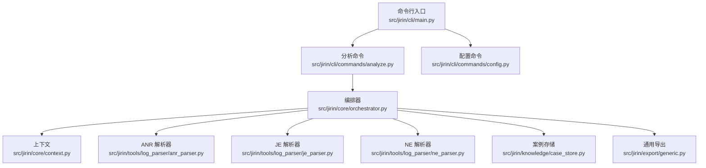
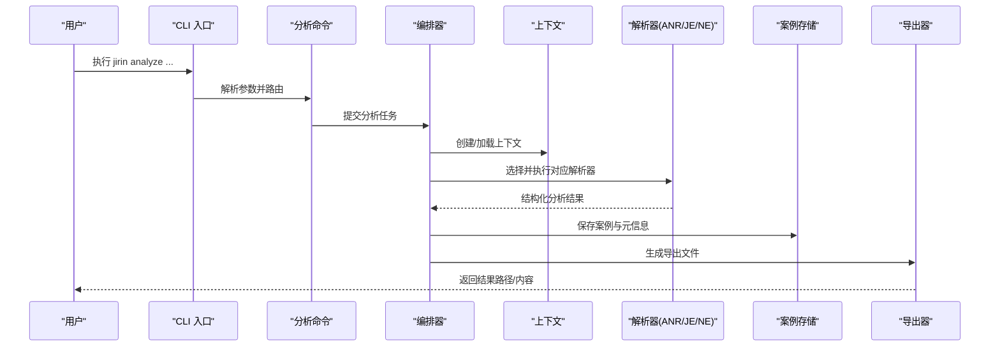
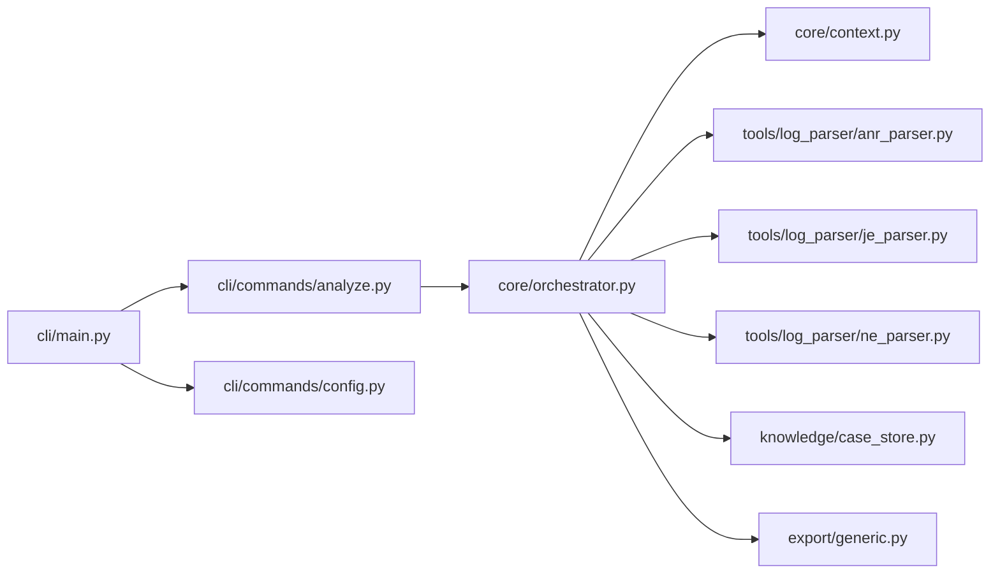

# 快速开始指南

<cite>
**本文引用的文件**   
- [pyproject.toml](file://pyproject.toml)
- [config/settings.example.toml](file://config/settings.example.toml)
- [config/settings.toml](file://config/settings.toml)
- [src/jirin/cli/main.py](file://src/jirin/cli/main.py)
- [src/jirin/cli/commands/analyze.py](file://src/jirin/cli/commands/analyze.py)
- [src/jirin/cli/commands/config.py](file://src/jirin/cli/commands/config.py)
- [src/jirin/core/orchestrator.py](file://src/jirin/core/orchestrator.py)
- [src/jirin/core/context.py](file://src/jirin/core/context.py)
- [src/jirin/tools/log_parser/anr_parser.py](file://src/jirin/tools/log_parser/anr_parser.py)
- [src/jirin/tools/log_parser/je_parser.py](file://src/jirin/tools/log_parser/je_parser.py)
- [src/jirin/tools/log_parser/ne_parser.py](file://src/jirin/tools/log_parser/ne_parser.py)
- [src/jirin/knowledge/case_store.py](file://src/jirin/knowledge/case_store.py)
- [src/jirin/export/generic.py](file://src/jirin/export/generic.py)
</cite>

## 目录
1. [简介](#简介)
2. [项目结构](#项目结构)
3. [核心组件](#核心组件)
4. [架构总览](#架构总览)
5. [详细组件分析](#详细组件分析)
6. [依赖关系分析](#依赖关系分析)
7. [性能注意事项](#性能注意事项)
8. [故障排除指南](#故障排除指南)
9. [结论](#结论)
10. [附录](#附录)

## 简介
本指南面向首次使用 Jirin 的开发者，目标是在 10 分钟内完成一次完整的崩溃日志分析体验。你将学到：
- 环境准备与安装（Python 版本、依赖、配置初始化）
- 基本命令行用法（从最简单的 ANR 分析到导出结果）
- 第一个完整流程：准备测试日志、运行分析、解读结果
- 常见问题与快速排障

Jirin 是一个面向 Android 崩溃日志（ANR、Java 异常、Native 崩溃等）的智能分析工具，内置解析器、知识管理与可插拔 Agent 编排，支持将分析结果导出为通用格式或特定技能包。

## 项目结构
仓库采用模块化组织方式，CLI 入口位于 src/jirin/cli，核心编排与上下文在 core 模块，日志解析在 tools/log_parser，知识与案例管理在 knowledge，导出能力在 export。

图表来源
- [src/jirin/cli/main.py](file://src/jirin/cli/main.py)
- [src/jirin/cli/commands/analyze.py](file://src/jirin/cli/commands/analyze.py)
- [src/jirin/cli/commands/config.py](file://src/jirin/cli/commands/config.py)
- [src/jirin/core/orchestrator.py](file://src/jirin/core/orchestrator.py)
- [src/jirin/core/context.py](file://src/jirin/core/context.py)
- [src/jirin/tools/log_parser/anr_parser.py](file://src/jirin/tools/log_parser/anr_parser.py)
- [src/jirin/tools/log_parser/je_parser.py](file://src/jirin/tools/log_parser/je_parser.py)
- [src/jirin/tools/log_parser/ne_parser.py](file://src/jirin/tools/log_parser/ne_parser.py)
- [src/jirin/knowledge/case_store.py](file://src/jirin/knowledge/case_store.py)
- [src/jirin/export/generic.py](file://src/jirin/export/generic.py)

章节来源
- [pyproject.toml](file://pyproject.toml)
- [src/jirin/cli/main.py](file://src/jirin/cli/main.py)

## 核心组件
- 命令行接口（CLI）
  - 提供 analyze、config 等子命令，负责参数解析与调用编排器。
- 编排器（Orchestrator）
  - 协调解析器、Agent、知识库与导出器，驱动端到端分析流程。
- 上下文（Context）
  - 承载单次分析任务的状态、中间产物与共享数据。
- 日志解析器
  - ANR、Java 异常（JE）、Native 崩溃（NE）三类解析器，分别处理不同崩溃类型。
- 案例存储（Case Store）
  - 持久化历史案例与元信息，便于复用与对比。
- 导出器（Exporter）
  - 将分析结果输出为通用文件或技能包，便于后续集成。

章节来源
- [src/jirin/cli/commands/analyze.py](file://src/jirin/cli/commands/analyze.py)
- [src/jirin/core/orchestrator.py](file://src/jirin/core/orchestrator.py)
- [src/jirin/core/context.py](file://src/jirin/core/context.py)
- [src/jirin/tools/log_parser/anr_parser.py](file://src/jirin/tools/log_parser/anr_parser.py)
- [src/jirin/tools/log_parser/je_parser.py](file://src/jirin/tools/log_parser/je_parser.py)
- [src/jirin/tools/log_parser/ne_parser.py](file://src/jirin/tools/log_parser/ne_parser.py)
- [src/jirin/knowledge/case_store.py](file://src/jirin/knowledge/case_store.py)
- [src/jirin/export/generic.py](file://src/jirin/export/generic.py)

## 架构总览
下图展示了从命令行输入到分析结果导出的整体流程。

图表来源
- [src/jirin/cli/main.py](file://src/jirin/cli/main.py)
- [src/jirin/cli/commands/analyze.py](file://src/jirin/cli/commands/analyze.py)
- [src/jirin/core/orchestrator.py](file://src/jirin/core/orchestrator.py)
- [src/jirin/core/context.py](file://src/jirin/core/context.py)
- [src/jirin/tools/log_parser/anr_parser.py](file://src/jirin/tools/log_parser/anr_parser.py)
- [src/jirin/tools/log_parser/je_parser.py](file://src/jirin/tools/log_parser/je_parser.py)
- [src/jirin/tools/log_parser/ne_parser.py](file://src/jirin/tools/log_parser/ne_parser.py)
- [src/jirin/knowledge/case_store.py](file://src/jirin/knowledge/case_store.py)
- [src/jirin/export/generic.py](file://src/jirin/export/generic.py)

## 详细组件分析

### 安装与环境准备
- Python 版本要求
  - 参考项目依赖声明文件以确认支持的 Python 版本范围。
- 安装依赖
  - 使用项目提供的依赖配置文件进行安装。
- 配置初始化
  - 复制示例配置到工作目录，按需修改后生效。

章节来源
- [pyproject.toml](file://pyproject.toml)
- [config/settings.example.toml](file://config/settings.example.toml)
- [config/settings.toml](file://config/settings.toml)

### 基本命令行用法
- 查看帮助
  - 通过主命令获取全局帮助与子命令列表。
- 分析崩溃日志
  - 指定日志路径与可选的输出目录，自动识别崩溃类型并执行分析。
- 管理配置
  - 查看或更新关键配置项（如模型、路径等）。

章节来源
- [src/jirin/cli/main.py](file://src/jirin/cli/main.py)
- [src/jirin/cli/commands/analyze.py](file://src/jirin/cli/commands/analyze.py)
- [src/jirin/cli/commands/config.py](file://src/jirin/cli/commands/config.py)

### 第一个完整分析流程（10 分钟入门）
步骤概览：
1) 准备测试崩溃日志
   - 准备一份 ANR、Java 异常或 Native 崩溃日志文本文件。
2) 运行分析命令
   - 使用 analyze 子命令指向日志文件，可选择输出目录。
3) 解读分析结果
   - 查看生成的结构化报告与导出文件，定位根因与建议修复。

预期输出说明：
- 控制台会打印分析进度与关键发现摘要。
- 输出目录包含结构化结果文件（例如 JSON/Markdown），以及可选的技能包文件。

章节来源
- [src/jirin/cli/commands/analyze.py](file://src/jirin/cli/commands/analyze.py)
- [src/jirin/core/orchestrator.py](file://src/jirin/core/orchestrator.py)
- [src/jirin/export/generic.py](file://src/jirin/export/generic.py)

### 高级功能入门
- 多类型日志混合分析
  - 针对同一目录下的多种崩溃日志批量分析。
- 自定义导出模板
  - 结合导出器生成符合团队规范的报告。
- 案例库复用
  - 利用案例存储进行相似问题检索与对比。

章节来源
- [src/jirin/knowledge/case_store.py](file://src/jirin/knowledge/case_store.py)
- [src/jirin/export/generic.py](file://src/jirin/export/generic.py)

## 依赖关系分析
下图展示 CLI 到核心模块与外部工具的依赖关系。

图表来源
- [src/jirin/cli/main.py](file://src/jirin/cli/main.py)
- [src/jirin/cli/commands/analyze.py](file://src/jirin/cli/commands/analyze.py)
- [src/jirin/cli/commands/config.py](file://src/jirin/cli/commands/config.py)
- [src/jirin/core/orchestrator.py](file://src/jirin/core/orchestrator.py)
- [src/jirin/core/context.py](file://src/jirin/core/context.py)
- [src/jirin/tools/log_parser/anr_parser.py](file://src/jirin/tools/log_parser/anr_parser.py)
- [src/jirin/tools/log_parser/je_parser.py](file://src/jirin/tools/log_parser/je_parser.py)
- [src/jirin/tools/log_parser/ne_parser.py](file://src/jirin/tools/log_parser/ne_parser.py)
- [src/jirin/knowledge/case_store.py](file://src/jirin/knowledge/case_store.py)
- [src/jirin/export/generic.py](file://src/jirin/export/generic.py)

## 性能注意事项
- 大日志文件建议分片或仅保留关键片段以提升解析速度。
- 合理设置并发与缓存策略（若配置项可用）以减少重复计算。
- 优先使用增量分析与案例匹配，避免全量重算。

[本节为通用指导，不直接分析具体文件]

## 故障排除指南
- 无法找到日志文件
  - 检查路径是否正确、权限是否足够。
- 解析失败或结果为空
  - 确认日志格式是否符合预期；尝试切换不同的解析器类型。
- 配置未生效
  - 确认 settings.toml 已放置于正确位置且键名无误。
- 导出文件为空
  - 检查导出目录是否存在且可写；确认分析已完成。

章节来源
- [src/jirin/cli/commands/analyze.py](file://src/jirin/cli/commands/analyze.py)
- [src/jirin/core/orchestrator.py](file://src/jirin/core/orchestrator.py)
- [src/jirin/export/generic.py](file://src/jirin/export/generic.py)

## 结论
通过以上步骤，你可以在 10 分钟内完成第一次崩溃分析。建议后续逐步探索高级功能，结合团队规范定制导出模板，并将典型案例沉淀至知识库，持续提升定位效率。

[本节为总结性内容，不直接分析具体文件]

## 附录

### 常用命令速查
- 查看帮助
  - 使用主命令获取帮助信息。
- 分析单条日志
  - 指定日志路径与输出目录进行分析。
- 批量分析
  - 指定目录，对其中所有兼容日志进行批量分析。
- 查看/更新配置
  - 列出当前配置或更新某一项。

章节来源
- [src/jirin/cli/main.py](file://src/jirin/cli/main.py)
- [src/jirin/cli/commands/analyze.py](file://src/jirin/cli/commands/analyze.py)
- [src/jirin/cli/commands/config.py](file://src/jirin/cli/commands/config.py)

### 典型输出说明
- 控制台摘要
  - 显示分析状态、关键堆栈与初步结论。
- 结构化报告
  - 包含时间线、线程快照、可疑代码片段与修复建议。
- 导出文件
  - 通用格式文件与可选技能包，便于二次加工与集成。

章节来源
- [src/jirin/export/generic.py](file://src/jirin/export/generic.py)